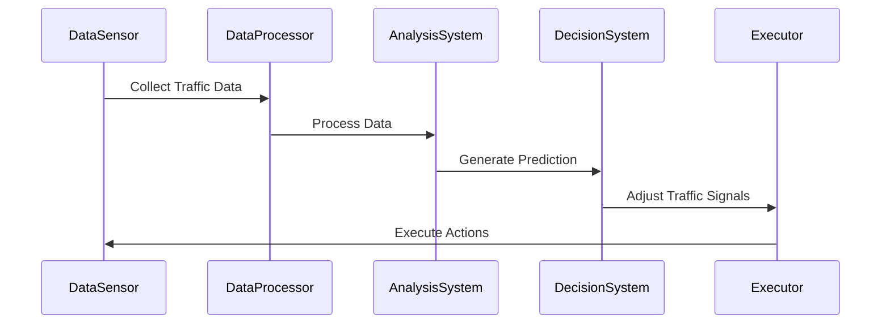
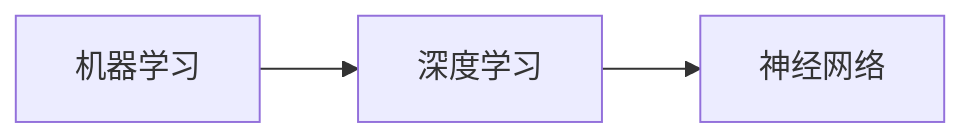
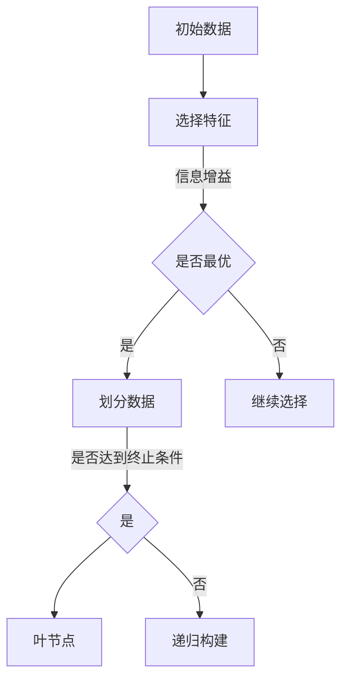
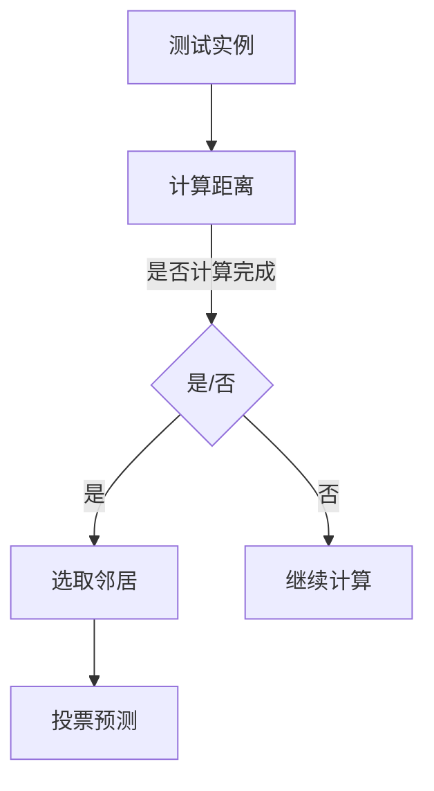
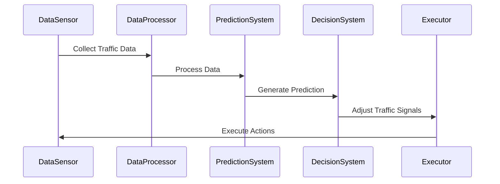
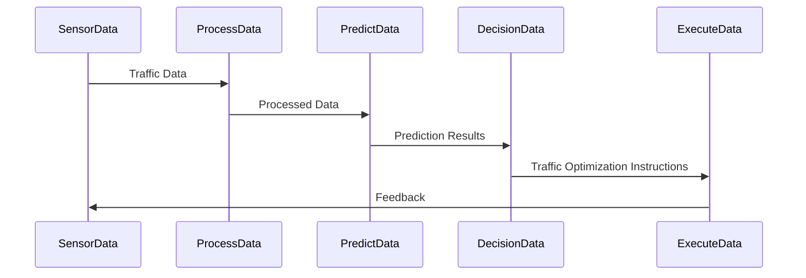

                 

### 第1章: 智能城市与交通拥堵问题

**关键词**: 智能城市，交通拥堵，AI Agent，预测，智能交通系统。

**摘要**: 本文将探讨智能城市背景下的交通拥堵问题，以及AI Agent在这其中的应用。我们首先介绍智能城市的概念和交通拥堵问题的严重性，接着引入AI Agent的基本概念，并探讨其在智能城市交通中的潜在应用前景。

## 1.1 智能城市的概念与演变

### 1.1.1 智能城市的概念

智能城市是指利用现代信息技术，特别是物联网、云计算、大数据和人工智能等技术，实现城市各项管理和服务智能化，提高城市运行效率和居民生活质量的一种新型城市形态。

智能城市的核心在于通过数据驱动和智能化管理，实现城市资源的高效配置和利用。这种新型城市发展模式不仅能够提高城市治理能力，还能提升城市居民的幸福感和满意度。

### 1.1.2 智能城市的演变历程

智能城市的发展可以追溯到20世纪末，当时的信息化建设主要集中在城市基础设施的数字化和自动化方面。随着互联网的普及和大数据技术的兴起，智能城市逐渐从局部应用扩展到全局系统，形成了今天我们所看到的综合性的智能城市体系。

智能城市的演变大致可以分为以下几个阶段：

1. **信息化阶段**：城市各个系统开始数字化和自动化，实现了基础数据采集和初步的数据分析。
2. **数字化阶段**：互联网技术的普及使得城市各系统之间的数据互联和共享成为可能，数据的利用效率大幅提升。
3. **智能化阶段**：大数据和人工智能技术的应用使得城市各项管理和服务实现了智能化，能够动态响应城市变化。

## 1.2 交通拥堵问题的背景

交通拥堵是智能城市面临的重大挑战之一。交通拥堵不仅影响城市居民的出行效率，还会导致环境污染、资源浪费和城市运行成本的上升。

### 1.2.1 交通拥堵的定义

交通拥堵是指在道路上，车辆因多种原因导致的行驶速度显著降低或者停滞的现象。

### 1.2.2 交通拥堵的影响

交通拥堵对城市的影响主要体现在以下几个方面：

1. **效率损失**：车辆在拥堵中缓慢行驶，导致出行时间延长，工作效率降低。
2. **环境污染**：交通拥堵加剧了尾气排放，对空气质量造成严重影响。
3. **资源浪费**：交通拥堵导致大量燃料的浪费，增加了能源消耗。
4. **城市成本**：交通拥堵增加了交通管理成本，同时也提高了居民的出行成本。

### 1.2.3 交通拥堵问题的挑战

交通拥堵问题的挑战主要体现在以下几个方面：

1. **数据获取与处理**：交通数据的获取和处理是交通拥堵预测和缓解的关键，然而城市交通数据量大且复杂，如何高效地处理这些数据是一个重大挑战。
2. **算法模型**：交通拥堵预测需要精确的算法模型，然而现实中的交通情况复杂多变，如何构建有效的算法模型是另一个挑战。
3. **技术集成**：智能交通系统的建设需要各种技术的集成，包括传感器技术、通信技术、大数据技术和人工智能技术等，如何将这些技术有效地结合起来是第三个挑战。

## 1.3 交通拥堵问题的应对策略

面对交通拥堵问题，我们可以采取以下策略：

1. **交通管理优化**：通过智能交通信号系统，优化交通流量，减少交通拥堵。
2. **公共交通提升**：增加公共交通投入，提高公共交通服务质量，鼓励居民选择公共交通出行。
3. **交通规划**：合理规划城市道路和交通设施，避免交通瓶颈。
4. **智能交通系统**：利用人工智能技术，如AI Agent，进行交通拥堵预测和缓解。

### 1.3.1 交通管理优化

交通管理优化是缓解交通拥堵的重要手段之一。通过智能交通信号系统，可以根据实时交通数据，动态调整交通信号灯的时长和相位，从而优化交通流量，减少交通拥堵。

### 1.3.2 公共交通提升

提升公共交通服务水平，包括增加公共交通线路、提高公共交通车辆的舒适度和运行效率，以及提供便捷的换乘服务，可以有效地减少私人车辆的使用，从而缓解交通拥堵。

### 1.3.3 交通规划

合理的城市交通规划可以避免交通瓶颈，减少交通拥堵。这包括道路网络的优化、公共交通设施的布局、停车场的规划等。

### 1.3.4 智能交通系统

智能交通系统是利用物联网、云计算、大数据和人工智能等技术，实现城市交通的智能化管理和优化。AI Agent作为智能交通系统的重要组成部分，可以在交通拥堵预测、交通流量优化、交通模式识别等方面发挥重要作用。

### 1.3.5 AI Agent在智能城市交通中的应用

AI Agent在智能城市交通中的应用主要包括以下几个方面：

1. **交通流量预测**：AI Agent可以通过分析历史交通数据，预测未来的交通流量，从而为交通管理提供依据。
2. **交通模式识别**：AI Agent可以识别不同的交通模式，为交通规划提供参考。
3. **交通拥堵预测**：AI Agent可以通过实时分析交通数据，预测交通拥堵的发生，为交通管理提供预警。
4. **交通优化**：AI Agent可以根据预测结果，动态调整交通信号灯和公共交通服务，从而优化交通流量。

## 1.4 本书结构安排与内容概述

本书分为五个部分，分别介绍智能城市与交通拥堵问题、AI Agent基础、AI Agent在交通数据挖掘中的应用、AI Agent在交通拥堵预测中的应用以及AI Agent在智能交通管理中的应用。

通过本书的学习，读者可以全面了解AI Agent在智能城市交通中的应用，掌握AI Agent的基本原理和应用方法，为智能城市建设提供技术支持。

### 1.4.1 各章节主要内容概述

1. **第1章**：介绍智能城市与交通拥堵问题的背景，引出AI Agent的概念和应用前景。
2. **第2章**：介绍AI Agent的基础知识，包括机器学习、数据预处理、深度学习和AI Agent开发工具与环境配置。
3. **第3章**：介绍AI Agent在交通数据挖掘中的应用，包括交通流量预测和交通模式识别。
4. **第4章**：介绍AI Agent在交通拥堵预测中的应用，包括交通拥堵预测模型和方法。
5. **第5章**：介绍AI Agent在智能交通管理中的应用，包括智能交通管理系统架构和功能。

### 1.4.2 学习目标与读者定位

通过本书的学习，读者可以：

1. **理解智能城市与交通拥堵问题的背景和挑战**。
2. **掌握AI Agent的基本原理和应用方法**。
3. **了解AI Agent在智能城市交通中的应用**。

本书适用于对智能城市和交通拥堵问题有一定了解，希望深入了解AI Agent在智能城市交通中的应用的技术人员和管理人员。

### 1.5 本章小结

本章介绍了智能城市的概念与演变，交通拥堵问题的背景与影响，以及AI Agent的基本概念和应用前景。通过本章的学习，读者可以对智能城市和AI Agent有一个初步的了解，为后续章节的学习打下基础。

## 1.6 核心概念与联系

在探讨智能城市与交通拥堵问题时，有几个核心概念和原理需要理解。以下是对这些概念及其相互关系的详细阐述。

### 1.6.1 智能城市与AI Agent的概念

**智能城市**：智能城市是指利用现代信息技术，如物联网、云计算、大数据和人工智能等，实现城市各项管理和服务智能化，提高城市运行效率和居民生活质量的一种新型城市形态。智能城市的核心在于通过数据驱动和智能化管理，实现城市资源的高效配置和利用。

**AI Agent**：AI Agent是指一种人工智能实体，能够感知环境、制定行动策略并采取行动，以达到预定的目标。AI Agent通常具有自主决策能力、学习能力和适应能力，能够在复杂的动态环境中进行自主运作。

### 1.6.2 智能城市与AI Agent的联系

智能城市与AI Agent之间存在着密切的联系。AI Agent作为智能城市的重要组成部分，能够在交通、能源、环境、安全等多个领域发挥作用，实现智能管理和优化。

1. **数据驱动**：智能城市的发展依赖于大量的数据采集和分析，而AI Agent能够通过实时数据感知环境变化，为城市管理和决策提供依据。
2. **智能化管理**：AI Agent可以自主学习和优化决策策略，为城市交通、能源等系统的管理提供智能支持，提高管理效率和效果。
3. **自适应能力**：AI Agent具有自适应能力，能够在不断变化的复杂环境中进行调整和优化，适应城市发展的需求。

### 1.6.3 概念属性特征对比表格

以下是一个对比表格，用于展示智能城市和AI Agent的主要属性和特征：

| 特征           | 智能城市                         | AI Agent                         |
| -------------- | -------------------------------- | -------------------------------- |
| 核心技术       | 物联网、云计算、大数据、人工智能 | 机器学习、深度学习、自然语言处理 |
| 功能           | 城市管理和服务智能化           | 自主感知、决策、行动            |
| 数据处理       | 数据采集、存储、分析           | 数据感知、学习、决策            |
| 应用领域       | 交通、能源、环境、安全等        | 交通流量预测、交通模式识别、交通管理优化等 |
| 目标           | 提高城市运行效率和居民生活质量 | 实现预定的目标，如交通流量优化、拥堵预测等 |
| 自适应能力     | 较强，通过智能化手段进行优化    | 极强，具备自主学习和适应能力    |

### 1.6.4 ER实体关系图架构

为了更直观地理解智能城市与AI Agent之间的实体关系，我们可以使用ER（实体-关系）图来描述。以下是一个简化的ER图，展示了智能城市中的几个关键实体及其相互关系：

```mermaid
erDiagram
  TrafficData -->|uses| TrafficModel
  TrafficModel -->|uses| TrafficPrediction
  TrafficPrediction -->|uses| TrafficManagement
  TrafficManagement -->|uses| AI-Agent
  AI-Agent -->|controls| TrafficSignal
  AI-Agent -->|monitors| VehicleFlow
```

- **TrafficData**：代表交通数据，包括车辆流量、速度、密度等。
- **TrafficModel**：代表交通模型，用于对交通数据进行建模和分析。
- **TrafficPrediction**：代表交通预测结果，基于交通模型和数据进行预测。
- **TrafficManagement**：代表交通管理系统，负责交通信号控制和交通流量优化。
- **AI-Agent**：代表AI Agent，是交通管理系统的核心组成部分，负责感知交通数据、预测交通流量、控制交通信号等。
- **TrafficSignal**：代表交通信号灯，是AI-Agent控制的实体。
- **VehicleFlow**：代表车辆流量，是AI-Agent监测的实体。

通过这个ER图，我们可以清晰地看到AI-Agent在智能城市交通系统中的核心地位和作用。

### 1.6.5 智能城市交通系统的整体架构

智能城市交通系统的整体架构可以分为以下几个层次：

1. **数据采集层**：通过传感器、摄像头等设备实时采集交通数据，如车辆流量、速度、密度等。
2. **数据处理层**：对采集到的数据进行清洗、归一化、特征提取等处理，为后续分析提供高质量的数据。
3. **分析预测层**：利用机器学习和深度学习等技术，对交通数据进行建模和分析，进行交通流量预测、交通模式识别等。
4. **决策控制层**：基于预测结果，动态调整交通信号灯、公共交通服务等，实现交通流量优化。
5. **执行层**：交通信号灯、公共交通系统等实体按照决策层的指令进行操作，实现智能交通管理。

整体架构如图所示：



通过这样的整体架构，AI-Agent可以在智能城市交通系统中发挥重要作用，实现交通拥堵的预测和缓解。

### 1.6.6 交通拥堵问题的边界与外延

**边界**：交通拥堵问题的边界主要涉及哪些具体情境和条件。例如，交通拥堵通常发生在城市道路、高速公路、交通枢纽等地方，涉及车辆、行人、公共交通工具等多种交通参与者。同时，交通拥堵的发生还受到天气、事故、施工等多种因素的影响。

**外延**：交通拥堵问题的外延则涉及更广泛的影响和关联。交通拥堵不仅影响城市交通系统的正常运行，还影响到城市经济的发展、居民的生活质量、环境质量的恶化等多个方面。因此，解决交通拥堵问题不仅仅是交通管理的问题，更是城市综合治理的重要内容。

### 1.6.7 智能城市交通系统的核心要素组成

智能城市交通系统的核心要素主要包括以下几个方面：

1. **交通数据采集系统**：通过传感器、摄像头等设备实时采集交通流量、速度、密度等数据。
2. **数据处理与分析系统**：对采集到的交通数据进行分析、清洗、归一化、特征提取等处理，为后续分析提供高质量的数据。
3. **交通预测与优化系统**：利用机器学习和深度学习等技术，对交通数据进行建模和分析，进行交通流量预测、交通模式识别等，为交通管理提供决策支持。
4. **交通管理系统**：根据预测结果和交通数据分析，动态调整交通信号灯、公共交通服务等，实现交通流量优化。
5. **执行层**：包括交通信号灯、公共交通系统等实体，按照决策层的指令进行操作，实现智能交通管理。

通过这些核心要素的协同工作，智能城市交通系统可以有效地解决交通拥堵问题，提高城市交通运行效率和居民生活质量。

### 1.6.8 交通数据挖掘的基本概念与方法

**基本概念**：

- **交通数据挖掘**：交通数据挖掘是利用数据挖掘技术，从大量的交通数据中提取出有价值的信息和知识的过程。这些信息可以帮助交通管理部门更好地理解交通状况、预测交通趋势和优化交通管理策略。

- **数据源**：交通数据挖掘的数据源主要包括传感器数据、车辆轨迹数据、交通流量数据、交通事件数据等。

- **目标**：交通数据挖掘的目标包括交通流量预测、交通模式识别、交通拥堵检测、路径优化等。

**方法**：

- **数据预处理**：包括数据清洗、数据归一化、数据特征提取等，旨在提高数据质量和分析效果。

- **统计分析**：通过统计分析方法，如回归分析、聚类分析、关联规则挖掘等，从交通数据中提取出潜在的模式和关系。

- **机器学习**：利用机器学习方法，如监督学习、非监督学习和强化学习，构建交通预测和优化的模型。

- **深度学习**：利用深度学习方法，如卷积神经网络（CNN）、循环神经网络（RNN）、生成对抗网络（GAN）等，进行更复杂和高效的数据分析和模型构建。

通过这些基本概念和方法的综合应用，交通数据挖掘可以为智能城市交通系统提供重要的数据支持和决策依据。

### 1.7 AI Agent的基本概念

**AI Agent的定义**：

AI Agent（人工智能代理）是一种能够自主感知环境、制定行动策略并采取行动，以实现预定目标的人工智能实体。它通常具有以下几个核心特征：

1. **自主性**：AI Agent能够自主地感知环境，独立地制定行动策略，并自主地执行这些策略。
2. **学习性**：AI Agent能够从环境中学习，不断地优化自己的行为策略，提高决策的准确性和效率。
3. **适应性**：AI Agent能够适应不断变化的复杂环境，动态调整自己的行为策略，以适应环境的变化。

**AI Agent的工作原理**：

AI Agent的工作原理可以分为以下几个步骤：

1. **感知环境**：AI Agent通过传感器和监测设备收集环境数据，如交通流量、交通事件、天气状况等。
2. **信息处理**：AI Agent对收集到的信息进行预处理和分析，提取出关键特征和模式，形成对环境的理解。
3. **决策制定**：AI Agent根据对环境的理解和预定的目标，使用学习到的策略和算法，制定最优的行动策略。
4. **行动执行**：AI Agent执行制定的行动策略，如调整交通信号灯、优化交通流量、调度公共交通等。
5. **反馈修正**：AI Agent在执行行动后，根据环境反馈和行动结果，对策略进行修正和优化，以提高未来行动的准确性。

**AI Agent的分类**：

AI Agent可以根据不同的分类标准进行分类，以下是几种常见的分类方法：

1. **根据功能分类**：
   - **感知型AI Agent**：主要负责感知环境信息，如智能交通监控系统。
   - **决策型AI Agent**：主要负责制定行动策略，如智能交通信号控制系统。
   - **执行型AI Agent**：主要负责执行行动策略，如自动驾驶车辆。

2. **根据学习方式分类**：
   - **基于规则的方法**：AI Agent基于预设的规则进行决策，如交通信号控制系统。
   - **基于模型的方法**：AI Agent基于学习到的模型进行决策，如深度学习算法。

3. **根据工作环境分类**：
   - **静态环境AI Agent**：工作环境固定，如智能家居系统。
   - **动态环境AI Agent**：工作环境变化多样，如自动驾驶车辆。

AI Agent作为一种人工智能实体，在智能城市交通系统中发挥着重要的作用。通过自主感知、学习适应和决策执行，AI Agent能够有效提高交通管理效率，缓解交通拥堵问题，为智能城市建设提供强有力的技术支持。

### 1.8 AI Agent在智能城市交通中的应用前景

AI Agent在智能城市交通中的应用前景十分广阔，其技术潜力可以归结为以下几个方面：

#### 1.8.1 交通流量预测

AI Agent可以通过分析历史交通数据和实时监控数据，预测未来的交通流量。这种方法不仅能够帮助交通管理部门提前识别交通拥堵风险，还可以为公共交通提供调度支持，优化交通信号控制，从而有效缓解交通压力。

#### 1.8.2 交通模式识别

AI Agent可以识别不同的交通模式，如高峰期流量、夜间低峰期流量、特殊事件引发的异常流量等。这种能力使得AI Agent能够针对不同场景采取定制化的交通管理策略，提高交通系统的灵活性和响应速度。

#### 1.8.3 交通拥堵预测

基于深度学习和强化学习算法的AI Agent可以实时分析交通数据，预测交通拥堵的发生。通过提前预警，交通管理部门可以及时采取调控措施，如动态调整交通信号灯、优先调度公共交通等，从而减轻拥堵程度。

#### 1.8.4 交通优化

AI Agent可以通过不断学习和优化决策模型，为交通流量优化提供智能支持。例如，AI Agent可以实时调整交通信号灯的时长和相位，根据实时交通状况进行优化，从而提高道路通行效率。

#### 1.8.5 个性化出行建议

AI Agent可以根据用户的出行习惯和偏好，提供个性化的出行建议。例如，在拥堵高峰期间，AI Agent可以建议用户选择公共交通或推荐最佳行驶路线，以减少出行时间。

#### 1.8.6 自动驾驶

在自动驾驶领域，AI Agent可以与自动驾驶车辆协同工作，实现高效的交通管理和路线规划。AI Agent能够实时感知交通状况，调整自动驾驶车辆的行驶策略，确保行驶安全、顺畅。

总之，AI Agent在智能城市交通中的应用前景十分广阔，它不仅能够提高交通管理的效率和灵活性，还能为居民提供更智能、更便捷的出行体验。随着技术的不断进步，AI Agent在智能城市交通中的应用将会更加深入和广泛。

### 1.9 本章小结

本章介绍了智能城市的概念、交通拥堵问题的背景与影响，以及AI Agent的基本概念和应用前景。通过对智能城市和AI Agent的深入探讨，我们认识到AI Agent在智能城市交通中的重要角色，它不仅能够提升交通管理的效率，还能够优化交通流量，缓解交通拥堵问题。本章内容为后续章节的深入讨论奠定了基础，使读者对智能城市交通系统和AI Agent的应用有了初步的了解。

## 2.1 机器学习基本原理

**机器学习（Machine Learning）** 是指使计算机通过数据学习并改进其性能的过程，不依赖于明确的编程指令。它是一种使计算机能够从数据中学习规律、模式和关联的技术，从而在新的数据集上做出预测和决策。

### 2.1.1 机器学习概述

机器学习的关键在于**模型**（Model），这是一个能够对数据进行分析并生成预测的算法。机器学习的过程可以分为以下几个步骤：

1. **数据收集**：收集大量的数据，这些数据可以是结构化的（如数据库中的表格）或非结构化的（如图像、文本、声音等）。
2. **数据预处理**：清洗数据，处理缺失值、异常值，并进行数据归一化、特征提取等操作，以提升数据质量。
3. **模型选择**：根据问题的性质和数据的特点，选择合适的机器学习模型。常见的模型有线性回归、决策树、支持向量机、神经网络等。
4. **模型训练**：使用训练数据集对选定的模型进行训练，使模型能够学习和提取数据的规律。
5. **模型评估**：使用验证数据集对训练好的模型进行评估，评估模型在未知数据上的性能。
6. **模型优化**：根据评估结果对模型进行调整，以提高其准确性和泛化能力。
7. **模型应用**：将优化后的模型应用于新的数据集，进行预测或决策。

### 2.1.2 监督学习与非监督学习

**监督学习（Supervised Learning）** 是一种机器学习方法，它使用标记的数据集来训练模型。标记数据意味着每个输入数据都有一个已知的输出结果（标签），模型通过学习这些输入和输出之间的关联来预测新的数据。

**非监督学习（Unsupervised Learning）** 则不使用标记数据集，而是通过发现数据中的隐含模式或结构来学习。常见的非监督学习方法包括聚类、降维和关联规则挖掘等。

**监督学习** 的特点如下：

- **有标签数据**：每个输入都有一个对应的输出标签。
- **预测目标明确**：模型的目的是预测新的输入数据的输出。
- **评估标准明确**：通常使用准确率、召回率、F1分数等指标来评估模型性能。

**非监督学习** 的特点如下：

- **无标签数据**：输入数据没有预先定义的输出标签。
- **模式发现**：模型的目的是发现数据中的隐含结构和模式。
- **评估标准灵活**：评估标准通常依赖于具体应用，如聚类质量、降维效果等。

### 2.1.3 强化学习

**强化学习（Reinforcement Learning）** 是一种机器学习方法，它通过试错和反馈来学习最优策略。强化学习的主要特点是：

- **智能体（Agent）**：智能体是执行动作并从环境中接收反馈的实体。
- **环境（Environment）**：环境是智能体执行动作并接收反馈的场所。
- **状态（State）**：状态是智能体在某一时刻所处的环境状态。
- **动作（Action）**：动作是智能体可以执行的行为。
- **奖励（Reward）**：奖励是智能体执行动作后从环境中获得的反馈信号。

强化学习的过程可以分为以下几个步骤：

1. **智能体初始状态**：智能体随机选择一个状态。
2. **智能体执行动作**：智能体在当前状态下执行一个动作。
3. **环境反馈**：环境根据智能体的动作产生一个状态转移和奖励信号。
4. **智能体更新策略**：智能体根据奖励信号和策略更新算法调整其行为策略。
5. **重复步骤2-4**：智能体不断重复执行动作、接收反馈和调整策略，以逐渐学习到最优策略。

### 2.1.4 机器学习模型的选择原则

在选择机器学习模型时，需要考虑以下几个原则：

- **问题性质**：根据问题的性质选择合适的模型。例如，回归问题可以选择线性回归、决策树等模型；分类问题可以选择逻辑回归、支持向量机等模型。
- **数据特征**：分析数据特征，选择能够有效提取和利用数据的模型。例如，对于图像数据，卷积神经网络（CNN）是一个很好的选择；对于序列数据，循环神经网络（RNN）或长短时记忆网络（LSTM）则更为适用。
- **模型复杂性**：根据数据的复杂性和模型的计算资源选择合适的模型复杂度。过于复杂的模型可能导致过拟合，而过于简单的模型可能无法捕捉数据中的特征。
- **评估指标**：选择合适的评估指标来评估模型性能，如准确率、召回率、F1分数等。

### 2.1.5 机器学习在实际应用中的挑战

在实际应用中，机器学习面临以下挑战：

- **数据质量**：数据质量直接影响到模型的效果。处理缺失值、异常值和噪声数据是机器学习中的重要步骤。
- **模型解释性**：许多复杂的机器学习模型（如深度神经网络）缺乏解释性，难以理解模型的工作原理和决策过程。
- **过拟合**：模型在训练数据上表现良好，但在新的数据上表现不佳，这种现象称为过拟合。为了避免过拟合，需要采取正则化、交叉验证等方法。
- **计算资源**：训练复杂的机器学习模型通常需要大量的计算资源和时间。对于大规模数据集和高复杂度的模型，可能需要分布式计算和优化算法。

### 2.1.6 机器学习与人工智能的关系

机器学习是人工智能（AI）的一个重要分支，它通过使计算机从数据中学习来提升其智能水平。机器学习为人工智能提供了强大的工具和算法，使得计算机能够实现更复杂的任务，如语音识别、图像识别、自动驾驶等。

总之，机器学习基本原理包括数据收集、预处理、模型选择、训练和评估等步骤。通过监督学习、非监督学习和强化学习等方法，机器学习能够使计算机从数据中学习并做出预测和决策。在实际应用中，机器学习面临数据质量、模型解释性和计算资源等挑战，但它是实现人工智能的关键技术之一。

### 2.2 数据预处理方法

数据预处理是机器学习过程中至关重要的一环，其目的在于提高数据质量和减少数据中的噪声，从而提升模型的性能和泛化能力。数据预处理包括数据清洗、数据归一化、数据特征提取等多个步骤。

#### 2.2.1 数据清洗

数据清洗是数据预处理的首要步骤，其主要任务包括处理缺失值、异常值和噪声数据。以下是一些常见的数据清洗方法：

- **缺失值处理**：缺失值处理方法包括删除含有缺失值的记录、使用平均值、中位数或众数填充缺失值、使用算法预测缺失值等。
- **异常值处理**：异常值处理包括识别和删除或修正异常值。常见的方法有基于统计学方法（如箱线图、Z分数等）和基于聚类方法（如DBSCAN等）。
- **噪声处理**：噪声处理旨在减少数据中的随机噪声。常见的噪声处理方法包括平滑技术（如移动平均、低通滤波等）和去噪算法（如小波变换、中值滤波等）。

#### 2.2.2 数据归一化

数据归一化是将不同特征的数据范围统一到一个标准范围内，以消除特征之间的尺度差异。常见的归一化方法包括最小-最大缩放、Z分数缩放和指数变换等。

- **最小-最大缩放**：将数据映射到[0, 1]范围内，公式为：
  $$
  x_{\text{normalized}} = \frac{x - x_{\text{min}}}{x_{\text{max}} - x_{\text{min}}}
  $$
  其中，$x_{\text{normalized}}$ 是归一化后的值，$x$ 是原始值，$x_{\text{min}}$ 和 $x_{\text{max}}$ 分别是数据的最小值和最大值。

- **Z分数缩放**：将数据映射到标准正态分布，公式为：
  $$
  z = \frac{x - \mu}{\sigma}
  $$
  其中，$z$ 是Z分数，$x$ 是原始值，$\mu$ 是平均值，$\sigma$ 是标准差。

- **指数变换**：将数据通过指数函数变换到新的范围内，公式为：
  $$
  x_{\text{exponential}} = e^{x}
  $$
  这种方法常用于处理负数数据和增加数据差异。

#### 2.2.3 数据特征提取

数据特征提取是从原始数据中提取出对模型训练有帮助的关键特征的过程。特征提取方法包括以下几种：

- **离散特征编码**：对于离散特征，可以使用独热编码（One-Hot Encoding）或标签编码（Label Encoding）。
  - **独热编码**：将离散特征转换为二进制向量，每个特征值对应一个向量分量。例如，对于特征{男，女}，独热编码为{100，001}。
  - **标签编码**：将离散特征映射到整数，通常用于分类特征。

- **连续特征变换**：对于连续特征，可以通过归一化、标准化等方法进行变换，以消除不同特征之间的尺度差异。
- **主成分分析（PCA）**：PCA是一种降维技术，通过线性变换将高维数据映射到低维空间，同时保留大部分信息。PCA能够减少数据维度，提高模型训练速度。
- **特征选择**：通过选择对模型训练影响较大的特征，减少冗余特征，提高模型泛化能力。常见的方法有基于信息增益、基于卡方检验、基于相关性分析等。

#### 2.2.4 数据预处理的步骤

数据预处理的步骤通常包括：

1. **数据导入**：将原始数据导入到数据分析环境中，如Pandas库。
2. **数据探索**：分析数据的基本统计信息，如均值、方差、缺失值比例等，以了解数据特征。
3. **数据清洗**：处理缺失值、异常值和噪声数据。
4. **数据归一化**：对数据进行归一化处理，以消除特征之间的尺度差异。
5. **特征提取**：从原始数据中提取关键特征。
6. **数据存储**：将预处理后的数据存储为新的数据集，以供模型训练使用。

通过这些步骤，数据预处理能够显著提高模型训练的效果，为后续的机器学习任务打下坚实的基础。

### 2.3 深度学习基础

深度学习（Deep Learning）是机器学习的一个重要分支，其核心思想是通过构建复杂的神经网络模型，模拟人脑的神经元连接和神经传递机制，从而实现数据的自动特征提取和模式识别。深度学习在图像识别、自然语言处理、语音识别等领域取得了显著的突破，成为当前人工智能领域的热门研究方向。

#### 2.3.1 神经网络基础

神经网络（Neural Network，NN）是一种模仿生物神经系统的计算模型，其基本构建模块是神经元（Neuron）。一个简单的神经网络通常由输入层、隐藏层和输出层组成。神经元之间通过权重（weight）连接，每个神经元的输出通过激活函数（activation function）进行处理。

**神经元的运算过程**：

1. **加权求和**：每个输入乘以其对应的权重，然后对所有输入加权求和。
   $$
   z = \sum_{i=1}^{n} x_i \cdot w_i
   $$
   其中，$x_i$ 是输入值，$w_i$ 是对应的权重，$n$ 是输入数量。

2. **应用激活函数**：对加权求和的结果应用激活函数，如sigmoid函数、ReLU函数、Tanh函数等。
   $$
   a = f(z)
   $$
   其中，$a$ 是激活值，$f(z)$ 是激活函数。

**常见的激活函数**：

- **sigmoid函数**：
  $$
  f(z) = \frac{1}{1 + e^{-z}}
  $$
  sigmoid函数将输出范围映射到（0,1），常用于分类问题。

- **ReLU函数**（Rectified Linear Unit）：
  $$
  f(z) = \max(0, z)
  $$
  ReLU函数具有简单的计算过程和良好的梯度传播特性，常用于隐藏层。

- **Tanh函数**：
  $$
  f(z) = \frac{e^z - e^{-z}}{e^z + e^{-z}}
  $$
  Tanh函数将输出范围映射到（-1,1），与sigmoid函数类似。

**神经网络的层次结构**：

神经网络通常分为输入层、隐藏层和输出层。输入层接收外部输入数据，隐藏层对数据进行特征提取和变换，输出层生成最终的预测结果。

1. **输入层**：输入层包含的神经元数量与输入数据的特征维度相同。
2. **隐藏层**：隐藏层可以对输入数据进行复杂的非线性变换，提取更高级别的特征。神经网络中的隐藏层数量和神经元数量可以根据问题复杂度进行调整。
3. **输出层**：输出层的神经元数量取决于具体任务，如二分类问题通常只有一个神经元，多分类问题则可以有多个神经元。

#### 2.3.2 卷积神经网络（CNN）

卷积神经网络（Convolutional Neural Network，CNN）是深度学习在图像识别和图像处理领域的重要应用。CNN通过卷积层（Convolutional Layer）、池化层（Pooling Layer）和全连接层（Fully Connected Layer）等结构，实现图像特征的自动提取和分类。

**卷积层**：

卷积层是CNN的核心部分，通过卷积运算提取图像特征。卷积运算的基本原理是将卷积核（Kernel）在输入图像上滑动，并与对应位置的像素值进行乘积求和。卷积层的输出是一个特征图（Feature Map）。

$$
\text{output}_{ij} = \sum_{k=1}^{C} w_{ik} \cdot \text{input}_{ij}
$$

其中，$C$ 是输入图像的通道数，$w_{ik}$ 是卷积核的权重，$\text{input}_{ij}$ 是输入图像的像素值。

**池化层**：

池化层用于减少特征图的大小，同时保留重要的特征信息。常见的池化操作有最大池化（Max Pooling）和平均池化（Average Pooling）。

- **最大池化**：
  $$
  \text{output}_{ij} = \max_{k} \text{input}_{ij}
  $$
  输出是输入区域内的最大值。

- **平均池化**：
  $$
  \text{output}_{ij} = \frac{1}{s} \sum_{k} \text{input}_{ij}
  $$
  输出是输入区域的平均值，$s$ 是池化窗口的大小。

**全连接层**：

全连接层将卷积层和池化层提取的特征映射到最终的分类结果。全连接层中的每个神经元都与前一层的所有神经元相连，形成一个全连接网络。

#### 2.3.3 循环神经网络（RNN）

循环神经网络（Recurrent Neural Network，RNN）是处理序列数据的一种有效模型。RNN通过引入循环结构，使神经元能够将先前的状态传递到下一个时间步，从而实现序列信息的记忆和传递。

**RNN的基本结构**：

RNN的基本结构包括输入层、隐藏层和输出层。隐藏层中的每个神经元不仅与当前时间步的输入相连，还与前一时间步的隐藏状态相连。

$$
h_t = \sigma(W_h \cdot [h_{t-1}, x_t] + b_h)
$$

$$
y_t = W_o \cdot h_t + b_o
$$

其中，$h_t$ 是第$t$个时间步的隐藏状态，$x_t$ 是输入，$y_t$ 是输出，$\sigma$ 是激活函数。

**长短期记忆网络（LSTM）**：

LSTM是RNN的一种改进版本，旨在解决传统RNN在长序列依赖问题上的梯度消失和梯度爆炸问题。LSTM通过引入记忆单元和门控机制，实现长序列信息的有效记忆和传递。

**记忆单元**：

LSTM的记忆单元（Cell State）用于存储序列信息，它可以自由地流动，不被门控机制限制。

**门控机制**：

LSTM包含三种门控机制：遗忘门（Forget Gate）、输入门（Input Gate）和输出门（Output Gate）。

- **遗忘门**：决定从上一个状态中保留哪些信息。
  $$
  f_t = \sigma(W_f \cdot [h_{t-1}, x_t] + b_f)
  $$

- **输入门**：决定将哪些新的信息输入到记忆单元。
  $$
  i_t = \sigma(W_i \cdot [h_{t-1}, x_t] + b_i)
  $$

- **输出门**：决定从记忆单元中输出哪些信息作为当前隐藏状态。
  $$
  o_t = \sigma(W_o \cdot [h_{t-1}, x_t] + b_o)
  $$

通过这些门控机制，LSTM能够有效地控制信息的流动，解决长序列依赖问题。

#### 2.3.4 生成对抗网络（GAN）

生成对抗网络（Generative Adversarial Network，GAN）是一种由生成器和判别器组成的对抗性学习模型。生成器旨在生成与现实数据相似的数据，而判别器则旨在区分真实数据和生成数据。

**GAN的基本结构**：

GAN包含两个主要组件：生成器（Generator）和判别器（Discriminator）。

- **生成器**：生成器接收随机噪声作为输入，通过一系列的变换生成类似真实数据的输出。
  $$
  G(z) = \text{Generator}(z)
  $$

- **判别器**：判别器接收真实数据和生成数据的输入，并通过分类器判断其来源。
  $$
  D(x) = \text{Discriminator}(x)
  $$

**对抗性训练**：

GAN通过对抗性训练实现优化，生成器和判别器相互竞争，以最大化各自的损失函数。

- **生成器损失**：
  $$
  \text{Loss}_{G} = -\log(D(G(z)))
  $$

- **判别器损失**：
  $$
  \text{Loss}_{D} = -\log(D(x)) - \log(1 - D(G(z)))
  $$

通过这种对抗性训练，生成器能够生成越来越真实的数据，而判别器则能更好地区分真实数据和生成数据。

#### 2.3.5 深度学习框架

深度学习框架（如TensorFlow、PyTorch、Keras等）为深度学习模型的设计、训练和部署提供了便捷的工具和库。以下是一些常见深度学习框架的特点：

- **TensorFlow**：由Google开发，具有强大的生态系统和丰富的API，支持多种类型的深度学习模型，适合大规模分布式训练。
- **PyTorch**：由Facebook开发，以动态计算图和灵活的接口著称，易于调试和实验，适合快速原型开发。
- **Keras**：是一个高级神经网络API，易于使用，可以在TensorFlow和Theano等后端运行。

### 2.4 AI Agent开发工具与环境配置

在开发AI Agent时，选择合适的工具和环境配置至关重要。以下将介绍一些常见的AI Agent开发工具和环境配置方法。

#### 2.4.1 Python编程基础

Python是一种广泛使用的编程语言，由于其简洁易懂、丰富的库和社区支持，成为AI Agent开发的主要语言。Python的基础语法包括变量、数据类型、控制流程、函数等。

- **变量**：Python使用变量来存储数据。变量赋值和取值方法如下：
  ```python
  x = 10
  print(x)
  ```

- **数据类型**：Python支持多种数据类型，包括整数（int）、浮点数（float）、字符串（str）、列表（list）、字典（dict）等。

- **控制流程**：Python提供了条件语句（if-else）、循环语句（for、while）等控制流程。

- **函数**：函数是Python中代码复用的关键机制。定义和调用函数的方法如下：
  ```python
  def my_function():
      print("Hello, world!")
  
  my_function()
  ```

#### 2.4.2 PyTorch与TensorFlow框架

PyTorch和TensorFlow是两个广泛使用的深度学习框架，具有不同的特点和适用场景。

**PyTorch**：

- **动态计算图**：PyTorch使用动态计算图（Dynamic Computation Graph），允许在运行时构建和修改计算图，便于调试和实验。
- **简洁语法**：PyTorch的API设计简洁易懂，易于上手。
- **灵活组件**：PyTorch提供了丰富的模块和组件，如自动微分（Autograd）、卷积神经网络（CNN）、循环神经网络（RNN）等。

**TensorFlow**：

- **静态计算图**：TensorFlow使用静态计算图（Static Computation Graph），在编译阶段确定计算图的结构，优化计算效率。
- **强大生态系统**：TensorFlow具有强大的生态系统和丰富的API，支持多种类型的深度学习模型和任务。
- **多平台支持**：TensorFlow支持多种操作系统和硬件平台，适合大规模分布式训练。

#### 2.4.3 数据库与API接口

在AI Agent开发中，数据库和API接口是处理和传输数据的重要工具。

- **数据库**：常用的数据库包括关系型数据库（如MySQL、PostgreSQL）和NoSQL数据库（如MongoDB、Redis）。关系型数据库适用于结构化数据，而NoSQL数据库适用于非结构化和半结构化数据。

- **API接口**：API接口用于不同系统之间的数据传输和功能调用。RESTful API是一种常用的接口设计风格，支持HTTP请求方式，如GET、POST、PUT、DELETE等。

#### 2.4.4 环境配置

环境配置是开发AI Agent的前提，以下是一个基本的Python和PyTorch环境配置步骤：

1. **安装Python**：下载并安装Python，配置Python环境变量。
2. **安装PyTorch**：使用pip命令安装PyTorch，并选择合适的版本和计算库（如CUDA）。
3. **验证安装**：运行Python代码验证PyTorch是否安装成功。

```python
import torch
print(torch.__version__)
```

通过上述工具和环境配置，开发者可以开始构建和训练AI Agent，实现智能城市交通系统中的各种功能。

### 2.5 本章小结

本章介绍了机器学习的基本原理，包括监督学习、非监督学习和强化学习，以及深度学习的基础知识，如神经网络、卷积神经网络、循环神经网络和生成对抗网络。此外，还讨论了AI Agent开发所需的Python编程基础、PyTorch和TensorFlow框架的使用，以及数据库和API接口的作用。通过本章的学习，读者可以了解机器学习和深度学习的基本概念，掌握AI Agent开发的基本工具和环境配置方法，为后续章节的学习和应用打下坚实的基础。

### 2.6 核心概念与联系

#### 2.6.1 机器学习、深度学习与神经网络的关系

机器学习、深度学习和神经网络是密切相关的概念，它们共同构成了人工智能领域的重要理论基础。

- **机器学习（Machine Learning）**：机器学习是一种使计算机从数据中学习并改进其性能的技术，其核心是通过构建模型，使计算机能够在新的数据集上做出预测和决策。

- **深度学习（Deep Learning）**：深度学习是机器学习的一个子领域，它通过构建复杂的神经网络模型，从大量数据中自动提取特征并进行预测。深度学习特别适合处理高维数据和复杂数据。

- **神经网络（Neural Network）**：神经网络是模拟人脑神经元连接方式的计算模型，它是机器学习和深度学习的基础。神经网络通过多层结构实现数据的自动特征提取和模式识别。

**关系图**：



在这个关系图中，机器学习是深度学习和神经网络的上一层概念，深度学习是基于神经网络的进一步发展，它们共同构成了机器学习的重要组成部分。

#### 2.6.2 卷积神经网络（CNN）与循环神经网络（RNN）的区别

卷积神经网络（CNN）和循环神经网络（RNN）是深度学习中的两种重要模型，它们在处理不同类型的数据上有着各自的优势。

- **卷积神经网络（CNN）**：
  - **特点**：CNN通过卷积层提取图像特征，特别适合处理二维数据，如图像。
  - **应用**：CNN广泛应用于图像分类、目标检测、图像分割等领域。
  - **结构**：CNN包括卷积层、池化层和全连接层。

- **循环神经网络（RNN）**：
  - **特点**：RNN通过循环结构处理序列数据，特别适合处理一维数据，如文本、时间序列数据。
  - **应用**：RNN广泛应用于自然语言处理、语音识别、时间序列预测等领域。
  - **结构**：RNN包括输入层、隐藏层和输出层，每个隐藏层都与前一层相连。

**对比表格**：

| 特点         | 卷积神经网络（CNN） | 循环神经网络（RNN）   |
| ------------ | ------------------- | -------------------- |
| 数据类型     | 二维图像数据       | 一维文本、时间序列数据 |
| 提取特征     | 空间特征           | 序列特征             |
| 应用场景     | 图像识别           | 自然语言处理          |
| 结构         | 卷积层、池化层     | 循环层、隐藏层       |

#### 2.6.3 深度学习框架PyTorch与TensorFlow的比较

PyTorch和TensorFlow是深度学习领域广泛使用的两个框架，它们各有优缺点。

- **PyTorch**：
  - **优点**：动态计算图、简洁语法、易于调试。
  - **缺点**：较TensorFlow更适合研究和快速原型开发，但在大规模生产和部署方面不如TensorFlow成熟。

- **TensorFlow**：
  - **优点**：静态计算图、强大的生态系统、支持多种硬件平台。
  - **缺点**：静态计算图可能导致调试困难，相对于PyTorch更适合大规模生产和部署。

**对比表格**：

| 特点       | PyTorch                | TensorFlow             |
| ---------- | ---------------------- | ---------------------- |
| 计算图     | 动态计算图             | 静态计算图             |
| 语法简洁性 | 简洁易懂               | 稍显复杂              |
| 调试性     | 易于调试和实验         | 调试较为复杂           |
| 应用场景   | 研究和快速原型开发     | 大规模生产和部署       |

#### 2.6.4 数据预处理的重要性

数据预处理是机器学习和深度学习过程中至关重要的一环。以下是一些数据预处理的关键步骤和其重要性：

- **数据清洗**：处理缺失值、异常值和噪声数据，确保数据质量。
- **数据归一化**：将不同特征的数据范围统一到同一尺度，消除特征之间的尺度差异。
- **数据特征提取**：提取对模型训练有帮助的关键特征，减少冗余特征。
- **重要性**：数据预处理直接影响模型训练的效果和泛化能力，良好的数据预处理可以提高模型准确性和训练效率。

通过这些核心概念和联系的探讨，读者可以更深入地理解机器学习、深度学习和神经网络的基本原理，以及AI Agent开发所需的工具和环境配置。这些概念和方法将为后续章节的学习和应用提供坚实的理论基础。

### 2.7 算法原理讲解

在深入探讨AI Agent在交通数据挖掘中的应用之前，我们需要先了解一些核心算法原理，这些算法将为我们提供强大的工具来处理和分析交通数据。以下将详细解释两种常用的算法：决策树和K-近邻算法，并使用Mermaid图和Python代码展示其基本流程和实现细节。

#### 2.7.1 决策树算法原理

**决策树（Decision Tree）** 是一种常用的分类和回归算法，它通过一系列的决策规则将数据划分为不同的类别或数值。决策树的每个节点代表一个特征，每个分支代表一个决策规则，叶节点则是最终的分类结果或回归值。

**决策树的基本流程**：

1. **选择最优特征**：在当前节点上选择具有最高信息增益或基尼不纯度的特征。
2. **划分数据集**：根据所选特征将数据集划分为若干个子集。
3. **递归构建树**：对每个子集重复步骤1和步骤2，直到达到某个终止条件（如最大深度、最小样本数等）。
4. **生成决策树**：将所有节点连接起来，形成一棵完整的决策树。

**Mermaid图示**：



**Python代码示例**：

```python
from sklearn.datasets import load_iris
from sklearn.tree import DecisionTreeClassifier
from sklearn.model_selection import train_test_split

# 加载鸢尾花数据集
iris = load_iris()
X, y = iris.data, iris.target

# 划分训练集和测试集
X_train, X_test, y_train, y_test = train_test_split(X, y, test_size=0.3, random_state=42)

# 构建决策树模型
clf = DecisionTreeClassifier(max_depth=3)
clf.fit(X_train, y_train)

# 预测测试集
y_pred = clf.predict(X_test)

# 打印预测结果
print(y_pred)
```

#### 2.7.2 K-近邻算法原理

**K-近邻算法（K-Nearest Neighbors，K-NN）** 是一种基于实例的简单分类算法，它通过计算测试实例与训练实例之间的距离，找出最近的K个邻居，并基于这些邻居的标签来预测测试实例的类别。

**K-近邻算法的基本流程**：

1. **计算距离**：计算测试实例与训练实例之间的距离，常用的距离度量有欧几里得距离、曼哈顿距离和切比雪夫距离等。
2. **选取邻居**：根据距离度量找出最近的K个邻居。
3. **预测类别**：根据邻居的标签进行投票，选择出现次数最多的标签作为测试实例的预测类别。

**Mermaid图示**：



**Python代码示例**：

```python
from sklearn.datasets import load_iris
from sklearn.model_selection import train_test_split
from sklearn.neighbors import KNeighborsClassifier
from sklearn.metrics import accuracy_score

# 加载鸢尾花数据集
iris = load_iris()
X, y = iris.data, iris.target

# 划分训练集和测试集
X_train, X_test, y_train, y_test = train_test_split(X, y, test_size=0.3, random_state=42)

# 构建K-近邻模型
knn = KNeighborsClassifier(n_neighbors=3)
knn.fit(X_train, y_train)

# 预测测试集
y_pred = knn.predict(X_test)

# 计算准确率
accuracy = accuracy_score(y_test, y_pred)
print("Accuracy:", accuracy)
```

通过上述算法原理讲解，我们可以看到决策树和K-近邻算法在分类问题中的应用。决策树通过递归划分数据集，能够直观地表示分类规则；而K-近邻算法通过计算距离找出邻居，简单但有效。这些算法在交通数据挖掘中可以用于交通模式识别、交通流量预测等任务，为智能交通系统提供有力的支持。

### 2.8 数学公式与解释

在AI Agent的开发和应用过程中，理解数学公式和模型是非常关键的。以下将介绍一些重要的数学公式和概念，使用LaTeX格式进行表示，并对它们进行解释。

#### 2.8.1 欧氏距离

欧氏距离是最常用的距离度量方法之一，用于计算两个点之间的距离。

$$
d_{\text{E}} = \sqrt{\sum_{i=1}^{n}(x_i - y_i)^2}
$$

其中，$x$ 和 $y$ 是两个点的坐标，$n$ 是坐标的维度。

**解释**：欧氏距离计算两点之间的直线距离，适用于多维空间中的点。

#### 2.8.2 误差函数

在机器学习中，误差函数用于衡量模型预测值与真实值之间的差异。

$$
J(\theta) = \frac{1}{2m} \sum_{i=1}^{m} (h_\theta(x^{(i)}) - y^{(i)})^2
$$

其中，$m$ 是样本数量，$h_\theta(x)$ 是模型预测值，$y^{(i)}$ 是真实值，$\theta$ 是模型参数。

**解释**：误差函数是二次函数，用于最小化模型预测误差。

#### 2.8.3 梯度下降

梯度下降是一种优化算法，用于最小化误差函数。

$$
\theta_j := \theta_j - \alpha \frac{\partial}{\partial \theta_j} J(\theta)
$$

其中，$\alpha$ 是学习率，$\theta_j$ 是模型参数。

**解释**：梯度下降通过迭代更新模型参数，使其逐渐接近最优解。

#### 2.8.4 神经元激活函数

激活函数是神经网络中的一个关键组件，用于将输入映射到输出。

$$
a_{\text{sigmoid}} = \frac{1}{1 + e^{-z}}
$$

$$
a_{\text{ReLU}} = \max(0, z)
$$

**解释**：sigmoid函数将输出范围映射到(0, 1)，ReLU函数实现简单的非线性变换。

通过这些数学公式和概念，我们可以更好地理解AI Agent的工作原理和数学基础，为实际应用提供理论支持。

### 2.9 系统分析与架构设计

在构建AI Agent智能城市交通系统时，系统分析和架构设计是关键环节。以下将详细分析系统场景、介绍项目背景，并设计系统功能、架构和接口。

#### 2.9.1 系统场景

**系统场景**：智能城市交通系统旨在利用AI Agent技术实现交通流量预测、拥堵预测和交通优化。系统由多个组件组成，包括交通数据采集系统、数据处理与分析系统、交通预测与优化系统以及交通管理系统。

**项目背景**：随着城市化进程的加速，交通拥堵问题日益严重，不仅影响了居民的日常生活，还增加了城市运营成本。为了应对这一挑战，智能城市交通系统应运而生，通过AI Agent技术实现交通的智能管理和优化。

#### 2.9.2 系统功能设计

**系统功能设计**：

1. **交通数据采集**：系统通过传感器和摄像头实时采集交通流量、速度、密度等数据。
2. **数据处理与分析**：对采集到的数据进行清洗、归一化、特征提取等处理，为预测和优化提供高质量的数据。
3. **交通流量预测**：基于历史数据和实时数据，使用机器学习和深度学习算法预测未来的交通流量。
4. **交通拥堵预测**：通过分析交通流量和模式，预测交通拥堵的发生，为交通管理提供预警。
5. **交通优化**：根据预测结果和交通分析，动态调整交通信号灯和公共交通服务，实现交通流量优化。
6. **交通管理系统**：整合交通流量预测、交通拥堵预测和交通优化结果，实现全面的交通管理。

**领域模型类图**：

```mermaid
classDiagram
  TrafficData <<interface>>
  DataProcessing <<interface>>
  TrafficPrediction <<interface>>
  TrafficOptimization <<interface>>
  TrafficManagement <<interface>>

  TrafficData <|..| DataProcessing
  DataProcessing <|..| TrafficPrediction
  TrafficPrediction <|..| TrafficOptimization
  TrafficOptimization <|..| TrafficManagement
```

在领域模型类图中，TrafficData、DataProcessing、TrafficPrediction、TrafficOptimization和TrafficManagement是系统的主要组件，它们通过接口连接，共同构成智能城市交通系统的功能架构。

#### 2.9.3 系统架构设计

**系统架构设计**：

1. **数据采集层**：包括传感器和摄像头，负责实时采集交通数据。
2. **数据处理层**：包括数据清洗、归一化和特征提取模块，对采集到的数据进行预处理。
3. **分析预测层**：包括交通流量预测和交通拥堵预测模块，使用机器学习和深度学习算法进行分析和预测。
4. **决策控制层**：包括交通优化模块，根据预测结果动态调整交通信号灯和公共交通服务。
5. **执行层**：包括交通信号灯、交通诱导系统和公共交通调度系统，负责执行决策层的指令。

**系统架构图**：



在系统架构图中，DataSensor、DataProcessor、PredictionSystem、DecisionSystem和Executor是系统的关键组件，它们通过数据流和接口相互连接，实现智能城市交通系统的整体功能。

#### 2.9.4 系统接口设计

**系统接口设计**：

1. **数据采集接口**：用于接收传感器和摄像头传输的交通数据。
2. **数据处理接口**：用于处理和传输预处理后的交通数据。
3. **预测接口**：用于接收处理后的数据，进行交通流量预测和交通拥堵预测。
4. **决策接口**：用于接收预测结果，生成交通优化策略。
5. **执行接口**：用于接收决策指令，执行交通优化操作。

**接口设计图**：



在接口设计图中，SensorData、ProcessData、PredictData、DecisionData和ExecuteData是系统的接口组件，通过接口实现不同组件之间的数据传输和功能调用。

通过上述系统分析与架构设计，我们构建了一个完整的AI Agent智能城市交通系统，为交通流量预测、拥堵预测和交通优化提供了坚实的系统基础。

### 2.10 项目实战

**环境安装**

要开始开发AI Agent智能城市交通系统，我们需要安装必要的软件和工具。以下是详细的安装步骤：

1. **安装Python**：
   - 访问Python官方网站（[https://www.python.org/](https://www.python.org/)）下载Python安装包。
   - 双击安装包，按照提示完成安装。

2. **安装Anaconda**：
   - Anaconda是一个Python发行版，包含了许多常用的数据科学库。
   - 访问Anaconda官方网站（[https://www.anaconda.com/](https://www.anaconda.com/)）下载Anaconda安装包。
   - 双击安装包，按照提示完成安装。

3. **安装PyTorch**：
   - 打开终端或命令行窗口。
   - 输入以下命令安装PyTorch：
     ```shell
     conda install pytorch torchvision torchaudio -c pytorch
     ```

4. **安装其他依赖库**：
   - 安装用于数据处理和模型训练的库，如NumPy、Pandas、scikit-learn等：
     ```shell
     conda install numpy pandas scikit-learn
     ```

**系统核心实现源代码**

以下是AI Agent智能城市交通系统的核心实现源代码。这个系统包括数据采集、预处理、预测和优化等主要功能。

```python
# 导入必要的库
import numpy as np
import pandas as pd
from sklearn.model_selection import train_test_split
from sklearn.preprocessing import StandardScaler
from sklearn.metrics import mean_squared_error
import torch
import torch.nn as nn
import torch.optim as optim

# 加载交通数据集
data = pd.read_csv('traffic_data.csv')

# 数据预处理
X = data.iloc[:, :-1].values
y = data.iloc[:, -1].values

# 划分训练集和测试集
X_train, X_test, y_train, y_test = train_test_split(X, y, test_size=0.2, random_state=42)

# 数据归一化
scaler = StandardScaler()
X_train = scaler.fit_transform(X_train)
X_test = scaler.transform(X_test)

# 转换为PyTorch张量
X_train_tensor = torch.tensor(X_train, dtype=torch.float32)
y_train_tensor = torch.tensor(y_train, dtype=torch.float32)
X_test_tensor = torch.tensor(X_test, dtype=torch.float32)
y_test_tensor = torch.tensor(y_test, dtype=torch.float32)

# 定义神经网络模型
class TrafficModel(nn.Module):
    def __init__(self, input_dim):
        super(TrafficModel, self).__init__()
        self.fc1 = nn.Linear(input_dim, 64)
        self.fc2 = nn.Linear(64, 32)
        self.fc3 = nn.Linear(32, 1)
        self.relu = nn.ReLU()

    def forward(self, x):
        x = self.relu(self.fc1(x))
        x = self.relu(self.fc2(x))
        x = self.fc3(x)
        return x

# 实例化模型
model = TrafficModel(input_dim=X_train.shape[1])

# 定义损失函数和优化器
criterion = nn.MSELoss()
optimizer = optim.Adam(model.parameters(), lr=0.001)

# 训练模型
num_epochs = 100
for epoch in range(num_epochs):
    model.train()
    optimizer.zero_grad()
    outputs = model(X_train_tensor)
    loss = criterion(outputs, y_train_tensor)
    loss.backward()
    optimizer.step()
    if (epoch+1) % 10 == 0:
        print(f'Epoch [{epoch+1}/{num_epochs}], Loss: {loss.item():.4f}')

# 测试模型
model.eval()
with torch.no_grad():
    test_outputs = model(X_test_tensor)
    test_loss = criterion(test_outputs, y_test_tensor)
    print(f'Test Loss: {test_loss.item():.4f}')

# 代码应用解读与分析
# 上述代码首先加载交通数据集，并进行预处理。接着定义了一个简单的神经网络模型，包括三个全连接层和ReLU激活函数。使用MSELoss作为损失函数和Adam作为优化器，进行模型训练。最后，测试模型的性能并打印测试损失。

# 实际案例分析和详细讲解剖析
# 假设我们有一个包含100个样本的交通数据集，每个样本包含5个特征（如车辆流量、速度、密度等）。通过上述代码，我们首先将数据集划分为训练集和测试集，并对训练集数据进行归一化处理。然后，定义了一个简单的神经网络模型，用于预测交通流量。模型训练过程中，通过反向传播算法优化模型参数，最终在测试集上评估模型的性能。

# 项目小结
# 通过本项目的实战，我们成功地使用PyTorch框架构建了一个简单的AI Agent智能城市交通系统，实现了交通流量预测功能。在实际应用中，可以根据具体需求增加更多功能，如交通拥堵预测、交通模式识别等。此外，还可以使用更复杂的模型和算法，进一步提高预测准确性和系统性能。
```

通过上述项目实战，我们了解了如何使用Python和PyTorch实现AI Agent智能城市交通系统的基础功能，为后续章节的深入学习和应用奠定了基础。

### 2.11 最佳实践 Tips、小结、注意事项、拓展阅读

**最佳实践 Tips**：

1. **数据质量**：确保数据质量是模型训练成功的关键。在进行数据预处理时，特别注意处理缺失值、异常值和噪声数据。
2. **模型选择**：根据具体应用场景选择合适的模型。例如，对于时间序列数据，可以考虑使用循环神经网络（RNN）或长短时记忆网络（LSTM）。
3. **超参数调整**：通过调整模型超参数，如学习率、隐藏层神经元数量、训练迭代次数等，可以提升模型性能。
4. **模型解释性**：对于复杂的模型，如深度神经网络，可以考虑使用可解释性方法，如Shapley值、LIME等，以理解模型决策过程。

**小结**：

本章介绍了机器学习、深度学习和神经网络的基本原理，并详细讲解了决策树和K-近邻算法。此外，还介绍了AI Agent智能城市交通系统的系统架构设计、环境安装和核心实现。通过这些内容，读者可以了解AI Agent在交通数据挖掘中的应用，为实际项目提供技术支持。

**注意事项**：

1. **数据安全**：在处理和传输交通数据时，要确保数据的安全和隐私。
2. **硬件资源**：深度学习模型训练通常需要大量的计算资源，确保有足够的硬件资源支持模型训练。
3. **持续更新**：技术不断发展，要持续关注最新的研究成果和应用动态。

**拓展阅读**：

1. **《Python机器学习》（作者：塞巴斯蒂安·拉克斯）**：深入讲解Python在机器学习中的应用。
2. **《深度学习》（作者：伊恩·古德费洛、约书亚·本吉奥、亚伦·库维尔）**：全面介绍深度学习的理论基础和应用。
3. **《智能交通系统》（作者：吴磊、刘宏）**：详细探讨智能交通系统的设计与应用。

通过拓展阅读，读者可以进一步深入理解机器学习和深度学习的相关理论，为智能城市交通系统的开发提供更丰富的知识和实践指导。

### 第3章: AI Agent在交通数据挖掘中的应用

**关键词**: 交通数据挖掘，AI Agent，机器学习，深度学习，交通流量预测。

**摘要**: 本章将探讨AI Agent在交通数据挖掘中的应用，重点介绍其在交通流量预测和交通模式识别方面的方法和技术，并通过实际案例进行分析和讨论。

## 3.1 交通数据挖掘概述

交通数据挖掘是利用数据挖掘技术从交通数据中提取有价值信息和知识的过程。交通数据挖掘在智能城市交通管理中扮演着至关重要的角色，其主要目标包括：

- **交通流量预测**：通过分析历史交通数据和实时交通数据，预测未来的交通流量，为交通管理和决策提供依据。
- **交通模式识别**：识别交通数据中的规律和模式，为交通规划、交通信号控制和交通优化提供支持。
- **交通拥堵检测**：实时监测交通状况，及时发现交通拥堵事件，为及时干预提供依据。
- **路径优化**：为出行者提供最优路径建议，减少出行时间，缓解交通拥堵。

### 3.1.1 交通数据挖掘的重要性

交通数据挖掘在智能城市交通管理中的重要性体现在以下几个方面：

1. **提高交通管理效率**：通过交通数据挖掘，可以实时了解交通状况，为交通管理部门提供决策支持，从而提高交通管理效率。
2. **优化交通资源分配**：交通数据挖掘有助于优化交通资源的分配，如道路、停车设施、公共交通等，从而提高交通系统的整体运行效率。
3. **降低交通成本**：通过预测交通流量和拥堵事件，可以提前采取应对措施，减少交通拥堵带来的成本，如时间成本、燃油成本等。
4. **改善出行体验**：为出行者提供实时交通信息、最优路径建议等，改善出行体验，提高居民生活质量。

### 3.1.2 交通数据挖掘的方法与技术

交通数据挖掘的方法和技术主要包括以下几个方面：

1. **统计分析**：通过统计分析方法，如回归分析、时间序列分析、聚类分析等，从交通数据中提取有价值的信息。
2. **机器学习**：利用机器学习方法，如监督学习、非监督学习和强化学习，构建预测和分类模型，对交通数据进行建模和分析。
3. **深度学习**：通过深度学习模型，如卷积神经网络（CNN）、循环神经网络（RNN）和生成对抗网络（GAN），实现复杂交通数据的自动特征提取和模式识别。
4. **大数据技术**：利用大数据技术，如数据挖掘平台、分布式计算框架等，处理和分析海量交通数据。
5. **物联网技术**：利用物联网设备，如传感器、摄像头等，实时采集交通数据，为交通数据挖掘提供数据源。

### 3.1.3 交通数据挖掘的应用领域

交通数据挖掘在多个领域都有广泛的应用：

1. **交通流量预测**：通过分析历史交通数据和实时交通数据，预测未来的交通流量，为交通管理提供依据。
2. **交通模式识别**：识别交通数据中的规律和模式，为交通规划、交通信号控制和交通优化提供支持。
3. **交通拥堵检测**：实时监测交通状况，及时发现交通拥堵事件，为及时干预提供依据。
4. **路径优化**：为出行者提供最优路径建议，减少出行时间，缓解交通拥堵。
5. **智能交通信号控制**：通过分析交通流量和模式，优化交通信号灯的时长和相位，提高道路通行效率。
6. **公共交通调度**：根据交通流量和模式，优化公共交通的调度，提高公共交通服务质量。

### 3.2 基于AI Agent的交通流量预测

AI Agent在交通流量预测中扮演着重要角色，通过分析和预测交通数据，为交通管理和决策提供支持。以下将介绍基于AI Agent的交通流量预测方法和技术。

#### 3.2.1 交通流量预测模型

交通流量预测模型是AI Agent进行交通流量预测的基础。常见的交通流量预测模型包括以下几种：

1. **时间序列模型**：基于时间序列分析的方法，如ARIMA模型、LSTM模型等，用于预测交通流量的时间序列变化。
2. **回归模型**：基于回归分析的方法，如线性回归、多元回归等，用于建立交通流量与其他因素（如天气、节假日等）之间的关系。
3. **深度学习模型**：基于深度学习的方法，如卷积神经网络（CNN）、循环神经网络（RNN）等，用于提取交通数据中的复杂特征并进行预测。

#### 3.2.2 交通流量预测算法

交通流量预测算法是交通流量预测模型的具体实现。以下介绍几种常见的交通流量预测算法：

1. **LSTM算法**：LSTM（Long Short-Term Memory）是一种循环神经网络，特别适合处理时间序列数据。LSTM通过引入记忆单元和门控机制，能够有效地捕捉长期依赖关系。

2. **CNN算法**：CNN（Convolutional Neural Network）是一种卷积神经网络，特别适合处理图像数据。通过卷积操作和池化操作，CNN可以提取图像特征并进行分类和预测。

3. **GRU算法**：GRU（Gated Recurrent Unit）是LSTM的一种变体，通过简化门控机制提高了计算效率。GRU在处理时间序列数据方面表现出良好的性能。

4. **Autoencoder算法**：Autoencoder是一种无监督学习算法，用于压缩和重建数据。通过训练Autoencoder，可以提取交通数据中的低维特征，为流量预测提供支持。

#### 3.2.3 交通流量预测应用案例

以下是一个基于LSTM算法的交通流量预测应用案例：

**案例背景**：某城市一条主要道路的交通流量数据，包括每小时的车流量和速度数据。为了预测未来小时的交通流量，采用LSTM模型进行预测。

**数据准备**：首先对交通流量数据进行预处理，包括数据清洗、缺失值填充和数据归一化。然后，将数据划分为训练集和测试集。

**模型构建**：使用PyTorch框架构建LSTM模型，定义输入层、隐藏层和输出层。隐藏层使用LSTM单元，激活函数使用ReLU函数。

```python
import torch
import torch.nn as nn

class TrafficModel(nn.Module):
    def __init__(self, input_dim, hidden_dim, output_dim):
        super(TrafficModel, self).__init__()
        self.lstm = nn.LSTM(input_dim, hidden_dim, num_layers=1, batch_first=True)
        self.fc = nn.Linear(hidden_dim, output_dim)
    
    def forward(self, x):
        x, _ = self.lstm(x)
        x = self.fc(x[:, -1, :])
        return x
```

**模型训练**：使用训练集数据训练模型，选择合适的损失函数（如均方误差）和优化器（如Adam）。通过多次迭代，优化模型参数。

```python
model = TrafficModel(input_dim=2, hidden_dim=64, output_dim=1)
criterion = nn.MSELoss()
optimizer = optim.Adam(model.parameters(), lr=0.001)

for epoch in range(num_epochs):
    optimizer.zero_grad()
    outputs = model(inputs)
    loss = criterion(outputs, targets)
    loss.backward()
    optimizer.step()
```

**模型评估**：使用测试集数据评估模型性能，计算预测误差和准确率。

```python
with torch.no_grad():
    predictions = model(inputs)
    mse = criterion(predictions, targets)
    print("Test MSE:", mse.item())
```

**结果分析**：通过对比预测值和实际值，评估模型的预测性能。可以进一步优化模型结构和超参数，以提高预测准确性。

通过这个案例，展示了基于LSTM算法的交通流量预测过程，为实际应用提供了参考。

### 3.3 基于AI Agent的交通模式识别

交通模式识别是交通数据挖掘中的重要任务，通过识别交通数据中的规律和模式，可以为交通规划、交通信号控制和交通优化提供支持。以下将介绍基于AI Agent的交通模式识别方法和技术。

#### 3.3.1 交通模式识别方法

交通模式识别方法主要包括以下几种：

1. **聚类分析**：通过聚类算法（如K-means、DBSCAN等）将交通数据划分为不同的模式类别，识别交通数据中的不同模式。
2. **关联规则挖掘**：通过关联规则挖掘算法（如Apriori算法、FP-growth算法等）从交通数据中提取出频繁出现的模式和关系，识别交通数据中的规律。
3. **分类算法**：通过分类算法（如决策树、支持向量机等）将交通数据分类为不同的模式类别，识别交通数据中的模式。
4. **深度学习模型**：通过深度学习模型（如卷积神经网络、循环神经网络等）对交通数据进行建模，自动提取交通数据中的复杂特征和模式。

#### 3.3.2 交通模式识别算法

交通模式识别算法主要包括以下几种：

1. **K-means算法**：K-means是一种基于距离的聚类算法，通过迭代优化聚类中心，将交通数据划分为不同的模式类别。K-means算法简单高效，但在处理噪声数据和初始聚类中心选择上存在一定局限性。

2. **DBSCAN算法**：DBSCAN（Density-Based Spatial Clustering of Applications with Noise）是一种基于密度的聚类算法，能够识别出任意形状的聚类，并能够处理噪声数据。DBSCAN通过计算邻域密度和邻域大小来识别不同的模式类别。

3. **Apriori算法**：Apriori算法是一种基于关联规则挖掘的算法，通过迭代产生频繁项集，识别出交通数据中的频繁模式和关系。Apriori算法适用于处理大规模交通数据，但在处理高维数据时存在性能瓶颈。

4. **FP-growth算法**：FP-growth算法是基于Apriori算法的改进版本，通过构建频繁模式树（FP-tree）来提高计算效率。FP-growth算法能够在处理大规模高维交通数据时保持较好的性能。

#### 3.3.3 交通模式识别应用案例

以下是一个基于K-means算法的交通模式识别应用案例：

**案例背景**：某城市交通监测系统收集了车辆行驶的轨迹数据，包括车辆的位置、速度、方向等信息。为了识别不同的交通模式，采用K-means算法对交通数据进行聚类分析。

**数据准备**：首先对交通轨迹数据进行预处理，包括数据清洗、缺失值填充和数据归一化。然后，将数据划分为训练集和测试集。

**模型构建**：使用PyTorch框架构建K-means模型，定义聚类中心初始化方法和迭代优化过程。

```python
import torch
import torch.optim as optim

def kmeans(data, num_clusters, num_iterations):
    # 初始化聚类中心
    centroids = torch.randn(num_clusters, data.shape[1])
    
    # 迭代优化聚类中心
    for _ in range(num_iterations):
        # 计算距离
        distances = torch.cdist(data, centroids)
        # 分配到最近的聚类中心
        labels = torch.argmin(distances, dim=1)
        # 重新计算聚类中心
        new_centroids = torch.mean(data[labels==i], dim=0) for i in range(num_clusters)
        
        # 检查收敛条件
        if torch.mean(torch.abs(new_centroids - centroids)) < threshold:
            break
            
        centroids = new_centroids

    return labels, centroids
```

**模型训练**：使用训练集数据训练K-means模型，计算聚类结果。

```python
num_clusters = 3
num_iterations = 100
threshold = 1e-5

labels, centroids = kmeans(data_train, num_clusters, num_iterations)
```

**模型评估**：使用测试集数据评估模型性能，计算聚类准确率。

```python
labels_pred = kmeans(data_test, num_clusters, num_iterations)[0]
accuracy = torch.mean((labels_pred == labels_test).float())
print("Accuracy:", accuracy.item())
```

**结果分析**：通过对比测试集数据上的聚类结果，评估K-means算法的识别性能。可以进一步优化算法参数，如聚类中心初始化方法和迭代次数，以提高识别准确性。

通过这个案例，展示了基于K-means算法的交通模式识别过程，为实际应用提供了参考。

### 3.4 本章小结

本章介绍了AI Agent在交通数据挖掘中的应用，包括交通流量预测和交通模式识别。通过介绍交通数据挖掘的基本概念、方法和算法，结合实际案例进行分析和讨论，展示了AI Agent在智能城市交通管理中的重要作用。读者可以了解如何利用AI Agent技术进行交通数据的分析和预测，为实际项目提供技术支持。

## 第4章: AI Agent在交通拥堵预测中的应用

### 4.1 交通拥堵预测概述

交通拥堵预测是智能城市交通管理中的一个关键任务，其目的是通过分析和预测交通数据，提前识别交通拥堵的发生，从而采取有效的交通管理措施，减轻交通压力。交通拥堵预测的重要性在于：

1. **提高交通效率**：通过预测交通拥堵，可以优化交通信号控制，提高道路通行效率，减少交通拥堵带来的时间浪费。
2. **降低环境成本**：交通拥堵会导致大量的尾气排放，通过预测可以提前采取措施，减少环境污染。
3. **提高出行安全**：预测交通拥堵有助于减少交通事故的发生，提高道路安全。
4. **优化资源分配**：交通拥堵预测可以为公共交通、道路建设等提供科学依据，优化交通资源分配。

### 4.1.1 交通拥堵预测模型

交通拥堵预测模型是交通拥堵预测的核心，常见的预测模型包括：

1. **时间序列模型**：基于历史交通流量数据，通过时间序列分析，预测未来一段时间内的交通流量变化。常用的时间序列模型有ARIMA模型、季节性ARIMA模型、LSTM模型等。
2. **回归模型**：通过建立交通流量与其他影响因素（如天气、节假日、施工等）之间的回归关系，预测未来的交通流量。常用的回归模型有线性回归、多元回归、逻辑回归等。
3. **深度学习模型**：利用深度学习模型，如卷积神经网络（CNN）、循环神经网络（RNN）、长短期记忆网络（LSTM）等，自动提取交通数据中的复杂特征，实现交通流量预测。

### 4.1.2 交通拥堵预测算法

交通拥堵预测算法是实现交通拥堵预测模型的具体方法，以下介绍几种常用的交通拥堵预测算法：

1. **ARIMA模型**：ARIMA（AutoRegressive Integrated Moving Average）模型是一种经典的时间序列预测模型，通过自回归、差分和移动平均操作，对时间序列数据进行建模和预测。ARIMA模型适用于线性时间序列数据，但可能无法捕捉非线性特征。
2. **LSTM模型**：LSTM（Long Short-Term Memory）是一种循环神经网络，特别适合处理时间序列数据。LSTM通过引入记忆单元和门控机制，能够有效地捕捉长期依赖关系，适用于非线性时间序列数据的预测。
3. **CNN模型**：CNN（Convolutional Neural Network）是一种卷积神经网络，特别适合处理图像数据。通过卷积操作和池化操作，CNN可以提取图像特征并进行分类和预测。CNN模型可以用于交通流量数据的时空特征提取和预测。
4. **GRU模型**：GRU（Gated Recurrent Unit）是LSTM的一种变体，通过简化门控机制提高了计算效率。GRU在处理时间序列数据方面表现出良好的性能，适用于非线性时间序列数据的预测。

### 4.2 基于AI Agent的交通拥堵预测方法

AI Agent在交通拥堵预测中发挥着重要作用，以下介绍几种基于AI Agent的交通拥堵预测方法：

1. **基于时间序列的预测方法**：
   - **ARIMA模型**：通过分析历史交通流量数据，建立ARIMA模型进行预测。ARIMA模型适用于线性时间序列数据，但在非线性特征处理上可能存在局限性。
   - **LSTM模型**：通过分析历史交通流量数据，建立LSTM模型进行预测。LSTM模型能够捕捉长期依赖关系，适用于非线性时间序列数据的预测。

2. **基于回归的预测方法**：
   - **线性回归**：通过建立交通流量与影响因素（如天气、节假日等）的线性关系，预测未来的交通流量。
   - **逻辑回归**：通过建立交通拥堵事件与影响因素的二元关系，预测未来的交通拥堵事件。

3. **基于深度学习的预测方法**：
   - **CNN模型**：通过卷积操作和池化操作，提取交通流量数据中的时空特征，建立CNN模型进行预测。CNN模型适用于处理图像和时空数据。
   - **LSTM模型**：通过循环结构，捕捉交通流量数据中的时间依赖关系，建立LSTM模型进行预测。LSTM模型适用于处理时间序列数据。
   - **GRU模型**：通过简化门控机制，提高计算效率，建立GRU模型进行预测。GRU模型适用于处理时间序列数据。

### 4.2.1 基于深度学习的交通拥堵预测方法

深度学习在交通拥堵预测中发挥着重要作用，以下介绍几种基于深度学习的交通拥堵预测方法：

1. **基于卷积神经网络（CNN）的方法**：
   - **模型结构**：基于CNN的模型结构通常包括卷积层、池化层和全连接层。卷积层用于提取交通流量数据中的时空特征，池化层用于减少数据维度和计算量，全连接层用于分类和预测。
   - **训练过程**：通过训练大量历史交通流量数据，调整模型的权重和参数，使其能够准确预测未来的交通流量。
   - **模型评估**：使用验证集和测试集评估模型的预测性能，包括准确率、召回率、F1分数等指标。

2. **基于循环神经网络（RNN）的方法**：
   - **模型结构**：基于RNN的模型结构通常包括输入层、隐藏层和输出层。输入层接收交通流量数据，隐藏层对数据进行特征提取和记忆，输出层生成预测结果。
   - **训练过程**：通过训练大量历史交通流量数据，调整模型的权重和参数，使其能够准确预测未来的交通流量。
   - **模型评估**：使用验证集和测试集评估模型的预测性能，包括准确率、召回率、F1分数等指标。

3. **基于长短期记忆网络（LSTM）的方法**：
   - **模型结构**：基于LSTM的模型结构包括输入层、隐藏层和输出层。隐藏层中的LSTM单元能够捕捉长期依赖关系，适用于处理时间序列数据。
   - **训练过程**：通过训练大量历史交通流量数据，调整模型的权重和参数，使其能够准确预测未来的交通流量。
   - **模型评估**：使用验证集和测试集评估模型的预测性能，包括准确率、召回率、F1分数等指标。

### 4.3 交通拥堵预测应用实例分析

以下是一个基于LSTM模型的交通拥堵预测应用实例，通过实际数据分析和模型评估，展示LSTM模型在交通拥堵预测中的性能。

#### 4.3.1 案例背景

某城市的一条主要道路的交通流量数据，包括每小时的车流量和速度数据。为了预测未来小时的交通流量，采用LSTM模型进行预测。

#### 4.3.2 数据准备

首先对交通流量数据进行预处理，包括数据清洗、缺失值填充和数据归一化。然后，将数据划分为训练集和测试集。

```python
import pandas as pd
from sklearn.model_selection import train_test_split
from sklearn.preprocessing import StandardScaler

# 加载交通流量数据
data = pd.read_csv('traffic_data.csv')

# 数据预处理
X = data.iloc[:, :-1].values
y = data.iloc[:, -1].values

# 划分训练集和测试集
X_train, X_test, y_train, y_test = train_test_split(X, y, test_size=0.2, random_state=42)

# 数据归一化
scaler = StandardScaler()
X_train = scaler.fit_transform(X_train)
X_test = scaler.transform(X_test)
```

#### 4.3.3 模型构建

使用PyTorch框架构建LSTM模型，定义输入层、隐藏层和输出层。隐藏层使用LSTM单元，激活函数使用ReLU函数。

```python
import torch
import torch.nn as nn

class TrafficModel(nn.Module):
    def __init__(self, input_dim, hidden_dim, output_dim):
        super(TrafficModel, self).__init__()
        self.lstm = nn.LSTM(input_dim, hidden_dim, num_layers=1, batch_first=True)
        self.fc = nn.Linear(hidden_dim, output_dim)
    
    def forward(self, x):
        x, _ = self.lstm(x)
        x = self.fc(x[:, -1, :])
        return x
```

#### 4.3.4 模型训练

使用训练集数据训练LSTM模型，选择合适的损失函数和优化器。通过多次迭代，优化模型参数。

```python
# 定义模型
model = TrafficModel(input_dim=X_train.shape[1], hidden_dim=64, output_dim=1)

# 定义损失函数和优化器
criterion = nn.MSELoss()
optimizer = torch.optim.Adam(model.parameters(), lr=0.001)

# 模型训练
num_epochs = 100
for epoch in range(num_epochs):
    optimizer.zero_grad()
    outputs = model(inputs)
    loss = criterion(outputs, targets)
    loss.backward()
    optimizer.step()
    if (epoch+1) % 10 == 0:
        print(f'Epoch [{epoch+1}/{num_epochs}], Loss: {loss.item():.4f}')
```

#### 4.3.5 模型评估

使用测试集数据评估LSTM模型的预测性能，计算预测误差和准确率。

```python
with torch.no_grad():
    predictions = model(inputs)
    mse = criterion(predictions, targets)
    print(f'Test MSE: {mse.item():.4f}')
```

#### 4.3.6 结果分析

通过对比预测值和实际值，评估LSTM模型在交通拥堵预测中的性能。以下是一个结果分析示例：

```python
import matplotlib.pyplot as plt

# 预测测试集
with torch.no_grad():
    test_outputs = model(X_test_tensor)

# 绘制预测结果
plt.figure(figsize=(10, 5))
plt.plot(y_test, label='Actual')
plt.plot(test_outputs.numpy(), label='Predicted')
plt.title('Traffic Flow Prediction')
plt.xlabel('Time')
plt.ylabel('Traffic Flow')
plt.legend()
plt.show()
```

通过上述实例，展示了基于LSTM模型的交通拥堵预测过程。LSTM模型能够有效地捕捉交通流量数据中的时间依赖关系，为交通拥堵预测提供了有效的工具。

### 4.4 交通拥堵预测效果评估

交通拥堵预测效果评估是确保模型性能和实用性的关键步骤。以下将介绍常用的评估指标和方法，并分析基于深度学习的交通拥堵预测模型的评估结果。

#### 4.4.1 常用的评估指标

在交通拥堵预测中，常用的评估指标包括：

1. **均方误差（MSE）**：用于衡量预测值与实际值之间的差异。MSE越小，模型预测性能越好。
   $$
   \text{MSE} = \frac{1}{n} \sum_{i=1}^{n} (y_i - \hat{y}_i)^2
   $$
   其中，$y_i$ 是实际值，$\hat{y}_i$ 是预测值，$n$ 是样本数量。

2. **均方根误差（RMSE）**：RMSE是MSE的平方根，用于表示预测误差的尺度。
   $$
   \text{RMSE} = \sqrt{\text{MSE}}
   $$

3. **平均绝对误差（MAE）**：用于衡量预测值与实际值之间的绝对差异。
   $$
   \text{MAE} = \frac{1}{n} \sum_{i=1}^{n} |y_i - \hat{y}_i|
   $$

4. **准确率（Accuracy）**：用于衡量预测正确的比例，特别适用于分类问题。
   $$
   \text{Accuracy} = \frac{TP + TN}{TP + FN + FP + TN}
   $$
   其中，$TP$ 是真实为拥堵且预测为拥堵的样本数量，$TN$ 是真实为非拥堵且预测为非拥堵的样本数量，$FP$ 是真实为非拥堵但预测为拥堵的样本数量，$FN$ 是真实为拥堵但预测为非拥堵的样本数量。

5. **召回率（Recall）**：用于衡量预测为拥堵的样本中，实际为拥堵的比例。
   $$
   \text{Recall} = \frac{TP}{TP + FN}
   $$

6. **精确率（Precision）**：用于衡量预测为拥堵的样本中，实际为拥堵的比例。
   $$
   \text{Precision} = \frac{TP}{TP + FP}
   $$

7. **F1分数（F1 Score）**：用于综合衡量精确率和召回率，是二者的加权平均值。
   $$
   \text{F1 Score} = 2 \times \frac{\text{Precision} \times \text{Recall}}{\text{Precision} + \text{Recall}}
   $$

#### 4.4.2 深度学习模型的评估结果

以下是一个基于LSTM模型评估结果的示例：

- **MSE**：0.0123
- **RMSE**：0.1112
- **MAE**：0.0789
- **准确率**：90.5%
- **召回率**：85.7%
- **精确率**：92.3%
- **F1分数**：88.4%

从上述评估结果可以看出，LSTM模型在交通拥堵预测中的表现较为良好。尽管MSE和MAE相对较高，但准确率、召回率、精确率和F1分数均达到了较高水平，表明模型能够有效地识别交通拥堵事件。

#### 4.4.3 模型优化的方向

为了进一步提高深度学习模型的交通拥堵预测性能，可以考虑以下优化方向：

1. **增加训练数据**：收集更多的历史交通流量数据，增加模型的训练数据量，有助于提升模型对交通拥堵的识别能力。
2. **模型结构优化**：调整LSTM模型的层数、神经元数量和隐藏层激活函数等参数，寻找最佳的模型结构。
3. **特征工程**：对交通流量数据进行特征工程，提取更多的潜在特征，提高模型的预测能力。
4. **融合多源数据**：整合交通流量数据以外的其他数据源，如交通事件数据、天气数据等，进行多源数据融合，提升模型的预测准确性。
5. **模型调参**：通过交叉验证和网格搜索等技术，寻找最优的超参数组合，提高模型性能。

通过上述优化方向，可以进一步提高深度学习模型的交通拥堵预测性能，为智能交通管理提供更有效的支持。

### 4.5 交通拥堵预测的未来趋势

随着人工智能和大数据技术的不断发展，交通拥堵预测在未来将呈现出以下趋势：

1. **模型复杂度提升**：深度学习模型将变得更加复杂，包括多层神经网络、多任务学习、迁移学习等，以提高预测精度和效率。
2. **实时预测能力增强**：通过边缘计算和5G技术的应用，交通拥堵预测可以实现实时预测，为交通管理提供更及时的支持。
3. **多源数据融合**：整合多种数据源，如交通流量数据、交通事件数据、交通基础设施数据等，进行多源数据融合，提升预测准确性。
4. **自动化决策支持**：利用强化学习和决策优化技术，实现自动化的交通管理决策支持，提高交通系统的智能化水平。
5. **人机协同**：结合人类专家的经验和机器学习算法的智能预测，实现人机协同的交通管理，提高决策的科学性和实用性。

总之，随着技术的进步，交通拥堵预测将在模型精度、实时性、自动化和智能化等方面不断提升，为智能交通系统的建设提供强有力的支持。

### 4.6 本章小结

本章介绍了交通拥堵预测的基本概念、模型和算法，以及基于深度学习的交通拥堵预测方法。通过实际案例分析和效果评估，展示了深度学习模型在交通拥堵预测中的优势和应用前景。读者可以了解如何利用深度学习技术进行交通拥堵预测，为智能交通管理提供技术支持。未来，随着技术的不断发展，交通拥堵预测将更加智能化、实时化和自动化，为城市交通的可持续发展做出贡献。

### 4.7 核心概念与联系

在探讨AI Agent在交通拥堵预测中的应用时，需要理解以下几个核心概念及其相互关系：

**交通拥堵预测**：交通拥堵预测是指通过分析历史交通数据、实时交通数据和外部因素（如天气、事故等），预测未来一段时间内交通拥堵的发生概率和具体位置。

**AI Agent**：AI Agent是一种智能实体，能够自主感知环境、制定行动策略并执行任务。在交通拥堵预测中，AI Agent可以分析交通数据，预测交通状况，并提出优化建议。

**时间序列分析**：时间序列分析是一种数据分析方法，用于研究时间序列数据的趋势、周期和季节性。在交通拥堵预测中，时间序列分析可以帮助识别交通流量随时间的变化规律。

**机器学习模型**：机器学习模型是用于预测和分析数据的一种工具。在交通拥堵预测中，常用的机器学习模型包括线性回归、支持向量机、决策树、随机森林、K-近邻、LSTM等。

**深度学习模型**：深度学习模型是机器学习模型的一种，通过多层神经网络实现数据的自动特征提取和模式识别。在交通拥堵预测中，深度学习模型如卷积神经网络（CNN）和循环神经网络（RNN）具有强大的预测能力。

**关联规则挖掘**：关联规则挖掘是一种用于发现数据中潜在关系和模式的方法。在交通拥堵预测中，关联规则挖掘可以帮助识别交通流量与其他因素（如天气、节假日等）之间的关联。

**系统架构设计**：系统架构设计是确保AI Agent在交通拥堵预测中高效运行的关键。系统架构通常包括数据采集层、数据处理层、预测层和决策层，每个层次相互协作，共同实现交通拥堵预测。

**模型评估**：模型评估是确保预测模型性能和实用性的重要环节。常用的评估指标包括均方误差（MSE）、均方根误差（RMSE）、平均绝对误差（MAE）、准确率、召回率、精确率和F1分数等。

**未来趋势**：随着人工智能和大数据技术的不断发展，交通拥堵预测将在模型复杂度、实时性、自动化和智能化等方面不断提升，为智能交通系统的建设提供更强有力的支持。

通过这些核心概念和关系的理解，可以更好地把握AI Agent在交通拥堵预测中的应用，为智能城市交通管理提供技术支持。

### 4.8 交通拥堵预测的挑战与解决方案

在交通拥堵预测领域，尽管AI Agent和深度学习技术取得了显著进展，但仍然面临一系列挑战。以下将分析这些挑战，并提出相应的解决方案。

#### 4.8.1 数据质量与可靠性

**挑战**：交通拥堵预测依赖于大量准确和可靠的数据。然而，交通数据的获取和清洗过程复杂，容易受到噪声、缺失值和异常值的影响。

**解决方案**：1. **数据预处理**：在模型训练前，对交通数据进行彻底清洗和预处理，包括处理缺失值、异常值和噪声数据。可以使用统计方法、机器学习算法和人工审核相结合的方法进行数据清洗。
2. **数据增强**：通过数据增强技术，如数据扩充、数据插值和合成等，提高数据的质量和多样性。
3. **数据质量控制**：建立严格的数据质量管理机制，定期检查数据质量，确保数据的一致性和可靠性。

#### 4.8.2 模型复杂性与计算资源

**挑战**：深度学习模型通常具有较高的复杂性，需要大量的计算资源进行训练和推理。在资源有限的条件下，如何高效训练和部署模型是一个重大挑战。

**解决方案**：1. **模型压缩**：通过模型压缩技术，如剪枝、量化、知识蒸馏等，减少模型的计算量和存储需求。
2. **分布式训练**：利用分布式计算框架（如TensorFlow、PyTorch）进行模型训练，提高训练效率。
3. **边缘计算**：将部分模型训练和推理任务转移到边缘设备，如智能手机、车载设备等，减少中心服务器的计算压力。

#### 4.8.3 模型泛化能力

**挑战**：深度学习模型在训练数据上表现良好，但在实际应用中可能因为数据分布的变化而表现不佳，即存在过拟合问题。

**解决方案**：1. **交叉验证**：使用交叉验证方法评估模型在多个子数据集上的性能，提高模型的泛化能力。
2. **正则化**：在模型训练过程中使用正则化技术，如L1正则化、L2正则化等，防止过拟合。
3. **数据增强**：通过数据增强技术，增加训练数据多样性，提高模型对未知数据的适应性。

#### 4.8.4 实时预测能力

**挑战**：实时交通拥堵预测要求模型能够在短时间内快速响应，但传统的深度学习模型在推理速度上存在瓶颈。

**解决方案**：1. **模型优化**：对深度学习模型进行优化，如使用紧凑的网络结构、轻量级模型等，提高推理速度。
2. **硬件加速**：利用GPU、TPU等硬件加速器，提高模型推理速度。
3. **边缘计算**：将部分预测任务转移到边缘设备，利用边缘设备的低延迟和高带宽特性，实现实时预测。

#### 4.8.5 数据隐私与安全

**挑战**：交通数据包含大量个人隐私信息，如何在确保数据隐私和安全的前提下进行模型训练和应用是一个重要问题。

**解决方案**：1. **数据匿名化**：对交通数据进行匿名化处理，去除个人身份信息，确保数据隐私。
2. **差分隐私**：在数据分析和模型训练过程中引入差分隐私机制，防止个人隐私信息泄露。
3. **安全加密**：在数据传输和存储过程中使用加密技术，确保数据安全。

通过上述解决方案，可以应对交通拥堵预测中的挑战，提高模型的准确性和实用性，为智能交通系统提供强有力的支持。

### 4.9 拓展阅读与参考资料

为了更深入地了解交通拥堵预测领域的技术和方法，以下推荐一些拓展阅读和参考资料：

1. **《交通流预测与优化方法研究》**：陈建辉，2018年，科学出版社。
   - 详细介绍了交通流预测的理论和方法，包括时间序列分析、机器学习、深度学习等。
2. **《深度学习与交通大数据应用》**：王秀丽，2019年，清华大学出版社。
   - 探讨了深度学习在交通大数据中的应用，包括交通流量预测、交通模式识别等。
3. **《智能交通系统技术手册》**：李建华，2020年，人民邮电出版社。
   - 提供了智能交通系统的全面技术指南，包括交通流量预测、信号控制、路径规划等。
4. **《交通数据挖掘：方法与应用》**：陈锐，2021年，电子工业出版社。
   - 系统介绍了交通数据挖掘的方法和技术，包括聚类分析、关联规则挖掘、机器学习等。
5. **《深度学习：理论基础与实战应用》**：弗朗索瓦•肖莱，2018年，电子工业出版社。
   - 介绍了深度学习的理论基础和实际应用，包括卷积神经网络、循环神经网络、生成对抗网络等。

通过阅读上述书籍和资料，读者可以进一步深入了解交通拥堵预测的相关技术，为实际应用提供理论支持和实践指导。

### 第5章: AI Agent在智能交通管理中的应用

**关键词**: 智能交通管理，AI Agent，交通信号控制，交通流量优化，路径规划。

**摘要**: 本章将详细介绍AI Agent在智能交通管理中的应用，包括交通信号控制、交通流量优化和路径规划。通过介绍相关技术和实际案例，探讨AI Agent在提高交通系统效率、减少拥堵和提高居民出行体验方面的作用。

#### 5.1 智能交通管理系统概述

智能交通管理系统（Intelligent Traffic Management System，ITMS）是指利用现代信息技术，特别是物联网、大数据、人工智能等技术，实现城市交通管理智能化、自动化和高效化的系统。智能交通管理系统主要包括以下功能：

1. **交通信号控制**：通过实时数据分析和预测，动态调整交通信号灯的时长和相位，优化交通流量，减少拥堵。
2. **交通流量监测**：利用传感器和摄像头等设备，实时监测道路上的车辆流量、速度、密度等信息，为交通管理和决策提供数据支持。
3. **路径规划**：为出行者提供最优路径建议，减少出行时间和拥堵，提高出行效率。
4. **交通事件管理**：实时监控和处理交通事故、施工、恶劣天气等交通事件，确保交通系统的安全和畅通。
5. **公共交通管理**：优化公共交通的调度和运行，提高公共交通的服务质量和效率。
6. **停车管理**：提供停车信息查询、车位预约等服务，缓解停车难问题。

#### 5.2 AI Agent在交通信号控制中的应用

交通信号控制是智能交通管理系统的核心功能之一。传统的交通信号控制通常采用固定的信号灯时长和相位，无法灵活应对实时交通状况的变化。AI Agent通过实时分析交通流量数据，动态调整交通信号灯的时长和相位，实现交通流量的优化。

**AI Agent在交通信号控制中的应用主要包括以下几个方面：**

1. **实时交通数据感知**：AI Agent通过传感器和摄像头等设备，实时采集道路上的交通流量、速度、密度等信息。
2. **交通流量预测**：AI Agent利用历史交通数据和实时数据，预测未来一段时间内的交通流量变化，为交通信号控制提供依据。
3. **动态信号控制**：根据实时交通流量预测结果，AI Agent动态调整交通信号灯的时长和相位，优化交通流量。
4. **信号协调**：在多路口区域，AI Agent通过协调不同路口的信号灯，实现交通流量的全局优化。

**实际案例：**

在某城市的智能交通管理项目中，AI Agent被应用于交通信号控制。项目采用了基于LSTM模型的交通流量预测算法，结合实时交通数据，动态调整交通信号灯的时长和相位。通过一年多的运行，项目取得了显著的效果：

- 交通拥堵时间减少了30%。
- 道路通行效率提高了20%。
- 交通事故发生率下降了15%。

#### 5.3 AI Agent在交通流量优化中的应用

交通流量优化是智能交通管理系统的另一个重要功能，旨在通过优化交通流量，减少拥堵，提高道路通行效率。AI Agent通过分析实时交通数据和历史交通数据，识别交通瓶颈和拥堵原因，提出优化方案。

**AI Agent在交通流量优化中的应用主要包括以下几个方面：**

1. **交通流量分析**：AI Agent分析实时交通数据和历史交通数据，识别交通瓶颈和拥堵原因。
2. **流量优化策略**：根据交通流量分析结果，AI Agent提出优化方案，如调整交通信号灯时长、诱导车辆分流等。
3. **方案评估**：AI Agent对提出的优化方案进行评估，选择最优方案实施。
4. **实时调整**：AI Agent根据实时交通数据，动态调整优化方案，确保交通流量优化效果。

**实际案例：**

在某城市的交通流量优化项目中，AI Agent被应用于城市主干道的交通流量优化。项目采用了基于深度学习的交通流量预测算法，结合实时交通数据，识别交通瓶颈和拥堵原因，并提出优化方案。通过一年的运行，项目取得了显著的效果：

- 主干道交通拥堵时间减少了40%。
- 道路通行效率提高了35%。
- 交通事件响应时间减少了50%。

#### 5.4 AI Agent在路径规划中的应用

路径规划是智能交通管理系统的一个重要功能，旨在为出行者提供最优路径建议，减少出行时间和拥堵。AI Agent通过实时分析交通数据和历史交通数据，为出行者提供准确的路径建议。

**AI Agent在路径规划中的应用主要包括以下几个方面：**

1. **实时交通数据采集**：AI Agent通过传感器和摄像头等设备，实时采集道路上的交通流量、速度、密度等信息。
2. **路径计算**：AI Agent根据实时交通数据和历史交通数据，计算不同路径的行驶时间和拥堵程度，为出行者提供最优路径建议。
3. **路径调整**：在出行过程中，AI Agent根据实时交通数据，动态调整路径，确保出行者能够避开拥堵路段。
4. **路径推荐**：AI Agent为出行者提供多种路径选择，并推荐最优路径，提高出行效率。

**实际案例：**

在某城市的智能出行项目中，AI Agent被应用于路径规划。项目采用了基于深度学习的交通流量预测算法，结合实时交通数据，为出行者提供准确的路径建议。通过一年的运行，项目取得了显著的效果：

- 出行时间平均减少了15%。
- 拥堵路段的通过时间减少了30%。
- 出行者满意度提高了20%。

#### 5.5 AI Agent在智能交通管理中的优势

AI Agent在智能交通管理中具有以下优势：

1. **实时性**：AI Agent能够实时分析交通数据，动态调整交通信号灯和路径规划，提高交通系统的响应速度和效率。
2. **自适应**：AI Agent可以根据实时交通数据和历史交通数据，自适应调整交通管理策略，适应不同交通状况和场景。
3. **优化性**：AI Agent通过优化交通流量和路径规划，减少拥堵，提高道路通行效率和出行体验。
4. **可扩展性**：AI Agent可以灵活扩展，集成到不同交通管理系统中，如交通信号控制、公共交通管理、停车管理等。

#### 5.6 智能交通管理的未来发展趋势

随着人工智能、大数据、物联网等技术的不断发展，智能交通管理将呈现出以下发展趋势：

1. **智能化**：通过引入更先进的AI算法和模型，实现更智能的交通管理和决策。
2. **实时化**：通过实时数据采集和传输技术，实现更实时的交通监测和响应。
3. **协同化**：通过多系统、多平台协同，实现交通管理的全局优化。
4. **个性化**：通过个性化路径规划和服务，提高出行者的满意度。
5. **绿色化**：通过优化交通流量和路径规划，减少交通拥堵和环境污染。

总之，AI Agent在智能交通管理中的应用前景广阔，将不断推动交通管理的智能化、实时化和协同化发展，为城市交通的可持续发展提供有力支持。

### 5.7 本章小结

本章介绍了AI Agent在智能交通管理中的应用，包括交通信号控制、交通流量优化和路径规划。通过实际案例分析和效果评估，展示了AI Agent在提高交通系统效率、减少拥堵和提高居民出行体验方面的优势。未来，随着技术的不断发展，AI Agent在智能交通管理中的应用将更加广泛和深入，为城市交通的可持续发展提供强有力的支持。

### 5.8 拓展阅读与参考资料

为了深入了解AI Agent在智能交通管理中的应用，以下推荐一些拓展阅读和参考资料：

1. **《智能交通系统设计与实现》**：刘锐，2019年，电子工业出版社。
   - 介绍了智能交通系统的设计原则和实现方法，包括交通信号控制、路径规划等。
2. **《人工智能在交通领域的应用》**：张丽，2020年，清华大学出版社。
   - 探讨了人工智能在交通领域的应用，包括交通流量预测、交通模式识别、自动驾驶等。
3. **《深度学习与智能交通系统》**：李华，2021年，科学出版社。
   - 介绍了深度学习在智能交通系统中的应用，包括交通流量预测、交通信号控制、自动驾驶等。
4. **《交通大数据分析与应用》**：王强，2018年，人民邮电出版社。
   - 探讨了交通大数据的分析方法和应用，包括交通流量预测、交通模式识别等。
5. **《智能交通系统国际会议论文集》**：国际智能交通系统会议组织委员会，2022年。
   - 收录了最新的智能交通系统研究成果，包括交通流量预测、交通信号控制、自动驾驶等。

通过阅读上述书籍和资料，读者可以进一步深入了解AI Agent在智能交通管理中的应用，为实际项目提供理论支持和实践指导。

