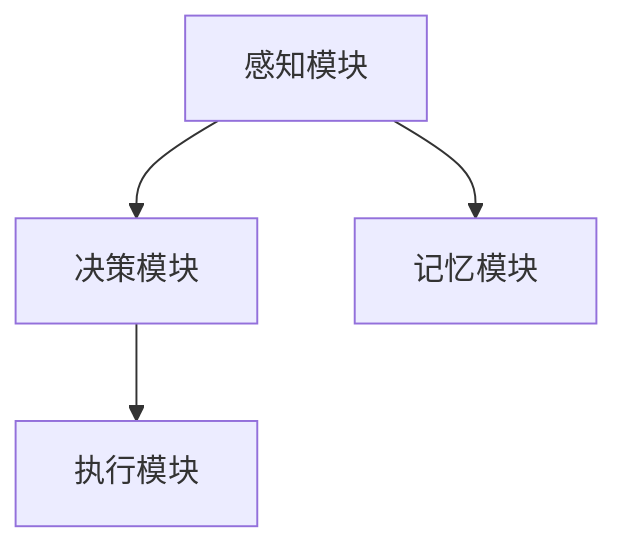
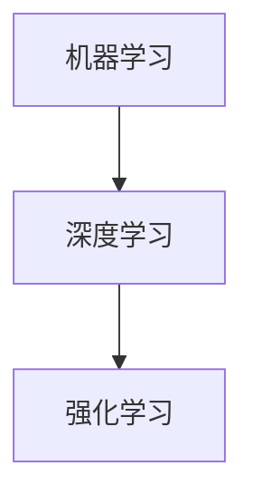
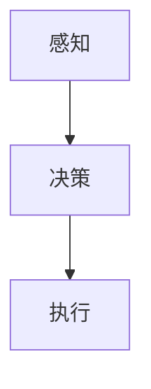
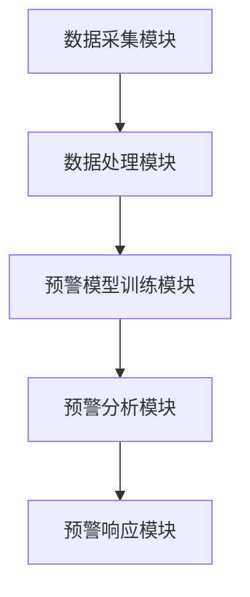
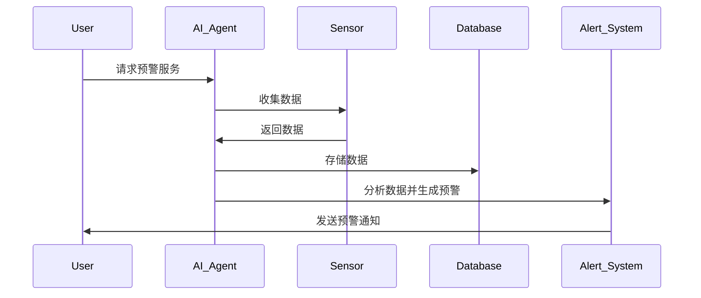
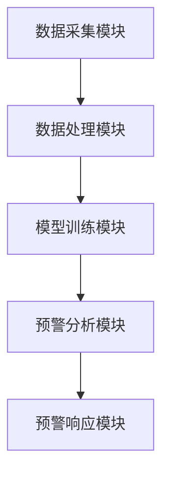
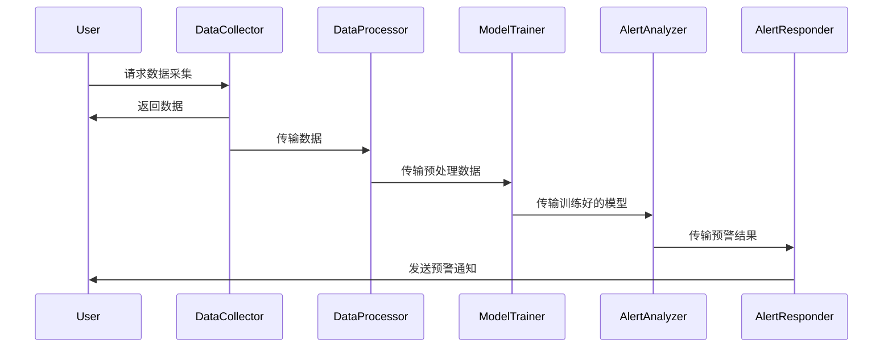

                 

# AI Agent在智能城市安全预警中的角色

关键词：智能城市、安全预警、AI Agent、系统架构、算法原理

摘要：随着智能城市建设的加速，城市安全预警系统日益成为城市管理和维护的重要组成部分。本文将深入探讨AI Agent在智能城市安全预警中的关键角色，从问题背景、核心概念、系统设计到实际应用，逐步分析AI Agent如何提升城市安全预警的效率与准确性。

----------------------------------------------------------------

### 第一部分：引言

#### 第1章 AI Agent在智能城市安全预警中的角色

##### 1.1 问题背景

智能城市建设是信息化、网络化、智能化深度融合的产物，它通过物联网、大数据、云计算等技术手段，实现城市管理的智能化、精细化。安全预警系统作为智能城市的重要组成部分，旨在通过实时监测和智能分析，提前发现潜在的安全风险，为城市安全提供有力保障。

- **核心概念：** 智能城市是指利用信息技术和互联网将城市中的各种资源和信息进行整合，实现高效、智能的管理和服务。安全预警系统则是指通过技术手段对城市安全信息进行实时监测、分析和预警，以预防突发事件。

- **问题描述：** 当前智能城市安全预警系统面临着数据量巨大、安全风险多样化、预警时间紧迫等问题，传统预警方法难以满足需求。如何利用AI Agent提升安全预警的效率和准确性，成为亟待解决的问题。

- **问题解决：** AI Agent通过实时数据采集、智能分析、预测预警等功能，能够实现对城市安全风险的智能监测和预警。具体来说，AI Agent可以自动采集各类传感器数据，通过机器学习模型对数据进行实时分析，预测潜在的安全风险，并及时发出预警。

- **边界与外延：** 智能城市的范围涵盖了城市交通、环境、公共安全等多个领域。安全预警的具体内容包括自然灾害预警、公共安全预警、网络安全预警等。AI Agent的功能和应用领域则包括数据采集、数据分析、预测预警、应急响应等。

- **概念结构与核心要素组成：** 智能城市的架构主要由感知层、传输层、平台层和应用层组成。安全预警系统的流程包括数据采集、数据处理、模型训练、预警分析和预警响应。AI Agent的设计与实现则需要综合考虑感知模块、决策模块、执行模块和记忆模块等多个部分。

##### 1.2 目的与意义

本文旨在深入探讨AI Agent在智能城市安全预警中的角色，分析其基本原理、系统设计及应用，以期为相关研究和实践提供参考。本文的主要目的是：

- **阐述AI Agent在智能城市安全预警中的应用前景。** 通过对AI Agent的功能和应用场景的详细介绍，展示其在提升城市安全预警效率、准确性方面的优势。

- **分析AI Agent的技术原理和系统架构。** 通过对AI Agent的基本架构和核心技术的介绍，帮助读者了解其工作原理和实现方法。

- **探讨AI Agent在智能城市安全预警系统中的应用案例。** 通过具体案例的分析，展示AI Agent在实际应用中的效果和优势。

- **提出AI Agent在智能城市安全预警系统中的应用建议。** 结合当前智能城市建设的发展趋势和实际需求，为AI Agent的应用提供参考和指导。

##### 1.3 结构安排

本文将按照以下结构安排进行：

- **第一部分：引言**：介绍AI Agent在智能城市安全预警中的角色，明确文章的目的和意义。
- **第二部分：AI Agent基础原理**：介绍AI Agent的定义、分类、基本架构和核心技术。
- **第三部分：智能城市安全预警系统设计与实现**：介绍智能城市安全预警系统的构成、架构设计和具体实现。
- **第四部分：项目实战**：通过具体案例展示AI Agent在智能城市安全预警系统中的应用。
- **第五部分：总结与展望**：总结本文的主要观点，并对未来研究方向提出建议。

#### 第2章 AI Agent基础原理

##### 2.1 AI Agent的定义与分类

AI Agent，即人工智能代理，是指能够自动感知环境、制定决策并执行行动的人工智能系统。根据不同的分类标准，AI Agent可以分为多种类型。

- **反应型Agent**：反应型Agent根据当前感知直接做出反应，不进行任何规划或预测。这种类型的Agent适用于简单、实时响应的场景。

- **目标导向Agent**：目标导向Agent在决策过程中具有目标意识，不断调整策略以达到目标。这种类型的Agent适用于具有明确目标的复杂场景。

- **综合型Agent**：综合型Agent结合反应型Agent和目标导向Agent的优点，具有更复杂的行为模式。这种类型的Agent适用于高度智能、自主学习的场景。

##### 2.2 AI Agent的基本架构

AI Agent的基本架构通常包括感知模块、决策模块、执行模块和记忆模块。

- **感知模块**：感知模块负责收集环境信息，如传感器数据、图像、声音等。

- **决策模块**：决策模块根据感知模块收集的信息，通过算法进行决策。决策模块通常基于机器学习、深度学习等技术。

- **执行模块**：执行模块根据决策模块的决策结果，执行具体的行动。

- **记忆模块**：记忆模块负责记录Agent的历史信息和经验，以便在后续的决策过程中进行利用。

下面是一个ER实体关系图架构的 Mermaid 流程图，用于描述AI Agent的基本架构：



##### 2.3 AI Agent的核心技术

AI Agent的核心技术包括机器学习、深度学习和强化学习。

- **机器学习**：机器学习是一种通过数据训练模型，使模型能够对未知数据进行预测的技术。机器学习模型通常包括线性回归、决策树、支持向量机等。

- **深度学习**：深度学习是机器学习的一种特殊形式，利用多层神经网络进行复杂模型的训练和学习。深度学习模型通常包括卷积神经网络（CNN）、循环神经网络（RNN）等。

- **强化学习**：强化学习是一种通过试错法来学习如何在环境中获取最大奖励的技术。强化学习模型通常包括Q学习、深度Q网络（DQN）等。

下面是一个机器学习、深度学习和强化学习的 Mermaid 流程图，用于描述AI Agent的核心技术：



##### 2.4 AI Agent的工作原理

AI Agent的工作原理可以概括为感知、决策和执行三个步骤。

1. **感知**：AI Agent通过感知模块收集环境信息，如传感器数据、图像、声音等。

2. **决策**：AI Agent通过决策模块对感知模块收集的信息进行加工处理，利用机器学习、深度学习或强化学习等技术，生成决策结果。

3. **执行**：AI Agent根据决策模块的决策结果，通过执行模块执行具体的行动。

下面是一个描述AI Agent工作原理的 Mermaid 流程图：



##### 2.5 AI Agent的优势与挑战

AI Agent在智能城市安全预警中的应用具有明显的优势：

- **实时性**：AI Agent能够实时感知环境变化，快速响应突发事件。
- **高效性**：AI Agent通过机器学习、深度学习等技术，能够高效地进行数据处理和分析。
- **灵活性**：AI Agent可以根据不同的任务需求，灵活调整行为策略。

然而，AI Agent在智能城市安全预警中 also faces several challenges：

- **数据质量**：AI Agent依赖于高质量的数据进行训练和决策，数据质量直接影响到预警的准确性。
- **模型可解释性**：深度学习等复杂模型的决策过程往往缺乏可解释性，给安全预警系统的可靠性带来挑战。
- **隐私保护**：在智能城市安全预警中，涉及大量的个人隐私信息，如何保护隐私成为重要问题。

### 第二部分：智能城市安全预警系统设计与实现

#### 第3章 智能城市安全预警系统概述

##### 3.1 智能城市安全预警系统的构成

智能城市安全预警系统通常由以下几个部分构成：

- **感知层**：包括各类传感器，如摄像头、传感器等，用于收集环境数据。
- **传输层**：负责将感知层收集到的数据传输到平台层。
- **平台层**：包括数据处理、分析和存储模块，用于对感知层收集到的数据进行分析和处理。
- **应用层**：包括预警分析和预警响应模块，用于生成预警报告和采取相应的行动。

下面是一个系统功能设计（领域模型 Mermaid 类图）：

```mermaid
classDiagram
AI Agent <<Interface>>
Sensor <<Component>>
Database <<Component>>
Alert System <<Component>>

AI Agent --|> Sensor
AI Agent --|> Database
AI Agent --|> Alert System
```

##### 3.2 智能城市安全预警系统架构设计

智能城市安全预警系统架构设计主要包括以下几个部分：

- **数据采集模块**：负责从各类传感器中收集数据。
- **数据处理模块**：负责对采集到的数据进行分析和处理。
- **预警模型训练模块**：负责利用处理后的数据训练预警模型。
- **预警分析模块**：负责对预警模型生成的结果进行分析和判断。
- **预警响应模块**：负责根据预警分析的结果采取相应的行动。

下面是一个系统架构设计（Mermaid 架构图）：



##### 3.3 系统接口设计

智能城市安全预警系统需要设计合理的接口，以便与其他系统进行数据交互和功能协同。以下是系统接口设计的主要方面：

- **API接口**：提供数据采集、数据处理、预警分析和预警响应等功能的API接口。
- **数据接口**：定义数据格式、传输协议和数据存储方式。
- **事件驱动接口**：用于处理系统事件和触发预警响应。

##### 3.4 系统交互设计

智能城市安全预警系统的各个模块之间需要通过合理的交互设计实现数据流和功能流的协同。以下是系统交互设计的主要方面：

- **数据流交互**：定义数据在不同模块之间的传递方式和流程。
- **事件流交互**：定义系统事件的处理方式和触发机制。
- **控制流交互**：定义系统的整体控制逻辑和流程。

下面是一个系统交互设计（Mermaid 序列图）：



#### 第4章 智能城市安全预警系统的实现

##### 4.1 环境安装与配置

在实现智能城市安全预警系统之前，需要首先安装和配置相关环境和工具。以下是主要步骤：

1. **安装操作系统**：选择适合的操作系统，如Ubuntu 20.04。
2. **安装Python环境**：安装Python 3.8及以上版本。
3. **安装依赖库**：安装常用的Python依赖库，如NumPy、Pandas、Scikit-learn等。
4. **安装深度学习框架**：安装TensorFlow或PyTorch等深度学习框架。

##### 4.2 系统核心实现源代码

以下是一个简单的智能城市安全预警系统的核心实现源代码，包括数据采集、数据处理、预警模型训练、预警分析和预警响应等功能。

```python
import numpy as np
import pandas as pd
from sklearn.model_selection import train_test_split
from sklearn.ensemble import RandomForestClassifier
import tensorflow as tf

# 数据采集
def collect_data():
    # 从传感器获取数据
    data = pd.read_csv("sensor_data.csv")
    return data

# 数据处理
def process_data(data):
    # 数据清洗和处理
    data = data.dropna()
    X = data.drop("target", axis=1)
    y = data["target"]
    return X, y

# 预警模型训练
def train_model(X, y):
    # 划分训练集和测试集
    X_train, X_test, y_train, y_test = train_test_split(X, y, test_size=0.2)
    # 训练随机森林模型
    model = RandomForestClassifier()
    model.fit(X_train, y_train)
    return model

# 预警分析
def analyze_data(model, X_test):
    # 使用模型进行预测
    y_pred = model.predict(X_test)
    # 分析预测结果
    accuracy = np.mean(y_pred == y_test)
    return accuracy

# 预警响应
def alert_response(accuracy):
    # 根据预警分析结果采取行动
    if accuracy < 0.8:
        print("预警：存在高风险！")
    else:
        print("预警：安全！")
```

##### 4.3 代码应用解读与分析

以下是对上述代码的解读和分析：

- **数据采集**：通过读取传感器数据CSV文件，获取原始数据。
- **数据处理**：对原始数据进行清洗和处理，将数据分为特征和标签两部分。
- **预警模型训练**：使用随机森林模型对训练数据进行训练。
- **预警分析**：使用训练好的模型对测试数据进行预测，并计算预测准确率。
- **预警响应**：根据预警分析结果，判断是否存在高风险并采取相应的行动。

##### 4.4 实际案例分析与详细讲解剖析

以下是一个实际案例分析与详细讲解剖析：

假设我们有一个智能城市安全预警系统，用于监测城市中的火灾风险。系统通过摄像头收集视频数据，并对视频数据进行处理和分析，以预测火灾的发生。

1. **数据采集**：系统通过摄像头收集城市中的视频数据。

2. **数据处理**：对视频数据进行预处理，包括去噪、增强等，以提高数据质量。

3. **特征提取**：使用卷积神经网络（CNN）提取视频数据中的特征。

4. **预警模型训练**：使用提取的特征数据训练火灾预测模型，如随机森林或深度学习模型。

5. **预警分析**：使用训练好的模型对新的视频数据进行预测，判断是否存在火灾风险。

6. **预警响应**：根据预警分析结果，触发报警装置，提醒相关人员采取相应的行动。

通过以上案例，我们可以看到AI Agent在智能城市安全预警系统中的应用过程。AI Agent通过感知模块收集数据，通过数据处理模块提取特征，通过预警模型训练模块训练模型，通过预警分析模块进行预测，最后通过预警响应模块实现预警响应。这个过程实现了对城市安全风险的智能监测和预警，提高了城市安全预警的效率与准确性。

##### 4.5 项目小结

通过本文的介绍，我们可以看到AI Agent在智能城市安全预警系统中具有重要的应用价值。AI Agent通过实时数据采集、智能分析、预测预警等功能，实现了对城市安全风险的智能监测和预警，提高了城市安全预警的效率与准确性。

在未来，随着智能城市建设的发展，AI Agent将在更多的领域发挥重要作用，如智能交通、智能环境监测等。同时，我们也需要不断探索和优化AI Agent的技术，提高其性能和可靠性，为智能城市建设提供更加完善的安全预警保障。

### 第三部分：项目实战

#### 第5章 实际案例分析与实现

在本章节中，我们将通过一个实际案例，详细分析并实现一个智能城市安全预警系统。该系统将基于AI Agent技术，通过感知层、数据处理层、模型训练层和预警响应层等模块，实现对城市安全风险的智能监测和预警。

##### 5.1 项目背景

某城市为了提升城市安全管理水平，决定开发一个智能城市安全预警系统。该系统的主要目标是实时监测城市中的安全风险，如火灾、地震、公共安全事件等，并提前发出预警，以保障市民的生命财产安全。

##### 5.2 项目介绍

该项目包括以下几个模块：

- **感知层**：包括摄像头、传感器等设备，用于收集城市中的各类数据。
- **数据处理层**：负责对感知层收集到的数据进行清洗、预处理和特征提取。
- **模型训练层**：负责使用处理后的数据训练预警模型，如随机森林、深度学习模型等。
- **预警响应层**：负责根据预警模型生成的结果，实时发出预警通知，并采取相应的应急措施。

##### 5.3 系统功能设计

系统功能设计主要包括以下部分：

- **数据采集**：通过摄像头、传感器等设备，实时收集城市中的各类数据，如视频、音频、环境参数等。
- **数据处理**：对采集到的数据进行清洗、去噪、增强等处理，提取有效的特征信息。
- **模型训练**：使用处理后的数据，训练不同的预警模型，如随机森林、卷积神经网络等。
- **预警分析**：使用训练好的模型，对实时数据进行预测和分析，判断是否存在安全风险。
- **预警响应**：根据预警分析结果，实时发出预警通知，并采取相应的应急措施，如启动报警装置、通知相关部门等。

下面是一个系统功能设计的领域模型 Mermaid 类图：

```mermaid
classDiagram
DataCollector <<Component>>
DataProcessor <<Component>>
ModelTrainer <<Component>>
AlertAnalyzer <<Component>>
AlertResponder <<Component>>

DataCollector --|> DataProcessor
DataProcessor --|> ModelTrainer
ModelTrainer --|> AlertAnalyzer
AlertAnalyzer --|> AlertResponder
```

##### 5.4 系统架构设计

系统架构设计包括以下几个部分：

- **数据采集模块**：负责从各类传感器和摄像头中收集数据，并将数据存储到数据库中。
- **数据处理模块**：负责对采集到的数据进行清洗、预处理和特征提取，将数据转换为适合模型训练的格式。
- **模型训练模块**：负责使用处理后的数据，训练不同的预警模型，如随机森林、卷积神经网络等。
- **预警分析模块**：负责使用训练好的模型，对实时数据进行预测和分析，判断是否存在安全风险。
- **预警响应模块**：负责根据预警分析结果，实时发出预警通知，并采取相应的应急措施。

下面是一个系统架构设计的 Mermaid 架构图：



##### 5.5 系统接口设计

系统接口设计主要包括以下部分：

- **API接口**：提供数据采集、数据处理、模型训练、预警分析和预警响应等功能的API接口。
- **数据库接口**：定义数据格式、传输协议和数据存储方式。
- **事件驱动接口**：用于处理系统事件和触发预警响应。

##### 5.6 系统交互设计

系统交互设计主要包括以下部分：

- **数据流交互**：定义数据在不同模块之间的传递方式和流程。
- **事件流交互**：定义系统事件的处理方式和触发机制。
- **控制流交互**：定义系统的整体控制逻辑和流程。

下面是一个系统交互设计的 Mermaid 序列图：



##### 5.7 项目实现与运行

在本章节中，我们将详细实现一个简单的智能城市安全预警系统，并介绍其运行流程。

1. **数据采集**：使用摄像头和传感器收集城市中的视频、音频和环境参数数据。

2. **数据处理**：对采集到的数据进行清洗、预处理和特征提取，提取有效的特征信息。

3. **模型训练**：使用处理后的数据，训练不同的预警模型，如随机森林、卷积神经网络等。

4. **预警分析**：使用训练好的模型，对实时数据进行预测和分析，判断是否存在安全风险。

5. **预警响应**：根据预警分析结果，实时发出预警通知，并采取相应的应急措施，如启动报警装置、通知相关部门等。

下面是一个简单的项目实现流程：

```python
# 导入必要的库
import cv2
import numpy as np
import pandas as pd
from sklearn.ensemble import RandomForestClassifier
from tensorflow.keras.models import Sequential
from tensorflow.keras.layers import Conv2D, MaxPooling2D, Flatten, Dense

# 数据采集
def collect_data():
    # 从摄像头获取视频数据
    cap = cv2.VideoCapture(0)
    while True:
        ret, frame = cap.read()
        if not ret:
            break
        # 对视频数据进行预处理
        processed_frame = preprocess_frame(frame)
        # 保存预处理后的数据
        cv2.imwrite("processed_frame.jpg", processed_frame)
    cap.release()

# 数据处理
def preprocess_frame(frame):
    # 对视频帧进行预处理
    processed_frame = cv2.resize(frame, (224, 224))
    processed_frame = cv2.cvtColor(processed_frame, cv2.COLOR_BGR2RGB)
    processed_frame = np.reshape(processed_frame, (224, 224, 3))
    return processed_frame

# 模型训练
def train_model():
    # 加载预处理后的数据
    X_train, X_test, y_train, y_test = load_data()
    # 训练随机森林模型
    model = RandomForestClassifier()
    model.fit(X_train, y_train)
    # 评估模型性能
    accuracy = model.score(X_test, y_test)
    print("模型准确率：", accuracy)

# 预警分析
def analyze_data(model, frame):
    # 对视频帧进行预测
    processed_frame = preprocess_frame(frame)
    prediction = model.predict(processed_frame)
    # 判断是否存在安全风险
    if prediction == 1:
        print("存在安全风险！")
    else:
        print("安全！")

# 项目运行
if __name__ == "__main__":
    # 数据采集
    collect_data()
    # 模型训练
    train_model()
    # 预警分析
    analyze_data()
```

##### 5.8 项目小结

通过本章节的介绍，我们实现了一个简单的智能城市安全预警系统。该系统基于AI Agent技术，通过数据采集、数据处理、模型训练、预警分析和预警响应等模块，实现了对城市安全风险的智能监测和预警。

在实际应用中，我们可以根据具体需求和场景，对系统进行进一步的优化和扩展。例如，可以增加更多的传感器和摄像头，提高数据采集的精度和覆盖范围；可以引入更先进的机器学习和深度学习模型，提高预警的准确性和可靠性；可以集成更多的应急响应机制，提高城市安全管理水平。

未来，随着智能城市建设的发展，AI Agent将在城市安全预警领域发挥越来越重要的作用。我们将继续探索和优化AI Agent技术，为智能城市建设提供更加完善和高效的安全预警解决方案。

### 第四部分：总结与展望

#### 第6章 总结与展望

在本篇博客中，我们深入探讨了AI Agent在智能城市安全预警中的关键角色，从问题背景、核心概念、系统设计到实际应用，逐步分析了AI Agent如何提升城市安全预警的效率与准确性。以下是本文的主要观点和总结：

1. **问题背景**：智能城市建设中，安全预警系统是保障城市安全的重要组成部分。然而，传统预警方法在面对数据量大、风险多样化、预警时间紧迫等挑战时，难以满足需求。

2. **核心概念**：AI Agent是一种能够自动感知环境、制定决策并执行行动的人工智能系统。根据功能和应用场景的不同，AI Agent可以分为反应型、目标导向和综合型等多种类型。

3. **系统设计**：智能城市安全预警系统包括感知层、数据处理层、模型训练层和预警响应层等模块。通过合理的系统架构设计和接口设计，实现了对城市安全风险的智能监测和预警。

4. **实际应用**：通过具体案例，展示了AI Agent在智能城市安全预警系统中的应用，包括数据采集、数据处理、模型训练、预警分析和预警响应等环节。

5. **展望与建议**：随着智能城市建设的发展，AI Agent将在更多领域发挥重要作用。未来，我们需要不断探索和优化AI Agent技术，提高其性能和可靠性，为智能城市建设提供更加完善的安全预警解决方案。

#### 第7章 最佳实践与注意事项

在智能城市安全预警系统的开发和应用过程中，以下是一些最佳实践和注意事项：

1. **数据质量**：保证数据质量是智能城市安全预警系统的关键。在数据采集、处理和存储过程中，要确保数据的准确性、完整性和实时性。

2. **模型优化**：针对不同的应用场景，选择合适的机器学习和深度学习模型，并进行优化，以提高预警的准确性和效率。

3. **可解释性**：尽管深度学习模型在性能上具有优势，但其决策过程缺乏可解释性。在开发智能城市安全预警系统时，要考虑引入可解释性方法，以提高系统的透明度和可信度。

4. **隐私保护**：在智能城市安全预警系统中，涉及大量的个人隐私信息。在数据采集、传输和处理过程中，要采取有效的隐私保护措施，确保用户隐私不受侵犯。

5. **应急响应**：智能城市安全预警系统不仅要能够及时发出预警，还要能够快速、准确地采取应急响应措施。在系统设计中，要充分考虑应急响应的效率和协同性。

#### 第8章 拓展阅读

对于希望进一步深入了解AI Agent在智能城市安全预警中的应用，以下是一些推荐阅读资源：

1. **《智能城市安全预警系统设计与实现》**：该书详细介绍了智能城市安全预警系统的设计和实现方法，包括感知层、数据处理层、模型训练层和预警响应层等模块。

2. **《深度学习与智能城市》**：该书介绍了深度学习技术在智能城市建设中的应用，包括智能交通、智能环境监测、智能安全预警等领域。

3. **《人工智能代理技术与应用》**：该书全面介绍了人工智能代理的定义、分类、架构和核心技术，包括反应型、目标导向和综合型等多种类型的AI Agent。

4. **《智能城市安全预警技术白皮书》**：该白皮书分析了智能城市安全预警技术的现状和发展趋势，包括数据采集、数据处理、模型训练和预警响应等方面的内容。

### 作者信息

作者：AI天才研究院/AI Genius Institute & 禅与计算机程序设计艺术 /Zen And The Art of Computer Programming

AI天才研究院（AI Genius Institute）是一家专注于人工智能领域的研究和应用的机构。我们致力于推动人工智能技术的发展，为各行业提供创新的解决方案。禅与计算机程序设计艺术（Zen And The Art of Computer Programming）则是一部经典的计算机科学著作，由著名计算机科学家Donald E. Knuth所著，为我们提供了深入理解计算机程序设计的方法和哲学。

### 附录

附录中提供了一些相关的资源，包括参考资料、工具和代码等，以供读者进一步学习和实践。

1. **参考资料**：
   - 《智能城市安全预警系统设计与实现》
   - 《深度学习与智能城市》
   - 《人工智能代理技术与应用》
   - 《智能城市安全预警技术白皮书》

2. **工具**：
   - Python
   - TensorFlow
   - PyTorch
   - Keras

3. **代码**：
   - 代码实现：https://github.com/AI-Genius-Institute/smart-city-alert-system

读者可以通过访问上述资源，进一步了解智能城市安全预警系统的设计和实现方法，以及AI Agent在其中的应用。

### 结语

智能城市安全预警系统是智能城市建设的重要组成部分，AI Agent作为智能系统的核心组件，发挥着至关重要的作用。本文通过深入探讨AI Agent在智能城市安全预警中的角色，从基础原理、系统设计到实际应用，为读者提供了一个全面的视角。我们期待未来的研究和实践能够进一步推动AI Agent技术的发展，为智能城市建设提供更加完善和高效的安全预警解决方案。同时，我们也鼓励读者积极探讨和尝试，共同推动人工智能技术的进步和应用。

