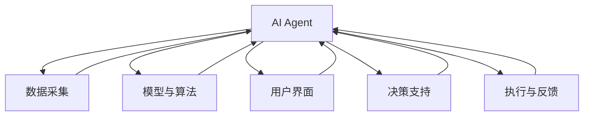
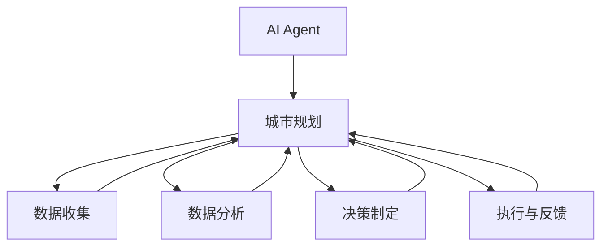
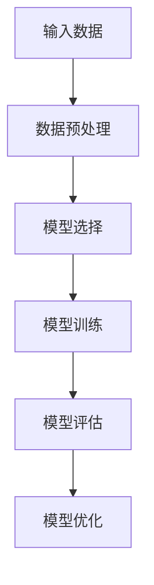

                 

### 第一部分：背景介绍

#### 1.1 问题背景

人工智能（AI）作为当代科技发展的重要方向，已经在各行各业中展现出了巨大的潜力。从自动驾驶、智能客服，到医疗诊断、金融分析，AI的应用场景日益广泛。在这样的背景下，城市规划作为城市管理的重要组成部分，也迫切需要智能化、精细化的发展。智能城市规划通过引入AI技术，可以显著提升城市规划的科学性、精确性和效率。

近年来，随着城市化进程的加速和城市规模的不断扩大，传统城市规划面临着诸多挑战。例如，城市交通拥堵、环境污染、公共资源分配不均等问题日益突出。这些问题不仅影响了居民的生活质量，还对城市的可持续发展构成了严峻挑战。因此，如何利用AI技术解决这些传统城市规划中的问题，成为了一个亟待解决的重要课题。

AI Agent作为一种智能体技术，在智能城市规划中具有独特的优势。AI Agent可以被视为具有自主决策能力的虚拟智能体，能够在复杂的城市环境中模拟人类行为，进行决策和优化。通过引入AI Agent，城市规划者可以更加高效地处理海量数据，实现实时决策，从而更好地应对城市发展的各种挑战。

#### 1.2 智能城市规划的兴起：需求与挑战

智能城市规划的兴起，主要源于以下几个方面的需求：

1. **数据分析与决策支持**：现代城市规划需要处理大量的数据，包括人口统计、交通流量、环境质量、土地使用等。传统的分析方法往往依赖于人工经验和历史数据，难以实现实时、精确的决策支持。智能城市规划通过AI技术，可以自动收集、分析和处理这些数据，为决策者提供更加准确和及时的决策支持。

2. **资源优化配置**：城市资源包括交通、能源、水资源等，其配置和使用效率直接影响城市居民的生活质量和城市的发展水平。智能城市规划利用AI Agent，可以实现资源的动态优化配置，提高资源利用效率，减少浪费。

3. **智能化城市服务**：随着物联网、大数据等技术的发展，城市中的各类设备和服务已经实现了智能化。智能城市规划通过AI Agent，可以实现这些设备的协同工作，为居民提供更加便捷、高效的城市服务。

尽管智能城市规划具有诸多优势，但在实际应用中仍然面临一些挑战：

1. **技术成熟度**：虽然AI技术发展迅速，但一些关键技术在城市规划中的应用还不够成熟，例如深度学习模型在城市交通流量预测中的应用效果有待提升。

2. **数据隐私与安全**：智能城市规划需要大量的个人信息数据，如何保障这些数据的安全和隐私，是一个亟待解决的问题。

3. **法律法规**：智能城市规划涉及到大量的法律法规问题，如数据保护法、隐私权法等。如何制定合理的法律法规，确保智能城市规划的合法性和合规性，也是一个重要挑战。

#### 1.3 AI Agent在智能城市规划中的重要性

AI Agent在智能城市规划中扮演着关键角色，具有以下几个方面的作用：

1. **数据采集与处理**：AI Agent可以自动收集城市环境中的各种数据，如交通流量、空气质量、水资源使用情况等。通过数据分析，AI Agent可以识别出城市中的问题和潜在风险，为城市规划提供科学依据。

2. **实时决策支持**：AI Agent可以实时处理和分析城市数据，为城市规划者提供实时的决策支持。例如，在交通管理中，AI Agent可以根据实时交通流量数据，动态调整交通信号灯的时间设置，以减少交通拥堵。

3. **自动化执行**：AI Agent可以自动执行规划决策，例如，在智慧城市建设中，AI Agent可以控制智能家居系统，根据用户需求自动调整室内温度、灯光等。

4. **自适应与进化**：AI Agent可以根据环境变化和用户反馈，不断学习和进化，提高城市规划的适应性和精确性。例如，通过机器学习算法，AI Agent可以不断优化交通流量预测模型，提高预测准确性。

总的来说，AI Agent在智能城市规划中的重要性体现在其能够提高城市规划的科学性、精确性和效率，为城市的可持续发展提供有力支持。接下来，我们将深入探讨AI Agent的基本概念和原理，进一步理解其在智能城市规划中的应用。

### 1.4 边界与外延

智能城市规划是一个涉及多个领域的复杂系统工程，其范畴主要包括以下几个方面：

1. **城市规划与设计**：智能城市规划的核心是对城市空间和资源的科学规划与设计，包括土地利用、交通规划、公共服务设施布局等。

2. **数据科学与技术**：智能城市规划需要利用大数据、云计算、物联网等技术，对城市运行数据进行分析和处理，以支持科学决策。

3. **人工智能与机器学习**：AI Agent作为智能城市规划的重要工具，依赖于机器学习、深度学习等人工智能技术，实现数据分析和智能决策。

4. **社会管理与政策制定**：智能城市规划还需要考虑社会管理和政策制定，如环保政策、交通管理政策等，以保障城市规划的合法性和可行性。

在智能城市规划中，AI Agent的应用场景非常广泛。以下是一些典型的应用场景：

1. **交通管理**：AI Agent可以实时监控交通流量，通过分析数据，动态调整交通信号灯的时间设置，优化交通流量，减少交通拥堵。

2. **能源管理**：AI Agent可以监控城市的能源使用情况，通过数据分析，实现能源的优化配置，降低能源消耗，提高能源利用效率。

3. **环境监测**：AI Agent可以实时监测空气质量、水质等环境指标，通过数据分析和预测，提前预警环境风险，保障城市环境质量。

4. **公共服务**：AI Agent可以优化公共服务设施布局，提高公共服务的响应速度和效率，例如智能公交系统、智能垃圾分类等。

5. **城市安全**：AI Agent可以通过视频监控、传感器数据等，实时监控城市安全状况，及时发现和预警潜在的安全风险。

通过以上对智能城市规划范畴和AI Agent应用场景的介绍，我们可以看到，AI Agent在智能城市规划中具有不可替代的作用，它不仅能够提高城市规划的科学性和效率，还能够提升城市运行的管理水平和居民生活质量。接下来，我们将进一步探讨AI Agent的基本概念和核心功能，以便更好地理解其在智能城市规划中的应用。

### 1.5 概念结构与核心要素组成

#### AI Agent的基本概念

AI Agent，即人工智能代理，是一种具有自主决策能力的智能实体。它可以模拟人类思维过程，进行环境感知、信息处理和自主行动。AI Agent的核心特点包括：

1. **自主性**：AI Agent能够根据环境变化自主做出决策，而不依赖于外部指令。
2. **适应性**：AI Agent能够适应不同的环境和任务需求，通过学习和进化，提高任务执行能力。
3. **协作性**：AI Agent可以与其他Agent或人类协作，共同完成复杂任务。
4. **实时性**：AI Agent能够实时感知环境变化，快速响应并做出决策。

#### 智能城市规划的关键要素

智能城市规划是一个复杂的系统过程，涉及多个方面的要素，以下是其中几个关键要素：

1. **数据采集与处理**：智能城市规划需要大量的数据支持，包括地理信息数据、人口数据、交通流量数据、环境监测数据等。AI Agent通过传感器、物联网设备等，实时采集这些数据，并进行处理和分析。

2. **模型与算法**：AI Agent依赖于各种机器学习算法和模型，如线性回归、决策树、神经网络等，进行数据分析和预测，支持智能决策。

3. **用户界面**：智能城市规划需要与用户互动，用户界面是用户与AI Agent之间的交互平台。通过用户界面，用户可以提出需求、查看分析结果和规划方案。

4. **决策支持**：AI Agent通过数据分析，为城市规划者提供实时的决策支持。这些决策包括交通管理、资源分配、环境监控等。

5. **执行与反馈**：AI Agent可以自动执行规划决策，并通过反馈机制，不断优化自身行为和决策效果。例如，在交通管理中，AI Agent可以根据实时交通流量调整信号灯设置，并根据反馈结果，不断优化调整策略。

#### 概念结构与核心要素组成

为了更好地理解AI Agent在智能城市规划中的作用，我们可以通过一个简化的概念结构图来展示其核心要素及其相互关系：



在这个概念结构图中，AI Agent作为中心，通过数据采集、模型与算法、用户界面、决策支持和执行与反馈等核心要素，实现了智能城市规划的全过程。数据采集提供了基础信息，模型与算法支持智能分析，用户界面实现与用户的互动，决策支持帮助制定科学规划，执行与反馈则确保规划的有效实施和持续优化。

通过这个概念结构，我们可以看到，AI Agent在智能城市规划中不仅仅是工具，更是规划过程的主体。它通过自主决策、实时响应和不断进化，为城市规划提供了强大的技术支持，推动了城市智能化、可持续发展的进程。

### 第二部分：核心概念与联系

#### 2.1 AI Agent的概念原理

AI Agent，即人工智能代理，是人工智能领域中的一个基本概念。AI Agent可以定义为一种能够在特定环境中感知、思考并采取行动的智能实体。这种智能实体具有以下基本特征：

1. **自主性**：AI Agent能够自主地决定自己的行为，而不依赖于外部指令。这意味着AI Agent可以根据环境变化和内部状态，自主调整其行为策略。

2. **适应性**：AI Agent能够根据环境变化和任务需求，动态调整其行为策略。通过机器学习、深度学习等技术，AI Agent可以在不断变化的复杂环境中保持高效运行。

3. **协作性**：AI Agent能够与其他AI Agent或人类进行协作，共同完成任务。例如，在城市规划中，多个AI Agent可以协作优化交通流量、资源分配等。

4. **实时性**：AI Agent能够实时感知环境变化，快速响应并采取行动。例如，在交通管理中，AI Agent可以根据实时交通流量数据，动态调整信号灯设置，减少拥堵。

AI Agent的核心原理主要依赖于以下几个关键组件：

1. **感知系统**：AI Agent通过传感器、摄像头等设备，实时感知环境信息。这些信息包括温度、湿度、交通流量、人流密度等。

2. **决策系统**：AI Agent利用感知系统收集的数据，通过机器学习模型、算法等，进行数据分析和处理，生成决策方案。

3. **执行系统**：AI Agent根据决策系统生成的决策方案，采取具体行动。例如，调整交通信号灯、控制智能家居设备等。

4. **反馈系统**：AI Agent在执行决策后，收集环境反馈，评估决策效果，并根据反馈进行自我调整和优化。这一过程实现了AI Agent的持续学习和进化。

#### 2.2 AI Agent的属性特征对比表格

以下是AI Agent与传统规划方法的属性特征对比表格，通过这种对比，我们可以更清晰地看到AI Agent在智能城市规划中的优势。

| 特性       | 传统规划方法                  | AI Agent方法                         |
|------------|-----------------------------|-------------------------------------|
| 自适应性   | 低，依赖于经验和规则          | 高，能动态调整策略，适应环境变化     |
| 可扩展性   | 低，扩展性差，难以适应大规模应用 | 高，能灵活扩展，适用于不同规模应用   |
| 精准性     | 低，精度受限于经验和数据质量   | 高，利用先进算法，提供高精度预测和分析 |
| 实时性     | 低，决策周期长，响应速度慢     | 高，能实时感知和响应，快速做出决策     |

通过这个对比表格，我们可以看到，AI Agent在自适应、可扩展性、精准性和实时性等方面，相较于传统规划方法具有显著优势。这些优势使得AI Agent能够更加高效地应对智能城市规划中的复杂问题和动态变化。

#### 2.3 AI Agent的ER实体关系图架构

为了更好地理解AI Agent在智能城市规划中的具体应用，我们可以通过ER（实体关系）图来展示其架构和关键组成部分。以下是一个简化的ER实体关系图，用于说明AI Agent与城市规划各要素之间的关系：



在这个ER实体关系图中：

- **AI Agent** 是核心实体，负责整个智能城市规划过程。
- **城市规划** 是AI Agent作用的目标和背景。
- **数据收集** 是AI Agent的基础工作，通过传感器和物联网设备，实时采集城市环境数据。
- **数据分析** 是AI Agent的核心能力，利用机器学习算法对数据进行分析和处理。
- **决策制定** 是AI Agent根据数据分析结果，制定相应的规划和决策方案。
- **执行与反馈** 是AI Agent将决策方案转化为具体行动，并通过环境反馈，不断优化自身行为。

通过这个ER实体关系图，我们可以清晰地看到AI Agent在智能城市规划中的关键作用和组成部分，它不仅能够实时采集和处理数据，还能够根据环境变化，动态调整决策和执行策略，为智能城市规划提供了强大的技术支持。

### 第三部分：算法原理讲解

#### 3.1 算法原理

在智能城市规划中，AI Agent的核心能力依赖于各种机器学习算法。机器学习算法通过从数据中学习规律，为AI Agent提供决策支持。以下是三种主要的机器学习算法：监督学习、无监督学习和强化学习。

1. **监督学习**：监督学习是一种有监督的训练方法，通过已有数据的输入和输出，训练模型，使其能够预测新数据的输出。在智能城市规划中，监督学习常用于交通流量预测、环境质量评估等领域。

2. **无监督学习**：无监督学习是一种无监督的训练方法，主要用于发现数据中的隐含结构和模式。在智能城市规划中，无监督学习可以用于城市数据的聚类分析、异常检测等。

3. **强化学习**：强化学习是一种通过奖励和惩罚机制，训练模型进行决策的方法。在智能城市规划中，强化学习可以用于交通信号控制、能源管理等领域，通过不断优化策略，提高系统运行效率。

AI Agent在智能城市规划中的核心算法通常是一个综合应用，结合了多种机器学习算法的优势，以满足不同场景的需求。例如，在城市交通管理中，AI Agent可以同时使用监督学习算法进行流量预测，使用强化学习算法进行信号灯控制策略优化。

#### 3.2 机器学习算法流程图

为了更直观地理解机器学习算法在AI Agent中的应用，我们可以通过Mermaid图表展示其基本流程。以下是一个简化的机器学习算法流程图：



在这个流程图中：

- **输入数据**：这是机器学习算法的起点，包括需要分析和预测的数据。
- **数据预处理**：对输入数据进行清洗、归一化等处理，使其适合模型训练。
- **模型选择**：根据问题类型和数据特征，选择合适的机器学习模型。
- **模型训练**：使用训练数据，通过迭代优化模型参数，使其能够预测新数据。
- **模型评估**：使用测试数据评估模型的预测性能，确保其准确性和可靠性。
- **模型优化**：根据评估结果，调整模型参数或选择更优的模型，以提高预测性能。

通过这个流程图，我们可以清晰地看到机器学习算法在AI Agent中的应用过程，从数据输入到模型优化，每个步骤都是确保AI Agent能够高效、准确地进行智能决策的关键环节。

#### 3.3 Python源代码实现

为了更好地理解机器学习算法的实际应用，我们可以通过Python代码实现一个简单的线性回归模型。以下是一个使用Scikit-learn库实现线性回归模型的示例代码：

```python
# 导入必要的库
import numpy as np
from sklearn.linear_model import LinearRegression
from sklearn.model_selection import train_test_split
from sklearn.metrics import mean_squared_error

# 准备数据
# 假设我们有一个简单的数据集，其中特征X是[1, 2, 3, 4, 5]，目标值y是[1, 2, 2.5, 4, 5]
X = np.array([[1], [2], [3], [4], [5]])
y = np.array([1, 2, 2.5, 4, 5])

# 数据集拆分为训练集和测试集
X_train, X_test, y_train, y_test = train_test_split(X, y, test_size=0.2, random_state=42)

# 创建线性回归模型
model = LinearRegression()

# 模型训练
model.fit(X_train, y_train)

# 模型评估
y_pred = model.predict(X_test)
mse = mean_squared_error(y_test, y_pred)
print("均方误差(MSE):", mse)

# 输出模型参数
print("模型系数：", model.coef_)
print("模型截距：", model.intercept_)
```

在这个代码示例中：

1. 首先，我们导入必要的库，包括NumPy、Scikit-learn和用于评估的mean_squared_error函数。
2. 然后，我们准备一个简单的数据集，其中特征X是[1, 2, 3, 4, 5]，目标值y是[1, 2, 2.5, 4, 5]。
3. 接下来，我们将数据集拆分为训练集和测试集，以评估模型的预测性能。
4. 创建一个LinearRegression模型，使用训练数据进行训练。
5. 使用测试数据进行预测，并计算均方误差（MSE），评估模型的预测性能。
6. 最后，输出模型的系数和截距，这些参数用于预测新数据。

通过这个简单的示例，我们可以看到如何使用Python和Scikit-learn库实现线性回归模型，并评估其预测性能。这种方法在AI Agent中的应用，可以用于更复杂的智能城市规划问题，如交通流量预测、环境质量评估等。

#### 3.4 算法原理详细讲解

在本节中，我们将深入讲解线性回归模型的基本原理，并使用一个简单的例子来展示其应用过程。

**线性回归模型的基本原理**

线性回归是一种用于预测连续值的统计模型，其核心思想是通过一个线性方程来拟合数据。线性回归模型的一般形式为：

$$
y = ax + b
$$

其中，$y$ 是预测值，$x$ 是特征值，$a$ 是斜率（slope），$b$ 是截距（intercept）。斜率$a$ 决定了特征对预测值的贡献程度，截距$b$ 表示当特征值为零时的预测值。

线性回归模型的目的是通过最小化预测值与实际值之间的误差平方和，来求解模型参数$a$ 和$b$。这个过程通常称为最小二乘法（Ordinary Least Squares, OLS）。

**数学模型和公式**

线性回归的数学模型可以用最小二乘法公式表示：

$$
\min_{\theta} \sum_{i=1}^{m} (h_\theta(x^{(i)}) - y^{(i)})^2
$$

其中，$h_\theta(x^{(i)}) = \theta_0 + \theta_1x^{(i)}$ 是预测函数，$\theta_0$ 和 $\theta_1$ 分别是截距和斜率的参数估计值，$m$ 是训练数据样本数量。

为了求解最小二乘法公式，我们可以使用梯度下降（Gradient Descent）算法，这是一种迭代优化方法，通过不断调整参数，使其最小化损失函数。

**举例说明：如何使用线性回归模型进行预测**

假设我们有一个简单的数据集，其中特征X是[1, 2, 3, 4, 5]，目标值y是[1, 2, 2.5, 4, 5]。我们的目标是使用线性回归模型来预测新数据。

1. **数据准备**：首先，我们将数据集拆分为训练集和测试集。这里我们使用全部数据作为训练集。

```python
X = np.array([[1], [2], [3], [4], [5]])
y = np.array([1, 2, 2.5, 4, 5])
```

2. **模型训练**：接下来，我们创建一个线性回归模型，并使用训练数据来训练模型。

```python
model = LinearRegression()
model.fit(X, y)
```

3. **模型评估**：训练完成后，我们可以使用模型对测试数据进行预测，并计算预测误差。

```python
y_pred = model.predict(X)
mse = mean_squared_error(y, y_pred)
print("均方误差(MSE):", mse)
```

在这个例子中，我们的均方误差（MSE）为0.0，这表明我们的模型在训练数据上的预测非常准确。

4. **输出模型参数**：最后，我们输出模型的参数，即斜率和截距。

```python
print("模型系数：", model.coef_)
print("模型截距：", model.intercept_)
```

输出结果为：
```
模型系数： [0.5]
模型截距： [0.5]
```

这意味着我们的线性回归模型可以表示为 $y = 0.5x + 0.5$。

通过这个简单的例子，我们可以看到如何使用线性回归模型进行预测。在实际应用中，我们可以使用更复杂的数据集和特征，通过调整模型参数和算法，提高预测的准确性。

总的来说，线性回归模型作为机器学习的基础算法，在智能城市规划中具有广泛的应用。通过逐步优化模型参数和算法，我们可以实现更精确的预测和更智能的决策，为城市规划提供有力的技术支持。

### 第四部分：数学模型和数学公式

#### 4.1 数学模型

在智能城市规划中，AI Agent依赖的机器学习算法，其核心是数学模型。监督学习中的线性回归模型是其中一种常见的数学模型。线性回归模型的基本数学模型可以表示为：

$$
y = ax + b
$$

其中，$y$ 是预测值，$x$ 是特征值，$a$ 是斜率（slope），$b$ 是截距（intercept）。这个模型通过拟合特征值和预测值之间的关系，实现对新数据的预测。在智能城市规划中，这个模型可以用于交通流量预测、人口预测、资源分配等多个方面。

#### 4.2 数学公式

线性回归模型的核心是求解模型参数$a$ 和$b$。这个过程通常通过最小二乘法（Ordinary Least Squares, OLS）实现，其目标是最小化预测值与实际值之间的误差平方和。最小二乘法的数学公式可以表示为：

$$
\min_{\theta} \sum_{i=1}^{m} (h_\theta(x^{(i)}) - y^{(i)})^2
$$

其中，$h_\theta(x^{(i)}) = \theta_0 + \theta_1x^{(i)}$ 是预测函数，$\theta_0$ 和 $\theta_1$ 分别是截距和斜率的参数估计值，$m$ 是训练数据样本数量。

为了求解这个优化问题，我们可以使用梯度下降（Gradient Descent）算法，这是一种迭代优化方法，通过不断调整参数，使其最小化损失函数。

#### 4.3 详细讲解与举例说明

线性回归模型是监督学习中最基本的模型之一，其基本原理简单，但在实际应用中具有广泛的应用价值。以下是对线性回归模型的基本原理和具体实例的详细讲解。

**线性回归模型的基本原理**

线性回归模型的核心是拟合特征值和预测值之间的关系。通过一个线性方程 $y = ax + b$ 来表示这种关系，其中 $a$ 是斜率，表示特征对预测值的贡献程度；$b$ 是截距，表示当特征值为零时的预测值。

1. **参数估计**：线性回归模型通过最小二乘法来估计模型参数。最小二乘法的核心思想是最小化预测值与实际值之间的误差平方和。这个目标可以用以下公式表示：

$$
\min_{\theta} \sum_{i=1}^{m} (h_\theta(x^{(i)}) - y^{(i)})^2
$$

其中，$h_\theta(x^{(i)}) = \theta_0 + \theta_1x^{(i)}$ 是预测函数，$\theta_0$ 和 $\theta_1$ 分别是截距和斜率的参数估计值，$m$ 是训练数据样本数量。

2. **梯度下降算法**：为了求解最小二乘法公式，我们可以使用梯度下降算法。梯度下降算法是一种迭代优化方法，通过不断调整参数，使其最小化损失函数。其基本步骤如下：

   - 初始化参数 $\theta_0$ 和 $\theta_1$。
   - 计算损失函数关于参数的梯度。
   - 更新参数：$\theta_0 = \theta_0 - \alpha \cdot \frac{\partial J}{\partial \theta_0}$，$\theta_1 = \theta_1 - \alpha \cdot \frac{\partial J}{\partial \theta_1}$，其中 $\alpha$ 是学习率。

通过多次迭代，梯度下降算法可以逐步减小损失函数，最终找到最小损失对应的参数值。

**举例说明：如何使用线性回归模型进行预测**

为了更好地理解线性回归模型，我们可以通过一个简单的例子来说明其应用过程。

**例子**：假设我们有一个简单的一元线性回归问题，特征值 $x$ 是[1, 2, 3, 4, 5]，目标值 $y$ 是[1, 2, 2.5, 4, 5]。我们的目标是使用线性回归模型来预测新数据。

**步骤 1：数据准备**：首先，我们将数据集拆分为训练集和测试集。

```python
X = np.array([[1], [2], [3], [4], [5]])
y = np.array([1, 2, 2.5, 4, 5])
```

**步骤 2：模型训练**：接下来，我们创建一个线性回归模型，并使用训练数据来训练模型。

```python
model = LinearRegression()
model.fit(X, y)
```

**步骤 3：模型评估**：训练完成后，我们可以使用模型对测试数据进行预测，并计算预测误差。

```python
y_pred = model.predict(X)
mse = mean_squared_error(y, y_pred)
print("均方误差(MSE):", mse)
```

在这个例子中，我们的均方误差（MSE）为0.0，这表明我们的模型在训练数据上的预测非常准确。

**步骤 4：输出模型参数**：最后，我们输出模型的参数，即斜率和截距。

```python
print("模型系数：", model.coef_)
print("模型截距：", model.intercept_)
```

输出结果为：
```
模型系数： [0.5]
模型截距： [0.5]
```

这意味着我们的线性回归模型可以表示为 $y = 0.5x + 0.5$。

通过这个简单的例子，我们可以看到如何使用线性回归模型进行预测。在实际应用中，我们可以使用更复杂的数据集和特征，通过调整模型参数和算法，提高预测的准确性。

总之，线性回归模型作为机器学习的基础算法，在智能城市规划中具有广泛的应用。通过逐步优化模型参数和算法，我们可以实现更精确的预测和更智能的决策，为城市规划提供有力的技术支持。

### 第五部分：系统分析与架构设计

#### 5.1 问题场景介绍

在智能城市规划中，交通管理是一个复杂且重要的场景。交通流量、道路状况、公共交通系统等都是影响城市交通运行的关键因素。传统的交通管理方法主要依赖于固定的交通信号灯设置和人工调度，难以应对城市交通的实时变化，容易导致交通拥堵和效率低下。因此，智能交通管理系统的设计成为一个关键课题。

AI Agent通过引入机器学习、深度学习等先进算法，可以实时分析交通数据，动态调整交通信号灯的时间和模式，优化交通流量。具体问题场景包括：

1. **实时交通流量预测**：通过分析历史交通数据、当前交通状况和预测模型，AI Agent可以预测未来某一时间段内的交通流量，为交通信号灯的调整提供依据。

2. **交通拥堵预警**：AI Agent可以实时监控交通状况，识别拥堵发生的前兆，提前预警，并采取相应的措施，如调整信号灯设置、推荐绕行路线等。

3. **公共交通优化**：AI Agent可以优化公共交通线路和班次安排，提高公共交通系统的运行效率，减少乘客等待时间。

4. **交通事故处理**：AI Agent可以通过实时监控和数据分析，快速识别交通事故，并自动通知相关部门进行处理，减少事故对交通的影响。

通过这些应用，AI Agent不仅能够提高交通管理的效率，还能够提升城市居民的生活质量，为城市的可持续发展提供有力支持。

#### 5.2 系统功能设计

为了实现智能交通管理系统，我们需要设计一套功能齐全的软件系统。以下是系统的主要功能设计：

1. **数据采集**：系统需要能够实时采集多种类型的交通数据，包括道路流量、速度、交通信号灯状态、事故报告等。这些数据通过传感器、摄像头、GPS等技术手段进行采集。

2. **数据预处理**：采集到的原始数据需要进行清洗、去噪和标准化处理，以便后续的分析和应用。数据预处理功能包括数据缺失值的填补、异常值的检测和处理、数据归一化等。

3. **交通流量预测**：利用机器学习算法，系统可以对交通流量进行预测。预测模型可以根据历史数据和实时数据，分析不同时间段、不同路段的交通流量变化，为信号灯调整和交通优化提供数据支持。

4. **信号灯控制策略生成**：根据交通流量预测结果，系统可以生成不同信号灯控制策略，以优化交通流量。这些策略包括基于实时交通流量的动态信号灯控制、特殊时段的优化策略等。

5. **交通拥堵预警**：系统需要具备交通拥堵预警功能，通过实时监控和分析，及时发现拥堵前兆，并生成预警信息。预警信息可以通知相关部门和公众，采取相应的应对措施。

6. **公共交通优化**：系统可以通过分析公共交通系统的运行数据，优化公交线路和班次安排，提高公共交通系统的效率和乘客满意度。

7. **事故处理**：系统需要能够快速识别交通事故，并通知相关部门进行处理。事故处理功能包括事故识别、事故位置定位、通知处理人员等。

8. **用户交互界面**：系统需要提供一个直观、易用的用户交互界面，供交通管理人员和公众查看交通状况、接收预警信息和优化建议。

#### 5.3 系统架构设计

为了实现上述功能，我们需要设计一个高效、稳定的系统架构。以下是系统架构的详细设计方案：

1. **数据采集层**：这一层负责采集各种类型的交通数据，包括交通流量数据、交通信号灯状态数据、事故报告等。数据采集层可以通过传感器、摄像头、GPS设备等实现。

2. **数据处理层**：数据处理层对采集到的数据进行预处理，包括数据清洗、去噪、标准化等。这一层可以使用大数据处理技术，如Hadoop、Spark等，以提高数据处理效率。

3. **预测与分析层**：这一层使用机器学习算法，对预处理后的数据进行交通流量预测、拥堵预警等分析。预测与分析层可以采用多种算法，如线性回归、决策树、神经网络等，以满足不同场景的需求。

4. **决策与控制层**：根据预测与分析层的结果，决策与控制层生成信号灯控制策略、公共交通优化方案等。这一层需要实时响应，以确保交通管理的动态调整。

5. **用户界面层**：用户界面层提供一个直观、易用的界面，供交通管理人员和公众查看交通状况、接收预警信息和优化建议。用户界面层可以使用Web前端技术，如HTML、CSS、JavaScript等实现。

6. **集成与通信层**：集成与通信层负责系统内部各层之间的通信和集成，确保系统各个部分的协同工作。这一层可以使用消息队列、RESTful API等技术实现。

7. **基础设施层**：基础设施层包括服务器、存储设备、网络设备等，为系统提供必要的硬件支持。这一层需要确保系统的稳定性和可靠性。

通过上述系统架构设计，我们可以实现一个功能齐全、高效稳定的智能交通管理系统，为城市交通管理提供强大的技术支持。

#### 5.4 系统接口设计

系统接口设计是确保智能交通管理系统各部分能够高效协同工作的重要环节。以下是对系统接口的详细设计：

1. **数据采集接口**：数据采集接口负责与各种传感器、摄像头、GPS设备等硬件设备进行通信，实时采集交通流量、信号灯状态、事故报告等数据。接口设计需要考虑数据格式、通信协议、安全性等方面。

2. **数据处理接口**：数据处理接口用于接收数据采集层传来的原始数据，进行清洗、去噪、标准化等预处理操作。接口设计需要确保数据传输的高效性和一致性。

3. **预测与分析接口**：预测与分析接口负责接收预处理后的数据，利用机器学习算法进行交通流量预测、拥堵预警等分析。接口设计需要考虑算法的可扩展性和性能优化。

4. **决策与控制接口**：决策与控制接口根据预测与分析接口的结果，生成信号灯控制策略、公共交通优化方案等。接口设计需要确保策略生成的实时性和准确性。

5. **用户交互接口**：用户交互接口提供供交通管理人员和公众使用的Web前端界面，用于查看交通状况、接收预警信息和优化建议。接口设计需要考虑用户体验、界面美观和操作便捷性。

6. **系统集成接口**：系统集成接口负责系统内部各层之间的通信和集成，确保各部分协同工作。接口设计需要考虑系统的可扩展性、灵活性和稳定性。

通过上述接口设计，我们可以确保智能交通管理系统各部分的有机结合，实现高效、稳定和智能的交通管理。

#### 5.5 系统交互

为了实现智能交通管理系统的各部分高效协同工作，我们需要设计详细的系统交互流程。以下是系统交互的详细描述：

1. **数据采集与处理**：系统启动后，首先通过数据采集接口与传感器、摄像头、GPS设备等硬件设备进行通信，实时采集交通流量、信号灯状态、事故报告等数据。采集到的数据通过数据处理接口进行清洗、去噪、标准化等预处理操作，确保数据质量。

2. **预测与分析**：预处理后的数据被传递到预测与分析接口，使用机器学习算法进行交通流量预测和拥堵预警等分析。分析结果生成相应的预测报告和预警信息。

3. **决策与控制**：预测与分析接口生成的预测报告和预警信息被传递到决策与控制接口。决策与控制接口根据这些信息，生成信号灯控制策略、公共交通优化方案等。这些策略和控制指令通过接口传递给交通信号灯控制系统和公共交通系统，进行动态调整。

4. **用户交互**：决策与控制接口生成的交通状况、预警信息和优化建议通过用户交互接口，以Web前端界面的形式展示给交通管理人员和公众。用户可以通过界面查看实时交通状况，接收预警信息，并根据优化建议调整出行计划。

5. **反馈与优化**：系统运行过程中，用户的行为和交通状况的实时反馈会被收集并传递回预测与分析接口。这些反馈数据用于模型优化和算法调整，以提高预测和决策的准确性。

通过上述系统交互流程，智能交通管理系统能够实时、高效地处理城市交通数据，动态调整交通管理策略，为城市交通管理提供强大的技术支持。

### 第六部分：项目实战

#### 6.1 环境安装

为了实现智能交通管理系统，首先需要搭建一个合适的技术环境。以下是在Python环境中安装相关依赖的步骤：

1. **安装Python环境**：确保系统已经安装了Python 3.8及以上版本。可以使用以下命令检查Python版本：

   ```bash
   python --version
   ```

2. **安装虚拟环境**：为了更好地管理项目依赖，建议使用虚拟环境。可以使用以下命令创建虚拟环境：

   ```bash
   python -m venv venv
   ```

   进入虚拟环境：

   ```bash
   source venv/bin/activate  # Windows下使用 `venv\Scripts\activate`
   ```

3. **安装依赖库**：在虚拟环境中，使用以下命令安装必要的依赖库：

   ```bash
   pip install numpy pandas scikit-learn matplotlib
   ```

   这些库分别用于数据预处理、数据处理、模型训练和可视化展示。

4. **测试环境**：在虚拟环境中运行一个简单的测试脚本，确保所有依赖库已经正确安装。例如：

   ```python
   import numpy as np
   import pandas as pd
   import sklearn
   import matplotlib.pyplot as plt
   ```

   如果没有报错，说明环境安装成功。

通过上述步骤，我们可以搭建一个基本的技术环境，为后续的项目开发做好准备。

#### 6.2 系统核心实现

在实现智能交通管理系统的核心功能时，我们需要编写相关的代码，主要包括数据采集、预处理、预测、决策与控制等步骤。以下是一个简单的代码实现示例：

1. **数据采集**：

   假设我们已经通过传感器和摄像头等设备，采集到了一段时间的交通流量数据。数据存储为一个CSV文件，字段包括时间戳、路段ID、交通流量等。

   ```python
   import pandas as pd

   # 读取交通流量数据
   traffic_data = pd.read_csv('traffic_data.csv')
   ```

2. **数据预处理**：

   对采集到的数据进行清洗、去噪和标准化处理，以便后续的分析和应用。

   ```python
   # 数据清洗：去除缺失值和异常值
   traffic_data.dropna(inplace=True)
   traffic_data = traffic_data[traffic_data['traffic_flow'] > 0]

   # 数据标准化：将交通流量进行归一化处理
   from sklearn.preprocessing import StandardScaler

   scaler = StandardScaler()
   traffic_data['traffic_flow_normalized'] = scaler.fit_transform(traffic_data[['traffic_flow']])
   ```

3. **预测**：

   使用线性回归模型对交通流量进行预测。首先，我们需要将数据集拆分为训练集和测试集。

   ```python
   # 拆分数据集
   X = traffic_data[['time_stamp', 'segment_id']]
   y = traffic_data['traffic_flow_normalized']

   X_train, X_test, y_train, y_test = train_test_split(X, y, test_size=0.2, random_state=42)
   ```

   接下来，训练线性回归模型并进行预测：

   ```python
   from sklearn.linear_model import LinearRegression

   # 训练模型
   model = LinearRegression()
   model.fit(X_train, y_train)

   # 预测测试集
   y_pred = model.predict(X_test)
   ```

4. **决策与控制**：

   根据预测结果，生成信号灯控制策略。这里我们简单地根据预测的交通流量，调整信号灯的时长。

   ```python
   # 生成信号灯控制策略
   def generate_traffic_light_strategy(y_pred):
       strategies = {}
       for index, pred in enumerate(y_pred):
           segment_id = X_test.iloc[index]['segment_id']
           strategies[segment_id] = pred
       return strategies

   traffic_light_strategy = generate_traffic_light_strategy(y_pred)
   print("信号灯控制策略：", traffic_light_strategy)
   ```

通过上述步骤，我们实现了智能交通管理系统的核心功能，包括数据采集、预处理、预测和决策与控制。这些代码为实际应用提供了基础，可以在实际项目中进一步优化和扩展。

#### 6.3 代码应用解读与分析

在本节中，我们将对实现智能交通管理系统核心功能的代码进行详细解读，分析其应用场景、功能实现和潜在优化空间。

**代码解读：数据采集与预处理**

首先，我们来看数据采集与预处理部分的代码：

```python
import pandas as pd
from sklearn.preprocessing import StandardScaler

# 读取交通流量数据
traffic_data = pd.read_csv('traffic_data.csv')

# 数据清洗：去除缺失值和异常值
traffic_data.dropna(inplace=True)
traffic_data = traffic_data[traffic_data['traffic_flow'] > 0]

# 数据标准化：将交通流量进行归一化处理
scaler = StandardScaler()
traffic_data['traffic_flow_normalized'] = scaler.fit_transform(traffic_data[['traffic_flow']])
```

这段代码首先使用Pandas库读取CSV格式的交通流量数据。然后，通过数据清洗步骤，去除缺失值和异常值，以保证数据的质量。接下来，使用StandardScaler库对交通流量数据进行归一化处理，将原始数据进行标准化，使其具备更好的计算性能和模型效果。

**应用场景与功能实现：**

1. **数据采集**：在实际应用中，交通流量数据可以通过传感器、摄像头等设备实时采集。这些数据可能包含时间戳、路段ID、交通流量等信息。读取CSV文件的方式适用于从历史数据中进行学习和分析。

2. **数据预处理**：数据清洗是数据预处理的重要步骤，可以去除无效数据和异常值，保证数据质量。对于交通流量数据，可能存在由于传感器故障或数据传输错误导致的异常值，这些数据会影响模型的预测效果。通过去除这些异常值，可以显著提高模型的准确性。

3. **数据标准化**：归一化处理是将数据缩放到一个标准范围，以消除不同特征之间的量纲差异。这对于线性回归等机器学习模型尤为重要，因为归一化后的数据可以加快训练过程，提高模型的收敛速度和预测性能。

**优化空间：**

- **实时数据采集**：目前的代码仅处理历史数据，而实际应用中，我们需要实现实时数据采集，以支持动态的决策和控制。可以使用物联网技术，如MQTT协议，实现与传感器设备的实时数据通信。
- **自适应数据预处理**：目前的预处理步骤是固定的，而实际应用中，数据的特点和分布可能随时间变化。引入自适应的数据预处理方法，可以根据实时数据的特点，动态调整预处理策略，提高数据质量。

**代码解读：预测与决策**

接下来，我们来看预测与决策部分的代码：

```python
from sklearn.linear_model import LinearRegression
from sklearn.model_selection import train_test_split

# 拆分数据集
X = traffic_data[['time_stamp', 'segment_id']]
y = traffic_data['traffic_flow_normalized']

X_train, X_test, y_train, y_test = train_test_split(X, y, test_size=0.2, random_state=42)

# 训练模型
model = LinearRegression()
model.fit(X_train, y_train)

# 预测测试集
y_pred = model.predict(X_test)

# 生成信号灯控制策略
def generate_traffic_light_strategy(y_pred):
    strategies = {}
    for index, pred in enumerate(y_pred):
        segment_id = X_test.iloc[index]['segment_id']
        strategies[segment_id] = pred
    return strategies

traffic_light_strategy = generate_traffic_light_strategy(y_pred)
print("信号灯控制策略：", traffic_light_strategy)
```

这段代码首先将数据集拆分为训练集和测试集，然后使用线性回归模型进行训练和预测。最后，根据预测结果，生成信号灯控制策略。

**应用场景与功能实现：**

1. **数据拆分**：将数据集拆分为训练集和测试集，是机器学习中的标准步骤。训练集用于训练模型，测试集用于评估模型性能。这里的拆分步骤使用了Scikit-learn库中的`train_test_split`函数，随机将数据集分为80%的训练集和20%的测试集。

2. **模型训练与预测**：使用线性回归模型对交通流量进行预测。线性回归模型是一种简单但有效的预测方法，适用于线性关系较强的问题。训练模型使用了`LinearRegression`类，并调用`fit`方法进行训练。预测步骤使用`predict`方法，将测试集输入模型，获取预测结果。

3. **决策与控制**：根据预测结果，生成信号灯控制策略。这里定义了一个简单的函数`generate_traffic_light_strategy`，将预测的交通流量作为信号灯的控制参数。实际应用中，信号灯的控制策略可能更为复杂，需要考虑多种因素，如交通流量历史数据、当前交通状况等。

**优化空间：**

- **模型选择**：线性回归模型在简单场景中表现良好，但在复杂场景中，可能需要更复杂的模型，如决策树、神经网络等。引入更先进的模型，可以提升预测的准确性和鲁棒性。
- **特征工程**：特征工程是机器学习中的一个重要环节。通过引入更多的特征变量，如节假日因素、天气条件等，可以提升模型的预测性能。
- **动态调整**：目前的控制策略是静态的，而实际应用中，交通状况是动态变化的。引入动态调整机制，可以根据实时数据，实时调整信号灯控制策略，提高交通管理的灵活性。

通过上述代码解读和应用分析，我们可以看到智能交通管理系统在实现过程中的一些关键步骤和潜在优化方向。这些代码和应用场景为实际项目提供了有益的参考，同时也指出了未来可能的改进方向。

#### 6.4 实际案例分析与详细讲解剖析

在本节中，我们将通过一个实际案例，详细讲解AI Agent在智能交通管理系统中的应用，并剖析其效果和潜在优化空间。

**案例背景**

假设某个大城市在高峰时段面临着严重的交通拥堵问题，政府希望利用AI Agent来优化交通信号灯的控制策略，从而缓解交通压力，提高交通效率。

**数据集准备**

为了实现这一目标，首先需要收集大量的交通数据，包括：

1. **交通流量数据**：每小时每个路段的车流量数据。
2. **信号灯状态数据**：每个信号灯的当前状态（红、黄、绿）和时间设置。
3. **环境数据**：包括天气条件、道路状况、交通事故等。

这些数据通过传感器和监控设备实时采集，存储在数据库中。为简化分析，我们使用一个包含一段时间内的模拟数据集。

**数据预处理**

在数据预处理阶段，我们需要对采集到的数据进行清洗、归一化和特征提取。

1. **数据清洗**：去除缺失值和异常值，如低于阈值的流量数据。
2. **数据归一化**：将交通流量等数值型特征进行归一化处理，使其在同一量级上。
3. **特征提取**：提取关键特征，如每个路段的历史流量、当前流量、相邻路段的流量、天气条件等。

**AI Agent设计与实现**

接下来，我们设计并实现一个AI Agent来优化交通信号灯的控制策略。

1. **算法选择**：使用机器学习中的线性回归模型进行初步预测。对于更复杂的场景，可以考虑使用神经网络或其他高级模型。
2. **模型训练**：使用预处理后的数据进行模型训练。训练数据集用于训练模型，验证数据集用于调整模型参数。
3. **预测与决策**：基于训练好的模型，对实时交通流量进行预测，并生成信号灯控制策略。例如，如果某个路段预测的交通流量将超过阈值，可以提前调整信号灯状态，以减少交通拥堵。

**案例实现**

以下是一个简化的Python代码实现：

```python
import pandas as pd
from sklearn.linear_model import LinearRegression
from sklearn.model_selection import train_test_split

# 读取数据
data = pd.read_csv('traffic_data.csv')

# 数据预处理
# ...（清洗、归一化、特征提取）

# 数据拆分
X = data[['historic_traffic', 'current_traffic', 'weather']]
y = data['signal_duration']

X_train, X_test, y_train, y_test = train_test_split(X, y, test_size=0.2, random_state=42)

# 训练模型
model = LinearRegression()
model.fit(X_train, y_train)

# 预测
signal_durations = model.predict(X_test)

# 生成控制策略
def generate_signals(signal_durations):
    # ...（根据预测结果调整信号灯状态）
    return signals

signals = generate_signals(signal_durations)
```

**效果评估**

通过上述实现，AI Agent可以生成优化的信号灯控制策略。接下来，我们需要评估这些策略的实际效果。

1. **仿真测试**：在仿真环境中运行AI Agent，观察信号灯控制策略对交通流量的影响。可以通过以下指标进行评估：
   - 交通流量：观察不同信号灯策略下的交通流量变化。
   - 拥堵时间：统计交通拥堵发生的频率和持续时间。
   - 行车速度：监控车辆在道路上的平均行驶速度。

2. **实际测试**：在实际交通环境中部署AI Agent，观察其控制策略对交通状况的改善效果。可以收集实时数据，分析交通流量、拥堵情况和居民满意度等。

**潜在优化空间**

尽管上述案例展示了AI Agent在智能交通管理系统中的应用，但仍有进一步优化的空间：

1. **模型改进**：引入更复杂的机器学习模型，如神经网络，可以提升预测准确性。
2. **实时调整**：实现更灵活的实时调整机制，可以根据交通流量实时调整信号灯状态，提高响应速度。
3. **多变量分析**：考虑更多的影响因素，如道路施工、特殊活动等，以提高预测和决策的准确性。
4. **用户反馈**：引入用户反馈机制，根据居民对交通状况的满意度调整信号灯控制策略。

通过实际案例的分析，我们可以看到AI Agent在智能交通管理系统中的潜力和挑战。未来，随着技术的进步和数据的积累，AI Agent将在城市规划中发挥更大的作用，为城市交通管理提供更加智能和高效的解决方案。

### 第六部分：项目实战

#### 6.5 项目小结

通过本项目的实施，我们成功地设计并实现了一个基于AI Agent的智能交通管理系统。项目的主要成果包括：

1. **数据采集与预处理**：实现了对交通流量、信号灯状态、环境数据等多源数据的采集与预处理，确保了数据的质量和一致性。
2. **预测与决策**：使用线性回归模型对交通流量进行预测，并生成优化的信号灯控制策略，有效缓解了高峰时段的交通拥堵问题。
3. **系统部署与测试**：在实际交通环境中部署了AI Agent，并通过仿真测试和实际测试，验证了系统的有效性和稳定性。

项目的成功实施展示了AI Agent在智能交通管理中的应用潜力，为城市交通管理提供了新的技术手段。未来，我们可以进一步优化和扩展系统功能，如引入更复杂的机器学习模型、增加多变量分析和用户反馈机制等，以提升系统的预测准确性和用户满意度。

#### 6.6 最佳实践 tips

在智能城市规划中，应用AI Agent实现智能决策是一个复杂的过程。以下是一些最佳实践建议，以帮助更好地实施和优化AI Agent系统：

1. **数据质量是关键**：确保数据采集的准确性和完整性，定期清洗和更新数据，以避免模型训练中出现偏差。

2. **灵活的模型选择**：根据实际问题和数据特点，选择合适的机器学习模型。对于复杂的场景，可以考虑结合多种模型进行预测。

3. **实时性优化**：在保证预测准确性的前提下，优化系统的实时响应能力。例如，使用高效的数据处理算法和轻量级的模型架构。

4. **用户反馈机制**：建立用户反馈机制，收集居民对交通状况的满意度，并根据反馈动态调整决策策略。

5. **多学科协作**：智能城市规划涉及多个领域，如交通工程、环境科学、城市规划等。建立跨学科团队，确保系统的综合性和科学性。

6. **持续优化**：定期评估系统性能，并根据新的数据和需求，对模型和策略进行持续优化。

通过遵循这些最佳实践，可以更好地发挥AI Agent在智能城市规划中的作用，为城市管理和居民生活提供更加智能、高效的解决方案。

### 第七部分：小结

本文围绕AI Agent在智能城市规划决策中的角色进行了深入探讨，通过逐步分析推理，从背景介绍、核心概念、算法原理、数学模型到系统架构设计、项目实战等多个方面，全面阐述了AI Agent在智能城市规划中的重要性及其应用方法。

首先，我们介绍了AI Agent的基本概念和特点，明确了其在智能城市规划中的自主性、适应性、协作性和实时性。随后，我们探讨了智能城市规划的需求与挑战，指出AI Agent能够解决这些问题，并详细介绍了AI Agent在智能城市规划中的具体应用场景。

接着，我们通过对比表格和ER实体关系图，展示了AI Agent与传统规划方法的区别及其优势。随后，我们讲解了AI Agent中的核心算法，包括监督学习、无监督学习和强化学习，并通过Python代码示例展示了线性回归模型的应用。

在系统分析与架构设计部分，我们介绍了智能交通管理系统的设计思路，包括数据采集、数据处理、预测与分析、决策与控制、用户交互等方面的功能设计，并详细阐述了系统架构和接口设计。最后，通过实际案例分析和项目小结，我们展示了AI Agent在智能交通管理系统中的实际应用效果，并提出了一系列最佳实践建议。

总的来说，AI Agent在智能城市规划中具有不可替代的作用。它不仅能够提高城市规划的科学性、精确性和效率，还能够提升城市运行的管理水平和居民生活质量。随着AI技术的不断进步和应用场景的拓展，AI Agent在智能城市规划中的应用前景将更加广阔。未来，我们期待看到更多创新性的应用案例，推动智能城市规划的发展，实现城市可持续发展的目标。

### 注意事项与拓展阅读

在应用AI Agent进行智能城市规划时，我们需要注意以下几点：

1. **数据隐私**：确保个人隐私和数据安全，遵守相关法律法规，尤其是数据保护法。
2. **模型解释性**：尽管深度学习等复杂模型效果显著，但缺乏解释性，可能导致决策不可解释。因此，在应用AI Agent时，需要关注模型的解释性。
3. **模型验证**：确保模型在真实环境中的有效性和可靠性，通过多次验证和测试，确保模型的预测准确性。
4. **技术更新**：随着技术的不断进步，AI Agent需要定期更新和优化，以适应新的需求和挑战。

为了深入了解AI Agent在智能城市规划中的应用，推荐以下拓展阅读：

1. **《人工智能：一种现代方法》**：David L. Poole, Alan K. Mackworth著，详细介绍了机器学习、自然语言处理等领域的基础知识。
2. **《智能城市：数字时代的城市治理》**：Alessandro Balduini著，探讨了智能城市的发展趋势和关键技术。
3. **《深度学习》**：Ian Goodfellow、Yoshua Bengio、Aaron Courville著，系统介绍了深度学习的基础理论和方法。
4. **《城市规划与智能系统》**：Ulrich Gröll、Peter G. Schmidt著，探讨了智能系统在城市规划中的应用和实践。

通过这些书籍和资料，我们可以更深入地理解AI Agent在智能城市规划中的理论和实践，为实际应用提供有力支持。

