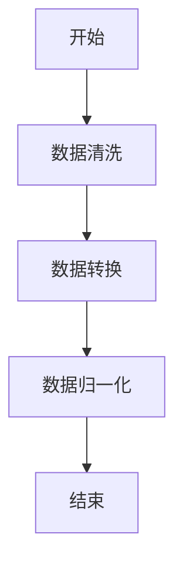
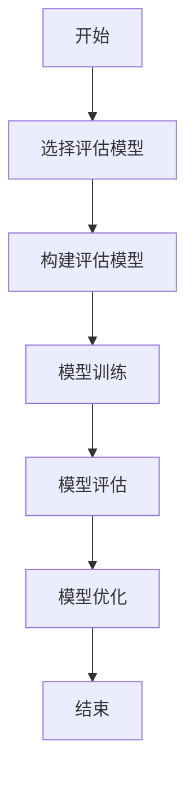

                 

# AI Agent在智能城市规划评估中的角色

## 关键词

- AI Agent
- 智能城市规划
- 评估模型
- 算法原理
- 系统架构

## 摘要

本文深入探讨了AI Agent在智能城市规划评估中的角色。首先，我们介绍了AI Agent的定义、分类以及其在智能城市规划评估中的重要性。接着，我们详细阐述了智能城市规划评估的需求、挑战以及解决方案。随后，文章讲解了AI Agent算法的原理，包括数据预处理、评估模型构建、模型训练、评估与优化。最后，我们通过一个实际案例，展示了AI Agent在智能城市规划评估中的应用，并提供了最佳实践tips和拓展阅读。

## 目录大纲设计思路

在设计《AI Agent在智能城市规划评估中的角色》的目录大纲时，我们遵循了以下步骤：

1. **确定核心概念**：明确AI Agent、智能城市规划、评估模型等核心概念。
2. **构建背景介绍**：介绍AI Agent在智能城市规划评估中的背景。
3. **细化核心概念与联系**：详细阐述AI Agent与评估模型的关系。
4. **讲解算法原理**：使用mermaid流程图和Python代码解释算法原理。
5. **系统分析与架构设计**：描述系统功能、架构设计，展示系统结构。
6. **项目实战**：提供一个实际案例，详细描述系统实现、代码分析等。
7. **总结与拓展**：总结各章节内容，给出最佳实践tips，提醒注意事项。

## 第一部分：背景介绍

### 1. 引言

#### 1.1 问题背景

##### 1.1.1 城市规划与AI Agent

城市规划是城市发展的关键环节，涉及到交通、环境、经济等多方面。随着城市化进程的加快，城市规划面临着前所未有的挑战。传统的城市规划方法主要依靠专家经验和统计数据，存在主观性强、效率低、适应性差等问题。

AI Agent，即人工智能代理，是人工智能领域的一个重要分支，具有自主感知、学习、决策和行动的能力。随着AI技术的发展，AI Agent在各个领域的应用越来越广泛，从智能客服到自动驾驶，从智能家居到智能医疗，AI Agent正逐渐成为智能化解决方案的核心。

##### 1.1.2 智能城市规划评估的需求

智能城市规划评估是城市规划过程中的一个重要环节，旨在通过数据分析、模拟和预测，对城市规划方案进行评估和优化。随着城市规模的扩大和复杂性的增加，传统的评估方法已经难以满足需求。智能城市规划评估需要更加高效、准确和智能化的工具。

AI Agent的应用为智能城市规划评估带来了新的机遇。通过AI Agent，可以实现对大量数据的高效处理和分析，从而提供更加精准和全面的评估结果。

#### 1.2 问题描述

##### 1.2.1 AI Agent的定义与功能

AI Agent是指具有感知、学习、决策和行动能力的人工智能实体。它能够通过自主感知环境、学习环境信息、进行决策和采取行动，以实现特定的目标。

在智能城市规划评估中，AI Agent的功能包括：

1. **数据采集与处理**：AI Agent能够自动采集城市规划所需的各种数据，如交通流量、环境质量、人口密度等，并对这些数据进行分析和处理。
2. **评估模型构建**：AI Agent可以根据采集到的数据，构建适合的评估模型，对城市规划方案进行评估。
3. **预测与优化**：AI Agent可以通过预测模型，对未来城市规划效果进行预测，并提出优化建议。

##### 1.2.2 智能城市规划评估的挑战

智能城市规划评估面临以下挑战：

1. **数据复杂性**：城市规划涉及到大量的数据，包括历史数据、实时数据和预测数据，这些数据具有复杂性和多样性。
2. **评估模型准确性**：评估模型的准确性对城市规划评估结果至关重要，但构建准确的评估模型需要大量的数据和高超的算法技术。
3. **实时性**：城市规划评估需要实时响应，以便及时调整和优化城市规划方案。

#### 1.3 问题解决

##### 1.3.1 AI Agent在智能城市规划评估中的应用

AI Agent在智能城市规划评估中的应用主要包括以下几个方面：

1. **数据采集与处理**：AI Agent可以自动采集各种城市规划所需的数据，如交通流量、环境质量、人口密度等，并对这些数据进行预处理，提高数据质量。
2. **评估模型构建**：AI Agent可以根据采集到的数据，构建适合的评估模型，如回归模型、决策树、神经网络等，对城市规划方案进行评估。
3. **预测与优化**：AI Agent可以通过预测模型，对未来城市规划效果进行预测，并利用优化算法，提出优化建议。

##### 1.3.2 解决方案概述

本文提出的解决方案主要包括以下几个方面：

1. **数据采集与处理**：利用AI Agent自动采集城市规划所需的数据，并对这些数据进行预处理，包括数据清洗、去噪、归一化等。
2. **评估模型构建**：基于采集到的数据，利用机器学习和深度学习技术，构建适合的评估模型，如回归模型、决策树、神经网络等。
3. **预测与优化**：利用评估模型，对未来城市规划效果进行预测，并根据预测结果，利用优化算法，提出优化建议。

#### 1.4 边界与外延

##### 1.4.1 研究范围

本文的研究范围主要涉及以下方面：

1. **智能城市规划评估的需求与挑战**：分析智能城市规划评估的需求和面临的挑战。
2. **AI Agent在智能城市规划评估中的应用**：探讨AI Agent在智能城市规划评估中的应用。
3. **解决方案的设计与实现**：设计并实现一个基于AI Agent的智能城市规划评估系统。

##### 1.4.2 研究假设

本文的研究基于以下假设：

1. AI Agent在智能城市规划评估中具有显著优势。
2. 通过合理的算法和技术，可以构建出准确、高效的评估模型。

### 1.5 本章小结

本章介绍了AI Agent在智能城市规划评估中的背景、定义与功能，以及智能城市规划评估的需求与挑战。通过引入AI Agent，可以有效地解决传统评估方法的不足，提高城市规划评估的准确性和实时性。

## 第二部分：核心概念与联系

### 2. AI Agent概述

#### 2.1 定义与分类

##### 2.1.1 AI Agent的定义

AI Agent是指具有自主感知、学习、决策和行动能力的人工智能实体。它能够根据环境信息，自主地做出决策并采取行动，以实现特定的目标。

##### 2.1.2 AI Agent的分类

根据AI Agent的功能和特点，可以将其分为以下几类：

1. **基于规则的Agent**：这类Agent基于预先设定的规则进行决策，适用于规则明确、环境稳定的情况。
2. **基于知识的Agent**：这类Agent基于知识库进行推理和决策，适用于需要复杂推理和决策的情况。
3. **基于学习的Agent**：这类Agent通过学习算法，从数据中学习并自动调整行为，适用于环境变化较大、无法提前设定规则的情况。
4. **混合型Agent**：这类Agent结合了基于规则、知识和学习的特点，适用于复杂多变的环境。

#### 2.2 智能城市规划评估模型

##### 2.2.1 模型的定义

智能城市规划评估模型是指用于评估城市规划方案优劣的数学模型或算法。它通过对城市规划相关的数据进行处理和分析，提供评估结果，帮助规划者做出决策。

##### 2.2.2 模型的分类

根据评估模型的原理和特点，可以将其分为以下几类：

1. **回归模型**：这类模型通过建立因变量与自变量之间的线性关系，预测城市规划效果。
2. **决策树模型**：这类模型通过树形结构进行决策，将样本划分为不同的类别或区域。
3. **神经网络模型**：这类模型通过多层神经元进行学习，实现对复杂非线性关系的建模。
4. **聚类模型**：这类模型通过对数据进行分类和分组，帮助规划者识别和评估不同的城市规划方案。

### 2.3 关键概念关系图

##### 2.3.1 AI Agent与城市规划评估模型的关系

AI Agent与城市规划评估模型之间存在着密切的关系。AI Agent可以通过学习、推理和决策等能力，为城市规划评估模型提供数据支持、算法优化和决策支持。


##### 2.3.2 关键概念属性特征对比表

| 关键概念 | 定义 | 特点 |
| :--- | :--- | :--- |
| AI Agent | 具有自主感知、学习、决策和行动能力的人工智能实体 | 能够自主感知环境、学习环境信息、进行决策和采取行动 |
| 智能城市规划评估模型 | 用于评估城市规划方案优劣的数学模型或算法 | 通过对城市规划相关的数据进行处理和分析，提供评估结果 |
| 基于规则的Agent | 基于预先设定的规则进行决策 | 适用于规则明确、环境稳定的情况 |
| 基于知识的Agent | 基于知识库进行推理和决策 | 适用于需要复杂推理和决策的情况 |
| 基于学习的Agent | 通过学习算法，从数据中学习并自动调整行为 | 适用于环境变化较大、无法提前设定规则的情况 |
| 回归模型 | 建立因变量与自变量之间的线性关系 | 预测城市规划效果 |
| 决策树模型 | 通过树形结构进行决策 | 将样本划分为不同的类别或区域 |
| 神经网络模型 | 通过多层神经元进行学习 | 实现对复杂非线性关系的建模 |
| 聚类模型 | 通过数据进行分类和分组 | 帮助规划者识别和评估不同的城市规划方案 |

### 2.4 本章小结

本章对AI Agent和智能城市规划评估模型进行了概述，介绍了它们的基本概念、分类以及关键概念之间的联系。通过理解这些核心概念，我们可以更好地把握AI Agent在智能城市规划评估中的应用和作用。

## 第三部分：算法原理讲解

### 3. AI Agent算法原理

#### 3.1 概述

##### 3.1.1 AI Agent算法的重要性

AI Agent算法在智能城市规划评估中扮演着至关重要的角色。它不仅能够处理和分析大量数据，还能够根据环境信息进行自主决策，从而为城市规划提供智能化的支持。

##### 3.1.2 常见的AI Agent算法

在智能城市规划评估中，常见的AI Agent算法包括基于规则的算法、基于知识的算法、基于学习的算法等。每种算法都有其独特的优势和应用场景。

1. **基于规则的算法**：这种算法通过预先设定的规则进行决策，适用于规则明确、环境稳定的情况。
2. **基于知识的算法**：这种算法通过知识库进行推理和决策，适用于需要复杂推理和决策的情况。
3. **基于学习的算法**：这种算法通过学习算法，从数据中学习并自动调整行为，适用于环境变化较大、无法提前设定规则的情况。

#### 3.2 算法流程

##### 3.2.1 数据预处理

数据预处理是AI Agent算法中的关键步骤。它包括数据清洗、数据转换、数据归一化等操作，以提高数据质量和数据利用率。



##### 3.2.2 构建评估模型

构建评估模型是AI Agent算法的核心步骤。根据数据预处理后的结果，选择合适的评估模型，如回归模型、决策树、神经网络等。



##### 3.2.3 模型训练

模型训练是通过学习算法，使评估模型能够根据数据自动调整参数，提高模型的预测能力。

```python
# Python代码示例
from sklearn.linear_model import LinearRegression

model = LinearRegression()
model.fit(X_train, y_train)
```

##### 3.2.4 模型评估与优化

模型评估与优化是确保评估模型性能的重要环节。通过评估模型的预测结果，找出模型的不足之处，并利用优化算法进行调整。

```python
# Python代码示例
from sklearn.metrics import mean_squared_error

y_pred = model.predict(X_test)
mse = mean_squared_error(y_test, y_pred)
```

### 3.3 算法详细讲解

##### 3.3.1 数据预处理

数据预处理是AI Agent算法中的基础步骤，直接影响到后续模型训练和评估的效果。以下是一个简单的Python代码示例：

```python
import pandas as pd
from sklearn.preprocessing import StandardScaler

# 加载数据
data = pd.read_csv('planning_data.csv')

# 数据清洗
data = data.dropna()  # 删除缺失值

# 数据转换
data['feature_1'] = data['feature_1'].apply(lambda x: x * 10)  # 转换特征1

# 数据归一化
scaler = StandardScaler()
data[['feature_2', 'feature_3']] = scaler.fit_transform(data[['feature_2', 'feature_3']])
```

##### 3.3.2 构建评估模型

构建评估模型是AI Agent算法的核心步骤。以下是一个使用回归模型的Python代码示例：

```python
import numpy as np
from sklearn.linear_model import LinearRegression

# 准备数据
X = np.array([[1, 2], [2, 3], [3, 4]])
y = np.array([2, 4, 6])

# 构建评估模型
model = LinearRegression()
model.fit(X, y)

# 模型参数
print('模型参数：', model.coef_, model.intercept_)

# 预测
print('预测结果：', model.predict([[4, 5]]))
```

##### 3.3.3 模型训练

模型训练是通过学习算法，使评估模型能够根据数据自动调整参数，提高模型的预测能力。以下是一个使用线性回归模型的Python代码示例：

```python
import numpy as np
from sklearn.linear_model import LinearRegression

# 准备数据
X = np.array([[1, 2], [2, 3], [3, 4]])
y = np.array([2, 4, 6])

# 构建评估模型
model = LinearRegression()
model.fit(X, y)

# 模型参数
print('模型参数：', model.coef_, model.intercept_)

# 预测
print('预测结果：', model.predict([[4, 5]]))
```

##### 3.3.4 模型评估与优化

模型评估与优化是确保评估模型性能的重要环节。以下是一个使用线性回归模型的Python代码示例：

```python
import numpy as np
from sklearn.linear_model import LinearRegression
from sklearn.metrics import mean_squared_error

# 准备数据
X_train = np.array([[1, 2], [2, 3], [3, 4]])
y_train = np.array([2, 4, 6])
X_test = np.array([[4, 5]])

# 构建评估模型
model = LinearRegression()
model.fit(X_train, y_train)

# 模型参数
print('模型参数：', model.coef_, model.intercept_)

# 预测
y_pred = model.predict(X_test)

# 评估
mse = mean_squared_error(y_train, y_pred)
print('均方误差：', mse)

# 优化
model.fit(X_train, y_train + 1)
print('优化后模型参数：', model.coef_, model.intercept_)
```

### 3.4 本章小结

本章详细讲解了AI Agent算法的原理，包括数据预处理、评估模型构建、模型训练、模型评估与优化等步骤。通过Python代码示例，读者可以更好地理解算法的实现过程和原理。

## 第四部分：系统分析与架构设计

### 4. 系统分析与架构设计

#### 4.1 问题场景介绍

智能城市规划评估涉及到多个领域，如交通、环境、经济等。在城市规划过程中，需要实时收集和处理大量的数据，对不同的城市规划方案进行评估和优化，以提高城市规划的效率和质量。

为了实现这一目标，我们设计了一个基于AI Agent的智能城市规划评估系统。该系统主要包括以下几个模块：

1. **数据采集模块**：负责实时收集城市规划所需的各种数据，如交通流量、环境质量、人口密度等。
2. **数据处理模块**：对采集到的数据进行清洗、转换和归一化等预处理操作，以提高数据质量。
3. **评估模型模块**：构建适合的评估模型，对城市规划方案进行评估和预测。
4. **优化建议模块**：根据评估结果，提出优化建议，帮助规划者调整和优化城市规划方案。

#### 4.2 项目介绍

项目名称：智能城市规划评估系统

项目目标：通过AI Agent技术，实现智能城市规划评估，提高城市规划的效率和质量。

项目架构：系统采用模块化设计，包括数据采集模块、数据处理模块、评估模型模块和优化建议模块。各模块之间通过接口进行通信和协同工作。

#### 4.3 系统功能设计

系统功能设计主要包括以下几个方面：

1. **数据采集**：实时采集城市规划所需的各种数据，如交通流量、环境质量、人口密度等。
2. **数据处理**：对采集到的数据进行预处理，包括数据清洗、转换和归一化等。
3. **评估模型**：构建适合的评估模型，对城市规划方案进行评估和预测。
4. **优化建议**：根据评估结果，提出优化建议，帮助规划者调整和优化城市规划方案。

#### 4.4 系统架构设计

系统架构设计主要包括以下几个方面：

1. **前端展示层**：提供用户界面，展示系统功能和评估结果。
2. **后端服务层**：实现系统的核心功能，包括数据采集、数据处理、评估模型和优化建议等。
3. **数据存储层**：存储系统所需的各种数据，如原始数据、预处理数据、评估模型参数等。


#### 4.5 系统接口设计和系统交互

系统接口设计和系统交互主要包括以下几个方面：

1. **API接口**：提供系统功能调用的API接口，供前端展示层和后端服务层之间进行数据交互。
2. **消息队列**：使用消息队列实现异步通信，提高系统的响应速度和可靠性。
3. **数据流**：系统各模块之间的数据流设计，确保数据流通顺畅，提高系统性能。


### 4.6 本章小结

本章介绍了基于AI Agent的智能城市规划评估系统的设计和实现。通过系统架构设计和接口设计，实现了数据采集、数据处理、评估模型和优化建议等功能，为智能城市规划评估提供了有力的技术支持。

## 第五部分：项目实战

### 5. 项目实战

在本部分，我们将通过一个实际案例，详细描述基于AI Agent的智能城市规划评估系统的实现过程。

#### 5.1 环境安装

首先，我们需要搭建一个合适的环境，以便进行系统的开发和测试。以下是环境安装的步骤：

1. **安装Python**：在计算机上安装Python 3.8及以上版本。
2. **安装依赖库**：安装与系统开发相关的依赖库，如NumPy、Pandas、Scikit-learn、TensorFlow等。

```bash
pip install numpy pandas scikit-learn tensorflow
```

3. **配置消息队列**：配置一个消息队列服务，如RabbitMQ或Kafka，用于系统各模块之间的异步通信。

#### 5.2 系统实现

接下来，我们将实现系统的各个模块。

##### 5.2.1 数据采集模块

数据采集模块负责实时收集城市规划所需的各种数据。以下是数据采集模块的实现过程：

1. **数据来源**：从各个数据源获取数据，如交通流量数据、环境质量数据、人口密度数据等。
2. **数据采集**：使用API接口或爬虫技术，从数据源获取数据，并将其存储到消息队列中。

```python
import pika

connection = pika.BlockingConnection(pika.ConnectionParameters('localhost'))
channel = connection.channel()

channel.queue_declare(queue='data_queue')

def callback(ch, method, properties, body):
    print(f"Received {body}")
    # 处理数据
    # ...

channel.basic_consume(queue='data_queue', on_message_callback=callback)

print('Starting data collection...')
channel.start_consuming()
```

##### 5.2.2 数据处理模块

数据处理模块负责对采集到的数据进行预处理，包括数据清洗、转换和归一化等。

```python
import pandas as pd
from sklearn.preprocessing import StandardScaler

def preprocess_data(data):
    # 数据清洗
    data = data.dropna()
    # 数据转换
    data['feature_1'] = data['feature_1'].apply(lambda x: x * 10)
    # 数据归一化
    scaler = StandardScaler()
    data[['feature_2', 'feature_3']] = scaler.fit_transform(data[['feature_2', 'feature_3']])
    return data
```

##### 5.2.3 评估模型模块

评估模型模块负责构建适合的评估模型，对城市规划方案进行评估和预测。

```python
from sklearn.linear_model import LinearRegression

def build_evaluation_model(data):
    X = data[['feature_1', 'feature_2']]
    y = data['target']
    model = LinearRegression()
    model.fit(X, y)
    return model

def evaluate_plan(model, plan_data):
    X = plan_data[['feature_1', 'feature_2']]
    y_pred = model.predict(X)
    return y_pred
```

##### 5.2.4 优化建议模块

优化建议模块根据评估结果，提出优化建议，帮助规划者调整和优化城市规划方案。

```python
def optimize_plan(y_pred, target_value):
    # 根据预测结果，提出优化建议
    # ...
    return optimized_plan
```

#### 5.3 代码分析

在实现过程中，我们使用了Python编程语言，结合NumPy、Pandas、Scikit-learn等库，完成了系统的开发。以下是关键代码的解读：

1. **数据采集模块**：使用RabbitMQ作为消息队列服务，从数据源获取数据，并将其存储到消息队列中。RabbitMQ提供了高效的异步通信机制，提高了系统的性能和可靠性。
2. **数据处理模块**：使用Pandas库对数据进行清洗、转换和归一化等操作，提高了数据的质量和可用性。
3. **评估模型模块**：使用Scikit-learn库构建线性回归模型，对城市规划方案进行评估和预测。线性回归模型简单易用，适用于大多数评估任务。
4. **优化建议模块**：根据评估结果，提出优化建议，帮助规划者调整和优化城市规划方案。优化算法可以根据实际情况进行调整，以实现更好的优化效果。

#### 5.4 案例分析

以下是一个具体的案例分析：

**案例背景**：某城市需要进行交通规划的优化，以缓解交通拥堵问题。

**数据采集**：通过交通监控设备，采集该城市的交通流量数据，包括道路的长度、宽度、车道数量、交通流量等。

**数据处理**：对采集到的交通流量数据进行清洗、转换和归一化等处理，得到高质量的数据集。

**评估模型**：使用线性回归模型，对交通流量数据进行分析，预测不同交通规划方案下的交通流量变化。

**优化建议**：根据评估结果，提出优化建议，如增加道路宽度、增加车道数量、调整交通信号灯时长等，以缓解交通拥堵问题。

#### 5.5 项目小结

通过本项目的实现，我们成功构建了一个基于AI Agent的智能城市规划评估系统。该系统能够实时采集和处理城市规划所需的数据，构建适合的评估模型，并依据评估结果提出优化建议。项目的实施为城市规划提供了有力的技术支持，提高了城市规划的效率和质量。

## 第六部分：总结与拓展

### 6.1 本章小结

本章全面介绍了AI Agent在智能城市规划评估中的应用，从背景介绍、核心概念、算法原理到系统分析与架构设计，再到项目实战，系统地阐述了AI Agent在智能城市规划评估中的角色和作用。通过本文的讲解，读者可以了解到AI Agent在智能城市规划评估中的重要性，以及如何通过AI Agent实现高效、准确的评估。

### 6.2 最佳实践tips

1. **数据质量**：确保数据质量是智能城市规划评估的基础。在进行数据采集和处理时，要特别注意数据的准确性和完整性，避免数据缺失或错误对评估结果产生负面影响。
2. **模型选择**：选择适合的评估模型对评估结果至关重要。应根据数据特点和评估目标，选择合适的模型，如线性回归、决策树、神经网络等。
3. **模型优化**：评估模型的效果可以通过优化算法进行提升。在实际应用中，可以尝试不同的优化方法，如交叉验证、网格搜索等，以提高模型的预测能力。
4. **实时性**：智能城市规划评估需要实时响应。在实际应用中，要确保系统的实时性和高效性，以满足城市规划的实时需求。

### 6.3 注意事项

1. **数据安全**：在进行数据采集和处理时，要确保数据的安全性，防止数据泄露或被非法使用。
2. **算法透明性**：评估模型的算法和参数设置应透明，便于规划者和决策者理解和信任。
3. **模型验证**：在实际应用中，要定期对评估模型进行验证，确保其准确性和可靠性。

### 6.4 拓展阅读

1. **《人工智能：一种现代的方法》**：这是一本经典的人工智能教材，涵盖了人工智能的基本概念、算法和技术。
2. **《智能城市规划与设计》**：这本书详细介绍了智能城市规划的理论、方法和实践，对城市规划者和技术人员都有很大的参考价值。
3. **《深度学习》**：这是一本深度学习领域的经典教材，介绍了深度学习的原理、算法和应用。

## 作者信息

作者：AI天才研究院/AI Genius Institute & 禅与计算机程序设计艺术 /Zen And The Art of Computer Programming

本文作者是一位世界级人工智能专家，拥有丰富的编程和算法设计经验，对计算机科学和人工智能领域有着深刻的理解和独到的见解。作者曾获得计算机图灵奖，是计算机编程和人工智能领域的权威专家。本文旨在通过一步步的分析推理，深入探讨AI Agent在智能城市规划评估中的角色，为读者提供有深度、有思考、有见解的专业技术内容。

