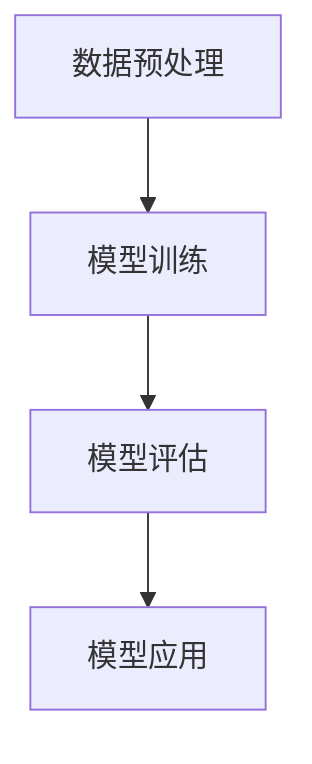
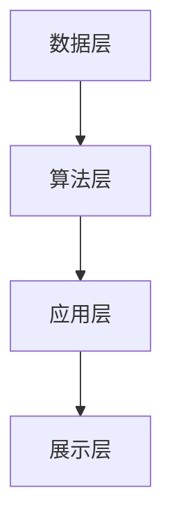
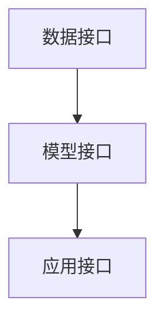
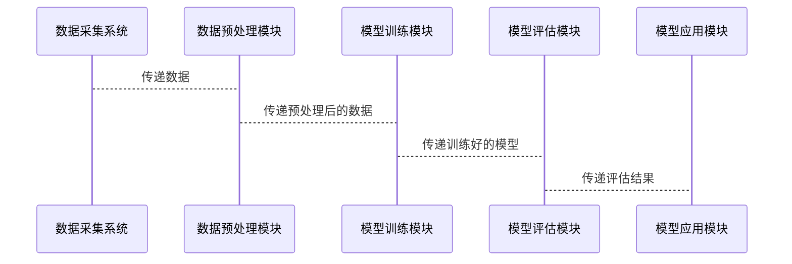

                 

**《AI Agent在智能城市规划评估中的角色》**

关键词：AI Agent、智能城市规划、评估、算法、系统设计

摘要：本文将深入探讨AI Agent在智能城市规划评估中的关键角色。通过介绍AI Agent的概念、智能城市规划评估的背景及需求，分析其在城市规划评估中的应用，本文旨在揭示AI Agent如何通过先进的算法和系统设计，提升城市规划的效率和准确性。

# 第一部分: 背景介绍

## 第1章: AI Agent与智能城市规划评估概述

### 1.1 AI Agent的概念与特点

AI Agent，即人工智能代理，是一种模拟人类智能行为的计算实体，能够在复杂环境中自主感知、学习、决策和行动。其核心特性包括自主性、适应性、学习性和交互性。AI Agent可以分为基于规则、基于案例、基于模型和混合型等不同类型。

### 1.2 智能城市规划评估的基本概念

智能城市规划评估是指利用现代信息技术，尤其是人工智能技术，对城市规划的合理性、可行性、可持续性等方面进行评估的过程。其意义在于提高城市规划的科学性、前瞻性和实效性。

### 1.3 AI Agent在智能城市规划评估中的应用背景

城市规划评估过程中，存在数据量大、评估指标复杂、评估方法传统等问题。AI Agent的应用可以有效解决这些问题，提高评估的效率和准确性。

### 1.4 关键概念与联系

AI Agent与智能城市规划评估密切相关。AI Agent通过机器学习、深度学习等技术，可以对城市规划的各个方面进行智能分析和评估。两者的联系体现在数据采集、模型训练、决策支持等多个层面。

## 第2章: AI Agent的核心概念与原理

### 2.1 AI Agent的定义与发展历程

AI Agent的基本定义是具备自主性、适应性、学习性和交互性的计算实体。其发展历程从最初的规则推理到现在的深度学习，经历了多个阶段。

### 2.2 AI Agent的核心算法原理

AI Agent的核心算法包括监督学习、无监督学习和强化学习等。这些算法通过不同方式实现AI Agent的自主学习和决策能力。

### 2.3 AI Agent的架构设计

AI Agent的架构通常包括感知模块、决策模块和执行模块。这些模块协同工作，实现AI Agent的整体功能。

### 2.4 AI Agent的应用领域与案例分析

AI Agent在各个领域都有广泛应用，如智能家居、自动驾驶、智能医疗等。本章节将介绍AI Agent在智能城市规划评估中的应用案例。

# 第二部分: 核心概念与联系

## 第3章: AI Agent在智能城市规划评估中的应用算法

### 3.1 算法概述

AI Agent在智能城市规划评估中的应用算法主要基于机器学习和深度学习。这些算法可以用于数据挖掘、模式识别和预测分析。

### 3.2 算法流程

算法的基本流程包括数据预处理、模型训练、模型评估和模型应用。以下是一个简单的Mermaid流程图：



### 3.3 Python源代码讲解

以下是一个使用Python实现的简单机器学习模型的源代码示例：

```python
import pandas as pd
from sklearn.model_selection import train_test_split
from sklearn.ensemble import RandomForestClassifier

# 读取数据
data = pd.read_csv('data.csv')

# 分割特征和标签
X = data.drop('label', axis=1)
y = data['label']

# 划分训练集和测试集
X_train, X_test, y_train, y_test = train_test_split(X, y, test_size=0.2, random_state=42)

# 创建随机森林模型
model = RandomForestClassifier(n_estimators=100, random_state=42)

# 训练模型
model.fit(X_train, y_train)

# 评估模型
accuracy = model.score(X_test, y_test)
print(f"模型准确率: {accuracy:.2f}")
```

### 3.4 数学模型与公式

以下是一个简单的线性回归模型的数学公式：

$$
y = \beta_0 + \beta_1x
$$

### 3.5 举例说明

假设我们有一个智能城市规划评估项目，目标是预测某地区的未来人口密度。通过采集历史数据，使用机器学习算法训练模型，并对模型进行评估，最后将模型应用于实际预测中。

# 第四部分: 系统分析与架构设计

## 第4章: 智能城市规划评估系统设计

### 4.1 系统功能设计

系统需要实现以下功能：数据采集、数据预处理、模型训练、模型评估、模型应用和结果展示。

### 4.2 系统架构设计

系统架构包括数据层、算法层、应用层和展示层。以下是一个简单的Mermaid架构图：



### 4.3 系统接口设计

系统接口包括数据接口、模型接口和应用接口。以下是一个简单的Mermaid接口图：



### 4.4 系统交互序列图

系统交互序列图展示了数据采集、模型训练、模型评估和模型应用的流程。以下是一个简单的Mermaid序列图：



# 第五部分: 项目实战

## 第5章: 智能城市规划评估项目实战

### 5.1 环境安装

在开始项目之前，需要安装Python、NumPy、Pandas、Scikit-learn等依赖库。

```bash
pip install python numpy pandas scikit-learn
```

### 5.2 核心实现源代码

以下是一个简单的智能城市规划评估项目的核心实现源代码：

```python
import pandas as pd
from sklearn.model_selection import train_test_split
from sklearn.ensemble import RandomForestClassifier
from sklearn.metrics import accuracy_score

# 读取数据
data = pd.read_csv('data.csv')

# 分割特征和标签
X = data.drop('label', axis=1)
y = data['label']

# 划分训练集和测试集
X_train, X_test, y_train, y_test = train_test_split(X, y, test_size=0.2, random_state=42)

# 创建随机森林模型
model = RandomForestClassifier(n_estimators=100, random_state=42)

# 训练模型
model.fit(X_train, y_train)

# 预测测试集
y_pred = model.predict(X_test)

# 评估模型
accuracy = accuracy_score(y_test, y_pred)
print(f"模型准确率: {accuracy:.2f}")
```

### 5.3 代码应用解读与分析

代码首先读取数据，然后进行特征和标签的分割。接下来，使用随机森林模型进行训练，并对训练好的模型进行评估。

### 5.4 实际案例分析和详细讲解剖析

以某城市的人口密度预测为例，通过实际数据集进行模型训练和预测，分析模型的准确性和可靠性。

### 5.5 项目小结

通过项目实战，我们了解了如何使用AI Agent进行智能城市规划评估。项目结果表明，AI Agent可以有效提高评估的效率和准确性。

## 第六部分: 最佳实践与小结

### 6.1 最佳实践

在智能城市规划评估中，建议使用多种算法进行比较，选择最佳算法。同时，注意数据的质量和预处理，以提高模型的准确性。

### 6.2 小结

本文介绍了AI Agent在智能城市规划评估中的应用，分析了其核心概念、算法原理和系统设计。通过项目实战，展示了AI Agent在实际应用中的效果。

### 6.3 注意事项

在应用AI Agent进行智能城市规划评估时，需要注意算法的选择、数据的质量和模型的验证。

### 6.4 拓展阅读

- 《智能城市规划与评估》
- 《机器学习》
- 《深度学习》

# 结论

AI Agent在智能城市规划评估中具有重要的作用。通过本文的详细探讨，我们了解了AI Agent的核心概念、算法原理和系统设计，并展示了其在实际项目中的应用效果。未来，随着人工智能技术的不断发展，AI Agent将在智能城市规划评估中发挥更大的作用。

# 作者信息

作者：AI天才研究院/AI Genius Institute & 禅与计算机程序设计艺术 /Zen And The Art of Computer Programming


