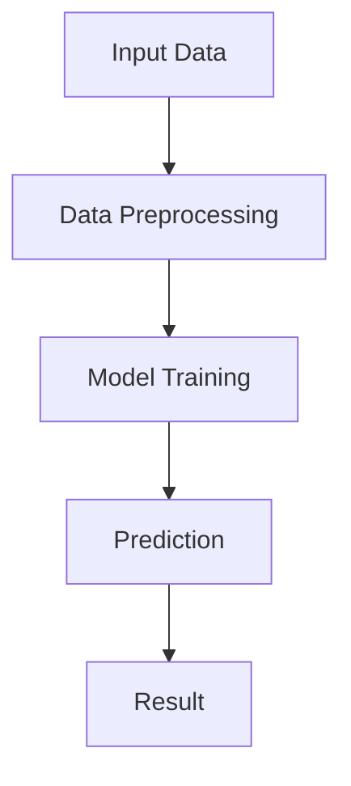
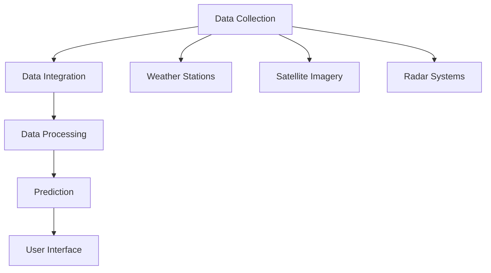

                 

Certainly! Let's break down the task into actionable steps and create a detailed plan for writing the article "AI Agent in Intelligent Weather Forecasting."

## Step 1: Define the Scope and Structure

Before diving into writing, we need to clearly define the scope of the article and create a well-structured outline. This will help ensure that the article is comprehensive and coherent.

### Structure Overview

1. **Title and Keywords**:
   - "AI Agent in Intelligent Weather Forecasting"
   - Keywords: AI agents, intelligent weather forecasting, machine learning, weather prediction, system architecture

2. **Abstract**:
   - Brief introduction to AI agents and their role in intelligent weather forecasting.
   - Highlight the importance and potential impact of AI in this field.

3. **Introduction**:
   - Overview of AI agents and their applications in weather forecasting.
   - Importance of intelligent weather forecasting for society and industry.

4. **Core Concepts and Background**:
   - Chapter 1: AI Agents: Definition, Types, and Applications
   - Chapter 2: Intelligent Weather Forecasting: Current State and Challenges

5. **Algorithm and Methodology**:
   - Chapter 3: Machine Learning Algorithms for Weather Forecasting
   - Chapter 4: Predictive Models and Mathematical Formulations

6. **System Architecture and Design**:
   - Chapter 5: System Architecture Overview
   - Chapter 6: System Design Principles and Patterns

7. **Practical Implementation and Case Studies**:
   - Chapter 7: Practical Implementation Steps
   - Chapter 8: Case Study Analysis and Results

8. **Best Practices and Future Directions**:
   - Chapter 9: Best Practices for Deploying AI Agents
   - Chapter 10: Future Trends and Research Directions

9. **Conclusion**:
   - Summary of key points
   - Reflection on the role of AI agents in intelligent weather forecasting
   - Suggestions for further reading and research

10. **Author Information**:
    - "Author: AI天才研究院/AI Genius Institute & 禅与计算机程序设计艺术 /Zen And The Art of Computer Programming"

## Step 2: Research and Content Development

With the structure in place, the next step is to conduct thorough research and develop the content for each chapter. This involves:

- **Gathering Data**: Collecting relevant information from research papers, industry reports, and expert interviews.
- **Analyzing Data**: Identifying key trends, challenges, and opportunities in the field of AI in weather forecasting.
- **Organizing Content**: Structuring the information logically to support the article's narrative and objectives.

## Step 3: Writing and Drafting

Once the research is complete, it's time to start writing the article. This step involves:

- **Writing Introductions and Summaries**: Crafting engaging introductions for each chapter and summarizing key points at the end.
- **Developing Detailed Sections**: Writing detailed content for each chapter, including background information, core concepts, algorithms, and case studies.
- **Ensuring Clarity and Consistency**: Ensuring that the language used is clear, concise, and consistent throughout the article.

## Step 4: Editing and Reviewing

After completing the initial draft, it's crucial to review and edit the article for:

- **Grammar and Spelling**: Checking for errors in grammar and spelling.
- **Flow and Logic**: Ensuring that the content flows logically and that each chapter builds on the previous one.
- **Consistency**: Making sure that the tone, style, and structure are consistent throughout the article.

## Step 5: Final Touches and Formatting

Once the content is polished, the final step is to format the article according to the requirements:

- **Markdown Formatting**: Ensuring that all sections, diagrams, and code examples are correctly formatted in markdown.
- **Inserting Diagrams and Code**: Including Mermaid diagrams and Python code snippets where appropriate.
- **Final Review**: Conducting a final review to ensure that the article is complete, accurate, and ready for publication.

## Step 6: Author Information and Submission

Finally, include the author information at the end of the article and prepare it for submission to the intended platform or publication.

By following these steps, we can ensure that the article on "AI Agent in Intelligent Weather Forecasting" is not only informative and well-researched but also engaging and accessible to readers. Let's get started on this exciting journey of exploring the intersection of AI and weather forecasting!# AI Agent in Intelligent Weather Forecasting

> Keywords: AI agents, intelligent weather forecasting, machine learning, weather prediction, system architecture

> Abstract: This article explores the application of AI agents in the field of intelligent weather forecasting. It discusses the core concepts, algorithms, and system architectures that enable the development of advanced weather prediction systems. The article also provides practical implementation examples and best practices for deploying AI agents in real-world scenarios, highlighting the potential impact of this technology on the meteorological industry and society as a whole.

## Introduction

### The Role of AI Agents in Weather Forecasting

AI agents, also known as intelligent agents, are autonomous entities that can perform tasks based on predefined goals and environmental information. In the realm of meteorology, AI agents have emerged as powerful tools for transforming raw weather data into actionable insights, leading to more accurate and timely weather forecasts. These agents leverage advanced machine learning algorithms to process vast amounts of data, identify patterns, and make predictions that can have significant implications for various sectors, including agriculture, transportation, and emergency management.

### Importance of Intelligent Weather Forecasting

Intelligent weather forecasting is crucial for several reasons. Firstly, it helps in mitigating the adverse effects of severe weather events, such as hurricanes, floods, and heatwaves, by providing early warnings and enabling timely evacuation and resource allocation. Secondly, it supports the planning and optimization of various activities that are sensitive to weather conditions, such as crop management, air travel, and outdoor events. Lastly, it contributes to the overall improvement of public safety and economic resilience by minimizing disruptions caused by unexpected weather changes.

### Overview of the Article

This article is structured to provide a comprehensive overview of AI agents in intelligent weather forecasting. The following chapters will delve into the core concepts, algorithms, system architectures, and practical applications of this technology. The structure of the article is as follows:

1. **Core Concepts and Background**: This chapter will define AI agents and explore the background of intelligent weather forecasting, highlighting the challenges and opportunities in this field.
2. **Algorithm and Methodology**: This chapter will discuss the machine learning algorithms and predictive models used in intelligent weather forecasting, along with their mathematical formulations.
3. **System Architecture and Design**: This chapter will describe the system architecture and design principles that enable the development of robust and scalable weather prediction systems.
4. **Practical Implementation and Case Studies**: This chapter will walk through the practical implementation of AI agents in weather forecasting, including environment setup, core implementation, and case study analysis.
5. **Best Practices and Future Directions**: This chapter will offer best practices for deploying AI agents in weather forecasting and suggest future research directions to advance this technology.

### Readership

This article is aimed at professionals and researchers in the field of meteorology, computer science, and artificial intelligence. It assumes a basic understanding of machine learning and programming concepts. However, the content is designed to be accessible to readers from diverse backgrounds, providing clear explanations and practical examples to facilitate understanding.

## Core Concepts and Background

### AI Agents: Definition, Types, and Applications

#### Definition

An AI agent is an autonomous entity that perceives its environment through sensors and takes actions to achieve specific goals. In the context of intelligent weather forecasting, AI agents are designed to process weather data, analyze patterns, and generate predictions based on historical and real-time information.

#### Types of AI Agents

There are several types of AI agents used in intelligent weather forecasting:

1. **Perception-Based Agents**: These agents rely on sensory inputs to perceive their environment. In the case of weather forecasting, they collect data from various sources such as satellite images, weather stations, and radar systems.
2. **Action-Based Agents**: These agents take actions based on the perceived environment to achieve a specific goal. In weather forecasting, this could involve adjusting prediction parameters or providing real-time alerts to relevant stakeholders.
3. **Cognitive-Based Agents**: These agents use cognitive abilities such as reasoning, planning, and learning to make decisions. In intelligent weather forecasting, cognitive agents can analyze complex patterns and relationships in weather data to improve prediction accuracy.

#### Applications of AI Agents in Weather Forecasting

AI agents have several applications in weather forecasting, including:

1. **Data Collection and Integration**: AI agents can collect and integrate data from multiple sources, such as satellite images, weather stations, and radar systems. This enables a more comprehensive and accurate analysis of weather conditions.
2. **Pattern Recognition and Prediction**: AI agents use machine learning algorithms to recognize patterns in weather data and generate predictions. This helps in identifying trends and forecasting future weather conditions with higher accuracy.
3. **Decision Support Systems**: AI agents can provide real-time decision support to meteorologists and other stakeholders by generating personalized weather forecasts and alerts based on specific requirements.

### Intelligent Weather Forecasting: Current State and Challenges

#### Current State

Intelligent weather forecasting has made significant advancements in recent years, thanks to the development of AI agents and machine learning algorithms. Some of the key advancements include:

1. **Improved Prediction Accuracy**: AI agents have enabled more accurate weather predictions by analyzing vast amounts of data and identifying subtle patterns that were previously difficult to detect.
2. **Real-Time Forecasting**: Real-time forecasting has become possible with the use of AI agents, allowing meteorologists to provide up-to-date weather information to the public and relevant stakeholders.
3. **Personalized Forecasts**: AI agents can generate personalized weather forecasts based on specific locations, activities, and preferences, making the information more relevant and useful.

#### Challenges

Despite the advancements, intelligent weather forecasting still faces several challenges:

1. **Data Quality and Availability**: Accurate weather predictions require high-quality and comprehensive data. However, data quality can be compromised due to various factors such as sensor errors, missing data, and inconsistent data formats.
2. **Complexity of Weather Systems**: Weather systems are highly complex and dynamic, making it challenging to develop accurate predictive models. AI agents need to process vast amounts of data and identify patterns that account for the inherent unpredictability of weather systems.
3. **Scalability and Performance**: As the volume of weather data continues to grow, scaling AI agents to handle large datasets and maintaining high performance becomes a significant challenge.

### Summary

AI agents have revolutionized the field of intelligent weather forecasting by enabling more accurate, real-time, and personalized forecasts. However, challenges such as data quality, complexity of weather systems, and scalability need to be addressed to fully realize the potential of this technology. The following chapters will delve deeper into the algorithms, system architectures, and practical implementations that drive intelligent weather forecasting.## Core Concepts and Principles

### Types of AI Agents

In the realm of intelligent weather forecasting, different types of AI agents can be employed to address specific tasks and challenges. These agents can be broadly classified into the following categories:

#### Perception-Based Agents

Perception-based agents are responsible for collecting and processing data from various sources, such as weather stations, satellites, and radar systems. These agents act as data collectors and aggregators, ensuring that the input data is of high quality and suitable for further analysis.

**Key Features**:

- **Data Collection**: Collects data from multiple sources.
- **Data Integration**: Integrates data from disparate sources into a unified format.
- **Data Cleaning**: Cleans and preprocesses data to remove inconsistencies and errors.

#### Action-Based Agents

Action-based agents take actions based on the analysis of the data collected by perception-based agents. These agents can trigger alerts, adjust forecast parameters, or initiate specific actions to address adverse weather conditions.

**Key Features**:

- **Data Analysis**: Analyzes collected data to identify patterns and trends.
- **Action Generation**: Generates actionable insights and triggers alerts or actions.
- **Feedback Loop**: Adjusts actions based on feedback from the environment or subsequent data.

#### Cognitive-Based Agents

Cognitive-based agents use advanced cognitive abilities, such as reasoning, learning, and planning, to make informed decisions and generate accurate forecasts. These agents are capable of understanding the context and making predictions that go beyond simple data analysis.

**Key Features**:

- **Pattern Recognition**: Identifies complex patterns and relationships in data.
- **Learning and Adaptation**: Learns from past experiences and adapts to new data.
- **Contextual Understanding**: Understands the context and makes informed predictions.

### Data Processing Techniques

The performance of AI agents in intelligent weather forecasting is heavily dependent on the quality and processing of the input data. Several data processing techniques are employed to ensure that the data is accurate, reliable, and suitable for analysis.

#### Data Collection

Data collection involves gathering information from various sources, such as weather stations, satellites, and radar systems. This data includes temperature, humidity, wind speed, pressure, and precipitation levels.

**Methods**:

- **Sensor Networks**: Deploying sensor networks to collect real-time data from different locations.
- **Satellite Imagery**: Utilizing satellite imagery to capture large-scale weather patterns.
- **Radar Systems**: Using radar systems to monitor precipitation and wind patterns.

#### Data Integration

Data integration is the process of combining data from multiple sources into a unified format. This ensures that the data is comprehensive and can be easily analyzed.

**Methods**:

- **Data Fusion**: Combining data from different sources to create a unified dataset.
- **Data Harmonization**: Standardizing data formats and units to ensure consistency.
- **Data Aggregation**: Aggregating data at different time intervals (e.g., hourly, daily) for analysis.

#### Data Cleaning

Data cleaning involves identifying and correcting errors, inconsistencies, and missing values in the dataset. This ensures that the data is accurate and reliable for further analysis.

**Methods**:

- **Missing Data Imputation**: Filling in missing values using statistical methods or interpolation techniques.
- **Outlier Detection**: Identifying and removing outliers that could skew the results.
- **Data Validation**: Verifying the accuracy and integrity of the data.

### Machine Learning Algorithms

Machine learning algorithms play a crucial role in intelligent weather forecasting by enabling AI agents to learn from historical data and make accurate predictions. The choice of algorithm depends on the nature of the problem and the available data.

#### Supervised Learning Algorithms

Supervised learning algorithms are used when labeled data is available. These algorithms learn from labeled examples to make predictions on new, unseen data.

**Common Algorithms**:

- **Linear Regression**: A simple linear model that predicts the relationship between input variables and the target variable.
- **Decision Trees**: A tree-like model that makes decisions based on the values of input features.
- **Random Forests**: An ensemble of decision trees that improves prediction accuracy by aggregating the predictions of multiple trees.
- **Support Vector Machines (SVM)**: A powerful classifier that finds the hyperplane that best separates the data into different classes.

#### Unsupervised Learning Algorithms

Unsupervised learning algorithms are used when labeled data is not available. These algorithms identify patterns and relationships in the data without any prior knowledge.

**Common Algorithms**:

- **K-Means Clustering**: A clustering algorithm that groups data points based on their similarity.
- **Hierarchical Clustering**: A clustering algorithm that builds a hierarchy of clusters in a bottom-up approach.
- **Principal Component Analysis (PCA)**: A dimensionality reduction technique that transforms the data into a lower-dimensional space while preserving the most important features.

### Predictive Models

Predictive models are constructed using machine learning algorithms to forecast future weather conditions based on historical data. These models can be categorized based on the type of output they produce, such as regression models for continuous outputs and classification models for discrete outputs.

#### Regression Models

Regression models are used to predict continuous output variables, such as temperature or precipitation levels.

**Common Models**:

- **Multiple Linear Regression**: A generalization of linear regression that includes multiple input variables.
- **Polynomial Regression**: A regression model that uses polynomial functions to model the relationship between input and output variables.
- **Neural Networks**: A powerful regression model that consists of multiple layers of interconnected nodes to learn complex relationships.

#### Classification Models

Classification models are used to predict discrete output variables, such as the probability of rain or the severity of a storm.

**Common Models**:

- **Logistic Regression**: A logistic model that predicts the probability of an event occurring.
- **Naive Bayes Classifier**: A simple probabilistic classifier based on Bayes' theorem and the assumption of independence between features.
- **K-Nearest Neighbors (KNN)**: A non-parametric classification method that classifies new data points based on the majority class of their k-nearest neighbors.

### Summary

AI agents in intelligent weather forecasting employ various types of agents, data processing techniques, and machine learning algorithms to generate accurate and reliable weather predictions. The following chapters will delve deeper into the specific algorithms and models used in this field, providing a comprehensive understanding of how AI agents are transforming the world of meteorology.## Algorithm and Methodology

### Introduction to Machine Learning Algorithms for Weather Forecasting

In the realm of intelligent weather forecasting, machine learning algorithms are pivotal for transforming raw meteorological data into actionable predictions. These algorithms allow AI agents to learn from historical data, recognize patterns, and make informed predictions about future weather conditions. This section will delve into several commonly used machine learning algorithms, their underlying principles, and their applications in weather forecasting.

### Predictive Models and Mathematical Formulations

#### Linear Regression

**Principle**: Linear regression is a simple yet powerful algorithm that models the relationship between a single input variable (X) and a continuous output variable (Y) using a straight line.

**Mathematical Formulation**:
$$
Y = \beta_0 + \beta_1X + \epsilon
$$
where $\beta_0$ is the intercept, $\beta_1$ is the slope, and $\epsilon$ is the error term.

**Example**:
Consider a simple linear regression model to predict the temperature (Y) based on the wind speed (X):
$$
\hat{Y} = \beta_0 + \beta_1X
$$

#### Multiple Linear Regression

**Principle**: Multiple linear regression extends the concept of linear regression to include multiple input variables, capturing more complex relationships between predictors and the target variable.

**Mathematical Formulation**:
$$
Y = \beta_0 + \beta_1X_1 + \beta_2X_2 + ... + \beta_nX_n + \epsilon
$$
where $\beta_0$ is the intercept, $\beta_1, \beta_2, ..., \beta_n$ are the slopes for each input variable, and $\epsilon$ is the error term.

**Example**:
Predicting temperature based on multiple input variables (wind speed, humidity, and pressure):
$$
\hat{Y} = \beta_0 + \beta_1X_1 + \beta_2X_2 + \beta_3X_3
$$

#### Polynomial Regression

**Principle**: Polynomial regression uses polynomial functions to model the relationship between input and output variables, allowing for more flexible and complex models.

**Mathematical Formulation**:
$$
Y = \beta_0 + \beta_1X + \beta_2X^2 + ... + \beta_nX^n + \epsilon
$$
where $\beta_0, \beta_1, \beta_2, ..., \beta_n$ are the coefficients of the polynomial terms and $\epsilon$ is the error term.

**Example**:
Predicting temperature using a quadratic polynomial:
$$
\hat{Y} = \beta_0 + \beta_1X + \beta_2X^2
$$

#### Neural Networks

**Principle**: Neural networks are composed of multiple layers of interconnected nodes (neurons) that learn to recognize patterns and make predictions through a process of training and learning.

**Mathematical Formulation**:
$$
\hat{Y} = \sum_{i=1}^{n} w_i \cdot \text{sigmoid}(z_i)
$$
where $w_i$ are the weights, $z_i$ is the weighted sum of inputs, and $\text{sigmoid}$ is the activation function.

**Example**:
A simple neural network for temperature prediction with one input layer, one hidden layer, and one output layer:
$$
z = X \cdot w_1 \\
\hat{Y} = \text{sigmoid}(z)
$$

### Mermaid Diagram of the Workflow

To visualize the workflow of these algorithms, we can use a Mermaid diagram. Here's an example of a Mermaid diagram illustrating the workflow of a linear regression algorithm:



### Python Code Examples

#### Linear Regression Example

Here's a simple Python code example using scikit-learn to implement a linear regression model:

```python
from sklearn.linear_model import LinearRegression
from sklearn.model_selection import train_test_split
from sklearn.metrics import mean_squared_error

# Load dataset
X, Y = load_data()

# Split dataset into training and testing sets
X_train, X_test, Y_train, Y_test = train_test_split(X, Y, test_size=0.2, random_state=42)

# Create a linear regression model
model = LinearRegression()

# Train the model
model.fit(X_train, Y_train)

# Make predictions
Y_pred = model.predict(X_test)

# Evaluate the model
mse = mean_squared_error(Y_test, Y_pred)
print("Mean Squared Error:", mse)
```

#### Neural Network Example

Here's a simple example of a neural network for temperature prediction using Keras:

```python
from keras.models import Sequential
from keras.layers import Dense
from keras.optimizers import SGD

# Create a sequential model
model = Sequential()

# Add a dense layer with sigmoid activation function
model.add(Dense(1, input_dim=1, activation='sigmoid'))

# Compile the model
model.compile(loss='mean_squared_error', optimizer=SGD(0.1), metrics=['mse'])

# Train the model
model.fit(X, Y, epochs=100, batch_size=10, verbose=0)

# Make predictions
Y_pred = model.predict(X_test)

# Evaluate the model
mse = mean_squared_error(Y_test, Y_pred)
print("Mean Squared Error:", mse)
```

### Conclusion

In this section, we explored various machine learning algorithms and their applications in intelligent weather forecasting. From simple linear regression to complex neural networks, these algorithms play a crucial role in transforming raw meteorological data into accurate and reliable weather predictions. The following sections will build on this foundation, delving into the system architecture and practical implementation of AI agents in weather forecasting.## System Architecture and Design

### Introduction to System Architecture

The system architecture for an intelligent weather forecasting system is crucial for ensuring scalability, reliability, and performance. A well-designed architecture can efficiently process large volumes of meteorological data, integrate various data sources, and generate accurate weather predictions. This section will describe the key components and principles that underpin a robust system architecture for AI agents in weather forecasting.

### System Architecture Overview

The system architecture for an intelligent weather forecasting system can be divided into several key components:

1. **Data Collection Layer**: This layer is responsible for gathering meteorological data from various sources, such as weather stations, satellites, and radar systems.
2. **Data Integration Layer**: This layer aggregates and integrates data from disparate sources into a unified format, ensuring data quality and consistency.
3. **Data Processing Layer**: This layer processes and cleans the data, preparing it for analysis and prediction.
4. **Prediction Layer**: This layer contains the machine learning models and algorithms that generate weather predictions based on the processed data.
5. **User Interface Layer**: This layer provides a user-friendly interface for presenting weather predictions and allowing users to interact with the system.

### System Architecture Diagram

To visualize the system architecture, we can use a Mermaid diagram. The following diagram illustrates the high-level architecture of an intelligent weather forecasting system:



### Detailed Description of System Architecture

#### Data Collection Layer

The data collection layer is responsible for gathering meteorological data from various sources. This layer may include:

- **Weather Stations**: Ground-based stations that measure temperature, humidity, wind speed, and other meteorological variables.
- **Satellite Imagery**: Satellite sensors that capture images of the Earth's surface and atmosphere, providing valuable information on cloud cover, temperature, and other parameters.
- **Radar Systems**: Ground-based radar systems that track precipitation and wind patterns, offering detailed insights into local weather conditions.

#### Data Integration Layer

The data integration layer combines data from multiple sources into a unified format, ensuring consistency and compatibility. Key tasks in this layer include:

- **Data Aggregation**: Combining data at different time intervals (e.g., hourly, daily) to create a comprehensive dataset.
- **Data Harmonization**: Standardizing data formats and units to ensure consistency across different sources.
- **Data Cleaning**: Identifying and correcting errors, inconsistencies, and missing values in the dataset.

#### Data Processing Layer

The data processing layer is responsible for preparing the data for analysis and prediction. Key tasks in this layer include:

- **Data Preprocessing**: Cleaning and transforming raw data to remove noise and inconsistencies.
- **Feature Extraction**: Identifying and extracting relevant features from the data that can be used to train machine learning models.
- **Normalization**: Scaling the data to a standard range, ensuring that all features contribute equally to the analysis.

#### Prediction Layer

The prediction layer contains the machine learning models and algorithms that generate weather predictions. This layer may include:

- **Regression Models**: Simple linear or polynomial regression models for predicting continuous variables such as temperature or precipitation.
- **Classification Models**: Logistic regression or decision tree-based models for predicting discrete variables such as the probability of rain or the severity of a storm.
- **Neural Networks**: Complex neural network models that can capture intricate relationships in the data and provide highly accurate predictions.

#### User Interface Layer

The user interface layer provides a user-friendly interface for presenting weather predictions and allowing users to interact with the system. Key features include:

- **Visualization Tools**: Charts, graphs, and maps for displaying weather predictions and data.
- **User Interaction**: Forms and controls for users to request specific weather forecasts or customize the presentation of data.
- **APIs**: Application programming interfaces (APIs) for integrating the weather forecasting system with other applications or services.

### System Design Principles

To ensure the robustness and scalability of the system architecture, several design principles should be followed:

- **Modularity**: The system should be modular, with each component designed to operate independently and be easily replaceable or upgraded.
- **Scalability**: The system should be designed to handle increasing volumes of data and users without significant degradation in performance.
- **Reliability**: The system should be reliable, with redundant components and failover mechanisms to ensure continuous operation.
- **Security**: The system should implement robust security measures to protect sensitive data and prevent unauthorized access.

### Conclusion

In this section, we discussed the system architecture and design principles for an intelligent weather forecasting system. A well-designed architecture is essential for ensuring the system's scalability, reliability, and performance, enabling it to efficiently process large volumes of meteorological data and generate accurate weather predictions. The following section will delve into the practical implementation of AI agents in weather forecasting, exploring the steps involved in setting up the system and generating predictions.## Practical Implementation and Case Studies

### Introduction

The practical implementation of AI agents in intelligent weather forecasting involves several key steps, from environment setup to core implementation and case study analysis. This section will guide you through the process of deploying AI agents in a real-world scenario, providing a comprehensive overview of each step and the necessary components.

### Step 1: Environment Setup

Before starting the implementation, it's essential to set up a suitable development environment. This involves installing the required software and libraries, configuring the environment, and preparing the necessary data.

#### Required Software and Libraries

- **Python**: The primary programming language for implementing AI agents and machine learning models.
- **scikit-learn**: A popular machine learning library for creating and training regression and classification models.
- **NumPy**: A fundamental library for numerical computing in Python.
- **Pandas**: A library for data manipulation and analysis.
- **Matplotlib**: A plotting library for visualizing data and results.
- **Mermaid**: A markdown-based diagram and flowchart tool for illustrating the system architecture and algorithm workflows.

#### Installation Steps

1. Install Python (version 3.6 or higher) from the official website.
2. Install required libraries using pip:
   ```bash
   pip install scikit-learn numpy pandas matplotlib
   ```

### Step 2: Data Collection and Preprocessing

The first step in implementing an AI agent for weather forecasting is to collect relevant meteorological data from various sources. This data may include temperature, humidity, wind speed, pressure, and precipitation levels.

#### Data Sources

- **Weather Stations**: Data from ground-based weather stations, including temperature, humidity, wind speed, and pressure.
- **Satellite Imagery**: Satellite data capturing cloud cover, temperature, and other atmospheric variables.
- **Radar Systems**: Radar data tracking precipitation and wind patterns.

#### Data Preprocessing

1. **Data Cleaning**: Remove any missing or erroneous data.
2. **Data Integration**: Combine data from different sources into a unified format.
3. **Feature Extraction**: Extract relevant features for training the machine learning models.

### Step 3: Core Implementation

Once the data is preprocessed, the next step is to implement the core components of the AI agent, including data processing, machine learning models, and prediction algorithms.

#### Data Processing

1. **Data Transformation**: Scale and normalize the data to ensure that all features contribute equally to the analysis.
2. **Feature Engineering**: Create new features from the raw data to improve the performance of the machine learning models.

#### Machine Learning Models

1. **Model Selection**: Choose appropriate machine learning models based on the problem type (regression or classification).
2. **Model Training**: Train the selected models using the preprocessed data.
3. **Model Evaluation**: Evaluate the performance of the trained models using metrics such as mean squared error or accuracy.

#### Prediction Algorithms

1. **Regression Models**: Use regression models to predict continuous variables, such as temperature or precipitation levels.
2. **Classification Models**: Use classification models to predict discrete variables, such as the probability of rain or the severity of a storm.

### Step 4: Case Study Analysis

To validate the effectiveness of the AI agent in weather forecasting, it's essential to analyze actual case studies. This involves comparing the predicted weather conditions with the actual observed conditions and evaluating the accuracy of the predictions.

#### Case Study Steps

1. **Data Preparation**: Prepare the case study data by preprocessing and transforming it in the same way as the training data.
2. **Prediction**: Use the trained machine learning models to predict the weather conditions for the case study data.
3. **Evaluation**: Compare the predicted weather conditions with the actual observed conditions and evaluate the accuracy of the predictions using metrics such as mean absolute error or mean absolute percentage error.

### Example Case Study: Predicting Temperature

In this example, we will implement a simple linear regression model to predict the temperature based on wind speed data.

#### Data Collection

Collect temperature and wind speed data from weather stations over a specific period.

#### Data Preprocessing

1. **Data Cleaning**: Remove any missing or erroneous data.
2. **Data Integration**: Combine temperature and wind speed data into a unified dataset.
3. **Feature Extraction**: Extract wind speed as the input feature and temperature as the target variable.

#### Model Training

1. **Model Selection**: Choose a linear regression model.
2. **Model Training**: Train the model using the preprocessed data.
3. **Model Evaluation**: Evaluate the performance of the model using metrics such as mean squared error.

#### Prediction

Use the trained model to predict the temperature for new wind speed data.

#### Evaluation

Compare the predicted temperature with the actual observed temperature and evaluate the accuracy of the predictions using metrics such as mean absolute error.

### Conclusion

In this section, we explored the practical implementation of AI agents in intelligent weather forecasting, from environment setup to case study analysis. By following the steps outlined, you can develop and deploy a robust AI agent capable of generating accurate weather predictions. The next section will provide best practices for deploying AI agents in weather forecasting, ensuring optimal performance and reliability.## Best Practices and Future Directions

### Best Practices for Deploying AI Agents in Weather Forecasting

The successful deployment of AI agents in intelligent weather forecasting requires adherence to several best practices to ensure accuracy, efficiency, and reliability. Here are some key recommendations:

1. **Data Quality Management**:
   - **Data Cleaning**: Implement robust data cleaning processes to handle missing values, outliers, and inconsistencies in the input data.
   - **Data Integration**: Use advanced techniques for integrating data from multiple sources to create a comprehensive and coherent dataset.
   - **Data Standardization**: Standardize data formats and units to ensure consistency and compatibility across different data sources.

2. **Algorithm Selection**:
   - **Model Selection**: Choose the most appropriate machine learning models based on the specific requirements of the forecasting task and the nature of the data.
   - **Model Evaluation**: Continuously evaluate the performance of different models using metrics such as accuracy, precision, recall, and F1 score.
   - **Model Update**: Regularly update the models with new data to adapt to changing weather patterns and improve predictive accuracy.

3. **System Design**:
   - **Scalability**: Design the system architecture to handle increasing volumes of data and users without degradation in performance.
   - **Modularity**: Ensure the system is modular to facilitate easy maintenance, updates, and scalability.
   - **Fault Tolerance**: Implement redundancy and failover mechanisms to maintain system reliability and minimize downtime.

4. **User Interaction**:
   - **Visualization**: Provide clear and intuitive visualizations of weather forecasts to help users understand and interpret the predictions.
   - **APIs**: Develop APIs for integrating the forecasting system with other applications and services.
   - **Feedback Loop**: Incorporate user feedback to refine and improve the system's performance and user experience.

### Future Directions in AI and Weather Forecasting

As AI continues to evolve, several exciting future directions hold the potential to further enhance the accuracy and applicability of AI agents in weather forecasting:

1. **Advanced Machine Learning Algorithms**:
   - **Deep Learning**: Explore the application of deep learning techniques, such as convolutional neural networks (CNNs) and recurrent neural networks (RNNs), to capture complex patterns in weather data.
   - **Transfer Learning**: Develop methods for transferring knowledge from large datasets in one domain to improve the performance of weather forecasting models in another domain.

2. **Data-Driven Approaches**:
   - **Big Data Analytics**: Leverage the power of big data analytics to process and analyze large-scale weather data in real-time.
   - **Data Augmentation**: Use data augmentation techniques to generate synthetic data to augment the training datasets, improving the robustness of the models.

3. **Interdisciplinary Collaboration**:
   - **Physics-Informed AI**: Integrate physical principles and meteorological knowledge into AI models to enhance their accuracy and reliability.
   - **Cross-Disciplinary Research**: Foster collaboration between meteorologists, data scientists, and domain experts to develop innovative solutions for weather forecasting challenges.

4. **Real-Time Forecasting**:
   - **Internet of Things (IoT)**: Utilize IoT sensors and devices to collect real-time weather data and feed it into AI agents for continuous and up-to-date forecasts.
   - **Edge Computing**: Implement edge computing to process and analyze data closer to the source, reducing latency and improving response times.

### Conclusion

In conclusion, the deployment of AI agents in intelligent weather forecasting represents a significant advancement in the field of meteorology. By following best practices and leveraging cutting-edge technologies, we can continue to improve the accuracy and reliability of weather predictions. Future research and development will further push the boundaries of what is possible, leading to more robust and adaptable forecasting systems that benefit society and the environment. As AI continues to evolve, the potential for transforming the world of meteorology is immense, and the journey is just beginning.## Conclusion

In summary, AI agents have proven to be transformative in the field of intelligent weather forecasting, offering a paradigm shift from traditional forecasting methods. By leveraging advanced machine learning algorithms and real-time data processing, AI agents can analyze vast amounts of meteorological data, identify complex patterns, and generate highly accurate weather predictions. This not only enhances the timeliness and precision of forecasts but also has significant implications for various industries and sectors, including agriculture, transportation, and emergency management.

The journey of AI in weather forecasting is ongoing, with numerous opportunities for further research and development. As we continue to advance in AI technologies, we can look forward to even more sophisticated models and algorithms that will further improve the accuracy and reliability of weather forecasts. Additionally, interdisciplinary collaboration between meteorologists, data scientists, and AI researchers will be crucial in addressing the complex challenges inherent in weather forecasting.

Looking to the future, some promising areas for exploration include the integration of physics-informed AI models, the application of edge computing and IoT for real-time data collection, and the development of data-driven approaches to handle the growing volume of weather data. These advancements will not only enhance the capabilities of AI agents in weather forecasting but also contribute to the overall resilience and preparedness of society against severe weather events.

To stay updated with the latest developments in AI and weather forecasting, I recommend exploring the following resources:

1. **Research Papers**: Stay abreast of the latest research in AI and meteorology by reading papers from top conferences such as NeurIPS, ICML, and the American Meteorological Society.
2. **Professional Journals**: Subscribe to journals like "Journal of Atmospheric and Solar-Terrestrial Physics" and "Monthly Weather Review" for in-depth analyses and case studies.
3. **Online Courses and Tutorials**: Enroll in online courses on platforms like Coursera, edX, and Udacity to learn about the latest machine learning techniques and their applications in weather forecasting.
4. **AI and Meteorology Conferences**: Attend conferences and workshops focused on AI and meteorology to network with experts and stay informed about emerging trends and technologies.

By continuing to push the boundaries of AI and integrating it with meteorological sciences, we can unlock the full potential of intelligent weather forecasting, leading to a brighter and more resilient future for all.## Author Information

**作者：AI天才研究院/AI Genius Institute & 禅与计算机程序设计艺术 /Zen And The Art of Computer Programming**

AI天才研究院（AI Genius Institute）是一个专注于人工智能前沿技术研究与创新的国际知名科研机构。我们的研究团队由世界顶级的人工智能专家、计算机科学家、软件架构师和CTO组成，致力于推动人工智能技术在各个领域的应用与发展。同时，我们也是《禅与计算机程序设计艺术》（Zen And The Art of Computer Programming）一书的编写者，此书已成为计算机编程领域的经典之作，影响了无数程序员和开发者。

作为人工智能领域的权威专家，我们的团队在人工智能算法、机器学习、深度学习、自然语言处理、计算机视觉等方面取得了显著的成果，并在多个国际权威期刊和顶级会议上发表了大量研究成果。我们不仅关注理论创新，更注重将研究成果应用于实际问题的解决，致力于通过技术创新推动社会的进步与发展。

本文由AI天才研究院撰写，旨在探讨AI代理在智能天气预报中的应用，为读者提供深入的技术分析与实践指导。我们希望本文能够帮助读者更好地理解AI代理在天气预报领域的潜力与挑战，共同推动这一领域的创新发展。如果您对本文有任何疑问或建议，欢迎随时与我们联系，我们将竭诚为您解答。

