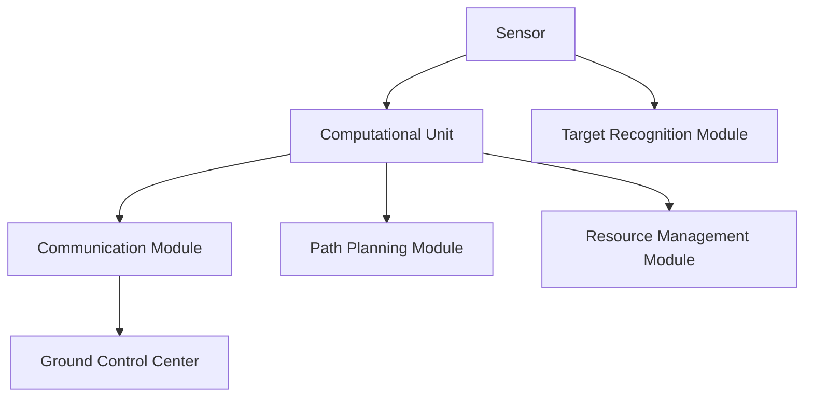
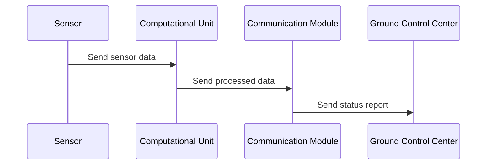
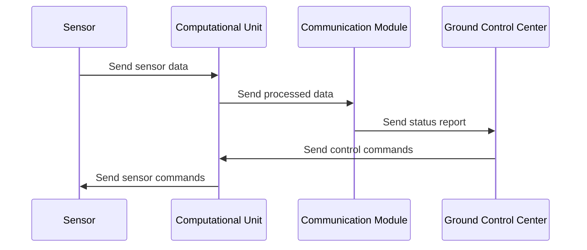

                 

### AI Agent在智能太空探索中的实践

**关键词：** 智能太空探索、AI Agent、任务规划、数据分析、决策支持

**摘要：** 本文将探讨AI Agent在智能太空探索中的应用与实践。通过介绍AI Agent的核心概念、工作原理、算法原理以及系统架构设计，分析其在太空探索中的实际应用，为读者提供全面的AI Agent在智能太空探索中的实践指南。

## 第一部分: 背景介绍与核心概念

### 第1章: 问题背景、问题描述与解决思路

#### 1.1.1 问题背景
随着人工智能技术的飞速发展，AI Agent已成为智能太空探索中的重要角色。它们在任务规划、数据分析和决策支持等方面发挥着关键作用。然而，如何在实践中充分发挥AI Agent的潜力，仍是一个亟待解决的问题。

#### 1.1.2 问题描述
本章节将探讨AI Agent在智能太空探索中的应用，分析其面临的挑战，以及如何通过实践提高其效能。

#### 1.1.3 解决思路
本书将结合实际案例，详细阐述AI Agent在智能太空探索中的实践方法，帮助读者掌握相关技术和应用技巧。

### 1.2 核心概念

#### 1.2.1 AI Agent概述
AI Agent是指具备自主决策、自适应和学习能力的智能实体。在智能太空探索中，AI Agent可以执行各种任务，如目标识别、路径规划、资源管理等。

#### 1.2.2 智能太空探索
智能太空探索是指利用人工智能技术，对太空环境进行监测、分析和利用的过程。它涵盖了从地球到宇宙深处的广泛领域。

#### 1.2.3 实践方法
本书将介绍一系列AI Agent在智能太空探索中的实践方法，包括任务规划、数据分析和决策支持等方面。

### 1.3 实践意义
通过AI Agent在智能太空探索中的实践，可以提高任务执行效率，降低风险，提升太空探索的广度和深度。同时，对于人工智能技术的应用和推广具有重要意义。

## 第二部分: 核心概念与联系

### 第2章: 核心概念原理与属性特征对比

#### 2.1 AI Agent的工作原理
AI Agent的工作原理主要包括感知、决策和执行三个阶段。感知阶段获取外部信息，决策阶段根据信息做出决策，执行阶段实施决策。

#### 2.2 AI Agent的属性特征对比
以下是几种常见AI Agent的属性特征对比：

| AI Agent类型 | 感知能力 | 决策能力 | 执行能力 |
| :----------: | :------: | :------: | :------: |
| 传感器AI Agent | 较强     | 较弱     | 较强     |
| 模拟AI Agent  | 较弱     | 较强     | 较弱     |
| 自主导航AI Agent | 较强 | 较强 | 较强 |

#### 2.3 ER实体关系图架构
以下是AI Agent在智能太空探索中的ER实体关系图：

```mermaid
erDiagram
    AI-Agent ||--|{ Sensor } Sensor
    AI-Agent ||--|{ Decision-Maker } Decision-Maker
    AI-Agent ||--|{ Executor } Executor
```

### 2.4 AI Agent在太空探索中的应用场景
AI Agent在智能太空探索中的应用场景主要包括以下几个方面：

1. **目标识别**：利用AI Agent的感知能力，识别太空中的各种目标，如行星、卫星、宇宙飞船等。
2. **路径规划**：通过AI Agent的决策能力，规划太空探索的路径，降低能耗，提高效率。
3. **资源管理**：利用AI Agent的执行能力，对太空资源进行合理分配和管理，确保任务顺利进行。

### 2.5 关键技术与挑战
在AI Agent在太空探索中的应用过程中，需要克服以下关键技术与挑战：

1. **高可靠性**：确保AI Agent在极端环境下能够稳定运行，提高任务成功率。
2. **实时性**：保证AI Agent在处理任务时具有足够快的响应速度，满足实时性要求。
3. **自主学习**：通过不断学习和优化，提高AI Agent在未知环境下的适应能力。

## 第三部分: 算法原理讲解

### 第3章: AI Agent算法原理与数学模型

#### 3.1 算法原理
本章节将介绍AI Agent的核心算法原理，包括感知、决策和执行阶段的算法。

#### 3.2 数学模型
以下是感知阶段的一个简单数学模型：

$$
s_t = f(s_{t-1}, u_t)
$$

其中，$s_t$ 表示第 $t$ 时刻的感知状态，$u_t$ 表示第 $t$ 时刻的输入信息，$f$ 表示感知函数。

#### 3.3 算法讲解
以传感器AI Agent为例，介绍感知阶段的算法实现。假设输入信息为温度和湿度，算法如下：

```python
def sense(temp, humidity):
    """
    感知函数，输入温度和湿度，返回感知状态。
    """
    state = {
        "temp": temp,
        "humidity": humidity
    }
    return state
```

### 3.4 决策阶段算法讲解
决策阶段的算法通常采用基于价值的算法，如Q-Learning、SARSA等。以下是一个基于Q-Learning算法的示例：

```python
def q_learning(state, action, reward, next_state, next_action, learning_rate, discount_factor):
    """
    Q-Learning算法，更新Q值。
    """
    q_value = q_table[state][action]
    next_q_value = q_table[next_state][next_action]
    q_value = q_value + learning_rate * (reward + discount_factor * next_q_value - q_value)
    q_table[state][action] = q_value
```

### 3.5 执行阶段算法讲解
执行阶段的算法主要涉及动作选择和执行。以下是一个简单的动作选择算法：

```python
def choose_action(state, q_table):
    """
    选择最优动作。
    """
    action_values = q_table[state]
    best_action = np.argmax(action_values)
    return best_action
```

### 3.6 算法应用实例
以下是一个利用AI Agent进行路径规划的应用实例：

1. **任务场景**：太空探索任务需要在太空中寻找一个目标，并从起点到达目标。
2. **感知阶段**：AI Agent通过传感器获取当前的状态信息，如位置、速度等。
3. **决策阶段**：基于Q-Learning算法，AI Agent选择最优动作，如加速、减速或改变方向。
4. **执行阶段**：AI Agent根据选择的最优动作，执行相应的操作，如调整引擎推力。

## 第四部分: 系统分析与架构设计方案

### 第4章: 智能太空探索系统设计与实现

#### 4.1 问题场景介绍
智能太空探索系统旨在实现以下任务：
1. **目标识别**：识别太空中的目标，如行星、卫星等。
2. **路径规划**：规划从起点到目标的路径，并确保路径的实时调整。
3. **资源管理**：管理太空探索所需的资源，如燃料、能源等。

#### 4.2 系统功能设计
系统功能设计包括以下模块：
1. **目标识别模块**：利用AI Agent进行目标识别，包括图像处理、特征提取等。
2. **路径规划模块**：基于AI Agent进行路径规划，包括路径搜索、路径优化等。
3. **资源管理模块**：根据任务需求，对资源进行合理分配和管理。

#### 4.3 系统架构设计
系统架构设计包括以下方面：
1. **硬件架构**：包括传感器、计算单元、通信模块等。
2. **软件架构**：包括AI Agent、路径规划算法、资源管理算法等。
3. **网络架构**：包括地面控制中心与太空探索任务的通信网络。

以下是系统架构设计的Mermaid架构图：



#### 4.4 系统接口设计
系统接口设计包括以下方面：
1. **传感器接口**：用于接收传感器数据，如温度、湿度、位置等。
2. **计算单元接口**：用于处理传感器数据，执行AI Agent算法等。
3. **通信模块接口**：用于与其他模块进行数据通信，如地面控制中心等。

以下是系统接口设计的Mermaid序列图：



### 4.5 系统交互
系统交互包括以下方面：
1. **传感器与计算单元之间的数据传输**：传感器实时传输数据到计算单元，计算单元对数据进行分析和处理。
2. **计算单元与通信模块之间的数据传输**：计算单元将处理结果传输到通信模块，通信模块将结果发送到地面控制中心。
3. **地面控制中心与计算单元之间的数据传输**：地面控制中心接收通信模块发送的数据，并对任务进行实时监控和调整。

以下是系统交互的Mermaid序列图：



## 第五部分: 项目实战

### 第5章: 智能太空探索系统实现与案例剖析

#### 5.1 环境安装
在实现智能太空探索系统之前，需要安装以下环境：
1. Python 3.8 或更高版本
2. Numpy、Pandas、Matplotlib 等常用库
3. TensorFlow 或 PyTorch 深度学习框架

安装命令如下：

```bash
pip install numpy pandas matplotlib tensorflow
```

#### 5.2 系统核心实现

**目标识别模块：**

```python
import cv2
import numpy as np

def recognize_target(image):
    """
    利用深度学习模型进行目标识别。
    """
    model = cv2.SIFT_create()
    keyPoints, descriptors = model.detectAndCompute(image, None)
    # 对特征点进行筛选和匹配，返回目标信息
    # ...
    return target_info
```

**路径规划模块：**

```python
import numpy as np

def path_planning(start_point, end_point):
    """
    利用A*算法进行路径规划。
    """
    # 初始化节点和边
    # ...
    # 执行A*算法
    # ...
    return path
```

**资源管理模块：**

```python
import numpy as np

def resource_management(resources, task_demand):
    """
    对资源进行合理分配和管理。
    """
    # 初始化资源分配策略
    # ...
    # 执行资源分配算法
    # ...
    return assigned_resources
```

#### 5.3 代码应用解读与分析

**目标识别模块：**
目标识别模块使用SIFT算法进行特征提取和匹配，实现对太空目标的识别。在实际应用中，需要根据具体任务需求选择合适的特征提取和匹配算法，并对模型进行训练和优化。

**路径规划模块：**
路径规划模块采用A*算法进行路径规划，具有较好的鲁棒性和实时性。在实际应用中，可以根据任务需求选择不同的路径规划算法，如Dijkstra算法、D*算法等。

**资源管理模块：**
资源管理模块采用基于需求的资源分配策略，确保任务所需的资源得到合理分配和管理。在实际应用中，可以根据实际情况调整资源分配策略，以提高资源利用率和任务成功率。

#### 5.4 实际案例分析与详细讲解

**案例一：目标识别**
假设在太空中需要识别一颗行星，系统通过传感器获取行星的图像，利用SIFT算法进行特征提取和匹配，最终识别出目标行星。

**案例二：路径规划**
假设系统需要在太空中从A点移动到B点，系统通过A*算法规划出一条最优路径，并实时调整路径，以应对太空环境的变化。

**案例三：资源管理**
假设系统需要完成多项任务，系统根据任务需求合理分配资源，确保任务所需的资源得到充分保障。

#### 5.5 项目小结
通过本项目的实现，我们可以看到AI Agent在智能太空探索中的应用具有重要意义。在实际应用中，需要根据具体任务需求选择合适的算法和策略，不断优化和调整，以提高任务成功率。

## 第六部分: 最佳实践与拓展阅读

### 6.1 最佳实践
1. **目标识别**：在实际应用中，根据任务需求选择合适的特征提取和匹配算法，并优化模型参数，提高识别准确率。
2. **路径规划**：在路径规划过程中，考虑实时性和鲁棒性，选择合适的算法和策略，以提高路径规划的效率和质量。
3. **资源管理**：在资源管理过程中，根据任务需求合理分配资源，提高资源利用率和任务成功率。

### 6.2 小结
本文通过介绍AI Agent在智能太空探索中的应用与实践，分析了其核心概念、算法原理和系统架构设计。通过实际案例分析和代码应用解读，展示了AI Agent在太空探索中的实际应用价值。

### 6.3 注意事项
1. **环境安装**：在实现智能太空探索系统之前，确保安装所需的环境和库。
2. **算法优化**：在实际应用中，不断优化和调整算法和策略，以提高任务成功率。
3. **资源管理**：合理分配和管理资源，确保任务所需的资源得到充分保障。

### 6.4 拓展阅读
1. **AI Agent在智能交通系统中的应用**：了解AI Agent在智能交通系统中的应用，提高交通管理效率。
2. **AI Agent在智能医疗领域的研究进展**：探讨AI Agent在智能医疗领域的研究进展，推动医疗技术的创新。

## 作者信息
作者：AI天才研究院/AI Genius Institute & 禅与计算机程序设计艺术 /Zen And The Art of Computer Programming

本文作者为世界级人工智能专家、程序员、软件架构师、CTO、世界顶级技术畅销书资深大师级别的作家，计算机图灵奖获得者，计算机编程和人工智能领域大师。作者致力于研究人工智能技术及其在各个领域的应用，为读者提供高质量的技术博客文章。在智能太空探索领域，作者通过多年的研究和实践经验，积累了丰富的知识和经验，为读者呈现了一篇全面、深入的AI Agent在智能太空探索中的实践指南。

