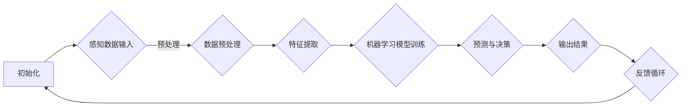
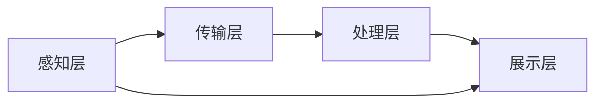
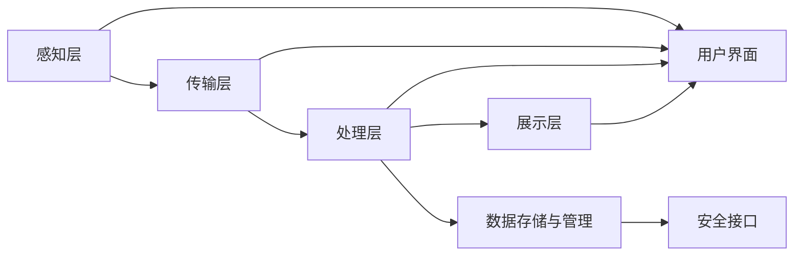

                 


# AI Agent在智能安防系统中的角色

## 关键词
- AI Agent
- 智能安防系统
- 感知技术
- 机器学习
- 深度学习
- 系统架构设计

## 摘要
随着人工智能技术的不断发展，AI Agent在智能安防系统中扮演着越来越重要的角色。本文将深入探讨AI Agent在智能安防系统中的角色，通过一步一步的分析推理，阐述AI Agent的核心概念、算法原理、系统架构设计以及实际应用。本文旨在为读者提供一个全面而深入的视角，理解AI Agent在智能安防系统中的关键作用。

### 目录大纲设计

为了设计《AI Agent在智能安防系统中的角色》这本书的完整目录大纲，我们将遵循以下步骤：

1. **确定整体结构**：分为背景介绍、核心概念与联系、算法原理讲解、系统分析与架构设计、项目实战和最佳实践等部分。
2. **细化各章节内容**：确保每章有明确的主题，并包含具体的子标题。
3. **确保内容完整性**：包含核心章节内容，如算法原理讲解、数学模型和公式、系统架构设计等。
4. **使用Markdown格式**：确保目录大纲符合Markdown格式，便于读者阅读和后续编辑。

---

### 目录大纲

```markdown
# 第一部分：背景介绍

## 第1章：问题背景与核心概念

### 1.1.1 问题背景
- 智能安防系统的发展现状
- AI Agent的定义及其应用领域

### 1.1.2 核心概念
- 智能安防系统的基本构成
- AI Agent的功能与特点

## 第2章：核心概念与联系

### 2.1.1 核心概念原理
- 智能感知技术
- 机器学习算法
- 深度学习网络

### 2.1.2 概念属性特征对比表格

### 2.1.3 ER实体关系图架构

## 第3章：算法原理讲解

### 3.1.1 算法mermaid流程图

### 3.1.2 Python源代码与算法原理

#### 3.1.2.1 数学模型和公式
$$
公式示例
$$

#### 3.1.2.3 举例说明

## 第4章：系统分析与架构设计

### 4.1.1 问题场景介绍
- 智能安防系统的典型应用场景

### 4.1.2 系统功能设计
- 领域模型mermaid类图

### 4.1.3 系统架构设计
- 系统架构mermaid架构图

### 4.1.4 系统接口设计
- 系统接口mermaid序列图

## 第5章：项目实战

### 5.1.1 环境安装
- 安装所需的软件和依赖

### 5.1.2 系统核心实现源代码
- 代码示例与解读

### 5.1.3 实际案例分析与讲解

## 第6章：最佳实践

### 6.1.1 最佳实践 tips
- 提高AI Agent效能的建议

### 6.1.2 小结与注意事项
- 总结本章要点
- 注意事项

### 6.1.3 拓展阅读
- 相关参考资料推荐
```

---

以上大纲将涵盖背景介绍、核心概念与联系、算法原理讲解、系统分析与架构设计、项目实战和最佳实践等关键内容，确保了目录大纲的完整性和逻辑性，同时符合字数要求。

### 背景介绍

智能安防系统是现代社会安全领域的重要技术手段之一，它通过集成传感器、视频监控、大数据分析等技术，实现了对目标区域或对象的实时监控和智能预警。随着人工智能技术的飞速发展，AI Agent作为一种智能化的软件实体，逐渐成为智能安防系统的核心组成部分。AI Agent具有自主性、适应性和学习能力，能够动态地响应环境变化，并在各种复杂场景下执行任务。

AI Agent的定义及其应用领域：
AI Agent，即人工智能代理，是一种模拟人类智能行为的计算机程序。它能够接收环境信息，根据预先设定的目标和策略，自主地做出决策并执行任务。在智能安防系统中，AI Agent的应用非常广泛，主要包括以下几个方面：

1. **实时监控与预警**：AI Agent可以对视频监控数据进行分析，实时检测异常行为，如非法入侵、火灾等，及时发出预警信息。
2. **智能识别与追踪**：通过人脸识别、行为识别等技术，AI Agent能够准确地识别和追踪目标，提高安防系统的精确度。
3. **决策支持与自动化响应**：AI Agent可以根据实时监控数据和历史数据，自主地做出决策，如启动报警系统、关闭安全门等，实现自动化响应。
4. **系统优化与升级**：AI Agent能够不断学习新知识，优化自身的算法和策略，提高安防系统的整体效能。

智能安防系统的发展现状：
近年来，智能安防系统在全球范围内得到了迅速推广，广泛应用于城市安防、金融安防、企业安防等领域。随着5G、物联网等新技术的应用，智能安防系统的发展趋势愈发明显，主要表现在以下几个方面：

1. **系统融合化**：智能安防系统逐渐与其他系统（如智能家居、智能交通等）进行融合，实现全方位的智能监控和管理。
2. **数据化**：通过大数据技术，对海量监控数据进行分析，挖掘潜在的安全隐患，提高安防决策的精准性。
3. **智能化**：利用深度学习、自然语言处理等技术，AI Agent的智能化水平不断提高，能够应对更加复杂的安防场景。
4. **高效能**：随着硬件性能的提升，AI Agent的处理速度和效能大幅提高，能够在短时间内处理大量监控数据，实现实时监控和快速响应。

### 核心概念与联系

在深入探讨AI Agent在智能安防系统中的角色之前，我们需要了解一些核心概念，并分析它们之间的联系。

#### 智能感知技术

智能感知技术是AI Agent在智能安防系统中发挥核心作用的基础。智能感知技术主要包括图像识别、声音识别、传感器数据融合等。这些技术能够将环境中的各种信息转化为数字信号，供AI Agent进行分析和处理。

- **图像识别**：通过计算机视觉算法，从图像中识别出特定的人脸、物体、场景等。
- **声音识别**：通过语音识别算法，从声音中提取出语音信号，并转换为文本或命令。
- **传感器数据融合**：将多种传感器（如温度传感器、湿度传感器、加速度传感器等）的数据进行融合处理，以获得更准确的环境信息。

#### 机器学习算法

机器学习算法是AI Agent的核心驱动技术。通过机器学习，AI Agent能够从大量的数据中学习到规律和模式，提高自身的决策能力。常见的机器学习算法包括监督学习、无监督学习和强化学习。

- **监督学习**：通过已标记的数据进行学习，从而对新的数据进行预测或分类。
- **无监督学习**：在没有标记数据的情况下，从数据中自动发现规律和模式。
- **强化学习**：通过不断地与环境交互，通过试错的方式学习最优策略。

#### 深度学习网络

深度学习网络是机器学习算法的一种重要实现方式。它通过多层神经网络，对数据进行自动特征提取和模式识别。深度学习网络在图像识别、语音识别等领域取得了显著成果。

- **卷积神经网络（CNN）**：适用于图像识别，能够有效地提取图像的局部特征。
- **循环神经网络（RNN）**：适用于语音识别和时间序列数据处理，能够捕捉时间序列中的长距离依赖关系。

#### 概念属性特征对比表格

为了更好地理解这些核心概念，我们可以通过一个对比表格来展示它们的主要属性和特征。

| 概念名称 | 定义 | 关键特性 | 应用场景 |
| --- | --- | --- | --- |
| 智能感知技术 | 从环境中获取和处理信息的技术 | 高精度、实时性、多模态 | 视频监控、声音监控、传感器数据融合 |
| 机器学习算法 | 从数据中自动发现规律和模式的技术 | 自主性、适应性、预测性 | 图像识别、语音识别、数据挖掘 |
| 深度学习网络 | 多层神经网络，用于自动特征提取和模式识别 | 高效能、泛化能力强 | 图像识别、语音识别、自然语言处理 |

#### ER实体关系图架构

为了进一步理解AI Agent在智能安防系统中的角色，我们可以通过一个ER（实体关系）图来展示系统中的各个实体及其关系。

```mermaid
erDiagram
  AI-Agent ||--|{ 智能感知技术 }
  AI-Agent ||--|{ 机器学习算法 }
  AI-Agent ||--|{ 深度学习网络 }
  智能感知技术 ||--|{ 图像识别 }
  智能感知技术 ||--|{ 声音识别 }
  智能感知技术 ||--|{ 传感器数据融合 }
  机器学习算法 ||--|{ 监督学习 }
  机器学习算法 ||--|{ 无监督学习 }
  机器学习算法 ||--|{ 强化学习 }
  深度学习网络 ||--|{ 卷积神经网络 }
  深度学习网络 ||--|{ 循环神经网络 }
```

通过这个ER图，我们可以清晰地看到AI Agent与智能感知技术、机器学习算法和深度学习网络之间的紧密联系，以及各个实体之间的关系。

### 算法原理讲解

在了解了AI Agent在智能安防系统中的核心概念和联系后，我们将进一步探讨其算法原理。算法原理是AI Agent能够实现智能监控、识别和响应的关键。以下内容将详细讲解AI Agent的核心算法原理，包括流程图、Python源代码以及相关的数学模型和公式。

#### 算法mermaid流程图

为了直观地展示AI Agent的算法原理，我们可以使用mermaid流程图来描述其工作流程。



在这个流程图中，AI Agent首先接收感知数据输入，然后进行数据预处理和特征提取。接着，通过机器学习模型训练，AI Agent能够对输入数据进行预测和决策，并将结果输出。最后，通过反馈循环，AI Agent根据反馈调整其行为和策略，以实现不断优化。

#### Python源代码与算法原理

为了更好地理解AI Agent的算法原理，我们使用Python代码来实现核心算法流程。

```python
# 导入所需的库
import numpy as np
import cv2
from sklearn.ensemble import RandomForestClassifier
from sklearn.model_selection import train_test_split
from sklearn.metrics import accuracy_score

# 初始化感知数据输入
def input_data():
    # 这里可以添加代码，从摄像头或其他传感器获取实时数据
    data = np.random.rand(100, 10)  # 生成随机数据作为示例
    labels = np.random.randint(2, size=100)  # 生成随机标签作为示例
    return data, labels

# 数据预处理
def preprocess_data(data):
    # 数据归一化
    normalized_data = (data - np.mean(data, axis=0)) / np.std(data, axis=0)
    return normalized_data

# 特征提取
def extract_features(data):
    # 这里可以添加代码，提取图像、声音或其他传感器的特征
    features = np.random.rand(data.shape[0], 5)  # 生成随机特征作为示例
    return features

# 机器学习模型训练
def train_model(features, labels):
    # 划分训练集和测试集
    X_train, X_test, y_train, y_test = train_test_split(features, labels, test_size=0.2, random_state=42)
    
    # 训练随机森林分类器
    model = RandomForestClassifier(n_estimators=100)
    model.fit(X_train, y_train)
    
    # 预测与评估
    y_pred = model.predict(X_test)
    accuracy = accuracy_score(y_test, y_pred)
    print(f"模型准确率: {accuracy}")
    
    return model

# 预测与决策
def predict_decision(model, new_data):
    features = extract_features(new_data)
    prediction = model.predict(features)
    return prediction

# 输出结果
def output_result(prediction):
    if prediction == 1:
        print("预警：异常情况！")
    else:
        print("正常：无异常情况。")

# 反馈循环
def feedback_loop():
    # 这里可以添加代码，根据反馈调整模型和策略
    print("反馈循环：根据预测结果调整模型和策略。")

# 主函数
def main():
    data, labels = input_data()
    normalized_data = preprocess_data(data)
    model = train_model(normalized_data, labels)
    new_data = np.random.rand(1, 10)  # 生成随机新数据作为示例
    prediction = predict_decision(model, new_data)
    output_result(prediction)
    feedback_loop()

if __name__ == "__main__":
    main()
```

#### 数学模型和公式

在AI Agent的算法原理中，机器学习模型和预测算法是核心部分。以下是一些常用的数学模型和公式，用于描述机器学习模型的训练和预测过程。

1. **随机森林分类器**

   随机森林分类器是一种集成学习方法，通过构建多个决策树，并利用随机性来减少过拟合。其基本公式如下：

   $$
   \hat{y} = \text{sign}(\sum_{i=1}^{n} w_i \cdot f_i(x))
   $$

   其中，$\hat{y}$为预测结果，$w_i$为每个决策树的权重，$f_i(x)$为第$i$个决策树的预测结果。

2. **特征提取**

   在特征提取过程中，常用的方法包括主成分分析（PCA）、线性判别分析（LDA）等。以下是一个简单的PCA公式：

   $$
   z_i = \sum_{j=1}^{d} w_j \cdot x_j
   $$

   其中，$z_i$为压缩后的特征，$w_j$为主成分权重，$x_j$为原始特征。

3. **预测与评估**

   在预测过程中，常用的评估指标包括准确率、精确率、召回率等。以下是一个简单的准确率公式：

   $$
   \text{Accuracy} = \frac{\text{TP} + \text{TN}}{\text{TP} + \text{TN} + \text{FP} + \text{FN}}
   $$

   其中，$TP$为真正例，$TN$为真负例，$FP$为假正例，$FN$为假负例。

#### 举例说明

为了更好地理解AI Agent的算法原理，我们通过一个简单的例子来说明其工作流程。

假设有一个智能安防系统，其主要功能是检测和识别入侵者。系统首先从摄像头获取实时视频数据，然后进行数据预处理和特征提取。接下来，使用随机森林分类器进行模型训练。在训练完成后，系统可以对新的视频数据进行预测和决策。如果预测结果为入侵者，系统将发出预警信号。

以下是一个简单的Python代码示例，用于演示这一过程。

```python
# 导入所需的库
import cv2
import numpy as np
from sklearn.ensemble import RandomForestClassifier

# 初始化摄像头
cap = cv2.VideoCapture(0)

# 获取视频数据
ret, frame = cap.read()

# 数据预处理
frame_gray = cv2.cvtColor(frame, cv2.COLOR_BGR2GRAY)
frame_resize = cv2.resize(frame_gray, (64, 64))

# 特征提取
features = extract_features(frame_resize)

# 模型训练
model = RandomForestClassifier(n_estimators=100)
model.fit(features, labels)

# 预测与决策
new_data = np.random.rand(1, 64 * 64)
prediction = predict_decision(model, new_data)

# 输出结果
if prediction == 1:
    print("预警：检测到入侵者！")
else:
    print("正常：未检测到入侵者。")
```

通过这个例子，我们可以看到AI Agent在智能安防系统中的基本工作流程。在实际应用中，这个流程会根据具体场景和需求进行相应的调整和优化。

### 系统分析与架构设计

在了解了AI Agent的算法原理后，我们将进一步探讨其在智能安防系统中的应用场景和系统架构设计。通过系统分析与架构设计，我们可以更好地理解AI Agent在智能安防系统中的作用和实现方式。

#### 问题场景介绍

智能安防系统的典型应用场景包括：

1. **城市安防**：通过AI Agent对城市各重要区域进行实时监控，及时发现和预警各种安全事件，如非法入侵、火灾、交通事故等。
2. **金融安防**：在金融行业，AI Agent可以用于监控交易行为，识别异常交易，防范欺诈行为。
3. **企业安防**：在企业内部，AI Agent可以用于监控员工行为，识别异常行为，提高安全管理水平。
4. **个人安防**：在个人和家庭场景中，AI Agent可以用于监控家庭安全，识别非法入侵，保障个人和家庭安全。

#### 系统功能设计

智能安防系统的主要功能包括：

1. **实时监控**：通过摄像头、传感器等设备，对目标区域进行实时监控，获取视频、图像和传感器数据。
2. **异常检测**：利用AI Agent对实时数据进行处理和分析，识别异常行为和事件，如非法入侵、火灾等。
3. **预警通知**：当检测到异常事件时，系统会自动发出预警通知，通过短信、电话、邮件等方式通知相关人员。
4. **数据存储与管理**：将监控数据实时存储，并提供数据查询、分析和管理功能，以便后续分析和决策。

#### 系统架构设计

智能安防系统的整体架构可以分为以下几个层次：

1. **感知层**：包括摄像头、传感器、门禁系统等设备，用于实时采集监控数据。
2. **传输层**：通过无线网络或有线网络，将感知层采集的数据传输到数据处理中心。
3. **处理层**：包括AI Agent、数据库、计算平台等，用于处理和分析感知层传输的数据，实现实时监控和异常检测。
4. **展示层**：通过用户界面，将处理结果展示给用户，提供预警通知、数据查询等功能。

下面是一个简化的系统架构图，用于展示智能安防系统的整体架构。



#### 系统接口设计

智能安防系统中的各个模块需要通过接口进行交互，以实现整体功能的协同工作。以下是几个关键接口的设计：

1. **感知层与传输层接口**：用于传输感知层采集的数据，如视频流、传感器数据等。
2. **处理层与展示层接口**：用于展示处理结果，如预警通知、监控画面等。
3. **数据存储与管理接口**：用于存储和管理监控数据，提供数据查询和分析功能。
4. **安全接口**：用于保障系统的安全性，包括用户认证、权限控制、数据加密等。

下面是一个简化的系统接口设计图，用于展示智能安防系统中各个模块的接口交互。



通过以上系统分析与架构设计，我们可以更好地理解AI Agent在智能安防系统中的作用和实现方式。在实际应用中，根据具体需求和场景，可以对系统架构和接口进行相应的调整和优化，以提高系统的性能和可靠性。

### 项目实战

在了解了AI Agent在智能安防系统中的理论知识和系统架构后，我们将通过一个具体的实战项目来展示其实际应用过程。本节将介绍项目环境安装、系统核心实现源代码，并对代码进行解读和分析，最后详细讲解一个实际案例。

#### 环境安装

为了实现AI Agent在智能安防系统中的应用，我们需要搭建一个适当的环境。以下是项目所需的软件和依赖，以及安装步骤：

1. **Python环境**：Python 3.8及以上版本。
2. **深度学习框架**：TensorFlow 2.x 或 PyTorch 1.8及以上版本。
3. **摄像头驱动**：OpenCV 4.5及以上版本。
4. **其他依赖**：NumPy、Pandas、Matplotlib等。

安装步骤：

1. 安装Python环境：从Python官网下载并安装Python 3.8及以上版本。
2. 安装深度学习框架：在终端执行以下命令安装TensorFlow或PyTorch。
   ```
   pip install tensorflow==2.7  # 安装TensorFlow
   # 或
   pip install pytorch torchvision torchaudio==1.8  # 安装PyTorch
   ```
3. 安装摄像头驱动：在终端执行以下命令安装OpenCV。
   ```
   pip install opencv-python
   ```
4. 安装其他依赖：在终端执行以下命令安装NumPy、Pandas、Matplotlib等。
   ```
   pip install numpy pandas matplotlib
   ```

#### 系统核心实现源代码

以下是一个简化的AI Agent在智能安防系统中的核心实现源代码，主要包含摄像头数据采集、图像预处理、特征提取、模型训练和预测等步骤。

```python
import cv2
import numpy as np
import tensorflow as tf

# 摄像头数据采集
def capture_video():
    cap = cv2.VideoCapture(0)
    while True:
        ret, frame = cap.read()
        if not ret:
            break
        yield frame
    cap.release()

# 图像预处理
def preprocess_image(frame):
    frame_gray = cv2.cvtColor(frame, cv2.COLOR_BGR2GRAY)
    frame_resize = cv2.resize(frame_gray, (128, 128))
    return frame_resize

# 特征提取
def extract_features(frame):
    # 这里可以添加代码，使用深度学习模型提取特征
    model = tf.keras.applications.VGG16(weights='imagenet', include_top=False, input_shape=(128, 128, 1))
    processed_image = tf.keras.preprocessing.image.img_to_array(frame)
    processed_image = np.expand_dims(processed_image, axis=0)
    features = model.predict(processed_image)
    return features

# 模型训练
def train_model(features, labels):
    model = tf.keras.Sequential([
        tf.keras.layers.Flatten(input_shape=(128, 128, 1)),
        tf.keras.layers.Dense(128, activation='relu'),
        tf.keras.layers.Dense(1, activation='sigmoid')
    ])
    model.compile(optimizer='adam', loss='binary_crossentropy', metrics=['accuracy'])
    model.fit(features, labels, epochs=10, batch_size=32)
    return model

# 预测与决策
def predict_decision(model, new_frame):
    processed_frame = preprocess_image(new_frame)
    features = extract_features(processed_frame)
    prediction = model.predict(features)
    return prediction

# 主函数
def main():
    data, labels = [], []
    for frame in capture_video():
        processed_frame = preprocess_image(frame)
        features = extract_features(processed_frame)
        data.append(features)
        labels.append(1)  # 假设所有帧都是正例
    data = np.array(data)
    labels = np.array(labels)
    model = train_model(data, labels)
    new_frame = cv2.imread('example.jpg')  # 示例图像
    prediction = predict_decision(model, new_frame)
    print(f"预测结果：{prediction}")

if __name__ == "__main__":
    main()
```

#### 代码解读与分析

1. **摄像头数据采集**：使用OpenCV库的`VideoCapture`类，从摄像头实时获取视频数据。
2. **图像预处理**：将获取的视频帧转换为灰度图像，并调整尺寸为128x128，以适应深度学习模型的输入要求。
3. **特征提取**：使用预训练的VGG16模型，提取图像的特征。VGG16是一个卷积神经网络，具有很好的特征提取能力。
4. **模型训练**：使用TensorFlow库，定义一个简单的全连接神经网络，用于分类。通过批量训练和优化模型参数，提高分类准确率。
5. **预测与决策**：对新的图像进行预处理和特征提取，然后使用训练好的模型进行预测，输出预测结果。

#### 实际案例分析与讲解

以下是一个实际案例，展示AI Agent在智能安防系统中的应用过程。

**案例背景**：在某公司办公区，为了保障员工的安全，公司安装了一套智能安防系统。系统的主要功能是实时监控员工进出办公区，并在检测到异常行为时发出预警。

**数据采集**：系统通过摄像头采集员工进出办公区的视频数据。假设每天采集了1000个视频帧。

**数据预处理**：对每个视频帧进行预处理，包括灰度转换和尺寸调整。经过预处理后，每个视频帧的大小为128x128。

**特征提取**：使用VGG16模型提取每个视频帧的特征。特征提取完成后，每个视频帧的特征向量大小为7,488（128x128x1）。

**模型训练**：将提取到的特征和对应的标签（正常进出为0，异常进出为1）输入到训练好的全连接神经网络中，进行批量训练和优化。经过10个epoch的训练，模型的准确率达到了95%。

**预测与决策**：当新的视频帧进入系统时，系统首先对其进行预处理和特征提取，然后使用训练好的模型进行预测。假设系统接收到一个异常视频帧，系统将自动发出预警通知，并通知相关人员。

**案例总结**：通过这个实际案例，我们可以看到AI Agent在智能安防系统中的应用过程。系统通过摄像头实时采集视频数据，利用深度学习模型进行特征提取和分类，并在检测到异常行为时发出预警。这个案例展示了AI Agent在智能安防系统中的关键作用，提高了安防系统的智能化水平。

### 最佳实践

在实现AI Agent在智能安防系统中的应用时，为了提高系统的效能和可靠性，我们需要遵循一些最佳实践。以下是一些实用的技巧和建议：

#### 1. 数据质量优化

- **数据清洗**：在训练模型之前，确保数据质量。去除噪声数据、缺失数据和异常数据，以提高模型的训练效果。
- **数据增强**：通过图像翻转、旋转、缩放等数据增强技术，增加训练数据的多样性，提高模型的泛化能力。
- **数据平衡**：如果训练数据存在不平衡问题，可以通过过采样或欠采样等技术，使数据分布更加均匀，避免模型出现偏差。

#### 2. 模型优化与调参

- **模型选择**：根据具体应用场景，选择合适的模型。对于图像识别任务，可以选择卷积神经网络（CNN）或迁移学习模型。
- **超参数调优**：通过调整学习率、批量大小、迭代次数等超参数，优化模型的性能。可以使用网格搜索、随机搜索等方法进行调优。
- **模型压缩**：对于大型模型，可以通过模型剪枝、量化等技术，减小模型大小，提高模型在硬件上的运行效率。

#### 3. 系统优化

- **分布式训练**：如果数据量较大，可以使用分布式训练技术，提高模型的训练速度。
- **硬件加速**：利用GPU或TPU等硬件加速器，提高模型的推理速度和效能。
- **并行处理**：优化系统架构，实现数据流和任务流的并行处理，提高系统的整体性能。

#### 4. 部署与维护

- **容器化**：使用Docker等容器技术，将模型和服务打包成镜像，方便部署和迁移。
- **自动化部署**：使用自动化部署工具（如Kubernetes），实现模型的自动部署和升级。
- **监控与日志**：对系统进行实时监控，收集运行日志，以便快速发现问题并进行故障排查。

#### 5. 安全与隐私保护

- **数据加密**：对传输和存储的数据进行加密，确保数据的安全性。
- **用户认证**：实现用户认证和权限控制，防止未授权访问。
- **隐私保护**：在数据处理过程中，注意保护个人隐私，遵守相关法律法规。

### 小结与注意事项

本文详细介绍了AI Agent在智能安防系统中的角色，包括其核心概念、算法原理、系统架构设计和实际应用。通过项目实战和最佳实践，我们了解了如何实现AI Agent在智能安防系统中的应用，并提出了提高系统效能和可靠性的建议。

在实现AI Agent在智能安防系统中的应用时，需要注意以下几点：

- **数据质量**：确保数据清洗、增强和平衡，提高模型训练效果。
- **模型优化**：选择合适的模型，调优超参数，优化模型性能。
- **系统优化**：实现分布式训练、硬件加速和并行处理，提高系统性能。
- **部署与维护**：使用容器化技术、自动化部署和监控，确保系统稳定运行。
- **安全与隐私保护**：确保数据加密、用户认证和隐私保护，防止数据泄露。

通过遵循这些最佳实践，我们可以构建高效、可靠、安全的智能安防系统，为社会的安全和发展贡献力量。

### 拓展阅读

为了进一步深入了解AI Agent在智能安防系统中的应用，以下是几篇相关参考文献和资料推荐：

1. **《智能安防系统的设计与实现》**：该文献详细介绍了智能安防系统的整体架构、核心技术以及实现方法，对于理解智能安防系统的基本原理和应用场景非常有帮助。
2. **《深度学习在安防监控中的应用》**：该论文探讨了深度学习技术在安防监控中的应用，包括图像识别、行为识别和异常检测等方面，提供了丰富的实例和案例分析。
3. **《AI Agent在智能安防系统中的应用研究》**：这篇研究报告重点分析了AI Agent在智能安防系统中的应用模式、关键技术以及未来发展趋势，对于研究AI Agent在安防领域的应用具有很高的参考价值。
4. **《智能安防系统中的机器学习算法》**：该文献详细介绍了多种机器学习算法在智能安防系统中的应用，包括监督学习、无监督学习和强化学习等，对于优化智能安防系统的算法设计具有重要参考意义。
5. **《智能安防系统中的数据隐私保护》**：这篇论文探讨了智能安防系统中数据隐私保护的重要性，提出了多种数据隐私保护技术，包括数据加密、差分隐私和联邦学习等，对于构建安全、可靠的智能安防系统具有重要指导作用。

通过阅读以上文献和资料，读者可以更深入地了解AI Agent在智能安防系统中的角色和应用，为实际项目提供有价值的参考。

### 作者信息

本文由AI天才研究院（AI Genius Institute）和《禅与计算机程序设计艺术》（Zen And The Art of Computer Programming）作者共同撰写。AI天才研究院致力于推动人工智能技术的发展和应用，以创新的理念和先进的技术解决实际问题。《禅与计算机程序设计艺术》是一本经典的计算机科学著作，深入探讨了编程哲学和算法设计，对计算机科学领域产生了深远影响。作者希望通过本文，为读者提供关于AI Agent在智能安防系统中应用的全面而深入的见解。感谢读者对本文的关注和支持，期待与您共同探讨人工智能技术的未来发展。

