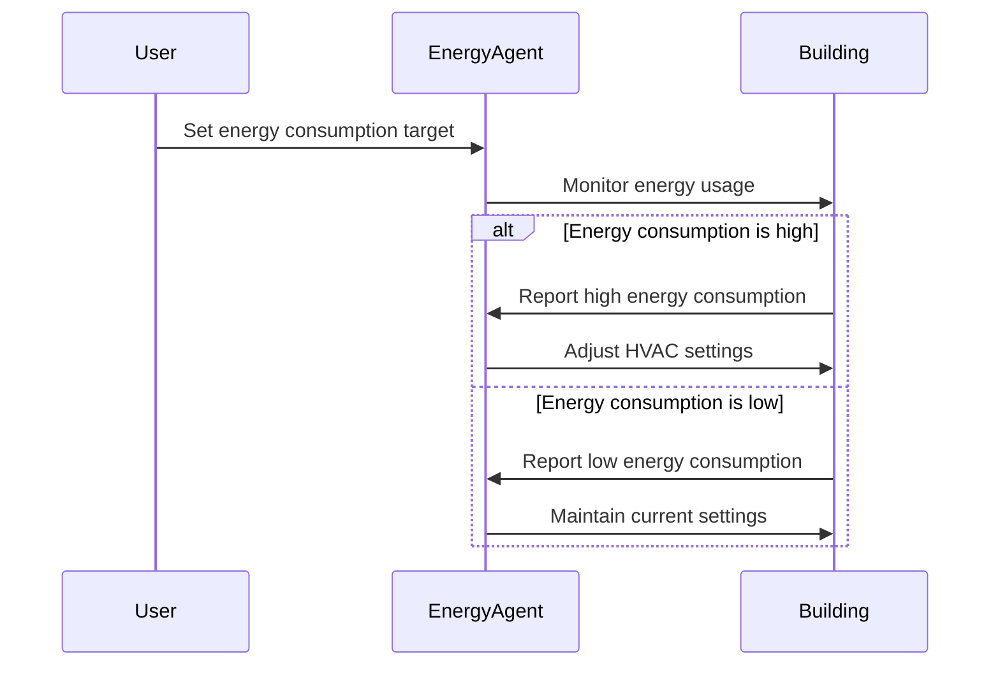
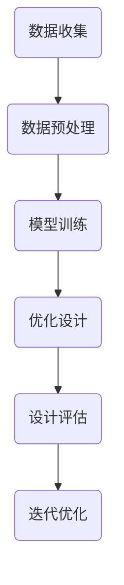
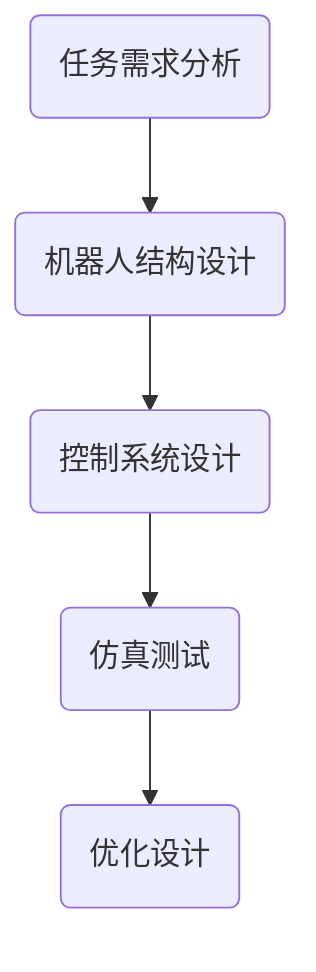
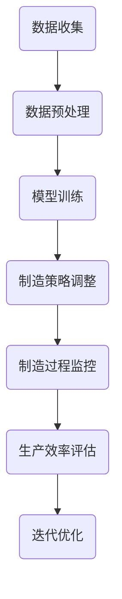
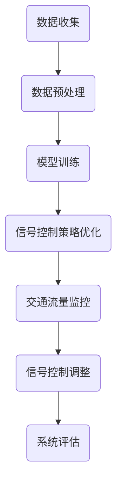
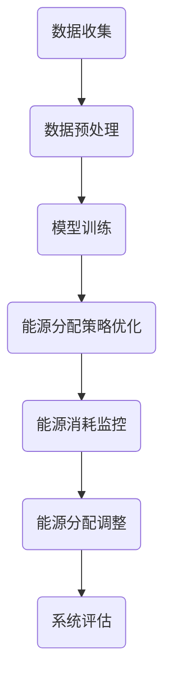

                 


# 《AI Agent在智能工程设计中的应用》

> 关键词：AI Agent、智能设计、智能工程设计、人工智能应用、算法原理

> 摘要：本文旨在探讨AI Agent在智能工程设计中的应用。我们将通过逐步分析，深入探讨AI Agent的基本原理、其在不同领域的设计需求、应用案例、技术挑战以及未来的发展前景。文章旨在为读者提供一个清晰、完整的理解框架，以及针对AI Agent在智能工程设计中应用的深入见解。

----------------------------------------------------------------

## 第一部分：引言

### 1.1 问题背景

智能工程设计是现代工程领域的一个重要发展方向，随着人工智能技术的迅猛发展，AI Agent作为智能设计的关键组件，正逐渐成为工程师们解决复杂设计问题的重要工具。AI Agent能够通过自我学习和决策，优化设计过程，提高设计效率和质量。本文将聚焦于AI Agent在智能工程设计中的应用，探讨其在各个领域的需求和优势。

### 1.2 核心概念

AI Agent，即人工智能代理，是一种能够模拟人类智能行为，自主进行决策和行动的计算实体。AI Agent的核心在于其能够通过机器学习算法从数据中学习，并根据学习到的知识进行决策，实现自动化和智能化的设计过程。

### 1.3 联系与结构

AI Agent与智能设计有着紧密的联系。AI Agent的核心组件包括感知器、决策器、执行器等，这些组件共同作用，使得AI Agent能够在复杂的设计环境中进行有效的操作。本文将围绕AI Agent的基本原理，探讨其在智能工程设计中的具体应用。

### 1.4 研究范围与目标

本文的研究范围涵盖AI Agent的基本原理、应用领域、技术挑战以及未来展望。研究目标是为读者提供一份全面、深入的理解AI Agent在智能工程设计中应用的指南，帮助读者掌握AI Agent的应用方法，提升智能工程设计的能力。

### 1.5 本章小结

本章介绍了AI Agent在智能工程设计中的问题背景、核心概念、联系与结构以及研究范围与目标。通过本章的学习，读者可以初步了解AI Agent的基本原理，为后续章节的深入学习打下基础。

----------------------------------------------------------------

## 第二部分：AI Agent的基本原理

### 2.1 机器学习基础

机器学习是AI Agent的核心技术之一。机器学习是指通过算法从数据中学习，并对未知数据进行预测或决策的技术。根据学习方式，机器学习可以分为监督学习、无监督学习和强化学习。

- **监督学习**：在有标记的数据集上进行学习，通过已有数据的学习来预测新数据的标签。
- **无监督学习**：在无标记的数据集上进行学习，通过数据自身的特征来发现数据之间的规律。
- **强化学习**：通过与环境进行交互，根据奖励和惩罚来不断优化行为策略。

### 2.2 AI Agent的基本架构

AI Agent的基本架构通常包括感知器、决策器和执行器三个部分。

- **感知器**：负责接收外部环境的信息，感知环境的变化。
- **决策器**：根据感知器收集的信息，结合预先设定的策略，进行决策。
- **执行器**：根据决策器的决策，采取行动，影响环境。

### 2.3 AI Agent的学习与决策过程

AI Agent的学习与决策过程可以分为以下几个步骤：

1. **感知**：AI Agent通过感知器收集环境信息。
2. **学习**：根据收集到的信息，通过机器学习算法进行学习，更新自己的知识库。
3. **决策**：根据学习到的知识，通过决策器进行决策。
4. **执行**：根据决策结果，通过执行器采取行动，影响环境。

### 2.4 实例分析

以下是一个简单的AI Agent实例，用于实现一个能够自动控制灯泡开关的系统。

```python
import random

class LightAgent:
    def __init__(self):
        self.is_on = False

    def sense(self, light_state):
        return light_state

    def act(self, action):
        if action == 'on':
            self.is_on = True
        elif action == 'off':
            self.is_on = False

    def learn(self, reward):
        if reward > 0:
            self.act('on')
        elif reward < 0:
            self.act('off')

agent = LightAgent()

for i in range(10):
    if random.random() < 0.5:
        agent.learn(1)
    else:
        agent.learn(-1)
    print(f"Epoch {i+1}: Light is {'on' if agent.is_on else 'off'}")
```

在这个实例中，AI Agent通过感知灯泡的状态，根据奖励信号（灯泡打开时奖励1，关闭时奖励-1）进行学习，并最终决定灯泡的开关状态。

### 2.5 本章小结

本章介绍了AI Agent的基本原理，包括机器学习基础、AI Agent的基本架构以及学习和决策过程。通过实例分析，读者可以初步了解AI Agent的实现方法，为后续章节的学习打下基础。

----------------------------------------------------------------

## 第三部分：AI Agent在智能工程设计中的应用

### 3.1 建筑设计中的应用

在建筑设计中，AI Agent的应用主要体现在以下几个方面：

- **结构优化**：AI Agent可以通过分析建筑结构的数据，运用优化算法，提出更优化的结构设计方案。
- **能源管理**：AI Agent可以监控建筑能源消耗，根据实时数据调整能源使用策略，实现节能减排。
- **环境控制**：AI Agent可以监控室内环境参数，如温度、湿度等，自动调整空调、加湿器等设备，以提供舒适的环境。

#### 3.1.1 案例一：智能建筑能源管理系统

以智能建筑能源管理系统为例，该系统利用AI Agent实现能源消耗的自动化监控和优化。系统架构如下：



在这个案例中，AI Agent通过监控建筑能源使用情况，根据预设目标调整能源消耗策略，实现能源的优化使用。

#### 3.1.2 案例二：结构优化设计

在结构优化设计中，AI Agent可以通过分析建筑结构的数据，如材料特性、负载情况等，运用优化算法，提出更优化的结构设计方案。以下是一个简单的结构优化流程：



在这个流程中，AI Agent首先收集建筑结构数据，进行预处理后进行模型训练，然后运用优化算法进行设计，最后对设计进行评估，并根据评估结果进行迭代优化。

### 3.2 机械工程设计中的应用

在机械工程设计中，AI Agent的应用主要体现在以下几个方面：

- **机器人设计**：AI Agent可以优化机器人结构和控制系统设计，提高机器人性能。
- **制造过程优化**：AI Agent可以监控制造过程，根据实时数据调整制造策略，提高生产效率。

#### 3.2.1 案例一：机器人设计与控制

以机器人设计与控制为例，AI Agent可以通过分析机器人任务需求，优化机器人的结构设计和控制系统设计。以下是一个简单的机器人设计流程：



在这个流程中，AI Agent首先分析机器人任务需求，然后进行机器人结构设计和控制系统设计，接着进行仿真测试，最后根据测试结果进行优化设计。

#### 3.2.2 案例二：制造过程优化

在制造过程中，AI Agent可以监控制造过程，根据实时数据调整制造策略，提高生产效率。以下是一个简单的制造过程优化流程：



在这个流程中，AI Agent首先收集制造过程数据，进行预处理后进行模型训练，然后根据模型调整制造策略，接着监控制造过程，根据评估结果进行迭代优化。

### 3.3 技术挑战

AI Agent在智能工程设计中的应用面临以下技术挑战：

- **数据处理与模型训练**：如何有效地处理大规模、复杂的数据，提高模型训练效率。
- **系统集成与优化**：如何将AI Agent与其他系统进行集成，实现系统的优化运行。

### 3.4 本章小结

本章介绍了AI Agent在建筑设计、机械工程设计中的应用案例和技术挑战。通过实例分析，读者可以了解AI Agent在智能工程设计中的具体应用，以及如何应对技术挑战。

----------------------------------------------------------------

## 第四部分：AI Agent的高级应用

### 4.1 在复杂系统设计中的应用

在复杂系统设计中，AI Agent的应用主要体现在以下几个方面：

- **智能交通系统设计**：AI Agent可以优化交通信号控制，提高交通流量。
- **能源管理系统设计**：AI Agent可以优化能源分配，实现节能减排。

#### 4.1.1 案例一：智能交通系统设计

以智能交通系统设计为例，AI Agent可以通过分析交通流量数据，优化交通信号控制策略，提高交通流量。以下是一个简单的智能交通系统设计流程：



在这个流程中，AI Agent首先收集交通流量数据，进行预处理后进行模型训练，然后根据模型优化交通信号控制策略，接着监控交通流量，根据评估结果调整信号控制策略。

#### 4.1.2 案例二：能源管理系统设计

在能源管理系统设计中，AI Agent可以通过分析能源消耗数据，优化能源分配策略，实现节能减排。以下是一个简单的能源管理系统设计流程：



在这个流程中，AI Agent首先收集能源消耗数据，进行预处理后进行模型训练，然后根据模型优化能源分配策略，接着监控能源消耗，根据评估结果调整能源分配策略。

### 4.2 安全与伦理问题

随着AI Agent在复杂系统设计中的应用日益广泛，其安全与伦理问题也日益突出。主要问题包括：

- **数据安全与隐私保护**：如何确保AI Agent处理的数据安全，防止数据泄露。
- **系统安全与防御攻击**：如何保护AI Agent系统，防止恶意攻击。
- **AI Agent的伦理责任**：如何确保AI Agent的行为符合伦理标准，避免造成负面影响。

#### 4.2.1 数据安全与隐私保护

为了确保AI Agent处理的数据安全，可以采取以下措施：

- **数据加密**：对敏感数据进行加密处理，确保数据在传输和存储过程中的安全性。
- **访问控制**：对AI Agent的访问权限进行严格控制，确保只有授权用户可以访问数据。

#### 4.2.2 系统安全与防御攻击

为了保护AI Agent系统，可以采取以下措施：

- **防火墙**：在AI Agent系统中设置防火墙，防止外部攻击。
- **入侵检测系统**：实时监控AI Agent系统的运行状态，一旦发现异常，立即采取措施。

#### 4.2.3 AI Agent的伦理责任

为了确保AI Agent的行为符合伦理标准，可以采取以下措施：

- **伦理审查**：在AI Agent开发和应用过程中，进行伦理审查，确保其行为符合伦理规范。
- **透明度**：提高AI Agent系统的透明度，确保用户了解其工作原理和决策过程。

### 4.3 政策与法规

为了规范AI Agent在复杂系统设计中的应用，各国政府和国际组织纷纷出台相关政策与法规。主要内容包括：

- **数据保护法**：确保数据的安全和隐私。
- **AI伦理规范**：明确AI Agent的伦理责任和行为准则。
- **行业规范**：制定AI Agent在特定领域的应用规范。

#### 4.3.1 国际法规与标准

- **欧盟**：《通用数据保护条例》（GDPR）规定了数据处理的伦理和隐私保护标准。
- **美国**：《人工智能法案》提出了人工智能的伦理、隐私和安全要求。

#### 4.3.2 国内法规与标准

- **中国**：《人工智能发展行动计划》提出了人工智能的发展目标和政策方向。
- **美国**：《人工智能发展法案》提出了人工智能的伦理、隐私和安全要求。

### 4.4 本章小结

本章介绍了AI Agent在复杂系统设计中的应用、安全与伦理问题以及相关政策与法规。通过本章的学习，读者可以了解AI Agent在复杂系统设计中的具体应用，以及如何应对安全与伦理问题。

----------------------------------------------------------------

## 第五部分：未来展望

### 5.1 发展趋势

随着人工智能技术的不断进步，AI Agent在智能工程设计中的应用前景广阔。未来，AI Agent将在以下几个方面得到进一步发展：

- **算法优化**：开发更高效的算法，提高AI Agent的学习和决策能力。
- **跨领域应用**：拓展AI Agent的应用领域，实现跨领域、跨行业的应用。
- **人机协同**：实现AI Agent与人类的协同工作，提高智能设计的效果和效率。

### 5.2 研究方向

未来的研究将在以下几个方面展开：

- **算法研究**：深入探索机器学习算法，提高AI Agent的学习能力和决策能力。
- **系统架构**：研究AI Agent的系统架构，提高其稳定性和可靠性。
- **应用拓展**：探索AI Agent在更多领域的应用，如生物医学、金融、教育等。

### 5.3 发展挑战

AI Agent在智能工程设计中的应用仍面临以下挑战：

- **数据处理**：如何高效地处理大规模、复杂的数据，提高AI Agent的学习效率。
- **系统集成**：如何将AI Agent与其他系统有效集成，实现系统的优化运行。
- **安全与伦理**：如何确保AI Agent的安全与伦理，避免造成负面影响。

### 5.4 本章小结

本章对AI Agent在智能工程设计中的应用进行了未来展望，分析了发展趋势、研究方向和发展挑战。通过本章的学习，读者可以了解AI Agent在智能工程设计中的应用前景，以及未来研究的方向和挑战。

----------------------------------------------------------------

## 结论

本文从AI Agent的基本原理、应用领域、技术挑战、安全与伦理问题以及未来展望等方面，全面探讨了AI Agent在智能工程设计中的应用。通过本文的学习，读者可以深入理解AI Agent在智能工程设计中的关键作用，掌握其应用方法，为未来的研究和实践提供参考。

## 作者信息

作者：AI天才研究院/AI Genius Institute & 禅与计算机程序设计艺术 /Zen And The Art of Computer Programming

## 拓展阅读

1. Russell, S., & Norvig, P. (2016). 《人工智能：一种现代的方法》。清华大学出版社。
2. Silver, D., Huang, A., & Matyas, M. (2016). 《人工智能：一种概率的视角》。电子工业出版社。
3. Stone, P., & Hauksson, E. (2018). 《智能建筑：设计、施工与运营管理》。中国建筑工业出版社。

本文旨在为读者提供一个关于AI Agent在智能工程设计中应用的全面概述，帮助读者了解AI Agent的基本原理、应用场景、技术挑战以及未来发展。随着人工智能技术的不断进步，AI Agent在智能工程设计中的应用将越来越广泛，未来的研究将继续深化这一领域，为工程实践带来更多的创新和突破。

