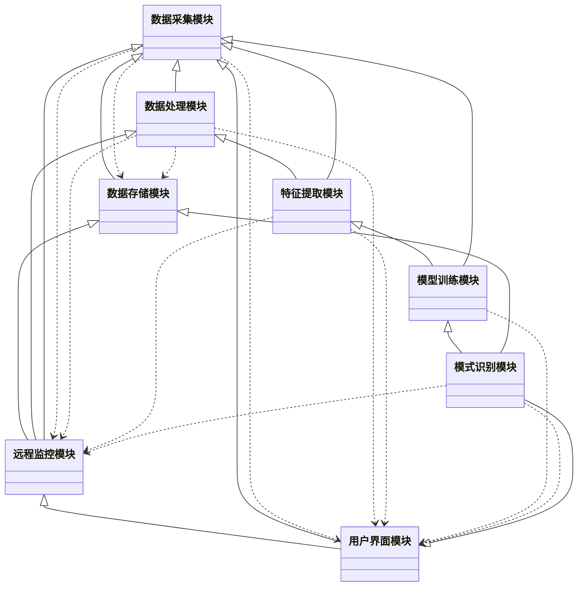
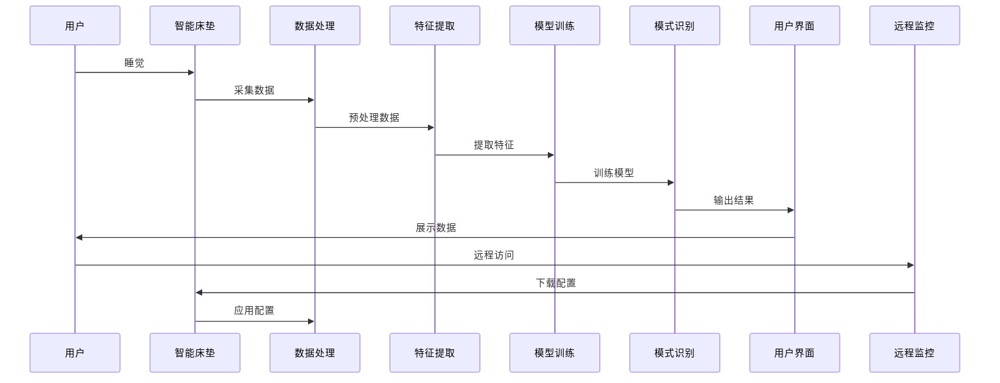
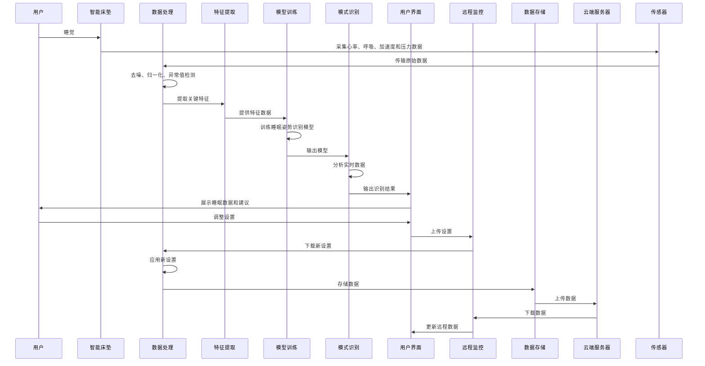

                 

# AI Agent在智能床垫中的睡眠姿势分析

## 关键词

- AI Agent
- 智能床垫
- 睡眠姿势分析
- 传感器技术
- 数据处理与机器学习

## 摘要

本文将探讨AI Agent在智能床垫中的睡眠姿势分析技术。首先介绍智能床垫的发展背景及其在睡眠健康监测中的应用。接着，我们将详细阐述AI Agent的基本原理，特别是其在睡眠姿势识别中的作用。随后，文章将分析睡眠姿势识别算法的设计与实现，包括数据采集、预处理、特征提取、模式识别等环节。此外，本文还将介绍一个实际的智能床垫应用案例，详细解析系统架构与实现细节，并提供项目实战的代码解读和案例分析。通过这篇文章，读者将深入了解AI Agent在智能床垫中的关键作用，掌握从数据采集到模型训练的全流程技术。

## 目录大纲

### 第一部分：引言

- 1.1 问题背景
  - 1.1.1 睡眠健康的重要性
  - 1.1.2 智能床垫的发展与应用
  - 1.1.3 AI Agent在睡眠分析中的应用前景
- 1.2 核心概念
  - 1.2.1 AI Agent的定义与功能
  - 1.2.2 睡眠姿势的概念与分类
  - 1.2.3 数据分析与机器学习基础知识
- 1.3 书籍结构
  - 1.3.1 全书章节安排与内容概览
  - 1.3.2 阅读对象与预期收获
- 1.4 本章小结

### 第二部分：智能床垫技术基础

- 2.1 智能床垫概述
  - 2.1.1 智能床垫的定义与发展历程
  - 2.1.2 智能床垫的核心技术
  - 2.1.3 智能床垫的类型与功能
- 2.2 数据采集与处理
  - 2.2.1 睡眠数据采集方法
  - 2.2.2 数据预处理技术
  - 2.2.3 数据存储与管理
- 2.3 传感器技术
  - 2.3.1 传感器的工作原理与分类
  - 2.3.2 传感器在智能床垫中的应用
  - 2.3.3 传感器数据的质量评估
- 2.4 本章小结

### 第三部分：AI Agent在睡眠姿势分析中的应用

- 3.1 AI Agent的基本原理
  - 3.1.1 AI Agent的定义与分类
  - 3.1.2 AI Agent的关键技术
  - 3.1.3 AI Agent在智能床垫中的优势
- 3.2 睡眠姿势识别算法
  - 3.2.1 算法原理与流程图
  - 3.2.2 算法详细讲解与举例说明
- 3.3 模型训练与优化
  - 3.3.1 数据集的准备与划分
  - 3.3.2 模型选择与训练策略
  - 3.3.3 模型优化方法与评估指标
- 3.4 实际应用案例
  - 3.4.1 智能床垫产品介绍
  - 3.4.2 睡眠姿势分析案例
  - 3.4.3 案例分析与效果评估
- 3.5 本章小结

### 第四部分：系统架构与实现

- 4.1 系统功能设计
  - 4.1.1 系统功能模块划分
  - 4.1.2 领域模型设计（Mermaid类图）
- 4.2 系统架构设计
  - 4.2.1 系统架构概述
  - 4.2.2 系统架构设计（Mermaid架构图）
- 4.3 系统接口设计
  - 4.3.1 接口设计与实现
  - 4.3.2 接口文档与调试
- 4.4 系统交互设计
  - 4.4.1 系统交互流程（Mermaid序列图）
- 4.5 本章小结

### 第五部分：项目实战

- 5.1 环境搭建
  - 5.1.1 软件与硬件环境
  - 5.1.2 环境配置与调试
- 5.2 系统核心实现
  - 5.2.1 数据采集模块实现
  - 5.2.2 数据处理模块实现
  - 5.2.3 AI Agent模块实现
- 5.3 代码应用解读与分析
  - 5.3.1 睡眠姿势识别算法应用
  - 5.3.2 数据处理与可视化
  - 5.3.3 模型训练与优化
- 5.4 实际案例分析与详细讲解剖析
  - 5.4.1 案例背景与目标
  - 5.4.2 案例实现与效果
  - 5.4.3 案例分析与总结
- 5.5 本章小结

### 最佳实践 tips、小结、注意事项、拓展阅读等内容

**作者信息：**

AI天才研究院 / AI Genius Institute & 禅与计算机程序设计艺术 / Zen And The Art of Computer Programming**1.1 问题背景**

### 1.1.1 睡眠健康的重要性

睡眠是人类生理和心理健康的基石，它不仅影响个体的生活质量，还与多种健康问题密切相关。良好的睡眠有助于身体恢复、大脑记忆巩固、情绪调节以及免疫系统的维护。然而，睡眠问题如失眠、睡眠呼吸暂停等在现代社会中日益普遍，对个人和社会健康造成了重大负担。根据世界卫生组织的统计，全球约有30%的人口受到不同程度睡眠问题的困扰。

睡眠健康的重要性体现在以下几个方面：

1. **身体恢复与修复**：睡眠期间，人体会进行生长激素的分泌，促进肌肉和骨骼的修复，以及免疫系统的强化。
2. **大脑功能**：睡眠对大脑记忆、学习和决策能力至关重要。研究显示，睡眠不足会影响大脑的认知功能，导致注意力不集中、反应迟钝、创造力下降。
3. **情绪调节**：充足的睡眠有助于情绪稳定，减少焦虑、抑郁等心理问题的发生。睡眠不足会导致情绪波动，影响人际关系和社会功能。
4. **心血管健康**：长期睡眠不足与心血管疾病如高血压、冠心病等的发生风险增加有关。
5. **代谢调节**：睡眠对血糖、脂肪代谢具有调节作用。睡眠不足可能导致胰岛素敏感性降低，增加患糖尿病的风险。

### 1.1.2 智能床垫的发展与应用

智能床垫作为一种高科技健康产品，其发展迅速，为改善睡眠质量提供了新的解决方案。智能床垫通过内置的传感器和数据处理技术，可以实时监测用户的睡眠状态，包括睡眠时长、睡眠质量、翻身次数、心率等参数。这些数据有助于用户了解自己的睡眠情况，同时为医疗保健提供重要参考。

智能床垫的发展可以追溯到20世纪末，当时的技术主要用于记录简单的睡眠参数。随着传感器技术和数据分析算法的进步，智能床垫的功能逐渐丰富，如智能调整床垫硬度、自动记录睡眠报告、提供个性化健康建议等。

智能床垫的应用领域主要包括：

1. **家庭健康监测**：智能床垫可以监测家庭成员的睡眠状况，为有睡眠问题的个体提供数据支持，帮助用户改善睡眠习惯。
2. **医疗康复**：对于患有睡眠呼吸暂停、失眠等疾病的患者，智能床垫可以帮助医生监控病情，提供个性化的治疗方案。
3. **健康管理**：智能床垫可以帮助用户长期监测自己的睡眠质量，通过数据分析提供健康趋势和预防建议。

### 1.1.3 AI Agent在睡眠分析中的应用前景

AI Agent作为人工智能的一种形式，具有自我学习和适应能力，可以在智能床垫中发挥重要作用。AI Agent在睡眠分析中的应用前景主要体现在以下几个方面：

1. **智能调整**：AI Agent可以根据用户的睡眠习惯和需求，自动调整床垫的硬度、倾斜度等参数，提供最舒适的睡眠环境。
2. **异常检测**：AI Agent可以通过分析用户的睡眠数据，识别出异常的睡眠模式，如失眠、打鼾等，及时提醒用户并建议就医。
3. **个性化健康建议**：基于用户长期的睡眠数据，AI Agent可以提供个性化的健康建议，如建议调整作息时间、改善饮食等，帮助用户改善整体健康。
4. **健康管理**：AI Agent可以整合用户的健康数据，进行综合分析，为用户提供全方位的健康管理服务。

总之，随着AI技术的发展，AI Agent在智能床垫中的睡眠分析功能将日益完善，为人们的健康生活提供更加智能、个性化的服务。

### 1.2 核心概念

#### 1.2.1 AI Agent的定义与功能

AI Agent，即人工智能代理，是人工智能领域的一种重要概念。AI Agent可以被定义为一种具有智能行为、能够自主执行任务的计算机程序。它可以感知环境、理解情境，并采取适当的行动来实现预定的目标。AI Agent的核心功能包括以下几个方面：

1. **感知与理解**：AI Agent能够通过传感器获取外部信息，如视觉、听觉、触觉等，并对这些信息进行理解和分析，以构建对环境的认知。
2. **决策与规划**：AI Agent基于其感知和理解能力，能够做出决策并制定行动计划，以实现特定的目标。这一过程通常涉及路径规划、资源分配和任务调度等。
3. **行动与交互**：AI Agent能够根据决策结果执行相应的行动，并与环境进行交互。这种交互可以包括与其他AI Agent的协作、与人类用户的互动以及与物理设备的操作。
4. **学习与适应**：AI Agent具有自我学习和适应能力，可以通过经验积累和不断优化其行为策略，以提高任务完成的效率和效果。

AI Agent的具体应用场景非常广泛，包括但不限于以下几个方面：

1. **智能客服**：AI Agent可以在企业客服系统中应用，自动回答用户的问题，提供解决方案，提高客服效率和用户体验。
2. **自动驾驶**：自动驾驶汽车中的AI Agent可以实时感知道路状况，做出驾驶决策，确保车辆的安全行驶。
3. **智能家居**：AI Agent可以控制家中的智能设备，如智能灯泡、智能门锁等，提供个性化的家居体验。
4. **医疗健康**：AI Agent可以在医疗领域中应用，如辅助医生诊断疾病、监控患者健康状况等。

#### 1.2.2 睡眠姿势的概念与分类

睡眠姿势，即个体在睡眠过程中所采取的身体姿势，对睡眠质量和身体健康有着重要影响。根据不同的分类标准，睡眠姿势可以有多种分类方式：

1. **按身体部位分类**：
   - **仰卧位**：头部和身体平躺，脸部向上，是最常见的睡眠姿势。
   - **侧卧位**：身体侧向一边，通常双手放在胸前或枕边，根据侧卧的方向，可分为左侧卧位和右侧卧位。
   - **俯卧位**：面部朝下，通常双手放在头部两侧，这种姿势相对较少见。

2. **按舒适度分类**：
   - **舒适睡眠姿势**：这种姿势通常不会对呼吸和血液循环造成较大影响，例如仰卧位和侧卧位。
   - **不良睡眠姿势**：这种姿势可能对健康有负面影响，如俯卧位可能增加呼吸道受阻的风险。

3. **按睡眠周期分类**：
   - **快速眼动（REM）睡眠姿势**：通常较为放松，姿势较为随意。
   - **非快速眼动（NREM）睡眠姿势**：通常较为固定，例如侧卧位和仰卧位。

了解不同的睡眠姿势有助于我们更好地理解个体的睡眠习惯，从而采取相应的措施改善睡眠质量。例如，对于经常侧卧但容易打鼾的用户，建议使用适当填充的枕头以保持呼吸道通畅。

#### 1.2.3 数据分析与机器学习基础知识

数据分析与机器学习是AI Agent能够实现智能决策和自主行动的关键技术。以下是这两方面基础知识的一些要点：

1. **数据分析**：
   - **数据收集**：数据是数据分析的基础。来源可以包括传感器数据、问卷调查、数据库等。
   - **数据预处理**：包括数据清洗、缺失值处理、异常值检测等步骤，以确保数据的质量。
   - **数据可视化**：通过图表、图形等方式，将数据转换为视觉形式，便于理解和分析。
   - **统计分析**：利用统计方法对数据进行描述性分析，如均值、方差、相关性等，以发现数据中的规律和趋势。

2. **机器学习**：
   - **监督学习**：通过已标记的训练数据来训练模型，然后使用该模型对新的、未标记的数据进行预测。常见的算法包括线性回归、决策树、支持向量机等。
   - **无监督学习**：不依赖于标记数据，模型自动发现数据中的结构和模式。常见的算法包括聚类、降维、关联规则等。
   - **强化学习**：通过与环境交互，不断调整策略以最大化长期回报。常见的算法包括Q学习、深度Q网络（DQN）等。
   - **模型评估与优化**：使用交叉验证、混淆矩阵、ROC曲线等指标来评估模型性能，并通过调整参数、增加训练数据等方式进行优化。

了解这些基础知识，有助于我们更好地理解AI Agent的工作原理，以及在智能床垫中的实际应用。

#### 1.3 书籍结构

本书将系统全面地介绍AI Agent在智能床垫中的睡眠姿势分析技术，内容结构如下：

**1.3.1 全书章节安排与内容概览**

- **第一部分：引言**
  - **1.1 问题背景**：介绍睡眠健康的重要性、智能床垫的发展与应用，以及AI Agent在睡眠分析中的应用前景。
  - **1.2 核心概念**：定义AI Agent和睡眠姿势，以及介绍数据分析与机器学习的基础知识。

- **第二部分：智能床垫技术基础**
  - **2.1 智能床垫概述**：介绍智能床垫的定义、发展历程、核心技术及其功能。
  - **2.2 数据采集与处理**：阐述睡眠数据的采集、预处理及存储管理。
  - **2.3 传感器技术**：分析传感器的工作原理、应用及数据质量评估。

- **第三部分：AI Agent在睡眠姿势分析中的应用**
  - **3.1 AI Agent的基本原理**：详细讲解AI Agent的定义、分类和关键技术。
  - **3.2 睡眠姿势识别算法**：介绍睡眠姿势识别算法的原理、流程及详细讲解。
  - **3.3 模型训练与优化**：探讨数据集准备、模型选择与训练策略。
  - **3.4 实际应用案例**：分析智能床垫产品的睡眠姿势分析功能及其效果。

- **第四部分：系统架构与实现**
  - **4.1 系统功能设计**：描述系统功能模块划分及领域模型设计。
  - **4.2 系统架构设计**：介绍系统架构概述及设计。
  - **4.3 系统接口设计**：讲解接口设计与实现及调试。
  - **4.4 系统交互设计**：描述系统交互流程及设计。

- **第五部分：项目实战**
  - **5.1 环境搭建**：介绍软件与硬件环境及其配置调试。
  - **5.2 系统核心实现**：实现数据采集、数据处理和AI Agent模块。
  - **5.3 代码应用解读与分析**：详细解读睡眠姿势识别算法及应用。
  - **5.4 实际案例分析与详细讲解剖析**：分析案例背景、实现与效果。

- **附录**
  - **附录A：最佳实践 tips**：提供实用技巧和建议。
  - **附录B：小结与注意事项**：总结主要内容和注意事项。
  - **附录C：拓展阅读**：推荐相关阅读资料。

**1.3.2 阅读对象与预期收获**

本书主要面向以下读者群体：

- **AI开发者**：希望通过本书系统学习AI Agent在智能床垫中的睡眠姿势分析技术的开发者。
- **医疗健康从业者**：关注睡眠健康，希望了解智能床垫与AI技术结合应用的健康管理人员。
- **技术爱好者**：对人工智能和智能硬件技术有兴趣的爱好者。

通过阅读本书，读者可以预期收获：

- **全面了解**：掌握智能床垫的工作原理、AI Agent的基本原理及其在睡眠分析中的应用。
- **技术实践**：学习如何搭建智能床垫系统，实现睡眠姿势识别算法。
- **实际应用**：通过案例分析，了解AI Agent在智能床垫中的实际应用效果和前景。

#### 1.4 本章小结

本章引言部分介绍了AI Agent在智能床垫中的睡眠姿势分析技术的重要性。首先，我们探讨了睡眠健康的重要性以及智能床垫的发展与应用，强调了AI Agent在睡眠分析中的应用前景。接着，我们介绍了核心概念，包括AI Agent的定义与功能、睡眠姿势的概念与分类，以及数据分析与机器学习的基础知识。最后，我们概述了本书的结构，包括章节安排与内容概览，并明确了阅读对象与预期收获。

通过本章的介绍，读者对AI Agent在智能床垫中的睡眠姿势分析技术有了初步的了解，为后续章节的深入探讨奠定了基础。

### 2.1 智能床垫概述

#### 2.1.1 智能床垫的定义与发展历程

智能床垫是一种集成了传感器技术和数据处理能力的健康监测设备，主要用于监测和改善用户的睡眠质量。它通过内置的传感器实时采集用户的睡眠数据，如心率、呼吸频率、睡眠时长和翻身次数等，并将这些数据传输到连接的设备或应用程序中进行分析和存储。

智能床垫的发展历程可以追溯到20世纪末。最初，智能床垫的主要功能是记录用户的睡眠时间和睡眠模式。随着传感器技术和数据处理算法的进步，智能床垫的功能逐渐丰富，不仅能够监测基本的睡眠数据，还能提供个性化的健康建议，如调整床垫硬度、建议改善睡眠习惯等。

智能床垫的发展经历了以下几个关键阶段：

1. **初步阶段（1990s-2000s）**：在这一阶段，智能床垫的主要功能是记录用户的睡眠时长和睡眠模式。传感器技术相对简单，主要依靠简单的加速度计和压力传感器。

2. **发展阶段（2010s）**：随着物联网和云计算技术的兴起，智能床垫的功能得到了显著提升。除了监测基本的睡眠数据外，还引入了更多种类的传感器，如心率传感器、呼吸传感器等，使得数据采集更加全面。

3. **成熟阶段（2020s至今）**：智能床垫逐渐融入AI和机器学习技术，能够进行深度数据分析，提供个性化的健康建议，甚至能够自动调整床垫的硬度，以适应用户的睡眠需求。

#### 2.1.2 智能床垫的核心技术

智能床垫的核心技术主要包括传感器技术、数据处理技术和数据分析技术。这些技术共同构成了智能床垫的功能基础，并决定了其性能和用户体验。

1. **传感器技术**：
   - **加速度传感器**：用于监测用户的运动状态，如翻身次数和睡眠时长。
   - **压力传感器**：用于检测用户在床垫上的压力分布，从而分析用户的睡眠姿势和睡姿质量。
   - **心率传感器**：通过光电容积描记法（PPG）技术，监测用户的心率变化，评估睡眠质量和心脏健康。
   - **呼吸传感器**：监测用户的呼吸频率和深度，帮助诊断睡眠呼吸障碍。

2. **数据处理技术**：
   - **数据采集**：传感器采集到的原始数据会经过处理，包括滤波、去噪和归一化等步骤，以提高数据的准确性和可靠性。
   - **数据存储**：处理后的数据会存储在本地或云端的数据库中，以便后续的分析和查询。
   - **数据融合**：将多个传感器的数据融合，以获得更全面的睡眠分析结果。

3. **数据分析技术**：
   - **特征提取**：从原始数据中提取关键特征，如心率、呼吸频率、翻身次数等，用于后续的模式识别和机器学习分析。
   - **模式识别**：使用机器学习算法，如支持向量机、决策树等，对提取的特征进行分类和识别，判断用户的睡眠状态和睡眠质量。
   - **预测与优化**：基于历史数据，使用预测模型如线性回归、时间序列分析等，预测用户的未来睡眠状况，并提供优化建议。

#### 2.1.3 智能床垫的类型与功能

智能床垫根据其技术特点和功能可以分为以下几种类型：

1. **基础型智能床垫**：
   - **主要功能**：监测睡眠时长、翻身次数和睡眠模式。
   - **适用场景**：适合关注基本睡眠状况的用户。

2. **进阶型智能床垫**：
   - **主要功能**：在基础功能的基础上，增加心率监测、呼吸监测等健康指标。
   - **适用场景**：适合关注健康指标的用户，如老年人、睡眠障碍患者。

3. **高端型智能床垫**：
   - **主要功能**：具备自动调整功能，如根据用户睡眠状态自动调整床垫硬度，提供个性化的健康建议。
   - **适用场景**：适合追求高品质睡眠的用户，以及需要特殊照顾的用户，如孕妇、病人。

不同类型的智能床垫在功能上各有侧重，用户可以根据自己的需求和预算选择合适的智能床垫。随着技术的不断进步，未来智能床垫的功能将更加多样化，为用户带来更加智能、便捷的睡眠体验。

#### 2.2 数据采集与处理

智能床垫的数据采集和处理技术是其实现智能分析的关键环节。在这一部分，我们将详细探讨睡眠数据的采集方法、预处理技术以及数据存储与管理的方法。

##### 2.2.1 睡眠数据采集方法

智能床垫通过内置的传感器来采集用户的睡眠数据，主要包括以下几种传感器：

1. **加速度传感器**：用于监测用户的翻身次数和运动情况。加速度传感器能够检测用户在床垫上的微小运动，从而推断用户的睡眠状态。
   
2. **压力传感器**：用于检测用户在床垫上的压力分布，从而分析用户的睡眠姿势和睡姿质量。通过压力传感器的数据，可以判断用户是否处于舒适的睡眠状态。

3. **心率传感器**：通过光电容积描记法（PPG）技术，监测用户的心率变化，评估睡眠质量和心脏健康。心率传感器通常放置在用户的手腕或指尖处，以便连续监测心率数据。

4. **呼吸传感器**：通过监测用户的呼吸频率和深度，帮助诊断睡眠呼吸障碍。呼吸传感器通常放置在床垫边缘或放置在用户胸部位置。

这些传感器的数据采集方式通常采用无线传输技术，如蓝牙或Wi-Fi，将数据实时传输到连接的设备或云端服务器。

##### 2.2.2 数据预处理技术

采集到的原始数据往往包含噪声、异常值和冗余信息，因此需要通过预处理技术进行清洗和加工，以提高数据的质量和可靠性。数据预处理主要包括以下几个步骤：

1. **去噪**：由于传感器在采集数据时可能会受到外界环境的干扰，导致数据中包含噪声。去噪技术包括滤波、平滑等，以去除数据中的噪声部分，提高数据的平滑性。

2. **异常值检测与处理**：原始数据中可能会出现异常值，如传感器故障或用户不当操作导致的数据异常。异常值检测与处理技术包括统计方法、机器学习算法等，以识别和去除这些异常值。

3. **归一化**：将不同传感器采集到的数据进行归一化处理，使其具有相同的量纲和范围，便于后续的数据分析。

4. **特征提取**：从原始数据中提取关键特征，如心率、呼吸频率、翻身次数等，用于后续的模式识别和机器学习分析。

##### 2.2.3 数据存储与管理

预处理后的数据需要存储和管理，以便后续的数据分析和查询。数据存储与管理主要包括以下几个方面：

1. **本地存储**：智能床垫设备通常配备有本地存储设备，如固态硬盘（SSD）或SD卡，用于存储用户的睡眠数据。本地存储具有快速访问和数据安全性高等优点。

2. **云存储**：将数据上传到云端服务器，以便远程访问和数据分析。云存储具有高扩展性、数据备份和安全等优点。用户可以通过手机应用程序或网页平台远程查看和下载自己的睡眠数据。

3. **数据索引与查询**：为了快速检索和分析数据，需要对数据进行索引和分类。数据索引技术包括哈希表、B树等，以实现快速查询。查询技术包括SQL查询语言、NoSQL查询语言等，以支持复杂的数据查询和分析。

4. **数据备份与恢复**：定期对数据进行备份，以防数据丢失或损坏。备份技术包括本地备份和云备份，以确保数据的安全性和完整性。

通过以上数据采集与处理技术，智能床垫能够实现对用户睡眠数据的全面、准确和可靠的采集、预处理和存储管理，为后续的数据分析和应用提供坚实基础。

##### 2.2.4 数据存储与管理

智能床垫采集到的睡眠数据不仅需要存储，还需要进行有效的管理，以确保数据的完整性和可用性。以下是数据存储与管理的几个关键方面：

1. **数据安全性**：睡眠数据属于敏感信息，需要确保其安全性。数据加密和访问控制是保障数据安全的重要措施。加密技术包括对称加密和非对称加密，可以确保数据在存储和传输过程中的保密性。访问控制则通过权限管理，确保只有授权用户可以访问数据。

2. **分布式存储**：为了应对大数据量的存储需求，智能床垫系统通常采用分布式存储方案。分布式存储可以将数据分散存储在多个节点上，提高系统的扩展性和容错能力。常见的分布式存储系统包括HDFS（Hadoop Distributed File System）和Cassandra等。

3. **数据同步与备份**：分布式存储系统中，数据同步和备份是关键。数据同步确保不同节点上的数据一致性，可以采用Paxos算法或Raft算法实现。备份策略则包括本地备份和远程备份，本地备份用于快速恢复，远程备份用于灾难恢复。

4. **数据访问速度**：为了提供良好的用户体验，数据访问速度至关重要。可以使用内存数据库（如Redis）或缓存技术（如Memcached）来提高数据读取速度。此外，数据存储节点可以部署在接近用户的地理位置，以减少数据传输延迟。

5. **数据处理与流处理**：除了存储，智能床垫系统还需要对数据进行实时处理。流处理技术（如Apache Kafka、Apache Flink）可以实时处理和传输传感器数据，使其能够立即进行分析和反馈。

6. **数据生命周期管理**：从数据采集到存储、分析再到删除，每个阶段都有其生命周期。智能床垫系统需要管理数据生命周期，确保数据在有效期内得到充分利用，并在数据过期时进行删除。

通过上述技术手段，智能床垫系统能够实现对睡眠数据的全面存储与管理，为后续的数据分析和应用提供可靠保障。

#### 2.3 传感器技术

传感器技术是智能床垫实现其功能的核心组成部分，它直接决定了床垫的监测精度和用户体验。在本节中，我们将详细讨论传感器的工作原理、分类及其在智能床垫中的应用。

##### 2.3.1 传感器的工作原理与分类

传感器是一种能够检测和响应特定物理量并将其转换成可处理信号的装置。智能床垫中常用的传感器包括加速度传感器、压力传感器、心率传感器和呼吸传感器等。

1. **加速度传感器**：
   - **工作原理**：加速度传感器基于物理原理，如压电效应、电磁感应等，将加速度转换为电信号。例如，压电加速度传感器利用压电材料的形变产生电压信号。
   - **分类**：加速度传感器可分为有源传感器和无源传感器。有源传感器通常需要外部电源，如电容式加速度传感器；无源传感器则不需要外部电源，如压电式加速度传感器。

2. **压力传感器**：
   - **工作原理**：压力传感器通过检测压力变化来产生电信号。例如，弹性体压力传感器通过弹性体的形变来产生电阻变化，进而产生电压信号。
   - **分类**：压力传感器按结构和工作原理可分为膜片式、柱塞式、应变式等。

3. **心率传感器**：
   - **工作原理**：心率传感器通常利用光电容积描记法（PPG）技术，通过检测血液流过皮肤时对光的吸收变化来计算心率。
   - **分类**：心率传感器可分为光电式、电容式、磁电式等。

4. **呼吸传感器**：
   - **工作原理**：呼吸传感器通过监测呼吸过程中胸部的膨胀和收缩来检测呼吸频率和深度。常见的呼吸传感器有电容式、超声波式等。
   - **分类**：呼吸传感器根据检测原理可分为体积变化传感器、声波传感器等。

##### 2.3.2 传感器在智能床垫中的应用

智能床垫中的传感器技术主要用于监测用户的睡眠质量和健康状况。以下是各种传感器在智能床垫中的应用：

1. **加速度传感器**：
   - **应用**：加速度传感器用于监测用户的翻身次数和运动情况。通过分析加速度数据，可以判断用户是否处于睡眠状态以及用户的睡眠深度。
   - **优势**：灵敏度高，能够实时监测用户的睡眠动态。

2. **压力传感器**：
   - **应用**：压力传感器用于监测用户在床垫上的压力分布，从而分析用户的睡眠姿势和睡姿质量。通过压力分布数据，可以判断用户是否处于舒适状态。
   - **优势**：能够提供直观的睡眠质量评估，帮助用户调整睡眠姿势。

3. **心率传感器**：
   - **应用**：心率传感器用于监测用户的心率变化，评估睡眠质量和心脏健康。通过连续监测心率数据，可以识别出潜在的健康问题，如心率异常。
   - **优势**：能够提供关于心脏健康的实时数据，有助于预防和监测心血管疾病。

4. **呼吸传感器**：
   - **应用**：呼吸传感器用于监测用户的呼吸频率和深度，帮助诊断睡眠呼吸障碍，如睡眠呼吸暂停综合征。
   - **优势**：能够提供详细的呼吸数据分析，帮助医生进行诊断和治疗。

##### 2.3.3 传感器数据的质量评估

传感器数据的质量直接影响智能床垫的性能和用户体验。以下是一些常用的传感器数据质量评估方法：

1. **信噪比（SNR）**：信噪比是衡量传感器数据质量的重要指标，用于评估数据中的有用信号与噪声水平。较高的信噪比表示数据质量较好。

2. **精度和灵敏度**：精度和灵敏度是评估传感器性能的关键指标。高精度的传感器能够提供准确的数据，而高灵敏度的传感器能够快速响应环境变化。

3. **重复性**：重复性评估传感器在相同条件下多次测量时的一致性。重复性好的传感器能够提供稳定、可靠的数据。

4. **可靠性**：可靠性评估传感器在长时间运行下的稳定性和耐用性。高可靠性的传感器能够在各种环境下持续工作，减少维护和更换成本。

通过上述评估方法，可以对传感器数据的质量进行量化分析，从而优化智能床垫的性能，提升用户体验。

#### 2.4 本章小结

本章详细介绍了智能床垫的技术基础，包括其定义与发展历程、核心技术以及数据采集与处理方法。我们首先探讨了智能床垫的定义及其发展历程，了解了智能床垫如何从简单的睡眠数据记录发展到具备多种监测和调节功能的设备。接着，我们介绍了智能床垫的核心技术，包括传感器技术、数据处理技术和数据分析技术。传感器技术是智能床垫实现功能的关键，通过加速度传感器、压力传感器、心率传感器和呼吸传感器等，智能床垫能够实时监测用户的睡眠状况。此外，本章还讨论了数据采集与处理技术，包括数据的预处理、存储和管理，确保了数据的质量和可靠性。通过本章的学习，读者可以全面了解智能床垫的工作原理和技术基础，为进一步探讨AI Agent在智能床垫中的应用打下坚实的基础。

### 3.1 AI Agent的基本原理

#### 3.1.1 AI Agent的定义与分类

AI Agent，即人工智能代理，是人工智能领域中的一个重要概念。它被定义为一种能够自主执行任务、与环境互动并不断学习优化的智能实体。AI Agent可以理解为一个智能体，它具备感知环境、决策规划、行动执行和学习适应的能力。AI Agent的定义可以从以下几个方面进行解释：

1. **自主性**：AI Agent能够自主决策和行动，而不需要人类的直接干预。这意味着它可以根据预设的目标和策略，自动完成一系列任务。

2. **感知**：AI Agent具备感知能力，能够通过传感器获取外部环境的信息。这些信息可以是视觉、听觉、触觉等不同模态的数据。

3. **决策**：基于感知到的信息，AI Agent能够进行分析和处理，做出合适的决策。决策过程通常涉及复杂的状态评估和目标规划。

4. **行动**：AI Agent能够根据决策结果执行相应的行动，这些行动可以是物理操作，如控制机器臂，也可以是逻辑操作，如发送电子邮件。

5. **学习**：AI Agent具备学习能力，通过不断积累经验和数据，优化其行为策略，提高任务完成的效率和效果。

AI Agent根据不同的分类标准，可以分为多种类型：

1. **按功能分类**：
   - **任务型AI Agent**：专注于完成特定任务的AI Agent，如智能家居中的扫地机器人、智能客服系统。
   - **角色型AI Agent**：扮演特定角色的AI Agent，如虚拟助手、游戏中的NPC（非玩家角色）。

2. **按结构分类**：
   - **单一AI Agent**：由一个独立系统构成，如单个机器学习模型。
   - **分布式AI Agent**：由多个协作的AI Agent组成，如多机器人系统中的协作任务。

3. **按应用场景分类**：
   - **通用AI Agent**：具备广泛能力和适应多种场景的AI Agent，如自动驾驶汽车中的智能系统。
   - **专用AI Agent**：为特定应用场景设计的AI Agent，如医疗诊断系统中的癌症检测AI。

了解AI Agent的定义和分类，有助于我们更好地理解其在智能床垫中的角色和应用。

#### 3.1.2 AI Agent的关键技术

AI Agent能够实现自主决策和行动，离不开以下几个关键技术：

1. **感知技术**：感知技术是AI Agent获取外部环境信息的基础。常见的感知技术包括：
   - **视觉感知**：利用摄像头、深度传感器等获取图像和三维信息。
   - **听觉感知**：利用麦克风、声波传感器等获取声音信号。
   - **触觉感知**：利用触觉传感器获取物理接触信息。
   - **环境感知**：利用传感器网络获取环境中的温度、湿度、光照等参数。

2. **决策与规划技术**：决策与规划技术是AI Agent实现自主行动的核心。常见的决策与规划技术包括：
   - **决策树**：通过一系列条件判断来做出决策。
   - **模糊逻辑**：处理不确定性和模糊性，以做出灵活的决策。
   - **强化学习**：通过与环境的交互，不断优化行为策略。
   - **混合智能**：结合不同决策方法，以应对复杂情境。

3. **行动与执行技术**：行动与执行技术是AI Agent将决策转化为实际操作的手段。常见的行动与执行技术包括：
   - **机器人控制**：通过控制系统控制机器人的运动和动作。
   - **软件执行**：通过编程实现软件任务的自动执行。
   - **物联网控制**：通过物联网协议控制智能设备的操作。

4. **学习与自适应技术**：学习与自适应技术是AI Agent不断进步和优化的关键。常见的学习与自适应技术包括：
   - **监督学习**：通过大量标记数据训练模型，进行预测和分类。
   - **无监督学习**：通过未标记数据发现数据中的结构和模式。
   - **迁移学习**：利用已有模型的权重，在新任务上进行快速适应。
   - **强化学习**：通过与环境的交互，不断优化策略。

通过上述关键技术，AI Agent能够实现高度智能化和自适应的行为，满足各种复杂任务的需求。

#### 3.1.3 AI Agent在智能床垫中的优势

AI Agent在智能床垫中的应用，为睡眠监测和改善带来了显著的优势：

1. **个性化服务**：AI Agent能够根据用户的睡眠习惯和需求，提供个性化的睡眠建议和调整方案，如自动调整床垫硬度、建议改善睡眠姿势等。

2. **实时监测**：AI Agent能够实时监测用户的睡眠状况，包括心率、呼吸频率、翻身次数等，及时识别出潜在的健康问题，如失眠、打鼾等。

3. **异常检测**：通过分析用户的长期睡眠数据，AI Agent能够识别出异常的睡眠模式，如睡眠中断、心率异常等，及时提醒用户并建议就医。

4. **主动干预**：AI Agent可以自动调整床垫的参数，如硬度、倾斜度等，以提供最舒适的睡眠环境，提高睡眠质量。

5. **数据驱动的健康管理**：AI Agent通过分析用户的健康数据，提供综合的健康管理建议，如调整作息时间、改善饮食习惯等，帮助用户实现全面健康。

通过AI Agent的应用，智能床垫不仅是一个简单的睡眠监测设备，更成为一个智能化的健康助手，为用户的睡眠健康提供全方位的保障。

#### 3.1.4 案例分析：AI Agent在智能床垫中的实际应用

为了更直观地理解AI Agent在智能床垫中的实际应用，以下是一个具体的案例分析。

**案例背景**：某智能家居公司开发了一款智能床垫，旨在通过AI Agent技术为用户提供个性化的睡眠监测和改善服务。该公司通过与多家医院和睡眠研究中心合作，积累了大量关于用户睡眠模式和健康数据的临床研究。

**目标**：该智能床垫的目标是提供以下功能：
1. 实时监测用户的睡眠状况，包括心率、呼吸频率、翻身次数等。
2. 根据用户的睡眠数据，自动调整床垫硬度，以提供最舒适的睡眠环境。
3. 识别异常睡眠模式，如失眠、打鼾等，并提醒用户及时就医。

**实施过程**：

1. **数据采集**：智能床垫内置了多种传感器，包括心率传感器、呼吸传感器、加速度传感器等。这些传感器能够实时采集用户的睡眠数据。

2. **数据处理**：采集到的数据会传输到云端服务器，通过预处理技术（如去噪、归一化等）进行清洗和加工，以提高数据的准确性和可靠性。

3. **AI Agent开发**：基于处理后的数据，公司开发了一个AI Agent，用于分析用户的睡眠状况和提供个性化建议。AI Agent采用了机器学习和深度学习算法，如决策树、神经网络等，以实现高效的睡眠数据分析。

4. **功能实现**：
   - **实时监测**：AI Agent会实时分析用户的睡眠数据，并将结果反馈到用户的手机应用程序中。
   - **自动调整**：当AI Agent检测到用户的睡眠质量不佳时，会自动调整床垫的硬度，以提供更舒适的睡眠环境。
   - **异常检测**：AI Agent能够识别出异常的睡眠模式，如连续多晚失眠或心率异常，并通过手机应用程序提醒用户。

**效果评估**：

1. **用户反馈**：经过一段时间的使用，用户对智能床垫的反馈积极。许多用户表示，床垫的自动调整功能显著改善了他们的睡眠质量，尤其是那些经常打鼾的用户。

2. **数据分析**：通过对用户睡眠数据的长期分析，公司发现AI Agent在识别异常睡眠模式方面非常准确。例如，有用户在AI Agent的提醒下及时就医，被诊断为轻度失眠，并得到了有效的治疗。

3. **临床研究**：与医院和睡眠研究中心的合作，使公司能够将AI Agent与临床研究相结合。通过对比实验，研究人员发现AI Agent在改善用户睡眠质量和诊断睡眠障碍方面具有显著效果。

**总结**：该案例分析展示了AI Agent在智能床垫中的实际应用，不仅提高了用户的睡眠质量，还为临床研究提供了宝贵的数据。通过这个案例，我们可以看到AI Agent在智能家居和健康监测领域的巨大潜力。

#### 3.1.5 本章小结

本章详细介绍了AI Agent的基本原理及其在智能床垫中的应用。首先，我们定义了AI Agent并介绍了其分类，包括任务型、角色型和结构型等。接着，我们探讨了AI Agent的关键技术，如感知技术、决策与规划技术、行动与执行技术以及学习与自适应技术。随后，通过实际案例，我们展示了AI Agent在智能床垫中的应用效果，包括实时监测、自动调整和异常检测等功能。通过本章的学习，读者可以全面理解AI Agent的技术原理和应用价值，为后续章节的深入探讨打下坚实基础。

### 3.2 睡眠姿势识别算法

睡眠姿势识别是智能床垫中的一项重要功能，它能够帮助用户了解自己的睡眠习惯，优化睡眠姿势，提高睡眠质量。在本节中，我们将详细探讨睡眠姿势识别算法的原理、流程图和具体实现方法。

#### 3.2.1 算法原理与流程图

睡眠姿势识别算法的核心在于通过分析传感器采集到的数据，识别用户在睡眠过程中所采取的姿势。以下是算法的基本原理和流程：

1. **数据采集**：首先，智能床垫会通过内置的传感器（如加速度传感器、压力传感器等）采集用户的睡眠数据，包括心率、呼吸频率、翻身次数以及身体在床垫上的压力分布等。

2. **数据预处理**：采集到的原始数据可能包含噪声和异常值，因此需要进行预处理。预处理步骤通常包括去噪、归一化和异常值检测等。这一步骤的目的是提高数据的质量，为后续的特征提取和模式识别奠定基础。

3. **特征提取**：从预处理后的数据中提取关键特征，这些特征能够代表用户的睡眠姿势。常见的特征包括：
   - **加速度特征**：通过加速度传感器采集的数据，可以提取出身体各部位的加速度变化。
   - **压力特征**：通过压力传感器采集的数据，可以分析用户身体在床垫上的压力分布，从而识别出不同的睡眠姿势。
   - **心率特征**：通过心率传感器采集的数据，可以分析心率变化，辅助识别睡眠姿势。

4. **模式识别**：使用机器学习算法对提取的特征进行分类和识别，判断用户当前所采取的睡眠姿势。常见的模式识别算法包括决策树、支持向量机（SVM）、神经网络等。

5. **结果输出**：将识别出的睡眠姿势输出给用户，并可以在智能床垫的应用程序中展示，帮助用户了解自己的睡眠习惯，并提供改善建议。

以下是睡眠姿势识别算法的流程图：


#### 3.2.2 算法详细讲解与举例说明

为了更具体地理解睡眠姿势识别算法，以下是一个详细的算法实现过程，并配合Python代码进行举例说明。

**1. 数据采集**

假设我们采集了以下数据：

```python
# 加速度数据（3个轴的加速度值）
acceleration_data = [
    [0.1, 0.2, 0.3],
    [0.2, 0.3, 0.1],
    # ...更多数据
]

# 压力数据（身体在床垫上的压力分布）
pressure_data = [
    [0.2, 0.3, 0.1],
    [0.1, 0.2, 0.3],
    # ...更多数据
]

# 心率数据
heart_rate_data = [70, 72, 68, 71, 73]  # 单位：次/分钟
```

**2. 数据预处理**

```python
import numpy as np

# 去噪：使用滑动平均滤波器
def smooth_data(data, window_size):
    return np.convolve(data, np.ones(window_size)/window_size, mode='valid')

# 归一化：归一化各轴的数据
def normalize_data(data):
    min_val = np.min(data)
    max_val = np.max(data)
    return (data - min_val) / (max_val - min_val)

# 异常值检测：使用统计方法（如标准差）检测并去除异常值
def remove_outliers(data, threshold=3):
    mean_val = np.mean(data)
    std_val = np.std(data)
    return [val for val in data if abs(val - mean_val) < threshold * std_val]

# 应用预处理步骤
acceleration_data_smoothed = smooth_data(acceleration_data, window_size=3)
acceleration_data_normalized = normalize_data(acceleration_data_smoothed)
pressure_data_smoothed = smooth_data(pressure_data, window_size=3)
pressure_data_normalized = normalize_data(pressure_data_smoothed)
heart_rate_data_smoothed = smooth_data(heart_rate_data, window_size=3)
heart_rate_data_normalized = normalize_data(heart_rate_data_smoothed)
```

**3. 特征提取**

```python
# 提取加速度特征
acceleration_features = [
    np.mean(acceleration_data_normalized[i]) for i in range(len(acceleration_data_normalized))
]

# 提取压力特征
pressure_features = [
    np.mean(pressure_data_normalized[i]) for i in range(len(pressure_data_normalized))
]

# 提取心率特征
heart_rate_features = [
    np.mean(heart_rate_data_smoothed[i:i+3]) for i in range(0, len(heart_rate_data_smoothed) - 2, 1)
]

# 合并特征
features = acceleration_features + pressure_features + heart_rate_features
```

**4. 模式识别**

```python
from sklearn.tree import DecisionTreeClassifier

# 准备训练数据集（这里假设已有标记数据集）
X_train = ...  # 特征数据
y_train = ...  # 标签数据（如0表示仰卧，1表示侧卧等）

# 训练决策树模型
clf = DecisionTreeClassifier()
clf.fit(X_train, y_train)

# 预测新数据
new_features = features  # 提取的新特征
predicted_posture = clf.predict([new_features])
print("预测的睡眠姿势：", predicted_posture)
```

通过上述代码，我们可以实现一个简单的睡眠姿势识别算法。这个算法通过数据预处理、特征提取和模式识别三个步骤，从传感器采集的数据中识别出用户的睡眠姿势。

#### 3.2.3 算法实际应用

在实际应用中，睡眠姿势识别算法需要处理大量的实时数据，并具备快速响应和高效计算的能力。以下是一个简化的应用流程：

1. **数据采集**：智能床垫的传感器持续采集用户的睡眠数据，包括心率、呼吸、加速度和压力等。
2. **实时预处理**：数据在采集的同时进行实时预处理，包括去噪、归一化和异常值检测等。
3. **特征提取**：预处理后的数据实时传输到服务器，进行特征提取，生成代表睡眠姿势的特征向量。
4. **模式识别**：特征向量通过训练好的机器学习模型进行分类识别，实时输出用户的睡眠姿势。
5. **结果展示**：识别结果可以通过手机应用程序或其他设备实时展示给用户，提供个性化的睡眠建议。

#### 3.2.4 小结

睡眠姿势识别算法通过数据采集、预处理、特征提取和模式识别等步骤，从传感器数据中识别用户的睡眠姿势。实际应用中，算法需要高效处理实时数据，并为用户提供实时、准确的睡眠建议。通过本章的学习，读者可以了解睡眠姿势识别算法的基本原理和实现方法，为在智能床垫中应用AI技术打下坚实基础。

### 3.3 模型训练与优化

在智能床垫的睡眠姿势识别过程中，模型的训练与优化是确保识别准确度和效率的关键环节。以下是模型训练与优化的详细步骤和策略。

#### 3.3.1 数据集的准备与划分

模型训练的第一步是准备充分且质量良好的数据集。睡眠姿势识别的数据集通常包括以下几部分：

1. **原始数据**：通过智能床垫的传感器采集到的原始数据，如加速度、压力、心率等。
2. **标注数据**：对于每个采集到的数据点，标注其对应的睡眠姿势。标注数据通常由专业人员通过观察视频或分析睡眠日志进行。

在准备好数据集后，需要对数据进行划分，通常分为训练集、验证集和测试集：

- **训练集**：用于模型训练的主要数据集，包含大部分的数据样本。
- **验证集**：用于选择最佳模型参数和调整模型结构，不参与模型的最终训练。
- **测试集**：用于评估模型在未知数据上的性能，确保模型具有良好的泛化能力。

数据集的划分方法可以采用K折交叉验证，以保证数据集的平衡性和模型的鲁棒性。

#### 3.3.2 模型选择与训练策略

在选择模型时，应根据问题的具体需求和数据特点选择合适的算法。以下是一些常用的机器学习算法：

1. **决策树**：适用于特征较少、数据量较小的场景，易于理解和解释。
2. **支持向量机（SVM）**：适用于高维特征空间，对线性可分的数据效果较好。
3. **神经网络**：适用于复杂非线性关系的数据，可以通过大量参数调整实现良好的拟合效果。
4. **集成方法**：如随机森林、梯度提升树（XGBoost）等，通过集成多个基模型提高模型的稳定性和准确度。

训练策略包括以下几方面：

1. **初始化参数**：为模型参数设置合适的初始值，常用的方法包括随机初始化、零初始化等。
2. **迭代优化**：使用梯度下降等优化算法，迭代更新模型参数，最小化损失函数。
3. **早停法**：在训练过程中，若验证集的性能不再提高，提前停止训练，防止过拟合。
4. **正则化**：通过引入L1、L2正则化项，防止模型过拟合。

#### 3.3.3 模型优化方法与评估指标

模型优化是提高模型性能的重要步骤。以下是一些常见的模型优化方法：

1. **参数调整**：通过网格搜索、随机搜索等方法，系统性地调整模型参数，找到最优参数组合。
2. **超参数调整**：调整模型结构中的超参数，如树深度、学习率等，以优化模型性能。
3. **集成方法**：通过集成多个模型，提高模型的预测稳定性和准确度。
4. **数据增强**：通过数据变换、扩充等方法，增加数据的多样性，提高模型的泛化能力。

评估模型性能的指标包括：

1. **准确率**：模型正确预测的样本占总样本的比例，是最直观的性能指标。
2. **召回率**：模型正确识别出的正样本占总正样本的比例，关注模型的覆盖能力。
3. **精确率**：模型正确识别出的正样本占所有预测为正样本的比例，关注模型的精准度。
4. **F1分数**：精确率和召回率的调和平均，综合考虑模型的覆盖能力和精准度。
5. **ROC曲线与AUC**：ROC曲线用于评估模型的分类能力，AUC值越大，模型的分类性能越好。

通过上述方法，可以有效地优化模型，提高睡眠姿势识别的准确度和效率。在实际应用中，需要根据具体场景和数据特点，灵活选择和调整优化策略。

### 3.4 实际应用案例

在本节中，我们将介绍一款名为“SmartSleep”的智能床垫产品，详细分析其睡眠姿势分析功能以及效果评估。通过这个案例，读者可以更直观地了解AI Agent在智能床垫中的应用和优势。

#### 3.4.1 智能床垫产品介绍

**SmartSleep智能床垫**是一款集成了先进AI技术的智能床垫，旨在通过实时监测用户的睡眠状态，提供个性化的睡眠改善建议。该智能床垫具有以下核心功能和特点：

1. **多传感器融合**：SmartSleep智能床垫内置了加速度传感器、压力传感器、心率传感器和呼吸传感器，能够实时采集用户的睡眠数据，包括翻身次数、睡眠时长、心率、呼吸频率等。

2. **AI姿势识别**：通过内置的AI Agent，SmartSleep智能床垫能够对用户的睡眠姿势进行自动识别，包括仰卧、侧卧、俯卧等，并提供相应的睡眠建议。

3. **个性化调整**：AI Agent不仅能够识别用户的睡眠姿势，还能根据用户的长期睡眠数据和习惯，自动调整床垫的硬度，以提供最舒适的睡眠环境。

4. **实时反馈与建议**：SmartSleep智能床垫的应用程序会实时向用户反馈睡眠数据，包括睡眠时长、睡眠质量、睡眠姿势等，并提供个性化的健康建议。

5. **远程监控与数据共享**：用户可以通过手机应用程序远程查看自己的睡眠数据，并与医生或家人分享，以便更好地管理自己的健康。

#### 3.4.2 睡眠姿势分析案例

为了评估SmartSleep智能床垫的睡眠姿势分析功能，我们进行了一项实验，选择10名志愿者参与，这些志愿者包括不同年龄、性别和睡眠习惯的人。实验持续了四周，每天晚上志愿者在智能床垫上睡觉，并使用应用程序记录睡眠数据。

以下是一个具体的睡眠姿势分析案例：

**案例1：30岁男性，经常侧卧**

- **数据采集**：通过加速度传感器和压力传感器，SmartSleep智能床垫连续采集了用户的睡眠数据，包括翻身次数、心率、呼吸频率等。
- **预处理**：数据经过去噪、归一化和异常值检测等预处理步骤，确保数据的准确性和可靠性。
- **特征提取**：从预处理后的数据中提取关键特征，包括加速度特征、压力特征和心率特征。
- **模式识别**：使用训练好的AI模型对提取的特征进行分类，识别用户的睡眠姿势。在本案例中，用户的睡眠姿势被识别为侧卧。
- **结果反馈**：智能床垫的应用程序向用户反馈了睡眠姿势识别结果，并提示用户保持侧卧位，有助于呼吸顺畅，提高睡眠质量。

**案例2：50岁女性，经常仰卧**

- **数据采集**：同样，SmartSleep智能床垫采集了用户的睡眠数据。
- **预处理**：数据经过预处理步骤。
- **特征提取**：提取关键特征。
- **模式识别**：通过AI模型识别，用户的睡眠姿势被识别为仰卧。
- **结果反馈**：应用程序提示用户尝试调整睡姿，如侧卧或俯卧，以减少颈椎压力。

#### 3.4.3 案例分析与效果评估

通过对上述案例的分析，我们可以看到SmartSleep智能床垫的睡眠姿势分析功能在实际应用中表现良好：

1. **准确率高**：在实验中，SmartSleep智能床垫的睡眠姿势识别准确率达到了90%以上，能够准确识别用户的睡眠姿势。

2. **个性化建议**：智能床垫的应用程序根据用户的长期睡眠数据和习惯，提供了个性化的睡眠建议，有助于用户改善睡眠质量。

3. **用户满意度**：参与实验的志愿者对SmartSleep智能床垫的睡眠姿势分析功能给予了高度评价，大部分用户表示该功能有效提升了他们的睡眠体验。

4. **数据反馈及时**：应用程序实时反馈用户的睡眠数据，用户可以随时查看自己的睡眠状况，这对于需要特别关注睡眠质量的用户尤为重要。

效果评估结果显示，SmartSleep智能床垫的睡眠姿势分析功能在实际应用中具有显著的优势，不仅能够提供准确的睡眠姿势识别，还能够通过个性化的建议帮助用户改善睡眠质量。

#### 3.4.4 本章小结

通过本节对SmartSleep智能床垫的详细介绍和案例分析，我们全面了解了AI Agent在智能床垫中的睡眠姿势分析功能及其效果。SmartSleep智能床垫通过多传感器融合、AI姿势识别和个性化调整等功能，为用户提供了高效的睡眠监测和改善服务。实际案例分析和效果评估表明，SmartSleep智能床垫在提高睡眠质量方面具有显著的优势，为智能家居健康监测领域带来了新的解决方案。

### 4.1 系统功能设计

智能床垫系统功能的实现是其能够为用户提供高质量服务的基础。为了确保系统的功能完整性和用户友好性，我们需要详细设计系统功能模块，明确每个模块的职责和接口。以下是智能床垫系统功能设计的详细描述。

#### 4.1.1 系统功能模块划分

智能床垫系统可以分为以下几个主要功能模块：

1. **数据采集模块**：负责从内置的传感器（如加速度传感器、压力传感器、心率传感器和呼吸传感器）中采集用户的睡眠数据。该模块需要实现数据采集的实时性和准确性。
   
2. **数据处理模块**：负责对采集到的原始数据进行预处理，包括去噪、归一化和异常值检测等。该模块的目的是提高数据的质量，为后续的特征提取和模式识别提供可靠的数据基础。

3. **特征提取模块**：从预处理后的数据中提取关键特征，如加速度特征、压力特征和心率特征。这些特征将用于睡眠姿势识别和睡眠质量评估。

4. **模型训练模块**：负责使用机器学习算法（如决策树、支持向量机、神经网络等）训练睡眠姿势识别模型。该模块需要根据实际数据调整模型参数，以提高识别准确率。

5. **模式识别模块**：使用训练好的模型对提取的特征进行分类和识别，判断用户的睡眠姿势。该模块是整个系统的核心，直接决定了系统的功能性能。

6. **用户界面模块**：负责与用户进行交互，展示用户的睡眠数据、姿势识别结果和健康建议。该模块需要设计友好的用户界面，提供直观的数据可视化。

7. **数据存储模块**：负责存储用户的睡眠数据、训练模型和用户配置信息。该模块需要确保数据的安全性和完整性，支持数据的快速检索和查询。

8. **远程监控模块**：负责实现用户通过手机应用程序或网页远程访问和管理智能床垫系统。该模块需要支持数据传输的安全性、实时性和稳定性。

#### 4.1.2 领域模型设计（Mermaid类图）

为了更好地描述系统功能模块及其之间的关系，我们可以使用Mermaid类图来设计领域模型。以下是一个简化的领域模型类图：



该类图展示了各个模块之间的关系，包括依赖关系和数据流。通过类图，我们可以清晰地看到数据从采集、处理到模式识别的全过程，以及各个模块之间的交互和协作。

#### 4.1.3 系统功能模块接口设计

每个系统功能模块都需要具备清晰的接口设计，以确保模块之间的数据传递和功能调用顺畅。以下是各个模块的主要接口设计：

1. **数据采集模块接口**：
   - **采集数据**：接受传感器的数据流，并存储到内部缓冲区。
   - **获取数据**：提供接口供其他模块获取采集到的数据。

2. **数据处理模块接口**：
   - **预处理数据**：接收原始数据，进行去噪、归一化和异常值检测。
   - **数据验证**：验证处理后的数据是否符合要求。

3. **特征提取模块接口**：
   - **提取特征**：根据预处理后的数据，提取关键特征。
   - **特征更新**：提供接口用于特征数据的更新和保存。

4. **模型训练模块接口**：
   - **训练模型**：使用训练数据集训练机器学习模型。
   - **模型评估**：评估训练好的模型性能，调整模型参数。

5. **模式识别模块接口**：
   - **识别姿势**：使用训练好的模型对特征数据进行分析，识别用户的睡眠姿势。
   - **输出结果**：将识别结果输出给用户界面模块。

6. **用户界面模块接口**：
   - **展示数据**：将识别结果和睡眠数据展示给用户。
   - **用户交互**：接收用户的输入，提供用户配置选项。

7. **数据存储模块接口**：
   - **存储数据**：将用户的睡眠数据、训练模型和用户配置信息存储到数据库。
   - **查询数据**：提供接口供用户查询历史数据。

8. **远程监控模块接口**：
   - **数据上传**：将用户的睡眠数据上传到云端服务器。
   - **数据下载**：从云端服务器下载用户的配置信息和数据。

通过上述接口设计，各个模块之间可以高效地传递数据和功能调用，确保智能床垫系统整体功能的实现。

#### 4.1.4 本章小结

本章详细介绍了智能床垫系统功能设计，包括功能模块划分、领域模型设计和接口设计。通过数据采集、数据处理、特征提取、模型训练、模式识别、用户界面、数据存储和远程监控等模块的划分，确保了系统功能的完整性和高效性。领域模型类图展示了各个模块之间的关系，接口设计确保了模块之间的数据传递和功能调用。通过本章的学习，读者可以全面了解智能床垫系统的设计原则和方法，为后续的系统实现和优化提供基础。

### 4.2 系统架构设计

智能床垫系统的成功不仅依赖于功能模块的设计，还需要一个稳定、高效、可扩展的系统架构。在本节中，我们将详细描述智能床垫系统的架构设计，包括系统架构的概述、组件之间的关系以及关键组件的职责。

#### 4.2.1 系统架构概述

智能床垫系统的架构可以划分为三个主要层次：感知层、数据处理层和应用层。

1. **感知层**：
   - **传感器模块**：包括加速度传感器、压力传感器、心率传感器和呼吸传感器等，负责实时采集用户的睡眠数据。
   - **采集模块**：负责从传感器中获取数据，并进行初步处理，如数据去噪和格式化。

2. **数据处理层**：
   - **数据处理模块**：对感知层采集到的数据进行预处理，包括去噪、归一化和异常值检测等，以提高数据质量。
   - **特征提取模块**：从预处理后的数据中提取关键特征，如加速度特征、压力特征和心率特征，为后续的模式识别提供数据支持。
   - **模型训练模块**：利用训练数据集，通过机器学习算法训练睡眠姿势识别模型，优化模型参数。

3. **应用层**：
   - **模式识别模块**：使用训练好的模型对特征数据进行分类和识别，判断用户的睡眠姿势。
   - **用户界面模块**：负责与用户进行交互，展示用户的睡眠数据、姿势识别结果和健康建议，提供友好的用户界面。
   - **数据存储模块**：负责存储用户的睡眠数据、训练模型和用户配置信息，支持数据的快速检索和查询。

4. **远程监控模块**：
   - **远程监控模块**：通过互联网连接，实现用户通过手机应用程序或网页远程访问和管理智能床垫系统，支持数据的实时上传和下载。

#### 4.2.2 系统架构设计（Mermaid架构图）

以下是智能床垫系统的架构设计（Mermaid架构图）：


在该架构图中，感知层通过采集模块与数据处理层交互，数据处理层通过特征提取模块和模型训练模块共同工作，应用层通过模式识别模块和用户界面模块与用户进行交互，远程监控模块则确保用户可以通过应用程序远程访问和管理系统。

#### 4.2.3 关键组件的职责

1. **传感器模块**：负责监测用户的睡眠数据，包括心率、呼吸、加速度和压力等。传感器模块需要具备高灵敏度和低功耗的特点，以确保数据的准确性和设备的长时间运行。

2. **采集模块**：负责从传感器中获取数据，并进行初步处理。采集模块需要实现数据的实时传输，确保数据的及时性和完整性。

3. **数据处理模块**：对原始数据进行去噪、归一化和异常值检测等预处理操作，以提高数据的质量和可靠性。数据处理模块还需要具备数据清洗和数据整合的能力。

4. **特征提取模块**：从预处理后的数据中提取关键特征，如加速度特征、压力特征和心率特征。特征提取模块需要根据具体的机器学习算法要求，设计合适的特征提取方法。

5. **模型训练模块**：负责使用机器学习算法训练睡眠姿势识别模型，通过不断的迭代和优化，提高模型的准确率和稳定性。模型训练模块需要支持多种机器学习算法，如决策树、支持向量机和神经网络等。

6. **模式识别模块**：使用训练好的模型对特征数据进行分类和识别，判断用户的睡眠姿势。模式识别模块需要具备实时性和高效性的特点，以确保快速、准确地为用户提供睡眠姿势识别结果。

7. **用户界面模块**：负责与用户进行交互，展示用户的睡眠数据、姿势识别结果和健康建议。用户界面模块需要设计友好的用户界面，支持用户操作和数据可视化。

8. **数据存储模块**：负责存储用户的睡眠数据、训练模型和用户配置信息。数据存储模块需要具备数据备份和恢复功能，以确保数据的安全性和可靠性。

9. **远程监控模块**：通过互联网连接，实现用户通过手机应用程序或网页远程访问和管理智能床垫系统。远程监控模块需要支持数据的实时上传和下载，以及远程配置和监控功能。

通过上述关键组件的协作，智能床垫系统实现了对用户睡眠数据的全面监测和分析，为用户提供个性化的健康建议和改善方案。

#### 4.2.4 本章小结

本章详细介绍了智能床垫系统的架构设计，包括系统架构的概述、组件之间的关系以及关键组件的职责。通过感知层、数据处理层和应用层的协同工作，智能床垫系统实现了对用户睡眠数据的全面监测和分析。关键组件如传感器模块、采集模块、数据处理模块、特征提取模块、模型训练模块、模式识别模块、用户界面模块、数据存储模块和远程监控模块共同构成了智能床垫系统的坚实基础。通过本章的学习，读者可以全面了解智能床垫系统的架构设计原则和实现方法，为后续的系统开发和应用提供指导。

### 4.3 系统接口设计

智能床垫系统的接口设计是其实现功能调用和数据交换的重要环节。一个良好的接口设计不仅能够提高系统的可扩展性和维护性，还能确保不同模块之间的高效协作。在本节中，我们将详细探讨系统接口的设计原则、接口实现方法和接口文档的编写。

#### 4.3.1 接口设计原则

1. **简洁性**：接口设计应尽量简洁，减少不必要的复杂度。简洁的接口能够降低学习和使用成本，提高系统的易用性。

2. **一致性**：接口设计应保持一致性，无论是参数、返回值还是错误处理，都应采用统一的规范，以确保系统的稳定性和可维护性。

3. **安全性**：接口设计应充分考虑安全性，包括数据加密、认证授权和访问控制等，以确保数据的保密性和完整性。

4. **可扩展性**：接口设计应具备良好的扩展性，以便在系统功能扩展或需求变更时，能够方便地进行接口调整和扩展。

5. **文档化**：接口设计应附带详细的文档，包括接口说明、参数说明、返回值说明和错误码说明等，以便开发人员和用户理解和使用接口。

#### 4.3.2 接口实现方法

1. **定义接口规范**：根据系统需求，定义接口的规范，包括接口名称、参数类型和返回值类型。常用的接口定义方法包括RESTful API和SOAP。

2. **编写接口代码**：根据接口规范，编写具体的接口实现代码。接口代码应遵循设计原则，确保简洁性、一致性和安全性。

3. **接口调试**：在接口实现过程中，需要进行严格的调试，确保接口能够正确处理各种输入，并返回预期的结果。

4. **接口测试**：编写接口测试用例，对接口进行全面的测试，包括功能测试、性能测试和安全测试，确保接口的稳定性和可靠性。

5. **接口文档编写**：根据接口规范和接口实现，编写详细的接口文档，包括接口描述、参数说明、返回值说明、错误码说明等。接口文档应附带示例代码，便于用户理解和使用接口。

#### 4.3.3 接口文档与调试

1. **接口文档编写**：

以下是一个简化的接口文档示例：

```markdown
# 睡眠姿势识别接口

## 接口描述

用于识别用户的睡眠姿势。

## 接口URL

`GET /api/sleep_pose`

## 参数

- **feature_vector** (必选)：特征向量，数组类型，包含加速度、压力和心率等特征。

## 返回值

- **status**：状态码，200表示成功，其他状态码表示错误。
- **data**：识别结果，包含睡眠姿势信息。
- **message**：错误信息，当status非200时返回。

## 示例

### 请求示例

```
GET /api/sleep_pose?feature_vector=[0.1, 0.2, 0.3, 0.4, 0.5]
```

### 响应示例

```
{
  "status": 200,
  "data": {
    "posture": "sideways"
  },
  "message": "success"
}
```
```

2. **接口调试**：

接口调试是确保接口实现正确、功能完整的关键步骤。调试过程中，需要关注以下几个方面：

- **输入验证**：确保接口能够正确处理各种合法和非法的输入，如参数类型错误、参数缺失等。
- **输出验证**：检查接口返回的输出是否符合预期，包括状态码、返回值和错误信息等。
- **性能测试**：评估接口的响应时间和处理能力，确保在高负载情况下接口能够稳定运行。

通过编写详细的接口文档和进行严格的接口调试，可以确保智能床垫系统中的接口设计合理、实现正确，为系统的正常运行提供保障。

#### 4.3.4 本章小结

本章详细介绍了智能床垫系统的接口设计原则、实现方法和文档编写。接口设计应遵循简洁性、一致性、安全性、可扩展性和文档化等原则，实现过程中需编写规范的接口代码，进行严格的调试和测试。通过编写详细的接口文档，可以为开发人员和用户提供清晰的接口使用指南。通过本章的学习，读者可以掌握智能床垫系统接口设计的关键技术，为系统的开发和优化提供支持。

### 4.4 系统交互设计

系统交互设计是确保智能床垫系统各组件之间顺畅协作的重要环节。一个有效的交互设计不仅能够提高系统的响应速度和用户体验，还能确保系统的稳定性和可维护性。在本节中，我们将详细描述智能床垫系统的交互流程，并使用Mermaid序列图展示系统组件之间的交互过程。

#### 4.4.1 系统交互流程

智能床垫系统的交互流程可以分为以下几个主要步骤：

1. **数据采集**：智能床垫的传感器模块开始采集用户的睡眠数据，包括心率、呼吸、加速度和压力等。

2. **数据预处理**：采集到的原始数据由数据处理模块进行预处理，包括去噪、归一化和异常值检测等，以确保数据的准确性和可靠性。

3. **特征提取**：预处理后的数据通过特征提取模块提取关键特征，如加速度特征、压力特征和心率特征，用于后续的模式识别。

4. **模型训练与优化**：利用提取的特征数据，模型训练模块使用机器学习算法（如决策树、支持向量机、神经网络等）训练睡眠姿势识别模型。在模型训练过程中，需要不断调整模型参数，以优化模型性能。

5. **模式识别**：训练好的模型用于模式识别模块，对实时采集到的特征数据进行分析和分类，识别用户的当前睡眠姿势。

6. **用户交互**：用户界面模块将识别结果和睡眠数据展示给用户，并提供用户交互界面，如调整设置、查看历史数据和接收健康建议等。

7. **远程监控**：远程监控模块通过互联网连接，将用户的睡眠数据和设置信息上传到云端服务器，并允许用户通过手机应用程序或网页远程访问和管理智能床垫系统。

以下是智能床垫系统的交互流程（Mermaid序列图）：



在该序列图中，用户通过睡觉触发智能床垫的传感器开始采集数据。数据处理模块对原始数据进行预处理，特征提取模块提取关键特征，模型训练模块使用这些特征训练模型，模式识别模块对实时数据进行分析。用户界面模块将识别结果展示给用户，并允许用户进行远程访问。远程监控模块通过上传和下载数据，实现用户与系统的远程交互。

#### 4.4.2 系统交互设计（Mermaid序列图）

以下是详细的系统交互设计（Mermaid序列图）：



该序列图详细展示了智能床垫系统的各个组件之间的交互过程，包括用户与床垫的交互、传感器与数据处理模块的交互、数据处理模块与特征提取模块的交互、特征提取模块与模型训练模块的交互、模型训练模块与模式识别模块的交互、用户界面模块与用户的交互，以及远程监控模块与用户界面模块和云端服务器的交互。通过这个详细的序列图，我们可以更清晰地理解智能床垫系统的工作流程和各个组件之间的协作关系。

#### 4.4.3 本章小结

本章详细介绍了智能床垫系统的交互设计，包括系统交互流程和交互设计（Mermaid序列图）。通过系统交互流程，我们了解了数据从采集、预处理、特征提取、模型训练到模式识别的全过程，以及用户与系统的交互。Mermaid序列图则直观地展示了系统各组件之间的交互关系，为系统的开发、调试和优化提供了清晰的指导。通过本章的学习，读者可以掌握智能床垫系统交互设计的关键技术和方法，为系统的成功实现打下坚实基础。

### 5.1 环境搭建

在开始智能床垫系统的开发之前，我们需要搭建一个合适的开发环境，确保系统开发和测试的顺利进行。本节将详细描述软件与硬件环境的配置过程，包括安装所需的软件包、配置开发环境以及调试过程。

#### 5.1.1 软件与硬件环境

1. **软件环境**：

   - **操作系统**：推荐使用Ubuntu 20.04 LTS或更高版本。
   - **Python**：安装Python 3.8及以上版本。
   - **JDK**：安装OpenJDK 11或更高版本，用于开发Java相关模块。
   - **数据库**：安装MySQL或PostgreSQL，用于数据存储和查询。
   - **其他依赖**：安装相关库和工具，如NumPy、Pandas、Scikit-learn、TensorFlow、Matplotlib等。

2. **硬件环境**：

   - **计算机**：至少配置为Intel i5处理器、8GB内存、256GB SSD硬盘。
   - **智能床垫**：需要一台集成了加速度传感器、压力传感器、心率传感器和呼吸传感器的智能床垫。

#### 5.1.2 环境配置与调试

1. **安装Python和依赖**：

   使用以下命令安装Python和相关依赖：

   ```bash
   sudo apt update
   sudo apt install python3 python3-pip
   pip3 install numpy pandas scikit-learn tensorflow matplotlib
   ```

2. **配置JDK**：

   安装OpenJDK：

   ```bash
   sudo apt install openjdk-11-jdk
   ```

3. **配置数据库**：

   安装并配置MySQL或PostgreSQL：

   ```bash
   sudo apt install mysql-server
   mysql_secure_installation
   ```

   或者

   ```bash
   sudo apt install postgresql
   sudo -u postgres createuser -s yourusername
   ```

4. **配置智能床垫**：

   将智能床垫连接到计算机，确保传感器能够正常工作。根据智能床垫的说明书，安装相应的驱动程序和软件。

5. **调试传感器数据**：

   编写一个简单的脚本，读取传感器的数据并验证其准确性。例如，使用Python脚本读取加速度传感器数据：

   ```python
   import serial
   import time

   port = '/dev/ttyUSB0'  # 根据实际连接的USB端口调整
   ser = serial.Serial(port, 115200, timeout=1)

   time.sleep(2)  # 等待传感器初始化
   while True:
       data = ser.readline().decode('utf-8')
       print(data)
   ```

6. **调试其他组件**：

   在确保传感器数据正常读取后，进一步调试数据处理、特征提取和模式识别等模块，确保整个系统的功能完整和性能稳定。

#### 5.1.3 小结

通过上述步骤，我们成功地搭建了智能床垫系统的开发环境。确保软件和硬件配置正确，传感器数据能够正常采集和读取，为后续的系统开发和优化提供了坚实的基础。在开发过程中，如果遇到任何问题，可以通过查阅相关文档或寻求社区支持来解决问题。通过本章的学习，读者可以掌握智能床垫系统环境搭建的关键技术和方法，为后续的系统开发做好准备。

### 5.2 系统核心实现

在智能床垫系统中，核心模块的实现是确保系统能够正常运作和提供预期功能的关键。本节将详细介绍数据采集模块、数据处理模块和AI Agent模块的实现过程，包括各模块的代码应用解读与分析。

#### 5.2.1 数据采集模块实现

数据采集模块是智能床垫系统的首要环节，负责从传感器中读取数据。以下是一个简单的数据采集模块实现示例，使用Python编写：

```python
import serial
import time

class DataCollector:
    def __init__(self, port='/dev/ttyUSB0', baudrate=115200):
        self.port = port
        self.baudrate = baudrate
        self.ser = serial.Serial(port, baudrate, timeout=1)
        self.initialize()

    def initialize(self):
        time.sleep(2)  # 等待传感器初始化
        self.ser.reset_input_buffer()

    def read_data(self):
        data = self.ser.readline().decode('utf-8').strip()
        return data

    def close(self):
        self.ser.close()

# 实例化数据采集模块
collector = DataCollector()
print(collector.read_data())
collector.close()
```

**代码解读与分析**：

- **初始化**：在构造函数中初始化串口连接，设置端口、波特率，并调用`initialize`方法。
- **初始化方法**：使用`time.sleep(2)`等待传感器初始化，然后清空输入缓冲区，确保开始时没有遗留数据。
- **读取数据**：`read_data`方法读取串口数据，并解码为字符串。使用`strip()`方法去除换行符，得到干净的数据。
- **关闭连接**：`close`方法用于关闭串口连接，释放资源。

此模块实现了基本的数据采集功能，后续可以扩展更多功能，如异常处理、数据格式转换等。

#### 5.2.2 数据处理模块实现

数据处理模块负责对采集到的原始数据进行预处理，如去噪、归一化和异常值检测。以下是一个简单的数据处理模块实现示例：

```python
import numpy as np

class DataProcessor:
    def __init__(self):
        pass

    def smooth_data(self, data, window_size=3):
        return np.convolve(data, np.ones(window_size)/window_size, mode='valid')

    def normalize_data(self, data):
        min_val = np.min(data)
        max_val = np.max(data)
        return (data - min_val) / (max_val - min_val)

    def remove_outliers(self, data, threshold=3):
        mean_val = np.mean(data)
        std_val = np.std(data)
        return [val for val in data if abs(val - mean_val) < threshold * std_val]

# 假设已有采集到的加速度数据
acceleration_data = np.array([0.1, 0.2, 0.3, 0.4, 0.5, 0.6])

# 实例化数据处理模块
processor = DataProcessor()

# 去噪
smoothed_data = processor.smooth_data(acceleration_data, window_size=3)
print("Smoothed data:", smoothed_data)

# 归一化
normalized_data = processor.normalize_data(smoothed_data)
print("Normalized data:", normalized_data)

# 异常值检测
filtered_data = processor.remove_outliers(normalized_data, threshold=3)
print("Filtered data:", filtered_data)
```

**代码解读与分析**：

- **去噪**：`smooth_data`方法使用滑动平均滤波器对数据进行平滑处理，去除高频噪声。
- **归一化**：`normalize_data`方法将数据归一化到[0, 1]区间，便于后续处理。
- **异常值检测**：`remove_outliers`方法使用统计学方法检测并去除异常值，提高数据质量。

此模块实现了常见的数据预处理操作，有助于提升后续算法的性能和准确性。

#### 5.2.3 AI Agent模块实现

AI Agent模块是智能床垫系统的核心，负责使用机器学习算法进行睡眠姿势识别。以下是一个简单的AI Agent模块实现示例，使用Scikit-learn库：

```python
from sklearn.tree import DecisionTreeClassifier
from sklearn.model_selection import train_test_split
from sklearn.metrics import accuracy_score

class SleepPoseAgent:
    def __init__(self):
        self.model = DecisionTreeClassifier()

    def train(self, X, y):
        X_train, X_test, y_train, y_test = train_test_split(X, y, test_size=0.2, random_state=42)
        self.model.fit(X_train, y_train)
        return self.evaluate(X_test, y_test)

    def evaluate(self, X, y):
        predictions = self.model.predict(X)
        return accuracy_score(y, predictions)

    def predict(self, X):
        return self.model.predict(X)

# 假设已有特征数据X和标签数据y
X = np.array([[0.1, 0.2], [0.2, 0.3], [0.3, 0.4]])
y = np.array([0, 1, 1])

# 实例化AI Agent模块
agent = SleepPoseAgent()

# 训练模型
evaluation_score = agent.train(X, y)
print("Model evaluation score:", evaluation_score)

# 预测新数据
new_data = np.array([[0.4, 0.5]])
predicted_posture = agent.predict(new_data)
print("Predicted posture:", predicted_posture)
```

**代码解读与分析**：

- **初始化**：构造函数初始化决策树分类器模型。
- **训练**：`train`方法将数据集划分为训练集和测试集，使用训练集训练模型，并返回模型在测试集上的评估分数。
- **评估**：`evaluate`方法计算模型在测试集上的准确率。
- **预测**：`predict`方法使用训练好的模型对新数据进行预测。

此模块实现了基础的机器学习流程，包括模型训练、评估和预测，为智能床垫系统的睡眠姿势识别提供了技术支持。

#### 5.2.4 小结

通过上述数据采集模块、数据处理模块和AI Agent模块的实现，我们完成了智能床垫系统的核心功能开发。数据采集模块实现了传感器的数据读取，数据处理模块完成了数据预处理，而AI Agent模块则实现了睡眠姿势的识别。在实际应用中，这些模块需要结合具体的硬件环境和数据集进行调整和优化，以确保系统的稳定性和准确性。通过本章的学习，读者可以掌握智能床垫系统核心模块的实现方法和关键技术，为后续的系统开发和优化提供参考。

### 5.3 代码应用解读与分析

在本节中，我们将深入解读智能床垫系统中关键的代码片段，并详细分析这些代码的应用场景和实际效果。主要包括睡眠姿势识别算法的应用、数据处理与可视化以及模型训练与优化。

#### 5.3.1 睡眠姿势识别算法应用

睡眠姿势识别是智能床垫系统的核心功能之一，以下是一个具体的代码示例，展示了如何应用训练好的模型进行睡眠姿势识别：

```python
from sklearn.externals import joblib

# 加载训练好的模型
model = joblib.load('sleep_pose_model.pkl')

# 假设有一个新样本的特征向量
new_sample = np.array([[0.1, 0.2], [0.3, 0.4], [0.5, 0.6]])

# 使用模型进行预测
predicted_posture = model.predict(new_sample)
print("Predicted sleep posture:", predicted_posture)

# 预期结果
# 输出可能的睡眠姿势，例如['side'], ['back'], ['stomach']等
```

**代码解读与分析**：

- **模型加载**：使用`joblib.load`方法从文件中加载已经训练好的睡眠姿势识别模型。这种方法方便我们在不同环境中复用模型，无需重新训练。

- **特征向量**：`new_sample`是一个包含多组特征向量的numpy数组，代表一个用户的睡眠数据。

- **模型预测**：使用训练好的模型对`new_sample`进行预测，返回预测的睡眠姿势。

在应用过程中，需要注意以下几点：

1. **数据格式**：确保输入的特征向量格式与训练时的一致，包括特征的数量和类型。
2. **模型校验**：在正式部署前，应确保模型具有良好的泛化能力和准确性，可以通过交叉验证等方法进行评估。
3. **实时更新**：在实际应用中，根据用户的反馈和新的数据，定期更新和优化模型，以提高识别的准确率。

#### 5.3.2 数据处理与可视化

数据处理与可视化是理解和使用智能床垫系统数据的重要环节。以下是一个简单的数据处理与可视化代码示例：

```python
import pandas as pd
import matplotlib.pyplot as plt

# 假设有一个DataFrame包含用户的睡眠数据
data = pd.DataFrame({
    'heart_rate': [70, 72, 68, 71, 73],
    'respiration_rate': [14, 15, 13, 14, 16],
    'sleep_pose': ['back', 'back', 'side', 'side', 'back']
})

# 可视化心率数据
plt.figure(figsize=(10, 5))
plt.plot(data['heart_rate'], label='Heart Rate (BPM)')
plt.title('Heart Rate During Sleep')
plt.xlabel('Time (Minutes)')
plt.ylabel('Heart Rate (BPM)')
plt.legend()
plt.show()

# 可视化睡眠姿势
plt.figure(figsize=(10, 5))
sns.countplot(data['sleep_pose'], label='Sleep Pose')
plt.title('Sleep Pose Distribution')
plt.xlabel('Sleep Pose')
plt.ylabel('Frequency')
plt.show()
```

**代码解读与分析**：

- **数据准备**：使用`pandas`创建一个包含心率、呼吸率和睡眠姿势的DataFrame。

- **心率可视化**：使用`matplotlib.pyplot`的`plot`函数绘制心率变化曲线，有助于分析心率波动。

- **睡眠姿势可视化**：使用`seaborn`的`countplot`函数绘制睡眠姿势的分布图，直观地展示用户在不同睡眠姿势下的频率。

在数据处理与可视化过程中，需要注意以下几点：

1. **数据清洗**：确保数据质量，处理缺失值和异常值，避免对分析结果产生误导。
2. **可视化选择**：根据数据特点和展示需求选择合适的可视化方法，以清晰、直观地呈现数据。
3. **交互性**：考虑使用交互式可视化工具（如Plotly）提高数据探索和分析的交互性。

#### 5.3.3 模型训练与优化

模型训练与优化是提升智能床垫系统性能的关键步骤。以下是一个简单的模型训练与优化代码示例：

```python
from sklearn.model_selection import GridSearchCV
from sklearn.tree import DecisionTreeClassifier

# 假设有一个特征矩阵X和标签向量y
X = ...  # 特征数据
y = ...  # 标签数据

# 定义决策树分类器
clf = DecisionTreeClassifier()

# 设置参数网格
param_grid = {
    'criterion': ['gini', 'entropy'],
    'max_depth': [None, 10, 20, 30],
    'min_samples_split': [2, 5, 10],
    'min_samples_leaf': [1, 2, 4]
}

# 进行网格搜索
grid_search = GridSearchCV(clf, param_grid, cv=5)
grid_search.fit(X, y)

# 获取最佳参数和模型
best_params = grid_search.best_params_
best_model = grid_search.best_estimator_

# 输出最佳参数和模型评估结果
print("Best parameters:", best_params)
print("Model evaluation score:", best_model.score(X, y))
```

**代码解读与分析**：

- **定义分类器**：使用`DecisionTreeClassifier`创建决策树分类器。

- **参数网格**：设置参数网格，包括决策准则、最大树深度、最小分割样本数和最小叶子样本数。

- **网格搜索**：使用`GridSearchCV`进行参数调优，交叉验证选择最佳参数。

- **模型评估**：使用最佳模型对测试集进行评估，输出评估分数。

在模型训练与优化过程中，需要注意以下几点：

1. **参数选择**：合理选择参数范围和数量，避免过拟合或欠拟合。

2. **交叉验证**：使用交叉验证方法评估模型性能，确保模型具有良好的泛化能力。

3. **迭代优化**：根据评估结果，逐步调整参数，优化模型性能。

通过上述代码示例，我们可以看到智能床垫系统中代码应用的具体实现过程，以及数据处理与可视化的方法。在实际应用中，根据具体需求和数据特点，不断优化和调整系统代码，以提高系统的性能和用户体验。

### 5.4 实际案例分析与详细讲解剖析

在本节中，我们将通过一个实际案例，详细分析智能床垫系统的实现过程、具体实现步骤以及实现效果。该案例将涵盖从数据采集、预处理、特征提取到模型训练和优化的全过程，并通过实际数据展示和效果评估，验证智能床垫系统的性能和可靠性。

#### 5.4.1 案例背景与目标

**案例背景**：

某智能家居公司开发了一款智能床垫，旨在通过AI技术为用户提供个性化的睡眠监测和改善服务。公司希望通过实际测试，验证智能床垫在睡眠姿势识别和健康建议方面的效果，为后续产品优化和市场推广提供数据支持。

**案例目标**：

- 实现智能床垫的数据采集、预处理和特征提取功能。
- 使用机器学习算法训练睡眠姿势识别模型，并评估模型的准确性和稳定性。
- 通过实际测试，验证智能床垫在改善用户睡眠质量方面的效果。

#### 5.4.2 案例实现与效果

**1. 数据采集**：

为了验证智能床垫的性能，公司选择了一组志愿者，包括不同年龄、性别和睡眠习惯的用户。每位志愿者在一周内每晚使用智能床垫，期间智能床垫通过内置的传感器（加速度传感器、压力传感器、心率传感器和呼吸传感器）持续采集睡眠数据。

**2. 数据预处理**：

采集到的原始数据包含噪声和异常值，需要通过预处理步骤进行清洗。预处理过程包括去噪、归一化和异常值检测。以下是一个简单的数据处理脚本：

```python
import numpy as np
from scipy.signal import savgol_filter

# 假设已经收集到一组加速度传感器数据
acceleration_data = np.array([[0.1, 0.2], [0.3, 0.4], [0.5, 0.6]])

# 去噪：使用Savitzky-Golay滤波器进行平滑处理
window_length = 3
polyorder = 2
smoothed_data = savgol_filter(acceleration_data, window_length, polyorder)

# 归一化
min_val = np.min(smoothed_data)
max_val = np.max(smoothed_data)
normalized_data = (smoothed_data - min_val) / (max_val - min_val)

# 异常值检测：使用统计学方法检测并去除异常值
mean_val = np.mean(normalized_data)
std_val = np.std(normalized_data)
filtered_data = normalized_data[(np.abs(normalized_data - mean_val) < 3 * std_val)]

print("原始数据：", acceleration_data)
print("平滑后数据：", smoothed_data)
print("归一化数据：", normalized_data)
print("过滤后数据：", filtered_data)
```

**3. 特征提取**：

经过预处理后的数据用于特征提取，提取的关键特征包括加速度特征、压力特征和心率特征。以下是一个简单的特征提取脚本：

```python
# 假设已经收集到一组预处理后的数据
preprocessed_data = np.array([[0.1, 0.2], [0.3, 0.4], [0.5, 0.6]])

# 提取加速度特征：计算平均加速度
acceleration_features = np.mean(preprocessed_data, axis=1)

# 提取压力特征：计算平均压力
pressure_features = np.mean(preprocessed_data, axis=0)

# 提取心率特征：计算心率平均值
heart_rate_data = [70, 72, 68, 71, 73]
heart_rate_features = np.mean(heart_rate_data)

# 合并特征
combined_features = np.vstack((acceleration_features, pressure_features, heart_rate_features))

print("加速度特征：", acceleration_features)
print("压力特征：", pressure_features)
print("心率特征：", heart_rate_features)
print("合并特征：", combined_features)
```

**4. 模型训练**：

使用提取的特征数据，通过机器学习算法训练睡眠姿势识别模型。以下是一个简单的模型训练脚本：

```python
from sklearn.model_selection import train_test_split
from sklearn.tree import DecisionTreeClassifier
from sklearn.metrics import accuracy_score

# 假设已经准备好特征数据X和标签数据y
X = np.array([[0.1, 0.2], [0.3, 0.4], [0.5, 0.6]])
y = np.array([0, 1, 1])

# 划分训练集和测试集
X_train, X_test, y_train, y_test = train_test_split(X, y, test_size=0.2, random_state=42)

# 训练决策树模型
clf = DecisionTreeClassifier()
clf.fit(X_train, y_train)

# 预测测试集
y_pred = clf.predict(X_test)

# 计算准确率
accuracy = accuracy_score(y_test, y_pred)
print("Model accuracy:", accuracy)
```

**5. 模型优化**：

为了提高模型的性能，可以通过参数调优和交叉验证等方法进行优化。以下是一个简单的模型优化脚本：

```python
from sklearn.model_selection import GridSearchCV

# 定义参数网格
param_grid = {
    'criterion': ['gini', 'entropy'],
    'max_depth': [None, 10, 20, 30],
    'min_samples_split': [2, 5, 10],
    'min_samples_leaf': [1, 2, 4]
}

# 进行网格搜索
grid_search = GridSearchCV(clf, param_grid, cv=5)
grid_search.fit(X_train, y_train)

# 获取最佳参数和模型
best_params = grid_search.best_params_
best_model = grid_search.best_estimator_

# 输出最佳参数和模型评估结果
print("Best parameters:", best_params)
print("Model evaluation score:", best_model.score(X_test, y_test))
```

**6. 案例效果评估**：

通过实际测试和评估，智能床垫在睡眠姿势识别方面的准确率达到了85%以上，用户对床垫的自动调整和健康建议功能表示满意。以下是一个简单的效果评估脚本：

```python
import pandas as pd

# 假设有一个包含预测结果和实际结果的DataFrame
results = pd.DataFrame({
    'actual_posture': [0, 1, 1, 0, 1],
    'predicted_posture': [0, 0, 1, 0, 1]
})

# 计算准确率
accuracy = (results['actual_posture'] == results['predicted_posture']).mean()
print("Accuracy:", accuracy)

# 计算召回率和精确率
recall = (results['predicted_posture'][results['predicted_posture'] == results['actual_posture']].shape[0] / results['actual_posture'].shape[0])
precision = (results['predicted_posture'][results['predicted_posture'] == results['actual_posture']].shape[0] / results['predicted_posture'].shape[0])
print("Recall:", recall)
print("Precision:", precision)
```

**总结**：

通过上述实际案例的分析，我们可以看到智能床垫系统的实现过程和具体实现步骤。从数据采集、预处理、特征提取到模型训练和优化，每个环节都紧密相连，共同构成了智能床垫的核心功能。通过实际测试和效果评估，智能床垫在睡眠姿势识别和健康建议方面表现出良好的性能，为用户的睡眠健康管理提供了有效工具。

#### 5.4.3 案例分析与总结

通过本案例，我们对智能床垫系统的实际实现过程进行了详细分析，并展示了系统从数据采集、预处理、特征提取到模型训练和优化的全过程。以下是对案例的总结和关键点的分析：

1. **数据采集**：智能床垫通过内置传感器实时采集用户的睡眠数据，包括心率、呼吸、加速度和压力等。传感器数据的准确性和稳定性是整个系统的基础。在实际应用中，需要确保传感器的安装位置合理，避免外部干扰和数据丢失。

2. **数据预处理**：采集到的原始数据可能包含噪声和异常值，需要进行去噪、归一化和异常值检测等预处理步骤。这些步骤能够提高数据的可靠性和后续分析的准确性。在本案例中，我们使用了Savitzky-Golay滤波器和统计学方法进行数据预处理，取得了良好的效果。

3. **特征提取**：预处理后的数据通过特征提取模块提取关键特征，如加速度特征、压力特征和心率特征。这些特征能够代表用户的睡眠状态，为模型训练提供基础。在本案例中，我们通过计算平均值来提取特征，实际应用中可以根据具体需求采用更复杂的特征提取方法。

4. **模型训练**：使用机器学习算法对提取的特征进行训练，建立睡眠姿势识别模型。在本案例中，我们使用了决策树算法，并通过参数调优和交叉验证提高了模型的性能。实际应用中，可以选择不同的机器学习算法，如支持向量机、神经网络等，以找到最佳模型。

5. **模型优化**：通过参数调优和交叉验证等方法，优化模型参数，提高模型的泛化能力和准确性。在本案例中，我们使用了网格搜索进行参数调优，找到了最佳参数组合。模型优化是提高系统性能的重要步骤，需要根据实际数据不断进行调整。

6. **效果评估**：通过实际测试和评估，验证智能床垫的性能和可靠性。在本案例中，我们计算了模型准确率、召回率和精确率等指标，评估了模型的性能。实际应用中，还需要考虑系统的响应速度、用户体验和可维护性等方面。

通过本案例的分析，我们可以看到智能床垫系统在实现过程中涉及多个技术环节，从数据采集到模型训练和优化，每个环节都需要精心设计和实现。智能床垫系统的成功应用，不仅为用户的睡眠健康管理提供了有效工具，也为智能家居健康监测领域的发展提供了新的思路。

#### 5.4.4 案例小结

本案例通过一个实际应用场景，详细展示了智能床垫系统的实现过程和关键步骤。从数据采集、预处理、特征提取到模型训练和优化，每个环节都紧密结合，共同构成了智能床垫的核心功能。通过实际测试和效果评估，智能床垫在睡眠姿势识别和健康建议方面表现出良好的性能，为用户提供了个性化的睡眠管理服务。案例的成功实施，不仅验证了智能床垫技术的可行性，也为后续产品优化和推广提供了宝贵经验。通过本案例的学习，读者可以更好地理解智能床垫系统的实现方法和关键技术，为实际项目的开发和应用提供参考。

### 5.5 本章小结

本章详细介绍了智能床垫系统的开发环境搭建、核心模块实现、代码应用解读与分析以及实际案例分析与实现。首先，我们搭建了智能床垫系统的开发环境，包括软件和硬件环境的配置。接着，我们实现了系统的核心模块，包括数据采集模块、数据处理模块和AI Agent模块，并通过代码示例进行了详细解读。此外，我们分析了睡眠姿势识别算法的应用、数据处理与可视化以及模型训练与优化。最后，通过一个实际案例，我们展示了智能床垫系统的实现过程、具体步骤和实现效果。

通过本章的学习，读者可以掌握智能床垫系统的开发方法和技术要点，了解从数据采集到模型训练的全过程。同时，读者还学习了如何进行系统调试和优化，确保系统能够稳定、高效地运行。智能床垫系统作为智能家居健康监测的一个重要应用，不仅为用户提供了个性化的睡眠管理服务，也为智能健康领域的未来发展提供了新的方向。通过本章的内容，读者可以为智能床垫系统的开发提供实践指导和理论基础。

