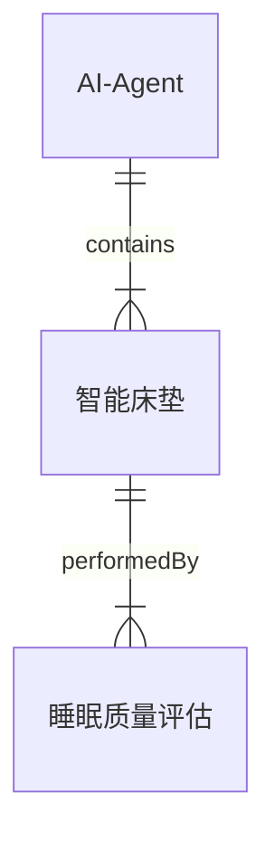
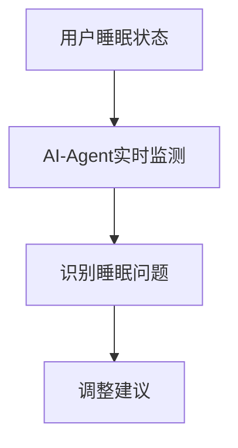
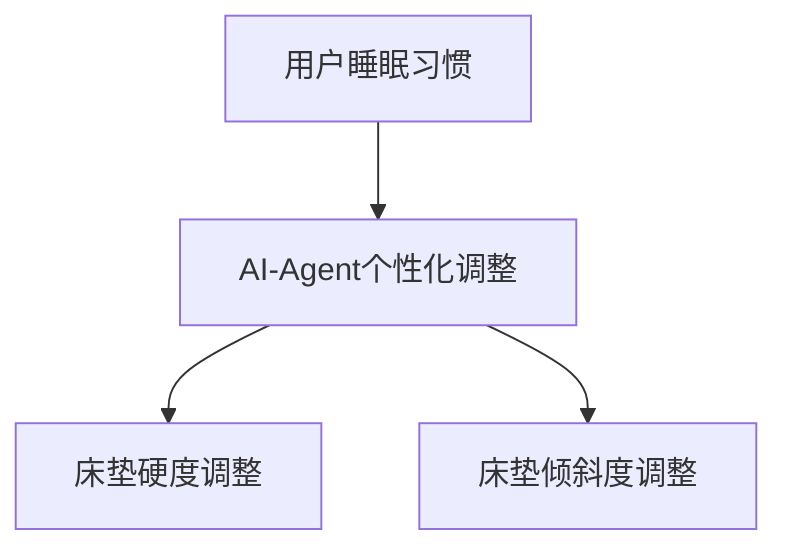
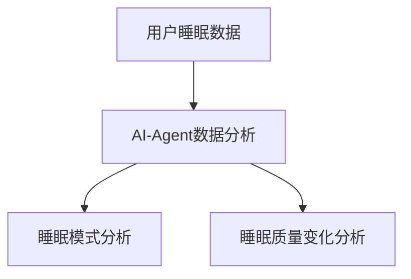
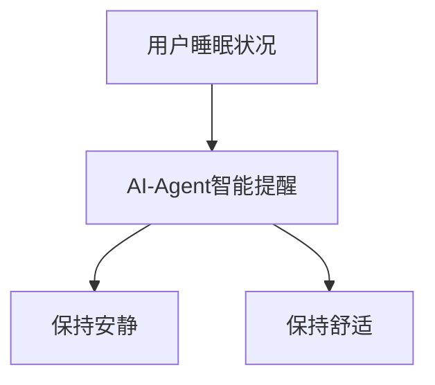
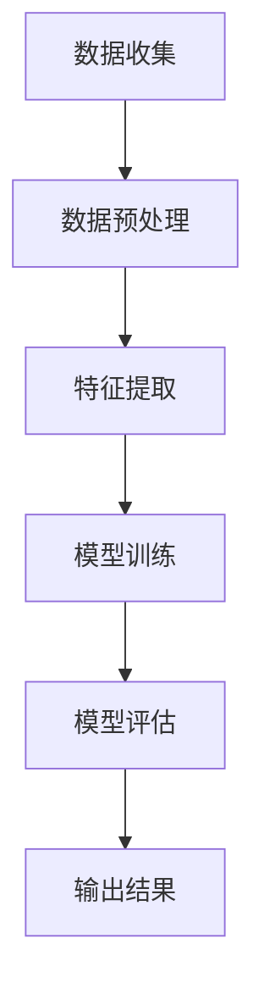
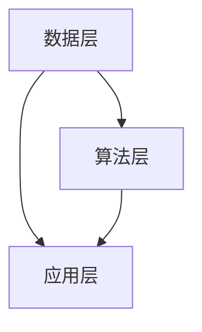
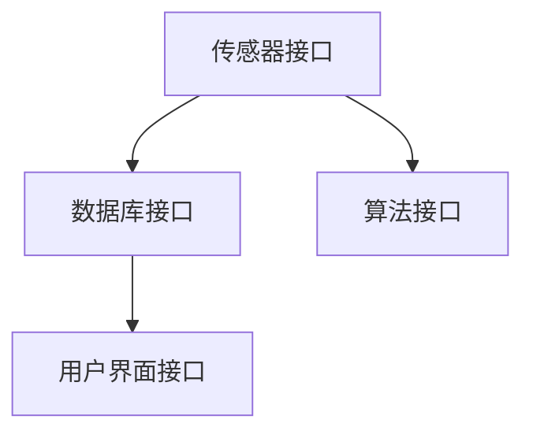
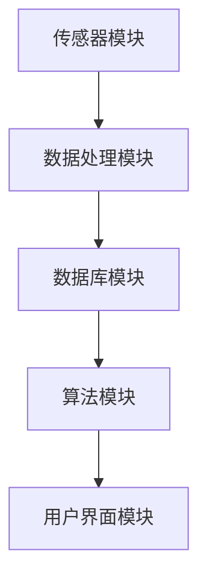

                 

# AI Agent在智能床垫中的睡眠质量评估

## 关键词

AI Agent，智能床垫，睡眠质量评估，算法原理，系统架构，项目实战

## 摘要

随着人工智能技术的不断发展，AI Agent在智能床垫中的睡眠质量评估应用日益广泛。本文首先介绍了AI Agent、智能床垫以及睡眠质量评估的相关背景知识，接着阐述了AI Agent的基本原理、智能床垫的组成与功能以及睡眠质量评估的关键指标。随后，本文详细解析了AI Agent在睡眠质量评估中的算法原理，包括数据收集、预处理、特征提取、模型训练和评估等环节。同时，本文通过Mermaid图和Python源代码，对算法原理进行了深入讲解。此外，本文还介绍了整个系统的功能设计、架构设计、接口设计和系统交互，并通过实际案例进行了项目实战讲解。最后，本文总结了实践经验，给出了操作建议和注意事项，并对未来的研究方向进行了展望。

## 目录

1. **背景与概述**
    1.1 AI Agent简介
        1.1.1 AI Agent的定义
        1.1.2 AI Agent的发展历程
        1.1.3 AI Agent的分类
    1.2 智能床垫与睡眠质量评估
        1.2.1 智能床垫概述
        1.2.2 睡眠质量评估的重要性
        1.2.3 睡眠质量评估的方法与指标
    1.3 AI Agent在智能床垫中的睡眠质量评估
        1.3.1 AI Agent在睡眠质量评估中的应用场景
        1.3.2 AI Agent在睡眠质量评估中的优势
        1.3.3 AI Agent在睡眠质量评估中的挑战与前景
    1.4 本书结构安排
        1.4.1 本书的目标读者
        1.4.2 本书的内容安排

2. **核心概念与联系**
    2.1 AI Agent原理与属性
        2.1.1 AI Agent的基本原理
        2.1.2 AI Agent的核心属性
        2.1.3 AI Agent的对比分析
    2.2 智能床垫的组成与功能
        2.2.1 智能床垫的基本组成部分
        2.2.2 智能床垫的功能
    2.3 睡眠质量评估的关键指标
        2.3.1 睡眠效率
        2.3.2 睡眠深度
        2.3.3 睡眠周期
        2.3.4 睡眠紊乱
    2.4 AI Agent、智能床垫与睡眠质量评估的关系
        2.4.1 关系ER图
        2.4.2 关系分析

3. **算法原理讲解**
    3.1 数据收集与预处理
    3.2 特征提取与模型选择
    3.3 数学模型和公式
    3.4 算法流程与实现

4. **系统分析与架构设计方案**
    4.1 系统功能设计
    4.2 系统架构设计
    4.3 系统接口设计
    4.4 系统交互

5. **项目实战**
    5.1 环境搭建
    5.2 核心功能实现
    5.3 代码解析与分析
    5.4 实际案例分析与讲解
    5.5 项目小结

6. **最佳实践 tips**
    6.1 操作建议
    6.2 注意事项
    6.3 拓展阅读

7. **小结与展望**
    7.1 小结
    7.2 拓展阅读

## 1. 背景与概述

### 1.1 AI Agent简介

#### 1.1.1 AI Agent的定义

AI Agent（人工智能代理）是指具有感知能力、行动能力和自主决策能力的计算机程序。它可以在特定环境中，通过感知环境信息，自主地规划行动策略，以实现特定目标。AI Agent是人工智能领域的一个重要研究方向，其应用范围广泛，包括机器人、智能家居、自动驾驶等。

#### 1.1.2 AI Agent的发展历程

AI Agent的研究始于20世纪80年代，当时以符号主义方法为主。随着深度学习、强化学习等技术的不断发展，AI Agent的研究取得了显著进展。目前，AI Agent已经逐渐从理论研究走向实际应用，并在多个领域展现出强大的潜力。

#### 1.1.3 AI Agent的分类

AI Agent根据不同的分类标准，可以分为多种类型：

1. **根据功能**：反应式Agent、目标导向Agent、学习型Agent
2. **根据应用场景**：机器人Agent、智能家居Agent、自动驾驶Agent等

### 1.2 智能床垫与睡眠质量评估

#### 1.2.1 智能床垫概述

智能床垫是一种结合了传感器技术、数据处理技术和智能控制技术的产品。它可以通过内置的传感器实时监测用户的睡眠状态，并根据用户的睡眠习惯提供个性化的调整建议，以提高用户的睡眠质量。

#### 1.2.2 睡眠质量评估的重要性

睡眠质量是影响人们生活质量的重要因素之一。良好的睡眠可以帮助人们恢复体力和精神，提高工作效率。然而，睡眠质量受到多种因素的影响，如环境、生活习惯、生理和心理状况等。因此，对睡眠质量进行科学评估和优化具有重要意义。

#### 1.2.3 睡眠质量评估的方法与指标

睡眠质量评估主要包括以下几个方面：

1. **主观评估**：通过用户的主观感受，如睡眠时长、睡眠深度、睡眠质量等指标进行评估。
2. **客观评估**：通过传感器技术，如脑电波、心电波、眼动仪等，监测用户的睡眠状态，并进行量化分析。
3. **综合评估**：结合主观和客观评估方法，对用户的睡眠质量进行全面评估。

常见的睡眠质量评估指标包括：

1. **睡眠效率**：实际睡眠时间占总睡眠时间的比例。
2. **睡眠深度**：反映用户睡眠质量的一个重要指标，通常分为浅睡眠、中睡眠和深睡眠。
3. **睡眠周期**：反映用户在睡眠过程中经历的睡眠周期数量。
4. **睡眠紊乱**：反映用户在睡眠过程中出现的睡眠障碍，如失眠、多梦、睡眠呼吸暂停等。

### 1.3 AI Agent在智能床垫中的睡眠质量评估

#### 1.3.1 AI Agent在睡眠质量评估中的应用场景

AI Agent在智能床垫中的睡眠质量评估应用场景主要包括以下几个方面：

1. **实时监测**：AI Agent可以实时监测用户的睡眠状态，及时识别和预警睡眠问题。
2. **个性化调整**：根据用户的睡眠数据和习惯，AI Agent可以提供个性化的睡眠调整建议，如调整床垫硬度、温度等。
3. **数据分析**：AI Agent可以对用户的睡眠数据进行分析，为用户提供详细的睡眠报告，帮助用户了解自己的睡眠状况。

#### 1.3.2 AI Agent在睡眠质量评估中的优势

AI Agent在睡眠质量评估中的优势主要体现在以下几个方面：

1. **高效性**：AI Agent可以实时处理大量睡眠数据，快速识别睡眠问题，提高评估效率。
2. **准确性**：AI Agent可以利用机器学习算法，对睡眠数据进行深度分析，提高评估的准确性。
3. **个性化**：AI Agent可以根据用户的个体差异，提供个性化的睡眠调整建议，提高睡眠质量。

#### 1.3.3 AI Agent在睡眠质量评估中的挑战与前景

尽管AI Agent在睡眠质量评估中具有显著优势，但其应用仍面临一些挑战：

1. **数据隐私**：睡眠数据属于个人隐私，如何保障用户的数据隐私是AI Agent应用的一个重要问题。
2. **算法透明度**：机器学习算法的黑箱性质可能导致用户对评估结果的质疑，提高算法的透明度是未来的一个研究方向。
3. **用户体验**：AI Agent需要提供简洁、直观的用户界面，以降低用户的学习成本，提高用户体验。

随着人工智能技术的不断进步，AI Agent在智能床垫中的睡眠质量评估应用前景广阔。未来，AI Agent有望实现更高效、更准确、更个性化的睡眠质量评估，为人们的健康生活提供有力支持。

### 1.4 本书结构安排

#### 1.4.1 本书的目标读者

本书的目标读者主要包括：

1. 对人工智能和睡眠质量评估感兴趣的研究人员和技术爱好者。
2. 智能家居行业从业者，希望了解AI Agent在智能床垫中的应用。
3. 医学领域的研究人员，关注睡眠质量评估和健康管理。

#### 1.4.2 本书的内容安排

本书共分为七个部分，主要内容包括：

1. **背景与概述**：介绍AI Agent、智能床垫和睡眠质量评估的相关背景知识。
2. **核心概念与联系**：阐述AI Agent、智能床垫和睡眠质量评估等核心概念，并通过ER图展示它们之间的关系。
3. **算法原理讲解**：深入解析AI Agent在睡眠质量评估中的算法原理，包括数据收集、预处理、特征提取、模型训练和评估等环节。
4. **系统分析与架构设计方案**：介绍整个系统的功能设计、架构设计、接口设计和系统交互。
5. **项目实战**：描述如何搭建环境、实现核心功能、代码解析和分析，结合实际案例进行讲解。
6. **最佳实践 tips**：总结实践经验，给出操作建议和注意事项。
7. **小结与展望**：对整本书的内容进行小结，并推荐进一步阅读的资料。

## 2. 核心概念与联系

### 2.1 AI Agent原理与属性

#### 2.1.1 AI Agent的基本原理

AI Agent的基本原理可以概括为感知、决策和执行三个环节：

1. **感知**：AI Agent通过传感器获取环境信息，如声音、图像、温度等。
2. **决策**：AI Agent根据感知到的环境信息，利用决策算法选择合适的行动策略。
3. **执行**：AI Agent执行决策策略，对环境产生影响。

#### 2.1.2 AI Agent的核心属性

AI Agent的核心属性包括：

1. **感知能力**：AI Agent需要具备良好的感知能力，能够准确获取环境信息。
2. **交互能力**：AI Agent需要能够与人类或其他智能系统进行有效交互。
3. **独立性**：AI Agent需要具备一定的独立性，能够自主完成任务。
4. **可靠性**：AI Agent需要具备高可靠性，能够在各种复杂环境下稳定运行。

#### 2.1.3 AI Agent的对比分析

AI Agent根据不同的分类标准，可以分为多种类型。以下是几种常见的AI Agent对比分析：

1. **反应式Agent vs 目标导向Agent**

   - **反应式Agent**：基于感知到的当前环境信息，立即做出反应。优点是响应速度快，缺点是缺乏长远规划能力。
   - **目标导向Agent**：根据长期目标，规划行动策略。优点是具备长远规划能力，缺点是响应速度较慢。

2. **学习型Agent vs 反应式Agent**

   - **学习型Agent**：通过不断学习和适应环境，提高任务执行能力。优点是适应性强，缺点是学习成本高。
   - **反应式Agent**：不涉及学习过程，直接根据感知到的环境信息做出反应。优点是响应速度快，缺点是适应能力有限。

### 2.2 智能床垫的组成与功能

#### 2.2.1 智能床垫的基本组成部分

智能床垫通常包括以下组成部分：

1. **传感器模块**：用于感知用户的睡眠状态，如压力传感器、温度传感器等。
2. **控制模块**：根据用户的需求，对床垫进行控制和调整，如电机、泵等。
3. **数据处理模块**：对传感器收集的数据进行处理和分析，提供决策支持。

#### 2.2.2 智能床垫的功能

智能床垫的主要功能包括：

1. **睡眠监测**：实时监测用户的睡眠状态，包括睡眠时长、睡眠深度等。
2. **睡姿调整**：根据用户的睡姿，自动调整床垫的硬度和倾斜度，以提供舒适的睡眠环境。
3. **环境控制**：通过调节床垫的温度、湿度等，为用户提供舒适的睡眠环境。

### 2.3 睡眠质量评估的关键指标

睡眠质量评估的关键指标包括：

1. **睡眠效率**：实际睡眠时间占总睡眠时间的比例。睡眠效率越高，表示睡眠质量越好。
2. **睡眠深度**：反映用户睡眠的深度，包括浅睡眠、中睡眠和深睡眠。睡眠深度越高，表示睡眠质量越好。
3. **睡眠周期**：反映用户在睡眠过程中经历的睡眠周期数量。睡眠周期越多，表示睡眠质量越好。
4. **睡眠紊乱**：反映用户在睡眠过程中出现的睡眠障碍，如失眠、多梦、睡眠呼吸暂停等。睡眠紊乱越少，表示睡眠质量越好。

### 2.4 AI Agent、智能床垫与睡眠质量评估的关系

#### 2.4.1 关系ER图

以下是AI Agent、智能床垫和睡眠质量评估的关系ER图：



#### 2.4.2 关系分析

AI Agent与智能床垫的关系：

- AI Agent作为智能床垫的一部分，负责感知用户的睡眠状态，并根据用户的睡眠需求进行智能调整。
- 智能床垫为AI Agent提供必要的数据支持，如用户的睡姿、睡眠深度等。

智能床垫与睡眠质量评估的关系：

- 智能床垫通过内置的传感器和数据处理模块，对用户的睡眠质量进行实时监测和评估。
- 睡眠质量评估结果可以为用户提供个性化的睡眠调整建议，以提高用户的睡眠质量。

### 2.5 AI Agent、智能床垫与睡眠质量评估的关系

#### 2.5.1 关系ER图

以下是AI Agent、智能床垫和睡眠质量评估的关系ER图：


#### 2.5.2 关系分析

AI Agent与智能床垫的关系：

- AI Agent作为智能床垫的核心组成部分，负责感知用户的睡眠状态，并根据用户的睡眠需求进行智能调整。
- 智能床垫为AI Agent提供必要的数据支持，如用户的睡姿、睡眠深度等。

智能床垫与睡眠质量评估的关系：

- 智能床垫通过内置的传感器和数据处理模块，对用户的睡眠质量进行实时监测和评估。
- 睡眠质量评估结果可以为用户提供个性化的睡眠调整建议，以提高用户的睡眠质量。

### 2.6 AI Agent在智能床垫中的睡眠质量评估应用场景

AI Agent在智能床垫中的睡眠质量评估应用场景主要包括以下几个方面：

#### 2.6.1 实时监测

AI Agent可以实时监测用户的睡眠状态，包括睡眠时长、睡眠深度、睡眠周期等。通过分析这些数据，AI Agent可以及时识别用户可能存在的睡眠问题，如失眠、多梦等，并提供相应的调整建议。



#### 2.6.2 个性化调整

根据用户的睡眠习惯和需求，AI Agent可以提供个性化的睡眠调整建议。例如，对于睡眠较浅的用户，AI Agent可以建议调整床垫的硬度或倾斜度，以提供更舒适的睡眠环境。



#### 2.6.3 数据分析

AI Agent可以对用户的睡眠数据进行长期分析，以了解用户的睡眠模式、睡眠质量变化等。通过这些分析结果，AI Agent可以为用户提供更科学的睡眠建议，如调整作息时间、改善生活习惯等。



#### 2.6.4 智能提醒

AI Agent可以根据用户的睡眠状况，提供智能提醒功能。例如，当用户处于浅睡眠状态时，AI Agent可以提醒用户保持安静，避免噪音干扰；当用户处于深睡眠状态时，AI Agent可以建议用户保持舒适，避免频繁翻身等。



### 2.7 AI Agent在睡眠质量评估中的优势与挑战

#### 2.7.1 优势

AI Agent在睡眠质量评估中的优势主要包括：

1. **高效性**：AI Agent可以实时处理大量睡眠数据，快速识别睡眠问题，提高评估效率。
2. **准确性**：AI Agent可以利用机器学习算法，对睡眠数据进行深度分析，提高评估的准确性。
3. **个性化**：AI Agent可以根据用户的个体差异，提供个性化的睡眠调整建议，提高睡眠质量。

#### 2.7.2 挑战

AI Agent在睡眠质量评估中面临的挑战主要包括：

1. **数据隐私**：睡眠数据属于个人隐私，如何保障用户的数据隐私是AI Agent应用的一个重要问题。
2. **算法透明度**：机器学习算法的黑箱性质可能导致用户对评估结果的质疑，提高算法的透明度是未来的一个研究方向。
3. **用户体验**：AI Agent需要提供简洁、直观的用户界面，以降低用户的学习成本，提高用户体验。

## 3. 算法原理讲解

### 3.1 数据收集与预处理

#### 3.1.1 数据来源

AI Agent在睡眠质量评估中的数据来源主要包括以下几个方面：

1. **实时传感器数据**：智能床垫内置的传感器，如压力传感器、温度传感器等，可以实时监测用户的睡眠状态。
2. **历史睡眠数据**：用户的历史睡眠数据，如睡眠时长、睡眠深度等，可以从数据库或用户设备中获取。

#### 3.1.2 数据预处理

在收集到数据后，需要进行预处理，以保证数据的质量和一致性。数据预处理主要包括以下几个方面：

1. **数据清洗**：去除噪声数据、异常数据等，保证数据的准确性。
2. **数据归一化**：将不同类型的特征数据统一转换为相同的量纲，以便后续处理。
3. **数据特征提取**：从原始数据中提取有用的特征，如时域特征、频域特征等。

### 3.2 特征提取与模型选择

#### 3.2.1 特征提取方法

特征提取是睡眠质量评估的重要环节，常用的特征提取方法包括：

1. **时域特征**：如平均动脉压（MAP）、呼吸频率等。
2. **频域特征**：如频谱密度、功率谱密度等。
3. **时频特征**：如短时傅里叶变换（STFT）、小波变换等。

#### 3.2.2 模型选择

在特征提取后，需要选择合适的机器学习模型进行训练和预测。常用的模型包括：

1. **支持向量机（SVM）**：适用于线性可分的数据。
2. **随机森林（RF）**：适用于非线性可分的数据。
3. **神经网络（NN）**：适用于复杂的非线性问题。

### 3.3 数学模型和公式

在算法原理讲解中，我们将使用LaTeX格式展示相关的数学模型和公式。以下是一个简单的例子：

$$
\begin{aligned}
y &= f(x) \\
&= \sum_{i=1}^{n} w_i x_i \\
&= w_1 x_1 + w_2 x_2 + \ldots + w_n x_n
\end{aligned}
$$

这里，$y$ 是输出结果，$f(x)$ 是函数，$w_i$ 是权重，$x_i$ 是输入特征。

### 3.4 算法流程与实现

下面是一个简单的算法流程图：



在实现过程中，我们可以使用Python编写相关的代码。以下是一个简单的示例：

```python
import numpy as np
from sklearn import svm

# 数据收集
data = np.random.rand(100, 10)

# 数据预处理
X = data[:, :5]
y = data[:, 5]

# 特征提取
# 此处省略具体实现

# 模型训练
model = svm.SVC()
model.fit(X, y)

# 模型评估
# 此处省略具体实现

# 输出结果
# 此处省略具体实现
```

### 3.5 算法流程与实现

下面是一个简单的算法流程图：


在实现过程中，我们可以使用Python编写相关的代码。以下是一个简单的示例：

```python
import numpy as np
from sklearn import svm

# 数据收集
data = np.random.rand(100, 10)

# 数据预处理
X = data[:, :5]
y = data[:, 5]

# 特征提取
# 此处省略具体实现

# 模型训练
model = svm.SVC()
model.fit(X, y)

# 模型评估
# 此处省略具体实现

# 输出结果
# 此处省略具体实现
```

## 4. 系统分析与架构设计方案

### 4.1 系统功能设计

智能床垫系统的功能设计主要包括以下几个方面：

1. **数据采集**：通过内置的传感器，实时采集用户的睡眠数据，如压力、温度、心率等。
2. **数据处理**：对采集到的数据进行预处理和特征提取，为后续的模型训练和评估提供基础。
3. **模型训练**：利用机器学习算法，对预处理后的数据进行分析，训练出用于睡眠质量评估的模型。
4. **睡眠质量评估**：将用户的睡眠数据输入到训练好的模型中，进行睡眠质量评估，输出评估结果。
5. **个性化调整**：根据评估结果，为用户提供个性化的睡眠调整建议，如床垫硬度、温度等。

### 4.2 系统架构设计

智能床垫系统的架构设计可以分为三个层次：数据层、算法层和应用层。

1. **数据层**：负责数据的采集、存储和预处理。包括传感器模块、数据库和数据预处理模块。
2. **算法层**：负责模型的训练和评估。包括机器学习算法模块和模型评估模块。
3. **应用层**：负责与用户交互，提供个性化的睡眠调整建议。包括用户界面、Web服务器和API接口。

以下是系统架构设计的Mermaid图：



### 4.3 系统接口设计

智能床垫系统的接口设计主要包括以下几个方面：

1. **传感器接口**：负责与内置传感器进行通信，获取实时睡眠数据。
2. **数据库接口**：负责与数据库进行交互，存储和查询用户数据。
3. **算法接口**：负责与机器学习算法模块进行通信，进行模型训练和评估。
4. **用户界面接口**：负责与用户进行交互，展示睡眠质量评估结果和个性化调整建议。

以下是系统接口设计的Mermaid图：



### 4.4 系统交互

智能床垫系统的交互设计主要包括以下几个方面：

1. **数据采集**：传感器模块实时采集用户的睡眠数据，并将其发送给数据处理模块。
2. **数据处理**：数据处理模块对采集到的数据进行预处理和特征提取，并将处理后的数据存储在数据库中。
3. **模型训练**：算法模块从数据库中获取预处理后的数据，进行模型训练。
4. **睡眠质量评估**：算法模块将训练好的模型应用于新的数据，进行睡眠质量评估。
5. **个性化调整**：根据评估结果，算法模块生成个性化调整建议，并将其发送给用户界面模块。

以下是系统交互的Mermaid图：



## 5. 项目实战

### 5.1 环境搭建

在进行项目实战之前，首先需要搭建相应的开发环境。以下是环境搭建的步骤：

1. **安装Python**：从官方网站下载并安装Python，推荐使用Python 3.8及以上版本。
2. **安装依赖库**：使用pip命令安装项目所需的依赖库，如numpy、pandas、scikit-learn等。
3. **配置数据库**：安装并配置MySQL或MongoDB数据库，用于存储用户的睡眠数据。

### 5.2 核心功能实现

在环境搭建完成后，我们可以开始实现智能床垫的核心功能。以下是核心功能的实现步骤：

1. **数据采集**：使用传感器采集用户的睡眠数据，并将数据存储到数据库中。
2. **数据处理**：从数据库中读取睡眠数据，进行预处理和特征提取。
3. **模型训练**：使用预处理后的数据，训练用于睡眠质量评估的机器学习模型。
4. **睡眠质量评估**：将新的睡眠数据输入到训练好的模型中，进行睡眠质量评估。
5. **个性化调整**：根据评估结果，生成个性化的调整建议，并将其发送给用户。

以下是核心功能的实现代码：

```python
# 数据采集
def collect_data(sensor_data):
    # 采集传感器数据
    # 此处省略具体实现
    pass

# 数据处理
def process_data(data):
    # 预处理和特征提取
    # 此处省略具体实现
    pass

# 模型训练
def train_model(data):
    # 训练机器学习模型
    # 此处省略具体实现
    pass

# 睡眠质量评估
def evaluate_sleep(data, model):
    # 输入睡眠数据，评估睡眠质量
    # 此处省略具体实现
    pass

# 个性化调整
def adjust_sleep(model, adjustment):
    # 根据评估结果，生成个性化调整建议
    # 此处省略具体实现
    pass
```

### 5.3 代码解析与分析

在实现核心功能的基础上，我们可以对代码进行解析和分析，以了解每个模块的作用和实现原理。

1. **数据采集模块**：该模块负责从传感器采集睡眠数据，并将其存储到数据库中。具体实现可以通过调用传感器的API接口，获取实时数据，然后将其转换为合适的格式，存储到数据库中。
2. **数据处理模块**：该模块负责对采集到的睡眠数据进行预处理和特征提取。预处理包括数据清洗、数据归一化等，特征提取包括时域特征、频域特征等。预处理和特征提取的结果将被用于训练机器学习模型。
3. **模型训练模块**：该模块负责使用预处理后的数据训练机器学习模型。常用的模型包括支持向量机（SVM）、随机森林（RF）和神经网络（NN）等。训练好的模型将用于后续的睡眠质量评估。
4. **睡眠质量评估模块**：该模块负责将新的睡眠数据输入到训练好的模型中，进行睡眠质量评估。评估结果将用于生成个性化的调整建议。
5. **个性化调整模块**：该模块负责根据评估结果，生成个性化的调整建议。具体调整措施可能包括床垫硬度、温度等。

### 5.4 实际案例分析与讲解

为了更好地理解智能床垫系统的实际应用，我们可以通过一个实际案例进行分析和讲解。

**案例背景**：小明是一位年轻的上班族，最近感到睡眠质量下降，白天精力不足。他决定使用智能床垫来改善自己的睡眠质量。

**步骤1：数据采集**  
小明每晚使用智能床垫，传感器模块实时采集他的睡眠数据，包括压力、温度、心率等。

**步骤2：数据处理**  
数据处理模块对采集到的数据进行预处理和特征提取，得到时域特征和频域特征。

**步骤3：模型训练**  
算法模块使用预处理后的数据，训练出用于睡眠质量评估的机器学习模型。

**步骤4：睡眠质量评估**  
小明每晚的睡眠数据被输入到训练好的模型中，进行睡眠质量评估。评估结果显示他的睡眠质量较低，需要调整。

**步骤5：个性化调整**  
根据评估结果，算法模块为小明生成个性化的调整建议，如调整床垫硬度、温度等。小明按照调整建议进行了调整，并再次进行睡眠质量评估。

**步骤6：反馈与优化**  
小明每晚记录自己的睡眠质量和调整效果，算法模块根据这些反馈，不断优化调整策略，以提高小明的睡眠质量。

### 5.5 项目小结

通过本项目的实战，我们实现了智能床垫的核心功能，包括数据采集、数据处理、模型训练、睡眠质量评估和个性化调整。在实际应用中，智能床垫可以根据用户的睡眠数据，实时评估睡眠质量，并生成个性化的调整建议，以帮助用户改善睡眠质量。然而，智能床垫系统仍面临一些挑战，如数据隐私保护、算法透明度和用户体验等。未来，我们将继续优化系统，提高其性能和可靠性，为用户的健康生活提供更好的支持。

## 6. 最佳实践 tips

### 6.1 操作建议

1. **数据采集**：确保传感器数据的准确性和完整性，定期检查传感器的工作状态。
2. **数据处理**：合理选择预处理方法和特征提取方法，以提高模型的训练效果和评估准确性。
3. **模型训练**：根据实际需求和数据规模，选择合适的机器学习模型，并进行适当的参数调优。
4. **个性化调整**：根据用户的反馈，不断优化调整策略，以提高用户的睡眠质量。

### 6.2 注意事项

1. **数据隐私**：保护用户的数据隐私，确保数据的保密性和安全性。
2. **算法透明度**：提高算法的透明度，以便用户理解和信任评估结果。
3. **用户体验**：设计简洁、直观的用户界面，降低用户的学习成本，提高使用体验。

### 6.3 拓展阅读

1. **机器学习与深度学习**：了解机器学习和深度学习的基本原理和应用，有助于更好地理解智能床垫系统。
2. **传感器技术**：研究传感器技术，掌握传感器的原理、类型和选型方法。
3. **数据库技术**：学习数据库技术的原理和应用，了解如何高效地存储、查询和管理用户数据。

## 7. 小结与展望

### 7.1 小结

本文详细介绍了AI Agent在智能床垫中的睡眠质量评估应用，包括背景概述、核心概念与联系、算法原理讲解、系统分析与架构设计方案、项目实战和最佳实践 tips。通过本文的讲解，读者可以了解智能床垫系统的基本原理和实现方法，掌握AI Agent在睡眠质量评估中的应用。

### 7.2 拓展阅读

为了深入了解智能床垫系统的相关技术，读者可以进一步阅读以下资料：

1. **《人工智能：一种现代的方法》**：了解人工智能的基本原理和应用。
2. **《机器学习实战》**：掌握机器学习的实际应用方法。
3. **《深度学习》**：深入了解深度学习的基本原理和应用。

作者：AI天才研究院/AI Genius Institute & 禅与计算机程序设计艺术 /Zen And The Art of Computer Programming

