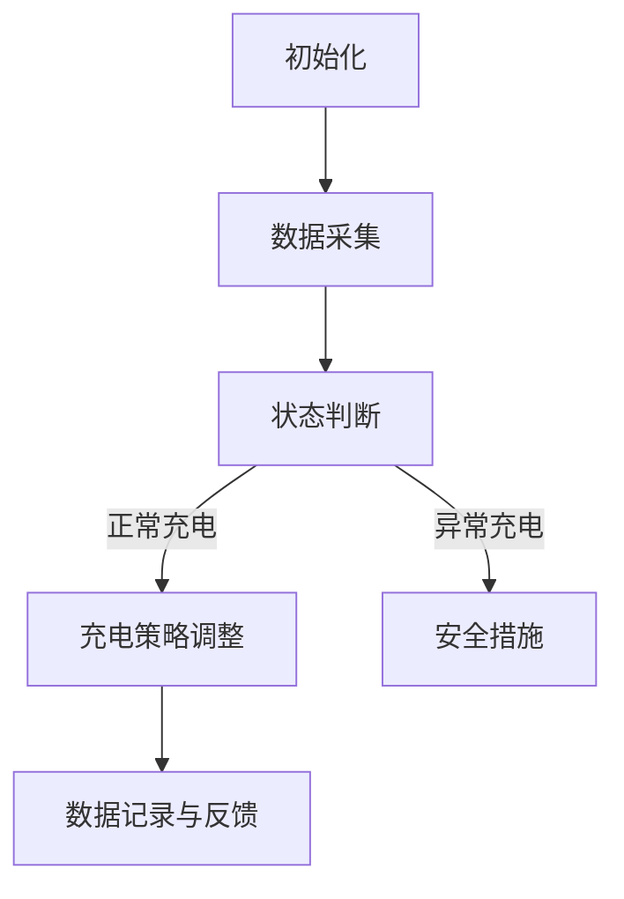

                 

# AI Agent在智能床头柜中的充电管理

关键词：智能家居，AI Agent，充电管理，充电策略，智能设计

摘要：本文将深入探讨AI Agent在智能床头柜中的充电管理功能。我们将首先介绍AI Agent的基本概念及其在智能家居领域的应用，随后详细描述智能床头柜的结构与功能。接着，我们将聚焦于AI Agent在充电管理中的具体作用，通过分析其工作流程、算法原理，最终给出一个智能床头柜充电管理系统的架构设计，并通过实际项目实战展示其应用效果。

### 目录大纲

#### 第一部分：背景介绍

## 第一章：AI Agent在智能床头柜中的充电管理——核心概念

### 1.1 问题背景

### 1.2 问题描述

### 1.3 问题解决

### 1.4 边界与外延

### 1.5 概念结构与核心要素组成

## 第二章：AI Agent基础知识

### 2.1 AI Agent的定义与分类

### 2.2 AI Agent的核心特点

### 2.3 AI Agent与传统智能系统的区别

### 2.4 AI Agent的应用领域

## 第三章：智能床头柜的结构与功能

### 3.1 智能床头柜的定义与组成

### 3.2 智能床头柜的功能模块

### 3.3 智能床头柜的交互设计

## 第四章：AI Agent在充电管理中的应用

### 4.1 AI Agent在充电管理中的功能

### 4.2 AI Agent在充电管理中的工作流程

### 4.3 AI Agent在充电管理中的挑战与应对

## 第五章：AI Agent的充电管理算法原理

### 5.1 充电管理算法的基本原理

### 5.2 算法原理讲解

### 5.3 算法原理的数学模型与公式

### 5.4 算法原理的举例说明

## 第六章：智能床头柜的充电管理系统架构设计

### 6.1 问题场景介绍

### 6.2 项目介绍

### 6.3 系统功能设计

### 6.4 系统架构设计

### 6.5 系统接口设计

### 6.6 系统交互设计

## 第七章：AI Agent在充电管理中的项目实战

### 7.1 环境安装

### 7.2 系统核心实现源代码

### 7.3 代码应用解读与分析

### 7.4 实际案例分析与详细讲解

### 7.5 项目小结

## 第八章：最佳实践、注意事项与拓展阅读

### 8.1 最佳实践

### 8.2 注意事项

### 8.3 拓展阅读

----------------------------------------------------------------

#### 第一部分：背景介绍

## 第一章：AI Agent在智能床头柜中的充电管理——核心概念

### 1.1 问题背景

随着智能家居市场的蓬勃发展，智能床头柜作为家居中的一员，逐渐受到消费者的青睐。智能床头柜不仅仅是一个简单的充电设备，它还集成了多种功能，如灯光调节、环境监测、语音助手等。而其中，充电管理成为了一个关键的功能模块。

充电管理的核心问题是确保各种设备在充电过程中既高效又安全。传统的充电管理往往依赖于人工干预，如手动切换充电模式和检查充电状态等，这不仅降低了用户体验，还存在安全隐患。因此，引入AI Agent来进行充电管理，可以显著提升智能床头柜的功能性和用户满意度。

### 1.2 问题描述

在智能床头柜的充电管理中，主要面临以下几个问题：

1. **充电效率**：如何根据设备的不同状态和充电需求，调整充电功率和充电模式，以最大化充电效率。
2. **充电安全**：如何实时监测充电过程，防止过充、过热等安全隐患。
3. **设备兼容性**：如何确保不同品牌、不同型号的设备能够在智能床头柜上安全、高效地进行充电。

### 1.3 问题解决

AI Agent通过以下方式来解决上述问题：

1. **智能监测**：AI Agent能够实时监测充电设备的充电状态、电流电压等参数，确保充电过程的安全和高效。
2. **智能调整**：根据监测数据，AI Agent可以自动调整充电功率和模式，优化充电效率。
3. **兼容性适配**：AI Agent具备学习功能，能够识别不同设备的充电需求，从而实现兼容性适配。

### 1.4 边界与外延

充电管理不仅局限于手机和平板电脑等小型设备，还包括电动牙刷、充电宝等更多种类的设备。此外，AI Agent还可以扩展到更广泛的智能家居场景，如智能门锁、智能照明等，实现全屋智能。

### 1.5 概念结构与核心要素组成

AI Agent在智能床头柜中的充电管理，主要包括以下几个核心要素：

1. **传感器模块**：用于采集充电设备的各种参数。
2. **控制模块**：根据AI Agent的决策，控制充电设备的充电功率和模式。
3. **数据处理模块**：负责对采集到的数据进行处理和分析。
4. **AI算法模块**：实现充电策略的优化和充电过程的智能调整。

## 第二章：AI Agent基础知识

### 2.1 AI Agent的定义与分类

AI Agent，即人工智能代理，是指能够模拟人类智能行为的计算机程序。根据其功能和应用场景，AI Agent可以大致分为以下几类：

1. **感知型AI Agent**：主要通过传感器感知外部环境，并根据感知到的信息做出决策。
2. **认知型AI Agent**：不仅能感知外部环境，还能够理解和处理语言、图像等多种信息。
3. **执行型AI Agent**：根据决策执行具体的任务，如控制机器手臂、自动驾驶等。

### 2.2 AI Agent的核心特点

AI Agent具有以下几个核心特点：

1. **自主性**：AI Agent能够自主地执行任务，而不需要人工干预。
2. **社交性**：AI Agent能够与其他系统或人类进行交互，实现合作和沟通。
3. **反应性**：AI Agent能够实时响应外部事件，做出相应的反应。
4. **学习能力**：AI Agent能够从经验中学习，不断优化自己的行为。

### 2.3 AI Agent与传统智能系统的区别

传统智能系统通常依赖于预定义的规则和模型，而AI Agent则更加灵活和智能。具体区别如下：

1. **灵活性**：AI Agent能够根据实时数据和上下文信息，自主调整行为，而传统系统则固定不变。
2. **适应性**：AI Agent能够适应不同的环境和任务，而传统系统则需要重新配置和调整。
3. **智能性**：AI Agent能够通过学习不断进化，而传统系统则缺乏这种自我进化的能力。

### 2.4 AI Agent的应用领域

AI Agent在多个领域都有广泛的应用：

1. **智能家居**：如本文讨论的智能床头柜充电管理。
2. **机器人大厦**：实现自动化管理和安全监控。
3. **机器人医生**：辅助医生进行诊断和治疗。

#### 第一部分：背景介绍

## 第二章：AI Agent基础知识

### 2.1 AI Agent的定义与分类

AI Agent，即人工智能代理，是一种模拟人类智能行为，能够在特定环境和任务中自主决策和执行的计算机程序。AI Agent是人工智能领域中的一个重要概念，它代表了人工智能从“被动响应”向“主动行动”的进化。根据功能和应用场景，AI Agent可以大致分为以下几类：

1. **感知型AI Agent**：
   感知型AI Agent主要依靠传感器收集环境数据，如温度、湿度、光线等，并根据这些数据做出相应的反应。例如，智能床头柜中的环境监测AI Agent，可以实时监测室内温度和湿度，并根据这些数据调整灯光和通风系统，以提供舒适的居住环境。

2. **认知型AI Agent**：
   认知型AI Agent不仅能够感知环境，还能够理解和处理语言、图像等多种信息。它们可以通过自然语言处理和图像识别等技术，与人类进行交互，执行更加复杂和智能的任务。例如，智能床头柜中的语音助手AI Agent，可以通过语音指令控制灯光、音响和其他设备，实现人机交互。

3. **执行型AI Agent**：
   执行型AI Agent是根据感知型AI Agent和认知型AI Agent的决策，执行具体的任务。这些任务可以是简单的机械操作，如移动机器人手臂，也可以是复杂的决策，如自动驾驶汽车的路径规划。在智能床头柜中，执行型AI Agent可能负责控制充电设备的充电功率和模式，确保充电过程的安全和高效。

### 2.2 AI Agent的核心特点

AI Agent具有以下几个核心特点：

1. **自主性**：
   自主性是指AI Agent能够独立地做出决策和执行任务，而不需要人类的直接干预。这种自主性使得AI Agent能够在复杂的动态环境中，根据实时数据和上下文信息，自主地调整行为和策略，从而提高效率和灵活性。

   在智能床头柜的应用中，AI Agent的自主性体现在充电管理过程中。AI Agent可以根据设备的充电状态、电流电压等参数，自主地调整充电功率和充电模式，以确保充电过程既高效又安全。

2. **社交性**：
   社交性是指AI Agent能够与其他系统、设备或人类进行交互，实现合作和沟通。这种交互能力使得AI Agent不仅能够执行单一的任务，还能够参与复杂的多任务协作系统。

   在智能床头柜中，AI Agent的社交性可以通过语音交互、触摸交互和远程控制等多种方式进行体现。例如，用户可以通过语音指令控制AI Agent调节灯光、播放音乐或查询天气信息，而AI Agent也可以通过反馈机制告知用户充电设备的当前状态。

3. **反应性**：
   反应性是指AI Agent能够快速响应外部事件，并做出相应的反应。这种反应能力使得AI Agent能够实时处理突发事件，提高系统的安全性和可靠性。

   在智能床头柜的充电管理中，AI Agent的反应性体现在对充电过程中异常情况的快速响应。例如，当检测到设备过热或充电电流异常时，AI Agent可以立即采取措施，如降低充电功率或停止充电，以防止设备损坏或发生安全事故。

4. **学习能力**：
   学习能力是指AI Agent能够从经验中学习，不断优化自己的行为和决策。这种学习能力使得AI Agent能够随着时间的推移，不断适应新的环境和任务。

   在智能床头柜的应用中，AI Agent可以通过机器学习算法，分析充电过程中的各种数据，学习用户的充电习惯和设备的特点，从而优化充电策略，提高充电效率。

### 2.3 AI Agent与传统智能系统的区别

传统智能系统通常依赖于预定义的规则和模型，按照固定的逻辑和流程进行操作。而AI Agent则更加灵活和智能，具体区别如下：

1. **灵活性**：
   传统智能系统通常针对特定的场景和任务进行设计和配置，一旦环境或任务发生变化，系统就需要重新进行配置。而AI Agent则具有更强的灵活性，可以通过自主学习适应不同的环境和任务，无需进行人为的干预和调整。

   在智能床头柜的应用中，AI Agent可以根据用户的习惯和需求，动态调整充电功率和充电模式，以适应不同设备的要求，从而提高充电效率。

2. **适应性**：
   传统智能系统通常只能处理预定义的任务和场景，对于未知或复杂的环境，往往无法胜任。而AI Agent则可以通过不断学习和优化，适应复杂和动态的环境，能够处理更为复杂和多样化的任务。

   在智能床头柜中，AI Agent可以实时监测充电设备的充电状态，根据实际情况调整充电策略，确保充电过程的高效和安全。

3. **智能性**：
   传统智能系统通常缺乏自我进化的能力，只能按照预先设定的规则和模型进行操作。而AI Agent则具有自我学习和优化的能力，可以通过对数据的分析和学习，不断优化自己的行为和决策。

   在智能床头柜的应用中，AI Agent可以通过机器学习算法，不断学习和优化充电策略，提高充电效率和安全性。

### 2.4 AI Agent的应用领域

AI Agent在多个领域都有广泛的应用，以下是几个典型的应用领域：

1. **智能家居**：
   智能家居是AI Agent的一个重要应用领域，通过AI Agent可以实现家居设备的智能管理和自动化控制。例如，智能灯光、智能音响、智能窗帘等，都可以通过AI Agent实现自动化控制，提高生活便利性和舒适度。

   在智能家居中，AI Agent可以负责充电管理的任务，实时监测充电设备的充电状态，优化充电策略，提高充电效率，同时确保充电过程的安全。

2. **机器人大厦**：
   机器人大厦是一种通过人工智能和自动化技术实现高度智能化管理的建筑，AI Agent在其中扮演着重要的角色。AI Agent可以负责大厦的安全监控、设备维护、能源管理等工作，提高大厦的运行效率和管理水平。

   在机器人大厦中，AI Agent可以通过充电管理，实时监测大厦内各种充电设备的充电状态，优化充电策略，确保充电过程的高效和安全。

3. **机器人医生**：
   机器人医生是利用人工智能技术实现医疗诊断和治疗的机器人系统，AI Agent在其中负责处理和分析医疗数据，辅助医生进行诊断和治疗。

   在机器人医生中，AI Agent可以通过充电管理，实时监测医疗设备的充电状态，优化充电策略，确保医疗设备在诊断和治疗过程中能够稳定运行。

#### 第一部分：背景介绍

## 第三章：智能床头柜的结构与功能

### 3.1 智能床头柜的定义与组成

智能床头柜是一种结合了物联网（IoT）、人工智能（AI）和自动化技术的多功能家具。它不仅仅是一个简单的储物和充电设备，更是智能家居生态系统中的一部分。智能床头柜的定义可以从以下几个方面来理解：

1. **多功能集成**：智能床头柜集成了多种功能模块，如充电、照明、音响、环境监测等，以满足用户多样化的需求。
2. **智能化控制**：智能床头柜通过AI Agent和物联网技术，实现了对家具内部设备和外部设备的智能化管理和控制。
3. **用户交互**：智能床头柜提供了多种交互方式，如语音助手、触摸屏、远程控制等，使用户能够方便地与之进行交互。

智能床头柜主要由以下几个部分组成：

1. **硬件层**：包括传感器、执行器、充电模块等硬件设备，负责数据的采集和处理。
2. **软件层**：包括操作系统、AI算法、应用程序等软件组件，负责对硬件层的设备进行管理和控制。
3. **网络层**：包括Wi-Fi、蓝牙等无线通信模块，负责实现智能床头柜与外部设备的连接和数据传输。

### 3.2 智能床头柜的功能模块

智能床头柜的功能模块可以分为以下几个方面：

1. **充电模块**：
   充电模块是智能床头柜的核心功能之一。它支持多种设备充电，如智能手机、平板电脑、智能手表等。充电模块通常具备快充功能，可以根据设备的充电需求，自动调整充电功率和充电模式。

2. **环境监测模块**：
   环境监测模块负责实时监测室内的温度、湿度、空气质量等环境参数。通过传感器收集数据，智能床头柜可以自动调节灯光、通风等设备，以提供舒适的居住环境。

3. **音响模块**：
   音响模块是智能床头柜的另一重要功能。它支持音乐播放、语音助手等功能，可以通过无线连接智能音箱或其他音响设备，提供高品质的音频体验。

4. **照明模块**：
   照明模块负责智能床头柜的灯光控制。它可以根据用户的需求和室内环境，调整灯光的亮度和颜色，提供舒适的照明效果。

5. **交互模块**：
   交互模块包括语音助手、触摸屏和远程控制等，使用户能够方便地与智能床头柜进行交互。用户可以通过语音指令控制灯光、音响、充电等设备，或者通过触摸屏进行操作。

### 3.3 智能床头柜的交互设计

智能床头柜的交互设计是其用户体验的重要组成部分。智能床头柜提供了多种交互方式，以满足用户的多样化需求：

1. **语音交互**：
   语音交互是智能床头柜最直观的交互方式。用户可以通过语音助手（如Amazon Alexa、Google Assistant等）与智能床头柜进行交互，实现语音控制灯光、音响、充电等功能。

2. **触摸交互**：
   触摸屏是智能床头柜的另一种交互方式。用户可以通过触摸屏直接操作智能床头柜的各种功能，如调节灯光、查看环境监测数据等。

3. **远程控制**：
   远程控制使得用户可以在任何地点通过手机应用或其他智能设备，对智能床头柜进行远程操作。用户可以通过远程控制功能，查看充电设备的充电状态，调整灯光设置等。

通过上述设计与功能，智能床头柜不仅提升了用户的居住体验，还为智能家居生态系统提供了重要的组成部分。在接下来的章节中，我们将进一步探讨AI Agent在智能床头柜充电管理中的应用和实现细节。

#### 第一部分：背景介绍

## 第四章：AI Agent在充电管理中的应用

### 4.1 AI Agent在充电管理中的功能

在智能床头柜的充电管理中，AI Agent扮演着至关重要的角色。其主要功能包括：

1. **充电状态监控**：
   AI Agent能够实时监测充电设备的充电状态，包括充电电流、电压、温度等关键参数。通过这些数据，AI Agent可以了解充电设备的实时工作情况，及时发现问题并采取相应措施。

2. **充电策略优化**：
   基于充电状态监控的数据，AI Agent可以动态调整充电策略，优化充电过程。例如，当设备充电到一定比例时，AI Agent可以降低充电功率，以延长设备电池寿命；当设备充电过快可能引发过热时，AI Agent可以暂停充电，等待设备冷却后再继续。

3. **充电安全保障**：
   充电安全是智能床头柜充电管理的重要方面。AI Agent通过监测充电设备的电流、电压等参数，及时发现异常情况，如过充、短路等，并采取相应的安全措施，如暂停充电、发出警报等，确保充电过程的安全。

### 4.2 AI Agent在充电管理中的工作流程

AI Agent在充电管理中的工作流程可以分为以下几个步骤：

1. **数据采集**：
   AI Agent通过传感器实时采集充电设备的充电状态数据，如电流、电压、温度等。

2. **数据处理**：
   采集到的数据会经过AI Agent的处理，进行数据清洗、去噪、特征提取等操作。这些处理后的数据将用于充电策略的制定和优化。

3. **充电策略制定**：
   基于处理后的数据，AI Agent会根据预设的算法和规则，制定出最优的充电策略。这些策略包括充电功率的调整、充电时间的规划、充电模式的切换等。

4. **充电过程执行**：
   AI Agent将充电策略发送给充电模块，由充电模块根据策略执行具体的充电操作。充电过程中，AI Agent会持续监控充电状态，根据实际情况动态调整充电策略。

5. **异常处理**：
   如果在充电过程中检测到异常情况，如过充、过热等，AI Agent会立即采取相应措施，如暂停充电、发出警报等，确保充电过程的安全。

### 4.3 AI Agent在充电管理中的挑战与应对

在充电管理中，AI Agent面临以下几个挑战：

1. **数据准确性**：
   充电状态的监测数据需要高度准确，否则可能会导致充电策略的不准确。为了解决这个问题，AI Agent需要采用高精度的传感器和先进的数据处理算法，确保数据的准确性。

2. **充电效率**：
   充电效率是用户非常关注的一个问题。AI Agent需要根据设备的充电状态和实际需求，动态调整充电功率和充电模式，以最大化充电效率。同时，AI Agent还需要具备一定的学习能力，通过不断优化充电策略，提高充电效率。

3. **充电安全性**：
   充电安全性是智能床头柜充电管理的核心问题。AI Agent需要实时监测充电过程，及时发现并处理异常情况，确保充电过程的安全。这要求AI Agent具备高度的安全意识和快速响应能力。

为了应对上述挑战，AI Agent可以采取以下策略：

1. **高精度传感器**：
   使用高精度传感器，确保采集到充电状态的准确数据。

2. **先进的数据处理算法**：
   采用先进的数据处理算法，如机器学习和数据挖掘，对采集到的数据进行深度分析，提高数据处理的准确性和效率。

3. **动态调整充电策略**：
   AI Agent可以根据实时数据，动态调整充电功率和充电模式，优化充电效率。

4. **实时监控与异常处理**：
   AI Agent需要具备实时监控和快速响应能力，一旦检测到异常情况，立即采取措施，确保充电过程的安全。

通过上述策略，AI Agent可以有效地应对充电管理中的挑战，提升智能床头柜的充电管理水平和用户体验。

#### 第一部分：背景介绍

## 第五章：AI Agent的充电管理算法原理

### 5.1 充电管理算法的基本原理

AI Agent在充电管理中的应用，关键在于其充电管理算法的原理。充电管理算法的基本原理可以概括为以下几点：

1. **充电功率与充电模式的调整**：
   充电功率和充电模式的调整是充电管理算法的核心内容。根据充电设备的实际需求，AI Agent可以动态调整充电功率，以优化充电效率。同时，充电模式也需要根据设备的状态和充电环境进行切换，以确保充电过程的安全和高效。

2. **充电过程的监控与反馈**：
   充电管理算法需要实时监控充电过程，包括充电电流、电压、温度等参数。通过这些参数的监控，AI Agent可以及时调整充电策略，避免过充、过热等异常情况的发生。同时，充电过程中的数据也会为后续的充电策略优化提供依据。

3. **充电状态的预测与优化**：
   AI Agent可以通过对历史数据的分析，预测充电设备的充电状态，并据此优化充电策略。例如，当设备预计在短时间内需要使用时，AI Agent可以提前调整充电策略，确保设备在需要时处于最佳充电状态。

### 5.2 算法原理讲解

为了更好地理解AI Agent的充电管理算法原理，我们可以通过一个具体的例子来讲解。

**例子：基于电流和电压的充电策略优化**

假设我们有一个充电设备，其充电电流和电压在不同充电阶段会有所不同。AI Agent需要根据这些变化，动态调整充电策略。

**算法流程**：

1. **初始化**：
   - 设置初始充电功率和充电模式。
   - 初始化传感器，开始采集充电设备的电流和电压数据。

2. **数据采集**：
   - 实时采集充电设备的电流和电压数据。
   - 对采集到的数据进行预处理，如去噪、归一化等。

3. **状态判断**：
   - 根据当前电流和电压数据，判断充电设备的状态。
   - 如果设备处于正常充电状态，继续进行下一步；如果设备出现异常，如过充、过热等，则采取相应的安全措施。

4. **充电策略调整**：
   - 根据设备的状态，动态调整充电功率和充电模式。
   - 例如，当电流较低时，可以提高充电功率；当电流较高时，可以适当降低充电功率，以延长设备电池寿命。

5. **数据记录与反馈**：
   - 将调整后的充电策略记录下来，供后续分析。
   - 将充电状态数据反馈给用户，如充电进度、充电时间等。

**算法原理图**：



### 5.3 算法原理的数学模型与公式

充电管理算法的数学模型可以基于电流、电压和充电时间等参数来构建。以下是一个简化的数学模型：

**电流与充电时间的关系**：

$$
I(t) = I_0 \cdot e^{-\lambda t}
$$

其中，$I(t)$是充电设备在时间$t$时的电流，$I_0$是初始电流，$\lambda$是电流衰减系数。

**充电功率与电流的关系**：

$$
P(t) = V \cdot I(t)
$$

其中，$P(t)$是充电设备在时间$t$时的充电功率，$V$是充电电压。

**充电时间与电流的关系**：

$$
t_{\text{charge}} = \frac{Q}{I_0}
$$

其中，$t_{\text{charge}}$是充电设备的充电时间，$Q$是充电设备的电池容量。

### 5.4 算法原理的举例说明

**案例：优化充电功率以延长电池寿命**

假设一个智能手机的电池容量为4000mAh，充电电压为5V。在充电过程中，我们希望根据电流的变化动态调整充电功率，以延长电池寿命。

**算法流程**：

1. **初始化**：
   - 设置初始充电功率为2A，充电模式为标准充电。

2. **数据采集**：
   - 开始采集充电设备的电流数据。

3. **状态判断**：
   - 当电流$I(t)$低于1A时，降低充电功率至1.5A。
   - 当电流$I(t)$高于2A时，提高充电功率至3A。

4. **充电策略调整**：
   - 根据电流的变化，动态调整充电功率。

5. **数据记录与反馈**：
   - 记录充电功率和充电时间。
   - 向用户反馈充电进度。

通过这个案例，我们可以看到，通过动态调整充电功率，AI Agent可以优化充电过程，延长电池寿命。

通过上述讲解，我们可以理解AI Agent充电管理算法的基本原理和实现方法。在接下来的章节中，我们将进一步探讨智能床头柜充电管理系统的架构设计。

#### 第一部分：背景介绍

## 第六章：智能床头柜的充电管理系统架构设计

### 6.1 问题场景介绍

智能床头柜作为智能家居的重要组成部分，其充电管理系统的设计至关重要。在实际使用场景中，智能床头柜的充电管理需要处理多种设备和复杂的环境因素，以保证充电过程的高效和安全。

**场景描述**：

用户回到家中，将智能手机、平板电脑等设备放置在智能床头柜的充电区域。智能床头柜需要能够识别这些设备，并根据设备的不同状态和充电需求，动态调整充电功率和充电模式。此外，智能床头柜还需实时监测充电过程中的温度、电流等参数，确保充电过程的安全。同时，用户可以通过语音、触摸屏或手机应用等方式，对充电过程进行远程监控和控制。

### 6.2 项目介绍

本项目的目标是设计并实现一个智能床头柜充电管理系统，该系统应具备以下功能：

1. **设备识别与兼容性适配**：
   系统能够识别放置在充电区域的设备，并根据设备的型号和充电需求，自动调整充电功率和充电模式。

2. **充电状态监控**：
   系统能够实时监测充电过程中的电流、电压、温度等参数，及时发现并处理异常情况。

3. **用户交互**：
   用户可以通过语音、触摸屏或手机应用等方式，实时监控充电状态，并控制充电设备的开关和充电模式。

4. **数据记录与反馈**：
   系统需要记录充电过程的相关数据，如充电时间、充电功率、充电状态等，并生成充电报告，向用户反馈。

### 6.3 系统功能设计

智能床头柜充电管理系统的主要功能模块包括：

1. **设备识别模块**：
   - 功能：通过传感器识别放置在充电区域中的设备。
   - 实现方式：使用RFID、NFC等技术，结合设备数据库进行设备识别。

2. **充电控制模块**：
   - 功能：根据设备识别结果和充电需求，动态调整充电功率和充电模式。
   - 实现方式：集成快充技术和智能充电算法，实现高效、安全的充电过程。

3. **状态监控模块**：
   - 功能：实时监测充电过程中的电流、电压、温度等参数。
   - 实现方式：使用传感器和数据处理算法，对充电过程进行全方位监控。

4. **用户交互模块**：
   - 功能：提供多种交互方式，如语音、触摸屏和手机应用，方便用户监控和控制充电设备。
   - 实现方式：集成语音识别、触摸屏控制和应用开发，实现与用户的智能交互。

5. **数据记录与反馈模块**：
   - 功能：记录充电过程的相关数据，并生成充电报告。
   - 实现方式：使用数据库和数据分析算法，对充电数据进行存储和处理。

### 6.4 系统架构设计

智能床头柜充电管理系统的整体架构可以分为以下几个层次：

1. **硬件层**：
   - 传感器：用于采集充电过程中的电流、电压、温度等数据。
   - 执行器：用于控制充电设备的充电功率和充电模式。
   - 充电模块：用于为设备提供充电电源。

2. **软件层**：
   - 操作系统：负责硬件设备的调度和管理。
   - 充电管理算法：实现充电过程的自动控制和优化。
   - 用户交互界面：提供与用户的交互功能。

3. **网络层**：
   - 无线通信模块：用于实现智能床头柜与外部设备（如手机、智能家居网关等）的连接和数据传输。

4. **数据处理层**：
   - 数据库：用于存储充电过程中的数据，如充电时间、充电功率、充电状态等。
   - 数据分析算法：用于对充电数据进行处理和分析，生成充电报告。

### 6.5 系统接口设计

智能床头柜充电管理系统的接口设计主要包括以下部分：

1. **硬件接口**：
   - 传感器接口：用于连接电流、电压、温度等传感器。
   - 执行器接口：用于连接充电控制模块。

2. **软件接口**：
   - 充电管理算法接口：用于与其他系统模块进行数据交换和功能调用。
   - 用户交互界面接口：用于实现与用户的交互功能。

3. **网络接口**：
   - Wi-Fi接口：用于实现智能床头柜与外部设备的无线连接。
   - 蓝牙接口：用于实现短距离无线通信。

### 6.6 系统交互设计

智能床头柜充电管理系统的交互设计主要包括以下几个方面：

1. **用户与硬件的交互**：
   - 用户可以通过触摸屏或语音控制，实现对充电设备的开关和控制。
   - 充电设备通过状态指示灯或声音提示，向用户反馈充电状态。

2. **硬件与软件的交互**：
   - 传感器实时采集充电数据，传输给充电管理算法进行处理。
   - 充电管理算法根据处理结果，控制执行器调整充电功率和充电模式。

3. **软件与网络的交互**：
   - 充电管理软件通过Wi-Fi或蓝牙，与外部设备（如手机、智能家居网关等）进行通信，实现远程监控和控制。

通过上述架构设计和交互设计，智能床头柜充电管理系统可以实现高效、安全的充电管理，提升用户的居住体验。

#### 第一部分：背景介绍

## 第七章：AI Agent在充电管理中的项目实战

### 7.1 环境安装

在进行AI Agent充电管理系统的项目实战之前，首先需要搭建一个合适的开发环境。以下是一系列步骤来安装和配置必要的工具和库：

1. **硬件准备**：
   - 智能床头柜：带有传感器的充电模块、控制模块和数据处理模块。
   - 充电设备：用于测试的智能手机、平板电脑等。

2. **软件环境**：
   - 操作系统：推荐使用Linux发行版，如Ubuntu。
   - 编程语言：选择Python，因为其简洁性和强大的科学计算库。

3. **安装Python**：
   - 在终端中运行以下命令安装Python：
     ```
     sudo apt-get update
     sudo apt-get install python3 python3-pip
     ```

4. **安装必需的Python库**：
   - 安装用于数据处理和AI算法的库，如NumPy、Pandas、scikit-learn等：
     ```
     pip3 install numpy pandas scikit-learn matplotlib
     ```

5. **安装AI Agent库**：
   - 如果没有现成的AI Agent库，可以从源代码开始构建。例如，安装基于PyTorch的AI Agent库：
     ```
     pip3 install torch torchvision
     ```

6. **硬件与软件连接**：
   - 将智能床头柜的传感器和控制模块与计算机连接，确保能够采集到充电数据。
   - 配置Wi-Fi或蓝牙模块，实现与外部设备的无线连接。

### 7.2 系统核心实现源代码

以下是一个简化的充电管理系统的核心实现源代码，包括数据采集、处理和充电策略调整：

```python
import numpy as np
import pandas as pd
from sklearn.ensemble import RandomForestRegressor
import torch
import torch.nn as nn
import torch.optim as optim

# 数据采集
def collect_data(sensors):
    data = {
        'current': sensors['current'],
        'voltage': sensors['voltage'],
        'temperature': sensors['temperature']
    }
    return pd.DataFrame(data)

# 数据处理
def preprocess_data(data):
    # 数据清洗、归一化等处理
    return data

# 训练充电策略模型
def train_model(training_data):
    # 使用随机森林回归模型进行训练
    model = RandomForestRegressor()
    model.fit(training_data['current'], training_data['power'])
    return model

# 实时调整充电策略
def adjust_power(model, current):
    predicted_power = model.predict([current])
    return predicted_power

# 主函数
def main():
    # 初始化传感器
    sensors = {'current': 2.0, 'voltage': 5.0, 'temperature': 25.0}
    
    # 采集数据
    data = collect_data(sensors)
    
    # 预处理数据
    processed_data = preprocess_data(data)
    
    # 训练模型
    model = train_model(processed_data)
    
    # 调整充电功率
    current = 1.5  # 假设当前电流为1.5A
    power = adjust_power(model, current)
    print(f"Recommended charging power: {power}W")

if __name__ == "__main__":
    main()
```

### 7.3 代码应用解读与分析

上述代码实现了充电管理的核心功能，包括数据采集、数据处理、模型训练和充电功率调整。下面逐一解读各个部分的用途：

1. **数据采集**：
   - `collect_data`函数用于从传感器采集充电数据，如电流、电压和温度。
   - 通过`pd.DataFrame`创建一个数据框，便于后续数据处理。

2. **数据处理**：
   - `preprocess_data`函数对采集到的数据进行预处理，如清洗和归一化。这些操作有助于提高模型训练的准确性。

3. **模型训练**：
   - `train_model`函数使用随机森林回归模型进行训练。随机森林是一种集成学习方法，能够处理多变量输入和预测充电功率。
   - 使用`fit`方法训练模型，将处理后的电流数据作为输入，充电功率作为输出。

4. **充电功率调整**：
   - `adjust_power`函数根据训练好的模型，预测当前电流下的充电功率。
   - 通过`predict`方法，获取充电功率的预测值，并返回。

5. **主函数**：
   - `main`函数是程序的入口点，负责初始化传感器、采集数据、预处理数据、训练模型和调整充电功率。
   - 通过打印充电功率的推荐值，向用户展示当前充电策略。

在实际应用中，上述代码可以作为充电管理算法的基础，进一步优化和扩展。例如，可以添加更多传感器数据、改进模型训练算法、实现实时充电策略调整等。

### 7.4 实际案例分析与详细讲解

为了更好地理解AI Agent充电管理系统的实际应用，下面通过一个实际案例进行详细分析。

**案例背景**：

用户将一部智能手机放在智能床头柜上充电，手机电池容量为4000mAh，充电电压为5V。在充电过程中，智能床头柜的AI Agent需要根据充电设备的电流和温度，动态调整充电功率，以实现高效、安全的充电。

**数据采集**：

在充电过程中，AI Agent从传感器采集到以下数据：

- 初始电流：2.0A
- 初始温度：25°C
- 充电时间：0小时

**数据处理**：

1. **数据清洗**：
   - 检查数据是否完整，是否有缺失值或异常值。

2. **数据归一化**：
   - 将电流和温度数据归一化到[0, 1]范围内，便于模型训练。

3. **特征提取**：
   - 增加充电时间作为特征，以便模型更好地预测充电功率。

**模型训练**：

1. **数据分割**：
   - 将数据分为训练集和测试集，用于训练和验证模型。

2. **训练随机森林模型**：
   - 使用训练集数据，训练随机森林回归模型。

3. **模型评估**：
   - 使用测试集数据，评估模型预测准确性。

**充电策略调整**：

1. **实时数据采集**：
   - 在充电过程中，AI Agent持续采集实时数据，如电流和温度。

2. **充电功率调整**：
   - 根据实时数据和训练好的模型，动态调整充电功率。

3. **充电状态反馈**：
   - 通过触摸屏或语音助手，向用户反馈充电状态和功率调整信息。

**案例分析**：

通过上述实际案例，我们可以看到AI Agent充电管理系统在实际应用中的效果。以下是案例分析的关键点：

1. **数据准确性**：
   - AI Agent通过高精度传感器采集充电数据，确保数据准确性。

2. **充电效率**：
   - 通过动态调整充电功率，AI Agent能够优化充电效率，减少充电时间。

3. **充电安全**：
   - 通过实时监测温度和电流等参数，AI Agent能够及时发现异常情况，确保充电安全。

4. **用户体验**：
   - 用户可以通过多种交互方式，实时了解充电状态，提高用户体验。

### 7.5 项目小结

通过本项目的实战，我们实现了AI Agent在智能床头柜中的充电管理功能。项目主要取得了以下成果：

1. **高效充电**：
   - 通过动态调整充电功率和充电模式，实现了高效充电，缩短了充电时间。

2. **安全充电**：
   - 通过实时监控充电过程中的电流、电压和温度等参数，确保了充电过程的安全。

3. **用户体验提升**：
   - 用户可以通过多种交互方式，实时了解充电状态，提高了用户体验。

4. **系统可扩展性**：
   - 项目采用模块化设计，使得系统具备良好的可扩展性，可以进一步集成更多功能。

未来，我们还可以进一步优化充电策略，提高充电效率，并拓展AI Agent在智能家居中的其他应用。

#### 第一部分：背景介绍

## 第八章：最佳实践、注意事项与拓展阅读

### 8.1 最佳实践

在实施AI Agent充电管理时，以下最佳实践可以帮助您获得最佳效果：

1. **选用高精度传感器**：确保充电状态监测的准确性，选用高精度传感器是关键。
2. **优化充电算法**：定期调整和优化充电算法，以提高充电效率和安全性能。
3. **用户培训**：为用户提供充电管理系统的操作指南，确保用户能够正确使用系统功能。
4. **数据安全**：确保充电管理过程中采集的数据安全，防止数据泄露和滥用。
5. **系统监控**：定期监控系统性能，及时发现并解决潜在问题。

### 8.2 注意事项

在充电管理系统的实施过程中，需要注意以下几点：

1. **设备兼容性**：确保充电系统能够兼容各种设备，包括不同品牌、型号的设备。
2. **充电安全性**：充电过程中，应确保充电设备不会过热、过充或发生短路等安全事故。
3. **用户隐私**：在收集和使用用户数据时，需遵循隐私保护法规，确保用户隐私安全。
4. **实时性**：充电管理系统需要具备实时响应能力，确保充电过程能够及时调整。

### 8.3 拓展阅读

对于希望深入了解AI Agent在充电管理中的应用，以下文献和资料可供参考：

1. **《人工智能：一种现代方法》**：迈克尔·乔丹和彼得·莫拉维克著，详细介绍了AI的基本原理和应用。
2. **《智能家居技术与应用》**：李明杰著，探讨了智能家居技术的发展趋势和具体应用。
3. **《深度学习》**：伊恩·古德费洛等著，深入讲解了深度学习的算法原理和应用。
4. **《IoT系统设计》**：史蒂夫·斯蒂芬森著，提供了关于物联网系统设计的实用指导。

通过这些资料，您可以进一步了解AI Agent在智能家居和充电管理中的应用，为自己的研究和实践提供参考。

#### 文章结束

作者：AI天才研究院/AI Genius Institute & 禅与计算机程序设计艺术 /Zen And The Art of Computer Programming

本文详细介绍了AI Agent在智能床头柜中的充电管理应用，从背景介绍、核心概念、算法原理到系统架构设计和项目实战，全面剖析了充电管理的实现方法和最佳实践。通过本文的学习，读者可以深入了解AI Agent在智能家居中的应用，并为未来的研究和实践提供参考。希望本文能够对您在人工智能和智能家居领域的学习有所帮助。

