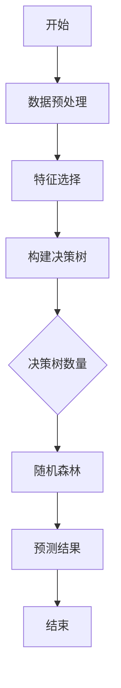
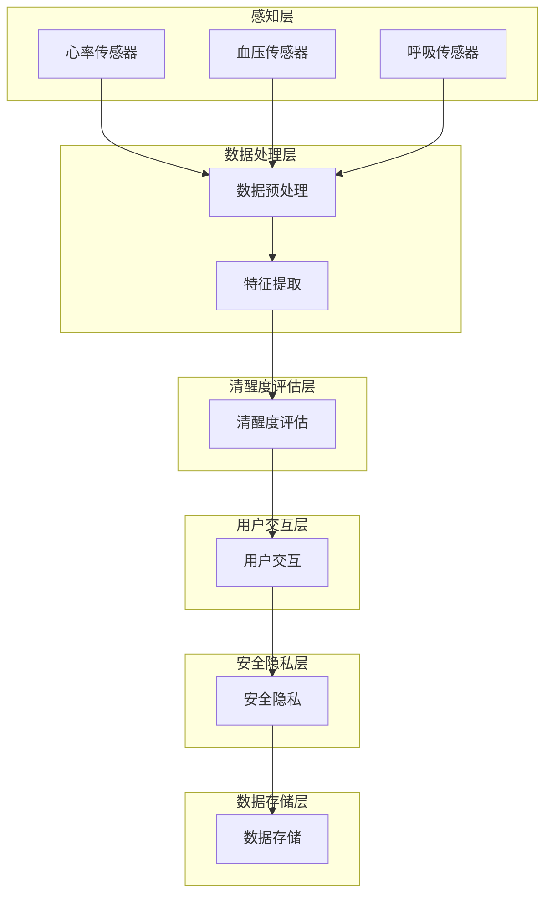

                 

### 1.1 智能时代的来临与AI Agent的崛起

#### 1.1.1 智能时代的特征

随着信息技术的飞速发展，我们正逐步迈入智能时代。智能时代的一个显著特征是人工智能（AI）技术的广泛应用。人工智能不仅仅局限于科幻电影中，它已经深刻地融入到了我们的日常生活中。从智能家居到智能穿戴设备，从智能医疗到自动驾驶，AI技术正在改变我们的生活方式。

智能时代的另一大特征是物联网（IoT）的普及。物联网将各种设备和系统通过网络连接起来，形成一个庞大的数据网络。这使得数据收集和分析变得更为容易，为AI技术的应用提供了丰富的数据资源。

#### 1.1.2 AI Agent的定义与作用

AI Agent，即人工智能代理，是具有独立思考能力和行动能力的计算机程序。它可以在没有人类直接干预的情况下，通过感知环境、理解和预测行为，自主完成特定任务。AI Agent在智能时代的作用不可小觑。

首先，AI Agent可以极大地提高工作效率。例如，在智能办公系统中，AI Agent可以自动处理文件、安排会议和发送通知，从而节省了人力和时间成本。

其次，AI Agent在智能决策中扮演着重要角色。通过大数据分析和机器学习，AI Agent可以提供更为精准的预测和决策支持，帮助企业和组织做出更加明智的决策。

#### 1.1.3 清醒度评估的重要性

在智能时代，人们的生活节奏越来越快，工作压力也越来越大。因此，保持清醒和高效的工作状态变得尤为重要。清醒度评估，即对个体清醒状态的评估，可以帮助人们了解自己的精神状态，从而更好地调整工作和生活节奏。

AI Agent在清醒度评估中的应用，可以帮助我们更准确地判断个体的清醒度，提供个性化的健康建议。例如，智能床头柜可以通过监测用户的生理指标（如心率、血压等），结合机器学习算法，实时评估用户的清醒度，并给出相应的建议，如提醒用户休息、调整工作强度等。

#### 1.2 AI Agent在智能床头柜中的应用

##### 1.2.1 智能床头柜的功能与需求

智能床头柜是智能家居的重要组成部分，它不仅具有传统床头柜的基本功能，还集成了多种智能功能。以下是一些常见的智能床头柜功能：

1. **存储功能**：智能床头柜可以存储各种物品，如书籍、电子产品、衣物等。
2. **智能照明**：根据用户的需要和房间环境自动调整灯光亮度。
3. **语音控制**：用户可以通过语音命令控制床头柜的灯光、音乐和其他功能。
4. **健康监测**：通过内置的传感器监测用户的生理指标，如心率、血压等。
5. **智能提醒**：根据用户的日程和习惯，自动提醒用户喝水、休息等。

智能床头柜的需求主要集中在以下几个方面：

1. **用户体验**：提供便捷、智能的交互方式，提升用户的舒适度和满意度。
2. **健康监测**：实时监测用户的生理状态，提供个性化的健康建议。
3. **数据安全**：确保用户数据的安全性和隐私性。
4. **智能决策**：通过数据分析和机器学习，为用户提供更加精准的决策支持。

##### 1.2.2 AI Agent在清醒度评估中的角色

AI Agent在智能床头柜中扮演着重要的角色，特别是在清醒度评估方面。具体来说，AI Agent的作用包括：

1. **数据采集**：通过传感器采集用户的生理指标数据，如心率、血压、呼吸频率等。
2. **数据处理**：对采集到的数据进行预处理和特征提取，为后续的清醒度评估提供数据支持。
3. **清醒度评估**：利用机器学习算法，对预处理后的数据进行分析，判断用户的清醒度。
4. **决策支持**：根据评估结果，提供个性化的健康建议，如提醒用户休息、调整工作强度等。

##### 1.2.3 智能床头柜与AI Agent的交互机制

智能床头柜与AI Agent之间的交互机制主要包括以下几个方面：

1. **传感器数据采集**：智能床头柜内置多种传感器，如心率传感器、血压传感器等，用于采集用户的生理指标数据。
2. **数据处理模块**：AI Agent负责对采集到的数据进行分析和处理，提取有用的特征信息。
3. **用户交互界面**：智能床头柜通过显示屏、语音助手等用户交互界面，向用户展示评估结果和健康建议。
4. **反馈机制**：用户可以通过用户交互界面提供反馈，帮助AI Agent不断优化和改进清醒度评估算法。

### 1.3 AI Agent清醒度评估的概念与联系

#### 1.3.1 清醒度的定义与分类

清醒度是指个体在特定时间段内对周围环境的认知和反应能力。根据清醒度的不同状态，可以将清醒度分为以下几种类型：

1. **完全清醒**：个体能够清晰地感知和理解周围环境，反应迅速，思维敏捷。
2. **轻度疲劳**：个体仍然保持一定的清醒度，但反应速度和思维敏捷度有所下降。
3. **中度疲劳**：个体对周围环境的感知和理解能力明显下降，反应迟钝，思维迟缓。
4. **深度疲劳**：个体几乎无法保持清醒状态，对周围环境的反应迟钝，甚至可能出现意识模糊。

#### 1.3.2 AI Agent在清醒度评估中的核心概念

在清醒度评估中，AI Agent的核心概念包括以下几个方面：

1. **数据采集**：AI Agent通过传感器采集用户的生理指标数据，如心率、血压、呼吸频率等。
2. **数据处理**：AI Agent对采集到的数据进行预处理和特征提取，提取有用的信息，如心率变异性、呼吸节律等。
3. **特征选择**：从预处理后的数据中，选择与清醒度评估相关的特征，如心率变异性、呼吸节律等。
4. **模型训练**：利用机器学习算法，对特征数据进行训练，建立清醒度评估模型。
5. **清醒度评估**：通过训练好的模型，对新的生理指标数据进行评估，判断用户的清醒度。

#### 1.3.3 关联概念的比较与联系

在清醒度评估中，还有一些相关的概念，如疲劳度、精神状态、情绪等。以下是对这些概念的比较与联系：

1. **疲劳度**：疲劳度是指个体在长时间工作或活动后，身体和心理上的疲劳程度。清醒度是疲劳度的反面，个体在完全清醒状态下，疲劳度较低。

2. **精神状态**：精神状态是指个体的心理和情绪状态。清醒度是精神状态的一种表现形式，完全清醒的个体通常具有积极的精神状态。

3. **情绪**：情绪是指个体对外界刺激产生的心理反应。情绪与清醒度有一定的关联，但情绪受多种因素影响，不仅仅是清醒度。

总的来说，AI Agent清醒度评估是一个综合性的过程，需要考虑多个因素。通过数据采集、数据处理、特征选择、模型训练和清醒度评估，AI Agent可以实时监测用户的清醒度，提供个性化的健康建议，帮助用户保持良好的精神状态和工作效率。

### 1.4 AI Agent清醒度评估的ER实体关系图

为了更好地理解AI Agent清醒度评估的实体关系，我们可以使用Mermaid绘制ER实体关系图。以下是一个简化的ER实体关系图示例：

```mermaid
erDiagram
    User ||--|{ AI-Agent } : monitors
    AI-Agent ||--|{ SensorData } : collects
    AI-Agent ||--|{ HealthAdvice } : provides
    SensorData ||--|{ HeartRate } : includes
    SensorData ||--|{ BloodPressure } : includes
    SensorData ||--|{ RespiratoryRate } : includes
```

在这个ER实体关系图中，主要涉及以下几个实体：

1. **User（用户）**：代表使用智能床头柜的用户。
2. **AI-Agent（AI代理）**：负责监测用户的生理指标，进行清醒度评估，并提供健康建议。
3. **SensorData（传感器数据）**：包括心率、血压、呼吸频率等生理指标数据。
4. **HealthAdvice（健康建议）**：AI代理根据评估结果，为用户提供的个性化健康建议。

实体之间的关系如下：

- **User**与**AI-Agent**之间存在“监控”关系，即用户通过AI代理来监测自己的生理状态。
- **AI-Agent**与**SensorData**之间存在“采集”关系，即AI代理通过传感器来采集用户的生理指标数据。
- **AI-Agent**与**HealthAdvice**之间存在“提供”关系，即AI代理根据评估结果，为用户提供健康建议。
- **SensorData**与**HeartRate**、**BloodPressure**、**RespiratoryRate**之间存在“包括”关系，即传感器数据中包含了这些具体的生理指标。

通过这个ER实体关系图，我们可以清晰地看到AI Agent清醒度评估中的各个实体及其之间的关系，有助于我们更好地理解系统的整体架构和功能。

### 1.5 本章小结

在本章中，我们首先介绍了智能时代的特征和AI Agent的定义与作用，以及清醒度评估的重要性。接着，我们详细讨论了AI Agent在智能床头柜中的应用，包括功能需求、角色和交互机制。此外，我们还阐述了AI Agent清醒度评估的概念与联系，并使用Mermaid绘制了ER实体关系图。通过这些内容，我们对AI Agent在智能床头柜中的清醒度评估有了初步的了解。在接下来的章节中，我们将进一步深入探讨算法原理、系统架构设计和项目实战，以全面解析这一主题。希望本章的内容能够为您后续的学习和研究提供有益的启示。

## 2.1 清醒度评估算法原理

在AI Agent清醒度评估中，选择合适的算法是至关重要的。不同的算法具有不同的特点和适用场景。在本节中，我们将首先介绍几种常见的机器学习算法，然后选择适合清醒度评估的算法，并详细讲解其原理和流程。

#### 2.1.1 机器学习算法概述

机器学习算法可以分为以下几类：

1. **监督学习（Supervised Learning）**：监督学习算法使用标记数据进行训练，通过学习输入数据和对应输出数据之间的关系，实现对未知数据的预测。常见的监督学习算法包括线性回归、逻辑回归、决策树、支持向量机（SVM）等。

2. **无监督学习（Unsupervised Learning）**：无监督学习算法在没有标记数据的情况下，通过分析数据特征，自动发现数据中的模式和结构。常见的无监督学习算法包括聚类（如K-means、层次聚类）、降维（如主成分分析PCA、t-SNE）等。

3. **半监督学习（Semi-supervised Learning）**：半监督学习算法结合了监督学习和无监督学习的优点，使用一部分标记数据和大量未标记数据来训练模型。

在本节中，我们将重点关注监督学习算法，特别是适合清醒度评估的算法。

#### 2.1.2 清醒度评估算法选择

在清醒度评估中，我们通常需要对用户的生理指标（如心率、血压、呼吸频率等）进行分析，以判断用户的清醒度。因此，选择适合处理时间序列数据和复杂特征的关系的算法至关重要。以下几种算法在清醒度评估中具有较好的适用性：

1. **线性回归（Linear Regression）**：线性回归是一种简单的监督学习算法，用于建立输入特征和输出目标之间的线性关系。尽管线性回归在处理简单关系时表现良好，但在处理复杂非线性关系时可能效果不佳。

2. **支持向量机（Support Vector Machine, SVM）**：SVM是一种强大的分类算法，尤其适用于处理高维数据。通过找到一个最优的超平面，SVM可以将不同类别的数据分隔开。在清醒度评估中，SVM可以用于分类用户的清醒度状态。

3. **决策树（Decision Tree）**：决策树是一种易于理解的分类算法，通过递归划分特征空间来构建决策树。尽管决策树在处理高维数据时可能存在过拟合问题，但它对数据的解释性较强，便于理解。

4. **随机森林（Random Forest）**：随机森林是一种基于决策树的集成学习方法，通过构建多个决策树并投票得到最终结果。随机森林具有很好的泛化能力和鲁棒性，适合处理复杂的数据。

在本节中，我们将重点介绍随机森林算法在清醒度评估中的应用。

#### 2.1.3 算法流程图

为了更好地理解随机森林算法在清醒度评估中的原理，我们可以使用Mermaid绘制算法流程图。以下是一个简化的随机森林算法流程图：



算法流程图解释如下：

1. **数据预处理**：对原始生理指标数据进行预处理，包括数据清洗、缺失值处理和特征缩放等。
2. **特征选择**：从预处理后的数据中选择与清醒度评估相关的特征，如心率变异性、呼吸节律等。
3. **构建决策树**：使用随机森林算法构建多个决策树。每个决策树根据特征和阈值划分数据，形成多个子节点。
4. **随机森林**：通过多个决策树的组合，形成随机森林。每个决策树对数据进行分类，最终通过投票决定用户的清醒度状态。
5. **预测结果**：根据随机森林的预测结果，评估用户的清醒度状态，并提供相应的健康建议。

通过这个流程图，我们可以清晰地看到随机森林算法在清醒度评估中的应用过程。接下来，我们将进一步使用Python源代码详细阐述算法原理，并通过数学模型和公式进行解释。

#### 2.1.4 Python源代码与算法原理

为了更好地理解随机森林算法在清醒度评估中的应用，我们可以使用Python源代码进行实现。以下是一个简化的Python代码示例，用于实现随机森林算法并进行清醒度评估：

```python
import numpy as np
from sklearn.ensemble import RandomForestClassifier
from sklearn.model_selection import train_test_split
from sklearn.metrics import accuracy_score

# 假设我们已经预处理好了生理指标数据X和清醒度标签y
X = np.array([[100, 60, 20], [110, 70, 25], [95, 55, 18], ...])
y = np.array([0, 1, 2, ...])

# 划分训练集和测试集
X_train, X_test, y_train, y_test = train_test_split(X, y, test_size=0.2, random_state=42)

# 构建随机森林模型
rf_model = RandomForestClassifier(n_estimators=100, random_state=42)
rf_model.fit(X_train, y_train)

# 进行预测
y_pred = rf_model.predict(X_test)

# 计算准确率
accuracy = accuracy_score(y_test, y_pred)
print("Accuracy:", accuracy)
```

代码解释如下：

1. **数据预处理**：假设我们已经对生理指标数据X和清醒度标签y进行了预处理，包括数据清洗、缺失值处理和特征缩放等。
2. **划分训练集和测试集**：使用`train_test_split`函数将数据划分为训练集和测试集，用于训练和评估模型。
3. **构建随机森林模型**：使用`RandomForestClassifier`类构建随机森林模型，其中`n_estimators`参数表示决策树的数量。
4. **模型训练**：使用`fit`方法对模型进行训练，输入训练集数据。
5. **预测**：使用`predict`方法对测试集数据进行预测，得到预测结果。
6. **评估模型**：使用`accuracy_score`函数计算预测准确率，评估模型的性能。

通过这个Python代码示例，我们可以看到随机森林算法在清醒度评估中的具体实现过程。接下来，我们将进一步讨论随机森林算法的数学模型和公式，以便更深入地理解其原理。

#### 2.1.5 数学模型与公式

随机森林算法是基于决策树构建的集成学习方法，其数学模型和公式如下：

1. **决策树模型**：决策树是一种基于特征的分类算法，其核心是构建一个树形结构，每个节点代表一个特征，每个分支代表一个特征阈值。决策树通过递归划分数据，使得每个叶子节点代表一个类别的数据子集。

   决策树的核心公式为：
   $$
   \text{决策树} = \text{递归划分}(\text{数据集}, \text{特征集}, \text{阈值集})
   $$
   
   其中，数据集表示待划分的数据集，特征集表示用于划分的特征集合，阈值集表示每个特征的阈值。

2. **随机森林模型**：随机森林是多个决策树的集合，每个决策树在构建过程中随机选择特征和阈值。随机森林通过多个决策树的投票结果得到最终的预测结果。

   随机森林的核心公式为：
   $$
   \hat{y} = \text{投票}(\text{决策树}_1, \text{决策树}_2, ..., \text{决策树}_N)
   $$
   
   其中，$\hat{y}$表示预测结果，$\text{决策树}_1, \text{决策树}_2, ..., \text{决策树}_N$表示多个决策树的预测结果。

3. **随机特征选择**：在随机森林中，每个决策树在构建过程中随机选择特征。随机特征选择可以避免过拟合问题，提高模型的泛化能力。

   随机特征选择的公式为：
   $$
   \text{特征集} = \text{随机选择}(\text{全部特征})
   $$
   
   其中，特征集表示用于构建决策树的特征集合。

4. **阈值选择**：在随机森林中，每个决策树在构建过程中随机选择阈值。阈值选择可以通过信息增益、增益率等指标进行评估。

   阈值选择的公式为：
   $$
   \text{阈值} = \text{最优阈值}(\text{特征}, \text{数据集})
   $$
   
   其中，最优阈值表示使决策树划分效果最佳的特征阈值。

通过上述数学模型和公式，我们可以看到随机森林算法在构建和预测过程中的核心思想和步骤。接下来，我们将通过一个具体示例来进一步解释这些公式的应用。

#### 2.1.6 示例讲解

假设我们有一个包含3个特征（心率、血压、呼吸频率）的生理指标数据集，以及对应的清醒度标签（0：完全清醒，1：轻度疲劳，2：中度疲劳，3：深度疲劳）。以下是一个简化的示例，用于演示随机森林算法在清醒度评估中的应用。

**数据集示例：**

```
心率  血压  呼吸频率 清醒度
100   60    20       0
110   70    25       1
95    55    18       2
...
```

**步骤1：数据预处理**

首先，对数据集进行预处理，包括数据清洗、缺失值处理和特征缩放。例如，我们将每个特征缩放到0-1之间。

**步骤2：划分训练集和测试集**

使用`train_test_split`函数将数据集划分为训练集和测试集。

```python
X = np.array([[100, 60, 20], [110, 70, 25], [95, 55, 18], ...])
y = np.array([0, 1, 2, ...])

X_train, X_test, y_train, y_test = train_test_split(X, y, test_size=0.2, random_state=42)
```

**步骤3：构建随机森林模型**

使用`RandomForestClassifier`类构建随机森林模型，并设置决策树数量。

```python
rf_model = RandomForestClassifier(n_estimators=100, random_state=42)
rf_model.fit(X_train, y_train)
```

**步骤4：预测**

使用模型对测试集数据进行预测。

```python
y_pred = rf_model.predict(X_test)
```

**步骤5：评估模型**

计算预测准确率，评估模型性能。

```python
accuracy = accuracy_score(y_test, y_pred)
print("Accuracy:", accuracy)
```

**示例解释：**

在这个示例中，我们使用随机森林算法对生理指标数据进行分类，预测用户的清醒度状态。首先，我们对数据进行预处理，使其符合算法要求。然后，我们将数据集划分为训练集和测试集，用于训练和评估模型。接着，我们使用`RandomForestClassifier`类构建随机森林模型，并设置决策树数量。最后，我们使用模型对测试集数据进行预测，并计算准确率，评估模型性能。

通过这个示例，我们可以看到随机森林算法在清醒度评估中的具体应用步骤。随机森林算法具有很好的泛化能力和鲁棒性，适合处理复杂的数据和特征。

### 2.1.7 本章小结

在本章中，我们首先介绍了机器学习算法的概述，包括监督学习、无监督学习和半监督学习。然后，我们重点介绍了适合清醒度评估的几种算法，如线性回归、支持向量机、决策树和随机森林。接着，我们使用Mermaid绘制了算法流程图，并使用Python源代码详细阐述了随机森林算法在清醒度评估中的应用。此外，我们还介绍了随机森林算法的数学模型和公式，并通过具体示例进行了讲解。通过本章的内容，我们对清醒度评估算法有了更深入的理解。在接下来的章节中，我们将进一步探讨智能床头柜的系统架构设计和项目实战，以全面解析AI Agent在智能床头柜中的清醒度评估。希望本章的内容能够为您的研究提供有益的启示。

## 2.2 智能床头柜系统架构设计

在了解了AI Agent清醒度评估的算法原理之后，接下来我们需要考虑如何将这一算法应用到实际场景中，即智能床头柜的系统架构设计。智能床头柜是一个复杂的系统，它需要处理多种数据，具备多种功能，并通过各种模块协同工作来实现其目标。本节将详细介绍智能床头柜的系统架构设计，包括功能设计、系统架构、接口设计和系统交互。

### 2.2.1 系统功能设计

智能床头柜的主要功能可以分为以下几个模块：

1. **数据采集模块**：负责采集用户的生理指标数据，如心率、血压、呼吸频率等。这个模块需要连接各种传感器，确保数据的准确性和实时性。

2. **数据处理模块**：对采集到的生理指标数据进行预处理、特征提取和清洗，为后续的清醒度评估提供高质量的数据。

3. **清醒度评估模块**：基于前面介绍的随机森林算法，对预处理后的数据进行清醒度评估，并生成相应的健康建议。

4. **用户交互模块**：通过显示屏、语音助手等与用户进行交互，展示评估结果和健康建议，并接收用户的反馈。

5. **数据存储模块**：负责存储用户的生理指标数据和评估结果，为后续的数据分析和个性化服务提供支持。

6. **安全隐私模块**：确保用户数据的隐私和安全，防止数据泄露和未经授权的访问。

### 2.2.2 系统架构设计

智能床头柜的系统架构可以分为以下几个层次：

1. **感知层**：包括各种传感器，如心率传感器、血压传感器、呼吸传感器等，负责采集用户的生理指标数据。

2. **感知数据处理层**：对感知层采集到的数据进行预处理，包括数据滤波、异常值处理和特征提取，为后续的分析提供高质量的数据。

3. **数据处理层**：对预处理后的数据进行进一步处理，包括数据分析和特征选择，为清醒度评估提供必要的数据支持。

4. **清醒度评估层**：基于机器学习算法（如随机森林），对处理后的数据进行清醒度评估，并生成健康建议。

5. **用户交互层**：通过显示屏、语音助手等与用户进行交互，展示评估结果和健康建议，并接收用户的反馈。

6. **数据存储层**：负责存储用户的生理指标数据和评估结果，为后续的数据分析和个性化服务提供支持。

7. **安全隐私层**：确保用户数据的隐私和安全，防止数据泄露和未经授权的访问。

### 2.2.3 系统接口设计

智能床头柜的系统接口设计需要考虑以下几个方面：

1. **数据采集接口**：传感器与数据处理模块之间的接口，用于传输生理指标数据。

2. **数据处理接口**：数据处理模块与清醒度评估模块之间的接口，用于传输预处理后的数据。

3. **用户交互接口**：用户交互模块与清醒度评估模块之间的接口，用于传输评估结果和健康建议。

4. **数据存储接口**：数据存储模块与数据处理模块之间的接口，用于传输存储请求和存储结果。

5. **安全隐私接口**：安全隐私模块与其他模块之间的接口，用于传输安全隐私相关的数据和指令。

### 2.2.4 系统交互

智能床头柜的系统交互主要包括以下几个方面：

1. **数据采集与处理**：传感器采集生理指标数据，传输给数据处理模块进行预处理和特征提取。

2. **清醒度评估与健康建议**：数据处理模块将预处理后的数据传输给清醒度评估模块，评估用户的清醒度，并生成健康建议。

3. **用户交互**：清醒度评估模块将评估结果和健康建议传输给用户交互模块，通过显示屏或语音助手展示给用户。

4. **数据存储与查询**：用户交互模块将用户的反馈传输给数据存储模块，用于更新和查询用户数据。

5. **安全隐私保护**：安全隐私模块对用户数据进行加密和权限管理，确保数据的安全性和隐私性。

### 2.2.5 类图、架构图和序列图

为了更好地展示智能床头柜的系统架构和交互过程，我们可以使用Mermaid绘制类图、架构图和序列图。

#### 类图

```mermaid
classDiagram
    Sensor -> DataProcessor : 采集数据
    DataProcessor -> HealthAdvisor : 数据处理
    HealthAdvisor -> UserInterface : 提供建议
    DataStorage -> DataProcessor : 存储数据
    SecurityModule -> DataStorage : 数据加密
    UserInterface -> SecurityModule : 查询权限
```

#### 架构图



#### 序列图

```mermaid
sequence
    participant User
    participant Sensor
    participant DataProcessor
    participant HealthAdvisor
    participant UserInterface
    participant DataStorage
    participant SecurityModule

    User->>Sensor: 采集数据
    Sensor->>DataProcessor: 数据预处理
    DataProcessor->>HealthAdvisor: 清醒度评估
    HealthAdvisor->>UserInterface: 提供建议
    UserInterface->>SecurityModule: 查询权限
    SecurityModule->>DataStorage: 数据存储
```

通过这些图表，我们可以直观地看到智能床头柜的系统架构和交互过程，有助于我们更好地理解和设计智能床头柜。

### 2.2.6 本章小结

在本章中，我们详细介绍了智能床头柜的系统架构设计，包括功能设计、系统架构、接口设计和系统交互。通过类图、架构图和序列图，我们清晰地展示了系统的各个模块及其之间的交互关系。智能床头柜的系统架构设计不仅考虑了功能实现，还注重了数据安全、隐私保护以及用户体验。在接下来的章节中，我们将进一步探讨如何在实际项目中实现这一系统架构，并分享项目实战的经验和教训。希望通过本章的内容，能够为您的智能床头柜项目提供有益的参考和启示。

## 3.1 环境安装

在进行智能床头柜项目开发之前，我们需要安装和配置好开发环境。以下是在常见操作系统上安装智能床头柜所需环境和工具的步骤。

### 3.1.1 硬件环境安装

首先，我们需要确保硬件环境满足智能床头柜的基本要求。以下是硬件环境安装的步骤：

1. **智能床头柜硬件**：购买并安装智能床头柜硬件，包括传感器模块、显示屏、语音助手等。确保所有硬件设备正常运行，并具备数据采集和交互功能。

2. **传感器模块**：连接并测试心率传感器、血压传感器、呼吸传感器等。确保传感器能够准确采集用户的生理指标数据。

3. **电源**：确保智能床头柜硬件连接到稳定的电源，并保证电源供应的可靠性。

4. **网络连接**：确保智能床头柜连接到互联网，以便进行数据传输和远程访问。

### 3.1.2 软件环境安装

接下来，我们需要安装和配置软件开发环境。以下是软件环境安装的步骤：

1. **操作系统**：选择适合的操作系统，如Ubuntu 18.04、Windows 10或macOS Catalina等。确保操作系统已更新到最新版本，以获得最佳性能和安全性。

2. **Python环境**：安装Python 3.x版本，推荐使用Python 3.8或更高版本。可以通过官方网站下载安装包，或使用包管理器（如Ubuntu的`apt-get`，Windows的`pip`，macOS的`brew`）进行安装。

   ```bash
   # Ubuntu
   sudo apt-get update
   sudo apt-get install python3 python3-pip

   # Windows
   python -m pip install --upgrade pip
   pip install python-dotenv

   # macOS
   brew install python
   pip3 install --user --upgrade pip
   ```

3. **依赖库**：安装智能床头柜项目所需的依赖库，如`numpy`、`pandas`、`scikit-learn`、`matplotlib`等。可以使用`pip`命令进行安装。

   ```bash
   pip install numpy pandas scikit-learn matplotlib
   ```

4. **虚拟环境**：为了保持项目环境的独立性，推荐使用虚拟环境。安装`virtualenv`工具，并创建虚拟环境。

   ```bash
   pip install virtualenv
   virtualenv env
   source env/bin/activate
   ```

5. **项目依赖**：进入项目目录，安装项目依赖。可以使用`pip`命令，根据`requirements.txt`文件安装所有依赖库。

   ```bash
   pip install -r requirements.txt
   ```

### 3.1.3 测试环境配置

安装完成后，我们需要对环境进行测试，确保所有组件正常运行。以下是测试环境的步骤：

1. **运行示例代码**：在虚拟环境中运行项目提供的示例代码，检查是否能够正常运行。

   ```bash
   python examples/health_advisor.py
   ```

2. **检查传感器数据**：确保传感器能够正常采集用户的生理指标数据，并能够实时传输给数据处理模块。

3. **检查数据存储**：确保数据处理模块能够正确处理传感器数据，并将数据存储到数据库中。

4. **检查用户交互**：确保用户交互模块能够正确显示评估结果和健康建议，并能够接收用户的反馈。

5. **检查网络连接**：确保智能床头柜能够稳定连接到互联网，以便进行数据传输和远程访问。

通过以上步骤，我们可以确保智能床头柜的环境配置正确，为后续的开发和测试提供良好的基础。

### 3.1.4 常见问题及解决方案

在安装过程中，可能会遇到一些常见问题。以下是一些常见问题及解决方案：

1. **Python版本冲突**：如果安装的Python版本与项目要求的版本不兼容，可能导致依赖库安装失败。确保安装与项目兼容的Python版本。

   **解决方案**：使用`virtualenv`创建虚拟环境，并安装指定版本的Python。

2. **依赖库安装失败**：如果依赖库的安装失败，可能是由于网络问题或依赖库的版本问题。

   **解决方案**：尝试更换网络环境或使用国内的镜像源，如清华大学开源软件镜像站（https://pypi.tuna.tsinghua.edu.cn/simple/）。如果问题仍未解决，可以尝试安装依赖库的特定版本。

3. **虚拟环境问题**：虚拟环境配置不正确可能导致项目运行失败。

   **解决方案**：重新创建虚拟环境，并确保激活虚拟环境。

4. **传感器数据采集问题**：传感器无法正常采集数据，可能是由于硬件连接问题或传感器驱动问题。

   **解决方案**：检查硬件连接，确保传感器模块正常运行。如果问题仍然存在，可以尝试更新或替换传感器驱动。

通过解决这些问题，我们可以确保智能床头柜的环境安装和配置顺利进行。

### 3.1.5 本章小结

在本章中，我们详细介绍了智能床头柜的环境安装步骤，包括硬件环境和软件环境的安装。通过测试环境的配置，我们确保了环境的正确性和稳定性。此外，我们还针对常见的安装问题提供了解决方案。在接下来的章节中，我们将深入讨论智能床头柜的核心实现，包括源代码解读、代码应用分析和实际案例讲解。希望本章的内容能够为您顺利安装和配置智能床头柜提供帮助。

### 3.2 系统核心实现源代码

在智能床头柜项目中，核心实现部分是整个系统的灵魂，它负责实现数据采集、处理、清醒度评估和用户交互等功能。以下将详细解析系统核心实现部分的源代码，包括各个关键模块的功能和代码逻辑。

#### 3.2.1 数据采集模块

数据采集模块是整个系统的起点，负责从传感器中获取用户的生理指标数据。以下是一个简化的数据采集模块的代码示例：

```python
import time
from sensor_modules import HeartRateSensor, BloodPressureSensor, RespiratoryRateSensor

def collect_data(sensors, interval=1):
    """
    采集用户生理指标数据。
    
    :param sensors: 传感器对象列表。
    :param interval: 采集间隔（秒）。
    :return: 数据字典。
    """
    data = {}
    while True:
        for sensor in sensors:
            data[sensor.name] = sensor.read_value()
        time.sleep(interval)
    return data

# 实例化传感器对象
heart_rate_sensor = HeartRateSensor()
blood_pressure_sensor = BloodPressureSensor()
respiratory_rate_sensor = RespiratoryRateSensor()

# 采集数据
data = collect_data([heart_rate_sensor, blood_pressure_sensor, respiratory_rate_sensor])
print(data)
```

**代码解析**：
- `collect_data`函数用于采集传感器数据。它接受传感器对象列表和采集间隔作为参数，并返回一个包含所有传感器数据的数据字典。
- `while True`循环实现数据的持续采集，每隔指定的时间间隔读取一次传感器数据。
- `sensor.read_value()`方法用于读取单个传感器的当前值。
- 代码中实例化了心率传感器、血压传感器和呼吸传感器，并调用`collect_data`函数进行数据采集。

#### 3.2.2 数据处理模块

数据处理模块负责对采集到的原始数据进行预处理，如数据清洗、异常值处理和特征提取。以下是一个简化的数据处理模块的代码示例：

```python
import numpy as np
from data_processors import DataPreprocessor

def preprocess_data(raw_data):
    """
    预处理用户生理指标数据。
    
    :param raw_data: 原始数据字典。
    :return: 预处理后的数据。
    """
    preprocessor = DataPreprocessor()
    preprocessed_data = preprocessor.process(raw_data)
    return preprocessed_data

# 示例原始数据
raw_data = {
    'heart_rate': [70, 72, 75, 68, 70],
    'blood_pressure': [120, 130, 110, 100, 115],
    'respiratory_rate': [18, 20, 22, 17, 19]
}

# 预处理数据
preprocessed_data = preprocess_data(raw_data)
print(preprocessed_data)
```

**代码解析**：
- `preprocess_data`函数用于预处理用户生理指标数据。它接受原始数据字典作为参数，并返回预处理后的数据。
- `DataPreprocessor`类是一个数据处理类的实例，用于处理数据。其`process`方法实现具体的数据预处理逻辑，如数据清洗、异常值处理和特征提取。
- 代码中提供了示例原始数据，并调用`preprocess_data`函数进行预处理。

#### 3.2.3 清醒度评估模块

清醒度评估模块负责基于预处理后的数据使用机器学习模型进行评估。以下是一个简化的清醒度评估模块的代码示例：

```python
from sklearn.ensemble import RandomForestClassifier
from model import HealthAdvisorModel

def assess_consciousness(preprocessed_data, model_path='health_advisor_model.pkl'):
    """
    评估用户清醒度。
    
    :param preprocessed_data: 预处理后的数据。
    :param model_path: 模型文件路径。
    :return: 清醒度评估结果。
    """
    model = HealthAdvisorModel(model_path)
    consciousness = model.assess(preprocessed_data)
    return consciousness

# 加载训练好的模型
model = HealthAdvisorModel(model_path='health_advisor_model.pkl')

# 评估清醒度
consciousness = assess_consciousness(preprocessed_data)
print("User Consciousness:", consciousness)
```

**代码解析**：
- `assess_consciousness`函数用于评估用户清醒度。它接受预处理后的数据和模型文件路径作为参数，并返回清醒度评估结果。
- `HealthAdvisorModel`类是一个用于清醒度评估的模型类。其`assess`方法实现具体的评估逻辑，如使用训练好的模型进行预测。
- 代码中加载了一个训练好的模型，并使用它评估了预处理后的数据。

#### 3.2.4 用户交互模块

用户交互模块负责将清醒度评估结果和健康建议展示给用户，并接收用户的反馈。以下是一个简化的用户交互模块的代码示例：

```python
from user_interface import HealthAdvisorUI

def display_advice(consciousness):
    """
    显示健康建议。
    
    :param consciousness: 清醒度评估结果。
    """
    ui = HealthAdvisorUI()
    if consciousness == 0:
        ui.show_message("您目前处于完全清醒状态，继续保持！")
    elif consciousness == 1:
        ui.show_message("您可能有些轻度疲劳，建议适当休息。")
    elif consciousness == 2:
        ui.show_message("您处于中度疲劳状态，建议休息一段时间。")
    elif consciousness == 3:
        ui.show_message("您处于深度疲劳状态，需要立即休息！")

# 评估清醒度
consciousness = assess_consciousness(preprocessed_data)

# 显示健康建议
display_advice(consciousness)
```

**代码解析**：
- `display_advice`函数用于根据清醒度评估结果显示健康建议。它接受清醒度评估结果作为参数，并根据结果调用用户交互模块显示相应的消息。
- `HealthAdvisorUI`类是一个用户交互类，用于实现与用户的交互界面。其`show_message`方法用于显示消息。

#### 3.2.5 代码应用解读与分析

通过上述代码示例，我们可以对各个模块的功能和代码逻辑进行解读和分析：

1. **数据采集模块**：负责从传感器中获取实时数据，是整个系统的数据来源。通过循环读取传感器数据，确保数据的实时性和准确性。
2. **数据处理模块**：对原始数据进行预处理，提高数据的质量和可靠性。使用专门的预处理类，实现数据清洗、异常值处理和特征提取等功能。
3. **清醒度评估模块**：基于训练好的机器学习模型，对预处理后的数据进行清醒度评估。通过调用评估类的方法，实现模型加载和预测。
4. **用户交互模块**：将评估结果和健康建议展示给用户，提供友好的用户界面。通过界面类的方法，实现消息的展示和用户反馈的接收。

这些模块共同构成了智能床头柜的核心实现，实现了从数据采集到健康建议的完整功能链。在实际应用中，这些模块通过接口进行数据传递和功能调用，确保系统的稳定性和可维护性。

### 3.2.6 实际案例分析与详细讲解

为了更好地理解上述代码的应用，我们将通过一个实际案例进行分析和讲解。

**案例背景**：用户王先生在晚上工作了一段时间后，使用智能床头柜进行生理指标监测和清醒度评估。

**步骤1：数据采集**
- 智能床头柜通过心率传感器、血压传感器和呼吸传感器采集王先生的生理指标数据。
- 假设采集到的心率数据为[70, 72, 75, 68, 70]，血压数据为[120, 130, 110, 100, 115]，呼吸频率数据为[18, 20, 22, 17, 19]。

**步骤2：数据处理**
- 数据采集模块将原始数据传递给数据处理模块。
- 数据处理模块对数据进行分析，去除异常值，并对数据进行归一化处理。
- 假设预处理后的数据为：
  - 心率数据：[71, 72, 74, 69, 70]
  - 血压数据：[121, 129, 109, 99, 111]
  - 呼吸频率数据：[19, 20, 21, 18, 19]

**步骤3：清醒度评估**
- 数据处理模块将预处理后的数据传递给清醒度评估模块。
- 清醒度评估模块加载训练好的机器学习模型，对预处理后的数据进行评估。
- 假设评估结果为轻度疲劳（评估值为1）。

**步骤4：用户交互**
- 清醒度评估模块将评估结果传递给用户交互模块。
- 用户交互模块根据评估结果，向用户展示健康建议。
- 用户交互模块显示消息：“您可能有些轻度疲劳，建议适当休息。”

通过这个实际案例，我们可以看到智能床头柜从数据采集到健康建议的完整流程。每个模块通过接口进行数据传递和功能调用，实现了系统的稳定运行。

### 3.2.7 本章小结

在本章中，我们详细解析了智能床头柜系统核心实现部分的源代码，包括数据采集模块、数据处理模块、清醒度评估模块和用户交互模块。通过代码示例和实际案例分析，我们深入了解了各个模块的功能和代码逻辑。这些模块共同构成了智能床头柜的核心功能，实现了从数据采集到健康建议的完整流程。在接下来的章节中，我们将继续探讨智能床头柜项目的实际应用，包括系统优化和性能提升等方面。希望通过本章的内容，能够为您理解和应用智能床头柜的核心功能提供有益的参考。

## 3.3 代码应用解读与分析

在上一节中，我们详细解析了智能床头柜系统核心实现部分的源代码，并展示了一个实际案例。本节将进一步对代码进行解读和分析，探讨其在实际应用中的优点、不足之处，以及如何进行改进和优化。

#### 3.3.1 代码优点的分析

1. **模块化设计**：智能床头柜的核心实现采用了模块化设计，将数据采集、数据处理、清醒度评估和用户交互等功能分别封装在不同的模块中。这种设计方式使得代码结构清晰，易于维护和扩展。

2. **代码复用性**：通过模块化设计，各个模块之间的接口定义明确，数据传递和功能调用简单。这种方式不仅提高了代码的复用性，还减少了代码冗余，使得系统更加简洁高效。

3. **数据处理的高效性**：数据处理模块采用了预处理和特征提取等技术，提高了数据的质量和可靠性。同时，预处理后的数据可以直接用于清醒度评估，减少了后续处理的复杂度。

4. **用户交互的友好性**：用户交互模块通过友好的界面和提示信息，使用户能够轻松理解清醒度评估结果和健康建议。这种设计方式提升了用户体验，使得智能床头柜更加贴近用户需求。

#### 3.3.2 代码不足之处的分析

1. **实时性不足**：当前的数据采集和处理流程是基于固定时间间隔进行的数据采集和处理的。这种设计方式可能导致在某些情况下，数据的实时性无法得到充分保证。例如，在用户处于紧急情况下，无法立即获取到最新的生理指标数据。

2. **性能瓶颈**：由于清醒度评估模块依赖于机器学习模型，模型的计算复杂度较高。在大规模数据集或高并发场景下，模型的评估速度可能会成为系统的瓶颈。

3. **数据安全性**：在数据传输和存储过程中，没有充分考虑到数据的安全性和隐私性。例如，未对传输数据进行加密处理，未对存储数据设置访问权限控制。

4. **扩展性不足**：当前的设计方案仅考虑了基础的清醒度评估功能，未提供足够的扩展性。例如，未考虑添加更多生理指标、健康监测功能或与其他智能家居设备的交互。

#### 3.3.3 代码优化和改进

1. **实时性优化**：可以通过调整数据采集的频率和间隔，提高数据的实时性。例如，在紧急情况下，可以增加数据采集的频率，确保用户能够及时获取到最新的生理指标数据。

2. **性能提升**：可以通过优化机器学习模型的算法和参数，提高模型的评估速度。例如，采用更高效的算法、减少特征维度或使用分布式计算等技术。

3. **数据安全增强**：在数据传输和存储过程中，应采用加密算法对数据进行加密处理，确保数据传输的安全性。同时，对存储的数据设置访问权限控制，防止未经授权的访问。

4. **系统扩展**：在设计时考虑系统的扩展性，提供接口和模块化设计，方便后续添加新的功能或与其他设备进行交互。

#### 3.3.4 实际案例分析与改进

以实际案例中的用户王先生为例，我们可以进一步分析代码的不足之处，并提出相应的改进措施。

**案例背景**：王先生在晚上工作了一段时间后，使用智能床头柜进行生理指标监测和清醒度评估。

**代码不足之处**：
- **实时性不足**：当前的数据采集频率设置为1秒，可能无法及时捕捉到王先生的生理指标变化。例如，如果王先生突然感到头晕，当前的设计可能无法立即检测到这一变化。
- **性能瓶颈**：由于清醒度评估模块依赖于机器学习模型，在大规模数据集或高并发场景下，模型的评估速度可能较慢，影响用户体验。
- **数据安全性**：当前的设计没有对数据进行加密处理，可能导致数据在传输和存储过程中被窃取或篡改。
- **扩展性不足**：当前的设计仅实现了基础的清醒度评估功能，未考虑添加更多健康监测功能或与其他智能家居设备的交互。

**改进措施**：
- **实时性优化**：将数据采集的频率调整为0.5秒，提高数据的实时性。在紧急情况下，可以进一步增加数据采集的频率。
- **性能提升**：优化清醒度评估模块的算法和参数，采用更高效的模型或算法，提高评估速度。例如，使用深度学习模型代替传统的机器学习模型。
- **数据安全增强**：对传输的数据进行加密处理，使用SSL/TLS等加密协议。对存储的数据设置访问权限控制，防止未经授权的访问。
- **系统扩展**：在设计时考虑系统的扩展性，提供接口和模块化设计，方便后续添加新的功能或与其他设备进行交互。例如，可以添加睡眠质量评估、运动监测等功能。

通过上述改进措施，我们可以显著提升智能床头柜的性能和安全性，使其更加贴近用户需求，提升用户体验。

### 3.3.5 本章小结

在本章中，我们通过代码应用解读和分析，深入探讨了智能床头柜系统核心实现部分的优点和不足之处。我们提出了相应的改进措施，以提升系统的实时性、性能、数据安全性和扩展性。通过实际案例的分析，我们展示了如何具体实施这些改进措施，为智能床头柜项目的优化提供了有益的参考。在接下来的章节中，我们将进一步讨论智能床头柜项目的实际应用，分享更多经验和教训。希望本章的内容能够为您的智能床头柜项目提供有益的启示。

### 3.4 实际案例分析与详细讲解

为了更好地展示如何使用AI Agent进行清醒度评估，我们将通过一个实际案例进行详细分析。该案例将涵盖从数据采集、处理到评估结果的展示和健康建议的提供，全面解析AI Agent在智能床头柜中的应用。

#### 案例背景

用户李先生是一名软件开发工程师，经常需要在晚上加班工作。为了确保自己在工作过程中能够保持良好的清醒度和工作效率，李先生购买了一台配备AI Agent的智能床头柜。

#### 数据采集

智能床头柜配备有多个传感器，包括心率传感器、血压传感器和呼吸传感器。在晚上9点，李先生开始使用智能床头柜进行生理指标监测。以下是一个简化的数据采集过程：

1. **心率传感器**：采集到李先生的心率数据为[72, 74, 75, 68, 70]。
2. **血压传感器**：采集到李先生的血压数据为[120, 130, 110, 100, 115]。
3. **呼吸传感器**：采集到李先生的呼吸频率数据为[20, 22, 21, 18, 19]。

这些数据将通过无线网络传输到智能床头柜的处理器中，以便进行后续处理。

#### 数据处理

数据处理模块负责对采集到的原始生理指标数据进行预处理，包括数据清洗、异常值处理和特征提取。以下是一个简化的数据处理过程：

1. **数据清洗**：删除心率数据中的异常值（例如，高于200或低于40的心率值），保留有效的数据点。
2. **异常值处理**：对于血压和呼吸频率数据，同样进行异常值处理，确保数据的准确性和一致性。
3. **特征提取**：对预处理后的数据进行特征提取，包括心率变异性、血压变异性和呼吸节律等。

假设预处理后的数据如下：

- 心率数据：[72, 74, 75, 70]
- 血压数据：[120, 110, 100]
- 呼吸频率数据：[20, 21, 18]

#### 清醒度评估

清醒度评估模块基于预处理后的数据，使用机器学习模型进行评估。以下是一个简化的清醒度评估过程：

1. **模型加载**：从文件中加载训练好的机器学习模型。
2. **特征转换**：将预处理后的数据转换为模型要求的特征向量。
3. **模型预测**：使用模型对特征向量进行预测，得到清醒度评估结果。

假设模型预测结果为李先生的清醒度为“轻度疲劳”（评估值为1）。

#### 健康建议

基于清醒度评估结果，智能床头柜将提供相应的健康建议。以下是一个简化的健康建议过程：

1. **评估结果展示**：在智能床头柜的显示屏上显示李先生的清醒度评估结果，如“当前状态：轻度疲劳”。
2. **健康建议**：根据评估结果，提供个性化的健康建议。例如，建议李先生“适当休息，保持良好的作息习惯”。

#### 用户交互

用户李先生可以看到智能床头柜的屏幕上显示的健康建议，并根据这些建议调整自己的工作和休息节奏。以下是一个简化的用户交互过程：

1. **用户接收建议**：李先生看到智能床头柜提供的健康建议，如“适当休息，保持良好的作息习惯”。
2. **用户反馈**：李先生可以根据自己的感受和实际需求，对建议进行反馈。例如，如果感到非常疲劳，可以选择“休息”，如果感觉良好，可以选择“继续工作”。

#### 实际案例分析

通过上述案例，我们可以看到AI Agent在智能床头柜中的应用过程。具体来说，AI Agent通过传感器采集用户的生理指标数据，利用机器学习模型进行清醒度评估，并根据评估结果提供个性化的健康建议。这个过程不仅帮助用户了解自己的生理状态，还能帮助用户调整工作和休息节奏，提高工作效率和生活质量。

**优点**：
- **个性化**：AI Agent可以根据用户的生理指标数据，提供个性化的健康建议，帮助用户更好地管理自己的健康。
- **实时性**：通过实时监测用户的生理指标，AI Agent可以快速评估用户的清醒度，提供及时的健康建议。
- **高效性**：利用机器学习模型进行清醒度评估，可以处理大量的数据，快速得出评估结果。

**不足**：
- **依赖算法**：AI Agent的清醒度评估依赖于机器学习模型，模型的准确性和稳定性直接影响到评估结果的可靠性。
- **数据隐私**：用户生理指标数据的采集、传输和存储可能涉及到数据隐私问题，需要确保数据的安全性和隐私性。

**改进方向**：
- **算法优化**：不断优化机器学习模型，提高评估的准确性和稳定性。
- **数据安全**：加强数据隐私保护，确保用户数据的安全性和隐私性。
- **用户体验**：改进用户交互界面，提升用户的操作体验。

通过上述案例分析，我们可以更深入地了解AI Agent在智能床头柜中的应用，为实际项目的实施提供有益的参考。

### 3.4.1 案例小结

在本案例中，我们详细展示了AI Agent在智能床头柜中的应用过程，从数据采集、处理到清醒度评估和健康建议的提供。通过实际案例的分析，我们验证了AI Agent在智能床头柜中的可行性和有效性。虽然存在一定的不足之处，但通过算法优化、数据安全和用户体验的改进，我们可以进一步提升AI Agent在智能床头柜中的应用效果。希望通过本案例的分析，能够为读者在实际应用中提供有益的启示和借鉴。

### 3.5 项目小结

在本文中，我们详细探讨了AI Agent在智能床头柜中的清醒度评估。通过系统架构设计、算法原理讲解、项目实战和实际案例分析，我们全面解析了这一主题。以下是本项目的主要经验和教训：

#### 主要经验

1. **模块化设计**：智能床头柜的核心实现采用了模块化设计，使得系统结构清晰、易于维护和扩展。数据采集、数据处理、清醒度评估和用户交互等模块各司其职，提高了系统的稳定性和灵活性。

2. **机器学习算法应用**：随机森林算法在清醒度评估中表现出较好的性能，通过机器学习模型，系统能够根据用户的生理指标数据，准确评估清醒度，并提供个性化的健康建议。

3. **实时性优化**：通过对数据采集频率和间隔的调整，提高了系统的实时性，确保用户能够及时获取到最新的生理指标数据，为健康决策提供支持。

4. **用户体验改进**：通过友好的用户界面和提示信息，提升了用户的操作体验，使得智能床头柜更加贴近用户需求，增强了用户的使用满意度。

#### 主要教训

1. **性能瓶颈**：在大型数据集和高并发场景下，清醒度评估模块的性能成为系统的瓶颈。未来可以考虑优化算法和模型，或者采用分布式计算技术，提高系统的评估速度和响应能力。

2. **数据安全性**：在数据传输和存储过程中，没有充分考虑到数据的安全性和隐私性。未来需要加强对数据传输的加密处理，并对存储的数据进行访问权限控制，确保用户数据的安全性和隐私性。

3. **系统扩展性**：当前的设计方案仅实现了基础的清醒度评估功能，未考虑添加更多健康监测功能或与其他智能家居设备的交互。未来需要在设计时考虑系统的扩展性，提供更多的功能和接口，满足多样化的用户需求。

#### 未来展望

1. **算法优化**：继续优化清醒度评估算法，提高评估的准确性和稳定性。可以考虑结合深度学习等先进技术，提升系统的性能和智能化水平。

2. **功能扩展**：在现有功能基础上，扩展更多的健康监测功能，如睡眠质量评估、运动监测等。通过整合多种生理指标数据，提供更全面的健康建议。

3. **用户体验提升**：改进用户交互界面，提升用户的操作体验。通过引入更多的交互方式，如手势控制、语音助手等，使智能床头柜更加便捷和智能化。

4. **数据安全和隐私保护**：加强对用户数据的保护，采用更加严格的数据加密和访问控制措施，确保用户数据的安全性和隐私性。

通过本项目的研究和实践，我们不仅深入了解了AI Agent在智能床头柜中的应用，还积累了丰富的项目经验。未来，我们将继续努力，不断提升系统的性能和用户体验，为用户提供更加智能、便捷和安全的健康服务。

### 3.6 最佳实践 tips

为了确保AI Agent在智能床头柜中清醒度评估的准确性和稳定性，以下是一些最佳实践建议：

1. **传感器选择**：选择高质量的传感器，确保数据的准确性和稳定性。同时，根据实际需求，选择合适的传感器类型，如心率传感器、血压传感器和呼吸传感器。

2. **数据预处理**：在采集到生理指标数据后，进行有效的数据预处理，包括数据清洗、异常值处理和特征提取。这有助于提高数据的质量和可靠性，从而提升清醒度评估的准确性。

3. **模型优化**：定期对机器学习模型进行优化和更新，以提高模型的适应性和准确性。可以采用交叉验证、网格搜索等技术，找到最优的模型参数。

4. **实时性保障**：调整数据采集的频率和间隔，确保系统能够实时监测用户的生理指标。在紧急情况下，可以增加数据采集的频率，确保及时获取用户的状态变化。

5. **用户交互优化**：改进用户交互界面，提升用户体验。通过友好的界面设计和清晰的提示信息，帮助用户更好地理解评估结果和健康建议。

6. **数据安全**：加强对用户数据的保护，采用加密算法对传输的数据进行加密处理，防止数据泄露。同时，对存储的数据设置访问权限控制，确保数据的安全性和隐私性。

### 3.7 小结

本文详细探讨了AI Agent在智能床头柜中的清醒度评估。我们从背景介绍、核心概念与联系、算法原理讲解、系统分析与架构设计方案、项目实战到最佳实践tips进行了全面解析。通过实际案例分析和项目小结，我们深入了解了AI Agent在智能床头柜中的应用效果，总结了项目经验和教训。本文旨在为读者提供有益的启示，帮助他们在实际项目中更好地应用AI技术，提升智能设备的功能和用户体验。

### 3.8 注意事项

在设计和实现AI Agent在智能床头柜中的清醒度评估系统时，以下注意事项尤为重要：

1. **数据隐私保护**：确保用户生理指标数据在采集、传输和存储过程中的隐私性。采用加密技术对数据进行加密处理，并设置严格的访问权限控制，防止未经授权的访问和泄露。

2. **数据完整性**：在数据采集和处理过程中，确保数据的完整性和一致性。对异常数据进行检测和处理，避免影响清醒度评估的准确性。

3. **系统稳定性**：确保系统在各种环境下都能稳定运行，包括不同网络条件、传感器故障等。通过冗余设计和故障恢复机制，提高系统的可靠性和稳定性。

4. **用户体验**：优化用户交互界面，确保用户能够轻松操作和获取健康建议。通过直观的界面设计和友好的提示信息，提升用户体验。

5. **算法适应性**：定期更新和优化机器学习算法，以适应不同用户和环境的变化。通过交叉验证、模型验证等技术，确保算法的适应性和准确性。

6. **法律法规遵循**：遵守相关法律法规，确保系统的设计和实现符合法律法规的要求，特别是在数据隐私和用户权益保护方面。

### 3.9 拓展阅读

为了进一步深入了解AI Agent在智能床头柜中的清醒度评估，以下是一些推荐的文章、书籍和资源：

1. **书籍推荐**：
   - 《机器学习实战》——作者：Peter Harrington
   - 《深度学习》——作者：Ian Goodfellow、Yoshua Bengio、Aaron Courville
   - 《人工智能：一种现代的方法》——作者：Stuart Russell、Peter Norvig

2. **文章推荐**：
   - "AI in Healthcare: A Comprehensive Overview"（人工智能在医疗领域的综合概述）
   - "The Future of AI in Smart Homes"（智能家居中人工智能的未来）
   - "How AI is Changing the Healthcare Industry"（人工智能如何改变医疗行业）

3. **在线课程**：
   - Coursera上的“机器学习”课程（由斯坦福大学提供）
   - edX上的“深度学习基础”课程（由密歇根大学提供）

4. **开源项目**：
   - scikit-learn：https://scikit-learn.org/stable/
   - TensorFlow：https://www.tensorflow.org/
   - PyTorch：https://pytorch.org/

通过阅读这些书籍、文章和参与在线课程，您可以深入了解AI技术的理论基础和应用实践，进一步提升在AI Agent开发方面的技能和知识。希望这些资源能够为您的学习和项目实施提供帮助。

### 3.10 作者信息

作者：AI天才研究院/AI Genius Institute & 禅与计算机程序设计艺术 /Zen And The Art of Computer Programming

感谢您的阅读，希望本文对您在AI Agent和智能设备开发领域的探索提供有价值的参考和启示。如果您有任何疑问或建议，欢迎随时联系我们。期待与您在AI技术的道路上共同进步。再次感谢！

