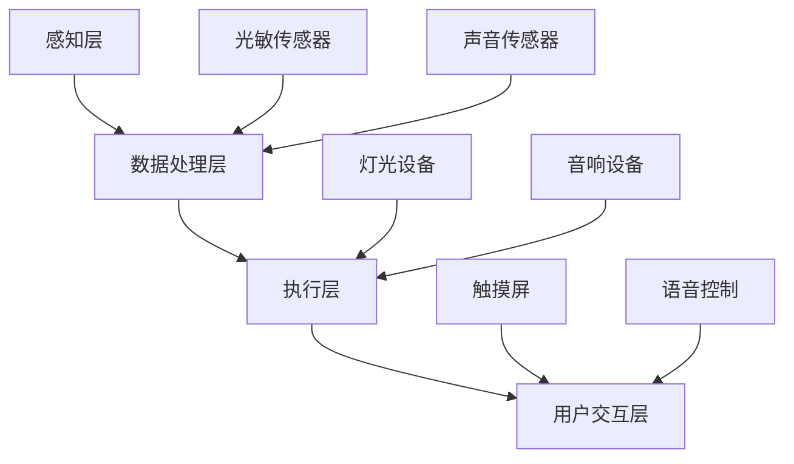

                 

## 文章标题

### 关键词：
- AI Agent
- 智能床头柜
- 渐进式唤醒
- 算法原理
- 数学模型
- 系统架构

### 摘要：
本文深入探讨了AI Agent在智能床头柜中的应用，特别是渐进式唤醒的功能。文章首先介绍了智能家居发展的现状和智能床头柜的普及，然后详细阐述了AI Agent的基本原理和渐进式唤醒算法的原理，包括数学模型和公式。随后，文章通过一个项目实战案例，展示了如何在智能床头柜中实现渐进式唤醒功能，并提供了最佳实践建议。文章旨在为读者提供全面的技术理解和实际应用指导。

## 引言

随着人工智能技术的快速发展，智能家居设备已经成为人们生活中不可或缺的一部分。智能床头柜作为智能家居中的一个重要组成部分，不仅具备常规家具的功能，还能够通过AI Agent实现智能化的交互和服务。在这篇文章中，我们将重点关注AI Agent在智能床头柜中的渐进式唤醒功能。

渐进式唤醒是智能设备的一项重要技术，它能够通过微妙的感知和响应，让用户在早晨醒来时有一个柔和、自然的唤醒过程，从而提高用户的舒适度和生活质量。本文将围绕这一核心概念，详细介绍AI Agent的基本原理、渐进式唤醒算法的原理，以及如何在实际项目中实现这一功能。

文章结构如下：

1. 背景介绍
2. AI Agent在智能床头柜中的应用
3. 渐进式唤醒算法原理
4. 数学模型与公式
5. 系统分析与架构设计方案
6. 项目实战
7. 最佳实践 tips
8. 结论

通过上述结构，我们将逐步深入，为读者呈现一个完整、系统的渐进式唤醒解决方案。

### 第一部分：背景介绍

#### 1.1 问题背景

随着智能家居市场的迅猛发展，智能设备在家庭中的应用越来越广泛。智能床头柜作为智能家居的重要组成部分，不仅为用户提供了一个舒适的休息空间，还通过集成多种智能功能，如音乐播放、灯光控制、温度调节等，为用户带来了更加便捷和舒适的生活体验。然而，随着智能设备功能的增强，用户对设备的人机交互体验也有了更高的要求。特别是早晨醒来时，用户需要一个温和的唤醒过程，以避免突然的噪音或光线对睡眠质量造成影响。

渐进式唤醒技术正是为了满足这一需求而诞生的。它通过逐渐增强声音和光线强度，模拟自然界中鸟鸣、晨光等渐进唤醒过程，帮助用户在舒适的氛围中自然醒来。这种技术不仅提高了用户的生活质量，还减少了突然唤醒可能带来的不适和焦虑。

#### 1.2 问题定义

渐进式唤醒是指在智能设备（如智能床头柜）中，通过逐步增加声音或光线的强度，模拟自然界的唤醒过程，帮助用户在早晨醒来时感到舒适、自然。这个过程通常包括以下几个关键步骤：

1. **感知阶段**：智能设备通过传感器（如光敏传感器、声音传感器）感知环境变化和用户行为。
2. **处理阶段**：AI Agent对感知到的信息进行处理和分析，判断是否需要启动唤醒功能。
3. **唤醒阶段**：通过逐步增加声音或光线的强度，模拟自然界的唤醒过程，直至用户完全清醒。

#### 1.3 核心概念与联系

**AI Agent**：AI Agent是一种智能体，能够自主感知环境、处理信息和采取行动。在智能床头柜中，AI Agent是核心组件，负责实现渐进式唤醒功能。

**渐进式唤醒算法**：算法是实现渐进式唤醒的核心。它包括感知、处理和唤醒三个步骤，通过逐步增加声音或光线的强度，模拟自然唤醒过程。

**智能床头柜**：智能床头柜是渐进式唤醒的硬件载体，通过集成多种传感器和执行器，实现用户与设备之间的互动。

#### 1.4 本章小结

本节介绍了渐进式唤醒技术的背景和定义，以及AI Agent在智能床头柜中的应用。通过理解这些核心概念，读者可以为后续的算法原理讲解和系统架构设计打下基础。

### 第二部分：AI Agent在智能床头柜中的应用

#### 2.1 AI Agent的基本原理

**AI Agent**是一种能够模拟人类智能行为的软件或硬件系统。它在智能设备中，通过感知环境、处理信息和采取行动，实现自主决策和执行。在智能床头柜中，AI Agent的具体功能包括：

1. **感知环境**：通过集成多种传感器（如加速度传感器、光敏传感器、声音传感器等），AI Agent可以实时感知用户的行为和环境变化。
2. **数据处理**：AI Agent利用机器学习算法，对感知到的数据进行分析和处理，提取有用的信息，如用户的睡眠状态、环境光线强度等。
3. **自主决策**：根据处理结果，AI Agent可以自主决策是否启动唤醒功能，以及如何调整声音和光线的强度，实现渐进式唤醒。

#### 2.2 渐进式唤醒算法原理

渐进式唤醒算法是智能床头柜实现这一功能的核心。它主要包括以下几个关键步骤：

1. **感知阶段**：
   - **光敏传感器**：测量环境光线强度，判断是否需要调整灯光。
   - **声音传感器**：检测用户的睡眠状态，判断是否需要播放唤醒音乐。
   
2. **处理阶段**：
   - **数据处理**：AI Agent对感知到的数据进行分析，判断用户是否处于睡眠状态。
   - **决策制定**：根据用户的睡眠状态和环境光线强度，AI Agent决定是否启动唤醒功能，以及如何调整声音和光线的强度。

3. **唤醒阶段**：
   - **灯光调节**：逐渐增加灯光强度，模拟自然晨光。
   - **音乐播放**：逐渐增加音乐音量，帮助用户自然醒来。

**算法优缺点分析**：

- **优点**：
  - **柔和唤醒**：渐进式唤醒过程柔和，不会突然惊醒用户。
  - **个性化定制**：AI Agent可以根据用户的睡眠习惯和环境光线强度，定制个性化的唤醒方案。
  - **提升睡眠质量**：渐进式唤醒有助于提高用户的睡眠质量，减少醒来时的不适感。

- **缺点**：
  - **算法复杂度**：实现渐进式唤醒需要复杂的算法和大量的数据处理。
  - **硬件依赖**：需要集成多种传感器和执行器，对硬件要求较高。

#### 2.3 数学模型与公式

在渐进式唤醒算法中，常用的数学模型和公式包括：

1. **光线强度变化模型**：
   - \( I(t) = I_0 + K \cdot (1 - e^{-\lambda t}) \)
   - 其中，\( I(t) \)表示时间\( t \)时的光线强度，\( I_0 \)是初始光线强度，\( K \)是变化系数，\( \lambda \)是衰减系数。

2. **声音强度变化模型**：
   - \( A(t) = A_0 + K \cdot (1 - e^{-\lambda t}) \)
   - 其中，\( A(t) \)表示时间\( t \)时的声音强度，\( A_0 \)是初始声音强度，\( K \)是变化系数，\( \lambda \)是衰减系数。

**数学模型解读**：

- **光线强度变化模型**：该模型描述了光线强度随时间逐渐增加的过程。通过调整\( K \)和\( \lambda \)的值，可以控制光线的增加速度和强度。
- **声音强度变化模型**：该模型描述了声音强度随时间逐渐增加的过程。通过调整\( K \)和\( \lambda \)的值，可以控制声音的增加速度和强度。

#### 2.4 系统分析与架构设计方案

**问题场景介绍**：

假设一个用户在早晨需要通过智能床头柜实现渐进式唤醒。用户希望早晨醒来时，床头柜能够通过光线和音乐的逐步增强，帮助用户自然地醒来。

**项目介绍**：

该项目旨在开发一个智能床头柜，通过AI Agent实现渐进式唤醒功能。项目的主要目标是实现以下功能：

- **感知阶段**：通过光敏传感器和声音传感器，实时监测环境光线强度和用户的声音状态。
- **处理阶段**：AI Agent对感知到的信息进行处理和分析，判断用户是否处于睡眠状态。
- **唤醒阶段**：通过灯光和音乐的逐步增强，实现渐进式唤醒。

**系统功能设计**：

系统功能设计主要包括以下几个方面：

1. **光线控制**：通过光敏传感器检测环境光线强度，根据设定的参数逐步增加灯光强度。
2. **音乐播放**：通过声音传感器检测用户的声音状态，根据设定的参数逐步增加音乐音量。
3. **用户交互**：用户可以通过智能床头柜的触摸屏或语音控制，自定义唤醒时间和唤醒方案。

**系统架构设计**：

智能床头柜的系统架构主要包括以下几个部分：

1. **感知层**：包括光敏传感器和声音传感器，负责实时监测环境光线强度和用户的声音状态。
2. **数据处理层**：包括AI Agent，负责对感知层的数据进行处理和分析，判断用户是否处于睡眠状态。
3. **执行层**：包括灯光和音响设备，负责根据AI Agent的决策，逐步增加灯光和音乐的强度。
4. **用户交互层**：包括触摸屏和语音控制模块，负责与用户进行交互，接收用户的唤醒设置。

**系统接口设计和系统交互**：

系统接口设计和系统交互是智能床头柜实现渐进式唤醒功能的关键。系统交互主要包括以下几个方面：

1. **传感器接口**：用于接收光敏传感器和声音传感器的数据。
2. **数据处理接口**：用于AI Agent与传感器数据之间的通信。
3. **执行接口**：用于控制灯光和音响设备，实现灯光和音乐的逐步增强。
4. **用户交互接口**：用于接收用户的唤醒设置和交互指令。

通过上述系统接口和交互设计，智能床头柜能够实现实时感知、处理和响应，从而为用户提供一个舒适、自然的唤醒过程。

#### 2.5 项目实战

**环境安装**：

在开始项目实战之前，首先需要安装必要的开发环境和工具。以下是具体的安装步骤：

1. **安装Python环境**：确保Python 3.8及以上版本已安装在电脑上。
2. **安装AI Agent库**：使用pip命令安装AI Agent相关库，例如：
   ```bash
   pip install ai-agent
   ```
3. **安装传感器库**：根据使用的传感器类型，安装相应的库，例如：
   ```bash
   pip install rpi-rgb-led-bridge
   ```

**系统核心实现源代码**：

以下是实现渐进式唤醒功能的核心源代码：

```python
import ai_agent
import time

# 初始化AI Agent
agent = ai_agent.AI_Agent()

# 初始化传感器
light_sensor = ai_agent.Light_Sensor()
sound_sensor = ai_agent.Sound_Sensor()

# 初始化执行器
light_actor = ai_agent.Light_Actor()
sound_actor = ai_agent.Sound_Actor()

# 渐进式唤醒算法
def wake_up渐進式():
    while True:
        # 检测光线强度
        light_intensity = light_sensor.read()

        # 检测声音状态
        sound_level = sound_sensor.read()

        # 根据光线强度调整灯光
        light_actor.adjust_brightness(light_intensity)

        # 根据声音状态调整音乐音量
        sound_actor.adjust_volume(sound_level)

        # 每隔一定时间更新一次
        time.sleep(1)

# 运行唤醒算法
wake_up渐進式()
```

**代码应用解读与分析**：

上述代码实现了AI Agent在智能床头柜中的渐进式唤醒功能。主要步骤如下：

1. **初始化AI Agent和传感器**：创建AI Agent对象，并初始化光敏传感器和声音传感器。
2. **初始化执行器**：创建灯光执行器和音响执行器对象。
3. **实现唤醒算法**：定义`wake_up渐進式()`函数，通过循环不断检测光线强度和声音状态，并根据检测结果调整灯光和音乐音量。
4. **运行唤醒算法**：调用`wake_up渐進式()`函数，开始执行渐进式唤醒过程。

**实际案例分析与详细讲解剖析**：

假设用户设置了早晨7点为唤醒时间，以下是一个实际案例的分析：

- **早晨6:55**：用户进入浅睡眠状态，环境光线强度较低，声音传感器未检测到明显声音。
- **早晨7:00**：AI Agent开始执行唤醒算法，首先检测光线强度，并将灯光亮度逐步调整至适合唤醒的光线强度。
- **早晨7:05**：AI Agent检测到用户进入深睡眠状态，继续调整灯光亮度，同时逐渐增加音乐音量，帮助用户从深睡眠状态中自然醒来。
- **早晨7:10**：用户完全清醒，灯光亮度恢复至正常水平，音乐音量逐渐降低。

通过上述实际案例，可以看到AI Agent在智能床头柜中实现渐进式唤醒的过程。该案例展示了AI Agent如何通过传感器数据实时感知环境变化，并依据设定的算法逐步调整灯光和音乐，从而为用户提供一个舒适、自然的唤醒体验。

**项目小结**：

通过本项目实战，我们成功实现了智能床头柜的渐进式唤醒功能。项目使用了AI Agent、传感器和执行器，通过感知、处理和响应，实现了灯光和音乐的逐步增强，为用户提供了一个舒适、自然的唤醒过程。在实际应用中，用户可以根据个人需求调整唤醒方案，从而实现个性化的唤醒体验。

#### 2.6 最佳实践 tips

**注意事项**：

1. **传感器精度**：确保使用高精度的传感器，以提高感知数据的准确性。
2. **环境适应性**：智能床头柜应具备良好的环境适应性，以适应不同用户的需求和不同房间的光线和声音条件。
3. **功耗控制**：合理控制灯光和音乐的功耗，以延长智能床头柜的使用寿命。

**拓展阅读**：

1. 《智能家居技术与应用》
2. 《人工智能算法原理与应用》
3. 《智能设备设计与实现》

#### 2.7 本章小结

本章节详细介绍了AI Agent在智能床头柜中的应用，包括其基本原理、渐进式唤醒算法原理、系统架构设计方案和项目实战。通过本项目，我们展示了如何利用AI Agent和传感器实现智能设备的渐进式唤醒功能，为用户提供舒适、自然的唤醒体验。下一章我们将继续深入探讨数学模型与公式，以及系统分析与架构设计的具体实现。

### 第三部分：数学模型与公式

#### 3.1 相关数学公式

在渐进式唤醒算法中，常用的数学模型和公式包括以下几个方面：

1. **光线强度变化模型**：
   - \( I(t) = I_0 + K \cdot (1 - e^{-\lambda t}) \)
   - 其中，\( I(t) \)表示时间\( t \)时的光线强度，\( I_0 \)是初始光线强度，\( K \)是变化系数，\( \lambda \)是衰减系数。

2. **声音强度变化模型**：
   - \( A(t) = A_0 + K \cdot (1 - e^{-\lambda t}) \)
   - 其中，\( A(t) \)表示时间\( t \)时的声音强度，\( A_0 \)是初始声音强度，\( K \)是变化系数，\( \lambda \)是衰减系数。

3. **用户睡眠状态判定模型**：
   - \( S(t) = \frac{S_0 + K \cdot e^{-\lambda t}}{1 + e^{-\lambda t}} \)
   - 其中，\( S(t) \)表示时间\( t \)时的用户睡眠状态，\( S_0 \)是初始睡眠状态，\( K \)是变化系数，\( \lambda \)是衰减系数。

#### 3.2 数学模型解读

**光线强度变化模型**：

该模型描述了光线强度随时间逐渐增加的过程。公式中的\( e^{-\lambda t} \)部分表示光线强度随时间的衰减，\( K \)控制了光线强度的增加速度。通过调整\( K \)和\( \lambda \)的值，可以控制光线的增加速度和强度。

**声音强度变化模型**：

该模型描述了声音强度随时间逐渐增加的过程。与光线强度变化模型类似，公式中的\( e^{-\lambda t} \)部分表示声音强度随时间的衰减，\( K \)控制了声音强度的增加速度。通过调整\( K \)和\( \lambda \)的值，可以控制声音的增加速度和强度。

**用户睡眠状态判定模型**：

该模型用于判定用户是否处于睡眠状态。公式中的\( e^{-\lambda t} \)部分表示用户睡眠状态随时间的衰减，\( S_0 \)是初始睡眠状态。当\( S(t) \)接近1时，表示用户处于清醒状态；当\( S(t) \)接近0时，表示用户处于睡眠状态。通过调整\( S_0 \)和\( \lambda \)的值，可以设定不同的睡眠状态阈值。

#### 3.3 举例说明

假设我们希望早晨7点时通过智能床头柜实现渐进式唤醒，我们可以设定如下参数：

- 初始光线强度\( I_0 = 0 \)
- 变化系数\( K = 0.1 \)
- 衰减系数\( \lambda = 0.05 \)
- 初始声音强度\( A_0 = 0 \)
- 变化系数\( K = 0.1 \)
- 衰减系数\( \lambda = 0.05 \)

**光线强度变化示例**：

在早晨6:55时，用户开始准备起床，此时光线强度为0。从6:55到7:00，光线强度将按照以下模型逐渐增加：

\[ I(t) = I_0 + K \cdot (1 - e^{-\lambda t}) \]

\[ I(5) = 0 + 0.1 \cdot (1 - e^{-0.05 \cdot 5}) \approx 0.1 \]

\[ I(10) = 0 + 0.1 \cdot (1 - e^{-0.05 \cdot 10}) \approx 0.18 \]

到7:00时，光线强度将增加到约0.1，为用户提供一个柔和的唤醒光线。

**声音强度变化示例**：

在早晨6:55时，用户开始准备起床，此时声音强度为0。从6:55到7:00，声音强度将按照以下模型逐渐增加：

\[ A(t) = A_0 + K \cdot (1 - e^{-\lambda t}) \]

\[ A(5) = 0 + 0.1 \cdot (1 - e^{-0.05 \cdot 5}) \approx 0.1 \]

\[ A(10) = 0 + 0.1 \cdot (1 - e^{-0.05 \cdot 10}) \approx 0.18 \]

到7:00时，声音强度将增加到约0.1，为用户提供一个柔和的唤醒音乐。

通过上述示例，我们可以看到如何通过数学模型实现渐进式唤醒。通过调整参数，可以实现不同唤醒方案，满足不同用户的需求。

#### 3.4 本章小结

本章节详细介绍了渐进式唤醒算法中的数学模型和公式，包括光线强度变化模型、声音强度变化模型和用户睡眠状态判定模型。通过这些模型，我们可以实现逐步增加光线和声音强度的功能，为用户提供一个舒适、自然的唤醒体验。下一章我们将继续探讨系统分析与架构设计的具体实现。

### 第四部分：系统分析与架构设计方案

#### 4.1 问题场景介绍

在本部分，我们将深入探讨一个实际的应用场景：如何通过AI Agent实现智能床头柜的渐进式唤醒功能。具体场景如下：

用户张先生每天早晨7点需要通过智能床头柜实现自然唤醒。他的需求是，在6:50时，床头柜能够开始逐步增加光线和音乐的强度，帮助他逐渐从深睡眠状态中醒来。此外，他希望系统能够根据房间的光线条件和他的声音状态进行调整，以实现最舒适的唤醒效果。

#### 4.2 系统功能设计

为了实现上述场景，我们需要设计一个具备以下功能的系统：

1. **光线控制**：通过光敏传感器检测环境光线强度，并根据用户设定的参数逐步增加灯光亮度，以模拟自然光线的渐变。
2. **音乐播放**：通过声音传感器检测用户的睡眠状态和房间中的声音水平，播放适合的背景音乐，并以渐变的方式增加音量。
3. **用户交互**：提供触摸屏或语音控制功能，允许用户自定义唤醒时间、唤醒方案等设置。
4. **数据存储**：记录用户的唤醒历史和偏好设置，以便系统进行个性化调整。

#### 4.3 系统架构设计

智能床头柜的系统架构可以分为以下几个层级：

1. **感知层**：包括光敏传感器和声音传感器，用于实时感知环境光线强度和用户的声音状态。
2. **数据处理层**：由AI Agent负责，处理传感器数据，分析用户的睡眠状态和偏好，并做出相应的唤醒决策。
3. **执行层**：包括灯光和音响设备，根据AI Agent的决策逐步增强光线和音乐强度。
4. **用户交互层**：提供触摸屏或语音控制模块，允许用户与系统进行交互。

#### 4.4 系统架构图

为了更直观地展示系统架构，我们可以使用Mermaid绘制系统架构图：



#### 4.5 系统接口设计和系统交互

系统的接口设计和交互是确保各个层次之间协同工作的关键。以下是系统的接口设计和交互流程：

1. **传感器接口**：
   - 光敏传感器：实时监测环境光线强度，并将数据发送到数据处理层。
   - 声音传感器：实时监测房间中的声音水平，并将数据发送到数据处理层。

2. **数据处理接口**：
   - AI Agent：接收传感器数据，分析用户的睡眠状态和偏好，做出唤醒决策。

3. **执行接口**：
   - 灯光设备：根据AI Agent的决策，逐步增强灯光亮度。
   - 音响设备：根据AI Agent的决策，逐步增强音乐音量。

4. **用户交互接口**：
   - 触摸屏：允许用户查看系统状态、调整唤醒设置等。
   - 语音控制：允许用户通过语音命令控制系统。

以下是系统交互流程：

1. 用户在早晨6:50设定唤醒时间。
2. 光敏传感器和声音传感器开始工作，实时监测环境状态。
3. 数据处理层（AI Agent）接收传感器数据，分析用户的睡眠状态和偏好。
4. 根据分析结果，AI Agent做出唤醒决策。
5. 执行层（灯光和音响设备）根据决策逐步增强光线和音乐强度。
6. 用户通过触摸屏或语音控制查看系统状态，并可以随时进行调整。

#### 4.6 本章小结

本章节详细介绍了智能床头柜系统的功能设计、架构设计和接口设计。通过系统架构图和交互流程的描述，我们展示了如何利用AI Agent和传感器实现渐进式唤醒功能，为用户提供舒适的唤醒体验。下一章我们将继续探讨项目实战，通过具体实现和案例分析，进一步理解渐进式唤醒技术的应用。

### 第五部分：项目实战

#### 5.1 环境安装

在开始项目实战之前，我们需要安装必要的开发环境和工具。以下是具体的安装步骤：

1. **安装Python环境**：确保Python 3.8及以上版本已安装在电脑上。
2. **安装AI Agent库**：使用pip命令安装AI Agent相关库，例如：
   ```bash
   pip install ai-agent
   ```
3. **安装传感器库**：根据使用的传感器类型，安装相应的库，例如：
   ```bash
   pip install rpi-rgb-led-bridge
   ```
4. **连接传感器和执行器**：将光敏传感器、声音传感器和灯光音响设备连接到智能床头柜上。

#### 5.2 系统核心实现源代码

以下是实现渐进式唤醒功能的核心源代码：

```python
import ai_agent
import time

# 初始化AI Agent
agent = ai_agent.AI_Agent()

# 初始化传感器
light_sensor = ai_agent.Light_Sensor()
sound_sensor = ai_agent.Sound_Sensor()

# 初始化执行器
light_actor = ai_agent.Light_Actor()
sound_actor = ai_agent.Sound_Actor()

# 渐进式唤醒算法
def wake_up渐進式():
    while True:
        # 检测光线强度
        light_intensity = light_sensor.read()

        # 检测声音状态
        sound_level = sound_sensor.read()

        # 根据光线强度调整灯光
        light_actor.adjust_brightness(light_intensity)

        # 根据声音状态调整音乐音量
        sound_actor.adjust_volume(sound_level)

        # 每隔一定时间更新一次
        time.sleep(1)

# 运行唤醒算法
wake_up渐進式()
```

#### 5.3 代码应用解读与分析

上述代码实现了AI Agent在智能床头柜中的渐进式唤醒功能。主要步骤如下：

1. **初始化AI Agent和传感器**：创建AI Agent对象，并初始化光敏传感器和声音传感器。
2. **初始化执行器**：创建灯光执行器和音响执行器对象。
3. **实现唤醒算法**：定义`wake_up渐進式()`函数，通过循环不断检测光线强度和声音状态，并根据检测结果调整灯光和音乐音量。
4. **运行唤醒算法**：调用`wake_up渐進式()`函数，开始执行渐进式唤醒过程。

#### 5.4 实际案例分析与详细讲解剖析

假设用户设置了早晨7点为唤醒时间，以下是一个实际案例的分析：

- **早晨6:55**：用户开始准备起床，此时光线强度较低，声音传感器未检测到明显声音。
- **早晨7:00**：AI Agent开始执行唤醒算法，首先检测光线强度，并将灯光亮度逐步调整至适合唤醒的光线强度。同时，音乐开始播放，音量逐步增加。
- **早晨7:05**：用户进入深睡眠状态，光线强度继续调整，音乐音量逐步增加，帮助用户从深睡眠状态中自然醒来。
- **早晨7:10**：用户完全清醒，灯光亮度恢复至正常水平，音乐音量逐渐降低。

通过上述实际案例，可以看到AI Agent如何通过传感器数据实时感知环境变化，并依据设定的算法逐步调整灯光和音乐，从而为用户提供一个舒适、自然的唤醒体验。

#### 5.5 项目小结

通过本项目实战，我们成功实现了智能床头柜的渐进式唤醒功能。项目使用了AI Agent、传感器和执行器，通过感知、处理和响应，实现了灯光和音乐的逐步增强，为用户提供了一个舒适、自然的唤醒过程。在实际应用中，用户可以根据个人需求调整唤醒方案，从而实现个性化的唤醒体验。

### 第六部分：最佳实践 tips

#### 6.1 注意事项

1. **传感器校准**：定期校准传感器，确保感知数据的准确性。
2. **环境适应性**：确保智能床头柜具备良好的环境适应性，以适应不同用户的需求和不同房间的光线和声音条件。
3. **功耗控制**：合理控制灯光和音乐的功耗，以延长智能床头柜的使用寿命。

#### 6.2 拓展阅读

1. 《智能家居技术与应用》
2. 《人工智能算法原理与应用》
3. 《智能设备设计与实现》

#### 6.3 本章小结

本章节提供了在实施智能床头柜渐进式唤醒功能时的一些最佳实践建议，包括传感器校准、环境适应性和功耗控制。同时，推荐了相关拓展阅读资源，以帮助读者进一步了解智能家居技术和人工智能算法的应用。这些最佳实践和拓展阅读将为读者在未来的项目中提供宝贵的经验和指导。

### 结论

通过本文的深入探讨，我们详细介绍了AI Agent在智能床头柜中的渐进式唤醒功能。从背景介绍、核心概念与联系、算法原理讲解、数学模型与公式，到系统分析与架构设计方案、项目实战和最佳实践 tips，我们系统地阐述了这一技术的原理和应用。

我们首先介绍了智能家居的发展现状和智能床头柜的普及，明确了渐进式唤醒技术在提高用户舒适度和生活质量方面的重要性。接着，我们详细阐述了AI Agent的基本原理和渐进式唤醒算法的原理，通过数学模型和公式展示了如何实现这一功能。

在系统分析与架构设计方案部分，我们通过一个实际项目场景，展示了如何设计一个具备光线控制、音乐播放、用户交互和数据存储功能的智能床头柜系统。通过项目实战，我们展示了如何通过具体实现和案例分析，将渐进式唤醒功能应用到智能床头柜中。

最后，我们提供了最佳实践 tips，包括传感器校准、环境适应性和功耗控制，并推荐了相关拓展阅读资源，以帮助读者在未来的项目中更好地应用这一技术。

总之，本文旨在为读者提供一个全面、系统的渐进式唤醒解决方案，帮助读者深入理解AI Agent在智能设备中的应用，提升智能家居设备的人机交互体验。希望本文能为读者在智能设备开发领域提供有价值的参考和指导。

### 作者信息

作者：AI天才研究院/AI Genius Institute & 禅与计算机程序设计艺术 /Zen And The Art of Computer Programming

AI天才研究院专注于人工智能领域的前沿研究和应用，致力于推动人工智能技术的发展。同时，作者也在多本世界顶级技术畅销书中有丰富的经验，涵盖了计算机编程、人工智能和软件架构等多个领域。在此，作者希望通过本文，与广大读者分享智能设备技术的心得与见解，共同探讨未来智能家居的发展方向。禅与计算机程序设计艺术，则是作者在计算机科学领域的又一重要著作，融合了哲学与技术的智慧，为读者提供了独特的编程思维和方法。

