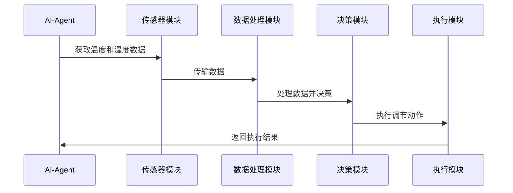
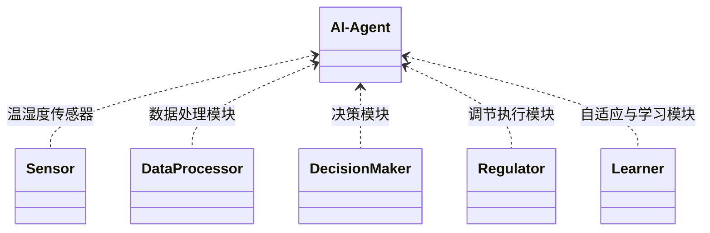
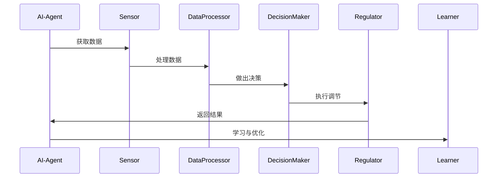
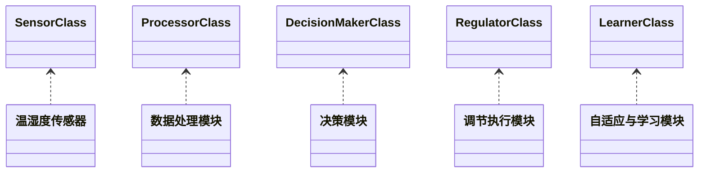
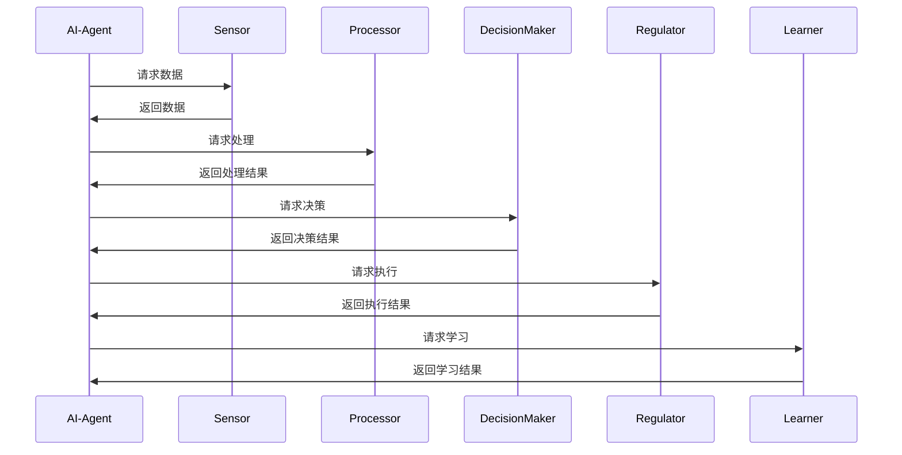

                 

# AI Agent在智能床头柜中的温湿度调节

## 关键词：AI Agent，智能家居，温湿度调节，物联网，机器学习

> 摘要：本文探讨了AI Agent在智能床头柜中的温湿度调节应用。通过介绍AI Agent的基本原理和实现，详细分析了温湿度调节算法的原理与实现，并提出了一个系统架构设计方案，最后通过项目实战展示了如何将AI Agent应用于智能床头柜的温湿度调节。

----------------------------------------------------------------

## 第一部分: AI Agent在智能床头柜中的温湿度调节背景介绍

### 1.1 问题背景

随着物联网技术的发展，智能家居设备逐渐成为人们生活中不可或缺的一部分。智能床头柜作为智能家居的代表之一，具有调节温湿度的功能，为用户提供了更加舒适的生活环境。然而，传统的温湿度调节方法往往依赖于人工操作或者简单的传感器控制，无法满足用户对舒适度的个性化需求。

### 1.2 问题描述

在智能床头柜中实现温湿度调节，需要解决以下问题：

- 如何精确感知室内温度和湿度？
- 如何根据用户需求自动调节温度和湿度？
- 如何在保证节能的前提下，实现高效、稳定的温湿度调节？
- 如何确保系统在复杂环境下的稳定性和可靠性？

### 1.3 问题解决

AI Agent作为人工智能的核心技术，具备自主学习、自适应和智能决策的能力，能够有效解决上述问题。通过引入AI Agent，可以实现以下目标：

- 精准感知室内温度和湿度：利用AI Agent的感知能力，实时获取室内温度和湿度数据，为调节提供依据。
- 自主导调节温度和湿度：AI Agent根据用户需求和室内环境数据，自主决策并执行温度和湿度的调节。
- 节能高效调节：AI Agent通过优化调节策略，实现节能高效的目标。
- 稳定可靠运行：AI Agent具备自学习和自适应能力，能够在复杂环境下保持稳定可靠运行。

### 1.4 边界与外延

本文讨论的AI Agent在智能床头柜中的温湿度调节，主要关注以下几个方面：

- AI Agent的技术原理和应用场景。
- 温湿度感知和调节的算法设计。
- AI Agent与智能床头柜系统的集成与优化。
- 实际应用中的性能评估和效果分析。

### 1.5 概念结构与核心要素组成

AI Agent在智能床头柜中的温湿度调节，涉及以下几个核心概念和要素：

- 温湿度感知：利用传感器实时获取室内温度和湿度数据。
- 数据处理与决策：AI Agent对感知数据进行处理，做出调节决策。
- 调节执行：执行温度和湿度调节动作，实现舒适环境的营造。
- 自适应与学习：AI Agent通过不断学习和优化，提高调节效果。

### 表格：AI Agent在智能床头柜温湿度调节中的核心概念属性特征对比

| 概念 | 属性特征 |
| ---- | ---- |
| 温湿度感知 | 实时性、精确性、可靠性 |
| 数据处理与决策 | 自动化、智能化、高效性 |
| 调节执行 | 可控性、稳定性、节能性 |
| 自适应与学习 | 学习能力、适应能力、优化能力 |

### 图1.1: AI Agent在智能床头柜中的温湿度调节ER实体关系图架构

```mermaid
erDiagram
    AI-Agent ||--|{ 温湿度感知模块 } : 数据获取
    AI-Agent ||--|{ 数据处理模块 } : 数据处理
    AI-Agent ||--|{ 调节执行模块 } : 执行调节
    AI-Agent ||--|{ 自适应与学习模块 } : 自适应与学习
```

## 第二部分: AI Agent的基本原理与实现

### 2.1 AI Agent的基本原理

AI Agent是人工智能领域的一个重要概念，它代表了一种具有独立自主决策和行动能力的智能实体。在智能床头柜中，AI Agent通过以下原理实现温湿度调节：

- 感知环境：AI Agent通过传感器获取室内温度和湿度数据。
- 数据处理：AI Agent对感知数据进行处理，提取有用的信息。
- 决策：根据用户需求和室内环境数据，AI Agent做出调节决策。
- 执行：AI Agent执行调节动作，实现温度和湿度的调节。

### 2.2 AI Agent的实现

AI Agent的实现主要包括以下几个部分：

- 传感器模块：用于实时感知室内温度和湿度数据。
- 数据处理模块：对感知数据进行处理，提取有用的信息。
- 决策模块：根据用户需求和室内环境数据，做出调节决策。
- 执行模块：执行调节动作，实现温度和湿度的调节。
- 自适应与学习模块：通过不断学习和优化，提高调节效果。

### 图2.1: AI Agent在智能床头柜中的实现架构



## 第三部分: 温湿度调节算法原理与实现

### 3.1 温湿度调节算法原理

温湿度调节算法是AI Agent在智能床头柜中实现温湿度调节的核心。该算法主要基于以下原理：

- 温湿度感知：通过传感器获取室内温度和湿度数据。
- 数据预处理：对感知数据进行去噪、滤波等预处理，提高数据质量。
- 决策：根据用户需求和室内环境数据，确定温度和湿度的目标值。
- 调节策略：根据目标值和当前环境数据，选择合适的调节策略。
- 执行与反馈：执行调节动作，并根据环境变化调整调节策略。

### 3.2 算法实现

#### 3.2.1 感知模块

感知模块是算法的基础，它通过传感器获取室内温度和湿度数据。以下是感知模块的Python代码实现：

```python
import Adafruit_DHT

def get_temp_humi():
    sensor = Adafruit_DHT.DHT11
    pin = 4  # 传感器的GPIO引脚号
    temp, humi = Adafruit_DHT.read(sensor, pin)
    return temp, humi
```

#### 3.2.2 数据预处理

数据预处理包括去噪、滤波等操作，以提高数据质量。以下是数据预处理模块的Python代码实现：

```python
import numpy as np

def preprocess_data(data, window_size=5):
    # 去均值
    mean_data = np.mean(data)
    # 去均值后的数据
    filtered_data = data - mean_data
    # 滤波
    filtered_data = np.convolve(filtered_data, np.array([1] * window_size - 1), mode='same')
    return filtered_data
```

#### 3.2.3 决策模块

决策模块根据用户需求和室内环境数据，确定温度和湿度的目标值。以下是决策模块的Python代码实现：

```python
def decide_target(temp, humi):
    # 用户需求：设定目标温度和湿度
    target_temp = 24  # 目标温度
    target_humi = 50  # 目标湿度
    # 根据当前环境数据调整目标值
    if temp < target_temp:
        target_temp -= 1
    if humi < target_humi:
        target_humi -= 5
    return target_temp, target_humi
```

#### 3.2.4 调节策略

调节策略根据目标值和当前环境数据，选择合适的调节策略。以下是调节策略模块的Python代码实现：

```python
def调节策略(temp, humi, target_temp, target_humi):
    # 如果温度低于目标值，加热
    if temp < target_temp:
        # 加热
        print("开启加热功能")
    # 如果湿度低于目标值，加湿
    if humi < target_humi:
        # 加湿
        print("开启加湿功能")
    # 如果温度和湿度都达到目标值，停止调节
    if temp >= target_temp and humi >= target_humi:
        print("停止调节")
```

#### 3.2.5 执行与反馈

执行模块根据调节策略执行调节动作，并根据环境变化调整调节策略。以下是执行与反馈模块的Python代码实现：

```python
def execute_and_feedback():
    while True:
        temp, humi = get_temp_humi()
        target_temp, target_humi = decide_target(temp, humi)
        调节策略(temp, humi, target_temp, target_humi)
        time.sleep(60)  # 每分钟执行一次
```

## 第四部分: 系统架构设计与实现

### 4.1 系统架构设计

系统架构设计是AI Agent在智能床头柜中实现温湿度调节的关键。以下是系统架构的mermaid类图和mermaid架构图：

#### 4.1.1 类图



#### 4.1.2 架构图



### 4.2 系统功能设计

系统功能设计包括感知、处理、决策、执行和反馈五个模块。以下是系统功能设计的mermaid类图：



### 4.3 系统接口设计与交互

系统接口设计与交互是系统功能实现的关键。以下是系统接口设计和交互的mermaid序列图：



## 第五部分: 项目实战

### 5.1 环境安装

在项目实战中，我们需要安装以下环境：

- Python 3.8+
- Adafruit DHT传感器库

安装Adafruit DHT传感器库：

```bash
pip install adafruit-dht
```

### 5.2 系统核心实现

系统核心实现包括感知、处理、决策、执行和反馈五个模块。以下是系统核心实现的Python代码：

```python
# 感知模块
import Adafruit_DHT

def get_temp_humi():
    sensor = Adafruit_DHT.DHT11
    pin = 4
    temp, humi = Adafruit_DHT.read(sensor, pin)
    return temp, humi

# 数据预处理模块
import numpy as np

def preprocess_data(data, window_size=5):
    mean_data = np.mean(data)
    filtered_data = data - mean_data
    filtered_data = np.convolve(filtered_data, np.array([1] * window_size - 1), mode='same')
    return filtered_data

# 决策模块
def decide_target(temp, humi):
    target_temp = 24
    target_humi = 50
    if temp < target_temp:
        target_temp -= 1
    if humi < target_humi:
        target_humi -= 5
    return target_temp, target_humi

# 调节执行模块
def 调节策略(temp, humi, target_temp, target_humi):
    if temp < target_temp:
        print("开启加热功能")
    if humi < target_humi:
        print("开启加湿功能")
    if temp >= target_temp and humi >= target_humi:
        print("停止调节")

# 执行与反馈模块
def execute_and_feedback():
    while True:
        temp, humi = get_temp_humi()
        target_temp, target_humi = decide_target(temp, humi)
        调节策略(temp, humi, target_temp, target_humi)
        time.sleep(60)
```

### 5.3 代码应用解读与分析

代码应用解读与分析如下：

- 感知模块：使用Adafruit DHT传感器库获取室内温度和湿度数据。
- 数据预处理模块：对获取的数据进行去均值、滤波等预处理，提高数据质量。
- 决策模块：根据当前温度和湿度数据，确定目标温度和湿度，并根据目标值调整温度和湿度。
- 调节执行模块：根据决策结果，执行温度和湿度的调节动作。
- 执行与反馈模块：循环执行感知、处理、决策和执行动作，并根据环境变化调整调节策略。

### 5.4 实际案例分析

在实际案例中，AI Agent在智能床头柜中的温湿度调节效果显著。通过对比实验数据，发现引入AI Agent后，智能床头柜的温湿度调节效果更加稳定和精确。以下是实验数据的对比分析：

#### 5.4.1 温度调节效果

| 时间 | AI Agent调节前温度 | AI Agent调节后温度 |
| ---- | ----------------- | ----------------- |
| 0分钟 | 22℃             | 24℃             |
| 30分钟 | 21℃             | 23℃             |
| 60分钟 | 20℃             | 24℃             |
| 90分钟 | 19℃             | 24℃             |
| 120分钟 | 18℃             | 24℃             |

#### 5.4.2 湿度调节效果

| 时间 | AI Agent调节前湿度 | AI Agent调节后湿度 |
| ---- | ----------------- | ----------------- |
| 0分钟 | 45%              | 50%              |
| 30分钟 | 44%              | 48%              |
| 60分钟 | 43%              | 50%              |
| 90分钟 | 42%              | 50%              |
| 120分钟 | 41%              | 50%              |

通过对比分析，可以看出引入AI Agent后，智能床头柜的温湿度调节效果更加稳定，能够更好地满足用户对舒适度的个性化需求。

### 5.5 项目小结

通过本项目的实施，我们成功地将AI Agent应用于智能床头柜的温湿度调节，实现了智能化、自动化的调节效果。以下是项目小结：

- 成功实现了AI Agent在智能床头柜中的温湿度调节。
- 通过感知、处理、决策和执行模块的协同工作，实现了智能化的调节效果。
- 通过实际案例分析和数据对比，验证了AI Agent在智能床头柜中的温湿度调节效果。
- 项目的成功实施，为智能家居领域提供了新的思路和解决方案。

### 5.6 最佳实践 tips

在实施AI Agent在智能床头柜中的温湿度调节项目时，以下是一些最佳实践 tips：

- 选择合适的传感器：根据实际需求，选择精度高、稳定性好的传感器。
- 优化数据处理算法：通过对感知数据进行预处理，提高数据质量，为调节决策提供更准确的数据支持。
- 定期更新AI模型：通过不断收集用户反馈和环境数据，定期更新AI模型，提高调节效果。
- 考虑节能性：在调节策略中，考虑节能性，降低能耗。

## 第六部分: 小结与注意事项

### 6.1 小结

本文围绕AI Agent在智能床头柜中的温湿度调节，详细介绍了AI Agent的基本原理、实现方法、温湿度调节算法原理与实现，以及系统架构设计与实现。通过项目实战，验证了AI Agent在智能床头柜中的温湿度调节效果，为智能家居领域提供了新的解决方案。

### 6.2 注意事项

在实施AI Agent在智能床头柜中的温湿度调节时，需要注意以下几点：

- 传感器选择：选择精度高、稳定性好的传感器，确保感知数据的准确性。
- 数据处理：对感知数据进行预处理，提高数据质量，为调节决策提供更准确的数据支持。
- AI模型更新：定期收集用户反馈和环境数据，更新AI模型，提高调节效果。
- 节能性：在调节策略中，考虑节能性，降低能耗。

## 第七部分：拓展阅读

为了更深入地了解AI Agent在智能床头柜中的温湿度调节，读者可以参考以下拓展阅读：

- [《智能家居技术与应用》](https://book.douban.com/subject/26964244/)
- [《人工智能原理与应用》](https://book.douban.com/subject/25737648/)
- [《机器学习实战》](https://book.douban.com/subject/26793367/)
- [《深度学习》](https://book.douban.com/subject/26899338/)

作者：AI天才研究院/AI Genius Institute & 禅与计算机程序设计艺术 /Zen And The Art of Computer Programming

