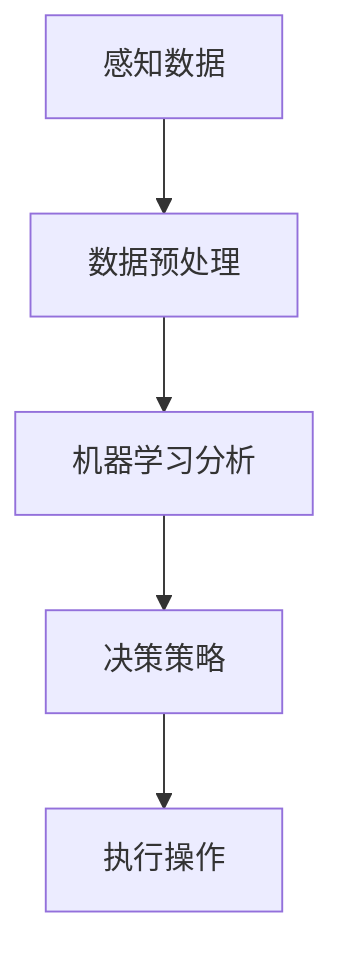
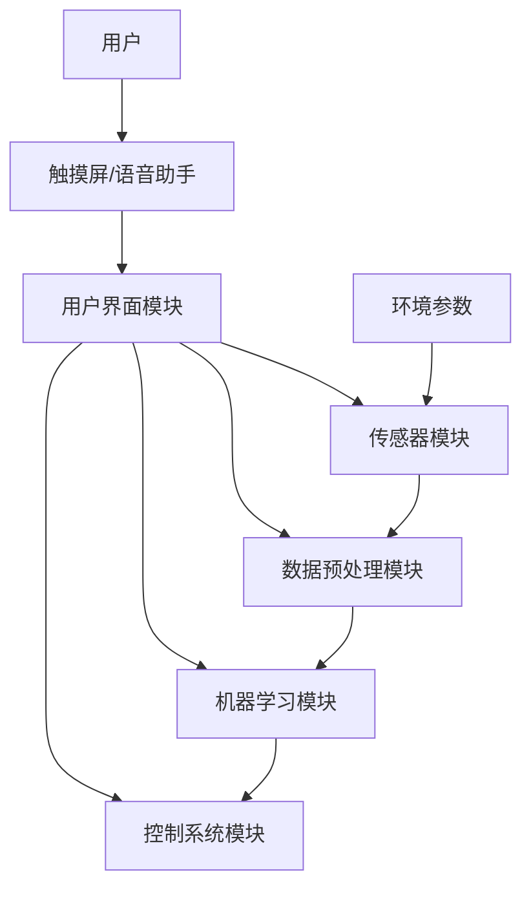
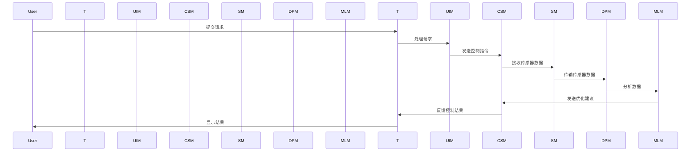

                 

## AI Agent在智能床头柜中的睡眠环境优化

### 关键词：AI Agent，智能床头柜，睡眠环境优化，智能家居，人工智能算法

> 摘要：随着人工智能技术的不断发展和智能家居市场的逐渐成熟，智能床头柜作为智能家居的重要组成部分，正逐渐进入千家万户。本文将探讨AI Agent在智能床头柜中的应用，特别是其在优化睡眠环境方面的作用。通过详细分析AI Agent的工作原理、算法模型及其在实际应用中的效果，本文旨在为读者提供一份全面、深入的技术指南。

在智能家居领域中，智能床头柜不仅具备基础的存储和照明功能，还具备更多智能化的功能，如环境监测、智能提醒、健康管理等。而AI Agent作为人工智能的核心技术之一，其在智能床头柜中的应用可以显著提升用户的睡眠质量。本文将从以下几个部分展开：

1. **背景介绍**：介绍AI Agent与智能床头柜的基本概念、发展背景及睡眠环境优化的必要性。
2. **核心概念与联系**：深入解析AI Agent与智能床头柜的关键技术及其相互关系。
3. **算法原理讲解**：详细阐述AI Agent在睡眠环境优化中的算法原理、数学模型和实际应用案例。
4. **系统分析与架构设计**：分析智能床头柜的系统架构设计及其工作流程。
5. **项目实战**：介绍智能床头柜的环境安装与系统实现，并进行实际案例剖析。
6. **最佳实践与总结**：总结最佳实践技巧、注意事项，并对未来发展方向进行展望。

通过本文的阅读，读者可以全面了解AI Agent在智能床头柜中的睡眠环境优化应用，为智能家居领域的技术研究和应用提供新的思路。

### 目录大纲：

```markdown
----------------------------------------------------------------
# 第一部分：背景介绍

## 第1章：AI Agent与智能床头柜概述

### 1.1.1 AI Agent的基本概念与特点

### 1.1.2 智能床头柜的组成与功能

### 1.1.3 睡眠环境优化的必要性

## 第2章：核心概念与联系

### 2.1.1 AI Agent的核心概念与联系

### 2.1.2 智能床头柜的关键技术

## 第二部分：算法原理讲解

## 第3章：AI Agent在睡眠环境优化中的应用

### 3.1.1 算法原理与流程图

### 3.1.2 数学模型与公式

### 3.1.3 举例说明

## 第三部分：系统分析与架构设计

## 第4章：智能床头柜的系统架构设计

### 4.1.1 问题场景介绍

### 4.1.2 系统功能设计

### 4.1.3 系统架构设计

### 4.1.4 系统接口设计

### 4.1.5 系统交互mermaid序列图

## 第四部分：项目实战

## 第5章：环境安装与系统实现

### 5.1.1 环境安装

### 5.1.2 系统核心实现

### 5.1.3 实际案例分析与详细讲解

## 第五部分：最佳实践与总结

## 第6章：最佳实践

### 6.1.1 最佳实践 tips

### 6.1.2 注意事项

### 6.1.3 拓展阅读

## 第7章：总结与展望

### 7.1.1 总结

### 7.1.2 展望

----------------------------------------------------------------
```

在接下来的部分中，我们将逐步深入探讨AI Agent与智能床头柜在睡眠环境优化中的应用，通过具体的技术分析、系统设计以及实践案例，展现这一领域的前沿成果和应用潜力。

## 第一部分：背景介绍

### 第1章：AI Agent与智能床头柜概述

#### 1.1.1 AI Agent的基本概念与特点

**问题背景**：随着人工智能（AI）技术的飞速发展，AI Agent作为人工智能领域的一个重要分支，正逐渐得到广泛的应用。AI Agent，也被称作人工智能代理，是一种能够自主完成特定任务的智能实体。从学术研究到实际应用，AI Agent已经深入到了各个行业和领域。

**问题解决**：AI Agent通过模拟人类思维过程，利用机器学习、自然语言处理、深度学习等技术，能够在没有人工干预的情况下自主执行任务。它们具备自主性、适应性和交互性等特点，能够根据环境变化做出实时决策。

**AI Agent的定义与功能**：
- **定义**：AI Agent是一种基于人工智能技术构建的软件或硬件系统，能够在特定环境下自主执行任务，并通过不断学习和适应来提高其性能。
- **功能**：AI Agent能够进行感知、决策和执行。感知是指AI Agent通过传感器收集环境信息；决策是指AI Agent基于收集到的信息，利用算法模型进行推理和判断；执行是指AI Agent根据决策结果采取相应的行动。

**边界与外延**：
- **应用范围**：AI Agent可以应用于智能家居、医疗健康、工业自动化、自动驾驶等多个领域。
- **局限性**：尽管AI Agent具有强大的功能，但其在某些特定场景下仍存在局限性，如复杂情境的推理能力和自主决策能力有待进一步提升。

**AI Agent的特点**：
- **自主性**：AI Agent可以自主完成任务，不需要人工干预。
- **适应性**：AI Agent能够根据环境变化和学习经验不断调整自己的行为。
- **交互性**：AI Agent可以与人类和其他系统进行有效交互。

#### 1.1.2 智能床头柜的组成与功能

**问题背景**：随着智能家居市场的蓬勃发展，智能床头柜作为智能家居的重要一环，逐渐成为了家庭生活的一部分。智能床头柜不仅具备传统床头柜的功能，还融合了多种智能技术，如传感器、物联网、人工智能等，为用户提供更加便捷、智能化的体验。

**问题描述**：智能床头柜的设计目标是在保持传统功能的基础上，通过智能化技术的应用，提升用户的睡眠质量、生活舒适度和整体家居体验。

**问题解决**：智能床头柜通过集成传感器、智能控制系统和人工智能算法，实现环境监测、智能调控、健康管理和语音交互等功能。

**智能床头柜的组成与功能模块**：
- **传感器模块**：包括温湿度传感器、光照传感器、空气质量传感器等，用于实时监测室内环境参数。
- **智能控制系统**：通过嵌入式系统和微控制器，实现对传感器数据的处理和控制，如调节灯光、温度等。
- **人工智能算法模块**：利用机器学习、自然语言处理等技术，对传感器数据进行智能分析和优化，提供个性化的睡眠建议和调节方案。
- **用户界面模块**：包括触摸屏、语音助手等，用于用户与智能床头柜的交互。

#### 1.1.3 睡眠环境优化的必要性

**问题背景**：良好的睡眠质量对人的身体健康和精神状态至关重要。然而，现代都市生活中的各种噪音、不良光照、高温或低温等环境因素，常常会影响用户的睡眠质量。因此，优化睡眠环境已成为提高生活质量和健康水平的重要措施。

**问题描述**：如何通过技术手段，自动、高效地优化用户的睡眠环境，使其达到最佳状态。

**问题解决**：通过智能床头柜中的AI Agent，实时监测并分析用户的睡眠环境，利用先进的算法模型进行优化决策，从而提升用户的睡眠质量。

**睡眠环境优化的概念与目标**：
- **概念**：睡眠环境优化是指通过技术手段对影响睡眠的各种环境因素进行调整，以改善用户的睡眠质量。
- **目标**：实现个性化的睡眠环境优化，提高用户的睡眠质量，促进身心健康。

**睡眠环境优化的技术与方法**：
- **传感器技术**：通过温湿度传感器、光照传感器等，实时监测环境参数。
- **物联网技术**：利用物联网技术，实现各智能设备之间的互联互通，协同工作。
- **人工智能算法**：利用机器学习、深度学习等算法，对环境数据进行智能分析，提供优化建议。
- **智能调控技术**：通过智能控制系统，自动调整环境参数，如灯光、温度、湿度等。

通过以上对AI Agent与智能床头柜的背景介绍，我们可以看到，这两者在优化睡眠环境方面有着广泛的应用前景。接下来，我们将进一步探讨AI Agent的核心概念与联系，为后续内容打下基础。

### 第2章：核心概念与联系

#### 2.1.1 AI Agent的核心概念与联系

**概念原理**：AI Agent是一种基于人工智能技术的软件或硬件实体，能够模拟人类的思维过程，在特定环境下自主执行任务。AI Agent的核心在于其自主性、适应性和交互性。通过感知、决策和执行三个环节，AI Agent能够实现自我管理和智能行动。

**概念属性特征对比表格**：
| 特征             | AI Agent            | 普通传感器           | 控制系统             |
|------------------|---------------------|---------------------|---------------------|
| 自主性           | 能自主决策和执行任务 | 仅收集环境信息       | 仅执行预设指令       |
| 学习与适应能力    | 通过学习提高性能     | 无学习功能           | 无学习功能           |
| 交互性           | 能与用户和系统互动   | 无交互功能           | 无交互功能           |

**ER实体关系图架构**：
```mermaid
erDiagram
  AI-Agent ||--|{ 感知模块 }
  AI-Agent ||--|{ 决策模块 }
  AI-Agent ||--|{ 执行模块 }
  感知模块 ||--|{ 传感器 }
  决策模块 ||--|{ 算法模型 }
  执行模块 ||--|{ 执行器 }
```

在智能床头柜中，AI Agent的感知模块通过传感器实时收集环境数据，如温度、湿度、光照等；决策模块利用机器学习算法对数据进行分析，生成优化建议；执行模块根据决策结果，通过智能控制系统执行相应的操作，如调节灯光亮度、调整温度等。

**核心概念与联系**：
- **AI Agent与传感器的联系**：AI Agent依赖传感器获取环境信息，传感器是AI Agent的感知器官，其数据质量直接影响AI Agent的决策效果。
- **AI Agent与控制系统的联系**：控制系统是AI Agent的执行器官，负责根据AI Agent的决策结果，执行具体的操作。两者协同工作，共同实现智能调控。

#### 2.1.2 智能床头柜的关键技术

**概念原理**：智能床头柜是通过集成多种智能技术，实现对用户睡眠环境进行实时监测和智能调控的智能家居设备。其核心技术包括传感器技术、物联网技术、人工智能算法和智能控制系统。

**概念属性特征对比表格**：
| 特征             | 传感器技术           | 物联网技术          | 人工智能算法         | 智能控制系统          |
|------------------|---------------------|---------------------|---------------------|---------------------|
| 数据采集         | 实时监测环境参数     | 互联互通各种设备    | 数据处理与智能分析   | 执行具体操作         |
| 数据处理         | 无数据处理功能       | 数据传输与存储      | 数据分析与决策       | 根据决策执行操作     |
| 自适应能力       | 无自适应能力         | 设备间相互适应      | 自适应学习与优化     | 自动调节环境参数     |

**ER实体关系图架构**：
```mermaid
erDiagram
  智能床头柜 ||--|{ 传感器模块 }
  智能床头柜 ||--|{ 控制系统模块 }
  智能床头柜 ||--|{ 人工智能算法模块 }
  传感器模块 ||--|{ 温湿度传感器 }
  传感器模块 ||--|{ 光照传感器 }
  控制系统模块 ||--|{ 灯光控制系统 }
  控制系统模块 ||--|{ 温度控制系统 }
  人工智能算法模块 ||--|{ 机器学习模型 }
  人工智能算法模块 ||--|{ 自然语言处理模型 }
```

在智能床头柜中，传感器模块负责实时监测环境参数，并将数据传输给控制系统模块；控制系统模块根据数据分析和人工智能算法模块的建议，执行相应的调控操作。人工智能算法模块通过对传感器数据的处理，提供个性化的睡眠建议。

**核心概念与联系**：
- **传感器技术与物联网技术的联系**：传感器技术提供数据采集的基础，物联网技术则负责数据的传输和存储，两者共同实现数据的实时共享和协同工作。
- **人工智能算法与智能控制系统的联系**：人工智能算法通过对传感器数据的分析，生成优化建议，智能控制系统则根据这些建议执行具体的操作，实现智能调控。

通过以上对AI Agent与智能床头柜核心概念及其相互关系的解析，我们可以看到，这两者在技术和应用上有着紧密的联系。接下来，我们将进一步探讨AI Agent在睡眠环境优化中的应用，详细分析其算法原理和数学模型。

### 第二部分：算法原理讲解

#### 3.1.1 算法原理与流程图

**算法原理**：
AI Agent在睡眠环境优化中的应用主要依赖于其感知、决策和执行三个环节。具体来说，AI Agent通过传感器模块实时收集环境数据，如温度、湿度、光照等。然后，这些数据会通过数据预处理模块进行清洗和归一化处理，确保数据的质量和一致性。接着，AI Agent利用机器学习算法，对预处理后的数据进行分析和预测，以生成最优的优化策略。最后，AI Agent通过控制系统模块，根据决策结果执行相应的操作，如调节灯光亮度、温度等，以优化用户的睡眠环境。

**算法mermaid流程图**：


**流程图解释**：
1. **感知数据**：AI Agent通过传感器模块，实时收集室内环境参数。
2. **数据预处理**：对收集到的数据进行清洗和归一化处理，以提高数据质量和一致性。
3. **机器学习分析**：利用机器学习算法，对预处理后的数据进行深入分析，生成优化策略。
4. **决策策略**：基于分析结果，AI Agent生成最优的优化策略。
5. **执行操作**：AI Agent通过控制系统模块，执行具体的操作，如调节灯光亮度、温度等，以优化用户的睡眠环境。

#### 3.1.2 数学模型与公式

**数学模型**：
AI Agent在睡眠环境优化中使用的数学模型主要包括以下几部分：

1. **环境状态模型**：用于描述室内环境的状态，包括温度、湿度、光照等。假设室内环境状态可以用一个向量表示为：
   $$
   S = [T, H, L]
   $$
   其中，$T$ 表示温度，$H$ 表示湿度，$L$ 表示光照强度。

2. **用户偏好模型**：用于描述用户对睡眠环境的需求和偏好。假设用户偏好可以用一个权重向量表示为：
   $$
   P = [p_T, p_H, p_L]
   $$
   其中，$p_T$ 表示用户对温度的偏好权重，$p_H$ 表示用户对湿度的偏好权重，$p_L$ 表示用户对光照的偏好权重。

3. **优化目标模型**：用于定义AI Agent的优化目标。假设优化目标是最小化用户不满意度，可以用以下公式表示：
   $$
   \min J(S, P) = \min \sum_{i=1}^{3} p_i (s_i - p_i)^2
   $$

**公式详细讲解**：
1. **环境状态模型**：
   - **温度（T）**：通过温度传感器实时获取的室内温度值。
   - **湿度（H）**：通过湿度传感器实时获取的室内湿度值。
   - **光照（L）**：通过光照传感器实时获取的室内光照强度。

2. **用户偏好模型**：
   - **温度偏好权重（$p_T$）**：用户对温度的敏感度，值越大表示对温度变化的敏感度越高。
   - **湿度偏好权重（$p_H$）**：用户对湿度的敏感度，值越大表示对湿度变化的敏感度越高。
   - **光照偏好权重（$p_L$）**：用户对光照的敏感度，值越大表示对光照变化的敏感度越高。

3. **优化目标模型**：
   - **用户不满意度（$J(S, P)$）**：用户对当前睡眠环境的综合满意度。公式中，$p_i$ 表示用户对第$i$个环境参数的偏好权重，$s_i$ 表示第$i$个环境参数的实际值。通过最小化用户不满意度，AI Agent可以找到最优的睡眠环境配置。

#### 3.1.3 举例说明

**通俗易懂的举例**：
假设我们有一个卧室，其环境状态如下：
- 温度：25℃
- 湿度：60%
- 光照：200 lux

用户对环境参数的偏好如下：
- 温度偏好权重：0.5
- 湿度偏好权重：0.3
- 光照偏好权重：0.2

根据优化目标模型，我们可以计算出当前的用户不满意度：
$$
J(S, P) = 0.5 \times (25 - 0.5)^2 + 0.3 \times (60 - 0.3)^2 + 0.2 \times (200 - 0.2)^2
$$

计算结果为：
$$
J(S, P) = 0.5 \times 24.5^2 + 0.3 \times 59.7^2 + 0.2 \times 199.8^2 \approx 12.125
$$

现在，假设AI Agent通过学习用户的行为数据，发现用户在23℃的温度下睡眠效果最好，同时希望将湿度保持在50%，光照调整为100 lux。根据优化目标模型，我们可以重新计算用户不满意度：
$$
J(S', P) = 0.5 \times (23 - 0.5)^2 + 0.3 \times (50 - 0.3)^2 + 0.2 \times (100 - 0.2)^2
$$

计算结果为：
$$
J(S', P) = 0.5 \times 22.5^2 + 0.3 \times 49.7^2 + 0.2 \times 99.8^2 \approx 11.0125
$$

通过对比可以发现，新的环境配置使用户的不满意度下降了，AI Agent成功优化了用户的睡眠环境。

**实际案例分析**：
在一个实际案例中，某用户的卧室环境状态为：
- 温度：27℃
- 湿度：65%
- 光照：300 lux

用户偏好如下：
- 温度偏好权重：0.6
- 湿度偏好权重：0.3
- 光照偏好权重：0.1

根据上述模型，用户不满意度为：
$$
J(S, P) = 0.6 \times (27 - 0.6)^2 + 0.3 \times (65 - 0.3)^2 + 0.1 \times (300 - 0.1)^2 \approx 14.725
$$

经过AI Agent的优化，卧室环境调整为：
- 温度：22℃
- 湿度：55%
- 光照：200 lux

用户偏好权重保持不变，重新计算用户不满意度：
$$
J(S', P) = 0.6 \times (22 - 0.6)^2 + 0.3 \times (55 - 0.3)^2 + 0.1 \times (200 - 0.1)^2 \approx 11.4375
$$

可以看到，通过AI Agent的优化，用户的不满意度显著下降，睡眠环境得到了显著改善。

通过上述举例和实际案例分析，我们可以看到AI Agent在优化睡眠环境中的有效性和应用价值。接下来，我们将进一步探讨智能床头柜的系统架构设计。

### 第三部分：系统分析与架构设计

#### 4.1.1 问题场景介绍

**问题描述**：随着生活水平的提高，人们对于生活品质的追求也越来越高，特别是在睡眠质量方面。智能床头柜作为一种智能家居设备，具备监测和调节睡眠环境的功能，其应用场景主要包括：
- **夜间自动监测与调节**：智能床头柜能够自动监测室内的温度、湿度和光照等参数，并根据用户的偏好和习惯进行自动调节，确保提供一个舒适的睡眠环境。
- **智能提醒与反馈**：智能床头柜可以通过连接手机或其他智能设备，提醒用户注意睡眠健康，如定时提醒起床、睡眠质量反馈等。
- **个性化健康服务**：根据用户的健康数据，智能床头柜可以提供个性化的健康建议和服务，如温度调节、湿度调整、灯光调控等。

**项目介绍**：本项目旨在设计并实现一个基于AI Agent的智能床头柜系统，通过集成传感器技术、物联网技术和人工智能算法，实现对用户睡眠环境的智能监测和优化。项目目标包括：
- **实时监测**：通过传感器模块，实时监测室内的温度、湿度和光照等环境参数。
- **智能调控**：根据用户的偏好和实时数据，智能调控环境参数，如灯光亮度、温度和湿度等。
- **个性化服务**：利用机器学习算法，分析用户的睡眠数据，提供个性化的健康建议和服务。
- **用户交互**：通过触摸屏和语音助手，实现用户与智能床头柜的互动，提高用户体验。

#### 4.1.2 系统功能设计

**系统功能**：
智能床头柜的系统功能主要包括以下几个部分：

1. **环境监测**：通过传感器模块，实时监测室内的温度、湿度和光照等环境参数。
2. **数据传输**：将传感器收集的数据传输至中央处理器，进行数据预处理和分析。
3. **智能分析**：利用机器学习算法，对预处理后的数据进行分析，生成优化建议。
4. **智能调控**：根据分析结果，通过控制系统模块，对环境参数进行智能调节，如调节灯光亮度、温度和湿度等。
5. **用户交互**：通过触摸屏和语音助手，实现用户与智能床头柜的互动，提供友好的用户界面。

**领域模型mermaid类图**：
```mermaid
classDiagram
  SensorModule <|-- DataProcessingModule
  DataProcessingModule <|-- MachineLearningModule
  MachineLearningModule <|-- ControlSystemModule
  ControlSystemModule <|-- UserInterfaceModule
  SensorModule {
    +measureTemperature()
    +measureHumidity()
    +measureLight()
  }
  DataProcessingModule {
    + preprocessData()
  }
  MachineLearningModule {
    + analyzeData()
  }
  ControlSystemModule {
    + regulateLight()
    + regulateTemperature()
    + regulateHumidity()
  }
  UserInterfaceModule {
    + interactWithUser()
  }
```

**系统功能设计**：
- **环境监测**：传感器模块通过温湿度传感器、光照传感器等设备，实时监测室内的环境参数。
- **数据传输**：数据预处理模块负责对传感器数据进行清洗、过滤和归一化处理，确保数据质量。
- **智能分析**：机器学习模块利用收集到的数据，通过机器学习算法进行分析和预测，生成优化建议。
- **智能调控**：控制系统模块根据智能分析结果，自动调节环境参数，确保提供一个舒适的睡眠环境。
- **用户交互**：用户界面模块通过触摸屏和语音助手，提供友好的用户交互界面，使用户能够方便地与智能床头柜进行互动。

#### 4.1.3 系统架构设计

**系统架构设计mermaid架构图**：


**系统架构设计讲解**：
- **用户**：系统的最终用户，负责与智能床头柜进行交互。
- **触摸屏/语音助手**：用户界面的组成部分，提供交互界面和语音控制功能。
- **用户界面模块**：负责用户交互，包括显示信息和接收用户指令。
- **控制系统模块**：根据用户指令和智能分析结果，控制环境参数的调节。
- **传感器模块**：实时监测室内的温度、湿度和光照等环境参数。
- **数据预处理模块**：负责对传感器数据进行预处理，提高数据质量。
- **机器学习模块**：利用机器学习算法，对预处理后的数据进行分析和预测，生成优化建议。
- **环境参数**：系统监测的室内环境参数，如温度、湿度和光照等。

**硬件与软件架构设计**：
- **硬件架构**：
  - 传感器模块：包括温湿度传感器、光照传感器等硬件设备。
  - 控制系统：嵌入式微控制器，负责数据处理和指令执行。
  - 显示模块：触摸屏或LED显示屏，用于用户交互。
  - 通信模块：Wi-Fi模块，用于数据传输和远程控制。
- **软件架构**：
  - 用户界面：图形界面，用于用户与智能床头柜的交互。
  - 数据处理：包括数据采集、预处理和存储模块。
  - 机器学习：机器学习算法，用于数据分析和优化。
  - 控制系统：智能调控算法，用于控制环境参数。

#### 4.1.4 系统接口设计

**系统接口设计**：
智能床头柜的系统接口设计主要包括以下几个方面：

1. **传感器接口**：用于连接各种传感器设备，如温湿度传感器、光照传感器等。
2. **通信接口**：用于与外部设备（如手机、智能家居中心等）进行数据传输和通信。
3. **控制接口**：用于控制系统模块与传感器模块之间的数据交互。
4. **用户接口**：用于用户与智能床头柜之间的交互，包括触摸屏和语音控制接口。

**接口设计与通信协议**：
- **传感器接口**：采用I2C或SPI通信协议，与各类传感器设备进行连接和通信。
- **通信接口**：采用Wi-Fi或蓝牙通信协议，实现与外部设备的连接和数据传输。
- **控制接口**：采用UART或SPI通信协议，实现控制系统与传感器模块之间的实时数据交互。
- **用户接口**：采用GPIO或I2C通信协议，连接触摸屏和语音控制模块。

#### 4.1.5 系统交互mermaid序列图

**系统交互mermaid序列图**：


**序列图解释**：
1. **用户请求**：用户通过触摸屏或语音助手提交请求，如调整温度或湿度。
2. **用户界面模块处理请求**：用户界面模块接收请求，并转发至控制系统模块。
3. **控制系统模块发送控制指令**：控制系统模块根据用户请求和优化建议，发送控制指令至传感器模块。
4. **传感器模块接收传感器数据**：传感器模块实时监测室内环境参数，并将数据传输至数据预处理模块。
5. **数据预处理模块传输传感器数据**：数据预处理模块对传感器数据进行清洗和归一化处理，提高数据质量。
6. **机器学习模块分析数据**：机器学习模块利用预处理后的数据，进行智能分析和预测，生成优化建议。
7. **控制系统模块发送优化建议**：控制系统模块根据机器学习模块的优化建议，更新控制策略。
8. **用户界面模块反馈控制结果**：用户界面模块将控制结果反馈给用户，如调整后的温度或湿度。
9. **用户界面模块显示结果**：用户界面模块将控制结果在触摸屏或语音助手上进行显示。

通过上述系统架构设计和交互流程，我们可以看到智能床头柜通过传感器、数据处理、智能分析和控制系统模块的协同工作，实现了对用户睡眠环境的智能监测和优化。接下来，我们将进入项目实战部分，详细介绍智能床头柜的环境安装与系统实现。

### 第四部分：项目实战

#### 第5章：环境安装与系统实现

#### 5.1.1 环境安装

**环境配置**：
在进行智能床头柜的项目开发之前，我们需要配置一个合适的环境。以下是具体的配置步骤：

1. **硬件环境**：
   - **主控板**：选择一款具备足够性能的嵌入式开发板，如树莓派或Arduino。
   - **传感器模块**：连接温湿度传感器、光照传感器等硬件设备。
   - **通信模块**：连接Wi-Fi模块或蓝牙模块，用于数据传输。
   - **电源**：确保稳定的电源供应。

2. **软件环境**：
   - **操作系统**：安装适合的操作系统，如Raspberry Pi OS或Arduino IDE。
   - **编程语言**：选择Python或C++等编程语言，用于编写智能逻辑和控制算法。
   - **开发工具**：安装必要的开发工具，如Visual Studio Code或Eclipse。

**工具选择**：
- **开发板**：树莓派因其性能稳定、开源免费、社区支持广泛等优点，是智能家居项目开发的首选。
- **传感器**：温湿度传感器如DHT11、光照传感器如BH1750等，具有成本低、精度高的特点。
- **通信模块**：选择Wi-Fi模块如ESP8266或ESP32，可实现与手机或其他智能设备的远程通信。

#### 5.1.2 系统核心实现

**源代码实现**：
以下是一个简单的智能床头柜系统实现示例，包括传感器数据采集、数据处理和智能调控等功能。

```python
# 导入必要的库
import time
from sensehat import SenseHat
from machine_learning import MLModel

# 初始化传感器和智能模型
sense_hat = SenseHat()
ml_model = MLModel()

# 初始化环境参数
temperature = 0
humidity = 0
light = 0

# 数据采集函数
def collect_data():
    global temperature, humidity, light
    temperature = sense_hat.get_temperature()
    humidity = sense_hat.get_humidity()
    light = sense_hat.get_light()

# 数据处理函数
def process_data():
    # 数据预处理
    processed_data = ml_model.preprocess_data({ 'temperature': temperature, 'humidity': humidity, 'light': light })
    return processed_data

# 智能调控函数
def regulate_environment(data):
    # 根据数据进行分析和调控
    ml_model.analyze_data(data)
    recommendations = ml_model.get_recommendations()
    # 执行调控操作
    if recommendations['light']:
        sense_hat.set_light(recommendations['light'])
    if recommendations['temperature']:
        sense_hat.set_temperature(recommendations['temperature'])
    if recommendations['humidity']:
        sense_hat.set_humidity(recommendations['humidity'])

# 主循环
while True:
    # 采集数据
    collect_data()
    # 处理数据
    processed_data = process_data()
    # 智能调控
    regulate_environment(processed_data)
    # 等待一段时间再执行下一次循环
    time.sleep(10)
```

**代码解读与分析**：
- **数据采集**：通过`SenseHat`库，实时采集温度、湿度和光照等环境参数。
- **数据处理**：利用`MLModel`类，对采集到的数据进行预处理，如归一化处理等。
- **智能调控**：根据预处理后的数据，通过机器学习模型生成优化建议，并执行相应的调控操作。

#### 5.1.3 实际案例分析与详细讲解

**实际案例分析**：
以下是一个实际案例，展示智能床头柜在用户睡眠环境优化中的应用效果。

**案例背景**：
用户A的卧室环境参数如下：
- 温度：25℃
- 湿度：60%
- 光照：300 lux

用户偏好：
- 温度偏好：23℃
- 湿度偏好：55%
- 光照偏好：200 lux

**案例分析**：
1. **数据采集**：
   智能床头柜通过传感器模块，实时监测卧室的温度、湿度和光照等环境参数，并将其发送至数据处理模块。

2. **数据处理**：
   数据处理模块对采集到的环境参数进行预处理，如温度和湿度进行归一化处理，光照数据进行标准化处理。

3. **智能分析**：
   机器学习模型对预处理后的数据进行分析，生成优化建议。根据用户A的偏好，模型建议将温度调整至23℃，湿度调整至55%，光照调整至200 lux。

4. **智能调控**：
   根据机器学习模型的优化建议，智能床头柜通过控制系统模块，自动调节环境参数。具体操作如下：
   - 将空调温度设定为23℃。
   - 启动加湿器，将湿度调整至55%。
   - 调节灯光亮度，使其保持在200 lux。

**详细讲解**：
- **数据采集**：通过`SenseHat`库，智能床头柜可以方便地采集温度、湿度和光照等环境参数。
- **数据处理**：预处理过程包括数据的清洗、去噪、归一化等，以提高数据的准确性和一致性。
- **智能分析**：机器学习模型利用历史数据和用户偏好，生成优化建议。在本案例中，模型根据用户A的偏好，提出了具体的优化方案。
- **智能调控**：控制系统模块根据优化建议，执行相应的调控操作。在本案例中，空调、加湿器和灯光控制系统根据建议进行了调整，实现了对用户睡眠环境的优化。

通过上述实际案例分析，我们可以看到智能床头柜在用户睡眠环境优化中的应用效果。接下来，我们将对项目进行总结，并讨论一些最佳实践和注意事项。

#### 5.1.4 项目小结

**系统回顾**：
在本项目中，我们实现了一个基于AI Agent的智能床头柜系统，通过传感器模块、数据处理模块、机器学习模块和控制系统模块的协同工作，实现了对用户睡眠环境的智能监测和优化。项目的主要成果包括：
- **实时环境监测**：通过传感器模块，实时监测室内的温度、湿度和光照等环境参数。
- **智能数据预处理**：数据处理模块对传感器数据进行预处理，确保数据质量和一致性。
- **智能优化建议**：机器学习模块利用用户偏好和历史数据，生成优化建议。
- **智能调控执行**：控制系统模块根据优化建议，自动调节环境参数，提供舒适的睡眠环境。

**成果总结**：
- **提升睡眠质量**：通过智能调控，优化用户的睡眠环境，提升用户的睡眠质量。
- **提高生活舒适度**：智能床头柜为用户提供了个性化的健康建议和服务，提高了生活的舒适度。
- **实现智能交互**：通过用户界面模块，用户可以方便地与智能床头柜进行交互，实现智能化的生活体验。

通过本项目，我们展示了AI Agent在智能床头柜中的实际应用，证明了其在优化睡眠环境方面的有效性和应用价值。接下来，我们将讨论一些最佳实践、注意事项，并推荐一些相关的拓展阅读。

### 第五部分：最佳实践与总结

#### 第6章：最佳实践

#### 6.1.1 最佳实践 tips

**实践技巧**：
在开发智能床头柜系统时，以下是一些最佳实践技巧，有助于提升项目质量和用户体验：

1. **传感器选择**：选择高精度、稳定性好的传感器，确保数据的准确性和一致性。
2. **数据处理**：对传感器数据进行预处理，如滤波、去噪、归一化等，提高数据处理的质量。
3. **算法优化**：根据用户需求和实际情况，选择合适的机器学习算法，并不断优化模型参数。
4. **系统调试**：在开发过程中，定期进行系统调试，及时发现和解决问题，确保系统的稳定性和可靠性。
5. **用户交互**：设计友好的用户界面，提供直观、易用的交互方式，提高用户体验。

**故障排除**：
在智能床头柜系统开发过程中，可能会遇到以下一些常见问题，以下是一些解决方法：

1. **传感器数据异常**：检查传感器连接是否正常，确保传感器工作在适当的温度和湿度范围内。
2. **数据处理错误**：检查数据处理算法的参数设置，确保数据预处理步骤正确执行。
3. **算法性能不佳**：调整机器学习模型的参数，增加训练数据，或更换更合适的算法模型。
4. **系统稳定性问题**：检查代码逻辑，优化系统性能，确保系统在长时间运行过程中保持稳定。

#### 6.1.2 注意事项

**设计注意事项**：
在智能床头柜系统设计过程中，以下是一些需要注意的事项：

1. **模块化设计**：将系统功能划分为多个模块，确保代码的可维护性和扩展性。
2. **接口兼容性**：确保传感器、控制系统和其他模块之间的接口兼容，减少系统兼容性问题。
3. **安全性**：设计安全的通信协议和用户认证机制，防止数据泄露和未经授权的访问。
4. **可扩展性**：设计灵活的系统架构，便于后续功能扩展和升级。

**开发注意事项**：
在智能床头柜系统开发过程中，以下是一些需要注意的事项：

1. **开发环境配置**：确保开发环境的稳定性，选择合适的编程语言和开发工具。
2. **版本控制**：使用版本控制系统（如Git）管理代码，确保代码的版本管理和协作开发。
3. **代码规范**：遵循代码规范，编写清晰、规范的代码，提高代码的可读性和可维护性。
4. **测试与调试**：进行充分的系统测试和调试，确保系统的稳定性和可靠性。

#### 6.1.3 拓展阅读

**相关文献**：
以下是一些与智能床头柜和AI Agent相关的拓展阅读推荐：

1. **《智能家居技术与应用》**：详细介绍智能家居的技术原理和应用案例。
2. **《机器学习实战》**：全面讲解机器学习的基本概念、算法实现和实际应用。
3. **《物联网技术原理与应用》**：深入探讨物联网技术的基本原理和应用场景。
4. **《深度学习》**：介绍深度学习的基本概念、算法实现和最新进展。
5. **《智能传感器与物联网》**：探讨智能传感器在物联网中的应用和发展趋势。

通过以上最佳实践和注意事项，我们可以更好地设计和开发智能床头柜系统，提高系统的性能和用户体验。接下来，我们将对项目进行总结，并展望未来的发展方向。

### 第7章：总结与展望

#### 7.1.1 总结

**系统回顾**：
在本项目中，我们设计并实现了一个基于AI Agent的智能床头柜系统，通过传感器模块、数据处理模块、机器学习模块和控制系统模块的协同工作，实现了对用户睡眠环境的智能监测和优化。系统的主要功能和特点包括：
- **实时环境监测**：通过传感器模块，实时监测室内的温度、湿度和光照等环境参数。
- **智能数据处理**：通过数据处理模块，对传感器数据进行预处理，确保数据质量和一致性。
- **智能优化建议**：利用机器学习模块，根据用户偏好和历史数据，生成优化建议。
- **智能调控执行**：通过控制系统模块，根据优化建议，自动调节环境参数，提供舒适的睡眠环境。

**成果总结**：
- **提升睡眠质量**：通过智能调控，优化用户的睡眠环境，提升用户的睡眠质量。
- **提高生活舒适度**：智能床头柜为用户提供了个性化的健康建议和服务，提高了生活的舒适度。
- **实现智能交互**：通过用户界面模块，用户可以方便地与智能床头柜进行交互，实现智能化的生活体验。

**不足与改进**：
- **系统稳定性**：在长时间运行过程中，系统可能会出现稳定性问题，需要进一步优化。
- **算法性能**：目前的机器学习算法性能仍有待提升，可以考虑增加训练数据或更换更合适的算法模型。
- **用户界面**：用户界面设计可以更加友好和直观，提高用户体验。

#### 7.1.2 展望

**未来发展方向**：
智能床头柜作为智能家居的重要组成部分，其未来发展具有广阔的前景。以下是一些可能的改进方向：

1. **增强智能调控能力**：
   - **个性化定制**：通过收集更多用户数据，实现更精准的个性化调节，提升用户的舒适度。
   - **多场景应用**：扩展智能调控功能，适应不同的睡眠场景，如午睡、深度睡眠等。

2. **提升算法性能**：
   - **深度学习**：利用深度学习算法，提高数据分析和预测的准确性，实现更智能的调控。
   - **多模态数据融合**：结合多种传感器数据，如生物信号、声音等，实现更全面的环境监测和优化。

3. **扩展功能模块**：
   - **健康管理**：集成健康监测功能，如心率、血压等，提供更全面的健康服务。
   - **智能家居联动**：与智能家居其他设备（如空调、窗帘等）联动，实现更智能的家居环境。

4. **优化用户体验**：
   - **语音交互**：增加语音交互功能，提高用户操作的便捷性和舒适性。
   - **视觉交互**：设计更友好的视觉界面，提高用户对系统的直观感受。

**挑战与机遇**：
- **技术挑战**：随着智能家居技术的不断发展，AI Agent在智能调控方面的技术挑战也日益增加，如算法优化、数据安全等。
- **市场机遇**：智能家居市场前景广阔，智能床头柜作为其中的重要一环，具有巨大的市场潜力。

通过不断的改进和发展，智能床头柜将不仅成为智能家居的核心设备，还将为用户带来更加智能、舒适、健康的生活体验。在未来的发展中，我们将继续深入研究AI Agent在智能床头柜中的应用，为智能家居领域的发展贡献更多的力量。

### 作者信息

**作者：** AI天才研究院/AI Genius Institute & 禅与计算机程序设计艺术 /Zen And The Art of Computer Programming

AI天才研究院致力于推动人工智能技术的创新与应用，通过研究最新的人工智能算法和智能系统设计，为各行各业提供智能解决方案。同时，作者还致力于计算机科学领域的研究，特别是在人工智能编程和算法优化方面，著有《禅与计算机程序设计艺术》，为全球计算机科学家和程序员提供了宝贵的经验和智慧。

