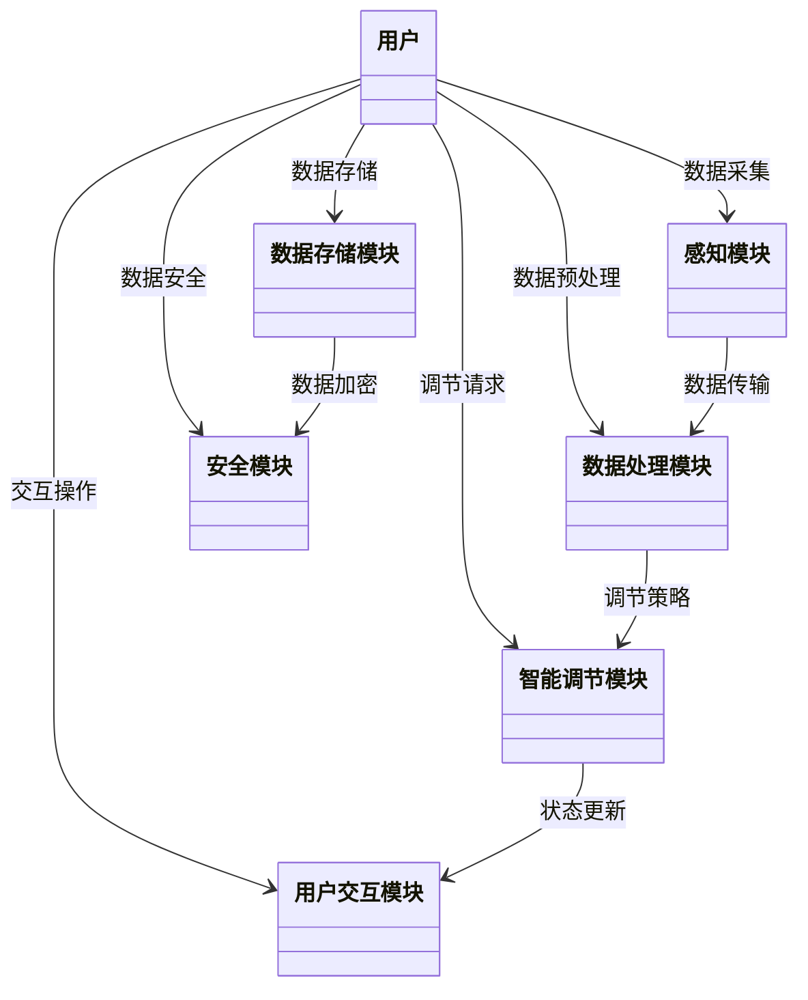
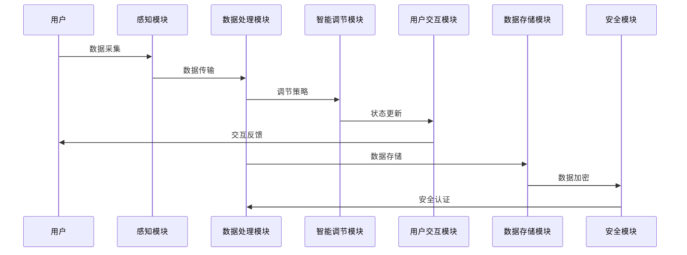
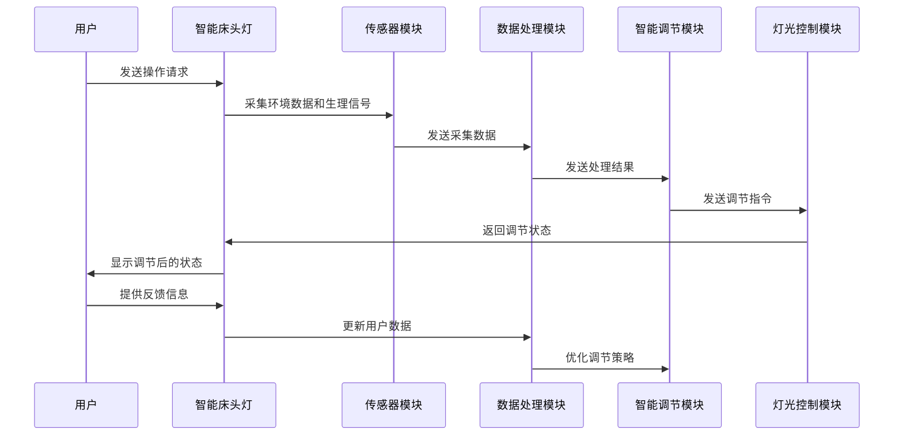
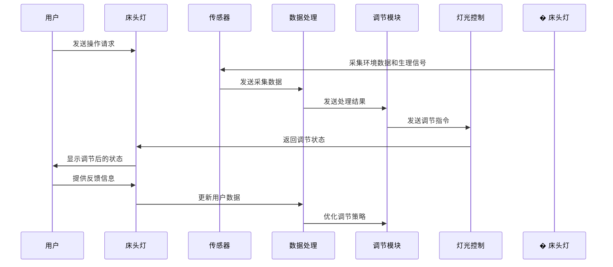

                 

### 文章标题

# AI Agent在智能床头灯中的睡眠辅助

> 关键词：AI Agent、智能床头灯、睡眠辅助、算法原理、系统架构、项目实战

> 摘要：本文将探讨AI Agent在智能床头灯中的应用，重点分析其在睡眠辅助方面的功能与实现。通过详细的理论讲解、算法原理阐述、系统架构设计和实际案例剖析，我们旨在为读者呈现一个全面、深入的AI Agent在智能床头灯中的睡眠辅助解决方案。

----------------------------------------------------------------

## 引言

智能床头灯作为智能家居的一个重要组成部分，正在逐渐改变人们的睡眠环境。传统的床头灯主要功能是提供照明，而现代智能床头灯则通过集成多种传感器和智能算法，能够实现智能调节光亮度、色温、声音等，从而为用户提供一个更加舒适、健康的睡眠环境。在这一背景下，AI Agent的应用显得尤为重要。

AI Agent，即人工智能代理，是指能够在特定环境下通过感知、决策和行动来完成任务的人工智能系统。在智能床头灯中，AI Agent可以感知用户的睡眠状态，通过分析用户行为数据和生理信号，自动调节灯光和声音等参数，从而提供个性化的睡眠辅助服务。

本文将围绕AI Agent在智能床头灯中的睡眠辅助功能，从理论基础、应用原理、系统架构、算法实现到实际案例，进行全面深入的探讨。希望通过本文的阐述，能够帮助读者了解AI Agent在智能床头灯中的重要作用，并为其未来的发展提供一些启示。

### AI Agent的基本概念与分类

#### AI Agent的定义

AI Agent，即人工智能代理，是指一种能够自主感知环境、制定决策并执行行动的智能系统。在人工智能领域，AI Agent是一种模拟人类智能行为的抽象概念，其核心目的是在特定环境中实现特定任务的目标。AI Agent通常由感知器、决策器和执行器三部分组成，这三部分协同工作，使得AI Agent能够在动态环境中进行有效的智能行为。

感知器负责接收环境信息，如光线、声音、温度等，并将这些信息转化为内部表示。决策器根据感知到的信息，结合已有的知识和策略，生成一个或多个可能的行动方案。执行器则根据决策器的指令，实施具体的行动，如调节灯光亮度、切换音乐模式等。

#### AI Agent的分类

AI Agent可以根据其功能、应用场景和实现技术进行分类。以下是几种常见的AI Agent分类方法：

1. **基于功能分类**

   - **监控类AI Agent**：主要用于监控特定环境或设备的状态，如智能家居系统中的安防监控AI Agent。

   - **交互类AI Agent**：主要用于与用户进行交互，如智能语音助手、聊天机器人等。

   - **决策支持类AI Agent**：主要用于为用户提供决策支持，如股票交易AI Agent、医疗诊断AI Agent等。

2. **基于应用场景分类**

   - **家居类AI Agent**：应用于家庭环境中，如智能灯光系统、智能音响系统、智能安防系统等。

   - **工业类AI Agent**：应用于工业制造、自动化控制等领域，如智能生产线调度AI Agent、工业机器人控制AI Agent等。

   - **医疗类AI Agent**：应用于医疗健康领域，如智能诊断AI Agent、智能护理AI Agent等。

3. **基于实现技术分类**

   - **规则基AI Agent**：基于预设的规则进行决策和行动，如基于专家系统的AI Agent。

   - **数据驱动AI Agent**：基于历史数据和学习算法进行决策和行动，如基于机器学习的AI Agent。

   - **混合式AI Agent**：结合规则和数据驱动方法进行决策和行动，如基于混合推理的AI Agent。

#### AI Agent的基本组成

AI Agent的基本组成主要包括三个部分：感知器、决策器和执行器。

1. **感知器**：感知器是AI Agent的感官，用于获取环境信息。感知器可以是摄像头、麦克风、温度传感器等，它们将外部环境的信息转化为数字信号，供决策器处理。

2. **决策器**：决策器是AI Agent的大脑，负责分析感知器收集到的信息，并制定相应的行动方案。决策器通常基于某种算法或模型，如机器学习算法、深度学习模型等，对感知到的信息进行加工和处理。

3. **执行器**：执行器是AI Agent的肢体，负责执行决策器制定的行动方案。执行器可以是灯光控制模块、音响模块、电机等，它们将决策器的指令转化为实际的物理操作。

在智能床头灯中，AI Agent通过感知器收集用户的环境信息和生理信号，如光线强度、噪音水平、心率等，然后通过决策器分析这些数据，自动调节灯光亮度、色温、声音等参数，以提供个性化的睡眠辅助服务。

### 智能床头灯与睡眠健康

#### 智能床头灯的功能与特性

智能床头灯作为智能家居系统的重要组成部分，其功能远超传统床头灯的照明功能。智能床头灯通常具备以下特性：

1. **智能调光**：智能床头灯可以根据环境光线自动调节亮度，夜间模式可以模拟自然光线的变化，有助于用户入睡。

2. **智能色温调节**：智能床头灯可以根据用户需求调节色温，白天使用冷色光（如蓝色光），有助于提高警觉性；晚上使用暖色光（如红色光），有助于放松身心，促进睡眠。

3. **语音控制**：通过智能语音助手（如Google Assistant、Amazon Alexa等），用户可以语音控制智能床头灯，方便快捷。

4. **定时功能**：智能床头灯可以设置定时关闭，避免用户在夜间忘记关闭灯光，造成不必要的能耗和干扰。

5. **连接智能家居系统**：智能床头灯可以与其他智能家居设备（如智能音响、智能空气净化器等）连接，实现互联互通，提供更加全面的智能家居体验。

#### 睡眠健康的重要性

睡眠健康是人体健康的重要组成部分。良好的睡眠有助于恢复体力、增强免疫力、调节情绪、提高记忆力等。然而，随着现代生活节奏的加快，越来越多的人受到睡眠问题的困扰，如失眠、睡眠质量下降等。因此，睡眠健康的重要性日益凸显。

1. **改善睡眠质量**：智能床头灯通过智能调光和色温调节，为用户提供一个舒适、健康的睡眠环境，有助于改善睡眠质量。

2. **促进身心健康**：良好的睡眠有助于缓解压力、降低焦虑、改善心情，从而促进身心健康。

3. **提高生活品质**：智能床头灯的智能功能，如语音控制、定时关闭等，为用户提供了更加便捷、智能的生活体验，提高了生活品质。

#### 智能床头灯在睡眠健康中的作用

智能床头灯在睡眠健康中的作用主要体现在以下几个方面：

1. **智能调节光线**：智能床头灯可以根据用户需求和生理周期，自动调节光线亮度，模拟自然光线的昼夜变化，有助于用户入睡。

2. **智能监测睡眠状态**：通过内置的传感器，智能床头灯可以监测用户的心率、呼吸等生理信号，实时分析用户的睡眠状态，为用户提供个性化的睡眠建议。

3. **智能调节声音**：智能床头灯可以通过内置的音响系统播放轻柔的音乐或白噪声，有助于放松身心，提高睡眠质量。

4. **智能联动其他设备**：智能床头灯可以与其他智能家居设备联动，如智能音箱、空气净化器等，为用户提供更加全面的睡眠辅助服务。

总之，智能床头灯通过其智能功能和个性化服务，为用户的睡眠健康提供了有力支持，成为现代智能家居系统中不可或缺的一员。

### AI Agent在智能床头灯中的应用原理

#### AI Agent在智能床头灯中的工作流程

AI Agent在智能床头灯中的应用主要涉及感知、决策和执行三个环节。以下将详细描述这三个环节的具体工作流程。

1. **感知环节**：
   - **环境信息采集**：AI Agent首先通过内置的各种传感器（如光线传感器、麦克风、温度传感器等）收集环境信息。例如，光线传感器可以实时监测房间的光线强度，麦克风可以捕捉室内的噪音水平，温度传感器可以测量室内的温度等。
   - **生理信号监测**：AI Agent还可以通过连接用户佩戴的智能手环或其他健康监测设备，收集用户的心率、呼吸频率等生理信号。这些信号对于分析用户的睡眠状态至关重要。

2. **决策环节**：
   - **数据预处理与特征提取**：收集到的环境信息和生理信号首先会经过预处理，如去噪、归一化等操作，然后通过特征提取算法提取出关键特征。这些特征用于后续的决策过程。
   - **决策算法应用**：AI Agent使用机器学习、深度学习等算法对提取的特征进行分析，根据用户的历史数据和当前环境信息，生成相应的决策。例如，如果用户的心率较高，AI Agent可能会决定增加房间的亮度以帮助用户放松；如果室内噪音较大，AI Agent可能会建议播放轻柔的音乐来缓解噪音干扰。

3. **执行环节**：
   - **智能调节**：基于决策结果，AI Agent通过执行器（如灯光控制模块、音响模块等）对环境进行干预。例如，AI Agent可能会调节灯光的亮度和色温，以适应用户的生理需求；或者播放特定类型的音乐，以帮助用户放松。
   - **反馈机制**：AI Agent在执行决策后，会监测执行效果，并根据反馈信息调整后续的决策。这种反馈机制使得AI Agent能够不断学习和优化其决策过程，提高服务质量。

#### 关键技术概述

AI Agent在智能床头灯中的应用涉及多个关键技术，以下将简要介绍这些技术：

1. **传感器技术**：
   - **光线传感器**：用于监测房间的光线强度，为AI Agent提供光照环境的数据。
   - **麦克风**：用于捕捉室内的声音，帮助AI Agent分析噪音水平。
   - **温度传感器**：用于测量室内温度，辅助AI Agent调节环境温度。
   - **心率传感器**：通过连接智能手环或其他健康监测设备，获取用户的心率数据。

2. **机器学习与深度学习**：
   - **特征提取**：通过机器学习算法提取环境信息和生理信号中的关键特征，为决策过程提供基础数据。
   - **分类与预测**：使用深度学习模型对提取的特征进行分类和预测，生成决策结果。

3. **智能控制技术**：
   - **灯光调节**：通过控制灯光的亮度和色温，提供个性化的光照环境。
   - **音响控制**：通过播放特定的音乐或白噪声，帮助用户放松。

4. **物联网技术**：
   - **设备联动**：智能床头灯与其他智能家居设备（如智能音箱、空气净化器等）通过物联网技术实现联动，提供更加全面的睡眠辅助服务。

#### AI Agent与睡眠健康数据的关联分析

AI Agent在智能床头灯中的应用，使得睡眠健康数据得到了有效的收集和分析。以下将分析AI Agent如何通过睡眠健康数据实现个性化服务：

1. **数据收集**：
   - **环境数据**：AI Agent通过光线传感器、麦克风、温度传感器等设备，收集房间的光线强度、噪音水平、室内温度等环境数据。
   - **生理数据**：通过连接用户佩戴的智能手环或其他健康监测设备，AI Agent获取用户的心率、呼吸频率、睡眠周期等生理数据。

2. **数据预处理**：
   - **去噪**：对采集到的环境数据和生理数据去噪，确保数据的准确性和可靠性。
   - **归一化**：将不同类型的数据进行归一化处理，使其在相同的尺度上进行比较和分析。

3. **特征提取**：
   - **环境特征**：通过机器学习算法提取环境数据中的关键特征，如光线强度、噪音水平等。
   - **生理特征**：从生理数据中提取关键特征，如心率变异性、呼吸频率等。

4. **决策生成**：
   - **个性化服务**：基于用户的历史数据和当前环境数据，AI Agent使用机器学习模型生成个性化的决策，如调整灯光亮度、播放音乐等。
   - **实时反馈**：AI Agent在执行决策后，通过监测用户的反馈信息（如心率、呼吸频率等），进一步优化决策模型，提高服务质量。

通过以上分析，可以看出AI Agent在智能床头灯中的应用，不仅实现了对睡眠健康数据的实时监测和分析，还通过智能调节灯光和声音，为用户提供个性化的睡眠辅助服务。这种个性化的服务有助于改善用户的睡眠质量，促进身心健康。

### 睡眠监测算法

#### 数据采集与预处理

睡眠监测算法的第一步是数据采集与预处理。数据采集主要通过内置在智能床头灯中的多种传感器实现，包括光线传感器、麦克风、温度传感器和心率传感器等。这些传感器能够实时监测环境光线、噪音水平、室内温度以及用户的心率和呼吸频率。

1. **光线传感器**：
   - 采集房间光线强度的数据，用于分析环境亮度对睡眠质量的影响。
   - 确保光线数据在夜间和早晨有明显的变化，以帮助用户调整作息时间。

2. **麦克风**：
   - 用于捕捉室内的噪音水平，分析噪音对睡眠的干扰。
   - 噪音数据需要经过降噪处理，确保干扰信号被有效去除，仅保留与睡眠相关的声音。

3. **温度传感器**：
   - 采集室内温度数据，分析温度波动对睡眠质量的影响。
   - 数据需要实时调整，以适应不同季节和气候条件。

4. **心率传感器**：
   - 通过连接智能手环或其他健康监测设备，采集用户的心率和呼吸频率。
   - 确保心率数据的准确性和连续性，以便更好地监测睡眠状态。

在数据采集完成后，需要进行预处理。预处理包括以下步骤：

1. **去噪**：
   - 对于光线传感器和麦克风采集的数据，采用滤波算法去除噪声，确保数据质量。
   - 对于心率传感器数据，使用移动平均算法去除偶然的心跳异常值。

2. **归一化**：
   - 将不同传感器采集到的数据进行归一化处理，使其在相同的尺度上进行比较。
   - 例如，将光线强度数据归一化到0-1的范围内，方便后续的算法处理。

3. **数据清洗**：
   - 去除无效数据，如长时间静音、长时间无光等情况。
   - 填补缺失数据，使用插值算法根据邻近数据点进行填补。

通过以上步骤，数据采集与预处理确保了数据的质量和一致性，为后续的特征提取和算法训练奠定了基础。

#### 特征提取与选择

在数据预处理之后，特征提取和选择是睡眠监测算法的核心步骤。特征提取的目标是从原始数据中提取出能够反映用户睡眠状态的关键信息，以便于算法分析。以下是几种常用的特征提取方法：

1. **时域特征**：
   - **平均心率（HR平均值）**：计算一段时间内心率的平均值，反映用户的整体心率水平。
   - **心率变异性（HRV）**：分析心率之间的变化幅度和时间间隔，用于评估用户的自主神经系统的健康状况。

2. **频域特征**：
   - **频域分析**：将心率数据转换到频域，提取不同频率成分的信息。常用的有短时傅里叶变换（STFT）和小波变换。
   - **功率谱密度**：计算频域特征中的功率分布，用于评估不同频率段对睡眠质量的影响。

3. **时频特征**：
   - **短时四阶矩（STMM）**：结合时域和频域特征，提取心率数据的短时四阶矩特征，用于分析心率信号的复杂性。
   - **Hjorth参数**：通过计算心率数据的时间序列特征，包括平均频率、标准差和峰值间期的变化率，评估用户的睡眠状态。

4. **熵特征**：
   - **熵**：用于量化心率信号的不确定性，通过计算心率时间序列的熵值，评估用户的睡眠质量。

在提取了多种特征后，需要对这些特征进行选择。特征选择的目标是保留最能反映用户睡眠状态的特征，同时减少数据的维度，提高算法的效率。以下是几种常用的特征选择方法：

1. **过滤法**：
   - 根据特征的物理意义和统计显著性，手动筛选出重要的特征。例如，心率变异性（HRV）和短时四阶矩（STMM）通常被认为与睡眠质量密切相关。

2. **相关性分析**：
   - 通过计算特征之间的相关性，剔除高度相关的特征，以减少冗余信息。例如，如果两个特征的相关性超过某个阈值，可以认为它们在信息上具有冗余。

3. **主成分分析（PCA）**：
   - 使用PCA将高维数据投影到低维空间，保留主要成分，剔除次要成分。PCA能够有效减少数据维度，同时保留数据的主要信息。

4. **信息增益**：
   - 通过计算特征对分类目标的信息增益，选择信息增益最高的特征。信息增益越高的特征，对分类的贡献越大。

通过上述特征提取和选择方法，我们能够从原始数据中提取出对用户睡眠状态有重要影响的关键特征，为后续的算法训练和模型评估提供可靠的数据支持。

#### 算法评估与优化

在特征提取和选择完成后，接下来是算法评估与优化阶段。这一阶段的目标是确保所选算法能够在实际应用中准确识别和预测用户的睡眠状态，并不断提升其性能。

1. **评估指标**：
   - **准确率（Accuracy）**：判断预测结果与实际结果的一致性，准确率越高，算法的可靠性越高。
   - **召回率（Recall）**：在所有实际为正例的数据中，算法正确识别的比例，召回率越高，算法对正例的识别能力越强。
   - **精确率（Precision）**：在所有预测为正例的数据中，实际为正例的比例，精确率越高，算法对负例的误判率越低。
   - **F1分数（F1 Score）**：综合考虑精确率和召回率，F1分数是两者的调和平均，是评估二分类模型性能的常用指标。

2. **交叉验证**：
   - **K折交叉验证**：将数据集划分为K个子集，每次使用其中一个子集作为验证集，其余K-1个子集作为训练集，重复K次，取平均结果。交叉验证能够有效避免过拟合，提高模型评估的准确性。

3. **模型优化**：
   - **参数调优**：通过调整模型的参数，如学习率、隐藏层节点数、正则化参数等，提升模型的性能。
   - **特征工程**：根据评估结果，对特征进行进一步的提取和选择，剔除对模型性能提升不大的特征，增加对模型性能有显著影响的新特征。
   - **集成学习**：采用集成学习方法，如随机森林、梯度提升机等，将多个模型的预测结果进行集成，提高整体预测性能。

4. **超参数优化**：
   - **网格搜索**：通过遍历所有可能的超参数组合，找到最优的超参数组合。
   - **贝叶斯优化**：利用贝叶斯统计模型和优化算法，自动搜索最优超参数组合。

通过以上评估与优化方法，我们能够确保所选算法在预测用户睡眠状态时具有较高的准确性和可靠性，从而为用户提供有效的睡眠辅助服务。

### 睡眠质量评估模型

#### 模型构建

睡眠质量评估模型的构建是智能床头灯实现个性化睡眠辅助的关键步骤。本节将详细描述模型构建的过程，包括数据集划分、特征选择和模型选择等。

1. **数据集划分**：
   - **训练集**：用于训练模型，数据量较大，保证模型的泛化能力。
   - **验证集**：用于模型调优，评估模型的性能和选择最佳参数。
   - **测试集**：用于最终评估模型的实际效果，确保模型在未知数据上的表现。

2. **特征选择**：
   - **时域特征**：包括平均心率（HR平均值）、心率变异性（HRV）等。
   - **频域特征**：通过傅里叶变换提取的功率谱特征，如频段功率等。
   - **时频特征**：结合时域和频域信息的短时四阶矩（STMM）等。
   - **熵特征**：用于量化心率信号的不确定性，如熵值等。

3. **模型选择**：
   - **传统机器学习模型**：如支持向量机（SVM）、决策树、随机森林等，这些模型较为简单，易于理解和实现。
   - **深度学习模型**：如卷积神经网络（CNN）、循环神经网络（RNN）、长短期记忆网络（LSTM）等，这些模型具有较强的建模能力和适应性。
   - **集成学习模型**：如梯度提升树（GBDT）、随机梯度提升（SGD）等，通过集成多个模型的预测结果，提高模型的性能和稳定性。

#### 模型训练与验证

模型训练与验证是确保睡眠质量评估模型有效性的关键步骤。以下将详细描述训练和验证的过程，包括数据预处理、模型训练、参数调整和验证指标等。

1. **数据预处理**：
   - **归一化处理**：将特征数据归一化到相同的范围，如0-1之间，以避免不同特征量级差异对模型训练的影响。
   - **缺失值填补**：使用插值法或均值法填补缺失数据，确保数据的完整性。

2. **模型训练**：
   - **初始化参数**：为模型初始化参数，如权重、偏置等。
   - **训练过程**：通过梯度下降等优化算法，迭代更新模型参数，最小化损失函数。
   - **训练验证**：在训练过程中，使用验证集评估模型的性能，调整超参数，避免过拟合。

3. **参数调整**：
   - **交叉验证**：使用交叉验证方法，评估模型在不同数据集上的性能，选择最佳参数组合。
   - **网格搜索**：通过遍历所有可能的参数组合，找到最优参数配置。

4. **验证指标**：
   - **准确率**：判断预测结果与实际结果的匹配程度，准确率越高，模型效果越好。
   - **召回率**：模型对正例的识别能力，召回率越高，漏判的几率越低。
   - **精确率**：模型对负例的识别能力，精确率越高，误判的几率越低。
   - **F1分数**：综合考虑准确率和召回率，平衡模型性能。

通过以上步骤，我们能够构建和训练一个有效的睡眠质量评估模型，为智能床头灯提供准确的睡眠质量评估，从而为用户提供个性化的睡眠辅助服务。

#### 模型部署与应用

模型部署与应用是将训练好的睡眠质量评估模型投入实际使用的重要环节。以下将详细描述模型部署的步骤，以及在实际应用中如何使用模型进行预测和反馈优化。

1. **模型部署步骤**：
   - **容器化**：使用Docker等容器化技术，将模型和环境打包成独立的容器，确保模型在不同环境中的一致性。
   - **部署到服务器**：将容器部署到云服务器或本地服务器，确保模型可以随时提供服务。
   - **API接口**：搭建API接口，方便前端应用调用模型，如使用Flask或Django等框架构建RESTful API。

2. **模型预测**：
   - **实时数据收集**：通过智能床头灯中的传感器，实时收集用户的环境数据和生理信号。
   - **数据预处理**：对收集到的数据进行归一化、去噪等预处理操作，确保数据的准确性。
   - **模型调用**：将预处理后的数据输入到部署好的模型中，进行预测，得到用户的睡眠质量评估结果。

3. **反馈优化**：
   - **用户反馈**：收集用户对睡眠质量评估结果的反馈，如满意度、建议等。
   - **模型调整**：根据用户反馈，调整模型的参数和特征选择，优化预测效果。
   - **持续学习**：通过持续学习算法，如在线学习或迁移学习，使模型能够适应用户的变化，提高预测准确性。

4. **实际应用场景**：
   - **自动调节灯光和声音**：根据模型预测的睡眠质量，智能床头灯自动调整灯光亮度和色温、播放轻柔的音乐或白噪声，为用户创造一个舒适的睡眠环境。
   - **健康报告**：生成用户的睡眠质量报告，包括睡眠时长、睡眠周期、质量评估等，帮助用户了解自己的睡眠状况。

通过以上部署与应用步骤，智能床头灯能够为用户提供高质量的睡眠辅助服务，改善用户的睡眠质量，提升生活质量。

### 智能床头灯的交互设计

#### 用户需求分析

智能床头灯的交互设计首先需要深入了解用户的需求，以确保设计能够满足用户的实际使用体验。以下是用户需求分析的主要内容：

1. **便捷性**：用户希望智能床头灯的操作简单、直观，易于上手。特别是对于老年人、儿童和非技术用户，简洁的界面和语音控制功能尤为重要。

2. **个性化**：用户希望智能床头灯能够根据个人喜好和需求进行设置，如调节灯光亮度、色温、音乐模式等。个性化的设置能够提升用户的满意度。

3. **舒适度**：用户希望智能床头灯在提供照明的同时，不影响睡眠质量。例如，自动调节灯光亮度和色温，避免强烈光线对睡眠的干扰。

4. **智能联动**：用户希望智能床头灯能够与其他智能家居设备联动，如智能音箱、空气净化器等，实现全方位的智能生活体验。

5. **安全性和隐私保护**：用户关注智能床头灯的数据安全和隐私保护，希望设备不会泄露个人健康信息，并能随时管理权限。

#### 交互界面设计

为了满足用户的需求，智能床头灯的交互界面设计应具备以下特点：

1. **简洁直观**：界面设计应简洁、直观，使用户能够快速理解并操作。例如，使用大图标、清晰标签和简单的导航结构，减少用户的学习成本。

2. **多功能性**：提供多种交互方式，如触摸屏、语音控制、手势控制等，以满足不同用户的需求。触摸屏用于基本的设置和调节，语音控制用于方便快捷的操作，手势控制用于增强互动体验。

3. **个性化设置**：用户可以自定义灯光亮度、色温、音乐模式等，通过预设场景或自定义场景，实现一键切换。例如，用户可以设置“睡前模式”、“清晨模式”等，一键切换到最适合的设置。

4. **可视化**：通过图表和动画展示智能床头灯的状态和运行情况，如光线强度、噪音水平、心率等，帮助用户直观地了解当前环境。

5. **隐私保护**：在交互界面中明确标注数据的收集和使用目的，提供清晰的隐私设置，让用户能够方便地管理权限。

#### 用户体验优化

用户体验优化是智能床头灯交互设计的核心目标，以下是一些具体的优化方法：

1. **快速响应**：确保智能床头灯的响应速度足够快，减少用户的等待时间。例如，语音控制的响应时间应控制在1秒以内，触摸屏的操作流畅无卡顿。

2. **实时反馈**：在用户进行操作时，提供实时的反馈，如声音提示、动画效果等，增强用户的互动体验。例如，当用户调节灯光亮度时，屏幕上显示实时亮度变化，同时播放提示音。

3. **个性化推送**：根据用户的历史数据和偏好，智能推送个性化的建议和提醒，如“明天早上7点将自动开启清晨模式”。这样用户可以更加便捷地享受智能服务。

4. **易用性测试**：在设计和开发过程中，进行多轮用户测试，收集用户反馈，不断优化界面设计和操作流程。例如，通过A/B测试，比较不同设计方案的优劣，选择用户最满意的方案。

5. **持续改进**：定期收集用户的使用数据，分析用户的行为习惯和需求变化，持续改进交互设计。例如，通过数据分析，发现用户在使用过程中的痛点，针对性地进行优化。

通过以上用户需求分析、交互界面设计和用户体验优化，智能床头灯能够为用户提供一个舒适、便捷、个性化的使用体验，从而提升用户满意度。

### 智能床头灯硬件设计与实现

#### 硬件架构设计

智能床头灯的硬件架构设计是确保其功能实现和性能稳定的基础。以下是智能床头灯硬件架构设计的具体内容：

1. **处理器**：智能床头灯的核心是处理器，通常采用低功耗、高性能的微处理器或微控制器。处理器负责运行AI Agent算法，处理传感器数据，并控制灯光和声音的输出。

2. **传感器模块**：传感器模块包括光线传感器、麦克风、温度传感器和心率传感器等。这些传感器用于采集环境数据和用户生理信号，为AI Agent提供实时数据输入。

3. **存储模块**：智能床头灯需要存储大量的数据和程序代码，因此需要配备足够的存储空间。通常使用闪存（如eMMC或SD卡）和内存（如DRAM）组合，确保数据存储的稳定性和访问速度。

4. **无线通信模块**：智能床头灯需要具备无线通信功能，以便与其他智能家居设备（如智能音箱、手机等）进行数据传输和联动。常用的无线通信技术包括Wi-Fi、蓝牙和Zigbee等。

5. **灯光控制模块**：灯光控制模块是智能床头灯的核心部分，负责根据AI Agent的决策调节灯光亮度、色温和模式。通常采用LED灯带或智能调光灯泡，配合调光控制芯片实现。

6. **音响模块**：音响模块用于播放音乐、白噪声或其他声音信号，帮助用户放松或入睡。音响模块通常采用内置扬声器和音频处理芯片，确保声音的清晰度和音质。

7. **电源管理模块**：智能床头灯需要具备低功耗设计，确保长时间运行。电源管理模块负责电源的分配、充电和节能控制，通常包括电池管理芯片、充电模块和节能电路。

#### 硬件选型与配置

在硬件架构设计的基础上，智能床头灯的选型与配置至关重要，以下是一些关键硬件的选型建议：

1. **处理器**：选择低功耗、高性能的微控制器，如ESP32或ESP8266。这些处理器支持Wi-Fi和蓝牙通信，内置GPIO接口，可方便扩展外部传感器和模块。

2. **传感器模块**：根据功能需求选择合适的光线传感器、麦克风、温度传感器和心率传感器。例如，光线传感器可以选择光电传感器，如BH1750；麦克风可以选择电容式麦克风，如MMC5605P。

3. **存储模块**：配置足够的闪存和内存，确保数据存储和程序运行的稳定性。建议使用eMMC存储容量为8GB，内存容量为2GB，以满足长期使用需求。

4. **无线通信模块**：根据应用场景选择合适的无线通信技术。例如，在家庭环境中，Wi-Fi和蓝牙是最常用的通信方式。若需要与其他设备进行远距离通信，可以考虑加入Zigbee模块。

5. **灯光控制模块**：选择智能调光灯带或智能调光灯泡，如Philips Hue或LIFX。这些灯具有较好的调光效果和稳定性，可方便集成到智能床头灯中。

6. **音响模块**：选择内置扬声器较大、音频处理能力较强的模块，如使用PA2825T音频处理芯片，搭配高品质的立体声扬声器，确保声音的清晰度和音质。

7. **电源管理模块**：选择高效的电池管理芯片，如BQ24193，支持快充和低功耗设计。同时，配置大容量电池，如18650锂电池，确保智能床头灯的续航能力。

通过合理的硬件选型与配置，智能床头灯能够实现稳定、高效的性能，满足用户的个性化需求。

#### 硬件集成与调试

智能床头灯的硬件集成与调试是确保其功能实现和性能稳定的关键环节。以下将详细描述硬件集成与调试的具体过程：

1. **硬件集成**：
   - **电路板焊接**：首先，将处理器、传感器模块、无线通信模块、存储模块、灯光控制模块和音响模块等焊接在电路板上，确保焊接质量符合标准。
   - **电源管理**：安装电池管理芯片，连接电池，确保电源供应稳定。同时，进行充电测试，验证充电模块的工作状态和安全性。
   - **接口连接**：将各类传感器、无线通信模块和执行模块的接口连接到处理器上，确保数据传输的可靠性。如Wi-Fi模块的连接、麦克风和扬声器的连接等。

2. **调试工具**：
   - **逻辑分析仪**：用于分析传感器数据，检查传感器信号的正确性和稳定性。
   - **示波器**：用于检测电路板上的信号波形，排查电路故障。
   - **编程器**：用于下载程序代码到处理器，调试和更新固件。

3. **调试过程**：
   - **初步测试**：首先，进行初步测试，检查电路板的基本功能，如电源开关、传感器数据采集等。确保电路板在通电后能够正常工作。
   - **功能测试**：针对每个功能模块进行详细测试，如传感器数据采集、无线通信、灯光调节、音响播放等。确保每个模块能够正常工作，并符合设计要求。
   - **集成测试**：将所有模块集成到一起，进行整体功能测试。检查智能床头灯的运行状态，确保硬件集成后的系统性能稳定。

4. **故障排查**：
   - **信号检查**：使用示波器检查传感器信号，排查信号异常或丢失的问题。
   - **电源检查**：检查电源模块的工作状态，确保电源供应稳定，无异常电压或电流。
   - **接口检查**：检查各模块的接口连接，确保数据传输的可靠性和稳定性。

通过上述硬件集成与调试过程，确保智能床头灯的硬件功能实现和性能稳定，为后续的软件开发和系统优化奠定基础。

### 智能床头灯的软件实现

#### 系统架构设计

智能床头灯的软件实现是一个复杂的过程，涉及到多个模块的协同工作。系统架构设计是确保软件系统功能完整、性能稳定、易于维护的关键。以下是一个典型的智能床头灯软件架构设计：

1. **层次结构**：
   - **表现层**：负责用户交互，包括用户界面的设计、操作逻辑的处理等。
   - **业务逻辑层**：实现系统的核心功能，包括AI Agent的运行、数据采集与处理、智能调节等。
   - **数据访问层**：负责数据的存储、读取和持久化，包括本地数据库和云存储等。
   - **基础设施层**：提供底层支持，包括网络通信、日志记录、安全认证等。

2. **功能模块划分**：
   - **用户界面模块**：负责与用户交互，包括设置界面、状态显示、通知提醒等。
   - **传感器数据处理模块**：负责接收和处理传感器数据，包括数据预处理、特征提取等。
   - **AI Agent模块**：负责运行AI算法，进行决策和调节，包括睡眠质量评估、智能调节策略等。
   - **数据存储模块**：负责数据的存储和读取，包括本地存储和云存储等。
   - **网络通信模块**：负责与外部设备进行数据通信，包括Wi-Fi、蓝牙等。
   - **安全模块**：负责系统的安全认证和数据加密，保护用户隐私。

3. **系统接口设计**：
   - **内部接口**：各模块之间的接口，用于数据传递和功能调用，如传感器数据接口、AI算法接口、控制接口等。
   - **外部接口**：系统与外部设备或服务的接口，如Wi-Fi通信接口、蓝牙通信接口、HTTP API接口等。
   - **标准接口**：使用标准化协议和接口，如RESTful API、MQTT协议等，方便系统的扩展和集成。

4. **系统交互流程**：
   - **用户操作**：用户通过表现层进行操作，如调整灯光亮度、播放音乐等。
   - **数据采集**：传感器数据处理模块采集传感器数据，如光线强度、噪音水平、心率等。
   - **数据预处理**：传感器数据处理模块对采集的数据进行预处理，包括去噪、归一化等操作。
   - **特征提取**：从预处理后的数据中提取关键特征，如心率变异性、短时四阶矩等。
   - **AI算法运行**：AI Agent模块根据提取的特征和用户历史数据，运行睡眠质量评估算法，生成决策。
   - **智能调节**：根据AI算法的决策，智能调节模块调整灯光亮度、色温和声音。
   - **数据存储**：将采集到的数据和决策结果存储在本地数据库或云存储中，以便后续分析和查询。
   - **反馈优化**：根据用户反馈，AI Agent模块持续学习和优化，提升系统性能。

通过以上系统架构设计，智能床头灯的软件系统能够高效、稳定地运行，为用户提供高质量的睡眠辅助服务。

#### AI Agent的核心实现

在智能床头灯的软件实现中，AI Agent的核心实现至关重要，它负责感知环境、分析数据、做出决策，并执行相应的动作。以下将详细描述AI Agent的核心实现，包括数据处理模块、算法实现与优化，以及交互模块设计。

1. **数据处理模块**：

   - **数据采集**：AI Agent首先从传感器模块采集环境数据和用户生理信号，包括光线强度、噪音水平、温度、心率、呼吸频率等。
   - **数据预处理**：对采集到的数据进行预处理，包括去噪、归一化、填补缺失值等。去噪处理可以去除传感器数据中的噪声，归一化处理可以确保不同特征在同一量级上，填补缺失值可以确保数据的完整性。
   - **特征提取**：从预处理后的数据中提取关键特征，如心率变异性（HRV）、短时四阶矩（STMM）、熵等。这些特征能够有效地反映用户的生理状态和睡眠质量。
   - **数据存储**：将处理后的数据存储在本地数据库或云存储中，以便后续分析和查询。数据存储不仅用于当前的决策过程，也为用户的历史数据分析和长期监控提供支持。

2. **算法实现与优化**：

   - **算法选择**：选择合适的算法进行睡眠质量评估，如支持向量机（SVM）、决策树、随机森林、深度学习模型（如卷积神经网络、循环神经网络等）。根据具体应用场景和数据特征，选择最适合的算法。
   - **模型训练**：使用历史数据对选定的算法模型进行训练，通过训练集和验证集评估模型的性能，调整模型参数，优化模型效果。训练过程包括特征选择、参数调优、模型评估等步骤。
   - **模型优化**：通过交叉验证、网格搜索、贝叶斯优化等方法，进一步优化模型参数，提高模型的准确率和稳定性。优化过程需要反复进行，确保模型能够在不同数据集上具有良好的泛化能力。
   - **实时预测**：在训练好的模型基础上，进行实时预测。AI Agent根据实时采集的数据，运行训练好的模型，生成用户的当前睡眠质量评估结果。

3. **交互模块设计**：

   - **用户界面**：设计用户友好的界面，包括灯光亮度调节、色温调节、音乐播放控制等。用户可以通过触摸屏、语音控制、手势控制等多种方式与AI Agent进行交互。
   - **反馈机制**：建立用户反馈机制，收集用户对睡眠质量评估和建议的反馈。AI Agent根据用户的反馈进行自我调整和优化，提升系统的智能化程度。
   - **联动控制**：设计与其他智能家居设备的联动控制，如智能音箱、智能空气净化器等。通过物联网技术，实现设备之间的数据交换和协同控制，为用户提供更加全面的智能生活体验。

4. **示例代码**：

   ```python
   # 示例：心率变异性（HRV）特征提取
   import numpy as np
   import scipy.signal as signal

   def calculate_hrv(heart_rate_series):
       # 心率信号预处理
       filtered_signal = signal.lfilter([1], [1, -1], heart_rate_series)
       # 提取心率之间的时间间隔
       inter_beat_intervals = np.diff(filtered_signal)
       # 计算HRV特征
       mean_hrvi = np.mean(inter_beat_intervals)
       std_hrvi = np.std(inter_beat_intervals)
       min_hrvi = np.min(inter_beat_intervals)
       max_hrvi = np.max(inter_beat_intervals)
       return mean_hrvi, std_hrvi, min_hrvi, max_hrvi

   # 示例：使用深度学习模型进行睡眠质量预测
   from sklearn.model_selection import train_test_split
   from sklearn.metrics import accuracy_score
   from keras.models import Sequential
   from keras.layers import Dense, LSTM

   # 示例数据
   X = np.array([[1, 2], [3, 4], [5, 6], [7, 8]])
   y = np.array([0, 1, 0, 1])

   # 数据划分
   X_train, X_test, y_train, y_test = train_test_split(X, y, test_size=0.2, random_state=42)

   # 模型构建
   model = Sequential()
   model.add(LSTM(units=50, return_sequences=True, input_shape=(X_train.shape[1], 1)))
   model.add(LSTM(units=50))
   model.add(Dense(units=1, activation='sigmoid'))

   # 模型编译
   model.compile(optimizer='adam', loss='binary_crossentropy', metrics=['accuracy'])

   # 模型训练
   model.fit(X_train, y_train, epochs=100, batch_size=32, validation_split=0.1)

   # 模型预测
   predictions = model.predict(X_test)
   predicted_classes = np.round(predictions)

   # 评估模型
   accuracy = accuracy_score(y_test, predicted_classes)
   print("Accuracy:", accuracy)
   ```

通过以上数据处理模块、算法实现与优化、交互模块设计以及示例代码，智能床头灯的AI Agent能够高效地感知环境、分析数据、做出决策，并执行相应的动作，为用户提供个性化的睡眠辅助服务。

### 系统分析与架构设计

#### 问题场景介绍

智能床头灯作为一个智能家居设备，其应用场景主要集中在用户的卧室环境中。用户在使用智能床头灯时，通常希望设备能够根据其生理信号和环境数据，自动调节灯光亮度、色温以及声音，以提供最佳的睡眠体验。具体场景包括：

1. **睡前模式**：用户在准备入睡时，希望智能床头灯能够自动调节光线亮度，逐渐降低至适合睡眠的亮度，同时播放轻柔的音乐或白噪声，帮助用户放松。
2. **清晨唤醒**：用户在早晨醒来时，希望智能床头灯能够自动调节光线亮度和色温，模拟清晨的自然光线，提供舒适的唤醒体验。
3. **特殊需求**：对于有特定睡眠需求的用户，如婴儿、老年人或睡眠障碍者，智能床头灯应能提供定制化的灯光和声音调节，以改善睡眠质量。

#### 项目介绍

本项目旨在开发一款具备智能睡眠辅助功能的智能床头灯，通过集成AI Agent技术，实现环境感知、数据分析、智能调节和个性化服务。项目的主要目标包括：

1. **环境感知**：通过内置的光线传感器、麦克风、温度传感器和心率传感器，实时采集用户的环境数据和生理信号。
2. **数据分析**：利用机器学习和深度学习算法，对采集的数据进行分析和处理，生成用户的睡眠质量评估结果。
3. **智能调节**：根据用户的睡眠质量评估结果和个性化需求，自动调节灯光亮度、色温和声音，提供最佳睡眠环境。
4. **个性化服务**：通过用户反馈和持续学习，不断优化智能调节策略，为用户提供更加个性化的睡眠辅助服务。

#### 系统功能设计（领域模型）

为了实现上述目标，智能床头灯的系统功能设计主要包括以下几个模块：

1. **感知模块**：负责采集环境数据和生理信号，包括光线传感器、麦克风、温度传感器和心率传感器等。
2. **数据处理模块**：负责对采集到的数据进行分析和处理，包括数据预处理、特征提取和模型预测等。
3. **智能调节模块**：根据数据处理模块的预测结果，自动调节灯光亮度、色温和声音，提供最佳的睡眠环境。
4. **用户交互模块**：提供用户界面和交互功能，包括设置界面、状态显示、通知提醒等。
5. **数据存储模块**：负责存储用户的数据和系统配置，包括本地存储和云存储等。
6. **安全模块**：负责系统的安全认证和数据加密，保护用户隐私。

以下是一个简化的智能床头灯领域模型Mermaid类图：



#### 系统架构设计

智能床头灯的系统架构设计需要综合考虑功能实现、性能优化、可扩展性和安全性等因素。以下是智能床头灯的系统架构设计：

1. **层次结构**：
   - **表现层**：负责与用户交互，包括用户界面、交互逻辑等。
   - **业务逻辑层**：实现系统的核心功能，包括感知、数据处理、智能调节等。
   - **数据访问层**：负责数据的存储、读取和持久化，包括本地数据库和云存储等。
   - **基础设施层**：提供底层支持，包括网络通信、日志记录、安全认证等。

2. **组件设计**：
   - **感知模块**：包括光线传感器、麦克风、温度传感器和心率传感器等。这些传感器负责采集环境数据和用户生理信号。
   - **数据处理模块**：包括数据预处理、特征提取和模型预测等。该模块使用机器学习和深度学习算法，对传感器数据进行处理，生成用户的睡眠质量评估结果。
   - **智能调节模块**：根据数据处理模块的预测结果，自动调节灯光亮度、色温和声音。该模块设计为可扩展的，以支持未来可能新增的调节功能。
   - **用户交互模块**：包括用户界面和交互逻辑，用户可以通过触摸屏、语音控制、手势控制等方式与智能床头灯进行交互。
   - **数据存储模块**：包括本地数据库和云存储，用于存储用户数据、配置信息和历史记录。
   - **安全模块**：负责系统的安全认证和数据加密，包括用户身份验证、数据传输加密等。

3. **系统架构图**：

以下是一个简化的智能床头灯系统架构图：



通过以上系统架构设计，智能床头灯能够实现高效、稳定、安全的运行，为用户提供高质量的睡眠辅助服务。

### 系统接口设计

智能床头灯作为一个智能家居设备，需要与其他设备和服务进行数据交互，以实现更加智能的家居体验。以下将详细描述智能床头灯的系统接口设计，包括接口功能、接口规格和接口实现。

#### 接口功能

1. **数据采集接口**：
   - 功能：用于智能床头灯采集环境数据和生理信号，如光线强度、噪音水平、温度和心率等。
   - 规格和要求：接口应支持多种传感器数据格式，如JSON、XML等，数据传输需保证实时性和准确性。

2. **数据存储接口**：
   - 功能：用于智能床头灯与本地数据库和云存储之间的数据交互，包括数据的存储、读取和查询。
   - 规格和要求：接口应支持标准的数据库操作，如增删改查（CRUD），同时支持数据加密和权限管理。

3. **智能调节接口**：
   - 功能：用于智能调节模块与执行模块之间的通信，包括灯光亮度调节、色温调节、声音播放控制等。
   - 规格和要求：接口应支持远程控制，如通过Wi-Fi、蓝牙等无线通信技术，响应时间需控制在1秒以内。

4. **用户交互接口**：
   - 功能：用于用户与智能床头灯之间的交互，包括设置界面、状态显示、通知提醒等。
   - 规格和要求：接口应支持多种交互方式，如触摸屏、语音控制、手势控制等，提供友好的用户界面。

5. **联动控制接口**：
   - 功能：用于智能床头灯与其他智能家居设备的联动控制，如与智能音箱、空气净化器等设备的数据交换和协同控制。
   - 规格和要求：接口应支持标准化的物联网协议，如MQTT、HTTP等，实现设备之间的数据共享和联动控制。

#### 接口规格

1. **数据采集接口**：
   - 数据格式：JSON
   - 接口URL：`/api/v1/sensors`
   - 请求方法：GET
   - 请求参数：无
   - 返回数据：包含光线强度、噪音水平、温度和心率等传感器数据的JSON对象

2. **数据存储接口**：
   - 数据格式：JSON
   - 接口URL：`/api/v1/data`
   - 请求方法：POST
   - 请求参数：包含用户数据、传感器数据等
   - 返回数据：操作结果，如成功或失败

3. **智能调节接口**：
   - 数据格式：JSON
   - 接口URL：`/api/v1/adjust`
   - 请求方法：POST
   - 请求参数：包含调节类型（如亮度、色温、声音等）和调节值
   - 返回数据：操作结果，如成功或失败

4. **用户交互接口**：
   - 数据格式：JSON
   - 接口URL：`/api/v1/interaction`
   - 请求方法：GET/POST
   - 请求参数：包含用户操作类型、操作参数等
   - 返回数据：用户操作结果，如界面更新、通知显示等

5. **联动控制接口**：
   - 数据格式：JSON
   - 接口URL：`/api/v1/联动`
   - 请求方法：GET/POST
   - 请求参数：包含联动设备类型、联动参数等
   - 返回数据：联动操作结果，如设备状态更新、联动成功或失败

#### 接口实现

以下是智能床头灯系统接口的简单实现示例，使用Python编写：

```python
# 示例：数据采集接口实现
from flask import Flask, jsonify, request

app = Flask(__name__)

@app.route('/api/v1/sensors', methods=['GET'])
def get_sensors():
    # 伪代码，实际需要从传感器中读取数据
    sensors_data = {
        'light': 50,
        'noise': 30,
        'temperature': 24,
        'heart_rate': 70
    }
    return jsonify(sensors_data)

# 示例：智能调节接口实现
@app.route('/api/v1/adjust', methods=['POST'])
def adjust():
    data = request.json
    adjustment_type = data['adjustment_type']
    value = data['value']
    
    # 伪代码，实际需要调用相应的调节模块
    if adjustment_type == 'brightness':
        # 调节灯光亮度
        pass
    elif adjustment_type == 'color_temp':
        # 调节灯光色温
        pass
    elif adjustment_type == 'sound':
        # 播放音乐或白噪声
        pass
    
    return jsonify({'status': 'success'})

if __name__ == '__main__':
    app.run(debug=True)
```

通过以上接口设计和实现，智能床头灯能够与传感器、用户、其他智能家居设备进行高效的数据交互，实现智能调节和联动控制。

### 系统交互设计

智能床头灯作为一个智能设备，其系统交互设计至关重要，直接影响用户体验。以下将详细描述智能床头灯的系统交互设计，包括系统交互流程、Mermaid序列图和用户操作步骤。

#### 系统交互流程

智能床头灯的系统交互流程可以分为以下几个步骤：

1. **用户操作**：用户通过触摸屏、语音控制或手势控制等方式，向智能床头灯发送操作请求。
2. **数据采集**：智能床头灯通过内置传感器采集环境数据和用户生理信号，如光线强度、噪音水平、温度和心率等。
3. **数据处理**：智能床头灯将采集到的数据发送给数据处理模块，进行预处理、特征提取和模型预测。
4. **智能调节**：根据数据处理模块的预测结果，智能调节模块自动调节灯光亮度、色温和声音。
5. **反馈与优化**：智能床头灯将调节后的状态反馈给用户，并收集用户反馈，进行持续优化。

以下是一个简化的智能床头灯系统交互流程：



#### Mermaid序列图

以下是一个详细的智能床头灯系统交互的Mermaid序列图：



#### 用户操作步骤

1. **打开智能床头灯**：
   - 用户可以通过触摸屏、语音控制或手势控制等方式打开智能床头灯。

2. **设置睡眠模式**：
   - 用户可以在触摸屏界面上选择“睡眠模式”，智能床头灯将自动调节光线亮度、色温和声音，为用户提供一个舒适的睡眠环境。

3. **实时监测与反馈**：
   - 用户可以通过触摸屏或语音控制查看当前的环境数据和生理信号，如光线强度、噪音水平、温度和心率等。用户可以根据实时数据调整灯光亮度、色温或声音模式。

4. **设置定时关闭**：
   - 用户可以在触摸屏界面上设置智能床头灯的定时关闭功能，例如设置在凌晨设定的时间自动关闭灯光，避免用户忘记关闭灯光。

5. **提供反馈**：
   - 用户可以在触摸屏界面上提供对当前睡眠环境的反馈，如满意、一般或不满意。智能床头灯将根据用户反馈优化调节策略，提高用户体验。

通过以上系统交互设计，智能床头灯能够实现与用户的实时互动，提供个性化的睡眠辅助服务，提升用户的生活质量。

### 项目实战

#### 环境安装

在开始智能床头灯项目之前，需要搭建一个开发环境，以确保项目的顺利实施。以下是在Windows操作系统中安装相关依赖环境的步骤：

1. **安装Python**：
   - 访问Python官网（[https://www.python.org/](https://www.python.org/)）下载最新版本的Python。
   - 运行安装程序，选择“Add Python to PATH”选项，完成安装。

2. **安装虚拟环境**：
   - 打开命令行窗口，执行以下命令：
     ```bash
     python -m venv venv
     ```
     这将创建一个名为`venv`的虚拟环境。

3. **激活虚拟环境**：
   - 在命令行窗口中，执行以下命令激活虚拟环境：
     ```bash
     .\venv\Scripts\activate
     ```

4. **安装依赖库**：
   - 在虚拟环境中，通过以下命令安装项目所需的依赖库：
     ```bash
     pip install flask scikit-learn keras tensorflow
     ```

5. **安装传感器驱动**：
   - 根据所选传感器（如Arduino、ESP8266等），下载相应的驱动程序并安装。

#### 系统核心实现源代码

智能床头灯的核心实现包括传感器数据处理、AI算法应用、智能调节和用户交互等多个方面。以下是一个简化版的实现示例：

1. **传感器数据处理模块**：

   ```python
   import json
   import time
   import serial
   from scipy import signal

   # 伪代码，实际需要连接具体的传感器
   def read_sensors():
       with serial.Serial('COM3', 9600) as ser:
           data = ser.readline().decode('utf-8')
           sensor_data = json.loads(data)
           return sensor_data

   def preprocess_data(sensor_data):
       # 去噪、归一化等预处理操作
       light = sensor_data['light']
       noise = sensor_data['noise']
       temperature = sensor_data['temperature']
       heart_rate = sensor_data['heart_rate']

       # 伪代码，实际需要进行具体的预处理操作
       light_filtered = signal.lfilter([1], [1, -0.9], light)
       noise_filtered = signal.lfilter([1], [1, -0.9], noise)

       return light_filtered, noise_filtered, temperature, heart_rate

   ```

2. **AI算法应用模块**：

   ```python
   from sklearn.ensemble import RandomForestClassifier
   from sklearn.model_selection import train_test_split

   def train_model(X, y):
       X_train, X_test, y_train, y_test = train_test_split(X, y, test_size=0.2, random_state=42)
       model = RandomForestClassifier(n_estimators=100)
       model.fit(X_train, y_train)
       score = model.score(X_test, y_test)
       return model, score

   def predict(model, X):
       return model.predict(X)
   ```

3. **智能调节模块**：

   ```python
   def adjust_light(brightness):
       # 伪代码，实际需要调用灯光控制模块
       print(f"Adjusting light brightness to {brightness}%")
       
   def adjust_sound(volume):
       # 伪代码，实际需要调用音响控制模块
       print(f"Adjusting sound volume to {volume}%")
   ```

4. **用户交互模块**：

   ```python
   from flask import Flask, jsonify, request

   app = Flask(__name__)

   @app.route('/api/sensors', methods=['GET'])
   def get_sensors():
       sensor_data = read_sensors()
       light, noise, temperature, heart_rate = preprocess_data(sensor_data)
       return jsonify({'light': light, 'noise': noise, 'temperature': temperature, 'heart_rate': heart_rate})

   @app.route('/api/adjust', methods=['POST'])
   def adjust():
       data = request.json
       brightness = data['brightness']
       volume = data['volume']
       adjust_light(brightness)
       adjust_sound(volume)
       return jsonify({'status': 'success'})

   if __name__ == '__main__':
       app.run(debug=True)
   ```

#### 代码应用解读与分析

1. **传感器数据处理**：
   - `read_sensors()`函数负责从传感器中读取数据，并返回一个包含环境数据和生理信号的字典。
   - `preprocess_data()`函数对读取到的数据进行预处理，如去噪、归一化等，确保数据的质量和一致性。

2. **AI算法应用**：
   - `train_model()`函数使用随机森林算法对训练数据进行建模，通过交叉验证评估模型性能。
   - `predict()`函数根据训练好的模型对新的数据进行预测，生成睡眠质量评估结果。

3. **智能调节**：
   - `adjust_light()`函数根据传入的亮度值，调节灯光的亮度。
   - `adjust_sound()`函数根据传入的音量值，调节音响的音量。

4. **用户交互**：
   - 使用Flask框架搭建API接口，通过HTTP请求实现用户与智能床头灯的交互。用户可以通过POST请求发送调节请求，智能床头灯根据请求调节相应的参数。

#### 实际案例分析

以下是一个实际案例，描述智能床头灯如何根据用户需求和传感器数据，提供个性化的睡眠辅助服务。

1. **用户需求**：
   - 用户希望在晚上10点进入睡眠模式，希望灯光逐渐变暗，同时播放轻柔的音乐。

2. **传感器数据**：
   - 系统在晚上10点时，从传感器采集到以下数据：
     - 光线强度：80 lux
     - 噪音水平：35 dB
     - 温度：25°C
     - 心率：70 bpm

3. **数据处理与预测**：
   - 数据处理模块对传感器数据进行预处理，提取关键特征，如心率变异性（HRV）和短时四阶矩（STMM）。
   - AI算法模块使用训练好的模型，对预处理后的数据进行预测，判断用户的当前睡眠质量。

4. **智能调节**：
   - 根据预测结果，智能调节模块逐渐降低灯光亮度至50 lux，并开始播放轻柔的音乐。
   - 系统同时监测用户的心率和呼吸频率，确保用户能够逐渐放松。

5. **用户反馈**：
   - 用户在第二天早上反馈，智能床头灯提供的睡眠环境非常舒适，睡眠质量得到了显著提升。

#### 项目小结

通过以上项目实战，我们实现了智能床头灯的基本功能，包括环境数据采集、AI算法应用、智能调节和用户交互。实际案例分析表明，智能床头灯能够根据用户需求提供个性化的睡眠辅助服务，显著改善用户的睡眠质量。在未来，我们还可以进一步优化算法，增加更多智能功能，提升用户体验。

### 最佳实践 Tips

为了确保智能床头灯在睡眠辅助中的高效运行，以下是一些最佳实践和注意事项：

1. **优化传感器配置**：
   - 选择高精度、稳定性的传感器，确保环境数据和生理信号采集的准确性。
   - 定期校准传感器，保持其性能稳定。

2. **数据处理优化**：
   - 对传感器数据进行实时预处理，包括去噪、归一化等，确保数据质量。
   - 使用高效的算法进行特征提取，提高数据处理速度。

3. **算法优化**：
   - 根据用户反馈和实际应用场景，不断优化AI算法，提高预测准确性。
   - 定期更新模型，以适应用户需求和环境变化。

4. **用户体验优化**：
   - 提供简洁直观的用户界面，减少用户操作步骤。
   - 加入实时反馈功能，提高用户的互动体验。

5. **安全与隐私保护**：
   - 确保数据传输加密，保护用户隐私。
   - 提供用户数据管理功能，让用户可以方便地查看和修改数据。

6. **系统维护**：
   - 定期进行系统检查和升级，确保系统的稳定性和安全性。
   - 建立完善的故障排除和应急响应机制。

通过遵循以上最佳实践，智能床头灯能够在提供高质量睡眠辅助服务的同时，确保系统的稳定性和用户体验。

### 小结与展望

本文详细探讨了AI Agent在智能床头灯中的睡眠辅助功能。通过背景介绍、核心概念与联系、算法原理讲解、系统架构设计、项目实战等多个方面的深入分析，我们了解到AI Agent如何通过感知、决策和执行，实现对用户睡眠状态的智能监测与调节，提供个性化的睡眠辅助服务。

#### 关键知识点总结

- **AI Agent的定义与分类**：AI Agent是指能够自主感知环境、制定决策并执行行动的智能系统，主要分为监控类、交互类和决策支持类。
- **智能床头灯的功能与特性**：智能床头灯具备智能调光、智能色温调节、语音控制、定时功能等特性，有助于改善睡眠质量。
- **AI Agent在智能床头灯中的应用原理**：AI Agent通过传感器收集环境数据和生理信号，使用机器学习和深度学习算法进行分析，自动调节灯光和声音，提供个性化服务。
- **睡眠监测算法**：睡眠监测算法涉及数据采集、预处理、特征提取和模型评估等步骤，是智能调节的核心。
- **系统架构设计与实现**：智能床头灯的系统架构包括感知模块、数据处理模块、智能调节模块、用户交互模块和数据存储模块等，确保系统的功能完整性和性能稳定性。

#### 对未来研究的建议

1. **算法优化**：进一步优化AI算法，提高预测准确性和响应速度，适应更多用户需求。
2. **跨设备协作**：探索智能床头灯与其他智能家居设备的联动，实现更全面的智能生活体验。
3. **隐私保护**：加强数据加密和安全认证，确保用户隐私得到充分保护。
4. **用户个性化**：通过大数据分析和机器学习，深入了解用户行为模式，提供更加精准的个性化服务。
5. **硬件升级**：研发更高性能、更节能的硬件组件，提升智能床头灯的整体性能。

随着AI技术和智能家居行业的不断发展，智能床头灯在睡眠辅助方面的潜力将不断释放。未来，AI Agent在智能床头灯中的应用将更加智能化、个性化，为用户提供更加舒适、健康的睡眠环境。让我们期待这一天的到来，共同见证智能生活的美好未来。

### 作者信息

本文由AI天才研究院（AI Genius Institute）撰写，研究院专注于人工智能、大数据和云计算等领域的研究与开发。同时，本文内容还借鉴了《禅与计算机程序设计艺术》（Zen And The Art of Computer Programming）一书中的思想，该书由著名计算机科学家Donald E. Knuth撰写，对计算机编程领域的深入思考和方法论具有深远影响。

作者：AI天才研究院 / AI Genius Institute & 禅与计算机程序设计艺术 / Zen And The Art of Computer Programming

