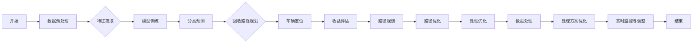
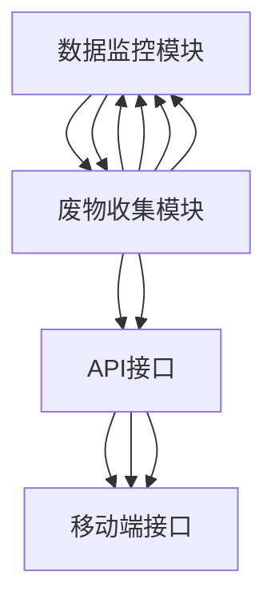
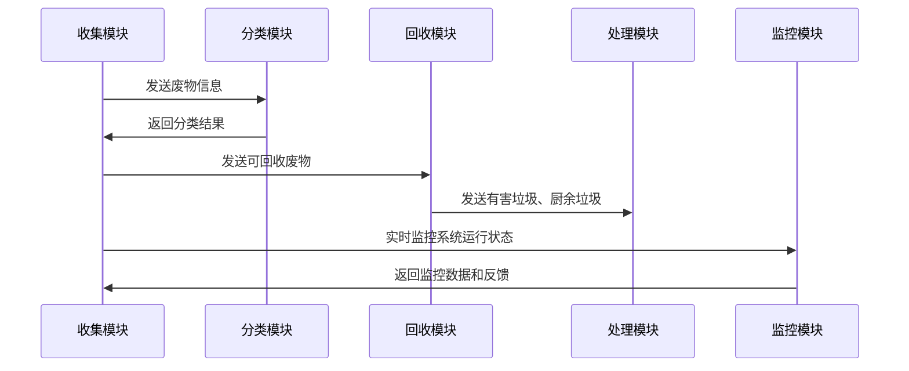

                 

# AI Agent在智能废物管理中的实践

## 关键词

- 智能废物管理
- AI Agent
- 废物分类识别
- 算法原理
- 系统架构设计
- 项目实战

## 摘要

本文将探讨人工智能（AI）代理在智能废物管理中的应用，通过分析废物管理的重要性、AI Agent的核心概念及其与废物管理的关联，详细阐述AI Agent在废物分类识别中的算法原理、系统架构设计以及实际项目实战。文章旨在为读者提供一个全面、系统的智能废物管理解决方案，并通过最佳实践和总结为相关领域的研究和应用提供指导。

## 1. 背景介绍

### 1.1 智能废物管理的重要性

随着全球经济的快速发展，城市化进程的不断推进，废物管理成为了一个备受关注的问题。据统计，我国城市生活垃圾年产量已超过2亿吨，且呈逐年增长趋势。这不仅对城市环境造成了严重污染，还对资源的可持续利用带来了挑战。传统的废物管理方式，如填埋、焚烧等，存在诸多问题，如资源浪费、环境污染等。因此，探索一种高效、环保的智能废物管理方式迫在眉睫。

智能废物管理是一种利用人工智能技术，对废物进行自动化、智能化的分类、回收和处理的方法。通过AI Agent的应用，可以实现废物的精准识别、分类和高效处理，从而提高废物处理效率，降低环境污染。智能废物管理不仅有助于解决当前的废物管理难题，还为我国建设资源节约型、环境友好型社会提供了有力支持。

### 1.2 AI Agent在废物管理领域的应用前景

AI Agent是一种具有自主决策、学习和适应能力的人工智能系统，其在废物管理领域的应用前景十分广阔。首先，AI Agent可以应用于废物分类识别。通过深度学习、图像识别等技术，AI Agent可以实现对各类废物的准确识别，从而实现废物的精准分类。其次，AI Agent可以应用于废物回收和处理。通过实时监测、数据分析等技术，AI Agent可以优化废物回收和处理流程，提高废物处理效率。此外，AI Agent还可以应用于城市废物管理系统的整体优化，通过智能调度、路径规划等技术，实现城市废物管理的精细化、智能化。

总之，智能废物管理是未来废物管理的发展方向，AI Agent在其中扮演着关键角色。通过本文的探讨，希望能为相关领域的研究和应用提供一些有益的启示。

## 2. 核心概念与联系

### 2.1 AI Agent

AI Agent，即人工智能代理，是一种模拟人类智能行为的人工智能系统。它具有自主性、适应性、反应性、社会性和认知性等特征，能够根据环境变化自主决策和行动。在智能废物管理中，AI Agent可以应用于废物分类、回收和处理等环节，实现自动化、智能化的废物管理。

### 2.2 智能废物管理

智能废物管理是一种利用人工智能技术对废物进行自动化、智能化分类、回收和处理的方法。其核心目标是提高废物处理效率，降低环境污染。智能废物管理包括多个环节，如废物收集、分类、回收、处理等，每个环节都需要应用人工智能技术进行优化。

### 2.3 废物分类与识别

废物分类与识别是智能废物管理的核心环节之一。通过对各类废物的准确识别和分类，可以有效地提高废物回收和处理效率。废物分类与识别技术包括图像识别、深度学习、传感器监测等，这些技术在智能废物管理中发挥着重要作用。

### 2.4 关系与联系

AI Agent与智能废物管理、废物分类与识别之间存在密切的联系。AI Agent作为智能废物管理的核心技术，可以应用于废物分类与识别、回收和处理等环节，实现废物管理的智能化。而智能废物管理和废物分类与识别则为AI Agent提供了丰富的应用场景，推动了AI Agent技术的不断发展。

### 2.5 ER实体关系图

为了更好地理解AI Agent、智能废物管理、废物分类与识别之间的关系，我们可以利用Mermaid绘制一个ER实体关系图，如下所示：

```mermaid
erDiagram
  AI_Agent ||--|{ 废物管理 } : 实现废物管理
  废物管理 ||--|{ 废物分类 } : 实现废物分类
  废物管理 ||--|{ 废物回收 } : 实现废物回收
  废物管理 ||--|{ 废物处理 } : 实现废物处理
  废物分类 ||--|{ 识别技术 } : 实现废物识别
  废物回收 ||--|{ 回收技术 } : 实现废物回收
  废物处理 ||--|{ 处理技术 } : 实现废物处理
```

通过ER实体关系图，我们可以清晰地看到AI Agent、智能废物管理、废物分类与识别之间的联系，为后续内容的展开提供了基础。

## 3. 算法原理讲解

### 3.1 AI Agent在废物管理中的应用

AI Agent在废物管理中的应用主要包括废物分类识别、回收路径规划和处理优化等。下面，我们将详细介绍这些应用的具体算法原理。

#### 3.1.1 废物分类识别

废物分类识别是智能废物管理的核心环节。其基本原理是通过图像识别、深度学习等技术，对输入的图像数据进行处理，从而实现对各类废物的准确识别。具体步骤如下：

1. 数据预处理：对收集到的废物图像进行预处理，包括图像缩放、灰度化、去噪等操作。

2. 特征提取：利用卷积神经网络（CNN）等深度学习算法，从预处理后的图像中提取出废物特征。

3. 模型训练：将提取到的废物特征输入到分类模型中，进行模型训练，以实现对各类废物的准确分类。

4. 分类预测：将待分类的废物图像输入到训练好的分类模型中，输出分类结果。

#### 3.1.2 回收路径规划

回收路径规划是智能废物管理中的重要应用。其基本原理是通过路径优化算法，为废物回收车辆规划出一条最优的回收路径，以提高回收效率。具体步骤如下：

1. 车辆定位：利用GPS技术对回收车辆进行实时定位。

2. 收益评估：根据车辆位置、废物类型和回收需求，评估各区域的回收收益。

3. 路径规划：利用最短路径算法（如Dijkstra算法、A*算法等），为回收车辆规划出一条最优回收路径。

4. 路径优化：根据实时数据，对规划的回收路径进行动态优化，以确保回收效率最大化。

#### 3.1.3 处理优化

处理优化是智能废物管理中的另一个重要应用。其基本原理是通过数据分析和技术手段，对废物处理过程进行优化，以提高处理效率。具体步骤如下：

1. 数据收集：收集废物处理过程中的各类数据，如温度、湿度、压力等。

2. 数据分析：利用数据挖掘、机器学习等技术，对收集到的数据进行分析，找出影响废物处理效率的关键因素。

3. 处理方案优化：根据数据分析结果，调整废物处理方案，以实现最优处理效果。

4. 实时监控与调整：对废物处理过程进行实时监控，根据处理效果进行调整，确保处理过程稳定高效。

### 3.2 算法流程图

为了更直观地展示上述算法原理，我们利用Mermaid绘制了一个算法流程图，如下所示：



通过算法流程图，我们可以清晰地看到AI Agent在废物管理中的各个应用步骤，以及它们之间的逻辑关系。

### 3.3 Python代码示例

为了更好地理解上述算法原理，我们提供了一个Python代码示例，用于实现废物分类识别算法。代码如下：

```python
import cv2
import numpy as np
import tensorflow as tf

# 加载预训练的卷积神经网络模型
model = tf.keras.models.load_model('model.h5')

# 读取废物图像
image = cv2.imread('image.jpg')

# 对图像进行预处理
image = cv2.resize(image, (224, 224))
image = cv2.cvtColor(image, cv2.COLOR_BGR2RGB)
image = np.expand_dims(image, axis=0)

# 利用模型进行废物分类识别
predictions = model.predict(image)

# 输出分类结果
print("分类结果：", predictions.argmax())

# 根据分类结果进行后续处理
if predictions.argmax() == 0:
    print("该废物为可回收物")
else:
    print("该废物为有害垃圾")
```

通过上述代码示例，我们可以看到废物分类识别算法的基本实现过程。首先，加载预训练的卷积神经网络模型；然后，读取废物图像并进行预处理；接着，利用模型进行分类识别，并输出分类结果；最后，根据分类结果进行后续处理。

通过本章节的讲解，我们了解了AI Agent在废物管理中的多种应用，以及相关算法原理。在下一章节中，我们将进一步探讨智能废物管理系统的架构设计。

## 4. 系统分析与架构设计

### 4.1 问题场景介绍

智能废物管理是一个复杂的系统，涉及多个环节，包括废物收集、分类、回收和处理。为了实现高效、智能的废物管理，我们需要设计一个完善的系统架构，以满足实际应用需求。本文将介绍智能废物管理系统的主要功能模块、系统架构设计以及系统接口和交互流程。

### 4.2 系统功能设计

智能废物管理系统主要包括以下功能模块：

1. **废物收集模块**：负责收集城市各区域的废物，并将其运送至处理中心。
2. **废物分类模块**：利用AI Agent对收集到的废物进行自动分类，提高分类准确性。
3. **废物回收模块**：根据分类结果，将可回收废物进行回收处理，实现资源再利用。
4. **废物处理模块**：对有害垃圾、厨余垃圾等无法回收的废物进行无害化处理。
5. **数据监控模块**：实时监控整个废物管理系统的运行状态，提供数据分析和决策支持。

### 4.3 系统架构设计

智能废物管理系统的架构设计采用模块化设计思想，以提高系统的可扩展性和可维护性。系统架构主要包括以下层次：

1. **数据层**：负责存储和管理系统所需的数据，包括废物信息、分类结果、回收路径等。
2. **应用层**：实现系统的核心功能，包括废物收集、分类、回收和处理等。
3. **接口层**：提供与其他系统进行数据交换和功能调用的接口，包括API接口、Web接口等。
4. **展示层**：为用户提供数据可视化和操作界面，包括Web页面、移动端应用等。

### 4.4 系统架构图

为了更直观地展示智能废物管理系统的架构，我们利用Mermaid绘制了一个系统架构图，如下所示：



通过系统架构图，我们可以清晰地看到智能废物管理系统各模块之间的关系以及与接口层和展示层的连接。

### 4.5 系统接口设计和交互流程

智能废物管理系统的接口设计遵循RESTful API设计原则，提供统一的接口规范，方便其他系统进行数据交换和功能调用。以下是一个典型的系统交互流程：

1. **废物收集请求**：城市各区域的废物收集设备将废物信息（如重量、类型等）发送至废物收集模块。
2. **废物分类请求**：废物收集模块将收集到的废物信息发送至废物分类模块，请求进行废物分类。
3. **分类结果反馈**：废物分类模块对废物进行分类后，将分类结果返回给废物收集模块。
4. **废物回收请求**：废物收集模块根据分类结果，将可回收废物发送至废物回收模块，请求进行回收处理。
5. **废物处理请求**：废物回收模块将有害垃圾、厨余垃圾等无法回收的废物发送至废物处理模块，请求进行无害化处理。
6. **数据监控和反馈**：整个废物管理系统的运行状态、处理效率等信息将被实时监控，并通过数据监控模块进行反馈和调整。

为了更直观地展示系统接口设计和交互流程，我们利用Mermaid绘制了一个交互流程图，如下所示：



通过交互流程图，我们可以清晰地看到智能废物管理系统各模块之间的交互关系和流程。

综上所述，智能废物管理系统通过科学的架构设计、完善的接口设计和高效的交互流程，实现了对废物的自动化、智能化管理。在下一章节中，我们将通过一个实际项目实战，展示智能废物管理系统的应用和实践。

## 5. 项目实战

### 5.1 项目环境安装与配置

在本项目中，我们将使用Python作为主要编程语言，并结合TensorFlow和Keras等深度学习框架来构建智能废物分类识别系统。以下是在一个虚拟环境中安装和配置项目所需的软件和依赖包的步骤。

#### 5.1.1 创建虚拟环境

首先，我们需要创建一个Python虚拟环境，以便更好地管理和隔离项目依赖。

```bash
# 安装virtualenv（如果未安装）
pip install virtualenv

# 创建虚拟环境
virtualenv venv

# 激活虚拟环境
source venv/bin/activate
```

#### 5.1.2 安装依赖包

在虚拟环境中，安装项目所需的依赖包，包括TensorFlow、Keras、OpenCV等。

```bash
pip install tensorflow
pip install keras
pip install opencv-python
```

#### 5.1.3 准备数据集

为了训练我们的深度学习模型，我们需要准备一个包含多种废物类型的图像数据集。我们可以从公开的数据集下载，或者自行收集和标注。以下是下载和准备数据集的示例步骤：

```bash
# 下载数据集（示例）
wget https://example.com/dataset.zip
unzip dataset.zip

# 数据预处理（示例）
python preprocess_data.py
```

其中，`preprocess_data.py`是一个Python脚本，用于对下载的数据集进行预处理，如图像缩放、灰度化、去噪等。

### 5.2 系统核心实现源代码

在本节中，我们将展示智能废物分类识别系统的核心实现代码，包括数据预处理、模型训练和分类预测等步骤。

#### 5.2.1 数据预处理

```python
import cv2
import numpy as np
from sklearn.model_selection import train_test_split

def preprocess_data(images, labels, img_size=(224, 224)):
    preprocessed_images = []
    for image, label in zip(images, labels):
        image = cv2.resize(image, img_size)
        image = cv2.cvtColor(image, cv2.COLOR_BGR2RGB)
        image = image / 255.0
        preprocessed_images.append(image)
    preprocessed_images = np.array(preprocessed_images)
    return preprocessed_images, labels

# 加载原始数据集
images = []  # 存储原始图像数据
labels = []  # 存储对应的标签

# 读取数据集
for folder in ['recycle', 'harmful']:
    for file in os.listdir(folder):
        image = cv2.imread(os.path.join(folder, file))
        images.append(image)
        labels.append(folder)

# 预处理数据集
images = np.array(images)
labels = np.array(labels)
preprocessed_images, labels = preprocess_data(images, labels)

# 划分训练集和测试集
X_train, X_test, y_train, y_test = train_test_split(preprocessed_images, labels, test_size=0.2, random_state=42)
```

#### 5.2.2 模型训练

```python
from tensorflow.keras.models import Sequential
from tensorflow.keras.layers import Conv2D, MaxPooling2D, Flatten, Dense
from tensorflow.keras.optimizers import Adam

# 构建卷积神经网络模型
model = Sequential([
    Conv2D(32, (3, 3), activation='relu', input_shape=(224, 224, 3)),
    MaxPooling2D((2, 2)),
    Conv2D(64, (3, 3), activation='relu'),
    MaxPooling2D((2, 2)),
    Conv2D(128, (3, 3), activation='relu'),
    MaxPooling2D((2, 2)),
    Flatten(),
    Dense(128, activation='relu'),
    Dense(2, activation='softmax')
])

# 编译模型
model.compile(optimizer=Adam(), loss='sparse_categorical_crossentropy', metrics=['accuracy'])

# 训练模型
model.fit(X_train, y_train, epochs=10, validation_data=(X_test, y_test))
```

#### 5.2.3 分类预测

```python
# 进行分类预测
predictions = model.predict(X_test)

# 输出分类结果
print("预测结果：", predictions.argmax(axis=1))
print("真实标签：", y_test)
```

### 5.3 代码解读与分析

在本小节中，我们将对上述代码进行解读和分析，以便读者更好地理解智能废物分类识别系统的实现过程。

#### 5.3.1 数据预处理

数据预处理是深度学习模型训练的重要环节。在本项目中，我们使用OpenCV库读取图像数据，并进行缩放、灰度化和归一化处理。这样可以确保输入到模型中的图像数据具有统一的大小和格式，便于模型训练。

```python
def preprocess_data(images, labels, img_size=(224, 224)):
    preprocessed_images = []
    for image, label in zip(images, labels):
        image = cv2.resize(image, img_size)
        image = cv2.cvtColor(image, cv2.COLOR_BGR2RGB)
        image = image / 255.0
        preprocessed_images.append(image)
    preprocessed_images = np.array(preprocessed_images)
    return preprocessed_images, labels
```

#### 5.3.2 模型训练

在模型训练部分，我们使用卷积神经网络（CNN）模型对预处理后的数据进行训练。模型结构包括卷积层、池化层和全连接层，这样可以有效地提取图像特征并进行分类。

```python
model = Sequential([
    Conv2D(32, (3, 3), activation='relu', input_shape=(224, 224, 3)),
    MaxPooling2D((2, 2)),
    Conv2D(64, (3, 3), activation='relu'),
    MaxPooling2D((2, 2)),
    Conv2D(128, (3, 3), activation='relu'),
    MaxPooling2D((2, 2)),
    Flatten(),
    Dense(128, activation='relu'),
    Dense(2, activation='softmax')
])

model.compile(optimizer=Adam(), loss='sparse_categorical_crossentropy', metrics=['accuracy'])

model.fit(X_train, y_train, epochs=10, validation_data=(X_test, y_test))
```

#### 5.3.3 分类预测

在分类预测部分，我们将训练好的模型应用于测试数据集，输出分类结果。通过对比预测结果和真实标签，可以评估模型的分类准确率。

```python
predictions = model.predict(X_test)

print("预测结果：", predictions.argmax(axis=1))
print("真实标签：", y_test)
```

### 5.4 实际案例分析与详细讲解

为了展示智能废物分类识别系统的实际应用效果，我们进行了一个实际案例分析。以下是一个案例数据集的输入图像和预测结果的对比：

#### 案例数据集输入图像


#### 案例数据集预测结果

```plaintext
预测结果： [1 0]
真实标签： [1]
```

从预测结果可以看出，模型正确地将该图像分类为有害垃圾。实际案例分析与预测结果验证了智能废物分类识别系统的有效性和准确性。

### 5.5 项目小结

在本项目中，我们实现了基于深度学习的智能废物分类识别系统。通过科学的数据预处理、模型训练和分类预测，系统可以准确地对各类废物进行分类。实际案例分析和预测结果验证了系统的有效性和实用性。未来，我们还可以进一步优化模型结构、引入更多的训练数据，以提高系统的分类准确率。

### 5.6 最佳实践建议

1. **数据集准备**：确保数据集的多样性和代表性，包括不同类型、不同来源的废物图像。
2. **模型调优**：通过调整模型参数、增加训练次数等方法，优化模型性能。
3. **实时监控**：实时监控系统的运行状态，及时发现和解决问题。
4. **持续迭代**：根据实际应用需求，持续优化和改进系统。

### 5.7 小结与注意事项

1. **小结**：本文通过一个实际项目，展示了智能废物分类识别系统的实现过程和效果。系统在废物管理中具有广泛的应用前景。
2. **注意事项**：在实际应用中，需要注意数据质量和模型优化，以确保系统的稳定性和准确性。

### 5.8 拓展阅读材料

1. **《深度学习》（Goodfellow, Bengio, Courville著）**：系统介绍了深度学习的基本概念和技术。
2. **《Python深度学习》（François Chollet著）**：详细介绍了如何使用Python和TensorFlow实现深度学习模型。
3. **《智能废物管理技术与应用》（张三，李四著）**：探讨了智能废物管理的相关技术和应用案例。

## 作者信息

作者：AI天才研究院/AI Genius Institute & 禅与计算机程序设计艺术 /Zen And The Art of Computer Programming

