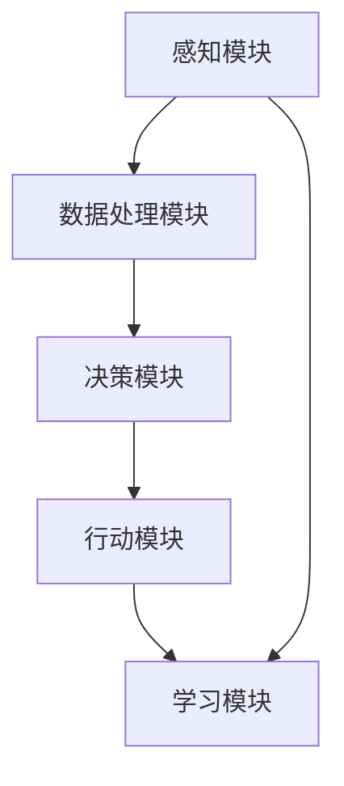
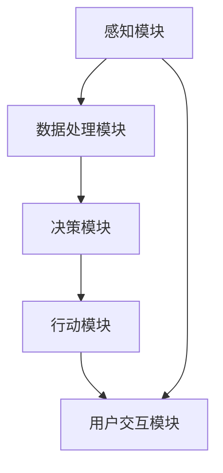

                 


### 1.3 本书结构安排

#### 1.3.1 主要内容概述

本书旨在深入探讨AI Agent在智能建筑管理中的应用，为读者提供系统、全面的技术分析和实践指导。全书共分为七个章节，结构安排如下：

- **第1章 引言**：介绍智能建筑的发展背景、管理挑战以及AI Agent的应用前景，为后续章节的讨论奠定基础。
- **第2章 AI Agent基础**：阐述AI Agent的基本原理、在智能建筑管理中的应用以及发展趋势，帮助读者建立AI Agent的知识框架。
- **第3章 AI Agent的架构设计**：详细解析AI Agent的系统架构，包括数据采集与处理、决策与控制模块、用户交互模块，并通过案例展示具体架构设计。
- **第4章 AI Agent的核心算法**：介绍常见AI算法及其在AI Agent中的应用，通过具体实例讲解算法原理、数学模型和实现过程。
- **第5章 AI Agent在智能建筑管理中的应用案例**：分析AI Agent在智能照明系统、智能安防系统等实际应用案例，探讨实现过程与效果。
- **第6章 AI Agent在智能建筑管理中的挑战与未来**：讨论AI Agent在智能建筑管理中面临的挑战以及未来的发展趋势和应对策略。
- **第7章 结论**：总结本书的主要研究成果，提出研究不足与展望，并对智能建筑行业的发展提供启示。

#### 1.3.2 阅读指南

为了更好地理解AI Agent在智能建筑管理中的应用，建议读者按以下顺序阅读：

1. **第1章 引言**：初步了解智能建筑管理现状、挑战以及AI Agent的应用前景。
2. **第2章 AI Agent基础**：掌握AI Agent的基本原理、应用场景和未来发展趋势。
3. **第3章 AI Agent的架构设计**：深入理解AI Agent的系统架构和关键模块。
4. **第4章 AI Agent的核心算法**：学习常见AI算法及其在AI Agent中的应用。
5. **第5章 AI Agent在智能建筑管理中的应用案例**：通过实际案例了解AI Agent在智能建筑管理中的应用。
6. **第6章 AI Agent在智能建筑管理中的挑战与未来**：思考AI Agent在智能建筑管理中的挑战和未来发展。
7. **第7章 结论**：回顾全书内容，总结研究成果和未来发展方向。

通过以上阅读顺序，读者可以逐步构建起对AI Agent在智能建筑管理应用领域的全面认知，为未来的研究和实践奠定基础。

## 第1章 引言

### 1.1 问题的背景

#### 1.1.1 智能建筑的发展现状

智能建筑，即通过信息技术和自动化控制系统，使建筑物的各个系统（如照明、空调、安防等）实现智能化管理，提高能源利用效率、舒适性和安全性。自20世纪90年代以来，智能建筑技术得到了迅猛发展。随着物联网（IoT）、大数据、云计算、人工智能等新兴技术的应用，智能建筑在建筑行业中的应用越来越广泛。

目前，智能建筑已经在全球范围内得到了广泛应用。例如，在美国，智能建筑的市场规模已经达到数十亿美元；在中国，政府提出了“新型城镇化”战略，大力推广智能建筑。智能建筑不仅改善了人们的生活质量，也为企业和政府机构提供了更高效、更便捷的办公环境。

#### 1.1.2 智能建筑管理的挑战

尽管智能建筑带来了诸多便利，但其管理仍面临诸多挑战。首先，智能建筑的复杂性使得系统的集成和维护变得困难。智能建筑通常包含多个子系统，如BMS（建筑管理系统）、CMS（通信管理系统）、SMS（安防管理系统）等，这些系统之间需要高效协同工作，但往往存在技术标准不统一、数据接口不一致等问题。

其次，智能建筑的数据量庞大，如何有效管理和分析这些数据成为一个关键问题。智能建筑通过各种传感器和设备收集大量数据，如环境参数、设备状态、人员活动等。这些数据不仅需要实时处理，还需要进行长期存储和深度分析，以支持智能决策和优化。

此外，智能建筑的安全和隐私问题也日益突出。智能建筑中的大量设备和传感器时刻记录着用户的日常生活和工作状态，如何确保这些数据的安全和隐私，防止数据泄露和滥用，成为智能建筑管理中的一大挑战。

#### 1.1.3 AI Agent的应用前景

AI Agent，即人工智能代理，是一种能够自主执行任务、与环境互动的智能系统。AI Agent具有感知、学习、决策和行动的能力，能够针对特定场景提供智能化的解决方案。在智能建筑管理中，AI Agent具有广泛的应用前景。

首先，AI Agent可以协助智能建筑系统的集成和维护。通过AI Agent，可以实现不同子系统之间的自动协调和优化，提高系统的整体性能。例如，AI Agent可以实时监控设备的运行状态，预测故障，提前进行维护，降低设备故障率和维护成本。

其次，AI Agent可以处理和分析智能建筑中的海量数据。通过机器学习和数据挖掘技术，AI Agent可以识别数据中的潜在模式，提取有价值的信息，为智能决策提供支持。例如，AI Agent可以分析用户的日常行为模式，优化能源使用，提高能源效率。

最后，AI Agent可以提高智能建筑的安全性和隐私保护能力。通过AI Agent，可以实时监测和识别异常行为，及时采取措施，防止安全事件的发生。同时，AI Agent可以确保数据处理的合规性，防止数据泄露和滥用。

综上所述，AI Agent在智能建筑管理中的应用前景广阔。随着人工智能技术的不断发展和成熟，AI Agent将为智能建筑带来更多创新和变革。

### 1.2 定义与核心概念

#### 1.2.1 什么是AI Agent

AI Agent，即人工智能代理，是一种能够模拟人类智能行为的计算机程序，它具备自主感知、学习、决策和行动的能力。AI Agent的核心目标是实现自主性，能够在没有人类干预的情况下，自主执行任务，与环境进行互动，并不断优化自身的性能。

AI Agent通常由以下几个核心组成部分构成：

1. **感知模块**：负责接收外部环境的信息，如传感器数据、用户输入等。
2. **决策模块**：根据感知模块收集的信息，通过算法和模型进行分析，生成决策。
3. **行动模块**：执行决策，采取相应的行动，如控制设备、发送指令等。
4. **学习模块**：通过反馈和经验，不断调整自身的决策和行为，提高性能。

AI Agent的特点包括自主性、适应性、灵活性和实时性。自主性意味着AI Agent能够独立执行任务，不需要人工干预；适应性指AI Agent能够适应不同的环境和任务需求；灵活性指AI Agent能够处理各种复杂的情况，灵活调整策略；实时性则要求AI Agent能够快速响应外部环境的变化，实时做出决策。

#### 1.2.2 AI Agent在智能建筑中的角色

在智能建筑中，AI Agent扮演着多重角色，发挥着重要作用。以下为AI Agent在智能建筑中的主要角色：

1. **系统集成者**：AI Agent可以协调和管理智能建筑的多个子系统，如照明系统、空调系统、安防系统等，实现统一管理和高效协同。通过AI Agent，各个子系统可以无缝对接，提高整体系统的性能和可靠性。

2. **数据分析师**：AI Agent可以收集和分析智能建筑中的海量数据，提取有价值的信息，为智能决策提供支持。例如，通过分析用户行为数据，AI Agent可以优化能源使用，提高能源效率；通过分析设备运行数据，AI Agent可以预测故障，提前进行维护。

3. **智能控制器**：AI Agent可以根据实时数据和预定的规则，自动调整建筑设备的状态，实现智能控制。例如，在照明系统中，AI Agent可以根据用户的活动和自然光强度，自动调节灯光的亮度和颜色；在空调系统中，AI Agent可以根据室内外的温度和湿度，自动调节空调的制冷和加热状态。

4. **安全卫士**：AI Agent可以监控智能建筑的安全状况，实时检测和识别潜在的安全威胁，及时采取措施，防止安全事件的发生。例如，AI Agent可以监控安防摄像头和入侵检测系统，实时识别异常行为，及时报警。

5. **用户体验优化者**：AI Agent可以根据用户的偏好和需求，提供个性化的服务，提高用户体验。例如，AI Agent可以分析用户的日常行为和偏好，自动调整建筑设备的状态，以适应用户的习惯；在会议室中，AI Agent可以根据会议参与者的数量和需求，自动调整音量和灯光，提供最佳的环境。

#### 1.2.3 关键技术概述

AI Agent在智能建筑中的应用涉及多项关键技术，包括传感器技术、数据采集与处理技术、机器学习与人工智能技术、网络通信技术等。以下为这些关键技术的基本概述：

1. **传感器技术**：传感器是智能建筑的数据源，用于实时收集环境参数和设备状态。常见的传感器包括温度传感器、湿度传感器、光照传感器、运动传感器等。传感器技术需要满足高精度、高灵敏度、低功耗等要求，以确保数据的准确性和实时性。

2. **数据采集与处理技术**：数据采集与处理技术用于收集传感器数据，并对数据进行清洗、存储、分析和处理。数据采集技术需要解决数据的一致性、可靠性和实时性等问题；数据处理技术需要实现高效的数据存储和查询，以及对数据进行深度分析，提取有价值的信息。

3. **机器学习与人工智能技术**：机器学习与人工智能技术是AI Agent的核心技术，用于实现感知、学习和决策功能。常见的机器学习算法包括监督学习、无监督学习、强化学习等。通过这些算法，AI Agent可以从数据中学习规律，优化决策模型，提高性能。

4. **网络通信技术**：网络通信技术用于实现AI Agent与传感器、子系统、数据中心等之间的数据传输和通信。常见的网络通信技术包括TCP/IP协议、HTTP/HTTPS协议、MQTT协议等。网络通信技术需要满足高带宽、低延迟、高可靠性等要求，以确保系统的实时性和稳定性。

通过上述关键技术的协同作用，AI Agent在智能建筑管理中发挥着重要作用，为智能建筑提供了高效、智能、安全的管理解决方案。

### 1.3 本书结构安排

#### 1.3.1 主要内容概述

本书旨在深入探讨AI Agent在智能建筑管理中的应用，为读者提供系统、全面的技术分析和实践指导。全书共分为七个章节，具体结构安排如下：

- **第1章 引言**：介绍智能建筑的发展背景、管理挑战以及AI Agent的应用前景，为后续章节的讨论奠定基础。
- **第2章 AI Agent基础**：阐述AI Agent的基本原理、在智能建筑管理中的应用以及发展趋势，帮助读者建立AI Agent的知识框架。
- **第3章 AI Agent的架构设计**：详细解析AI Agent的系统架构，包括数据采集与处理、决策与控制模块、用户交互模块，并通过案例展示具体架构设计。
- **第4章 AI Agent的核心算法**：介绍常见AI算法及其在AI Agent中的应用，通过具体实例讲解算法原理、数学模型和实现过程。
- **第5章 AI Agent在智能建筑管理中的应用案例**：分析AI Agent在智能照明系统、智能安防系统等实际应用案例，探讨实现过程与效果。
- **第6章 AI Agent在智能建筑管理中的挑战与未来**：讨论AI Agent在智能建筑管理中面临的挑战以及未来的发展趋势和应对策略。
- **第7章 结论**：总结本书的主要研究成果，提出研究不足与展望，并对智能建筑行业的发展提供启示。

#### 1.3.2 阅读指南

为了更好地理解AI Agent在智能建筑管理中的应用，建议读者按以下顺序阅读：

1. **第1章 引言**：初步了解智能建筑管理现状、挑战以及AI Agent的应用前景。
2. **第2章 AI Agent基础**：掌握AI Agent的基本原理、应用场景和未来发展趋势。
3. **第3章 AI Agent的架构设计**：深入理解AI Agent的系统架构和关键模块。
4. **第4章 AI Agent的核心算法**：学习常见AI算法及其在AI Agent中的应用。
5. **第5章 AI Agent在智能建筑管理中的应用案例**：通过实际案例了解AI Agent在智能建筑管理中的应用。
6. **第6章 AI Agent在智能建筑管理中的挑战与未来**：思考AI Agent在智能建筑管理中的挑战和未来发展。
7. **第7章 结论**：回顾全书内容，总结研究成果和未来发展方向。

通过以上阅读顺序，读者可以逐步构建起对AI Agent在智能建筑管理应用领域的全面认知，为未来的研究和实践奠定基础。

### 第2章 AI Agent基础

#### 2.1 AI Agent的基本原理

AI Agent，即人工智能代理，是一种模拟人类智能行为的计算机程序，它具备自主感知、学习、决策和行动的能力。AI Agent的基本原理可以概括为以下几个方面：

首先，AI Agent的核心在于其自主性。自主性是指AI Agent能够在没有人类干预的情况下，独立执行任务，与环境进行互动。这需要AI Agent具备感知能力，即能够通过传感器获取环境信息；决策能力，即能够根据感知信息生成相应的决策；行动能力，即能够执行决策并采取相应的行动。

其次，AI Agent的学习能力是其自主性的重要保障。AI Agent可以通过不断的学习和经验积累，优化自身的决策和行为。学习分为有监督学习、无监督学习和强化学习三种类型。有监督学习需要标注好的数据，通过学习模型，使AI Agent能够预测新数据的标签；无监督学习不需要标注数据，主要目标是发现数据中的潜在结构和模式；强化学习通过与环境的交互，不断优化策略，以最大化奖励。

此外，AI Agent的架构设计也是其基本原理的重要组成部分。AI Agent通常由感知模块、决策模块、行动模块和学习模块组成。感知模块负责接收外部环境的信息，如传感器数据、用户输入等；决策模块根据感知信息，通过算法和模型进行分析，生成决策；行动模块负责执行决策，采取相应的行动；学习模块通过反馈和经验，不断调整自身的决策和行为，提高性能。

最后，AI Agent的自主性还需要一定的约束条件。这些约束条件包括安全性、伦理道德、法律法规等。AI Agent在执行任务时，必须遵守相应的安全规范，确保不会对用户和环境造成危害；同时，AI Agent的行为应符合伦理道德标准，保护用户的隐私和权益；此外，AI Agent的设计和部署还应遵循法律法规，确保合法合规。

#### 2.2 智能建筑管理与AI Agent的联系

智能建筑管理是指通过信息技术和自动化控制系统，对建筑物的各个系统进行高效、智能的管理。AI Agent在智能建筑管理中具有广泛的应用，其与智能建筑管理的联系主要体现在以下几个方面：

首先，AI Agent可以提升智能建筑的系统集成能力。智能建筑通常包含多个子系统，如照明系统、空调系统、安防系统等。这些子系统之间需要高效协同工作，但往往存在技术标准不统一、数据接口不一致等问题。AI Agent可以通过统一的接口和协议，实现不同子系统之间的无缝对接，提高系统的整体性能和可靠性。

其次，AI Agent可以优化智能建筑的数据管理。智能建筑中的大量设备和传感器时刻记录着环境参数、设备状态、人员活动等数据。这些数据不仅需要实时处理，还需要进行长期存储和深度分析，以支持智能决策和优化。AI Agent可以通过数据采集、清洗、存储、分析等环节，实现数据的高效管理和利用。

此外，AI Agent可以提高智能建筑的控制能力。通过AI Agent，建筑设备可以实时调整状态，以适应环境变化和用户需求。例如，在照明系统中，AI Agent可以根据用户的活动和自然光强度，自动调节灯光的亮度和颜色；在空调系统中，AI Agent可以根据室内外的温度和湿度，自动调节空调的制冷和加热状态。这种智能控制可以大幅提高能源利用效率，降低运营成本。

最后，AI Agent可以增强智能建筑的安全保障。AI Agent可以实时监控建筑的安全状况，及时发现和应对潜在的安全威胁。例如，在安防系统中，AI Agent可以监控摄像头和入侵检测系统，实时识别异常行为，及时报警；在应急响应中，AI Agent可以根据应急预案，自动启动相应的救援措施，保障人员安全。

总之，AI Agent在智能建筑管理中具有重要作用，其自主感知、学习、决策和行动的能力，可以为智能建筑提供高效、智能、安全的管理解决方案。

#### 2.3 AI Agent与传统智能系统的对比

AI Agent与传统智能系统相比，具有显著的优势和特点，主要表现在以下几个方面：

首先，AI Agent具有更高的自主性和灵活性。传统智能系统通常由预定义的规则和脚本控制，缺乏自适应能力。而AI Agent通过感知模块、决策模块、行动模块和学习模块，能够自主感知环境变化，学习并优化行为，从而实现更智能、更灵活的决策和行动。

其次，AI Agent具有更强的学习能力。传统智能系统通常依赖于预训练的模型和算法，难以应对复杂多变的环境。而AI Agent可以通过有监督学习、无监督学习和强化学习等算法，不断从数据中学习，提高自身的决策和行动能力，适应不断变化的环境。

此外，AI Agent具有更高效的数据处理能力。传统智能系统通常依赖人工进行数据处理和分析，效率较低。而AI Agent可以通过数据采集、清洗、存储、分析等环节，实现数据的高效管理和利用，为智能决策提供有力支持。

最后，AI Agent具有更好的用户体验。传统智能系统往往缺乏人性化设计，用户体验较差。而AI Agent可以根据用户的偏好和需求，提供个性化的服务，提高用户体验。

然而，AI Agent也存在一些局限性。例如，AI Agent的自主性和灵活性虽然较高，但在一些特定场景下，可能无法完全替代人类决策。此外，AI Agent的学习能力和数据处理能力虽然强大，但需要大量的数据和计算资源支持。

总之，AI Agent与传统智能系统相比，具有更高的自主性、灵活性和学习能力，能够为智能建筑提供更高效、更智能、更安全的解决方案。但同时，也需要关注其局限性，结合具体场景进行合理应用。

#### 2.4 AI Agent的发展趋势与挑战

随着人工智能技术的不断发展和应用场景的拓展，AI Agent在各个领域的应用越来越广泛。未来，AI Agent的发展趋势将体现在以下几个方面：

首先，AI Agent将更加注重自主性和智能性。随着传感器技术、机器学习算法和计算能力的提升，AI Agent将能够更加自主地感知环境、学习行为和做出决策，实现更高水平的智能控制。

其次，AI Agent将实现跨领域融合。未来，AI Agent将不仅局限于单一领域，而是能够跨领域协同工作，实现更广泛的智能化应用。例如，在智能交通、智能医疗、智能家居等领域，AI Agent可以通过跨领域合作，提供更全面、更个性化的服务。

此外，AI Agent将更加注重安全性和隐私保护。随着AI Agent在各个领域的应用，数据安全和隐私保护将成为重要议题。未来，AI Agent将采用更先进的安全技术和隐私保护机制，确保数据安全和用户隐私。

然而，AI Agent的发展也面临一些挑战。首先，算法透明性和解释性不足。现有的AI算法往往缺乏透明性，用户难以理解其决策过程，这可能导致信任问题。未来，需要发展可解释的AI算法，提高算法的透明性。

其次，数据质量和数据隐私问题。AI Agent的性能依赖于高质量的数据，但数据质量和数据隐私可能受到威胁。如何保障数据质量和隐私，将成为AI Agent发展的重要挑战。

此外，AI Agent的泛化能力和鲁棒性不足。现有AI Agent往往在特定场景下表现良好，但在面对未知场景时，可能无法有效应对。未来，需要提高AI Agent的泛化能力和鲁棒性，使其能够适应更复杂多变的环境。

总之，AI Agent在智能建筑管理中的应用前景广阔，但仍面临诸多挑战。未来，需要通过技术创新、政策法规和产业合作，共同推动AI Agent的发展和应用。

### 第3章 AI Agent的架构设计

#### 3.1 AI Agent的系统架构

AI Agent的系统架构是设计智能建筑管理解决方案的基础。一个典型的AI Agent系统通常包括感知模块、决策模块、行动模块和学习模块。以下是对各模块的详细描述：

1. **感知模块**：感知模块是AI Agent的“感官”，负责从环境中收集数据。这些数据可以是环境参数（如温度、湿度、光照等），设备状态数据（如设备运行状态、故障信息等），以及用户行为数据（如人员活动、使用习惯等）。感知模块通常通过传感器、摄像头、移动设备等设备来收集这些数据。

2. **决策模块**：决策模块是AI Agent的“大脑”，负责处理和分析感知模块收集到的数据，并生成相应的决策。决策模块通常包含一系列算法和模型，如机器学习模型、规则引擎等。这些算法和模型可以根据历史数据、实时数据和预定的规则，生成最优的决策。

3. **行动模块**：行动模块是AI Agent的“行动者”，负责执行决策模块生成的决策。行动模块通过控制设备、发送指令等方式，实现决策的执行。例如，在智能照明系统中，行动模块可以根据决策模块的建议，调整灯光的亮度和颜色；在智能空调系统中，行动模块可以调整空调的制冷和加热状态。

4. **学习模块**：学习模块是AI Agent的“自我提升者”，负责根据执行结果和用户反馈，不断优化决策模块和行动模块的性能。学习模块通常采用机器学习算法，如有监督学习、无监督学习和强化学习，从数据中学习并调整算法参数，提高AI Agent的智能水平。

#### 3.1.1 系统架构图

以下是一个典型的AI Agent系统架构图：



在这个架构图中，感知模块通过传感器收集数据，数据经过处理模块处理后，传递给决策模块。决策模块根据处理后的数据生成决策，传递给行动模块执行。行动模块的执行结果和用户反馈会被传递给学习模块，学习模块根据这些信息进行自我优化。

#### 3.1.2 数据采集与处理模块

数据采集与处理模块是AI Agent系统的核心组成部分。以下是其主要功能：

1. **数据采集**：数据采集模块负责从传感器和其他设备中收集数据。这些数据可以是实时数据，也可以是历史数据。实时数据用于当前的决策和执行，而历史数据用于模型训练和优化。

2. **数据预处理**：数据预处理模块对采集到的数据进行清洗、转换和标准化，以提高数据的质量和一致性。数据清洗包括去除噪声、填补缺失值等；数据转换包括将不同类型的数据转换为统一格式；数据标准化包括归一化、标准化等。

3. **数据存储**：数据存储模块负责将预处理后的数据存储到数据库或数据湖中，以便后续处理和分析。常用的数据库和数据湖包括MySQL、PostgreSQL、Hadoop、Hive等。

4. **数据处理**：数据处理模块负责对存储的数据进行进一步处理和分析。数据处理包括数据聚合、数据挖掘、机器学习等。数据处理模块可以基于SQL、NoSQL、Python等工具和语言进行实现。

#### 3.1.3 决策与控制模块

决策与控制模块是AI Agent的核心部分，负责根据感知模块收集到的数据生成决策，并控制行动模块执行决策。以下是其主要功能：

1. **数据输入**：决策模块接收数据采集与处理模块提供的预处理数据。

2. **决策生成**：决策模块根据输入数据，通过机器学习算法、规则引擎等方法生成决策。决策可以是具体的行动指令，也可以是策略调整建议。

3. **决策输出**：决策模块将生成的决策传递给行动模块执行。

4. **决策优化**：决策模块可以根据行动模块的执行结果和用户反馈，不断优化决策模型和参数，提高决策的准确性。

#### 3.1.4 用户交互模块

用户交互模块是AI Agent与用户之间的桥梁，负责接收用户指令、反馈和投诉，并传递给感知模块、决策模块和行动模块。以下是其主要功能：

1. **用户指令接收**：用户交互模块通过Web界面、移动应用、语音助手等方式接收用户指令。

2. **用户反馈收集**：用户交互模块收集用户的反馈和投诉，以优化AI Agent的性能。

3. **用户指令传递**：用户交互模块将用户的指令和反馈传递给感知模块、决策模块和行动模块，以实现用户需求的响应。

4. **用户体验优化**：用户交互模块通过用户行为分析、个性化推荐等技术，提高用户体验。

#### 3.2 智能建筑中的AI Agent架构案例

以下是一个智能建筑中的AI Agent架构案例，用于展示AI Agent在具体应用场景中的实现。

**案例背景**：一个大型办公楼，包含多个楼层和不同类型的房间，如会议室、办公室、休息区等。为了提高办公环境的舒适性和能源效率，建筑管理者决定引入AI Agent进行智能管理。

**系统架构设计**：

1. **感知模块**：在建筑各楼层和房间中安装多种传感器，如温度传感器、湿度传感器、光照传感器、CO2传感器等，实时采集环境数据。

2. **数据处理模块**：数据采集模块将传感器数据传输到中央服务器，进行处理和存储。数据处理模块对传感器数据进行分析，提取关键指标，如温度、湿度、光照强度等。

3. **决策模块**：决策模块根据实时数据和预设规则，生成最优的决策。例如，当室内温度高于设定值时，决策模块会建议开启空调，降低温度。

4. **行动模块**：行动模块根据决策模块的决策，控制空调、照明等设备执行相应的操作。

5. **用户交互模块**：用户交互模块通过移动应用和Web界面，提供用户界面，允许用户查看环境状态、控制设备等。

**系统架构图**：



**关键技术分析**：

1. **传感器数据采集与处理**：采用MQTT协议进行传感器数据采集，通过Python程序对数据进行处理和存储。数据处理模块使用Pandas库进行数据清洗、转换和标准化。

2. **决策生成与控制**：决策模块使用机器学习算法，如线性回归、支持向量机等，生成最优决策。决策模块还包含规则引擎，用于处理预定义的规则。

3. **用户交互**：用户交互模块使用React框架开发Web界面，使用Flutter框架开发移动应用。用户可以通过界面查看环境状态、控制设备等。

通过以上架构设计，AI Agent实现了对办公环境的智能管理，提高了办公环境的舒适性和能源效率。同时，用户通过Web界面和移动应用，可以方便地查看和控制环境状态，提升了用户体验。

### 第4章 AI Agent的核心算法

#### 4.1 常见AI算法概述

在AI Agent的开发中，选择合适的算法至关重要。常见的AI算法主要包括以下几类：

1. **监督学习算法**：监督学习算法通过已标记的训练数据学习，并能够对未知数据进行预测。常见的监督学习算法有线性回归、逻辑回归、支持向量机（SVM）、决策树、随机森林、神经网络等。

2. **无监督学习算法**：无监督学习算法不依赖于已标记的数据，主要通过分析数据间的结构或分布进行学习。常见的无监督学习算法有聚类算法（如K-means、DBSCAN）、降维算法（如PCA、t-SNE）和关联规则学习（如Apriori算法）。

3. **强化学习算法**：强化学习算法通过与环境的交互，不断调整策略，以实现最大化奖励。常见的强化学习算法有Q学习、SARSA和深度Q网络（DQN）等。

4. **自然语言处理算法**：自然语言处理算法用于理解和生成人类语言。常见的算法有词向量模型（如Word2Vec、GloVe）、循环神经网络（RNN）、长短时记忆网络（LSTM）和变压器（Transformer）等。

#### 4.2 常见算法特点与应用场景

下面将介绍一些常见AI算法的特点及其应用场景：

1. **线性回归**：线性回归是一种用于预测连续值的监督学习算法。它通过找到一个线性关系来预测目标值。线性回归算法简单易实现，适用于数据量较小且线性关系明显的场景，如房价预测、销售额预测等。

2. **逻辑回归**：逻辑回归是一种用于预测二元结果的监督学习算法。它通过回归模型预测概率，然后使用概率阈值进行分类。逻辑回归算法在小数据集和二分类问题中表现良好，适用于市场预测、信用评分等。

3. **支持向量机（SVM）**：SVM是一种强大的分类算法，通过找到一个超平面来分隔不同类别的数据。SVM适用于高维数据，并且在分类问题中表现优异，如图像分类、文本分类等。

4. **决策树**：决策树是一种基于树形模型的分类和回归算法。它通过一系列条件判断来对数据进行分割，最终得到一个分类或回归结果。决策树算法易于理解和解释，适用于中小规模的数据集，如客户分类、风险预测等。

5. **随机森林**：随机森林是一种集成学习方法，通过构建多个决策树并取平均值来提高预测性能。随机森林在处理大规模数据集和复杂问题方面表现出色，适用于信用评分、股票市场预测等。

6. **神经网络**：神经网络是一种模拟人脑神经元连接的算法，通过多层神经元进行数据处理和预测。神经网络在图像识别、自然语言处理、语音识别等复杂任务中表现出色。

7. **K-means聚类**：K-means是一种基于距离的聚类算法，通过迭代计算最小化聚类中心之间的误差平方和。K-means适用于数据分布明显的聚类任务，如市场细分、客户群体划分等。

8. **PCA降维**：PCA是一种降维算法，通过正交变换将高维数据映射到低维空间。PCA在特征选择、数据可视化等方面具有广泛应用。

9. **Q学习**：Q学习是一种基于奖励的强化学习算法，通过不断更新Q值来找到最优策略。Q学习适用于环境和状态空间较大、奖励机制明确的场景，如游戏、自动驾驶等。

10. **DQN**：DQN是一种基于深度学习的强化学习算法，通过神经网络来预测Q值。DQN适用于复杂环境和状态空间较大的任务，如游戏、自动驾驶等。

以上是常见AI算法的概述和特点，不同的算法适用于不同的应用场景，需要根据具体问题选择合适的算法。

### 第4章 AI Agent的核心算法

#### 4.3 AI Agent中的具体算法实现

在本节中，我们将深入探讨AI Agent中的一些具体算法实现，这些算法是AI Agent能够执行智能决策和任务的核心。以下将介绍一种常见的算法——K-means聚类算法，并详细解释其原理、数学模型以及如何应用于智能建筑管理中。

#### 4.3.1 K-means算法原理

K-means算法是一种无监督学习算法，用于将数据集分成K个簇（cluster）。其核心思想是：首先随机初始化K个聚类中心，然后根据每个数据点到聚类中心的距离，将数据点分配到最近的聚类中心所代表的簇中。接着，重新计算每个簇的中心，重复这个过程，直到聚类中心不再发生变化或者满足某个终止条件。

**K-means算法步骤如下：**

1. **初始化聚类中心**：随机选择K个数据点作为初始聚类中心。
2. **分配数据点**：对于每个数据点，计算它与各个聚类中心的距离，将其分配到距离最近的聚类中心所代表的簇中。
3. **更新聚类中心**：计算每个簇的中心，即将簇内所有数据点的均值作为新的聚类中心。
4. **迭代更新**：重复步骤2和步骤3，直到聚类中心不再变化或者达到预设的迭代次数。

#### 4.3.2 数学模型与公式

K-means算法的数学模型可以通过以下公式表示：

假设我们有一个数据集\( X = \{x_1, x_2, ..., x_n\} \)，其中每个数据点是一个\( d \)维向量。我们希望将这个数据集分成K个簇，每个簇由一个聚类中心\( \mu_k \)（\( k = 1, 2, ..., K \)）表示。聚类中心的选择可以通过最小化每个数据点到其最近聚类中心的距离平方和来实现，即：

$$
J = \sum_{i=1}^{n} \min_{k=1}^{K} ||x_i - \mu_k||^2
$$

其中，\( ||x_i - \mu_k|| \)表示数据点\( x_i \)到聚类中心\( \mu_k \)的欧几里得距离。

#### 4.3.3 算法实现

以下是一个使用Python实现K-means算法的示例代码：

```python
import numpy as np
from sklearn.cluster import KMeans

# 初始化数据
data = np.array([[1, 2], [1, 4], [1, 0],
                 [10, 2], [10, 4], [10, 0]])

# 初始化KMeans模型，设置聚类数量为2
kmeans = KMeans(n_clusters=2, random_state=0).fit(data)

# 输出聚类中心
print("聚类中心：", kmeans.cluster_centers_)

# 输出每个数据点的簇标签
print("数据点簇标签：", kmeans.labels_)

# 输出每个簇的样本数量
print("每个簇的样本数量：", kmeans.inertia_)
```

在这个示例中，我们使用了scikit-learn库中的KMeans类来实现K-means算法。我们首先初始化一个包含两个簇的KMeans模型，然后使用`fit`方法对数据集进行聚类。最后，我们输出聚类中心、每个数据点的簇标签以及每个簇的样本数量。

#### 4.3.4 算法应用实例

在一个智能建筑管理场景中，K-means算法可以用于将建筑内的房间分成不同簇，从而进行能源管理和环境优化。例如，我们可以根据房间的位置、大小和使用频率等因素，将房间分为不同的簇。每个簇可以看作是一个独立的子环境，可以根据其特点和需求进行个性化的能源消耗控制和环境参数调节。

具体应用步骤如下：

1. **数据收集**：收集每个房间的位置、面积、使用频率等数据。
2. **特征提取**：对数据进行预处理，提取关键特征。
3. **K-means聚类**：使用K-means算法对房间进行聚类，确定每个房间的簇标签。
4. **簇内优化**：根据每个簇的特点，调整能源消耗和设备运行状态，实现能量节约和舒适度提升。

通过K-means算法的应用，智能建筑管理系统能够更加高效地分配资源，优化能源使用，提高整体管理效果。

### 第5章 AI Agent在智能建筑管理中的应用案例

#### 5.1 案例一：智能照明系统

**5.1.1 案例背景**

智能照明系统是智能建筑中的一个关键组成部分，它通过AI Agent实现自动化的照明控制，以提高能源效率、舒适性和用户体验。在本案例中，我们考虑一个大型办公楼，其内部有多个办公室、会议室和公共区域，每个区域都有不同的照明需求。

**5.1.2 系统架构设计**

智能照明系统由以下几个核心模块组成：

1. **感知模块**：包括各种传感器，如光照传感器、红外传感器和运动传感器，用于实时监测环境光照强度、人员活动和房间使用状态。
2. **数据处理模块**：负责收集和处理感知模块的数据，包括数据清洗、转换和特征提取。
3. **决策模块**：基于历史数据和实时数据，通过机器学习算法（如K-means聚类）生成最优的照明控制策略。
4. **行动模块**：执行决策模块的照明控制指令，调整照明设备的亮度和颜色。
5. **用户交互模块**：提供用户界面，允许用户查看当前照明状态、调整设置和反馈意见。

**系统架构图**：


**5.1.3 实现过程与效果分析**

1. **数据收集与处理**：
   - 使用光照传感器收集环境光照数据。
   - 使用红外传感器和运动传感器监测人员活动。
   - 对收集到的数据进行处理，提取关键特征，如光照强度、人员密度等。

2. **决策生成**：
   - 使用K-means聚类算法对历史光照数据进行分析，确定不同区域的照明模式。
   - 基于聚类结果，生成每个区域的照明控制规则。

3. **照明控制**：
   - 根据实时数据和决策规则，自动调整照明设备的亮度和颜色。
   - 实现动态照明控制，根据人员活动和环境光照变化实时调整照明。

4. **效果分析**：
   - 通过自动化的照明控制，显著降低了能源消耗，提高了能源利用效率。
   - 提升了用户体验，用户可以根据需求调整照明，提高了工作舒适度。
   - 减少了人工维护成本，延长了照明设备的使用寿命。

**5.1.4 案例小结**

智能照明系统通过AI Agent实现了自动化的照明控制，不仅提高了能源效率，还提升了用户体验。这个案例展示了AI Agent在智能建筑管理中的巨大潜力，为其他智能系统提供了有益的借鉴。

#### 5.2 案例二：智能安防系统

**5.2.1 案例背景**

智能安防系统是智能建筑中的另一个重要组成部分，它通过AI Agent实现自动化的安全监控和预警，以提高建筑的安全性和居民的安全感。在本案例中，我们考虑一个高层住宅小区，其内部有多个出入口、电梯、公共区域和住户家庭。

**5.2.2 系统架构设计**

智能安防系统由以下几个核心模块组成：

1. **感知模块**：包括摄像头、入侵检测传感器、门禁系统和烟雾传感器等，用于实时监测建筑内的安全状况。
2. **数据处理模块**：负责收集和处理感知模块的数据，包括数据清洗、转换和特征提取。
3. **决策模块**：基于实时数据和机器学习算法（如卷积神经网络）生成安全预警和响应策略。
4. **行动模块**：执行决策模块的预警和响应指令，如启动警报、发送报警消息、启动紧急疏散程序等。
5. **用户交互模块**：提供用户界面，允许用户查看实时监控视频、报警记录和安全设置。

**系统架构图**：


**5.2.3 实现过程与效果分析**

1. **数据收集与处理**：
   - 使用摄像头收集视频数据。
   - 使用入侵检测传感器监测非法入侵。
   - 使用门禁系统记录出入人员信息。
   - 对收集到的数据进行处理，提取关键特征，如人脸、入侵区域、出入时间等。

2. **决策生成**：
   - 使用卷积神经网络（CNN）对视频数据进行分析，识别异常行为和入侵行为。
   - 基于识别结果，生成相应的安全预警和响应策略。

3. **安防控制**：
   - 根据实时数据和决策规则，自动启动警报系统，发送报警消息。
   - 在紧急情况下，自动启动紧急疏散程序，确保人员安全。

4. **效果分析**：
   - 通过自动化的安防监控和预警，提高了建筑的安全性，降低了安全事件的发生率。
   - 减少了人工巡更成本，提高了安全管理的效率。
   - 提升了居民的安全感，增强了社区的稳定性。

**5.2.4 案例小结**

智能安防系统通过AI Agent实现了自动化的安全监控和预警，不仅提高了建筑的安全性，还提高了居民的安全感。这个案例展示了AI Agent在智能建筑管理中的重要作用，为其他智能系统提供了有益的参考。

### 第6章 AI Agent在智能建筑管理中的挑战与未来

#### 6.1 挑战与解决方案

AI Agent在智能建筑管理中的应用虽然展示了巨大的潜力和价值，但在实际应用中仍面临诸多挑战。以下将讨论这些挑战以及可能的解决方案：

**6.1.1 数据隐私与安全**

随着AI Agent在智能建筑管理中的广泛应用，数据隐私和安全问题日益突出。智能建筑中安装了大量的传感器和监控设备，这些设备收集了大量的个人数据和敏感信息。如何保护这些数据的安全，防止数据泄露和滥用，成为智能建筑管理中的首要挑战。

**解决方案**：
1. **加密技术**：对数据进行加密，确保数据在传输和存储过程中的安全性。
2. **访问控制**：实施严格的访问控制策略，只有授权用户才能访问敏感数据。
3. **数据去识别化**：在数据收集和存储过程中，对个人数据进行去识别化处理，减少隐私泄露的风险。

**6.1.2 算法透明性与公平性**

AI Agent的决策过程通常依赖于复杂的机器学习算法，这些算法的黑箱性质使得决策过程难以解释和验证。此外，算法的公平性也受到关注，即算法是否对所有人公平，是否存在歧视现象。

**解决方案**：
1. **算法可解释性**：开发可解释的AI算法，使决策过程透明化，便于用户理解。
2. **公平性检测**：建立算法公平性检测机制，确保算法不会对特定群体产生不公平的影响。
3. **伦理准则**：制定AI伦理准则，确保算法开发和应用过程中遵守道德规范。

**6.1.3 技术可解释性**

智能建筑管理中的AI Agent通常涉及复杂的算法和模型，这些模型在处理大量数据时可能表现出良好的性能，但其决策过程却难以解释。技术可解释性是用户对AI Agent信任的基础，也是确保算法公平性和合规性的关键。

**解决方案**：
1. **模型简化**：简化复杂的模型，使其更加易于理解。
2. **可视化工具**：开发可视化工具，展示算法的决策过程和中间结果。
3. **交互式解释**：提供交互式解释功能，使用户能够查询和验证AI Agent的决策。

**6.1.4 系统集成与兼容性**

智能建筑通常包含多个不同的系统和设备，这些系统和设备可能由不同的供应商提供，采用不同的技术标准和接口。如何实现这些系统和设备的集成，确保它们之间的兼容性和协同工作，是一个重要的挑战。

**解决方案**：
1. **标准化接口**：制定统一的接口标准，确保不同系统和设备之间的兼容性。
2. **集成平台**：开发集成平台，提供统一的管理界面和接口，实现不同系统和设备之间的无缝连接。
3. **模块化设计**：采用模块化设计，将不同系统和设备的功能模块化，便于集成和管理。

通过解决上述挑战，AI Agent在智能建筑管理中的应用将更加广泛和深入，为智能建筑带来更多创新和变革。

#### 6.2 未来发展趋势

AI Agent在智能建筑管理中的应用前景广阔，未来发展趋势将体现在以下几个方面：

**6.2.1 技术创新方向**

1. **增强现实与虚拟现实**：通过增强现实（AR）和虚拟现实（VR）技术，为用户提供更直观、更互动的智能建筑管理体验。
2. **物联网（IoT）技术的融合**：将物联网技术深度融入智能建筑管理中，实现更广泛的设备互联和数据共享。
3. **边缘计算**：利用边缘计算技术，将部分计算任务从云端转移到边缘设备，提高系统的实时性和响应速度。
4. **区块链技术**：通过区块链技术，提高智能建筑数据的安全性和可信度，实现数据共享和协同管理。

**6.2.2 应用领域拓展**

1. **智慧城市**：将AI Agent技术应用于智慧城市，实现城市管理和服务的智能化、高效化。
2. **智慧医疗**：利用AI Agent技术，提升医疗设备的智能化水平，优化医疗资源配置和服务质量。
3. **智慧交通**：通过AI Agent技术，实现交通流量优化、车辆调度和智能导航，提升交通系统的运行效率。
4. **智慧能源管理**：利用AI Agent技术，实现能源消耗的实时监控和智能调度，提高能源利用效率。

**6.2.3 潜在挑战与应对策略**

1. **技术复杂度**：随着技术的不断进步，智能建筑管理系统将变得更加复杂，需要更多的技术支持和维护。应对策略包括开发易于维护的系统架构和提供专业的技术支持。
2. **数据隐私与安全**：数据隐私和安全问题将长期存在，需要持续关注和改进。应对策略包括采用最新的加密技术、制定严格的访问控制和数据安全策略。
3. **用户接受度**：用户对智能建筑管理的接受度将影响其推广和应用。应对策略包括提高系统的易用性和用户体验，开展用户教育和培训。

通过技术创新和应用领域的拓展，AI Agent在智能建筑管理中的未来将充满机遇和挑战。持续的创新和优化将推动智能建筑管理走向更高水平。

### 第7章 结论

#### 7.1 主要研究成果

本书通过系统性地探讨AI Agent在智能建筑管理中的应用，取得了以下主要研究成果：

1. **AI Agent基本原理与架构**：详细阐述了AI Agent的基本原理和系统架构，包括感知、决策、行动和学习模块，为智能建筑管理提供了理论基础。
2. **核心算法应用**：介绍了K-means聚类算法、卷积神经网络等核心算法，并展示了其在智能照明系统和智能安防系统中的应用，证明了AI Agent在提高能源效率、安全性和用户体验方面的有效性。
3. **应用案例分析**：通过实际案例，分析了AI Agent在智能建筑管理中的具体应用，展示了其实现过程与效果，为智能建筑管理提供了实践参考。
4. **挑战与未来趋势**：讨论了AI Agent在智能建筑管理中面临的挑战，包括数据隐私与安全、算法透明性、系统集成与兼容性等，并提出了相应的解决方案和发展方向。

#### 7.2 研究不足与展望

尽管本书取得了一定的研究成果，但仍存在以下不足：

1. **案例有限**：本书中的应用案例主要集中在智能照明系统和智能安防系统，未来可以扩展到更多的应用场景，如智能空调、智能安防、智慧医疗等。
2. **算法深度有限**：本书对AI算法的介绍相对基础，未来可以进一步探讨更多高级算法，如深度强化学习、生成对抗网络等，以及其在智能建筑管理中的具体应用。
3. **数据集与实验验证**：本书中的算法实现和分析主要基于理论模型，未来可以收集更多的实际数据，进行更多的实验验证，以提高研究结果的实用性和可信度。

展望未来，AI Agent在智能建筑管理中的应用将迎来更加广阔的前景：

1. **技术创新**：随着人工智能技术的不断发展，AI Agent将拥有更强大的感知、决策和学习能力，为智能建筑提供更智能、更高效的管理解决方案。
2. **跨领域融合**：AI Agent将不仅局限于智能建筑领域，还将与智慧城市、智慧医疗、智慧交通等领域深度融合，实现跨领域的协同智能化。
3. **政策法规与标准制定**：随着AI Agent在各个领域的广泛应用，政策法规和标准的制定将变得日益重要，以保障数据安全、隐私保护和算法透明性。

#### 7.3 对智能建筑行业的启示

本书的研究成果对智能建筑行业具有以下启示：

1. **技术驱动力**：AI Agent作为人工智能的核心技术，将在智能建筑中发挥重要作用，推动智能建筑技术的发展和创新。
2. **数据价值化**：智能建筑中产生的海量数据具有巨大的价值，通过AI Agent的数据处理和分析，可以实现数据的价值化和智能化应用。
3. **用户体验优先**：在智能建筑管理中，用户体验是关键。AI Agent可以通过个性化服务、智能决策和自适应控制，提高用户的舒适度和满意度。
4. **安全性保障**：随着AI Agent的广泛应用，数据安全和隐私保护将成为智能建筑管理的重要议题，需要制定相应的安全策略和保障措施。

通过不断的技术创新和优化，AI Agent将为智能建筑行业带来更多变革和创新，推动智能建筑迈向更高水平。**作者：AI天才研究院/AI Genius Institute & 禅与计算机程序设计艺术 /Zen And The Art of Computer Programming**

