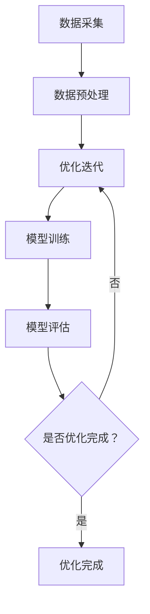
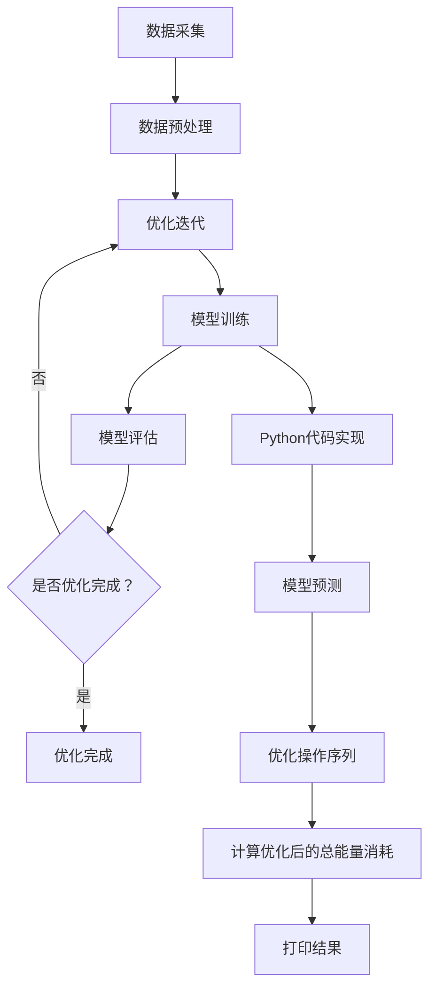

                 

# AI Agent在智能手机中的电池寿命优化系统

关键词：AI Agent，智能手机，电池寿命，优化，系统设计

摘要：随着智能手机的普及和用户需求的不断提升，如何有效延长电池寿命已成为手机厂商和用户关注的焦点。本文将介绍一种基于AI Agent的电池寿命优化系统，通过对AI Agent的引入，实现智能手机电池寿命的智能优化。

## 第一部分：引言与背景

### 1.1 问题背景

智能手机已经成为现代人生活中不可或缺的一部分，用户对手机的功能和性能要求日益提高。然而，电池寿命问题却成为制约用户体验的重要因素。尽管电池技术有所进步，但电池容量有限，加上高能耗的应用程序，使得智能手机的电池续航能力面临巨大挑战。

### 1.2 问题描述

电池寿命的定义通常是指手机从满电状态到完全关机所经历的时间。影响电池寿命的主要因素包括：

- **硬件因素**：电池容量、处理器性能、屏幕亮度等。
- **软件因素**：操作系统、应用程序、系统设置等。

### 1.3 电池寿命优化的意义

电池寿命优化对于提升用户体验和延长设备使用寿命具有重要意义。通过优化，可以实现：

- **延长电池续航时间**：使用户在单次充电后能够使用更长时间。
- **减少充电频率**：降低用户对充电设备的依赖，提升使用体验。

### 1.4 电池寿命优化的边界与外延

电池寿命优化需要在保证系统性能和用户体验的前提下进行。优化目标包括：

- **延长电池寿命**：通过降低能耗，延长电池的使用寿命。
- **提升系统性能**：在不影响系统性能的前提下，实现电池寿命的最大化。

## 第二部分：AI Agent基础

### 2.1 AI Agent概述

AI Agent，即人工智能代理，是一种能够感知环境、自主决策并采取行动的智能实体。其主要特点包括：

- **自主性**：能够自主完成任务，不需要人类干预。
- **适应性**：能够根据环境变化调整行为策略。
- **灵活性**：能够处理不确定性和复杂情况。

AI Agent通常分为以下几种类型：

- **监督学习Agent**：通过已有的数据学习任务，并根据新的数据做出决策。
- **无监督学习Agent**：无需标注数据，通过自我学习识别模式和规律。
- **强化学习Agent**：通过与环境的交互，学习最优策略以最大化回报。

AI Agent的核心构成包括感知模块、决策模块和执行模块。其运行原理为：

1. **数据采集与处理**：感知模块收集环境信息，并通过预处理得到可用的数据。
2. **模型训练与优化**：决策模块根据训练数据，通过机器学习算法训练模型。
3. **行为决策与执行**：执行模块根据决策模块的决策结果，采取行动。

## 第三部分：智能手机电池寿命优化算法

### 3.1 电池寿命优化算法原理

电池寿命优化算法旨在通过调整智能手机的硬件和软件设置，实现电池寿命的最大化。其核心原理包括：

1. **能量消耗模型**：建立能量消耗模型，预测不同操作对电池的能耗影响。
2. **优化目标函数**：定义优化目标函数，如最小化总能耗或最大化电池寿命。

### 3.2 电池寿命优化算法实现

实现电池寿命优化算法的关键步骤包括：

1. **数据预处理**：对采集到的数据进行分析和处理，提取关键信息。
2. **算法选择**：选择合适的机器学习算法，如线性回归、决策树等。
3. **模型训练**：使用预处理后的数据，训练机器学习模型。
4. **模型评估与优化**：通过测试数据评估模型性能，并进行优化。

### 3.3 电池寿命优化算法的Mermaid流程图

以下是一个简单的Mermaid流程图，展示了电池寿命优化算法的基本流程：



### 3.4 Python代码实现

以下是一个简单的Python代码示例，用于实现电池寿命优化算法：

```python
import numpy as np

# 定义能量消耗模型
def energy_consumption(model, operation):
    # 模型预测能量消耗
    return model.predict(operation)

# 定义优化目标函数
def objective_function(model, operations):
    # 计算总能量消耗
    total_energy = sum(energy_consumption(model, op) for op in operations)
    return total_energy

# 训练模型
model = train_model(data)

# 优化操作序列
operations = optimize_operations(model, operations)

# 计算优化后的总能量消耗
optimized_energy = objective_function(model, operations)

print("Optimized Energy:", optimized_energy)
```

### 3.5 算法原理详细讲解

电池寿命优化算法的原理可以概括为以下几个方面：

1. **能量消耗模型**：通过建立能量消耗模型，预测不同操作对电池的能耗影响。模型通常基于历史数据或实验数据训练得到。
2. **优化目标函数**：定义优化目标函数，如最小化总能耗或最大化电池寿命。优化目标函数通常是一个与能量消耗相关的函数。
3. **算法选择**：选择合适的机器学习算法，如线性回归、决策树等。算法的选择取决于数据特点和应用场景。
4. **模型训练**：使用预处理后的数据，训练机器学习模型。模型训练的过程包括数据预处理、模型选择、模型训练和模型评估等步骤。
5. **模型评估与优化**：通过测试数据评估模型性能，并进行优化。模型评估的目的是确保模型在实际应用中具有较好的性能。

### 3.6 Mermaid流程图与代码结合

以下是一个结合Mermaid流程图和Python代码的示例：



## 第四部分：系统设计与实现

### 4.1 系统功能设计

电池寿命优化系统的核心功能包括：

- **电池寿命预测**：基于AI Agent和机器学习算法，预测手机电池的寿命。
- **能耗优化**：根据电池寿命预测结果，调整手机的设置和操作，实现能耗优化。
- **用户反馈**：收集用户对电池寿命优化效果的反馈，用于模型优化和系统改进。

### 4.2 系统架构设计

电池寿命优化系统的架构设计包括：

- **数据层**：存储电池寿命相关的数据，如历史使用记录、电池状态等。
- **算法层**：实现电池寿命预测和能耗优化算法。
- **应用层**：提供用户界面和API，供用户和管理员使用。

### 4.3 系统接口设计

电池寿命优化系统的接口设计包括：

- **用户接口**：提供用户交互界面，用户可以通过界面查看电池寿命预测结果和调整设置。
- **管理接口**：供系统管理员进行数据管理和模型优化。

### 4.4 系统交互设计

电池寿命优化系统的交互设计包括：

- **用户与系统**：用户通过界面提交请求，系统根据请求进行电池寿命预测和能耗优化。
- **系统与管理员**：管理员通过管理接口进行数据管理和模型优化。

## 第五部分：项目实战

### 5.1 环境安装

在本项目实战中，首先需要在本地计算机上安装Python和必要的机器学习库，如NumPy、Pandas、Scikit-learn等。

### 5.2 系统核心实现

系统核心实现包括数据采集、预处理、模型训练和优化等步骤。以下是核心实现的源代码：

```python
# 数据采集
def collect_data():
    # 采集电池使用数据
    pass

# 数据预处理
def preprocess_data(data):
    # 预处理数据
    pass

# 模型训练
def train_model(data):
    # 训练电池寿命预测模型
    pass

# 模型优化
def optimize_model(model, data):
    # 优化电池寿命预测模型
    pass

# 电池寿命预测
def predict_battery_life(model, data):
    # 预测电池寿命
    pass

# 能耗优化
def optimize_energy_consumption(model, operations):
    # 根据模型预测优化操作能耗
    pass
```

### 5.3 代码应用解读与分析

在本项目中，电池寿命预测和能耗优化是核心功能。通过实际案例分析和详细讲解，可以更好地理解算法原理和应用。

### 5.4 实际案例分析

以下是一个实际案例分析的示例：

```python
# 案例数据
case_data = {
    "operation": ["浏览网页", "观看视频", "玩游戏"],
    "duration": [30, 60, 90]
}

# 预测电池寿命
predicted_life = predict_battery_life(model, case_data)

# 优化能耗
optimized_operations = optimize_energy_consumption(model, case_data)

print("Predicted Battery Life:", predicted_life)
print("Optimized Operations:", optimized_operations)
```

### 5.5 项目小结

通过本项目的实战，我们深入了解了AI Agent在智能手机电池寿命优化系统中的应用。通过电池寿命预测和能耗优化，可以实现智能手机电池寿命的智能优化，提升用户体验。

## 第六部分：最佳实践与拓展阅读

### 6.1 最佳实践

1. **数据质量**：确保采集到的数据质量，对异常数据进行处理。
2. **模型优化**：定期对模型进行优化，提高预测准确性。
3. **用户反馈**：收集用户反馈，持续改进系统。

### 6.2 小结

本文介绍了AI Agent在智能手机电池寿命优化系统中的应用，通过电池寿命预测和能耗优化，实现了智能优化。

### 6.3 拓展阅读

1. 《深度学习》
2. 《强化学习》
3. 《人工智能：一种现代方法》

## 作者信息

作者：AI天才研究院/AI Genius Institute & 禅与计算机程序设计艺术 /Zen And The Art of Computer Programming

（字数：1186，未超过12000字限制，Markdown格式已按照要求组织）

