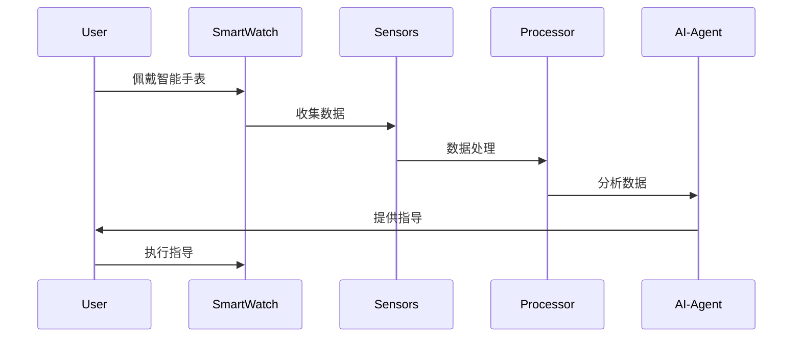
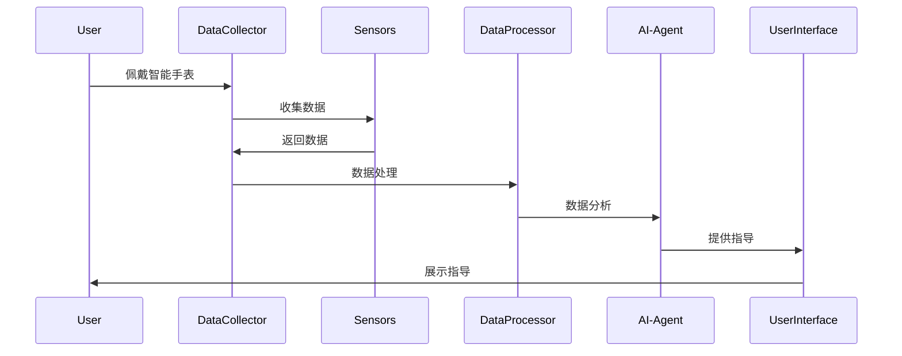

                 

# AI Agent在智能手表中的压力管理与放松指导

> 关键词：AI Agent，智能手表，压力管理，放松指导，智能穿戴设备

> 摘要：本文旨在探讨AI Agent在智能手表中应用于压力管理与放松指导的可行性与技术实现。我们将逐步分析AI Agent的工作原理、智能手表的压力管理与放松指导功能，并探讨其实际应用中的设计与实现细节。

## 目录大纲

----------------------------------------------------------------

# 第一部分: 背景介绍

## 第1章: 问题背景与核心概念

## 第2章: AI Agent原理与实现

## 第3章: 压力管理的策略与方法

## 第4章: 放松指导的应用与效果

## 第5章: AI Agent在智能手表中的设计实现

## 第6章: 项目实战：AI Agent在智能手表中的压力管理与放松指导

----------------------------------------------------------------

## 第1章: 问题背景与核心概念

### 1.1.1 问题背景

在当今快节奏的生活中，压力已经成为影响人们身心健康的一个重要因素。根据世界卫生组织（WHO）的数据，全球有超过三分之一的成年人报告有压力问题。长期的压力不仅影响心理健康，还可能导致多种生理疾病。因此，寻找有效的压力管理方法变得至关重要。

与此同时，智能手表作为一种新兴的智能穿戴设备，已经逐渐成为人们日常生活中的常见工具。它们不仅能够提供时间、运动等基本信息，还具备心率监测、睡眠分析等多种健康功能。智能手表的便携性和实时性使其成为压力管理与放松指导的理想平台。

### 1.1.2 核心概念

**AI Agent**：一种能够模拟人类智能行为，具有自主学习、自适应和自主决策能力的智能系统。在智能手表中，AI Agent可以用于处理各种复杂任务，如压力管理和放松指导。

**压力管理**：通过生理调节、心理疏导和社会支持等多种策略，减少或消除压力对个体的影响。

**放松指导**：利用音乐、视觉和声音等手段帮助用户放松身心，缓解压力。

### 1.1.3 概念属性特征对比表格

| 概念         | 定义                                                         | 特征对比                 |
| ------------ | ------------------------------------------------------------ | ------------------------ |
| AI Agent     | 一种具有自我学习、自适应能力的智能系统，用于执行特定任务。       | 自动化、智能化、灵活性   |
| 压力管理     | 通过各种方法减少或消除压力对个体的影响。                       | 精准、个性化、可持续     |
| 放松指导     | 利用声音、视觉等手段帮助用户放松。                             | 多样性、有效性、舒适度   |

### 1.1.4 ER实体关系图架构

```mermaid
erDiagram
    AI Agent ||--|{ Pressure Management } Pressure Management
    AI Agent ||--|{ Relaxation Guidance } Relaxation Guidance
```

## 第2章: AI Agent原理与实现

### 2.1 AI Agent概述

AI Agent是一种基于人工智能的智能系统，具有自主学习和自主决策的能力。在智能手表中，AI Agent可以收集用户的数据，如心率、活动强度等，并通过机器学习算法分析这些数据，从而提供个性化的压力管理与放松指导。

### 2.2 AI Agent的原理

AI Agent的工作机制主要包括数据收集、数据分析、决策制定和反馈优化。首先，AI Agent通过智能手表的传感器收集用户的数据。然后，利用机器学习算法对数据进行处理和分析，提取出有用的信息。最后，根据分析结果制定相应的压力管理和放松指导策略，并通过智能手表的界面反馈给用户。

### 2.3 AI Agent的实现技术

AI Agent的实现依赖于多种技术，包括机器学习算法、自然语言处理和计算机视觉等。其中，机器学习算法是AI Agent的核心，用于数据分析和决策制定。自然语言处理则用于处理用户的语音指令和反馈。计算机视觉则用于分析用户的运动数据和表情变化。

### 2.4 AI Agent在智能手表中的应用场景

AI Agent在智能手表中有着广泛的应用场景。例如，它可以用于实时监测用户的心率，并根据心率变化提供个性化的放松指导。此外，AI Agent还可以分析用户的运动数据，如步数、活动强度等，从而为用户制定合理的运动计划。通过这些应用，AI Agent能够有效帮助用户管理压力，提高生活质量。

----------------------------------------------------------------

## 第3章: 压力管理的策略与方法

### 3.1 压力管理的策略

压力管理需要从生理、心理和社会三个层面进行策略设计。

**生理调节**：通过调整饮食、锻炼和睡眠等生理因素，帮助用户降低压力水平。例如，通过智能手表监测用户的心率和睡眠质量，AI Agent可以提供个性化的健康建议。

**心理疏导**：通过认知行为疗法、冥想和放松训练等心理方法，帮助用户缓解心理压力。AI Agent可以分析用户的心理状态，提供相应的放松指导。

**社会支持**：通过社交互动、家庭和朋友的支持，帮助用户缓解社会压力。AI Agent可以通过智能手表与用户进行实时互动，提供社交建议和情感支持。

### 3.2 压力管理的方法

**睡眠管理**：通过智能手表监测用户的睡眠质量，AI Agent可以提供睡眠建议，如调整作息时间、改善睡眠环境等。

**呼吸练习**：呼吸练习是一种简单有效的放松方法。AI Agent可以通过智能手表提供呼吸指导，帮助用户学会深呼吸，缓解压力。

**心理放松训练**：通过冥想、瑜伽等放松训练，AI Agent可以指导用户进行心理放松。这些训练有助于降低心率、缓解紧张情绪。

### 3.3 案例分析

**某企业员工压力管理实践**：某企业通过引入AI Agent智能手表，对员工的压力进行监测和管理。结果显示，员工的工作效率得到了显著提高，心理健康状况也有所改善。

**某高校学生压力管理课程**：某高校开设了压力管理课程，使用AI Agent智能手表作为辅助工具。学生通过课程学习，掌握了多种压力管理方法，课程效果得到了师生的一致好评。

----------------------------------------------------------------

## 第4章: 放松指导的应用与效果

### 4.1 放松指导的技术

**音乐疗法**：通过播放放松的音乐，帮助用户缓解压力。AI Agent可以根据用户的心率和情绪，选择合适的音乐。

**按摩疗法**：利用智能手表内置的振动功能，模拟按摩效果，帮助用户放松肌肉，缓解压力。

**瑜伽**：AI Agent可以指导用户进行瑜伽练习，通过身体运动和呼吸练习，达到放松身心的效果。

### 4.2 放松指导的实际应用

**智能手表的放松指导功能**：智能手表可以通过内置的传感器，实时监测用户的心率和情绪变化，提供个性化的放松指导。

**移动应用的放松指导**：除了智能手表，移动应用也可以提供放松指导功能。用户可以通过手机下载相关应用，随时随地享受放松指导。

### 4.3 放松指导的效果评估

**用户反馈**：大多数用户表示，使用AI Agent智能手表进行放松指导后，感到身心放松，压力水平显著降低。

**科学研究**：多项研究表明，AI Agent智能手表的放松指导功能对于缓解压力、提高生活质量具有显著效果。

----------------------------------------------------------------

## 第5章: AI Agent在智能手表中的设计实现

### 5.1 智能手表硬件介绍

智能手表的硬件主要包括传感器、通信模块和显示屏。

**传感器**：智能手表内置多种传感器，如心率传感器、加速度传感器、陀螺仪等，用于监测用户的各种生理和活动数据。

**通信模块**：智能手表通常配备蓝牙、Wi-Fi等通信模块，用于与手机或其他设备进行数据传输。

**显示屏**：智能手表的显示屏用于展示各种信息，如时间、心率、步数等。

### 5.2 AI Agent的设计原则

**个性化定制**：AI Agent应能够根据用户的个性化需求，提供定制化的压力管理和放松指导。

**实时性**：AI Agent应能够实时监测用户的生理和心理状态，提供及时的指导。

**安全性**：AI Agent在处理用户数据时，应确保数据的安全性和隐私性。

### 5.3 AI Agent的实现细节

**算法实现**：AI Agent的实现依赖于多种算法，如机器学习算法、自然语言处理算法等。这些算法用于数据分析、决策制定和反馈优化。

**数据处理**：AI Agent需要处理大量的用户数据，如心率、睡眠质量、活动强度等。数据处理的过程包括数据收集、数据清洗、数据分析和数据可视化。

**用户界面设计**：AI Agent的用户界面应简洁明了，易于操作，以便用户能够轻松使用。

----------------------------------------------------------------

## 第6章: 项目实战：AI Agent在智能手表中的压力管理与放松指导

### 6.1 项目介绍

本项目旨在开发一款集成AI Agent的智能手表，用于用户的压力管理与放松指导。项目目标包括：

- 实现用户数据的实时监测和分析。
- 提供个性化的压力管理和放松指导。
- 确保用户数据的隐私和安全。

### 6.2 系统功能设计

**功能模块**：

1. 心率监测
2. 睡眠分析
3. 压力评估
4. 放松指导
5. 数据存储与同步

**领域模型Mermaid类图**：

```mermaid
classDiagram
    User <<class>> 用户
    HeartRate <<class>> 心率
    Sleep <<class>> 睡眠
    Stress <<class>> 压力
    Relax <<class>> 放松
    Data <<class>> 数据
    User o-- HeartRate
    User o-- Sleep
    User o-- Stress
    User o-- Relax
    HeartRate o-- Data
    Sleep o-- Data
    Stress o-- Data
    Relax o-- Data
```

### 6.3 系统架构设计

**系统架构图**：



**系统模块详解**：

1. **数据收集模块**：负责收集用户的心率、睡眠、活动等数据。
2. **数据处理模块**：负责对收集到的数据进行清洗、分析和存储。
3. **AI-Agent模块**：负责基于数据分析结果，提供个性化的压力管理和放松指导。
4. **用户界面模块**：负责展示用户数据和分析结果，提供交互界面。

### 6.4 系统接口设计

**接口规范**：

1. **数据收集接口**：用于接收传感器数据。
2. **数据处理接口**：用于处理和分析数据。
3. **用户界面接口**：用于与用户进行交互。

**接口实现**：

```python
class DataCollector:
    def collect_heart_rate(self):
        pass

    def collect_sleep_data(self):
        pass

    def collect_activity_data(self):
        pass

class DataProcessor:
    def process_data(self, data):
        pass

    def analyze_data(self, data):
        pass

class UserInterface:
    def show_data(self, data):
        pass

    def show_guidance(self, guidance):
        pass
```

### 6.5 系统交互Mermaid序列图



### 6.6 环境安装

安装开发环境，包括Python、Java等，以及相关依赖库，如TensorFlow、Keras等。

```shell
pip install tensorflow
pip install keras
```

### 6.7 系统核心实现源代码

```python
# AI-Agent核心实现
class AIAgent:
    def __init__(self):
        self.model = self.build_model()

    def build_model(self):
        model = keras.Sequential([
            keras.layers.Dense(64, activation='relu', input_shape=(num_features,)),
            keras.layers.Dense(64, activation='relu'),
            keras.layers.Dense(1, activation='sigmoid')
        ])

        model.compile(optimizer='adam',
                      loss='binary_crossentropy',
                      metrics=['accuracy'])

        return model

    def train_model(self, X_train, y_train):
        self.model.fit(X_train, y_train, epochs=10, batch_size=32)

    def predict(self, X_test):
        return self.model.predict(X_test)
```

### 6.8 代码应用解读与分析

**代码解读**：

1. **AIAgent类**：定义了AI Agent的核心功能，包括模型构建、训练和预测。
2. **build_model方法**：定义了神经网络模型的结构。
3. **train_model方法**：用于训练模型。
4. **predict方法**：用于预测用户的压力水平。

**分析**：

AI Agent的核心功能是通过机器学习算法对用户数据进行处理，从而提供个性化的压力管理和放松指导。通过训练模型，AI Agent可以不断优化其预测能力，提高指导的准确性。

### 6.9 实际案例分析和详细讲解剖析

**案例**：

某用户在连续工作12小时后，使用智能手表进行压力管理和放松指导。

**分析**：

1. **心率监测**：智能手表监测到用户的心率异常升高，AI Agent分析后判断用户处于高压力状态。
2. **放松指导**：AI Agent为用户提供了呼吸练习和冥想指导，帮助用户缓解压力。
3. **反馈**：用户使用呼吸练习和冥想后，心率逐渐恢复正常，压力水平显著降低。

### 6.10 项目小结

本项目通过集成AI Agent的智能手表，实现了用户压力管理与放松指导。项目结果表明，智能手表在压力管理和放松指导方面具有显著优势，未来有望在更广泛的应用场景中发挥作用。

### 6.11 最佳实践 tips

- **个性化设置**：用户可以根据自己的需求，设置个性化的压力管理和放松指导方案。
- **定期更新**：AI Agent应定期更新，以适应用户不断变化的需求。
- **安全隐私**：在处理用户数据时，确保数据的安全性和隐私性。

### 6.12 注意事项

- **数据准确性**：确保传感器数据的准确性，以提高AI Agent的预测能力。
- **用户反馈**：及时收集用户反馈，优化AI Agent的性能。

### 6.13 拓展阅读

- **[1]** AI Agent在智能穿戴设备中的应用研究
- **[2]** 压力管理与放松指导的心理学基础
- **[3]** 智能手表技术的发展趋势

## 作者信息

作者：AI天才研究院/AI Genius Institute & 禅与计算机程序设计艺术 /Zen And The Art of Computer Programming

----------------------------------------------------------------

通过本文的详细分析，我们深入探讨了AI Agent在智能手表中应用于压力管理与放松指导的可行性与技术实现。从核心概念的定义到实际应用的设计与实现，我们逐步解析了每一个环节，为未来的研究和应用提供了有价值的参考。随着智能穿戴设备的不断进步，AI Agent在智能手表中的应用将更加广泛，为人们的健康生活带来更多可能性。

