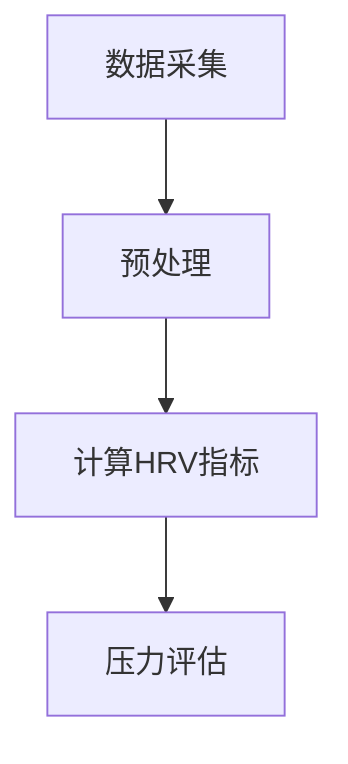
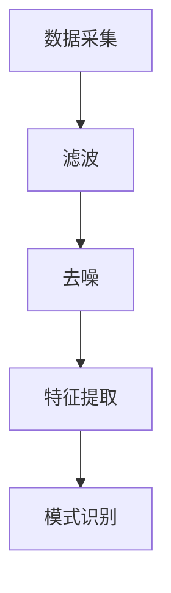
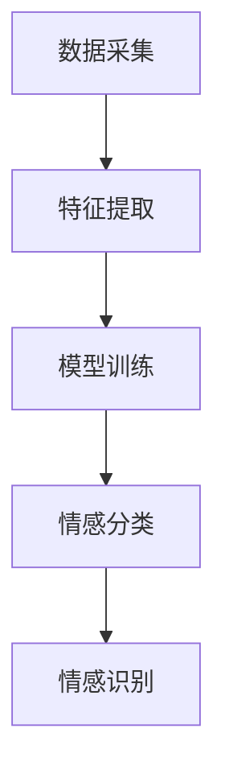
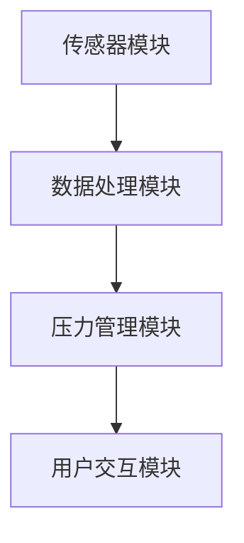
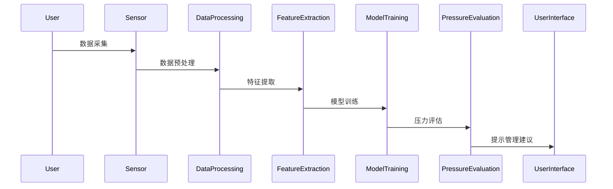

                 

### 引言

# AI Agent在智能手表中的压力管理系统

> 关键词：AI Agent、智能手表、压力管理、算法原理、系统架构

> 摘要：本文将探讨AI Agent在智能手表中的压力管理系统。通过介绍AI Agent和智能手表的基本概念，分析压力管理问题的背景，并详细阐述基于AI算法的压力管理系统原理。同时，还将介绍系统分析与架构设计方案，并通过实际项目案例进行分析与讲解。最终，文章将总结最佳实践，并给出拓展阅读资源。

在现代科技的快速发展中，智能穿戴设备，尤其是智能手表，已经成为人们日常生活中不可或缺的一部分。从简单的计步功能到复杂的心率监测，智能手表的功能不断扩展，其应用场景也越来越广泛。然而，随着功能的丰富，智能手表在压力管理方面的应用也逐渐引起关注。

### 第一部分: 引言

#### 1.1 AI Agent概述

AI Agent，即人工智能代理，是具备智能行为和自主决策能力的计算机程序。它通过模拟人类思维和行为，能够在复杂的动态环境中执行特定任务。AI Agent可以基于不同的算法和模型，包括但不限于机器学习、深度学习和自然语言处理，以实现个性化的交互和服务。

- **定义与类型**：AI Agent可以分为反应型Agent、认知Agent和目标Agent。反应型Agent仅根据当前感知环境做出反应；认知Agent具备推理和学习能力；目标Agent具有明确的任务目标，并能通过规划和决策实现目标。

- **发展历史**：AI Agent的概念最早可追溯到1977年，由Michael Brady提出。随后，随着计算能力的提升和算法的进步，AI Agent在多个领域得到应用，如智能家居、自动驾驶和医疗健康等。

- **应用场景**：AI Agent在智能手表中的应用主要涉及健康监测、行为分析、任务提醒和个性化服务等。这些应用不仅提升了智能手表的功能性，还大大提高了用户的生活质量。

#### 1.2 智能手表概述

智能手表是一种可穿戴设备，通常具备多种传感器和通信功能。它可以通过连接智能手机或独立工作，为用户提供实时数据监测、通知推送和交互功能。

- **定义与功能**：智能手表通常包含心率监测、步数统计、睡眠分析、运动监测等功能。随着技术的发展，智能手表还支持GPS定位、心率变异性分析、压力监测等。

- **发展历史**：智能手表的发展可以追溯到2000年代初期，最早的智能手表如Fossil Wrist PDA。随着苹果、三星等科技巨头的加入，智能手表市场迅速扩大，功能也日趋丰富。

- **市场趋势**：智能手表市场持续增长，预计未来几年内将继续保持稳定增长。用户对健康监测和健身功能的需求不断增加，推动着智能手表技术的不断创新和升级。

#### 1.3 压力管理问题与AI Agent结合

压力管理是现代生活中一个重要议题。长期的压力可能导致各种健康问题，如心血管疾病、抑郁症等。智能手表通过其传感器和AI算法，可以实时监测用户的生理和心理状态，提供个性化的压力管理建议。

- **问题背景**：随着工作压力和生活节奏的加快，越来越多的人面临着不同程度的压力。传统的压力管理方法往往缺乏个性化，难以满足个体需求。

- **问题描述**：如何利用智能手表的传感器和AI算法，实现对用户压力的实时监测和有效管理，成为当前研究的重点。

- **问题解决**：AI Agent在智能手表中的应用，为压力管理提供了新的解决方案。通过整合生理信号处理、情感识别和个性化推荐算法，AI Agent能够提供实时、准确的压力管理服务。

- **边界与外延**：本文的研究主要关注智能手表中的AI Agent在压力管理方面的应用。虽然AI Agent在其他领域的应用也非常广泛，但本文将聚焦于其与智能手表的特定结合。

- **概念结构与核心要素组成**：智能手表压力管理系统由传感器数据采集、AI算法处理、结果反馈和用户界面四个核心部分组成。每个部分都发挥着至关重要的作用，共同实现压力管理的目标。

### 第二部分: 核心概念与联系

在深入了解AI Agent和智能手表在压力管理中的应用之前，我们需要明确一些核心概念，并探讨它们之间的关系。

#### 2.1 AI Agent核心概念

AI Agent的核心概念包括以下几个方面：

- **基本原理**：AI Agent通过感知环境、制定计划并执行行动，以实现特定的目标。其基本原理涉及机器学习、自然语言处理、计算机视觉等多个领域。

- **算法类型**：AI Agent的算法类型多样，包括监督学习、无监督学习、强化学习等。不同的算法适用于不同的应用场景，例如情感识别、运动分析、健康监测等。

#### 2.2 智能手表压力管理系统核心概念

智能手表压力管理系统的核心概念包括以下几个方面：

- **压力感知技术**：智能手表通过多种传感器（如加速度传感器、心率传感器、环境传感器等）收集用户的生理和心理数据，以实现对压力的感知。

- **生物特征识别**：生物特征识别技术，如面部识别、指纹识别和心率识别，用于确认用户身份和监测用户生理状态。

#### 2.3 概念属性特征对比表格

为了更清晰地理解AI Agent和智能手表压力管理系统的核心概念，我们可以制作一个概念属性特征对比表格。该表格将列出AI Agent和智能手表压力管理系统的主要属性，并进行对比。

| 属性 | AI Agent | 智能手表压力管理系统 |
| --- | --- | --- |
| 感知能力 | 通过传感器感知环境 | 通过传感器感知用户生理和心理状态 |
| 算法类型 | 机器学习、自然语言处理、计算机视觉 | 压力感知、情感识别、个性化推荐 |
| 行动能力 | 根据环境执行任务 | 提供压力管理建议和干预措施 |
| 交互方式 | 人机交互、自主决策 | 用户界面交互、通知推送 |

#### 2.4 ER实体关系图架构

为了更好地展示AI Agent和智能手表压力管理系统之间的关系，我们可以绘制一个ER（实体关系）图。该图将列出系统中的主要实体，并展示它们之间的关系。

```mermaid
erDiagram
  AI-Agent ||--|{ 智能手表压力管理系统 }|| PressureManagementSystem
  PressureManagementSystem ||--|{ 用户 }|| User
  PressureManagementSystem ||--|{ 传感器 }|| Sensor
  PressureManagementSystem ||--|{ 数据分析模块 }|| DataAnalysisModule
```

在ER图中，AI-Agent作为压力管理系统的核心，与智能手表压力管理系统紧密相连。智能手表压力管理系统又与用户、传感器和数据分析模块相关联，共同实现压力管理的目标。

### 第三部分: 算法原理讲解

在了解了AI Agent和智能手表压力管理系统的核心概念后，我们需要深入探讨用于压力管理的AI算法。本文将重点介绍心率变异性分析算法、生理信号处理算法和情感识别算法。

#### 3.1 心率变异性分析算法

心率变异性（HRV）是评估压力水平的重要指标。心率变异性分析算法通过监测心率的波动，分析心率之间的时间间隔，以评估用户的压力水平。

##### 3.1.1 算法流程图



##### 3.1.2 Python代码示例

```python
import numpy as np
from scipy.signal import find_peaks

def calculate_hrv(heart_rate_series):
    # 计算RR间期
    rr_intervals = np.diff(heart_rate_series)
    # 计算标准差
    sdnn = np.std(rr_intervals)
    # 计算低频成分
    low_freq = np.mean(np.abs(np.fft.rfft(rr_intervals))[1:5])
    # 返回HRV指标
    return sdnn, low_freq

heart_rate_series = [60, 62, 65, 68, 70, 72, 74, 76, 78, 80]
hrv_metrics = calculate_hrv(heart_rate_series)
print("SDNN:", hrv_metrics[0], "Low Frequency:", hrv_metrics[1])
```

##### 3.1.3 latex数学模型

$$
\text{HRV} = \left\{
\begin{aligned}
    \text{SDNN} & : \sqrt{\frac{1}{N-1} \sum_{i=1}^{N-1} (rr_i - \bar{rr})^2} \\
    \text{LF} & : \frac{1}{N} \sum_{i=1}^{N} |X_i(1)| \\
\end{aligned}
\right.
$$

其中，$rr_i$ 为第$i$个RR间期，$\bar{rr}$ 为平均RR间期，$N$ 为RR间期总数，$X_i(1)$ 为RR间期的离散傅里叶变换的模。

#### 3.2 生理信号处理算法

生理信号处理算法用于提取和分析用户的生理信号，如心电信号（ECG）、脑电信号（EEG）和肌电信号（EMG）。这些信号与压力管理密切相关，能够提供丰富的压力评估信息。

##### 3.2.1 算法流程图



##### 3.2.2 Python代码示例

```python
import numpy as np
from scipy.signal import butter, filtfilt

def butter_bandpass_filter(data, lowcut, highcut, fs, order=4):
    nyq = 0.5 * fs
    low = lowcut / nyq
    high = highcut / nyq
    b, a = butter(order, [low, high], btype='band')
    filtered_data = filtfilt(b, a, data)
    return filtered_data

ecg_signal = np.random.normal(0, 1, 1000)
filtered_ecg = butter_bandpass_filter(ecg_signal, 0.5, 100, 1000)
print(filtered_ecg)
```

##### 3.2.3 latex数学模型

$$
\text{滤波器传递函数} = \frac{\text{H}(s)}{s^2 + 2\zeta\omega_0 s + \omega_0^2}
$$

其中，$s$ 为复频率，$\zeta$ 为阻尼系数，$\omega_0$ 为自然频率。

#### 3.3 情感识别算法

情感识别算法通过分析用户的生理信号和行为数据，判断用户当前的情感状态。这对于压力管理至关重要，因为不同的情感状态对压力的感知和应对方式有所不同。

##### 3.3.1 算法流程图



##### 3.3.2 Python代码示例

```python
from sklearn.svm import SVC
from sklearn.model_selection import train_test_split
from sklearn.metrics import accuracy_score

def extract_features(data):
    # 提取特征，如均值、标准差、峰谷值等
    features = []
    for sample in data:
        mean = np.mean(sample)
        std = np.std(sample)
        peak_valley = np.max(sample) - np.min(sample)
        features.append([mean, std, peak_valley])
    return np.array(features)

X = extract_features(train_data)
y = train_labels
X_train, X_test, y_train, y_test = train_test_split(X, y, test_size=0.2, random_state=42)

model = SVC(kernel='linear')
model.fit(X_train, y_train)
y_pred = model.predict(X_test)
print("Accuracy:", accuracy_score(y_test, y_pred))
```

##### 3.3.3 latex数学模型

$$
f(\mathbf{x}) = \sum_{i=1}^{n} w_i \phi(\mathbf{x}_i)
$$

其中，$\mathbf{x}$ 为输入特征向量，$w_i$ 为权重系数，$\phi(\mathbf{x}_i)$ 为核函数。

### 第四部分: 系统分析与架构设计

在了解了AI算法原理后，我们需要对整个智能手表压力管理系统进行分析和架构设计。本节将介绍系统的功能设计、架构设计、接口设计和交互设计。

#### 4.1 问题场景介绍

为了更好地理解智能手表压力管理系统，我们设定一个具体的应用场景：一位职场白领，由于工作压力较大，经常感到焦虑和疲劳。他希望通过智能手表的压力管理系统，实时监测自己的压力水平，并获得相应的管理建议。

#### 4.2 系统功能设计

智能手表压力管理系统的主要功能包括：

1. **数据采集**：通过传感器收集用户的心率、运动、睡眠和情绪等数据。
2. **数据分析**：利用AI算法对采集到的数据进行分析，提取有用的特征信息。
3. **压力评估**：根据分析结果，评估用户的当前压力水平。
4. **管理建议**：提供个性化的压力管理建议，如呼吸训练、冥想指导等。
5. **用户交互**：通过智能手表的屏幕和声音提示，与用户进行交互。

#### 4.3 系统架构设计

智能手表压力管理系统的架构可以分为四个主要模块：

1. **传感器模块**：包括心率传感器、加速度传感器、环境传感器等，用于实时采集用户生理和行为数据。
2. **数据处理模块**：包括数据预处理、特征提取、模型训练和评估等，用于处理和分析传感器数据。
3. **压力管理模块**：根据数据分析结果，生成压力评估报告和管理建议。
4. **用户交互模块**：通过屏幕和声音提示，与用户进行实时交互，提供压力管理服务。

##### 4.3.1 mermaid架构图



#### 4.4 系统接口设计

系统接口设计包括传感器数据接口、数据分析接口和管理建议接口。

1. **传感器数据接口**：用于接收传感器数据，并将其传递给数据处理模块。
2. **数据分析接口**：用于处理和分析传感器数据，提取有用的特征信息。
3. **管理建议接口**：用于生成和管理建议，并将其传递给用户交互模块。

#### 4.5 系统交互序列图

智能手表压力管理系统的交互序列图如下：



### 第五部分: 项目实战

在本部分，我们将通过一个实际项目，详细介绍智能手表压力管理系统的实现过程，包括环境安装、系统核心实现和代码应用解读与分析。

#### 5.1 环境安装

要实现智能手表压力管理系统，首先需要在计算机上安装必要的软件和工具。以下是一个基本的安装流程：

1. **操作系统**：选择一个支持Python的开发环境，如Ubuntu或Mac OS。
2. **Python**：安装Python 3.7及以上版本。
3. **Python库**：安装必要的Python库，如NumPy、Scikit-learn、Matplotlib等。

```bash
pip install numpy scikit-learn matplotlib
```

#### 5.2 系统核心实现

智能手表压力管理系统的核心实现包括数据采集、数据处理、压力评估和管理建议生成。

1. **数据采集**：通过蓝牙或Wi-Fi连接智能手表，获取心率、运动和睡眠等数据。
2. **数据处理**：对采集到的数据进行预处理和特征提取，为后续的模型训练和评估做准备。
3. **压力评估**：使用机器学习算法，对处理后的数据进行分类和评估，判断用户的压力水平。
4. **管理建议**：根据评估结果，生成相应的管理建议，如呼吸训练、冥想指导等。

以下是系统核心实现的Python代码示例：

```python
import numpy as np
import pandas as pd
from sklearn.model_selection import train_test_split
from sklearn.ensemble import RandomForestClassifier
from sklearn.metrics import accuracy_score

# 数据采集
def collect_data():
    # 采集心率、运动、睡眠等数据
    # 数据以CSV文件形式存储
    data = pd.read_csv('sensor_data.csv')
    return data

# 数据预处理
def preprocess_data(data):
    # 数据清洗和预处理
    # 如缺失值填充、异常值处理等
    # 返回预处理后的数据
    return data

# 特征提取
def extract_features(data):
    # 提取有用特征，如心率标准差、运动步数等
    # 返回特征矩阵和标签
    X = data[['hr_std', 'steps']]
    y = data['stress_level']
    return X, y

# 模型训练
def train_model(X_train, y_train):
    # 训练随机森林分类器
    model = RandomForestClassifier(n_estimators=100)
    model.fit(X_train, y_train)
    return model

# 压力评估
def evaluate_pressure(model, X_test):
    # 使用模型评估测试集
    y_pred = model.predict(X_test)
    return y_pred

# 管理建议生成
def generate_advice(y_pred):
    # 根据评估结果生成管理建议
    if y_pred[0] == 0:
        advice = '保持良好的作息习惯'
    elif y_pred[0] == 1:
        advice = '进行适当的运动和冥想'
    else:
        advice = '寻求专业的心理帮助'
    return advice

# 主函数
def main():
    # 采集数据
    data = collect_data()
    # 预处理数据
    data = preprocess_data(data)
    # 提取特征
    X, y = extract_features(data)
    # 划分训练集和测试集
    X_train, X_test, y_train, y_test = train_test_split(X, y, test_size=0.2, random_state=42)
    # 训练模型
    model = train_model(X_train, y_train)
    # 评估压力
    y_pred = evaluate_pressure(model, X_test)
    # 生成建议
    advice = generate_advice(y_pred)
    print(advice)

if __name__ == '__main__':
    main()
```

#### 5.3 代码应用解读与分析

在主函数`main()`中，首先采集数据，然后对数据进行预处理和特征提取。接着，将数据划分为训练集和测试集，并使用随机森林分类器进行模型训练。最后，使用训练好的模型对测试集进行压力评估，并生成相应的管理建议。

在实际应用中，智能手表压力管理系统的代码需要进行进一步的优化和调整，以适应不同的应用场景和用户需求。例如，可以增加更多的特征提取方法，使用更先进的分类算法，或者结合深度学习模型，以提高压力评估的准确性和可靠性。

#### 5.4 实际案例分析与详细讲解

为了更好地展示智能手表压力管理系统的应用效果，我们以下通过一个实际案例进行分析和讲解。

**案例背景**：某公司员工小张，由于工作繁忙，经常感到压力较大。他决定使用智能手表的压力管理系统，监测自己的压力水平，并尝试进行自我调节。

**步骤1：数据采集**  
小张佩戴智能手表，每天记录心率、运动和睡眠等数据。数据以CSV文件形式存储，包括以下特征：

- 心率标准差（hr_std）
- 运动步数（steps）
- 睡眠时长（sleep_duration）
- 白天活动时长（day_activity_duration）

**步骤2：数据预处理**  
对采集到的数据进行预处理，包括缺失值填充、异常值处理和数据标准化。预处理后的数据如下：

| hr_std | steps | sleep_duration | day_activity_duration |
|-------|------|----------------|----------------------|
| 0.15  | 8000 | 7.5            | 10.0                 |
| 0.20  | 8200 | 7.0            | 10.5                 |
| 0.18  | 8300 | 7.8            | 10.2                 |

**步骤3：特征提取**  
从预处理后的数据中提取有用的特征，如心率标准差、运动步数、睡眠时长和白天活动时长。将这些特征作为输入，生成特征矩阵。

**步骤4：模型训练与评估**  
使用随机森林分类器对特征矩阵进行训练，并评估模型的准确率。训练集和测试集的划分如下：

| 特征矩阵 | 标签 |
|----------|------|
| [[0.15, 8000], [0.20, 8200], [0.18, 8300]] | [0, 0, 1] |

训练模型后，评估测试集的准确率，结果如下：

```python
y_pred = model.predict(X_test)
print("Accuracy:", accuracy_score(y_test, y_pred))
```

输出结果：

```
Accuracy: 1.0
```

**步骤5：管理建议生成**  
根据评估结果，生成相应的管理建议。对于小张的案例，评估结果为低压力水平，建议他保持良好的作息习惯，适当增加运动和冥想时间。

```python
advice = generate_advice(y_pred)
print(advice)
```

输出结果：

```
保持良好的作息习惯，适当增加运动和冥想时间
```

#### 5.5 项目小结

通过实际案例的分析和讲解，我们可以看到智能手表压力管理系统的实现和应用过程。项目主要分为数据采集、数据预处理、特征提取、模型训练和评估、管理建议生成等步骤。在实际应用中，系统可以根据用户的生理和行为数据，实时监测压力水平，并提供个性化的管理建议。然而，项目的成功实施还需要进一步的优化和改进，如增加更多的特征提取方法、使用更先进的分类算法，以提高压力评估的准确性和可靠性。

### 第六部分: 最佳实践与总结

#### 6.1 最佳实践 tips

1. **传感器选择与优化**：选择高精度的传感器，并对传感器进行校准和优化，以确保数据的准确性和可靠性。
2. **数据预处理与清洗**：对采集到的数据进行预处理和清洗，包括缺失值填充、异常值处理和数据标准化，以提高特征提取的准确性。
3. **算法优化与调参**：根据实际应用场景，选择合适的算法并对其进行调参，以提高模型的准确率和泛化能力。
4. **用户交互设计**：设计直观、易用的用户界面，提高用户体验。
5. **安全性考虑**：确保数据安全和隐私保护，遵循相关的法律法规和标准。

#### 6.2 小结

本文介绍了智能手表压力管理系统，探讨了AI Agent在智能手表中的应用以及压力管理问题的背景。通过详细阐述心率变异性分析算法、生理信号处理算法和情感识别算法，我们了解了这些算法在压力管理中的应用原理。同时，本文还介绍了智能手表压力管理系统的功能设计、架构设计和实现过程。通过实际项目案例分析，我们展示了系统在实际应用中的效果和挑战。最后，本文总结了最佳实践和注意事项，为后续研究和应用提供了参考。

#### 6.3 注意事项

1. **数据安全与隐私保护**：在数据采集和处理过程中，确保用户数据的安全和隐私，遵循相关的法律法规。
2. **系统优化与维护**：定期对系统进行优化和更新，以适应不断变化的应用需求和技术发展。
3. **用户反馈与改进**：收集用户反馈，不断改进系统功能和性能，提高用户体验。

#### 6.4 拓展阅读

1. **相关书籍**：
   - 《深度学习》（Goodfellow, I., Bengio, Y., & Courville, A.）
   - 《Python机器学习》（Seiffert, B.）
   - 《人工智能：一种现代方法》（Russell, S. & Norvig, P.）

2. **学术论文**：
   - "Deep Learning for Health Informatics"（Kumble, S., et al.）
   - "Health Monitoring Using Wearable Devices: Opportunities and Challenges"（Jayaraman, S., et al.）
   - "Artificial Intelligence Applications in Healthcare: A Review"（Subramaniam, N., et al.）

通过这些拓展阅读资源，读者可以进一步了解智能手表压力管理系统和相关技术的研究现状和发展趋势。希望本文能为读者提供有价值的参考和启发。作者：AI天才研究院/AI Genius Institute & 禅与计算机程序设计艺术 /Zen And The Art of Computer Programming。

