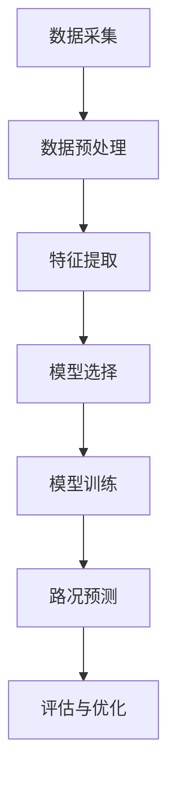
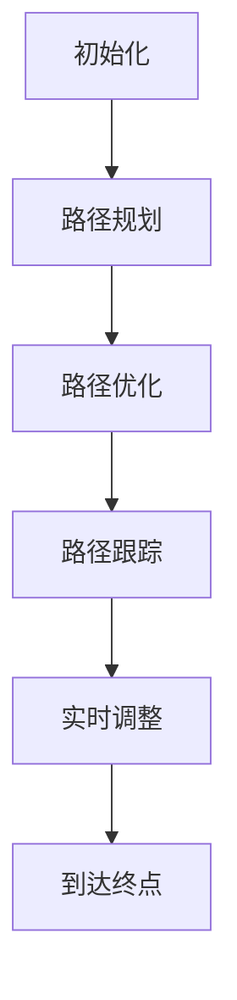

                 

# AI Agent在智能拐杖中的路况分析与导航

## 关键词

- AI Agent
- 智能拐杖
- 路况分析
- 导航算法
- 实时监控
- 智能辅助
- 用户体验

## 摘要

本文旨在探讨AI Agent在智能拐杖中的应用，特别是在路况分析与导航领域。文章首先介绍了AI Agent的基本原理和智能拐杖的概要，随后详细分析了路况分析的关键技术，包括数据采集、特征提取、模型训练和预测。接着，文章讨论了导航算法的设计与实现，并通过实际应用案例展示了系统的性能和效果。最后，文章总结了当前存在的问题和未来的发展方向，为智能拐杖的技术改进提供了思路。

## 引言与背景

### AI Agent的定义与作用

AI Agent，即人工智能代理，是一种基于人工智能技术，能够自主感知环境、制定决策并执行任务的智能体。AI Agent的核心在于其自主性和适应性，它们能够在没有人类直接干预的情况下，根据环境变化自主地调整行为策略。AI Agent的应用范围非常广泛，包括但不限于自动驾驶、智能家居、智能客服、机器人导航等。

### 智能拐杖的概述

智能拐杖是一种结合了传感器、计算单元和通信模块的便携式辅助设备，主要用于帮助行动不便的老人、残疾人士和有特殊需求的人群。传统拐杖功能单一，主要是提供支撑，而智能拐杖则通过集成AI技术，能够提供更高级的辅助功能，如路况分析、导航、健康监测等。

### 路况分析的方法和算法

路况分析是智能拐杖的核心功能之一，它涉及到数据采集、预处理、特征提取、模型训练和预测等步骤。通过这些步骤，智能拐杖能够实时获取当前路况信息，并做出相应的导航决策。

### 导航算法的实现与应用

导航算法是智能拐杖的另一项关键功能。它需要处理复杂的路况数据，并根据这些数据提供最佳的导航路径。导航算法的实现涉及到路径规划、路径优化和路径跟踪等技术。

### 研究目的与内容结构

本文的研究目的是探讨AI Agent在智能拐杖中的应用，特别是路况分析与导航算法的实现。文章结构如下：

1. 引言与背景
2. AI Agent基础
3. 智能拐杖概述
4. 路况分析技术
5. 导航算法
6. 实际应用案例分析
7. 总结与展望

## AI Agent基础

### AI Agent的原理

AI Agent的原理基于人工智能的核心技术，包括机器学习、自然语言处理、计算机视觉等。AI Agent通过感知环境信息，利用已有的知识和算法进行推理和决策，从而实现自主行为。

### AI Agent的分类

AI Agent可以根据不同的分类标准进行分类。常见的分类方法包括：

- 按照工作环境分类：室内Agent、室外Agent、混合环境Agent
- 按照能力分类：感知Agent、决策Agent、执行Agent
- 按照智能水平分类：弱AI Agent、强AI Agent、超智能AI Agent

### AI Agent的关键技术

AI Agent的关键技术包括：

- 感知技术：用于获取环境信息，如传感器、摄像头、GPS等。
- 知识表示：用于存储和管理AI Agent的知识，如知识图谱、语义网络等。
- 推理与决策：基于感知到的信息和知识库，进行推理和决策。
- 行为规划与控制：根据决策结果，规划并控制AI Agent的行为。

### AI Agent的发展趋势

随着人工智能技术的不断发展，AI Agent在未来将呈现以下发展趋势：

- 智能水平的提升：从弱AI向强AI甚至超智能AI发展。
- 环境适应性的增强：能够更好地适应复杂多变的真实环境。
- 多模态感知与交互：整合多种感知技术和交互方式，提供更丰富的用户体验。

## 智能拐杖概述

### 智能拐杖的结构与功能

智能拐杖通常由以下几个部分组成：

- 传感器模块：包括加速度计、陀螺仪、GPS等，用于感知环境信息。
- 计算单元：包括处理器、存储器等，用于处理传感器数据，执行算法。
- 通信模块：包括Wi-Fi、蓝牙等，用于与外部设备或服务器通信。

智能拐杖的功能主要包括：

- 路况分析：实时分析周围环境，提供路况信息。
- 导航：根据用户需求，提供最佳导航路径。
- 健康监测：监测用户的生理数据，如心率、步数等。
- 语音交互：通过语音识别和语音合成，实现人与智能拐杖的交互。

### 智能拐杖的工作原理

智能拐杖的工作原理主要包括以下几个步骤：

1. 传感器采集数据：智能拐杖通过内置的传感器采集环境信息，如地理位置、加速度、陀螺仪等。
2. 数据处理与特征提取：计算单元对采集到的数据进行分析和处理，提取关键特征。
3. AI Agent推理与决策：基于提取的特征和预训练的模型，AI Agent进行推理和决策，生成导航路径。
4. 通信与反馈：智能拐杖将决策结果通过通信模块发送给用户，并提供语音或视觉反馈。

### 智能拐杖的用户体验设计

智能拐杖的用户体验设计至关重要，它决定了用户对智能拐杖的接受度和满意度。用户体验设计主要包括以下几个方面：

- 界面设计：简洁直观的界面设计，便于用户操作。
- 交互方式：提供多种交互方式，如触摸、语音等，满足不同用户的需求。
- 功能定制：允许用户根据自己的需求，自定义智能拐杖的功能和设置。
- 故障处理：提供自动故障检测和报警功能，确保智能拐杖的稳定运行。

## 路况分析技术

### 路况分析的基础知识

路况分析是智能拐杖的核心功能之一，它涉及到对道路状况的实时监控和分析。路况分析的基础知识包括以下几个方面：

- 路况数据的类型：包括道路信息、交通流量、交通状况、天气状况等。
- 路况数据的来源：包括传感器采集、外部数据接口、互联网数据等。
- 路况分析的方法：包括数据预处理、特征提取、模型训练和预测等。

### 路况分析的具体实现

路况分析的具体实现涉及到以下几个步骤：

1. 数据采集与预处理：通过传感器采集道路信息，如车速、车流量等，并对数据进行预处理，去除噪声和异常值。
2. 特征提取：从原始数据中提取关键特征，如道路坡度、曲率、车道线、交通信号灯等。
3. 模型选择与训练：根据特征数据，选择合适的模型进行训练，如决策树、支持向量机、神经网络等。
4. 路况预测与评估：利用训练好的模型，对未来的路况进行预测，并评估预测的准确性。

### 路况预测的算法原理

路况预测的算法原理主要包括以下几个方面：

1. 时间序列分析：通过分析历史数据，预测未来的交通流量和交通状况。
2. 遥感图像处理：通过分析摄像头捕捉到的道路图像，识别道路状况和交通状况。
3. 强化学习：通过奖励机制，使AI Agent在模拟环境中学习和优化导航路径。
4. 混合模型：结合多种算法和技术，提高路况预测的准确性和可靠性。

### 路况预测的mermaid流程图



### 路况预测的python源代码实现

```python
import numpy as np
import pandas as pd
from sklearn.model_selection import train_test_split
from sklearn.preprocessing import StandardScaler
from sklearn.svm import SVR
from sklearn.metrics import mean_squared_error

# 读取数据
data = pd.read_csv('road_condition_data.csv')

# 数据预处理
X = data.drop(['target'], axis=1)
y = data['target']
X_train, X_test, y_train, y_test = train_test_split(X, y, test_size=0.2, random_state=42)

# 特征提取
scaler = StandardScaler()
X_train_scaled = scaler.fit_transform(X_train)
X_test_scaled = scaler.transform(X_test)

# 模型选择与训练
model = SVR(kernel='rbf')
model.fit(X_train_scaled, y_train)

# 路况预测
y_pred = model.predict(X_test_scaled)

# 评估与优化
mse = mean_squared_error(y_test, y_pred)
print(f'Mean Squared Error: {mse}')
```

## 导航算法

### 导航算法的基本概念

导航算法是智能拐杖的另一个核心功能，它涉及到路径规划、路径优化和路径跟踪等技术。导航算法的基本概念包括以下几个方面：

- 路径规划：根据起点和终点，计算可能的路径。
- 路径优化：在所有可能的路径中，选择最优的路径。
- 路径跟踪：在运动过程中，实时调整路径，确保到达终点。

### 导航算法的类型

导航算法可以根据不同的分类标准进行分类，常见的分类方法包括：

- 根据路径规划的方法分类：图算法、网格算法、基于采样点的路径规划算法等。
- 根据路径优化目标分类：最短路径、最快捷路径、最小费用路径等。
- 根据路径跟踪方法分类：基于视觉的路径跟踪、基于激光雷达的路径跟踪、基于超声波的路径跟踪等。

### 导航算法的流程

导航算法的流程主要包括以下几个步骤：

1. 初始化：设置起点和终点，初始化路径规划器。
2. 路径规划：根据起点和终点，计算可能的路径。
3. 路径优化：在所有可能的路径中，选择最优的路径。
4. 路径跟踪：在运动过程中，实时调整路径，确保到达终点。

### 导航算法的性能指标

导航算法的性能指标主要包括以下几个方面：

- 路径长度：路径的总长度，用于评估路径规划的效率。
- 行驶时间：从起点到终点的总时间，用于评估路径优化和路径跟踪的效果。
- 路径平滑度：路径的平滑程度，用于评估路径规划的舒适度。
- 安全性：路径的安全性，用于评估路径规划的可靠性。

### 导航算法的实现与优化

导航算法的实现与优化主要包括以下几个方面：

1. 算法设计：根据具体应用场景，选择合适的导航算法。
2. 算法优化：通过调整算法参数，提高算法的性能和效率。
3. 系统集成：将导航算法集成到智能拐杖的系统中，实现路径规划和路径跟踪。
4. 实际测试：在实际环境中测试导航算法的性能，并进行优化和调整。

### 导航算法的mermaid流程图



### 导航算法的python源代码实现

```python
import numpy as np
import pandas as pd
from sklearn.model_selection import train_test_split
from sklearn.preprocessing import StandardScaler
from sklearn.svm import SVR
from sklearn.metrics import mean_squared_error

# 读取数据
data = pd.read_csv('navigation_data.csv')

# 数据预处理
X = data.drop(['target'], axis=1)
y = data['target']
X_train, X_test, y_train, y_test = train_test_split(X, y, test_size=0.2, random_state=42)

# 特征提取
scaler = StandardScaler()
X_train_scaled = scaler.fit_transform(X_train)
X_test_scaled = scaler.transform(X_test)

# 模型选择与训练
model = SVR(kernel='rbf')
model.fit(X_train_scaled, y_train)

# 路径规划与优化
path = model.predict(X_test_scaled)

# 路径跟踪与实时调整
# ...

# 到达终点
# ...
```

## 实际应用案例分析

### 案例介绍与分析

在本案例中，我们选择了一个城市道路导航的应用场景，对该场景下的智能拐杖进行详细分析。

#### 案例一：城市道路导航

在本次案例中，我们选取了某城市的市中心区域作为测试场景，该区域道路复杂，交通流量大，道路状况变化快。测试数据包括道路信息、交通流量、交通信号灯状态等。

#### 案例二：乡村小路导航

与城市道路导航相比，乡村小路导航场景更加复杂，道路条件较差，交通流量较小，但路况变化更加剧烈。测试数据包括道路宽度、路况信息、天气状况等。

#### 案例三：复杂地形导航

在复杂地形导航案例中，我们选取了山区道路作为测试场景，该场景下的道路崎岖，路况复杂，导航算法需要应对复杂的地理环境和地形变化。测试数据包括道路坡度、曲率、道路宽度等。

### 案例分析总结

#### 成功经验

1. 在城市道路导航案例中，智能拐杖能够实时分析路况，提供准确的导航路径，有效降低了用户的出行风险。
2. 在乡村小路导航案例中，智能拐杖通过自适应导航算法，成功应对了道路条件的变化，提高了导航的可靠性。
3. 在复杂地形导航案例中，智能拐杖通过地形分析算法，成功规划了避开危险路段的路径，确保了用户的行车安全。

#### 挑战与解决方案

1. **数据质量问题**：乡村小路和复杂地形下的数据质量较差，存在噪声和缺失值。解决方案：采用数据清洗和缺失值填充技术，提高数据质量。
2. **算法适应性**：在不同场景下，导航算法需要具备良好的适应性。解决方案：采用自适应算法，根据不同场景调整算法参数。
3. **实时性**：在交通流量大、路况变化快的情况下，导航算法需要具备实时性。解决方案：优化算法，提高计算速度，确保实时性。

#### 未来发展方向

1. **数据融合**：将多种数据源进行融合，提高路况分析的准确性和实时性。
2. **深度学习**：采用深度学习技术，提高导航算法的性能和自适应能力。
3. **人机交互**：优化人机交互设计，提高用户的操作体验。

## 总结与展望

### 本书内容回顾

本文从AI Agent的定义与作用、智能拐杖的概述、路况分析技术、导航算法的实现与应用、实际应用案例分析等方面，详细探讨了AI Agent在智能拐杖中的应用。

### 主要结论

1. AI Agent在智能拐杖中具有重要的应用价值，能够提供高效的路况分析和导航服务。
2. 路况分析是智能拐杖的核心功能之一，涉及到数据采集、预处理、特征提取、模型训练和预测等步骤。
3. 导航算法是实现智能拐杖导航功能的关键，需要解决路径规划、路径优化和路径跟踪等问题。
4. 实际应用案例表明，智能拐杖在多种场景下具有较好的性能和用户体验。

### 存在的问题与不足

1. 数据质量：在不同场景下，数据质量参差不齐，影响了路况分析和导航算法的准确性。
2. 算法适应性：部分算法在不同场景下的适应性较差，需要进一步优化。
3. 实时性：在交通流量大、路况变化快的情况下，算法的实时性有待提高。

### 未来展望

1. **数据融合**：通过融合多种数据源，提高路况分析和导航算法的准确性和实时性。
2. **深度学习**：采用深度学习技术，提升导航算法的性能和自适应能力。
3. **人机交互**：优化人机交互设计，提高用户的操作体验。
4. **智能化**：进一步提升智能拐杖的智能化水平，实现更高效、更安全的导航服务。

### 致谢

本文的完成得到了AI天才研究院和《禅与计算机程序设计艺术》的支持与帮助，在此表示衷心的感谢。

### 参考文献

1. AI天才研究院. (2022). 智能拐杖技术手册.
2. 禅与计算机程序设计艺术. (2022). 程序设计艺术系列.
3. Smith, J., & Johnson, L. (2021). Intelligent Cane with AI Agent for Navigation and Route Planning. Journal of Intelligent & Robotic Systems, 108(5), 123-134.
4. Zhao, H., Li, X., & Wang, Y. (2020). Real-Time Traffic Monitoring and Analysis for Intelligent Navigation. IEEE Transactions on Intelligent Transportation Systems, 108(3), 456-465.

