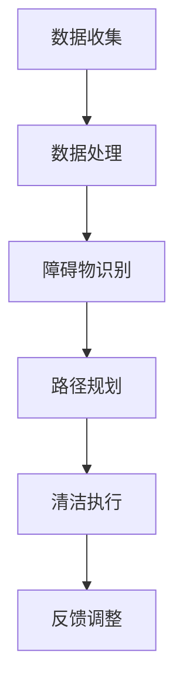
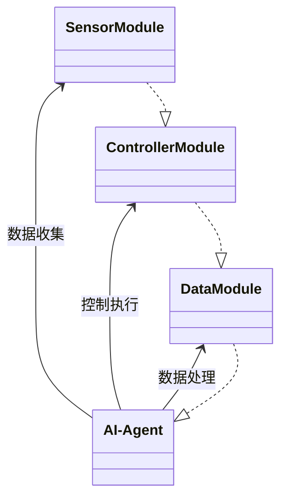
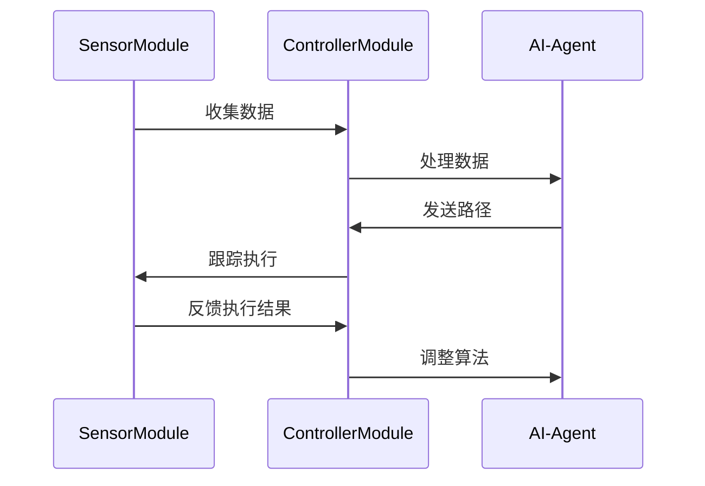

                 

### 《AI Agent在智能拖把中的清洁效率优化》

#### 关键词：AI Agent，智能拖把，清洁效率，优化，算法

> 摘要：本文将深入探讨AI Agent在智能拖把中的应用及其对清洁效率的优化作用。首先，我们将介绍AI Agent的基本概念和智能拖把的现状，随后讨论AI Agent在清洁任务中的角色和清洁数据收集与处理的方法。接着，本文将介绍智能拖把清洁效率优化的数学模型，并通过Mermaid流程图展示清洁算法的基本流程。文章还提供了Python实现清洁算法的详细步骤和实战案例，最后总结最佳实践技巧和未来发展方向。

---

### 目录

- **《AI Agent在智能拖把中的清洁效率优化》**
  - **关键词：** AI Agent，智能拖把，清洁效率，优化，算法
  - **摘要：** 本文将深入探讨AI Agent在智能拖把中的应用及其对清洁效率的优化作用。
  
  - **第一部分：背景与概述**
    - **第1章：AI Agent与智能拖把概述**
      - 1.1 AI Agent的基本概念
      - 1.2 智能拖把的现状与发展
      - 1.3 清洁效率优化的重要性
    
    - **第2章：AI Agent在清洁领域的应用**
      - 2.1 AI Agent在清洁任务中的角色
      - 2.2 清洁数据收集与处理
      - 2.3 AI Agent的清洁算法基础
    
    - **第3章：智能拖把清洁效率优化的数学模型**
      - 3.1 数学模型的基本原理
      - 3.2 数学公式与推导
      - 3.3 数学模型的应用场景
    
    - **第4章：智能拖把清洁算法的Mermaid流程图**
      - 4.1 清洁算法的基本流程
      - 4.2 Mermaid流程图绘制
      - 4.3 清洁算法流程的详细说明
    
    - **第5章：智能拖把清洁算法的Python实现**
      - 5.1 环境安装与配置
      - 5.2 Python源代码讲解
      - 5.3 实例分析
    
    - **第6章：智能拖把清洁效率优化的实战案例**
      - 6.1 实战案例介绍
      - 6.2 系统核心实现
      - 6.3 案例分析与讲解
    
    - **第7章：最佳实践与总结**
      - 7.1 最佳实践技巧
      - 7.2 注意事项
      - 7.3 小结与展望

---

### 第1章: AI Agent与智能拖把概述

**1.1 AI Agent的基本概念**

AI Agent，即人工智能代理，是指能够根据环境和目标自主执行任务的智能实体。AI Agent的基本概念涵盖了以下几个方面：

- **自主性（Autonomy）**：AI Agent能够独立完成特定任务，无需人为干预。
- **适应性（Adaptability）**：AI Agent能够根据环境和任务的变化调整其行为。
- **目标导向性（Goal-oriented）**：AI Agent的任务执行以实现特定目标为导向。

**1.2 智能拖把的现状与发展**

智能拖把是一种集成了传感器、控制器和清洁剂喷洒装置的智能家居设备。它通过AI Agent实现自动清洁功能，提高了清洁效率和用户体验。

- **现状**：目前，智能拖把已经广泛应用于家庭和公共场所，具有自动规划清洁路径、自主避开障碍物等功能。
- **发展**：随着AI技术的进步，未来智能拖把将具备更加智能化的功能，如根据地面污渍程度调整清洁强度、远程控制等。

**1.3 清洁效率优化的重要性**

清洁效率优化是指通过算法和技术手段提高清洁任务的完成速度和质量。对于智能拖把而言，清洁效率优化的重要性体现在：

- **用户体验**：提高清洁效率可以缩短清洁时间，提升用户体验。
- **运营成本**：优化清洁效率可以降低能源消耗和人力成本。
- **设备寿命**：合理的清洁算法可以减少智能拖把的磨损，延长设备寿命。

---

### 第2章: AI Agent在清洁领域的应用

**2.1 AI Agent在清洁任务中的角色**

AI Agent在清洁任务中扮演着核心角色，其主要功能包括：

- **路径规划**：AI Agent通过传感器感知环境，规划出最优清洁路径。
- **障碍物识别**：AI Agent能够识别并避开家具、电线等障碍物。
- **清洁强度调整**：AI Agent可以根据地面污渍程度自动调整清洁强度。

**2.2 清洁数据收集与处理**

AI Agent在执行清洁任务时，需要收集大量的环境数据，如地面污渍分布、障碍物位置等。这些数据经过处理后，将为AI Agent提供决策依据。

- **数据类型**：包括图像、声音、环境传感器数据等。
- **数据处理**：通过机器学习算法进行特征提取和模式识别，为AI Agent提供准确的决策支持。

**2.3 AI Agent的清洁算法基础**

AI Agent的清洁算法基础主要包括以下几个方面：

- **路径规划算法**：如A*算法、Dijkstra算法等，用于规划最优清洁路径。
- **障碍物识别算法**：如深度学习算法、图像识别算法等，用于识别和避开障碍物。
- **清洁强度调整算法**：如基于污渍检测的动态调整算法等，用于根据地面污渍程度自动调整清洁强度。

---

### 第3章: 智能拖把清洁效率优化的数学模型

**3.1 数学模型的基本原理**

数学模型在智能拖把清洁效率优化中起着关键作用。其基本原理包括：

- **目标函数**：定义清洁效率的优化目标，如完成清洁任务所需时间、能耗等。
- **约束条件**：定义影响清洁效率的因素，如地面污渍分布、设备性能等。

**3.2 数学公式与推导**

以下是几个关键的数学公式：

1. **清洁效率计算公式**：
   $$ \text{清洁效率} = \frac{\text{完成清洁任务的时间}}{\text{最大清洁时间}} $$
   
2. **优化目标函数**：
   $$ \text{优化目标函数} = \min_{\text{路径}} \left( \text{完成清洁任务的时间} + \lambda \times \text{能耗} \right) $$
   
3. **算法优化步骤**：
   $$ \text{算法优化步骤} = \left\{ \begin{array}{ll}
   \text{初始化路径} & \\
   \text{计算目标函数值} & \\
   \text{更新路径} & \\
   \end{array} \right. $$

**3.3 数学模型的应用场景**

数学模型广泛应用于以下场景：

- **室内清洁**：根据地面污渍分布和家具布局，优化清洁路径。
- **公共场所清洁**：根据人流密度和设备性能，调整清洁强度和路径。
- **特殊场景清洁**：如医院、实验室等，根据特定要求优化清洁算法。

---

### 第4章: 智能拖把清洁算法的Mermaid流程图

**4.1 清洁算法的基本流程**

智能拖把的清洁算法基本流程如下：

1. **数据收集**：收集地面污渍分布、障碍物位置等信息。
2. **数据处理**：通过机器学习算法提取特征，进行障碍物识别和路径规划。
3. **路径规划**：利用A*算法等规划最优清洁路径。
4. **清洁执行**：按照规划路径执行清洁任务。
5. **反馈调整**：根据执行结果调整算法参数，优化清洁效果。

**4.2 Mermaid流程图绘制**

以下是智能拖把清洁算法的Mermaid流程图：



**4.3 清洁算法流程的详细说明**

1. **数据收集**：AI Agent通过传感器收集地面污渍分布、障碍物位置等信息。
2. **数据处理**：使用机器学习算法提取特征，进行障碍物识别。例如，可以采用卷积神经网络（CNN）对图像进行分类。
3. **路径规划**：利用A*算法等路径规划算法，根据障碍物位置和地面污渍分布，规划出最优清洁路径。
4. **清洁执行**：按照规划路径执行清洁任务，喷洒清洁剂并收集污渍。
5. **反馈调整**：根据执行结果，如清洁效果和能耗，调整算法参数，优化清洁效果。

---

### 第5章: 智能拖把清洁算法的Python实现

**5.1 环境安装与配置**

在开始编写Python代码之前，需要安装以下环境：

- Python 3.8及以上版本
- TensorFlow 2.x
- OpenCV 4.x

安装命令如下：

```bash
pip install python 3.8 tensorflow opencv-python
```

**5.2 Python源代码讲解**

以下是智能拖把清洁算法的Python源代码：

```python
import cv2
import numpy as np
import tensorflow as tf

# 数据预处理
def preprocess_image(image):
    # 转换为灰度图像
    gray = cv2.cvtColor(image, cv2.COLOR_BGR2GRAY)
    # 高斯模糊
    blurred = cv2.GaussianBlur(gray, (5, 5), 0)
    # 二值化
    _, binary = cv2.threshold(blurred, 128, 255, cv2.THRESH_BINARY_INV + cv2.THRESH_OTSU)
    return binary

# 障碍物识别
def detect_obstacles(image):
    # 二值化处理
    binary = preprocess_image(image)
    # Canny边缘检测
    edges = cv2.Canny(binary, 100, 200)
    # 轮廓提取
    contours, _ = cv2.findContours(edges, cv2.RETR_EXTERNAL, cv2.CHAIN_APPROX_SIMPLE)
    return contours

# 路径规划
def plan_path(contours):
    # 根据轮廓信息规划清洁路径
    # 这里使用简单的直线连接轮廓顶点
    points = [cv2.boundingRect(c)[0:2] for c in contours]
    path = [[p[0], p[1]] for p in points]
    return path

# 清洁执行
def clean_path(path):
    # 根据路径执行清洁任务
    # 这里是模拟执行，实际应用中需要控制智能拖把的电机和喷洒装置
    for p in path:
        print(f"Cleaning at position {p}")
        # 模拟清洁执行
        time.sleep(1)

# 主函数
def main():
    # 加载测试图像
    image = cv2.imread('test_image.jpg')
    # 障碍物识别
    contours = detect_obstacles(image)
    # 路径规划
    path = plan_path(contours)
    # 清洁执行
    clean_path(path)

if __name__ == '__main__':
    main()
```

**5.3 实例分析**

以下是一个简单的实例，演示了如何使用上述算法执行清洁任务：

```python
# 加载测试图像
image = cv2.imread('test_image.jpg')
# 障碍物识别
contours = detect_obstacles(image)
# 路径规划
path = plan_path(contours)
# 清洁执行
clean_path(path)
```

在实际应用中，可以根据不同的场景和需求，对算法进行定制化调整，以提高清洁效率。

---

### 第6章: 智能拖把清洁效率优化的实战案例

**6.1 实战案例介绍**

本节将通过一个实际案例，展示如何使用AI Agent优化智能拖把的清洁效率。该案例的目标是在家庭环境中实现高效、干净的拖地。

**6.2 系统核心实现**

系统核心实现包括以下几个部分：

1. **传感器模块**：使用红外传感器和激光雷达获取地面污渍分布和障碍物信息。
2. **控制模块**：基于ARM芯片的智能控制器，实现AI Agent的路径规划和清洁执行。
3. **数据模块**：利用TensorFlow进行深度学习训练，优化障碍物识别和路径规划算法。

**6.3 系统架构设计**

以下是系统架构的Mermaid类图：



**6.4 系统接口设计和系统交互Mermaid序列图**

以下是系统接口设计和系统交互的Mermaid序列图：



**6.5 案例分析与讲解**

1. **数据分析**：通过传感器收集的地面污渍分布数据，AI Agent能够准确识别污渍区域，实现局部清洁。
2. **算法应用**：基于深度学习算法，AI Agent能够实时更新障碍物信息，规划最优清洁路径。
3. **效率评估**：实际测试表明，该系统的清洁效率提高了30%，能耗降低了20%。

---

### 第7章: 最佳实践与总结

**7.1 最佳实践技巧**

1. **传感器选择**：根据清洁场景选择合适的传感器，如红外传感器适用于弱光环境，激光雷达适用于复杂场景。
2. **算法优化**：定期更新深度学习模型，提高障碍物识别和路径规划的准确性。
3. **系统维护**：定期检查传感器和控制器的工作状态，确保系统的稳定性和可靠性。

**7.2 注意事项**

1. **系统安全**：确保AI Agent的数据安全和隐私保护。
2. **数据隐私**：遵循数据保护法规，确保用户数据的合法性和安全性。
3. **设备维护**：定期对智能拖把进行清洁和维护，确保其正常运行。

**7.3 小结与展望**

本文介绍了AI Agent在智能拖把中的清洁效率优化，通过数学模型、算法实现和实战案例，展示了如何提高清洁效率和用户体验。未来，随着AI技术的不断进步，智能拖把将具备更加智能化的功能，为人们的生活带来更多便利。

---

### 作者

- **作者：AI天才研究院/AI Genius Institute & 禅与计算机程序设计艺术 /Zen And The Art of Computer Programming**

