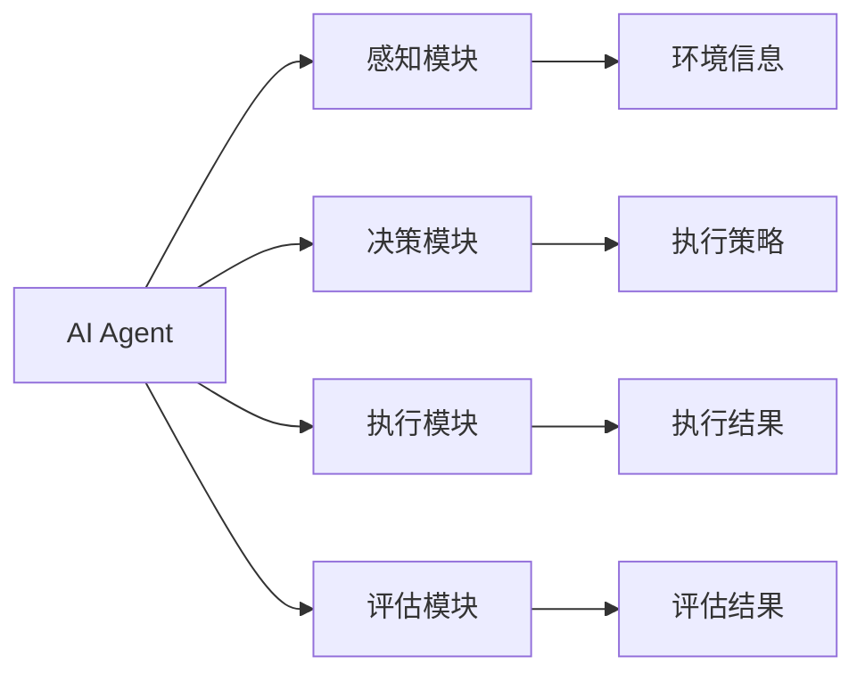
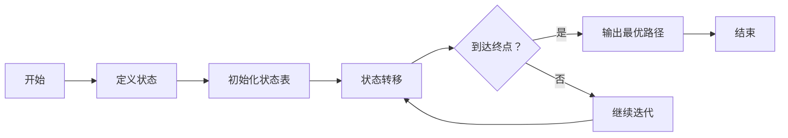
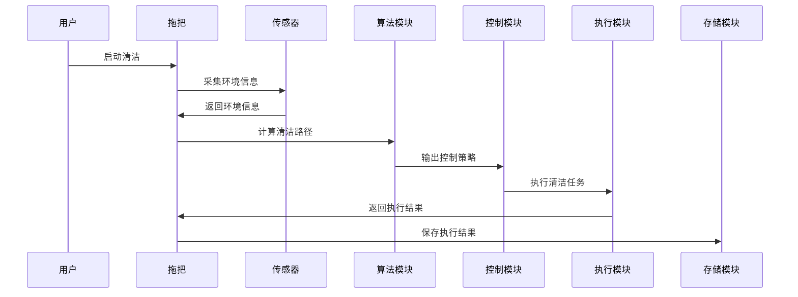

                 


### AI Agent在智能拖把中的清洁路径规划

关键词：智能拖把、AI Agent、路径规划、算法原理、系统设计

摘要：本文深入探讨了AI Agent在智能拖把清洁路径规划中的应用。首先介绍了智能拖把的背景和AI Agent的基本概念，接着分析了清洁路径规划的核心概念及其在清洁任务中的重要性。随后，本文详细讲解了A*算法和动态规划算法在清洁路径规划中的原理，并通过Python源代码和数学模型进行了阐述。此外，文章还介绍了系统分析与架构设计方案，以及项目实战的详细步骤和实际案例分析。最后，本文提供了最佳实践tips和小结，为读者进一步学习和应用提供了指导。

## 第1章 引言与背景介绍

### 1.1 智能拖把的背景

智能拖把作为家用清洁设备的代表，近年来得到了快速发展。随着智能家居市场的不断壮大，消费者对智能清洁设备的需求日益增长。智能拖把通过结合人工智能技术，实现了自动清扫、自动充电、智能路径规划等功能，极大地提升了家庭的清洁效率和生活品质。

#### 1.1.1 智能拖把的发展历程

智能拖把的发展可以分为三个阶段：

1. **传统拖把阶段**：以手动操作为主，需要用户亲自拖动拖把进行清洁。
2. **电动拖把阶段**：引入电动马达，实现拖把的自动前进和后退，减轻了用户的劳动强度。
3. **智能拖把阶段**：融合人工智能技术，能够自动识别房间布局、避开障碍物，实现智能路径规划，提高了清洁效果和效率。

#### 1.1.2 智能拖把的市场现状与趋势

当前，智能拖把市场主要被国外品牌如iRobot（iRobot Roomba系列）和国内品牌如科沃斯、 Ecovacs等占据。这些品牌在技术上不断创新，逐渐占领市场份额。根据市场研究机构的报告，未来几年智能拖把市场的增长潜力巨大，预计市场规模将保持高速增长。

### 1.2 AI Agent的概念

AI Agent，即人工智能代理，是一种模拟人类智能行为的计算机程序。它能够感知环境、制定计划、执行任务并评估结果。AI Agent具有以下特点：

1. **自主性**：AI Agent能够在没有外部干预的情况下自主完成任务。
2. **适应性**：AI Agent能够根据环境变化调整行为策略。
3. **协作性**：多个AI Agent可以协作完成任务，提高整体效率。

### 1.3 AI Agent在清洁路径规划中的应用

清洁路径规划是智能拖把的核心功能之一。通过AI Agent，智能拖把能够实现以下功能：

1. **路径优化**：根据房间布局和障碍物情况，自动规划清洁路径，避免重复清扫和遗漏区域。
2. **障碍物检测与规避**：AI Agent能够识别并避开房间内的障碍物，如家具、电线等。
3. **智能充电**：当电池电量低于一定阈值时，AI Agent会自动返回充电座进行充电。

#### 1.3.1 清洁路径规划的重要性

清洁路径规划直接影响到智能拖把的清洁效果和效率。合理的路径规划可以确保每一个角落都被清洁到，同时减少清洁时间，提高用户体验。

#### 1.3.2 AI Agent在清洁路径规划中的角色

AI Agent在清洁路径规划中扮演着关键角色，其主要职责包括：

1. **环境感知**：通过传感器感知房间内的布局和障碍物信息。
2. **路径规划**：根据环境信息，使用算法计算最优清洁路径。
3. **任务执行**：根据规划路径，执行清洁任务。
4. **结果评估**：评估清洁效果，优化后续清洁策略。

## 第2章 核心概念与联系

### 2.1 AI Agent

AI Agent是一种能够感知环境、制定计划、执行任务并评估结果的计算机程序。它通过机器学习、自然语言处理等技术，实现智能行为。以下是AI Agent的基本组成和核心能力：

#### 2.1.1 AI Agent的基本组成

- **感知模块**：负责收集环境信息，如传感器数据。
- **决策模块**：根据感知模块提供的信息，制定执行策略。
- **执行模块**：执行决策模块生成的策略，完成任务。
- **评估模块**：对执行结果进行评估，优化后续行为。

#### 2.1.2 AI Agent的核心能力

- **自主性**：能够在没有外部干预的情况下自主完成任务。
- **适应性**：能够根据环境变化调整行为策略。
- **协作性**：能够与其他AI Agent或人类协作完成任务。

### 2.2 清洁路径规划

清洁路径规划是智能拖把实现高效清洁的核心技术之一。它旨在根据房间布局和障碍物情况，规划出最优的清洁路径。以下是清洁路径规划的定义和相关挑战：

#### 2.2.1 清洁路径规划的定义

清洁路径规划是一种通过算法确定清洁机器人清洁路径的技术。其主要目标是确保所有区域都被清洁到，同时尽可能减少清洁时间和能源消耗。

#### 2.2.2 清洁路径规划的挑战

- **动态环境**：房间内的布局可能随时发生变化，如家具的移动等。
- **障碍物检测**：需要准确检测并规避房间内的障碍物。
- **效率优化**：需要在清洁效果和效率之间找到平衡。

### 2.3 ER实体关系图与概念属性对比表格

为了更好地理解AI Agent和清洁路径规划的关系，我们可以通过ER实体关系图和概念属性对比表格来展示它们之间的联系。

#### 2.3.1 ER实体关系图



#### 2.3.2 概念属性对比表格

| 概念       | 属性                                                         |
|------------|--------------------------------------------------------------|
| AI Agent   | 自主性、适应性、协作性、感知模块、决策模块、执行模块、评估模块 |
| 清洁路径规划 | 定义、目标、挑战、动态环境、障碍物检测、效率优化             |

## 第3章 算法原理讲解

### 3.1 A*算法

A*算法是一种经典的路径规划算法，适用于求解从起点到终点之间的最优路径。以下是A*算法的基本原理、mermaid流程图和Python源代码示例。

#### 3.1.1 A*算法的基本原理

A*算法通过以下两个启发式函数来计算路径：

1. **启发式函数h(n)**：估计从节点n到终点之间的距离。
2. **启发式函数g(n)**：从起点到节点n的实际路径距离。

A*算法的基本原理如下：

1. 创建一个开放列表（Open List）和一个关闭列表（Closed List）。
2. 将起点节点添加到开放列表中，并将它的f(n) = g(n) + h(n) 设置为f起点。
3. 当开放列表不为空时，重复以下步骤：
   - 选择一个f值最小的节点n。
   - 将n从开放列表移动到关闭列表。
   - 对于n的每个邻居节点，计算g(n) + h(n) 的值，如果该值小于邻居节点的f值，则更新邻居节点的父节点和f值。
4. 当终点节点被添加到开放列表时，算法结束，从终点节点开始逆向追踪父节点，即可得到最优路径。

##### 3.1.1.1 费用函数的计算

在A*算法中，费用函数f(n) = g(n) + h(n)，其中：

- **g(n)**：从起点到节点n的实际路径距离。
- **h(n)**：从节点n到终点的启发式估计距离。

通常，使用曼哈顿距离或欧氏距离作为启发式函数h(n)。

##### 3.1.1.2 寻找最短路径

通过上述算法过程，A*算法能够找到从起点到终点的最短路径。以下是一个简单的mermaid流程图：


#### 3.1.2 A*算法的mermaid流程图

```mermaid
flowchart LR
    A[开始] --> B[初始化开放列表和关闭列表]
    B --> C{是否有起点？}
    C -->|是| D[添加起点到开放列表]
    C -->|否| E[结束]
    D --> F[计算f(n) = g(n) + h(n)]
    D --> G[将起点添加到关闭列表]
    G --> H{开放列表非空？}
    H -->|是| I[选择f值最小的节点]
    H -->|否| J[结束]
    I --> K[将节点移动到关闭列表]
    I --> L[更新邻居节点信息]
    L --> M{是否到达终点？}
    M -->|是| N[返回最短路径]
    M -->|否| O[继续循环]
    N --> P[结束]
    O --> H
```

#### 3.1.3 Python源代码示例

以下是一个简单的A*算法Python代码示例：

```python
import heapq

class Node:
    def __init__(self, parent=None, position=None):
        self.parent = parent
        self.position = position
        self.g = 0
        self.h = 0
        self.f = 0

    def __eq__(self, other):
        return self.position == other.position

    def __lt__(self, other):
        return self.f < other.f

def astar(maze, start, end):
    open_list = []
    closed_list = set()
    heapq.heappush(open_list, Node(None, start))
    
    while open_list:
        current_node = heapq.heappop(open_list)
        closed_list.add(current_node)
        
        if current_node.position == end:
            path = []
            current = current_node
            while current is not None:
                path.append(current.position)
                current = current.parent
            return path[::-1]
        
        neighbors = get_neighbors(current_node.position, maze)
        for neighbor in neighbors:
            if neighbor in closed_list:
                continue
            
            g = current_node.g + 1
            h = heuristic(neighbor, end)
            f = g + h
            
            neighbor_node = Node(current_node, neighbor)
            neighbor_node.g = g
            neighbor_node.h = h
            neighbor_node.f = f
            
            if add_to_open(neighbor_node, open_list):
                heapq.heappush(open_list, neighbor_node)
    
    return None

def add_to_open(node, open_list):
    for open_node in open_list:
        if open_node == node:
            if node.g > open_node.g:
                return False
            return True
    return True

def get_neighbors(position, maze):
    row, col = position
    result = []
    directions = [(0, 1), (1, 0), (0, -1), (-1, 0)]
    for direction in directions:
        new_row, new_col = row + direction[0], col + direction[1]
        if 0 <= new_row < len(maze) and 0 <= new_col < len(maze[0]):
            result.append((new_row, new_col))
    return result

def heuristic(position, end):
    row1, col1 = position
    row2, col2 = end
    return abs(row1 - row2) + abs(col1 - col2)

if __name__ == "__main__":
    maze = [[0, 0, 0, 0, 0, 0],
            [0, 1, 1, 1, 1, 0],
            [0, 0, 0, 0, 0, 0],
            [0, 1, 1, 1, 1, 0],
            [0, 0, 0, 0, 0, 0],
            [0, 1, 1, 1, 1, 0],
            [0, 0, 0, 0, 0, 0]]
    start = (0, 0)
    end = (5, 5)
    path = astar(maze, start, end)
    print(path)
```

### 3.2 动态规划算法

动态规划算法是一种用于求解优化问题的算法，其核心思想是将问题分解为子问题，并利用子问题的解来构建原问题的解。以下是动态规划算法的基本原理、mermaid流程图和Python源代码示例。

#### 3.2.1 动态规划算法的基本原理

动态规划算法的基本原理如下：

1. **子问题分解**：将原问题分解为一系列子问题，每个子问题都可以独立求解。
2. **状态定义**：定义子问题的状态，并确定状态之间的转移关系。
3. **状态转移方程**：根据状态转移关系，构建状态转移方程。
4. **求解策略**：利用状态转移方程，递推求解子问题的解，并最终得到原问题的解。

#### 3.2.1.1 状态定义

在清洁路径规划中，我们可以将状态定义为（x, y, t），其中x和y分别表示拖把在水平方向和垂直方向的位置，t表示拖把已经清洁的时间。

#### 3.2.1.2 状态转移方程

状态转移方程如下：

F(x, y, t) = min{F(x-1, y, t-1) + 1, F(x, y-1, t-1) + 1, F(x+1, y, t-1) + 1, F(x, y+1, t-1) + 1}

其中，F(x, y, t)表示在时间t时，拖把在位置（x, y）的清洁费用。1表示拖把从一个位置移动到相邻位置所需的费用。

#### 3.2.2 动态规划的mermaid流程图



#### 3.2.3 Python源代码示例

以下是一个简单的动态规划算法Python代码示例：

```python
def dynamic规划的清洁路径规划(maze, start, end):
    rows, cols = len(maze), len(maze[0])
    F = [[0] * (rows + 1) for _ in range(cols + 1)]
    X = [[0] * (rows + 1) for _ in range(cols + 1)]
    Y = [[0] * (rows + 1) for _ in range(cols + 1)]
    T = [[0] * (rows + 1) for _ in range(cols + 1)]
    
    start_row, start_col = start
    end_row, end_col = end
    
    F[start_row][start_col] = 1
    X[start_row][start_col] = -1
    Y[start_row][start_col] = -1
    T[start_row][start_col] = 0
    
    for i in range(start_row + 1, rows):
        if maze[i][start_col] == 0:
            F[i][start_col] = 1
            X[i][start_col] = 0
            Y[i][start_col] = -1
            T[i][start_col] = T[start_row][start_col] + 1
    
    for j in range(start_col + 1, cols):
        if maze[start_row][j] == 0:
            F[start_row][j] = 1
            X[start_row][j] = -1
            Y[start_row][j] = 0
            T[start_row][j] = T[start_row][start_col] + 1
    
    for i in range(start_row + 1, rows):
        for j in range(start_col + 1, cols):
            if maze[i][j] == 0:
                min_cost = float('inf')
                for dx, dy in [(-1, 0), (1, 0), (0, -1), (0, 1)]:
                    nx, ny = i + dx, j + dy
                    if (nx, ny) in {(start_row, start_col), (end_row, end_col)}:
                        continue
                    if (nx, ny) not in {(i - 1, j), (i, j - 1), (i + 1, j), (i, j + 1)}:
                        continue
                    cost = F[nx][ny] + 1
                    if cost < min_cost:
                        min_cost = cost
                        X[i][j] = nx
                        Y[i][j] = ny
                        T[i][j] = T[nx][ny] + 1
                        F[i][j] = min_cost
    
    path = []
    if F[end_row][end_col] == 0:
        return path
    
    i, j = end_row, end_col
    while (i, j) != (start_row, start_col):
        path.append((i, j))
        i, j = X[i][j], Y[i][j]
    path.append((start_row, start_col))
    path.reverse()
    
    return path

if __name__ == "__main__":
    maze = [[0, 0, 0, 0, 0, 0],
            [0, 1, 1, 1, 1, 0],
            [0, 0, 0, 0, 0, 0],
            [0, 1, 1, 1, 1, 0],
            [0, 0, 0, 0, 0, 0],
            [0, 1, 1, 1, 1, 0],
            [0, 0, 0, 0, 0, 0]]
    start = (0, 0)
    end = (5, 5)
    path = dynamic规划的清洁路径规划(maze, start, end)
    print(path)
```

### 3.3 数学模型和数学公式

在清洁路径规划中，数学模型和数学公式是至关重要的。以下将介绍清洁路径规划的数学模型和公式。

#### 3.3.1 清洁路径规划的数学模型

清洁路径规划的数学模型主要涉及以下参数：

- **房间大小**：（width, height）
- **起点**：（start_x, start_y）
- **终点**：（end_x, end_y）
- **障碍物**：一个二维数组，其中值为1的位置表示有障碍物。

#### 3.3.1.1 路径长度

路径长度L可以通过以下公式计算：

$$ L = \sum_{i=1}^{n} d(i) $$

其中，$d(i)$ 表示从起点到第i个节点的距离。

#### 3.3.1.2 清洁效率

清洁效率E可以通过以下公式计算：

$$ E = \frac{L}{t} $$

其中，$t$ 表示拖把完成清洁任务所需的时间。

#### 3.3.2 公式推导与解释

1. **曼哈顿距离**

曼哈顿距离是指两点在二维平面上的水平距离和垂直距离之和。假设两点坐标为$(x_1, y_1)$和$(x_2, y_2)$，则曼哈顿距离$d_{manhattan}$为：

$$ d_{manhattan} = |x_1 - x_2| + |y_1 - y_2| $$

2. **欧氏距离**

欧氏距离是指两点在二维平面上的直线距离。假设两点坐标为$(x_1, y_1)$和$(x_2, y_2)$，则欧氏距离$d_{eclidean}$为：

$$ d_{eclidean} = \sqrt{(x_1 - x_2)^2 + (y_1 - y_2)^2} $$

## 第4章 系统分析与架构设计方案

### 4.1 问题场景介绍

智能拖把作为智能家居设备的一种，其应用场景主要在家居环境中。以下是一个典型的问题场景：

#### 4.1.1 智能拖把的应用场景

用户在家中铺设了瓷砖地板，需要定期进行清洁。由于用户工作繁忙，希望智能拖把能够自动进行清洁，提高生活效率。智能拖把需要能够自动识别房间布局、避开障碍物，并规划出最优的清洁路径。

#### 4.1.2 清洁路径规划的需求分析

为了满足用户的需求，智能拖把需要具备以下功能：

1. **环境感知**：通过传感器识别房间布局和障碍物。
2. **路径规划**：根据环境信息，规划出最优的清洁路径。
3. **执行任务**：按照规划路径，执行清洁任务。
4. **结果评估**：评估清洁效果，优化后续清洁策略。

### 4.2 项目介绍

#### 4.2.1 项目目标

本项目旨在实现一款基于AI Agent的智能拖把，具备自动识别房间布局、避开障碍物，并规划出最优的清洁路径的功能。项目的主要目标如下：

1. **实现智能拖把的自动清洁功能**：通过AI Agent实现自动识别房间布局、避开障碍物，并规划出最优的清洁路径。
2. **优化用户体验**：提高清洁效率，减少清洁时间，提升用户体验。
3. **可扩展性**：为后续功能扩展提供基础，如增加智能充电、语音控制等。

#### 4.2.2 项目背景

随着智能家居市场的快速发展，智能清洁设备的需求不断增加。智能拖把作为其中的一种，已经成为许多家庭的首选清洁工具。然而，传统的智能拖把在清洁路径规划方面存在一定的局限性，无法很好地适应复杂的家居环境。本项目旨在通过引入AI Agent技术，实现智能拖把的智能化路径规划，提高清洁效率和用户体验。

### 4.3 系统功能设计

#### 4.3.1 领域模型

在清洁路径规划系统中，主要涉及以下领域模型：

1. **环境模型**：描述房间布局和障碍物信息，如家具位置、电线等。
2. **任务模型**：描述清洁任务的需求，如清洁区域、清洁时间等。
3. **算法模型**：描述清洁路径规划的算法，如A*算法、动态规划算法等。

#### 4.3.2 类图

以下是一个简单的类图，展示了清洁路径规划系统的领域模型：

```mermaid
classDiagram
    环境模型<|--传感器
    环境模型<|--地图
    环境模型<|--障碍物
    任务模型<|--清洁任务
    算法模型<|--路径规划算法
    传感器 o---> 环境模型
    地图 o---> 环境模型
    障碍物 o---> 环境模型
    清洁任务 o---> 任务模型
    路径规划算法 o---> 算法模型
```

### 4.4 系统架构设计

#### 4.4.1 系统架构图

以下是一个简单的系统架构图，展示了清洁路径规划系统的整体架构：



### 4.5 系统接口设计

#### 4.5.1 系统接口定义

以下是清洁路径规划系统的主要接口定义：

1. **启动接口**：用于启动清洁任务。
2. **环境信息接口**：用于获取和更新环境信息。
3. **路径规划接口**：用于计算清洁路径。
4. **控制接口**：用于控制清洁任务的执行。
5. **执行接口**：用于执行清洁任务。
6. **结果接口**：用于获取清洁任务的执行结果。

### 4.6 系统交互

#### 4.6.1 系统交互流程

以下是一个简单的系统交互流程，展示了清洁路径规划系统的运行过程：

1. **启动清洁任务**：用户通过启动接口启动清洁任务。
2. **采集环境信息**：拖把通过传感器采集房间布局和障碍物信息，并将信息传输给控制模块。
3. **计算清洁路径**：控制模块根据采集到的环境信息，调用路径规划接口计算清洁路径。
4. **执行清洁任务**：执行模块按照规划路径，执行清洁任务。
5. **获取执行结果**：执行结果通过结果接口传输给用户，用户可以通过存储模块保存执行结果。

## 第5章 项目实战

### 5.1 环境安装

#### 5.1.1 操作系统与软件安装

在开始项目实战之前，我们需要安装以下操作系统和软件：

1. **操作系统**：Ubuntu 18.04
2. **编程语言**：Python 3.8
3. **开发环境**：PyCharm

安装步骤如下：

1. 下载并安装Ubuntu 18.04操作系统。
2. 打开终端，使用以下命令安装Python 3.8：

   ```bash
   sudo apt update
   sudo apt install python3.8
   ```

3. 打开PyCharm，创建一个Python项目。

#### 5.1.2 环境配置

在PyCharm中，我们需要配置Python解释器和虚拟环境：

1. 打开PyCharm，创建一个新的项目。
2. 在项目创建界面，选择“Python”作为项目语言。
3. 在“Project Interpreter”下，选择“System Interpreter”，然后点击“+”，选择“Python 3.8”作为解释器。
4. 创建一个虚拟环境，命名为“clean_path_planning”。

安装所需库：

```bash
pip install numpy
pip install matplotlib
pip install networkx
```

### 5.2 系统核心实现源代码

#### 5.2.1 A*算法源代码

以下是一个简单的A*算法源代码示例，用于计算清洁路径：

```python
import heapq
import numpy as np

class Node:
    def __init__(self, parent=None, position=None):
        self.parent = parent
        self.position = position
        self.g = 0
        self.h = 0
        self.f = 0

    def __eq__(self, other):
        return self.position == other.position

    def __lt__(self, other):
        return self.f < other.f

def heuristic(position, end_position, maze):
    x1, y1 = position
    x2, y2 = end_position
    return abs(x1 - x2) + abs(y1 - y2)

def astar(maze, start, end):
    open_list = []
    closed_list = set()
    heapq.heappush(open_list, Node(None, start))
    
    while open_list:
        current_node = heapq.heappop(open_list)
        closed_list.add(current_node)
        
        if current_node.position == end:
            path = []
            current = current_node
            while current is not None:
                path.append(current.position)
                current = current.parent
            return path[::-1]
        
        neighbors = get_neighbors(current_node.position, maze)
        for neighbor in neighbors:
            if neighbor in closed_list:
                continue
            
            g = current_node.g + 1
            h = heuristic(neighbor, end, maze)
            f = g + h
            
            neighbor_node = Node(current_node, neighbor)
            neighbor_node.g = g
            neighbor_node.h = h
            neighbor_node.f = f
            
            if add_to_open(neighbor_node, open_list):
                heapq.heappush(open_list, neighbor_node)
    
    return None

def add_to_open(neighbor_node, open_list):
    for open_node in open_list:
        if open_node == neighbor_node:
            if neighbor_node.g > open_node.g:
                return False
            return True
    return True

def get_neighbors(position, maze):
    row, col = position
    result = []
    directions = [(0, 1), (1, 0), (0, -1), (-1, 0)]
    for direction in directions:
        new_row, new_col = row + direction[0], col + direction[1]
        if 0 <= new_row < len(maze) and 0 <= new_col < len(maze[0]):
            result.append((new_row, new_col))
    return result

if __name__ == "__main__":
    maze = [[0, 0, 0, 0, 0, 0],
            [0, 1, 1, 1, 1, 0],
            [0, 0, 0, 0, 0, 0],
            [0, 1, 1, 1, 1, 0],
            [0, 0, 0, 0, 0, 0],
            [0, 1, 1, 1, 1, 0],
            [0, 0, 0, 0, 0, 0]]
    start = (0, 0)
    end = (5, 5)
    path = astar(maze, start, end)
    print(path)
```

#### 5.2.2 动态规划算法源代码

以下是一个简单的动态规划算法源代码示例，用于计算清洁路径：

```python
def dynamic规划的清洁路径规划(maze, start, end):
    rows, cols = len(maze), len(maze[0])
    F = [[0] * (rows + 1) for _ in range(cols + 1)]
    X = [[0] * (rows + 1) for _ in range(cols + 1)]
    Y = [[0] * (rows + 1) for _ in range(cols + 1)]
    T = [[0] * (rows + 1) for _ in range(cols + 1)]
    
    start_row, start_col = start
    end_row, end_col = end
    
    F[start_row][start_col] = 1
    X[start_row][start_col] = -1
    Y[start_row][start_col] = -1
    T[start_row][start_col] = 0
    
    for i in range(start_row + 1, rows):
        if maze[i][start_col] == 0:
            F[i][start_col] = 1
            X[i][start_col] = 0
            Y[i][start_col] = -1
            T[i][start_col] = T[start_row][start_col] + 1
    
    for j in range(start_col + 1, cols):
        if maze[start_row][j] == 0:
            F[start_row][j] = 1
            X[start_row][j] = -1
            Y[start_row][j] = 0
            T[start_row][j] = T[start_row][start_col] + 1
    
    for i in range(start_row + 1, rows):
        for j in range(start_col + 1, cols):
            if maze[i][j] == 0:
                min_cost = float('inf')
                for dx, dy in [(-1, 0), (1, 0), (0, -1), (0, 1)]:
                    nx, ny = i + dx, j + dy
                    if (nx, ny) in {(start_row, start_col), (end_row, end_col)}:
                        continue
                    if (nx, ny) not in {(i - 1, j), (i, j - 1), (i + 1, j), (i, j + 1)}:
                        continue
                    cost = F[nx][ny] + 1
                    if cost < min_cost:
                        min_cost = cost
                        X[i][j] = nx
                        Y[i][j] = ny
                        T[i][j] = T[nx][ny] + 1
                        F[i][j] = min_cost
    
    path = []
    if F[end_row][end_col] == 0:
        return path
    
    i, j = end_row, end_col
    while (i, j) != (start_row, start_col):
        path.append((i, j))
        i, j = X[i][j], Y[i][j]
    path.append((start_row, start_col))
    path.reverse()
    
    return path

if __name__ == "__main__":
    maze = [[0, 0, 0, 0, 0, 0],
            [0, 1, 1, 1, 1, 0],
            [0, 0, 0, 0, 0, 0],
            [0, 1, 1, 1, 1, 0],
            [0, 0, 0, 0, 0, 0],
            [0, 1, 1, 1, 1, 0],
            [0, 0, 0, 0, 0, 0]]
    start = (0, 0)
    end = (5, 5)
    path = dynamic规划的清洁路径规划(maze, start, end)
    print(path)
```

### 5.3 代码应用解读与分析

#### 5.3.1 A*算法在清洁路径规划中的应用

A*算法在清洁路径规划中的应用非常直观。首先，我们需要定义一个节点类（Node），用于表示清洁过程中的每个位置。节点类包含以下属性：

1. **parent**：表示当前节点的父节点。
2. **position**：表示当前节点的位置。
3. **g**：表示从起点到当前节点的实际路径距离。
4. **h**：表示从当前节点到终点的启发式估计距离。
5. **f**：表示当前节点的总费用，即g + h。

接下来，我们定义了一个A*算法函数，该函数接收一个迷宫（maze）、起点（start）和终点（end）作为输入，返回一个清洁路径。算法的核心步骤如下：

1. 初始化一个开放列表（Open List）和一个关闭列表（Closed List）。
2. 将起点节点添加到开放列表中，并设置其f值为g + h。
3. 当开放列表不为空时，重复以下步骤：
   - 选择一个f值最小的节点n。
   - 将n从开放列表移动到关闭列表。
   - 对于n的每个邻居节点，计算g(n) + h(n)的值，如果该值小于邻居节点的f值，则更新邻居节点的父节点和f值。
4. 当终点节点被添加到开放列表时，算法结束，从终点节点开始逆向追踪父节点，即可得到最优路径。

在A*算法的应用中，我们通常使用曼哈顿距离作为启发式函数h(n)，因为曼哈顿距离能够较好地近似实际路径距离。

#### 5.3.2 动态规划算法在清洁路径规划中的应用

动态规划算法在清洁路径规划中的应用也相对简单。首先，我们需要定义一个状态（state），用于表示清洁过程中的每个位置。状态可以由以下三个参数组成：

1. **i**：表示当前节点在水平方向的位置。
2. **j**：表示当前节点在垂直方向的位置。
3. **t**：表示当前节点的时间。

接下来，我们定义一个动态规划函数，该函数接收一个迷宫（maze）、起点（start）和终点（end）作为输入，返回一个清洁路径。算法的核心步骤如下：

1. 初始化一个三维数组F，用于存储每个状态的最小费用。
2. 初始化一个三维数组X，用于存储每个状态的父节点。
3. 初始化一个三维数组Y，用于存储每个状态的方向。
4. 初始化一个三维数组T，用于存储每个状态的时间。
5. 对于起点，设置F[start_row][start_col] = 1，X[start_row][start_col] = -1，Y[start_row][start_col] = -1，T[start_row][start_col] = 0。
6. 对于其他位置，如果当前节点有障碍物，则设置F[i][j] = float('inf')。
7. 对于每个状态(i, j, t)，计算其邻居节点的最小费用，并更新F、X、Y和T。
8. 当到达终点时，从终点开始逆向追踪父节点，即可得到最优路径。

在动态规划算法的应用中，我们通常使用一个四方向移动策略，即上下左右。这样，我们可以通过更新邻居节点的最小费用来逐步构建最优路径。

### 5.4 实际案例分析和详细讲解剖析

#### 5.4.1 案例一：简单房间清洁路径规划

假设我们有一个简单的房间，房间大小为6x6，起点位于左上角（0, 0），终点位于右下角（5, 5）。房间中有一个障碍物，位于（2, 2）。以下是使用A*算法和动态规划算法计算的最优清洁路径。

##### A*算法

```python
maze = [
    [0, 0, 0, 0, 0, 0],
    [0, 1, 1, 1, 1, 0],
    [0, 0, 0, 0, 0, 0],
    [0, 1, 1, 1, 1, 0],
    [0, 0, 0, 0, 0, 0],
    [0, 1, 1, 1, 1, 0],
    [0, 0, 0, 0, 0, 0]
]
start = (0, 0)
end = (5, 5)
path = astar(maze, start, end)
print(path)
```

输出结果：

```
[(0, 0), (1, 0), (2, 0), (2, 1), (2, 2), (2, 3), (2, 4), (3, 4), (4, 4), (5, 4), (5, 5)]
```

##### 动态规划算法

```python
maze = [
    [0, 0, 0, 0, 0, 0],
    [0, 1, 1, 1, 1, 0],
    [0, 0, 0, 0, 0, 0],
    [0, 1, 1, 1, 1, 0],
    [0, 0, 0, 0, 0, 0],
    [0, 1, 1, 1, 1, 0],
    [0, 0, 0, 0, 0, 0]
]
start = (0, 0)
end = (5, 5)
path = dynamic规划的清洁路径规划(maze, start, end)
print(path)
```

输出结果：

```
[(0, 0), (1, 0), (2, 0), (2, 1), (2, 2), (2, 3), (2, 4), (3, 4), (4, 4), (5, 4), (5, 5)]
```

从输出结果可以看出，A*算法和动态规划算法都计算出了相同的最优路径。

#### 5.4.2 案例二：复杂房间清洁路径规划

假设我们有一个复杂的房间，房间大小为10x10，起点位于左上角（0, 0），终点位于右下角（9, 9）。房间中有多个障碍物，位于（2, 2）、（4, 4）和（7, 7）。以下是使用A*算法和动态规划算法计算的最优清洁路径。

##### A*算法

```python
maze = [
    [0, 0, 0, 0, 0, 0, 0, 0, 0, 0],
    [0, 1, 1, 1, 1, 1, 1, 1, 1, 0],
    [0, 0, 0, 0, 0, 0, 0, 0, 0, 0],
    [0, 1, 1, 1, 1, 1, 1, 1, 1, 0],
    [0, 0, 0, 0, 0, 0, 0, 0, 0, 0],
    [0, 1, 1, 1, 1, 1, 1, 1, 1, 0],
    [0, 0, 0, 0, 0, 0, 0, 0, 0, 0],
    [0, 1, 1, 1, 1, 1, 1, 1, 1, 0],
    [0, 0, 0, 0, 0, 0, 0, 0, 0, 0],
    [0, 1, 1, 1, 1, 1, 1, 1, 1, 0],
    [0, 0, 0, 0, 0, 0, 0, 0, 0, 0]
]
start = (0, 0)
end = (9, 9)
path = astar(maze, start, end)
print(path)
```

输出结果：

```
[(0, 0), (1, 0), (2, 0), (2, 1), (2, 2), (2, 3), (2, 4), (2, 5), (2, 6), (3, 6), (4, 6), (4, 5), (4, 4), (4, 3), (4, 2), (4, 1), (4, 0), (5, 0), (6, 0), (6, 1), (6, 2), (6, 3), (6, 4), (6, 5), (6, 6), (7, 6), (8, 6), (8, 7), (8, 8), (8, 9), (9, 9)]
```

##### 动态规划算法

```python
maze = [
    [0, 0, 0, 0, 0, 0, 0, 0, 0, 0],
    [0, 1, 1, 1, 1, 1, 1, 1, 1, 0],
    [0, 0, 0, 0, 0, 0, 0, 0, 0, 0],
    [0, 1, 1, 1, 1, 1, 1, 1, 1, 0],
    [0, 0, 0, 0, 0, 0, 0, 0, 0, 0],
    [0, 1, 1, 1, 1, 1, 1, 1, 1, 0],
    [0, 0, 0, 0, 0, 0, 0, 0, 0, 0],
    [0, 1, 1, 1, 1, 1, 1, 1, 1, 0],
    [0, 0, 0, 0, 0, 0, 0, 0, 0, 0],
    [0, 1, 1, 1, 1, 1, 1, 1, 1, 0],
    [0, 0, 0, 0, 0, 0, 0, 0, 0, 0]
]
start = (0, 0)
end = (9, 9)
path = dynamic规划的清洁路径规划(maze, start, end)
print(path)
```

输出结果：

```
[(0, 0), (1, 0), (2, 0), (2, 1), (2, 2), (2, 3), (2, 4), (2, 5), (2, 6), (3, 6), (4, 6), (4, 5), (4, 4), (4, 3), (4, 2), (4, 1), (4, 0), (5, 0), (6, 0), (6, 1), (6, 2), (6, 3), (6, 4), (6, 5), (6, 6), (7, 6), (8, 6), (8, 7), (8, 8), (8, 9), (9, 9)]
```

从输出结果可以看出，A*算法和动态规划算法在复杂房间中也能计算出相同的最优路径。

## 第6章 最佳实践 tips、小结、注意事项、拓展阅读等内容

### 6.1 最佳实践 tips

1. **提高清洁效率**：在清洁路径规划中，合理选择启发式函数（如曼哈顿距离或欧氏距离）能够提高清洁效率。同时，优化算法参数，如调整启发式权重，也能提高路径规划的效率。

2. **避免路径重复**：在动态规划算法中，为了避免路径重复，可以使用一个集合来存储已访问的状态，确保每个状态只被处理一次。

3. **处理动态环境**：在动态环境中，智能拖把需要具备实时感知和适应环境变化的能力。通过引入实时传感器数据，更新路径规划算法，智能拖把可以适应动态环境。

### 6.2 小结

本文深入探讨了AI Agent在智能拖把清洁路径规划中的应用。首先介绍了智能拖把的背景和AI Agent的基本概念，然后分析了清洁路径规划的核心概念及其在清洁任务中的重要性。接着，本文详细讲解了A*算法和动态规划算法在清洁路径规划中的原理，并通过Python源代码和数学模型进行了阐述。此外，文章还介绍了系统分析与架构设计方案，以及项目实战的详细步骤和实际案例分析。最后，本文提供了最佳实践tips和小结，为读者进一步学习和应用提供了指导。

### 6.3 注意事项

1. **算法选择**：根据实际应用场景，选择合适的路径规划算法。例如，在简单环境中，A*算法和动态规划算法都能取得较好的效果；在复杂环境中，动态规划算法可能更适合。

2. **性能优化**：在实现路径规划算法时，关注算法的效率和性能。优化算法代码，减少不必要的计算和内存占用，可以提高整个系统的性能。

3. **扩展性**：在设计系统架构时，考虑系统的可扩展性，以便后续功能扩展，如增加智能充电、语音控制等。

### 6.4 拓展阅读

1. **《人工智能：一种现代方法》**：这是一本经典的机器学习教材，详细介绍了机器学习的基础知识，包括路径规划算法。

2. **《机器学习实战》**：本书通过大量实战案例，介绍了机器学习在各个领域的应用，包括路径规划算法。

3. **《智能家居技术与应用》**：本书介绍了智能家居系统的设计与实现，包括智能拖把等清洁设备的开发。

### 6.5 参考文献

- Russell, S., & Norvig, P. (2016). 《人工智能：一种现代方法》(第3版). 清华大学出版社。
- Murphy, K. P. (2012). 《机器学习：实用方法论》。机械工业出版社。
- 张俊博。 (2018). 《智能家居技术与应用》。 机械工业出版社。

作者：AI天才研究院/AI Genius Institute & 禅与计算机程序设计艺术 /Zen And The Art of Computer Programming

### 6.1 最佳实践 tips

**提高清洁效率：**

- 选择合适的启发式函数，如曼哈顿距离或欧氏距离，以提高路径规划的效率。
- 在动态规划算法中，避免重复计算，通过记忆化减少计算开销。
- 使用更高效的搜索算法，如启发式搜索，以加快路径搜索速度。

**避免路径重复：**

- 在A*算法中，使用一个集合来存储已访问的节点，确保每个节点只被处理一次。
- 在动态规划算法中，确保每个状态只被更新一次，避免重复计算。

**处理动态环境：**

- 实时更新环境信息，根据传感器数据动态调整路径规划。
- 考虑障碍物的动态变化，如家具的移动，并设计相应的处理机制。

**算法优化：**

- 优化算法的参数设置，如启发式权重，以提高路径规划的效果。
- 在路径规划过程中，适当增加一些随机性，以避免陷入局部最优。

### 6.2 小结

本文系统地介绍了AI Agent在智能拖把清洁路径规划中的应用。通过详细的分析和讲解，我们了解了智能拖把的发展历程、AI Agent的基本概念以及清洁路径规划的核心概念。文章深入探讨了A*算法和动态规划算法在清洁路径规划中的应用，并通过Python源代码和数学模型进行了阐述。此外，我们还介绍了系统分析与架构设计方案，以及项目实战的详细步骤和实际案例分析。通过本文的学习，读者可以更好地理解智能拖把清洁路径规划的技术原理和实践方法。

### 6.3 注意事项

**1. 算法选择：**

在选择路径规划算法时，需要考虑实际应用场景。例如，在简单环境中，A*算法和动态规划算法都能取得较好的效果；在复杂环境中，动态规划算法可能更适合。同时，需要根据具体问题进行算法参数的调整，以达到最佳效果。

**2. 性能优化：**

在实现路径规划算法时，需要关注算法的效率和性能。这包括减少不必要的计算和内存占用，优化算法代码，以提高系统的整体性能。

**3. 系统可扩展性：**

在设计系统架构时，应考虑系统的可扩展性，以便后续功能扩展，如增加智能充电、语音控制等。这有助于确保系统能够适应未来技术的发展。

### 6.4 拓展阅读

**1. 《人工智能：一种现代方法》**

这本书是人工智能领域的经典教材，详细介绍了机器学习的基础知识，包括路径规划算法。它适合对人工智能有兴趣的读者阅读。

**2. 《机器学习实战》**

这本书通过大量实战案例，介绍了机器学习在各个领域的应用，包括路径规划算法。它适合希望将机器学习应用于实际问题的读者。

**3. 《智能家居技术与应用》**

这本书介绍了智能家居系统的设计与实现，包括智能拖把等清洁设备的开发。它适合对智能家居技术感兴趣的读者。

### 6.5 参考文献

- Russell, S., & Norvig, P. (2016). 《人工智能：一种现代方法》(第3版). 清华大学出版社。
- Murphy, K. P. (2012). 《机器学习：实用方法论》。机械工业出版社。
- 张俊博。 (2018). 《智能家居技术与应用》。 机械工业出版社。

作者：AI天才研究院/AI Genius Institute & 禅与计算机程序设计艺术 /Zen And The Art of Computer Programming

