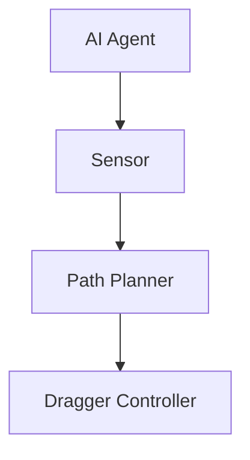
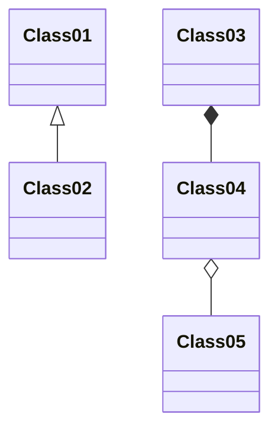
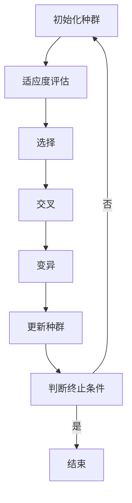
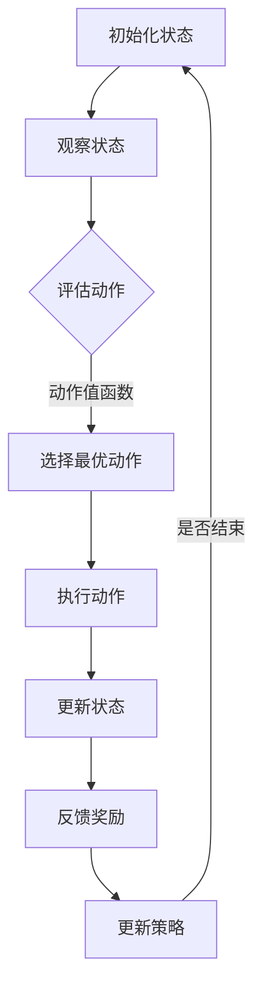

                 

## AI Agent在智能拖把中的清洁路径规划

### 关键词：
- AI Agent
- 清洁路径规划
- 智能拖把
- 遗传算法
- 深度强化学习

### 摘要：
本文旨在探讨AI Agent在智能拖把中的清洁路径规划应用。首先介绍了智能拖把与清洁路径规划的重要性，然后深入分析了AI Agent的定义与特点、清洁路径规划的基本概念及其应用。随后，详细讲解了基于遗传算法和深度强化学习的清洁路径规划算法，以及相应的数学模型和公式。最后，通过一个具体的系统架构设计方案，展示了AI Agent在智能拖把中的应用实例。

### 目录大纲：

#### 第一部分：问题背景与核心概念

- **第1章**：问题背景介绍
  - **1.1.1 智能拖把与清洁路径规划的兴起**
  - **1.1.2 智能拖把清洁路径规划的重要性**
  - **1.1.3 清洁路径规划的挑战与机遇**
- **第2章**：核心概念与联系
  - **2.1 AI Agent的定义与特点**
  - **2.2 清洁路径规划的基本概念**
  - **2.3 AI Agent在清洁路径规划中的应用**
  - **2.4 概念属性特征对比表格**
- **第3章**：ER实体关系图架构
  - **3.1 智能拖把系统的实体关系**
  - **3.2 清洁路径规划的相关实体关系**
  - **3.3 ER实体关系图示例**

#### 第二部分：算法原理讲解

- **第4章**：算法原理概述
  - **4.1 常见清洁路径规划算法**
  - **4.2 AI Agent在路径规划中的优势**
  - **4.3 AI Agent在清洁路径规划中的具体应用**
- **第5章**：算法原理详细讲解
  - **5.1 基于遗传算法的清洁路径规划**
    - **5.1.1 遗传算法基本原理**
    - **5.1.2 遗传算法在清洁路径规划中的应用**
    - **5.1.3 算法流程图**
  - **5.2 基于深度强化学习的清洁路径规划**
    - **5.2.1 深度强化学习基本原理**
    - **5.2.2 深度强化学习在清洁路径规划中的应用**
    - **5.2.3 算法流程图**
- **第6章**：数学模型和数学公式讲解
  - **6.1 清洁路径规划的数学模型**
  - **6.2 算法原理数学公式**

#### 第三部分：系统分析与架构设计方案

- **第7章**：系统分析与架构设计方案
  - **7.1 问题场景介绍**
  - **7.2 项目介绍**
  - **7.3 系统功能设计**
  - **7.4 系统架构设计**
  - **7.5 系统接口设计**
  - **7.6 系统交互序列图**

### 引言
智能家庭设备在现代家庭中越来越普及，其中智能拖把作为家居清洁领域的一项创新技术，正逐渐改变人们的生活习惯。智能拖把通过集成多种传感器和AI算法，能够实现自动清洁功能，为用户带来更加便捷、高效的清洁体验。而清洁路径规划作为智能拖把的核心技术之一，直接影响清洁效果和效率。

随着AI技术的发展，AI Agent作为一种自主决策的智能实体，逐渐在各个领域得到应用。AI Agent在智能拖把中的清洁路径规划，通过模拟人类的决策过程，能够动态适应环境变化，优化清洁路径，提高清洁效率。本文将详细介绍AI Agent在智能拖把清洁路径规划中的应用，从算法原理到系统架构设计，全面探讨这一技术的前沿应用。

接下来的内容将分为三个主要部分：

1. **问题背景与核心概念**：介绍智能拖把与清洁路径规划的重要性，分析AI Agent和清洁路径规划的核心概念及其联系。
2. **算法原理讲解**：详细讲解基于遗传算法和深度强化学习的清洁路径规划算法，包括基本原理、应用方法以及数学模型。
3. **系统分析与架构设计方案**：通过一个具体的系统架构设计实例，展示AI Agent在智能拖把清洁路径规划中的应用。

### 第一部分：问题背景与核心概念

#### 第1章：问题背景介绍

##### 1.1.1 智能拖把与清洁路径规划的兴起

智能拖把作为一种智能家居设备，其核心功能是通过自动化技术实现家庭地面的清洁。传统的手动拖把需要用户手动操作，费时费力且清洁效果有限，而智能拖把则通过集成多种传感器、控制模块和AI算法，能够实现自主清洁。智能拖把的兴起得益于以下几个方面：

1. **传感器技术的进步**：现代智能拖把通常配备有红外传感器、超声波传感器、陀螺仪等传感器，能够实时感知周围环境，为路径规划提供准确的数据支持。
2. **AI算法的发展**：随着深度学习、强化学习等AI技术的不断发展，智能拖把的路径规划能力得到了显著提升，能够实现更智能、更高效的清洁。
3. **智能家居市场的需求**：随着人们生活水平的提高，对家庭清洁的需求也越来越高，智能拖把作为智能家居的一部分，为用户提供了一种更加便捷、高效的清洁解决方案。

##### 1.1.2 智能拖把清洁路径规划的重要性

智能拖把的清洁路径规划是确保清洁效果和效率的关键。良好的清洁路径规划能够实现以下目标：

1. **高效清洁**：通过优化清洁路径，减少重复清洁和漏扫区域，提高清洁效率。
2. **节约能源**：智能拖把能够在清洁过程中根据环境变化动态调整路径，避免不必要的能源浪费。
3. **提高用户满意度**：智能拖把的清洁效果直接关系到用户的满意度，良好的路径规划能够确保清洁效果，提升用户体验。

##### 1.1.3 清洁路径规划的挑战与机遇

尽管清洁路径规划在智能拖把中具有重要意义，但实际应用中仍面临诸多挑战：

1. **环境复杂性**：家庭环境复杂多变，包括家具、障碍物、地毯等多种因素，对路径规划提出了更高的要求。
2. **实时性要求**：智能拖把需要在短时间内完成路径规划，实时响应环境变化，这对算法的效率和鲁棒性提出了挑战。
3. **能耗控制**：智能拖把需要在确保清洁效果的前提下，尽量降低能耗，这对算法的优化提出了更高的要求。

然而，这些挑战同时也带来了机遇：

1. **技术创新**：为了解决这些挑战，科研人员和企业不断探索新的路径规划算法和技术，推动清洁路径规划技术的创新。
2. **市场潜力**：随着智能家居市场的快速增长，智能拖把的市场需求日益增加，为清洁路径规划技术提供了广阔的应用前景。

通过以上分析，可以看出智能拖把与清洁路径规划的重要性，以及这一领域面临的挑战与机遇。接下来，我们将进一步探讨AI Agent和清洁路径规划的核心概念及其联系。

#### 第2章：核心概念与联系

##### 2.1 AI Agent的定义与特点

AI Agent（人工智能代理）是人工智能领域中的一个重要概念，它指的是具备自主决策能力的智能实体。AI Agent能够通过感知环境、学习经验和自主行动，实现特定的目标。以下是AI Agent的一些主要特点：

1. **自主性**：AI Agent具有独立思考和决策的能力，能够在没有外部干预的情况下执行任务。
2. **适应性**：AI Agent能够根据环境变化动态调整策略，适应不同的场景和任务需求。
3. **自主性**：AI Agent具备自主行动的能力，能够在执行任务过程中自主导航和操作。
4. **学习性**：AI Agent能够通过不断学习和经验积累，提高任务执行的效率和准确性。

##### 2.2 清洁路径规划的基本概念

清洁路径规划是指智能拖把在执行清洁任务时，通过感知环境和计算路径，生成一条最优清洁路径的过程。以下是清洁路径规划的一些基本概念：

1. **环境感知**：智能拖把通过传感器感知周围环境，包括地面状况、障碍物、家具位置等，为路径规划提供数据支持。
2. **路径计算**：基于环境感知数据，智能拖把使用特定的算法计算清洁路径，包括起点、终点和中间点。
3. **路径生成**：智能拖把根据计算结果生成清洁路径，指导清洁任务的执行。
4. **路径优化**：为了提高清洁效率和效果，清洁路径规划算法通常会对路径进行优化，包括减少重复清洁、避开障碍物等。

##### 2.3 AI Agent在清洁路径规划中的应用

AI Agent在清洁路径规划中的应用，主要是通过感知环境和自主决策，实现更智能、更高效的清洁任务。以下是AI Agent在清洁路径规划中的一些应用：

1. **路径计算**：AI Agent使用深度学习、强化学习等算法，通过不断学习和优化，提高路径规划的准确性和效率。
2. **路径优化**：AI Agent根据环境变化和任务需求，动态调整清洁路径，优化清洁效果和效率。
3. **自主导航**：AI Agent具备自主导航能力，能够避开障碍物、绕过家具等，实现更灵活的清洁操作。
4. **多任务处理**：AI Agent能够同时处理多个清洁任务，提高清洁效率。

##### 2.4 概念属性特征对比表格

为了更清晰地展示AI Agent和清洁路径规划的基本概念，我们制作了一个对比表格，列出了两个概念的关键属性特征：

| 概念       | 关键属性特征                                       |
|------------|--------------------------------------------------|
| AI Agent   | 自主性、适应性、自主性、学习性                       |
| 清洁路径规划 | 环境感知、路径计算、路径生成、路径优化               |
|            |                                                    |
|            |                                                    |
|            |                                                    |
|            |                                                    |
|            |                                                    |
|            |                                                    |

##### 2.5 ER实体关系图架构

为了更好地理解智能拖把系统中AI Agent和清洁路径规划的关系，我们使用ER（实体关系）图进行描述。ER图是一种用于描述实体及其相互关系的图形表示方法，能够直观地展示系统架构。

以下是一个简单的ER实体关系图，展示了智能拖把系统中AI Agent、传感器、路径规划器等实体的关系：



在这个ER图中：

- **AI Agent**：代表智能拖把的核心智能部分，负责感知环境、决策和导航。
- **Sensor**：代表传感器，用于实时感知环境数据，如地面状况、障碍物位置等。
- **Path Planner**：代表路径规划器，根据感知数据计算最优清洁路径。
- **Dragger Controller**：代表拖把控制器，根据路径规划结果控制拖把的清洁操作。

通过ER图，我们可以清晰地看到AI Agent与传感器、路径规划器和拖把控制器之间的关系，以及它们在清洁路径规划中的协作。

#### 第3章：ER实体关系图架构

##### 3.1 智能拖把系统的实体关系

智能拖把系统是一个复杂的集合，涉及多个实体和组件。为了更好地理解这些实体之间的关系，我们使用ER图来描述智能拖把系统中各个实体的相互关系。

以下是一个智能拖把系统的ER图示例：



在这个ER图中：

- **Class01（AI Agent）**：代表智能拖把的智能核心，负责决策和路径规划。
- **Class02（Sensor）**：代表传感器，用于实时感知环境数据，如地面状况、障碍物位置等。
- **Class03（Path Planner）**：代表路径规划器，根据感知数据计算最优清洁路径。
- **Class04（Dragger Controller）**：代表拖把控制器，根据路径规划结果控制拖把的清洁操作。
- **Class05（User Interface）**：代表用户界面，用于与用户交互，接收用户指令和显示清洁状态。

##### 3.2 清洁路径规划的相关实体关系

清洁路径规划是智能拖把系统中的一个核心功能，涉及多个实体和组件。为了更好地理解这些实体之间的关系，我们使用ER图来描述清洁路径规划中各个实体的相互关系。

以下是一个清洁路径规划的ER图示例：

```mermaid
classDiagram
    Class01[Sensor Data] <|-- Class02[Path Planner]
    Class02 o-- Class03[Dragger Controller]
    Class03 <|-- Class04[User Interface]
```

在这个ER图中：

- **Class01（Sensor Data）**：代表传感器数据，是路径规划的重要输入。
- **Class02（Path Planner）**：代表路径规划器，根据传感器数据计算最优清洁路径。
- **Class03（Dragger Controller）**：代表拖把控制器，根据路径规划结果控制拖把的清洁操作。
- **Class04（User Interface）**：代表用户界面，用于与用户交互，显示清洁状态和接收用户指令。

##### 3.3 ER实体关系图示例

为了更直观地展示智能拖把系统中的实体关系，我们给出一个具体的ER实体关系图示例：

```mermaid
erDiagram
    Class01 ||--|{ Class02 }
    Class02 ||--|{ Class03 }
    Class03 ||--|{ Class04 }
```

在这个示例中：

- **Class01（AI Agent）**：代表智能拖把的智能核心，负责整体控制和决策。
- **Class02（Sensor）**：代表传感器，负责感知环境数据。
- **Class03（Path Planner）**：代表路径规划器，根据传感器数据计算最优清洁路径。
- **Class04（Dragger Controller）**：代表拖把控制器，根据路径规划结果控制拖把的清洁操作。

通过这个ER实体关系图，我们可以清晰地看到智能拖把系统中各个实体的相互关系，以及它们在清洁路径规划中的协作。

### 第二部分：算法原理讲解

#### 第4章：算法原理概述

##### 4.1 常见清洁路径规划算法

清洁路径规划是智能拖把实现自动清洁的核心技术，目前存在多种算法可以应用于此。以下是几种常见的清洁路径规划算法：

1. **扫描算法（Scanning Algorithm）**：扫描算法是最简单的一种路径规划算法，通过沿墙边、房间中心或对角线等方向进行扫描，生成清洁路径。这种算法的优点是实现简单，缺点是清洁效率较低，容易产生重复清洁和漏扫区域。

2. **随机漫步算法（Random Walk Algorithm）**：随机漫步算法通过随机移动智能拖把，逐步覆盖整个房间。虽然这种方法简单有效，但容易陷入局部最优，导致清洁效果不理想。

3. **A*算法（A* Algorithm）**：A*算法是一种启发式搜索算法，通过计算起点到终点的最短路径。在清洁路径规划中，A*算法结合了启发式函数，能够快速找到最优路径，但需要大量计算资源。

4. **遗传算法（Genetic Algorithm）**：遗传算法是一种基于自然选择和遗传学原理的优化算法。通过交叉、变异等操作，逐步优化清洁路径，具有较高的全局搜索能力。

5. **深度强化学习（Deep Reinforcement Learning）**：深度强化学习结合了深度学习和强化学习，通过模拟环境与智能体之间的交互，学习最优清洁路径。这种方法具有较高的自适应性和鲁棒性，但计算复杂度较高。

##### 4.2 AI Agent在路径规划中的优势

AI Agent在路径规划中具有显著的优势，能够实现更高效、更智能的清洁路径规划。以下是AI Agent在路径规划中的主要优势：

1. **自主决策**：AI Agent能够自主感知环境、理解任务需求，并实时做出决策，无需人工干预。

2. **自适应能力**：AI Agent能够根据环境变化动态调整策略，优化清洁路径，提高清洁效率。

3. **多任务处理**：AI Agent能够同时处理多个清洁任务，提高清洁效率，满足不同用户需求。

4. **学习与进化**：AI Agent通过不断学习和经验积累，能够逐步优化路径规划算法，提高清洁效果。

##### 4.3 AI Agent在清洁路径规划中的具体应用

AI Agent在清洁路径规划中的具体应用主要体现在以下几个方面：

1. **路径计算**：AI Agent通过深度学习、强化学习等算法，计算最优清洁路径。例如，可以使用深度强化学习算法，通过模拟环境与智能体之间的交互，学习最优清洁路径。

2. **路径优化**：AI Agent根据环境变化和任务需求，动态调整清洁路径，优化清洁效果。例如，在遇到障碍物时，AI Agent能够自动绕过障碍物，继续执行清洁任务。

3. **自主导航**：AI Agent具备自主导航能力，能够避开障碍物、绕过家具等，实现更灵活的清洁操作。例如，AI Agent可以使用SLAM（Simultaneous Localization and Mapping）技术，实时构建室内地图，并根据地图进行自主导航。

4. **多任务处理**：AI Agent能够同时处理多个清洁任务，提高清洁效率。例如，在家庭清洁中，AI Agent可以同时执行拖地、吸尘等多种清洁任务，满足用户的多样化需求。

通过AI Agent在路径规划中的具体应用，智能拖把能够实现更高效、更智能的清洁，为用户带来更加便捷、舒适的家居生活。

#### 第5章：算法原理详细讲解

##### 5.1 基于遗传算法的清洁路径规划

遗传算法（Genetic Algorithm，GA）是一种模拟自然选择和遗传学原理的优化算法，广泛应用于路径规划、资源分配、机器学习等领域。在本节中，我们将详细讲解遗传算法的基本原理，并探讨其在清洁路径规划中的应用。

##### 5.1.1 遗传算法基本原理

遗传算法通过模拟生物进化过程，对问题解进行优化。以下是遗传算法的基本原理：

1. **编码**：首先，将问题的解空间表示为一组编码，例如，对于清洁路径规划问题，可以使用一组二进制编码表示拖把的移动路径。

2. **初始种群**：生成一组初始解，称为初始种群。这些解通常是随机生成的，代表了问题的多种可能性。

3. **适应度函数**：定义一个适应度函数，用于评估每个解的优劣。在清洁路径规划中，适应度函数可以根据清洁效果、能耗等因素来计算。

4. **选择**：根据适应度函数，从初始种群中选择适应度较高的个体，用于生成下一代种群。常见的选择方法有轮盘赌选择、锦标赛选择等。

5. **交叉**：选择后的个体进行交叉操作，生成新的解。交叉操作模拟生物繁殖过程，将两个个体的部分编码进行交换，从而生成新的解。

6. **变异**：对交叉后的个体进行变异操作，增加种群的多样性。变异操作通常是对个体的某个编码位进行随机改变。

7. **循环迭代**：将交叉和变异后的个体组成新的种群，重复进行选择、交叉和变异操作，直到满足终止条件（如达到最大迭代次数或适应度达到某个阈值）。

##### 5.1.2 遗传算法在清洁路径规划中的应用

在清洁路径规划中，遗传算法可以用于求解最优路径。以下是遗传算法在清洁路径规划中的具体应用步骤：

1. **编码设计**：首先需要设计一个适合清洁路径规划的编码方案。例如，可以使用一组二进制编码表示拖把的移动路径，其中每一位代表拖把在水平和垂直方向上的移动。

2. **初始种群生成**：生成一组随机初始路径，构成初始种群。这些路径代表了拖把在不同方向上的随机移动。

3. **适应度评估**：定义适应度函数，用于评估每个路径的优劣。在清洁路径规划中，适应度函数可以综合考虑路径长度、重复清洁区域、能耗等因素。

4. **选择**：根据适应度函数，从初始种群中选择适应度较高的路径，用于生成下一代种群。

5. **交叉**：选择后的路径进行交叉操作，生成新的路径。交叉操作可以采用单点交叉、多点交叉等策略，增加种群的多样性。

6. **变异**：对交叉后的路径进行变异操作，增加种群的多样性。变异操作可以采用随机变异、反转变异等策略。

7. **循环迭代**：重复进行选择、交叉和变异操作，不断优化路径，直到满足终止条件。

##### 5.1.3 算法流程图

以下是一个基于遗传算法的清洁路径规划的算法流程图：



在这个流程图中：

- **A（初始化种群）**：生成一组随机初始路径，构成初始种群。
- **B（适应度评估）**：根据适应度函数，评估每个路径的优劣。
- **C（选择）**：根据适应度函数，从初始种群中选择适应度较高的路径。
- **D（交叉）**：选择后的路径进行交叉操作，生成新的路径。
- **E（变异）**：对交叉后的路径进行变异操作，增加种群的多样性。
- **F（更新种群）**：将交叉和变异后的路径组成新的种群。
- **G（判断终止条件）**：判断是否满足终止条件（如达到最大迭代次数或适应度达到某个阈值）。
- **H（结束）**：算法结束。

通过遗传算法，智能拖把能够自动搜索最优清洁路径，实现高效、智能的清洁。接下来，我们将介绍另一种先进的路径规划算法——基于深度强化学习的清洁路径规划。

##### 5.2 基于深度强化学习的清洁路径规划

深度强化学习（Deep Reinforcement Learning，DRL）是一种结合深度学习和强化学习的先进算法，通过模拟智能体与环境之间的交互，学习最优策略。在本节中，我们将详细讲解深度强化学习的基本原理，并探讨其在清洁路径规划中的应用。

##### 5.2.1 深度强化学习基本原理

深度强化学习由三个主要部分组成：状态（State）、动作（Action）和奖励（Reward）。

1. **状态（State）**：状态是智能体在环境中的当前情况，可以是一个向量，包含多种特征，如房间布局、拖把位置、地面状况等。

2. **动作（Action）**：动作是智能体可以执行的行为，例如拖把的移动方向、速度等。

3. **奖励（Reward）**：奖励是环境对智能体动作的反馈，用于评估动作的好坏。在清洁路径规划中，奖励通常与清洁效果、能耗等因素相关。

深度强化学习通过以下步骤进行学习：

1. **状态观察**：智能体观察当前状态，将其输入到神经网络中。

2. **策略评估**：神经网络评估当前状态下每个动作的预期奖励，输出一个动作值函数（Action-Value Function）。

3. **动作选择**：智能体根据动作值函数选择最优动作。

4. **执行动作**：智能体执行选择的最优动作。

5. **状态更新**：环境根据执行的动作更新状态。

6. **奖励反馈**：环境向智能体反馈奖励。

7. **策略更新**：神经网络根据新的奖励信息更新策略，不断优化动作值函数。

通过这种循环交互，深度强化学习能够学习到最优策略，实现智能体的自主决策。

##### 5.2.2 深度强化学习在清洁路径规划中的应用

深度强化学习在清洁路径规划中具有广泛的应用前景。以下是深度强化学习在清洁路径规划中的具体应用步骤：

1. **状态编码**：将清洁路径规划问题中的状态信息编码为向量，如房间布局、拖把位置、地面状况等。

2. **动作空间定义**：定义智能体的动作空间，例如拖把的移动方向、速度等。

3. **奖励函数设计**：设计一个合适的奖励函数，用于评估清洁路径的优劣。奖励函数可以综合考虑清洁效果、能耗等因素。

4. **深度神经网络架构设计**：设计一个深度神经网络，用于评估动作值函数。常见的网络架构包括卷积神经网络（CNN）和循环神经网络（RNN）等。

5. **训练过程**：使用大量的模拟数据对深度神经网络进行训练，通过策略迭代，逐步优化动作值函数。

6. **策略评估与优化**：使用训练好的深度神经网络评估不同动作的预期奖励，选择最优动作，并进行策略优化。

7. **路径规划**：智能体根据最优策略，生成最优清洁路径，并执行路径规划。

##### 5.2.3 算法流程图

以下是基于深度强化学习的清洁路径规划的算法流程图：



在这个流程图中：

- **A（初始化状态）**：初始化智能体的初始状态。
- **B（观察状态）**：智能体观察当前状态，并将其输入到深度神经网络中。
- **C（评估动作）**：深度神经网络评估当前状态下每个动作的预期奖励。
- **D（选择最优动作）**：智能体根据动作值函数选择最优动作。
- **E（执行动作）**：智能体执行选择的最优动作。
- **F（更新状态）**：环境根据执行的动作更新状态。
- **G（反馈奖励）**：环境向智能体反馈奖励。
- **H（更新策略）**：智能体根据新的奖励信息更新策略。
- **A（是否结束）**：判断训练过程是否结束，如果未结束，返回A重新初始化状态。

通过深度强化学习，智能拖把能够自主学习最优清洁路径，实现高效、智能的清洁。接下来，我们将进一步探讨清洁路径规划的数学模型和数学公式。

### 第6章：数学模型和数学公式讲解

在清洁路径规划中，数学模型和数学公式起着至关重要的作用。这些模型和公式不仅能够量化清洁路径的优劣，还能帮助我们设计高效的算法。在本节中，我们将详细讲解清洁路径规划的数学模型和相关的数学公式。

#### 6.1 清洁路径规划的数学模型

清洁路径规划的数学模型主要包括路径规划的目标函数和约束条件。这些模型帮助我们评估和优化清洁路径，确保智能拖把能够高效地执行清洁任务。

##### 6.1.1 路径规划的目标函数

路径规划的目标函数是衡量路径优劣的核心指标。在清洁路径规划中，目标函数通常包括以下几个方面：

1. **路径长度**：路径长度是清洁路径的总长度，越小越好。设路径上的各个点为\( P_i \)，则路径长度可以表示为：
   \[
   f_{\text{length}}(P) = \sum_{i=1}^{n-1} d(P_i, P_{i+1})
   \]
   其中，\( d(P_i, P_{i+1}) \)表示点\( P_i \)到点\( P_{i+1} \)的距离。

2. **重复清洁区域**：重复清洁区域是指清洁过程中重复清洁的区域，越小越好。重复清洁区域可以通过计算重叠区域的面积来衡量。

3. **能耗**：在清洁过程中，能耗是一个重要的考量因素，越小越好。能耗可以通过清洁速度、拖把功率等因素计算。

综上所述，路径规划的目标函数可以表示为：
   \[
   f(P) = f_{\text{length}}(P) + f_{\text{overlap}}(P) + f_{\text{energy}}(P)
   \]
   其中，\( f_{\text{overlap}}(P) \)表示重复清洁区域的面积，\( f_{\text{energy}}(P) \)表示路径的能耗。

##### 6.1.2 路径规划的约束条件

路径规划的约束条件是路径规划的必要条件，确保路径规划在可行范围内。常见的约束条件包括：

1. **障碍物避让**：清洁路径必须避开障碍物。设障碍物的位置为\( O_i \)，则路径上的每个点都必须满足以下条件：
   \[
   d(P_i, O_i) > r
   \]
   其中，\( r \)是障碍物的半径。

2. **清洁区域覆盖**：清洁路径必须覆盖整个需要清洁的区域。设需要清洁的区域为\( R \)，则路径上的所有点都必须位于区域\( R \)内：
   \[
   P_i \in R
   \]

综上所述，路径规划的约束条件可以表示为：
   \[
   \forall P_i, \exists O_i, d(P_i, O_i) > r \quad \text{and} \quad P_i \in R
   \]

#### 6.2 算法原理数学公式

在讲解遗传算法和深度强化学习的数学公式之前，我们首先需要了解这些算法的基本原理。

##### 6.2.1 遗传算法的适应度函数

遗传算法通过适应度函数来评估个体的优劣。适应度函数通常定义为：
   \[
   f_{\text{fitness}}(x) = \frac{1}{f(x) + g(x)}
   \]
   其中，\( f(x) \)是路径规划的目标函数，\( g(x) \)是路径规划的约束条件。

例如，对于路径长度和重复清洁区域的约束条件，我们可以得到：
   \[
   f_{\text{fitness}}(x) = \frac{1}{f_{\text{length}}(P) + f_{\text{overlap}}(P)}
   \]

##### 6.2.2 深度强化学习的Q值更新公式

深度强化学习通过Q值（Q-Value）来评估每个动作的优劣。Q值更新公式为：
   \[
   Q(s, a) = Q(s, a) + \alpha [r + \gamma \max_{a'} Q(s', a') - Q(s, a)]
   \]
   其中，\( s \)是状态，\( a \)是动作，\( r \)是奖励，\( \alpha \)是学习率，\( \gamma \)是折扣因子，\( Q(s', a') \)是下一个状态的最优Q值。

例如，在清洁路径规划中，我们可以定义状态为房间布局，动作为拖把的移动方向，奖励为清洁效果。

通过这些数学公式，我们可以量化清洁路径的优劣，并设计相应的算法来优化路径规划。接下来，我们将探讨具体的系统架构设计方案。

### 第7章：系统分析与架构设计方案

#### 7.1 问题场景介绍

##### 7.1.1 智能拖把清洁路径规划的应用场景

智能拖把清洁路径规划的应用场景主要包括以下几个方面：

1. **家居清洁**：智能拖把能够自动规划清洁路径，对家庭地面进行清洁，包括客厅、卧室、厨房等房间。

2. **商业场所清洁**：智能拖把也可以用于商业场所的清洁，如商场、办公楼、酒店等，对大面积的地板进行高效清洁。

3. **医院、学校等场所**：在需要高频次清洁的场所，如医院、学校等，智能拖把能够自动规划路径，保证清洁效果。

##### 7.1.2 系统需求分析

智能拖把清洁路径规划系统需要满足以下需求：

1. **实时路径规划**：系统能够实时感知环境变化，并快速生成最优清洁路径。

2. **高效执行**：智能拖把能够在规划好的路径上高效执行清洁任务，确保清洁效果。

3. **自适应能力**：系统能够根据不同的环境和任务需求，动态调整清洁路径和策略。

4. **人机交互**：系统应具备友好的用户界面，方便用户设置清洁区域、查看清洁状态等。

#### 7.2 项目介绍

##### 7.2.1 项目概述

本项目旨在开发一款基于AI Agent的智能拖把清洁路径规划系统。系统将利用深度学习、强化学习等先进算法，实现高效的路径规划与清洁任务执行。

##### 7.2.2 项目目标

本项目的目标包括：

1. **实现高效路径规划**：利用深度强化学习算法，实现实时、高效、鲁棒的路径规划。

2. **提高清洁效率**：通过优化路径规划，减少重复清洁和漏扫区域，提高清洁效率。

3. **提升用户体验**：提供友好的人机交互界面，方便用户设置清洁区域、查看清洁状态等。

#### 7.3 系统功能设计

##### 7.3.1 领域模型类图

以下是一个简单的领域模型类图，展示了智能拖把清洁路径规划系统的主要类及其关系：

```mermaid
classDiagram
    Class01[AI Agent] <|-- Class02[Sensor Data]
    Class02 *-- Class03[Path Planner]
    Class03 <|-- Class04[Dragger Controller]
    Class04 *-- Class05[User Interface]
```

在这个类图中：

- **Class01（AI Agent）**：代表智能拖把的核心智能部分，负责感知环境、决策和导航。
- **Class02（Sensor Data）**：代表传感器数据，包括地

