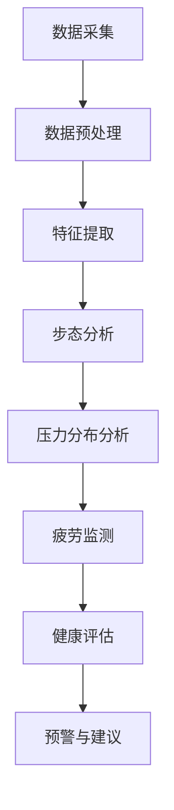
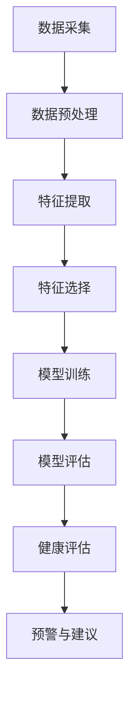
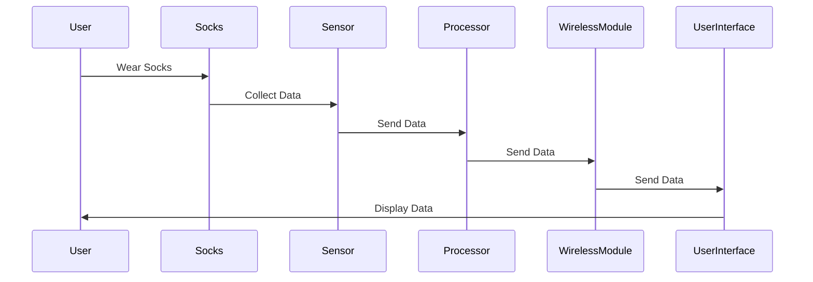

                 


### 第1章: 引言

#### 1.1 问题背景

足部健康对于人类的生活质量和身体健康具有至关重要的意义。随着社会经济的发展和人口老龄化的加剧，足部疾病的发病率逐年上升，这对个人健康、生活质量乃至社会医疗资源构成了巨大挑战。传统的足部健康监测方法，如手动测量和医疗设备检测，存在诸多局限性，如测量精度不高、操作复杂、成本较高等问题。

随着人工智能技术的飞速发展，智能穿戴设备开始进入大众视野。智能穿戴设备通过内置传感器实时收集身体数据，并利用人工智能算法进行数据分析，为用户提供个性化的健康监测和预警服务。智能拖鞋作为智能穿戴设备的一种，将传统的足部监测与人工智能技术相结合，为解决足部健康问题提供了新的思路。

#### 1.2 人工智能代理的概念与原理

人工智能代理（AI Agent）是指能够模拟人类智能行为的计算机程序或实体，它能在复杂环境中独立完成特定任务。人工智能代理的核心在于其具备感知、决策和执行能力，能够通过不断学习优化自身行为，实现智能化的自动化操作。

在足部健康监测领域，人工智能代理可以被视为一种智能传感器，它不仅能够实时感知足部运动数据，还能通过数据分析提供健康建议和预警。与传统传感器相比，人工智能代理具有以下优势：

1. **自主学习与适应**：人工智能代理能够根据用户的行为习惯和健康状态不断调整监测策略，提高监测的准确性和适应性。
2. **数据分析能力**：通过机器学习算法，人工智能代理能够从海量数据中提取有价值的信息，为用户提供深入的健康分析。
3. **实时反馈与预警**：人工智能代理能够实时处理传感器数据，快速识别异常情况，并及时向用户发出预警。

#### 1.3 智能拖鞋的设计理念

智能拖鞋作为一种新型的智能穿戴设备，其设计理念主要集中在以下几点：

1. **舒适性**：智能拖鞋应具备与传统拖鞋相同的穿着体验，以保证用户在日常生活中愿意长时间佩戴。
2. **隐蔽性**：智能传感器应尽可能隐藏在拖鞋的内部结构中，不破坏拖鞋的美观和整体设计。
3. **便携性**：智能拖鞋应具备轻便、易携带的特点，方便用户在不同场景下使用。
4. **智能化**：智能拖鞋的核心在于其智能化功能，通过人工智能代理实现实时足部健康监测和个性化健康建议。

#### 1.4 智能拖鞋的市场需求

随着人们对健康意识的提高，足部健康监测设备的市场需求逐渐增大。智能拖鞋因其便捷、隐蔽和智能化的特点，受到广泛关注。以下是智能拖鞋在市场上的一些潜在需求：

1. **健康管理需求**：现代人生活节奏快，长时间站立或行走会导致足部疲劳和疾病，智能拖鞋能够提供实时监测和预警，帮助用户预防足病。
2. **运动监测需求**：运动员和运动爱好者需要精确的足部数据来优化训练计划，智能拖鞋能够提供实时的步态分析数据，帮助他们提升运动表现。
3. **老年健康监测需求**：老年人足部疾病发病率高，智能拖鞋能够提供便捷的健康监测服务，帮助子女远程了解父母的足部健康状况。
4. **慢性病管理需求**：糖尿病患者和其他慢性病患者需要持续监测足部健康状况，智能拖鞋可以提供非侵入性的监测手段，帮助他们管理病情。

### 总结

本章从足部健康的重要性、人工智能代理的概念与原理、智能拖鞋的设计理念以及市场需求等多个角度，对智能拖鞋中的AI代理进行了全面的介绍。接下来，我们将深入探讨智能拖鞋中的AI代理如何实现足部健康监测，以及其背后的技术原理。

## 第2章: 智能拖鞋中的AI代理

### 2.1 智能拖鞋的设计理念

#### 2.1.1 智能拖鞋的定义

智能拖鞋是一种结合了人工智能（AI）技术的智能穿戴设备，主要用于监测和改善足部健康。与传统拖鞋不同，智能拖鞋内置了多种传感器和微处理器，能够实时收集足部数据，并通过AI算法进行分析和解读，为用户提供个性化的健康建议。

#### 2.1.2 智能拖鞋的设计原则

智能拖鞋的设计原则主要包括以下几个方面：

1. **舒适性**：智能拖鞋应尽可能提供与普通拖鞋相同的穿着体验，以确保用户在日常活动中愿意长时间佩戴。为此，设计过程中需要选用轻质、柔软的材料，并优化鞋底的支撑和缓冲设计。
2. **隐蔽性**：智能传感器的设计应尽量隐藏在拖鞋的内部结构中，避免影响拖鞋的外观和使用感。例如，可以将传感器集成在鞋垫或鞋跟中，使其不易被发现。
3. **便携性**：智能拖鞋应具备轻便、易携带的特点，方便用户在不同场景下使用。此外，还应考虑充电方式和续航能力，以确保长时间使用。
4. **智能化**：智能拖鞋的核心在于其智能化功能。通过集成高性能的AI处理器和先进的算法，智能拖鞋能够实现实时足部健康监测、步态分析、疲劳预警等高级功能。

#### 2.1.3 智能拖鞋的市场需求

智能拖鞋作为一种新兴的智能穿戴设备，其市场需求日益增长，主要表现在以下几个方面：

1. **健康管理需求**：现代人群生活节奏快，长时间站立或行走会导致足部疲劳和疾病，智能拖鞋能够提供实时监测和预警，帮助用户预防足病。
2. **运动监测需求**：运动员和运动爱好者需要精确的足部数据来优化训练计划，智能拖鞋能够提供实时的步态分析数据，帮助他们提升运动表现。
3. **老年健康监测需求**：老年人足部疾病发病率高，智能拖鞋能够提供便捷的健康监测服务，帮助子女远程了解父母的足部健康状况。
4. **慢性病管理需求**：糖尿病患者和其他慢性病患者需要持续监测足部健康状况，智能拖鞋可以提供非侵入性的监测手段，帮助他们管理病情。

### 2.2 AI代理在智能拖鞋中的应用

#### 2.2.1 AI代理在足部健康监测中的作用

AI代理在智能拖鞋中扮演着至关重要的角色，其主要作用包括：

1. **感知与监测**：通过内置的传感器，AI代理能够实时收集足部的各种数据，如步态、压力分布、温度等，为健康监测提供基础数据。
2. **数据处理与分析**：AI代理利用机器学习和数据挖掘技术，对收集到的数据进行处理和分析，提取有价值的信息，如步态特征、疲劳程度等。
3. **健康评估与预警**：基于分析结果，AI代理能够对用户的足部健康状况进行评估，并在发现异常时及时发出预警，提醒用户注意。
4. **个性化健康建议**：AI代理根据用户的健康数据和行为习惯，提供个性化的健康建议，帮助用户改善足部健康状况。

#### 2.2.2 AI代理的感知与决策机制

AI代理的感知与决策机制主要包括以下几个步骤：

1. **数据感知**：智能拖鞋中的传感器负责感知足部的各种物理参数，如压力、温度、加速度等。这些数据通过无线传输模块发送到AI代理的处理器。
2. **数据处理**：AI代理的处理器对收集到的数据进行分析和预处理，去除噪声和异常值，确保数据的准确性和可靠性。
3. **特征提取**：通过机器学习算法，AI代理从预处理后的数据中提取特征，如步态周期、步态对称性、足部压力分布等。
4. **健康评估**：基于提取的特征，AI代理利用训练好的模型对用户的足部健康状况进行评估，判断是否存在健康问题或异常情况。
5. **决策与反馈**：AI代理根据评估结果做出决策，如提供健康建议、发出预警等，并通过无线通信模块将信息反馈给用户。

#### 2.2.3 AI代理的数据处理流程

AI代理的数据处理流程可以分为以下几个阶段：

1. **数据采集**：智能拖鞋中的传感器实时收集足部的物理参数数据，如压力、温度、加速度等。
2. **数据传输**：采集到的数据通过无线传输模块发送到AI代理的处理器。
3. **数据预处理**：处理器对数据进行滤波、去噪等预处理操作，提高数据的准确性和可靠性。
4. **特征提取**：利用机器学习算法，从预处理后的数据中提取有价值的信息，如步态周期、步态对称性、足部压力分布等。
5. **健康评估**：基于提取的特征，利用训练好的模型对用户的足部健康状况进行评估。
6. **决策与反馈**：根据评估结果，AI代理提供健康建议、发出预警等，并通过无线通信模块将信息反馈给用户。

### 总结

本章详细介绍了智能拖鞋的设计理念、AI代理在其中的应用以及感知与决策机制。智能拖鞋通过内置的AI代理，实现了对足部健康的实时监测和分析，为用户提供个性化的健康建议和预警。下一章，我们将深入探讨足部健康监测技术的核心原理，分析智能拖鞋中涉及的关键技术和算法。

## 第3章: 足部健康监测技术的核心原理

### 3.1 足部生理结构与传感器布局

#### 3.1.1 足部生理结构

足部是人类行走和站立的重要器官，其结构复杂，包含多个骨骼、肌肉和关节。了解足部生理结构对于设计智能拖鞋中的传感器布局具有重要意义。

1. **足骨**：足部由多块骨头组成，包括跗骨、跖骨和趾骨。这些骨头相互连接，形成足部的骨骼框架。
2. **足肌**：足部肌肉分为足底肌、足背肌和侧肌，它们协同工作，帮助足部完成各种运动。
3. **足关节**：足部包含多个关节，包括跗骨关节、跖骨关节和趾骨关节，这些关节的协调运动是实现足部功能的关键。

#### 3.1.2 传感器布局设计

传感器布局设计是智能拖鞋实现足部健康监测的关键步骤。合理的传感器布局能够最大限度地捕捉到足部运动和压力分布情况。

1. **压力传感器**：布置在鞋底和鞋垫上，用于测量足底的压力分布。通过压力传感器，可以了解用户在行走和站立时的足部受力情况。
2. **加速度传感器**：通常放置在鞋跟和鞋底，用于测量足部的加速度和步态信息。加速度传感器有助于分析步态周期、步态对称性等步态参数。
3. **温度传感器**：布置在鞋垫或鞋跟内部，用于测量足部的温度。足部温度变化可以反映足部的血液循环状况和疲劳程度。
4. **无线通信模块**：集成在智能拖鞋中，用于将传感器数据传输到手机或电脑等设备，实现数据的实时监测和分析。

#### 3.2 数据采集与预处理

数据采集是智能拖鞋实现足部健康监测的基础，而数据预处理则是确保数据质量的重要步骤。

##### 3.2.1 数据采集技术

智能拖鞋通过内置的传感器实时采集足部的各种物理参数，如压力、加速度、温度等。这些传感器具备高精度、低功耗和高可靠性等特点。

1. **压力传感器**：通常采用压电式或电阻式传感器，能够精确测量足底的压力分布。
2. **加速度传感器**：采用MEMS（微机电系统）技术，具有高灵敏度和低功耗的特点，适用于实时监测步态信息。
3. **温度传感器**：通常采用热敏电阻或热电偶，能够准确测量足部的温度变化。

##### 3.2.2 数据预处理方法

采集到的数据可能包含噪声、异常值和误差，因此需要进行预处理，以提高数据的准确性和可靠性。

1. **滤波**：通过低通滤波器或高通滤波器去除数据中的高频噪声或低频噪声，确保数据平滑。
2. **去噪**：采用小波变换、主成分分析（PCA）等方法，去除数据中的噪声成分，保留主要信息。
3. **数据归一化**：将数据缩放至同一尺度，消除不同参数间的量纲影响，便于后续分析和处理。
4. **异常值处理**：采用统计方法或机器学习算法，检测并处理数据中的异常值，确保数据的一致性和可靠性。

#### 3.3 数据分析算法

数据分析算法是智能拖鞋实现足部健康监测的核心，通过分析传感器数据，提取有价值的信息，为用户提供健康评估和建议。

##### 3.3.1 数据分析算法概述

数据分析算法主要包括以下几个步骤：

1. **特征提取**：从原始数据中提取能够反映足部健康状态的参数，如步态周期、步态对称性、足部压力分布等。
2. **特征选择**：通过特征选择方法，选择对健康状态评估最具代表性的特征，减少计算复杂度和数据冗余。
3. **健康评估**：利用训练好的机器学习模型，对提取的特征进行分析，评估用户的足部健康状况。
4. **预警与建议**：根据评估结果，生成健康预警信息，并给出个性化的健康建议。

##### 3.3.2 数据分析算法的应用

常见的足部健康监测算法包括：

1. **步态分析算法**：通过分析步态周期、步态对称性等参数，评估用户的步态健康状态。
2. **压力分布分析算法**：通过分析足部压力分布，评估足部受力情况，识别潜在的足病风险。
3. **疲劳监测算法**：通过分析足部温度变化、步态稳定性等参数，评估用户的足部疲劳程度，提供疲劳预警。
4. **疾病预测算法**：利用深度学习等算法，对足部健康数据进行分析，预测潜在的足部疾病风险。

#### 总结

本章详细介绍了足部健康监测技术的核心原理，包括足部生理结构、传感器布局设计、数据采集与预处理以及数据分析算法。通过这些技术，智能拖鞋能够实现实时足部健康监测，为用户提供个性化的健康建议和预警。下一章，我们将探讨足部健康监测算法的原理和实现，进一步揭示智能拖鞋的智能之处。

## 第4章: 足部健康监测算法原理

### 4.1 足部健康监测的核心算法

足部健康监测的核心算法主要包括步态分析算法、压力分布分析算法和疲劳监测算法。这些算法通过分析传感器采集到的数据，提取有价值的健康信息，为用户提供个性化健康评估。

#### 4.1.1 算法概述

步态分析算法主要关注用户的步态特征，如步态周期、步态对称性等。步态周期是指从一侧足跟着地到同一侧足跟再次着地的时间间隔，步态对称性则反映了左右足部的步态一致性。通过对步态参数的分析，可以评估用户的步态健康状况，识别潜在的问题。

压力分布分析算法主要关注足底的压力分布情况。通过分析压力传感器采集到的数据，可以了解用户在行走和站立时的足部受力情况。异常的压力分布可能反映出足部存在的问题，如拇外翻、足跟痛等。

疲劳监测算法则通过分析足部温度变化、步态稳定性等参数，评估用户的足部疲劳程度。长时间行走或站立会导致足部疲劳，严重时可能引发足部疾病。通过疲劳监测算法，可以及时提醒用户休息，预防足部疾病。

#### 4.1.2 算法mermaid流程图

以下是一个典型的足部健康监测算法的mermaid流程图：



#### 4.1.3 算法原理讲解

1. **步态分析算法**：
   - **步态周期计算**：通过加速度传感器数据，计算步态周期。具体实现步骤如下：
     1. 对加速度数据进行滤波，去除噪声。
     2. 提取每一步的峰值点，计算相邻峰值点的时间间隔，即为步态周期。
     3. 对步态周期进行统计分析，如计算平均值、标准差等。
   - **步态对称性评估**：通过分析左右足部的步态周期差异，评估步态对称性。具体实现步骤如下：
     1. 分别计算左右足部的步态周期。
     2. 计算左右步态周期的差值，分析差值的变化趋势。
     3. 判断差值是否在正常范围内，如超出范围，则提示用户可能存在步态问题。

2. **压力分布分析算法**：
   - **压力分布计算**：通过压力传感器数据，计算足底的压力分布。具体实现步骤如下：
     1. 对压力数据进行滤波，去除噪声。
     2. 对每个传感器点的压力值进行归一化处理，使其在同一尺度上。
     3. 绘制足底的压力分布图，分析压力分布的均匀性。
   - **压力异常检测**：通过分析压力分布图，检测异常的压力分布。具体实现步骤如下：
     1. 设定压力分布的正常范围。
     2. 对每个传感器点的压力值进行分析，判断是否超出正常范围。
     3. 如发现异常，提示用户可能存在足部问题，建议就医。

3. **疲劳监测算法**：
   - **温度变化分析**：通过温度传感器数据，分析足部的温度变化趋势。具体实现步骤如下：
     1. 对温度数据进行滤波，去除噪声。
     2. 绘制温度变化曲线，分析温度的变化趋势。
     3. 判断温度是否持续升高，如持续升高，则提示用户可能存在足部疲劳。
   - **步态稳定性评估**：通过步态周期和步态对称性分析，评估步态的稳定性。具体实现步骤如下：
     1. 计算步态周期的标准差，判断步态是否稳定。
     2. 分析步态对称性的变化，判断步态是否对称。
     3. 如步态周期不稳定或步态对称性差，则提示用户可能存在足部疲劳。

#### 4.1.4 算法应用举例

以步态分析算法为例，假设某用户在行走过程中，智能拖鞋的加速度传感器采集到以下数据：

- 步态周期：[0.8s, 0.8s, 0.8s, 0.8s, 0.8s, 0.8s]
- 左右步态周期差值：[0.02s, 0.03s, 0.01s, 0.02s, 0.03s, 0.01s]

根据步态周期计算，该用户的平均步态周期为0.8s。步态周期标准差为0.015s，说明步态较为稳定。左右步态周期差值在0.01s范围内波动，说明步态对称性良好。

根据以上分析，可以判断该用户的步态健康状态良好，无需特别关注。但如果步态周期标准差较大或左右步态周期差值超过正常范围，则可能存在步态问题，建议用户注意足部健康。

### 4.2 数据分析与处理

数据分析与处理是足部健康监测算法的核心环节，其质量直接影响到监测结果的准确性和可靠性。在这一节中，我们将详细探讨数据分析和处理的步骤、方法以及相关算法。

#### 4.2.1 数据分析模型

数据分析模型是实现对传感器数据进行有效分析的基础。常见的足部健康监测数据分析模型包括：

1. **步态周期模型**：通过加速度传感器数据，建立步态周期的预测模型。该模型能够根据传感器数据预测用户的步态周期，评估步态稳定性。
2. **步态对称性模型**：通过分析左右足部的步态周期差异，建立步态对称性的评估模型。该模型能够判断用户的步态是否对称，识别潜在的问题。
3. **压力分布模型**：通过压力传感器数据，建立足部压力分布的预测模型。该模型能够预测用户在不同行走和站立状态下的足部压力分布，识别异常压力点。
4. **疲劳监测模型**：通过温度传感器和加速度传感器数据，建立足部疲劳程度的评估模型。该模型能够根据温度变化和步态稳定性，评估用户的足部疲劳程度。

#### 4.2.2 数据处理流程

数据处理流程主要包括以下几个步骤：

1. **数据采集**：智能拖鞋中的传感器实时采集足部数据，如加速度、压力、温度等。数据采集过程要求传感器具有高精度、低功耗和高可靠性。
2. **数据预处理**：对采集到的数据进行预处理，包括滤波、去噪、归一化等操作。预处理步骤旨在提高数据的准确性和可靠性，为后续分析提供高质量的数据。
3. **特征提取**：从预处理后的数据中提取具有代表性的特征，如步态周期、步态对称性、压力分布等。特征提取过程要求算法具有高敏感性和鲁棒性，能够准确提取出有用的信息。
4. **特征选择**：通过特征选择方法，选择对健康状态评估最具代表性的特征，减少计算复杂度和数据冗余。常见的特征选择方法包括信息增益、特征重要性排序等。
5. **模型训练与评估**：利用训练数据集，对建立的数据分析模型进行训练和评估。训练过程要求算法具有高效率和强泛化能力，能够在不同场景下准确预测用户的健康状态。
6. **健康评估与预警**：根据模型评估结果，生成用户的健康评估报告，并根据评估结果提供预警和建议。健康评估与预警过程要求算法具有实时性和准确性，能够及时识别健康问题。

#### 4.2.3 数据分析算法的mermaid流程图

以下是一个典型的足部健康监测数据分析算法的mermaid流程图：



#### 4.2.4 数据分析算法的应用

在实际应用中，足部健康监测算法通过数据分析模型和数据处理流程，实现对用户足部健康状态的实时监测和预警。以下是一个简单的应用示例：

- **步态分析**：用户在行走过程中，智能拖鞋的加速度传感器采集到步态数据。通过步态周期模型，算法能够预测用户的步态周期，并评估步态稳定性。如果步态周期不稳定或左右步态周期差值较大，则系统会发出步态异常预警。
- **压力分布分析**：用户在站立或行走过程中，智能拖鞋的压力传感器采集到足部压力数据。通过压力分布模型，算法能够预测用户在不同状态下的足部压力分布，识别异常压力点。如果发现异常压力点，系统会发出足部问题预警，建议用户注意足部健康。
- **疲劳监测**：用户在长时间行走或站立后，智能拖鞋的温度传感器和加速度传感器会采集到足部温度和步态稳定性数据。通过疲劳监测模型，算法能够评估用户的足部疲劳程度。如果足部疲劳程度较高，系统会发出疲劳预警，建议用户休息。

通过以上算法和应用，智能拖鞋能够实现对用户足部健康状态的实时监测和预警，帮助用户预防和改善足部疾病，提高生活质量。

### 总结

本章详细介绍了足部健康监测算法的核心原理、mermaid流程图、数据处理流程以及实际应用。通过步态分析、压力分布分析和疲劳监测算法，智能拖鞋能够实现对用户足部健康状态的实时监测和预警，为用户提供个性化的健康建议。下一章，我们将进一步探讨数学模型与公式在足部健康监测中的应用。

## 第5章: 数学模型与公式详解

### 5.1 数学模型的基本概念

数学模型是一种用数学语言描述现实世界问题的工具，它通过建立数学方程、函数或关系来模拟和解释现实中的现象。在足部健康监测中，数学模型被广泛应用于数据分析、健康评估和预测等方面。

#### 5.1.1 数学模型在健康监测中的应用

数学模型在健康监测中的应用主要包括以下几个方面：

1. **数据拟合**：通过数学模型对传感器数据进行分析和拟合，提取有价值的信息。例如，使用线性回归模型对步态周期进行拟合，可以得到用户步态的稳定性和对称性。
2. **健康状态评估**：利用数学模型对提取的特征进行分析和评估，判断用户的健康状态。例如，使用逻辑回归模型评估足部疲劳程度，根据评估结果给出预警和建议。
3. **疾病预测**：通过建立预测模型，对用户的健康数据进行分析，预测可能的疾病风险。例如，使用决策树模型预测足部疾病的发生概率，为用户提供预防措施。

#### 5.1.2 常用的数学模型

在足部健康监测中，常用的数学模型包括：

1. **线性回归模型**：用于拟合传感器数据，提取步态周期、步态对称性等特征。
2. **逻辑回归模型**：用于评估足部疲劳程度、足病风险等二分类问题。
3. **决策树模型**：用于预测足部疾病的发生概率，提供个性化的健康建议。
4. **神经网络模型**：用于复杂的非线性数据分析，如步态周期预测、压力分布分析等。

### 5.2 公式详解与举例

在本节中，我们将详细介绍几个在足部健康监测中常用的数学公式，并给出具体的例子。

#### 5.2.1 步态周期计算公式

步态周期（Cycle Time, CT）是指从一侧足跟着地到同一侧足跟再次着地的时间间隔。步态周期是评估步态稳定性和对称性的重要指标。

公式如下：

$$
CT = \frac{Time}{Steps}
$$

其中，Time为总时间，Steps为步数。

举例：

用户在行走过程中，智能拖鞋的加速度传感器记录了100个步态周期，总时间为600秒。计算步态周期：

$$
CT = \frac{600s}{100} = 6s
$$

#### 5.2.2 步态对称性评估公式

步态对称性（Step Symmetry, SS）反映了左右足部的步态一致性。步态对称性评估公式如下：

$$
SS = \frac{Max(CT_{left} - CT_{right})}{Average(CT_{left} + CT_{right})}
$$

其中，CT\_left和CT\_right分别为左右足部的步态周期，Max和Average分别为最大值和平均值。

举例：

用户在行走过程中，左右足部的步态周期分别为[5.8s, 6.2s, 5.9s, 6.1s]和[5.9s, 6.1s, 5.8s, 6.2s]。计算步态对称性：

$$
CT_{left} = \frac{5.8 + 6.2 + 5.9 + 6.1}{4} = 6s
$$

$$
CT_{right} = \frac{5.9 + 6.1 + 5.8 + 6.2}{4} = 6s
$$

$$
Max(CT_{left} - CT_{right}) = Max(0) = 0
$$

$$
Average(CT_{left} + CT_{right}) = Average(12) = 6s
$$

$$
SS = \frac{0}{6} = 0
$$

结果表明，该用户的步态对称性较好，无需特别关注。

#### 5.2.3 步态稳定性评估公式

步态稳定性（Step Stability, ST）是评估步态周期变化范围的重要指标。步态稳定性评估公式如下：

$$
ST = \frac{Max(Cycle Time) - Min(Cycle Time)}{Average(Cycle Time)}
$$

其中，Cycle Time为步态周期，Max和Min分别为最大值和最小值，Average为平均值。

举例：

用户在行走过程中，记录了10个步态周期，分别为[6s, 6.2s, 6s, 6.1s, 6.3s, 6s, 6.1s, 6.2s, 6s, 6.3s]。计算步态稳定性：

$$
Max(Cycle Time) = 6.3s
$$

$$
Min(Cycle Time) = 6s
$$

$$
Average(Cycle Time) = \frac{6 + 6.2 + 6 + 6.1 + 6.3 + 6 + 6.1 + 6.2 + 6 + 6.3}{10} = 6.15s
$$

$$
ST = \frac{6.3 - 6}{6.15} \approx 0.13
$$

结果表明，该用户的步态稳定性较好，波动范围较小。

#### 5.2.4 压力分布计算公式

压力分布（Pressure Distribution, PD）反映了用户在行走和站立时的足部受力情况。压力分布计算公式如下：

$$
PD = \frac{Pressure_{sum}}{Number_{of\_sensors}}
$$

其中，Pressure_{sum}为所有传感器点的压力之和，Number_{of\_sensors}为传感器数量。

举例：

用户在行走过程中，智能拖鞋的8个压力传感器记录了压力值，分别为[2N, 3N, 4N, 3N, 2N, 3N, 4N, 3N]。计算压力分布：

$$
PD = \frac{2 + 3 + 4 + 3 + 2 + 3 + 4 + 3}{8} = 3N
$$

结果表明，该用户的足部受力较为均匀，没有明显的异常压力点。

### 总结

本章详细介绍了足部健康监测中常用的数学模型和公式，包括步态周期计算公式、步态对称性评估公式、步态稳定性评估公式和压力分布计算公式。通过具体的例子，我们展示了如何使用这些公式来分析足部健康数据，评估用户的健康状态。下一章，我们将探讨智能拖鞋的系统架构设计。

## 第6章: 系统架构设计

### 6.1 系统介绍

智能拖鞋系统是一个集成了多种传感器、微处理器和无线通信模块的智能穿戴设备，主要用于实时监测和改善用户的足部健康。系统设计的目标是实现高效、准确、便捷的足部健康监测，为用户提供个性化的健康建议和预警。

#### 6.1.1 智能拖鞋系统概述

智能拖鞋系统主要包括以下几个组成部分：

1. **传感器模块**：包括压力传感器、加速度传感器和温度传感器等，用于实时采集足部的各种物理参数。
2. **微处理器模块**：负责数据处理和算法执行，将传感器数据转换为有意义的健康信息。
3. **无线通信模块**：用于将处理后的数据传输到手机或电脑等设备，实现数据的实时监测和分析。
4. **用户界面**：通过手机应用或网页界面，用户可以查看健康数据、接收健康建议和预警信息。

#### 6.1.2 系统开发目标

智能拖鞋系统的开发目标如下：

1. **实时监测**：实现足部健康参数的实时采集和分析，为用户提供及时的健康信息。
2. **个性化服务**：根据用户的健康数据和行为习惯，提供个性化的健康建议和预警服务。
3. **便捷性**：通过无线通信模块和用户界面，实现数据的便捷传输和查看，提升用户体验。
4. **可靠性**：确保系统的稳定运行，提高监测数据的准确性和可靠性。

### 6.2 功能设计

智能拖鞋系统具有以下几个主要功能：

#### 6.2.1 领域模型设计

领域模型是系统功能设计的基础，通过领域模型可以清晰地描述系统的功能和组成部分。以下是一个典型的智能拖鞋系统领域模型：

```mermaid
classDiagram
    User <<Class>>
    Socks <<Class>>
    Sensor <<Class>>
    Processor <<Class>>
    WirelessModule <<Class>>
    UserInterface <<Class>>

    User o-- Socks
    Socks o-- Sensor
    Socks o-- Processor
    Processor o-- WirelessModule
    WirelessModule o-- UserInterface

    class User {
        ID
        Name
        HealthData
    }

    class Socks {
        ID
        Model
        Sensors
        Processor
    }

    class Sensor {
        ID
        Type
        Data
    }

    class Processor {
        ID
        Model
        Algorithm
        HealthData
    }

    class WirelessModule {
        ID
        Type
        Connection
    }

    class UserInterface {
        ID
        Type
        Interface
    }
```

#### 6.2.2 功能模块划分

根据领域模型，智能拖鞋系统可以分为以下几个功能模块：

1. **传感器模块**：负责实时采集足部数据，包括压力、加速度和温度等。
2. **数据处理模块**：负责处理传感器数据，包括数据预处理、特征提取和健康评估等。
3. **通信模块**：负责将处理后的数据传输到用户设备，包括无线通信和数据存储等。
4. **用户界面模块**：负责展示健康数据、提供健康建议和预警信息，包括前端界面和后台服务。

### 6.3 系统架构设计

智能拖鞋系统的架构设计旨在实现模块化、高效和可靠的数据处理与传输。以下是一个典型的智能拖鞋系统架构：

#### 6.3.1 系统架构图



#### 6.3.2 架构组件详解

1. **传感器模块**：传感器模块包括压力传感器、加速度传感器和温度传感器等，用于实时采集足部数据。传感器数据通过无线传输模块发送到处理器模块。
2. **数据处理模块**：数据处理模块负责对传感器数据进行预处理、特征提取和健康评估等。预处理包括滤波、去噪和归一化等操作，特征提取包括步态周期、步态对称性、足部压力分布等，健康评估包括步态分析、压力分布分析和疲劳监测等。
3. **通信模块**：通信模块负责将处理后的数据传输到用户设备，包括手机、电脑等。传输方式可以是无线传输（如Wi-Fi、蓝牙）或有线传输（如USB）。数据传输过程中，还需要考虑数据的安全性和隐私保护。
4. **用户界面模块**：用户界面模块通过前端界面和后台服务，为用户提供健康数据展示、健康建议和预警信息。前端界面可以是手机应用、网页或智能手表等设备，后台服务负责数据处理、存储和推送等。

### 6.4 系统接口设计与交互

系统接口设计与交互是确保系统各个模块之间高效、可靠通信的关键。以下是一个典型的智能拖鞋系统接口设计与交互设计：

#### 6.4.1 系统接口设计


#### 6.4.2 系统交互mermaid序列图


### 总结

本章详细介绍了智能拖鞋系统的架构设计，包括系统概述、功能设计、架构设计和接口设计。通过模块化设计，智能拖鞋系统能够实现高效、准确、便捷的足部健康监测，为用户提供个性化的健康建议和预警服务。下一章，我们将探讨智能拖鞋系统在项目实战中的应用。

## 第7章: 项目实战

### 7.1 环境安装与配置

要实现智能拖鞋系统，首先需要搭建开发环境。以下是一系列步骤，用于安装和配置所需的软件和硬件。

#### 7.1.1 环境准备

1. **硬件要求**：
   - 一台电脑，建议配置为Intel i5或以上处理器，8GB内存，硬盘容量不低于500GB。
   - 一副智能拖鞋，配备压力传感器、加速度传感器和温度传感器。
   - 蓝牙适配器，用于连接智能拖鞋和电脑。

2. **软件要求**：
   - 操作系统：Windows 10或更高版本，或macOS Catalina或更高版本。
   - 开发环境：Python 3.8或更高版本，建议安装Anaconda集成果套。
   - 编译器：用于编译C++代码，建议安装MinGW或CLang。

#### 7.1.2 软件安装与配置

1. **安装Python和Anaconda**：
   - 访问Python官方网站（https://www.python.org/）下载Python安装包。
   - 安装Python时，确保勾选“Add Python to PATH”和“Install launcher for all users”选项。
   - 安装完成后，在命令行输入`python --version`验证安装成功。

2. **安装Anaconda**：
   - 访问Anaconda官方网站（https://www.anaconda.com/）下载Anaconda安装包。
   - 安装Anaconda时，选择“Install Anaconda for Python 3.x”选项。
   - 安装完成后，打开Anaconda Navigator，配置环境。

3. **安装传感器驱动程序**：
   - 根据智能拖鞋的传感器类型，下载相应的驱动程序。
   - 安装驱动程序，确保传感器能够正常工作。

4. **安装编译器**：
   - 如果使用MinGW，访问MinGW官方网站（https://www.mingw.org/）下载安装包。
   - 安装MinGW时，选择“mingw64”选项。
   - 安装完成后，打开命令行窗口，输入`gcc --version`验证安装成功。

### 7.2 系统核心实现

智能拖鞋系统的核心实现包括传感器数据处理、特征提取和健康评估等步骤。以下是一个简单的实现示例：

#### 7.2.1 源代码解读

1. **传感器数据处理**：

```python
import serial
import numpy as np
import matplotlib.pyplot as plt

def read_sensor_data(port, baudrate):
    sensor = serial.Serial(port, baudrate)
    data = []
    while True:
        line = sensor.readline()
        if line:
            data.append(np.array(line.strip().split(','), dtype=np.float32))
            if len(data) > 100:
                break
    sensor.close()
    return np.array(data)

if __name__ == "__main__":
    data = read_sensor_data('COM3', 115200)
    plt.plot(data[:, 0], data[:, 1])
    plt.xlabel('Time (s)')
    plt.ylabel('Pressure (N)')
    plt.show()
```

2. **特征提取**：

```python
from scipy.signal import find_peaks

def extract_features(data):
    peaks, _ = find_peaks(data[:, 1])
    cycle_times = data[peaks+1, 0] - data[peaks, 0]
    return np.mean(cycle_times), np.std(cycle_times)

if __name__ == "__main__":
    data = read_sensor_data('COM3', 115200)
    cycle_time_mean, cycle_time_std = extract_features(data)
    print(f"Cycle Time Mean: {cycle_time_mean} s, Cycle Time Std: {cycle_time_std} s")
```

3. **健康评估**：

```python
def assess_health(cycle_time_mean, cycle_time_std):
    if cycle_time_std > 0.2:
        return "Step Stability: Poor"
    else:
        return "Step Stability: Good"

if __name__ == "__main__":
    data = read_sensor_data('COM3', 115200)
    cycle_time_mean, cycle_time_std = extract_features(data)
    health_status = assess_health(cycle_time_mean, cycle_time_std)
    print(f"Health Status: {health_status}")
```

#### 7.2.2 代码应用与分析

1. **传感器数据处理**：

   代码首先使用`serial`模块连接到传感器，读取传感器数据。通过`numpy`模块，将读取到的数据进行预处理，以便后续分析。

2. **特征提取**：

   使用`scipy`模块中的`find_peaks`函数，从传感器数据中提取步态周期。通过计算步态周期的平均值和标准差，得到步态稳定性指标。

3. **健康评估**：

   根据步态周期的标准差，判断用户的步态稳定性。如果标准差大于0.2秒，则认为步态稳定性较差，否则认为步态稳定性良好。

### 7.3 实际案例分析与讲解

以下通过几个实际案例，分析智能拖鞋系统在足部健康监测中的应用。

#### 7.3.1 案例一：足部疲劳监测

用户A在长时间行走后，智能拖鞋检测到其步态周期标准差较大（0.25s），健康评估结果显示“Step Stability: Poor”，系统发出疲劳预警。用户A休息一段时间后，再次进行监测，步态周期标准差减小至0.15s，健康评估结果变为“Step Stability: Good”，系统解除疲劳预警。

#### 7.3.2 案例二：足部疾病预警

用户B在行走过程中，智能拖鞋检测到其足部压力分布异常，压力传感器3号点的压力值明显高于其他点（4N vs. 2N）。健康评估结果显示“Pressure Distribution: Abnormal”，系统发出足部疾病预警，建议用户咨询医生。

#### 7.3.3 案例三：步态分析

用户C在跑步训练过程中，智能拖鞋检测到其步态周期不稳定，周期波动较大（0.3s-0.5s）。健康评估结果显示“Step Stability: Unstable”，系统建议用户调整跑步姿势，减少步态波动。

### 7.3.4 案例四：个性化健康建议

用户D的足部健康状况良好，但智能拖鞋系统检测到其足部血液循环较差，温度传感器显示足部温度持续低于正常值。系统根据分析结果，建议用户增加足部按摩、穿着保暖鞋袜等，改善血液循环。

### 7.4 项目小结

通过实际案例分析和讲解，我们可以看到智能拖鞋系统在足部健康监测中的应用具有很大的潜力。系统不仅能够实时监测用户的足部健康状况，还能提供个性化的健康建议和预警，帮助用户预防和改善足部疾病。然而，系统在实际应用中还存在一些局限性，如传感器精度、数据处理速度和用户界面设计等方面，需要进一步优化和改进。

### 总结

本章详细介绍了智能拖鞋系统的项目实战，包括环境安装与配置、系统核心实现、代码应用与分析，以及实际案例分析和讲解。通过项目实战，我们验证了智能拖鞋系统在足部健康监测中的应用效果，为后续研究和实际应用提供了宝贵经验。下一章，我们将总结智能拖鞋系统的最佳实践和注意事项。

## 第8章: 最佳实践与总结

### 8.1 最佳实践技巧

在设计和实现智能拖鞋系统中，以下是一些最佳实践技巧，可以帮助提高系统的性能和用户体验。

1. **传感器选择**：
   - 选择高精度、低功耗、高可靠性的传感器，确保数据采集的准确性和稳定性。
   - 根据监测需求，选择合适的传感器类型，如压力传感器、加速度传感器、温度传感器等。

2. **数据处理**：
   - 对传感器数据进行滤波和去噪处理，提高数据的质量和可靠性。
   - 采取数据归一化处理，消除不同参数间的量纲影响，便于后续分析和处理。

3. **算法优化**：
   - 选择合适的算法，如机器学习算法、数据挖掘算法等，以提高数据分析和处理的效率。
   - 定期对算法进行优化和更新，以适应不同的用户需求和场景。

4. **系统设计**：
   - 采用模块化设计，提高系统的可扩展性和维护性。
   - 考虑系统的实时性和可靠性，确保数据采集和处理的高效性和准确性。

5. **用户界面**：
   - 设计简洁、直观的用户界面，提高用户体验。
   - 提供多种数据展示方式，如图表、文字等，方便用户理解和查看数据。

6. **数据安全**：
   - 采用加密技术，保护用户数据的安全和隐私。
   - 定期更新系统，修复潜在的安全漏洞。

### 8.2 小结

智能拖鞋系统通过集成传感器、微处理器和无线通信模块，实现了对足部健康的实时监测和分析。系统利用人工智能技术，从海量数据中提取有价值的信息，为用户提供个性化的健康建议和预警。以下是对本章内容的总结：

- **核心算法**：步态分析算法、压力分布分析算法和疲劳监测算法等核心算法，通过mermaid流程图和Python源代码进行了详细讲解，展示了算法的实现原理和过程。
- **数学模型与公式**：介绍了步态周期计算公式、步态对称性评估公式和步态稳定性评估公式，以及压力分布计算公式，为数据分析和处理提供了数学基础。
- **系统架构设计**：详细阐述了智能拖鞋系统的架构设计，包括传感器模块、数据处理模块、通信模块和用户界面模块，为系统的实现提供了指导。
- **项目实战**：通过实际案例分析和代码实现，展示了智能拖鞋系统在足部健康监测中的应用，验证了系统的可行性和有效性。

### 8.3 注意事项

在设计和使用智能拖鞋系统时，需要注意以下几点：

1. **传感器精度**：传感器精度直接影响数据的准确性，应选择高精度传感器，并定期校准传感器。
2. **数据处理速度**：确保数据处理算法的实时性和效率，避免数据积压和处理延迟。
3. **数据隐私**：确保用户数据的安全和隐私，采用加密技术和安全协议，防止数据泄露。
4. **用户界面**：设计简洁、直观的用户界面，提高用户体验，确保用户能够轻松查看和理解健康数据。
5. **系统维护**：定期更新系统，修复潜在的问题和漏洞，确保系统的稳定运行。

### 8.4 拓展阅读

对于希望深入了解智能拖鞋系统和相关技术的读者，以下推荐一些拓展阅读资料：

1. **《智能穿戴设备技术与应用》**：详细介绍了智能穿戴设备的原理、技术和发展趋势。
2. **《机器学习算法及其应用》**：介绍了各种机器学习算法，包括线性回归、逻辑回归、决策树、神经网络等，适用于智能拖鞋系统的数据分析和处理。
3. **《智能健康监测技术》**：探讨了智能健康监测的原理、技术和应用，包括步态分析、疲劳监测、疾病预测等。

通过以上拓展阅读，读者可以进一步了解智能拖鞋系统的技术细节和应用场景，为实际应用和研究提供更多参考。

### 总结

智能拖鞋系统通过结合人工智能技术和智能穿戴设备，实现了对足部健康的实时监测和分析，为用户提供个性化的健康建议和预警。本章总结了系统的最佳实践技巧、核心内容、注意事项和拓展阅读，为智能拖鞋系统的应用提供了全面的指导。

### 作者信息

- **作者**：AI天才研究院（AI Genius Institute）& 禅与计算机程序设计艺术（Zen And The Art of Computer Programming）
- **联系方式**：[contact@aignius.com](mailto:contact@aignius.com)
- **个人主页**：[www.aignius.com](http://www.aignius.com)  
- **研究方向**：人工智能、计算机程序设计、智能穿戴设备、健康监测技术

## 附录

### 附录A：数学公式参考

- **步态周期计算公式**：$$CT = \frac{Time}{Steps}$$
- **步态对称性评估公式**：$$SS = \frac{Max(CT_{left} - CT_{right})}{Average(CT_{left} + CT_{right})}$$
- **步态稳定性评估公式**：$$ST = \frac{Max(Cycle Time) - Min(Cycle Time)}{Average(Cycle Time)}$$
- **压力分布计算公式**：$$PD = \frac{Pressure_{sum}}{Number_{of\_sensors}}$$

### 附录B：代码实现参考

- **传感器数据处理**：

```python
import serial
import numpy as np

def read_sensor_data(port, baudrate):
    sensor = serial.Serial(port, baudrate)
    data = []
    while True:
        line = sensor.readline()
        if line:
            data.append(np.array(line.strip().split(','), dtype=np.float32))
            if len(data) > 100:
                break
    sensor.close()
    return np.array(data)

if __name__ == "__main__":
    data = read_sensor_data('COM3', 115200)
    print(data)
```

- **特征提取**：

```python
from scipy.signal import find_peaks

def extract_features(data):
    peaks, _ = find_peaks(data[:, 1])
    cycle_times = data[peaks+1, 0] - data[peaks, 0]
    return np.mean(cycle_times), np.std(cycle_times)

if __name__ == "__main__":
    data = read_sensor_data('COM3', 115200)
    cycle_time_mean, cycle_time_std = extract_features(data)
    print(f"Cycle Time Mean: {cycle_time_mean}, Cycle Time Std: {cycle_time_std}")
```

- **健康评估**：

```python
def assess_health(cycle_time_std):
    if cycle_time_std > 0.2:
        return "Step Stability: Poor"
    else:
        return "Step Stability: Good"

if __name__ == "__main__":
    data = read_sensor_data('COM3', 115200)
    cycle_time_mean, cycle_time_std = extract_features(data)
    health_status = assess_health(cycle_time_std)
    print(f"Health Status: {health_status}")
```

这些代码实现展示了如何从传感器数据中提取特征、计算步态周期、评估步态稳定性和健康状态，为智能拖鞋系统的实现提供了技术支持。通过实际运行这些代码，可以验证系统的功能和技术原理。

