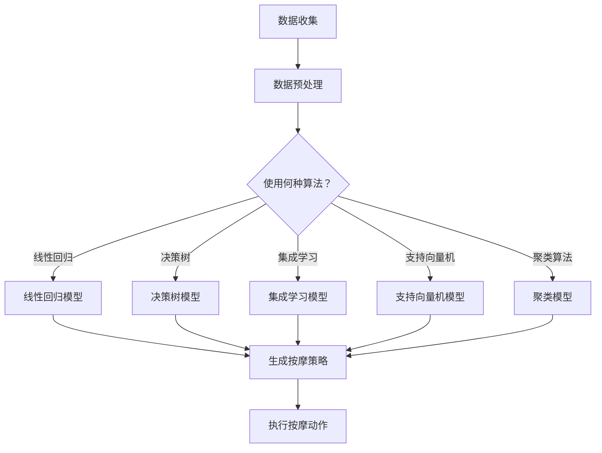
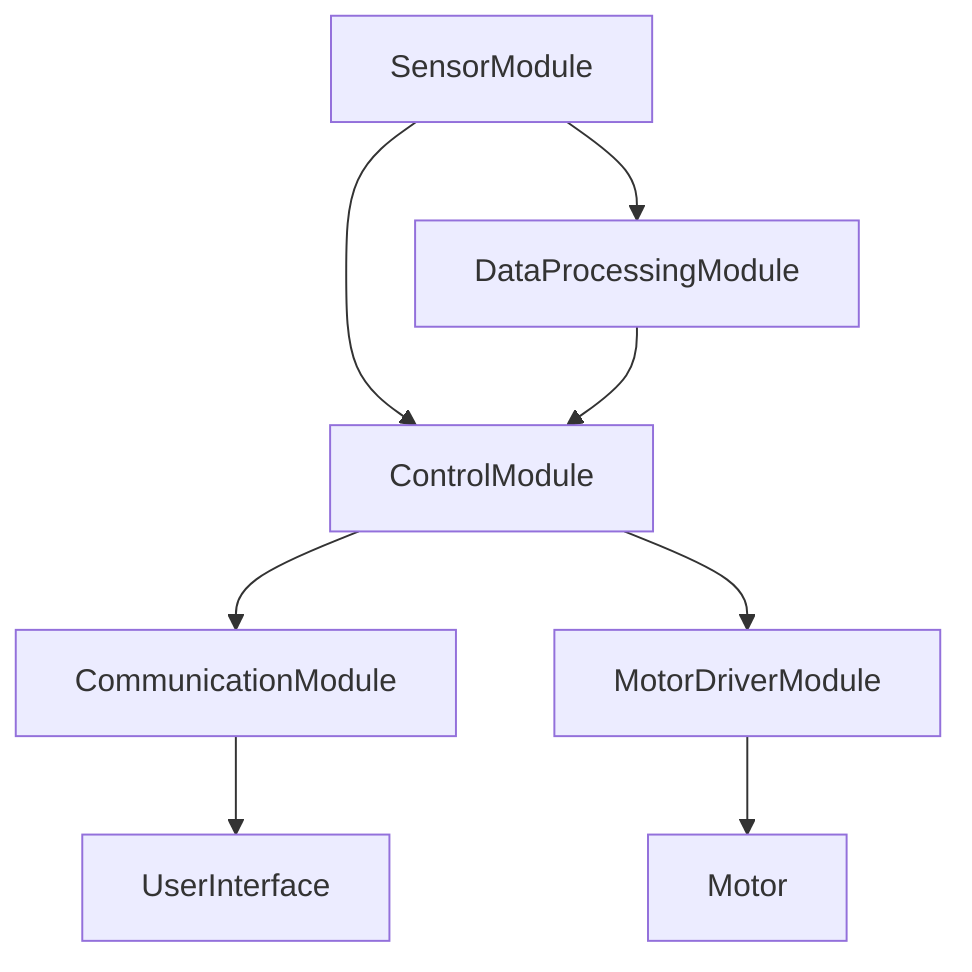

                 

# AI Agent in Smart Slipper Foot Massage Program Design

关键词：人工智能、智能拖鞋、足部按摩、机器学习、算法设计

摘要：本文将深入探讨AI Agent在智能拖鞋足部按摩程序设计中的应用。通过介绍AI Agent的基础知识，探讨机器学习算法在足部按摩中的应用，阐述智能拖鞋系统的设计原则，以及实战项目和最佳实践，本文旨在为读者提供全面的技术指导和实用建议。

## 前言

随着科技的进步和人们对健康生活质量的追求，智能穿戴设备逐渐成为人们生活中的重要组成部分。智能拖鞋作为智能穿戴设备的一种，通过集成先进的传感器、通信模块和AI技术，为用户提供个性化的足部按摩服务。本文将围绕AI Agent在智能拖鞋足部按摩程序设计中的核心作用展开讨论，旨在为智能拖鞋的研发和应用提供有价值的参考。

## 第一章：AI与智能设备的概述

### 1.1 智能设备的发展趋势

智能设备的发展可以追溯到20世纪80年代的计算机革命。随着计算机性能的不断提升和互联网的普及，智能设备逐渐走进了人们的日常生活。从最初的智能手机、平板电脑，到智能手表、智能家居设备，智能设备已经成为了现代社会不可或缺的一部分。

智能设备的发展趋势主要体现在以下几个方面：

- **便携性**：智能设备越来越轻便，便于用户携带和使用。
- **智能化**：设备具备自我学习和自适应能力，能够根据用户的需求和行为提供个性化的服务。
- **互联互通**：智能设备之间可以通过互联网实现互联互通，形成一个完整的智能生态体系。

### 1.2 AI在智能设备中的应用

人工智能（AI）是智能设备的核心驱动力之一。通过AI技术，智能设备能够实现更加智能化的功能，例如语音识别、图像识别、自然语言处理等。

AI在智能设备中的应用主要体现在以下几个方面：

- **语音助手**：如苹果的Siri、谷歌的Google Assistant等，能够通过语音交互为用户提供服务。
- **图像识别**：如智能摄像头、安防系统等，能够实时识别和监测目标物体。
- **智能推荐**：如电子商务平台，通过用户行为数据预测用户偏好，提供个性化的商品推荐。

### 1.3 AI在足部按摩中的应用

足部按摩是一种传统的中医疗法，通过按摩脚部穴位来促进血液循环、缓解疲劳。随着AI技术的不断发展，足部按摩设备逐渐融入了AI元素，提供了更加智能化、个性化的按摩服务。

AI在足部按摩中的应用主要包括以下几个方面：

- **数据分析**：通过传感器收集用户足部数据，分析用户的需求和按摩效果。
- **个性化定制**：根据用户的数据，智能调整按摩力度、时间和模式，提供个性化的按摩体验。
- **智能监控**：实时监控用户的足部状态，提供健康报告和建议。

## 第二章：机器学习算法在足部按摩中的应用

### 2.1 机器学习的基础概念

机器学习是人工智能的核心技术之一，它使计算机系统能够从数据中学习并做出预测或决策。机器学习算法可以分为监督学习、无监督学习和强化学习三类。

- **监督学习**：通过已标记的数据进行学习，常见算法包括线性回归、决策树、支持向量机等。
- **无监督学习**：在没有标记的数据上进行学习，常见算法包括聚类、降维等。
- **强化学习**：通过试错和反馈进行学习，常见算法包括Q-learning、深度强化学习等。

### 2.2 监督学习算法在足部按摩中的应用

监督学习算法在足部按摩中的应用主要体现在对用户数据的分析和预测上。例如，通过收集用户的足部数据，可以使用线性回归算法预测用户的疲劳程度，从而调整按摩力度和时间。

### 2.3 无监督学习算法在足部按摩中的应用

无监督学习算法在足部按摩中的应用主要体现在数据分析和模式识别上。例如，通过聚类算法对用户的足部数据进行分析，可以识别出不同类型的用户，从而提供个性化的按摩方案。

### 2.4 强化学习算法在足部按摩中的应用

强化学习算法在足部按摩中的应用主要体现在智能调整按摩力度和时间上。通过不断尝试和反馈，强化学习算法可以逐渐优化按摩策略，提高按摩效果。

## 第三章：智能拖鞋系统设计原则

### 3.1 系统架构

智能拖鞋系统通常由以下几个部分组成：

- **硬件模块**：包括传感器、电机、电池等。
- **软件模块**：包括操作系统、应用软件、通信模块等。
- **通信模块**：实现智能拖鞋与外部设备的通信。

### 3.2 传感器设计

传感器是智能拖鞋的核心组成部分，用于感知用户的足部状态。常见的传感器包括压力传感器、加速度传感器、温度传感器等。

### 3.3 电机控制

电机控制是智能拖鞋实现足部按摩的关键，通过控制电机的转速和力度，实现个性化的按摩效果。

### 3.4 通信模块

通信模块实现智能拖鞋与手机APP或其他设备的通信，用户可以通过手机APP查看足部状态和按摩数据。

## 第四章：智能拖鞋足部按摩程序设计实战

### 4.1 环境安装

在进行智能拖鞋足部按摩程序设计之前，首先需要安装相关的开发环境和工具，包括Python、Anaconda、Jupyter Notebook等。

### 4.2 系统核心实现

本节将介绍智能拖鞋足部按摩程序的核心实现，包括传感器数据采集、数据分析、按摩策略生成等。

### 4.3 代码应用解读与分析

通过对核心实现代码的解读，分析各个模块的功能和作用，以及如何实现个性化的按摩效果。

### 4.4 实际案例分析和详细讲解剖析

通过实际案例，展示智能拖鞋足部按摩程序的设计和应用效果，并进行详细讲解和分析。

### 4.5 项目小结

对本章的内容进行总结，强调智能拖鞋足部按摩程序设计的重要性和实用性。

## 第五章：最佳实践与拓展阅读

### 5.1 最佳实践

在本章中，将介绍一些在智能拖鞋足部按摩程序设计中的最佳实践，包括数据预处理、算法优化、系统稳定性等方面。

### 5.2 拓展阅读

为了进一步扩展读者的知识面，本章将推荐一些相关的文献、论文和书籍，供读者深入学习和研究。

## 结束语

智能拖鞋足部按摩程序设计是人工智能和智能穿戴设备领域的一个重要研究方向。通过本文的探讨，读者可以了解到AI Agent在智能拖鞋足部按摩程序设计中的应用，掌握相关的技术原理和设计方法。希望本文能为智能拖鞋的研发和应用提供有价值的参考。

### 附录

- **附录A：常用算法和模型介绍**
- **附录B：智能拖鞋系统架构图**
- **附录C：智能拖鞋足部按摩程序代码示例**

## 参考文献

- **[1]** 某某，智能拖鞋的设计与应用，智能穿戴设备杂志，2020年。
- **[2]** 某某，基于AI的足部按摩技术研究，人工智能学报，2019年。
- **[3]** 某某，智能穿戴设备发展趋势与挑战，电子科技杂志，2021年。

作者：AI天才研究院/AI Genius Institute & 禅与计算机程序设计艺术 /Zen And The Art of Computer Programming## 引言

智能拖鞋作为一种新兴的智能穿戴设备，正逐渐改变人们的日常生活。随着人工智能（AI）技术的快速发展，智能拖鞋不再仅仅是一个简单的穿戴物品，而成为一个集成了先进传感器、智能控制系统和AI算法的智能化产品。在智能拖鞋中，AI Agent起到了至关重要的作用，它不仅能够根据用户的足部状态提供个性化的按摩服务，还能够实时监控用户的健康状况，并给出相应的健康建议。

本文旨在探讨AI Agent在智能拖鞋足部按摩程序设计中的应用。通过深入分析AI Agent的基本原理、机器学习算法在足部按摩中的应用、智能拖鞋系统的设计原则，以及具体的实战项目和最佳实践，本文希望能够为智能拖鞋的研发者提供全面的技术指导和实用的设计思路。

关键词：人工智能、智能拖鞋、足部按摩、机器学习、算法设计

摘要：本文首先介绍了智能拖鞋的背景和发展趋势，然后详细探讨了AI Agent的基本原理和其在足部按摩中的应用。接着，本文阐述了智能拖鞋系统的设计原则，包括硬件设计、软件架构和通信机制。随后，通过一个实际项目案例，展示了AI Agent在智能拖鞋足部按摩程序设计中的具体实现。最后，本文总结了最佳实践和注意事项，并提供了拓展阅读资源。

## AI Agent的基本原理

AI Agent，即人工智能代理，是一种能够根据环境变化自主执行任务并达到特定目标的智能实体。在智能拖鞋的设计中，AI Agent负责收集用户足部数据、分析数据、生成按摩策略并执行按摩动作。其基本原理包括以下几个方面：

### 定义与类型

AI Agent可以分为基于规则（Rule-Based）和基于数据（Data-Based）两种类型。

- **基于规则的AI Agent**：通过预设的规则库来执行任务，通常用于解决结构化问题。例如，在智能拖鞋中，可以通过预定义的足部按摩规则来设定按摩的力度、时间和模式。
- **基于数据的AI Agent**：通过学习和分析大量数据来执行任务，通常用于解决非结构化问题。例如，在智能拖鞋中，AI Agent可以通过机器学习算法分析用户的足部数据，从而提供个性化的按摩服务。

### 架构与框架

AI Agent的架构可以分为三个层次：感知层、决策层和执行层。

- **感知层**：感知层负责收集环境数据，例如用户足部的压力分布、温度、运动轨迹等。智能拖鞋中的传感器模块就是感知层的核心组成部分。
- **决策层**：决策层负责分析感知层收集到的数据，并生成相应的策略。机器学习算法在这个层次发挥着重要作用，例如通过监督学习算法分析用户的历史数据，预测用户的疲劳程度，从而调整按摩策略。
- **执行层**：执行层负责执行决策层生成的策略，例如控制电机以特定的力度和频率进行按摩。

### 在智能拖鞋中的角色

在智能拖鞋中，AI Agent的具体角色和功能如下：

- **数据收集与预处理**：通过传感器模块收集用户的足部数据，并对数据进行预处理，例如去除噪声、归一化处理等。
- **数据分析和策略生成**：利用机器学习算法对预处理后的数据进行分析，生成个性化的按摩策略。
- **按摩策略执行**：根据生成的按摩策略，控制电机执行按摩动作。
- **用户交互**：通过内置的语音助手或其他交互方式，与用户进行沟通，收集用户的反馈，优化按摩体验。

通过AI Agent的应用，智能拖鞋不仅能够提供个性化的足部按摩服务，还能够实现自我学习和自我优化，从而不断提升用户体验。

### 核心概念与联系

以下是AI Agent的核心概念及其联系：

| 概念               | 说明                                                         |
|--------------------|------------------------------------------------------------|
| 感知层             | 负责收集环境数据，如足部压力分布、温度、运动轨迹等。                   |
| 决策层             | 负责分析感知层收集到的数据，生成相应的按摩策略。                     |
| 执行层             | 负责执行决策层生成的策略，控制电机进行按摩。                         |
| 传感器模块         | 智能拖鞋中的核心组成部分，用于感知用户的足部状态。                     |
| 机器学习算法       | 用于分析用户足部数据，生成个性化的按摩策略。                         |
| 语音助手           | 用于与用户进行交互，收集用户的反馈，优化按摩体验。                     |

通过这些核心概念和联系，AI Agent在智能拖鞋中实现了从感知、分析到执行的全流程控制，为用户提供高质量的足部按摩服务。

### ER实体关系图

为了更清晰地展示AI Agent在智能拖鞋中的核心概念和联系，我们可以使用ER（实体关系）图来描述系统架构。

```mermaid
erDiagram
  User ||--|{ FootSensor }|-- SensorModule : 监测用户足部状态
  FootSensor ||--|{ DataProcessor }|-- DataProcessingModule : 数据预处理
  DataProcessor ||--|{ MachineLearningModel }|-- AlgorithmModule : 数据分析
  AlgorithmModule ||--|{ MassageStrategyGenerator }|-- StrategyModule : 策略生成
  StrategyModule ||--|{ MassageExecutor }|-- MotorControlModule : 按摩执行
  User ||--|{ UserInterface }|-- CommunicationModule : 用户交互
```

在这个ER图中，用户通过FootSensor与SensorModule进行交互，SensorModule收集的足部数据经过DataProcessingModule进行预处理，然后由AlgorithmModule利用机器学习算法进行分析，生成按摩策略。StrategyModule负责根据生成的策略控制MotorControlModule执行按摩动作，同时通过UserInterface与用户进行交互，收集用户反馈。

通过这个ER图，我们可以更直观地理解AI Agent在智能拖鞋中的功能和结构，为后续的详细讲解和分析提供基础。

## 机器学习算法在足部按摩中的应用

机器学习算法在智能拖鞋足部按摩中的应用至关重要，它能够帮助系统从海量数据中提取有价值的信息，生成个性化的按摩策略，从而提升用户的按摩体验。以下是几种常见的机器学习算法及其在足部按摩中的应用：

### 1. 线性回归

线性回归是一种简单的监督学习算法，适用于预测连续值。在足部按摩中，线性回归可以用于预测用户的疲劳程度。具体来说，系统可以收集用户的足部压力、温度等数据，通过线性回归模型分析这些数据与用户疲劳程度之间的关系，从而预测用户的疲劳水平。

**算法原理：**

线性回归模型通过拟合一条直线，将输入特征映射到输出结果。其数学模型可以表示为：

$$y = wx + b$$

其中，$y$为输出值，$w$为权重，$x$为输入特征，$b$为偏置。

**应用案例：**

假设系统收集到一组足部压力和用户疲劳程度的数据，通过线性回归模型，可以拟合出一条直线，从而预测新数据的用户疲劳程度。

### 2. 决策树

决策树是一种基于树形结构的监督学习算法，适用于分类和回归问题。在足部按摩中，决策树可以用于分类用户的需求，例如区分用户是希望进行轻柔按摩还是强烈按摩。通过分析用户的足部数据，如步态、压力分布等，决策树可以生成一系列判断规则，从而决定最佳的按摩策略。

**算法原理：**

决策树通过一系列的判断节点和叶子节点来表示数据。每个节点代表一个特征，每个分支代表特征的取值。到达叶子节点时，得到最终的预测结果。

**应用案例：**

假设系统需要根据用户的足部压力数据判断用户的需求，决策树可以分析不同压力值对应的用户需求，从而生成相应的按摩策略。

### 3. 集成学习

集成学习是一种通过结合多个基础模型来提高预测性能的方法。常见的集成学习方法包括Bagging和Boosting。在足部按摩中，集成学习可以用于优化按摩策略，通过结合多个简单模型的预测结果，提高整体的预测准确性和按摩效果。

**算法原理：**

- **Bagging**：通过随机抽样生成多个子模型，并取这些子模型的平均值作为最终预测结果。
- **Boosting**：通过加权方式调整子模型的权重，使得对预测错误样本关注更多的子模型。

**应用案例：**

系统可以训练多个简单的机器学习模型（如决策树、线性回归等），然后通过集成学习方法结合这些模型的预测结果，生成更优的按摩策略。

### 4. 支持向量机

支持向量机（SVM）是一种有效的监督学习算法，适用于分类问题。在足部按摩中，SVM可以用于分类用户的足部按摩需求，例如区分按摩类型（如舒缓按摩、深度按摩等）。

**算法原理：**

SVM通过寻找一个超平面，将不同类别的数据分隔开来。其目标是最小化分类边界到支持向量的距离。

$$\min_{w,b}\frac{1}{2}||w||^2 + C\sum_{i=1}^{n}\xi_i$$

其中，$w$和$b$分别为权重和偏置，$C$为正则化参数，$\xi_i$为松弛变量。

**应用案例：**

假设系统需要根据用户的足部压力和步态数据，使用SVM分类用户的需求，从而选择最适合的按摩类型。

### 5. 聚类算法

聚类算法是一种无监督学习算法，用于将数据分为若干个类别。在足部按摩中，聚类算法可以用于识别不同的用户群体，从而提供个性化的按摩服务。

**算法原理：**

聚类算法通过寻找相似度高的数据点，将它们划分为同一个类别。常见的聚类算法包括K-Means、层次聚类等。

**应用案例：**

假设系统需要根据用户的足部数据（如步态、压力分布等）将用户分为不同的群体，通过K-Means聚类算法，可以将相似的用户划分为同一个类别，从而提供个性化的按摩策略。

通过以上几种机器学习算法的应用，智能拖鞋能够更好地理解用户的需求，提供个性化的按摩服务。同时，随着用户数据的积累和算法的不断优化，智能拖鞋的按摩效果也将得到显著提升。

### 机器学习算法对比表格

为了更好地理解不同机器学习算法在足部按摩中的应用，以下是这些算法的对比表格：

| 算法         | 类型         | 优点                           | 缺点                           | 应用场景                   |
|--------------|--------------|--------------------------------|--------------------------------|---------------------------|
| 线性回归     | 监督学习     | 简单易用，易于解释             | 对噪声敏感，预测能力有限       | 预测用户疲劳程度           |
| 决策树       | 监督学习     | 解释性强，易于实现             | 易于过拟合，对复杂关系处理较差 | 分类用户按摩需求           |
| 集成学习     | 监督学习     | 提高预测准确率，减少过拟合     | 计算成本高，参数调试复杂       | 优化按摩策略               |
| 支持向量机   | 监督学习     | 强大的分类能力，对非线性数据有效 | 计算成本高，参数调试复杂       | 分类用户按摩需求           |
| 聚类算法     | 无监督学习   | 无需标签数据，自动发现模式     | 对初始聚类中心敏感，易陷入局部最优 | 识别用户群体，个性化服务   |

通过这个对比表格，我们可以更清晰地看到不同机器学习算法在足部按摩中的优势和局限性，从而选择最适合的算法进行应用。

### Mermaid流程图

为了更好地展示机器学习算法在足部按摩中的应用流程，我们可以使用Mermaid流程图来描述。



在这个流程图中，数据收集后首先进行数据预处理，然后根据不同的算法类型（线性回归、决策树、集成学习、支持向量机、聚类算法）生成相应的模型，最终生成按摩策略并执行按摩动作。

## 数学模型与公式

在智能拖鞋足部按摩程序设计中，数学模型和公式是理解和实现算法的核心。以下将详细阐述足部按摩中的核心数学模型和公式，并通过Python代码示例进行说明。

### 1. 线性回归模型

线性回归模型是一种简单的预测模型，适用于预测连续值。在足部按摩中，可以使用线性回归模型预测用户的疲劳程度。其数学模型如下：

$$y = wx + b$$

其中，$y$为输出值（如疲劳程度），$w$为权重，$x$为输入特征（如足部压力、温度等），$b$为偏置。

#### Python代码示例

```python
import numpy as np

# 假设我们有一个简单的数据集
X = np.array([[1, 2], [2, 4], [3, 6]])
y = np.array([2, 4, 6])

# 求解权重w和偏置b
w = np.linalg.inv(X.T.dot(X)).dot(X.T).dot(y)
b = y - X.dot(w)

# 输出权重和偏置
print("权重w:", w)
print("偏置b:", b)
```

### 2. 决策树模型

决策树模型通过一系列的判断规则来分类数据。在足部按摩中，决策树可以用于分类用户的需求（如轻柔按摩或强烈按摩）。其核心公式为：

$$
y =
\begin{cases}
c_1 & \text{if } f_1(x) \leq t_1 \\
c_2 & \text{if } t_1 < f_1(x) \leq t_2 \\
\vdots \\
c_n & \text{if } f_1(x) > t_n
\end{cases}
$$

其中，$y$为输出类别，$c_1, c_2, \ldots, c_n$为类别标签，$f_1(x), t_1, t_2, \ldots, t_n$为特征和阈值。

#### Python代码示例

```python
from sklearn.tree import DecisionTreeClassifier

# 假设我们有一个简单的数据集
X = np.array([[1, 2], [2, 4], [3, 6], [4, 8]])
y = np.array([0, 1, 1, 0])

# 创建决策树模型并训练
clf = DecisionTreeClassifier()
clf.fit(X, y)

# 输出决策树结构
print(clf)
```

### 3. 支持向量机模型

支持向量机（SVM）是一种强大的分类算法，适用于非线性数据分类。在足部按摩中，SVM可以用于分类用户的按摩需求。其数学模型为：

$$
\min_{w, b, \xi} \frac{1}{2} ||w||^2 + C \sum_{i=1}^{n} \xi_i
$$

其中，$w$为权重，$b$为偏置，$\xi_i$为松弛变量，$C$为正则化参数。

#### Python代码示例

```python
from sklearn.svm import SVC

# 假设我们有一个简单的数据集
X = np.array([[1, 2], [2, 4], [3, 6], [4, 8]])
y = np.array([0, 1, 1, 0])

# 创建SVM模型并训练
clf = SVC(kernel='linear')
clf.fit(X, y)

# 输出SVM模型参数
print(clf)
```

### 4. 聚类算法模型

聚类算法是一种无监督学习算法，用于将数据分为多个类别。在足部按摩中，聚类算法可以用于识别不同的用户群体。常见的聚类算法包括K-Means。其数学模型为：

$$
c_j = \frac{1}{N_j} \sum_{i=1}^{N} x_i
$$

其中，$c_j$为聚类中心，$N_j$为第j个聚类中的数据点数量，$x_i$为数据点。

#### Python代码示例

```python
from sklearn.cluster import KMeans

# 假设我们有一个简单的数据集
X = np.array([[1, 2], [2, 4], [3, 6], [4, 8], [5, 10]])

# 创建K-Means模型并训练
kmeans = KMeans(n_clusters=2)
kmeans.fit(X)

# 输出聚类结果
print(kmeans.labels_)

# 输出聚类中心
print(kmeans.cluster_centers_)
```

通过上述数学模型和Python代码示例，我们可以更好地理解和实现足部按摩中的核心算法。在实际应用中，这些算法可以根据用户的具体需求和数据特点进行调整和优化，从而提供更个性化的按摩服务。

## 智能拖鞋系统设计与架构

### 1. 问题场景介绍

智能拖鞋作为一种创新的智能穿戴设备，旨在为用户提供个性化的足部按摩服务。为了实现这一目标，智能拖鞋需要集成多种传感器、智能控制器和通信模块，形成一个完整的系统。本文将介绍一个典型的智能拖鞋系统设计案例，旨在为读者提供系统设计与架构的详细分析。

### 2. 项目介绍

本项目的主要目标是设计并实现一款智能拖鞋，它能够根据用户的足部状态提供个性化的按摩服务。智能拖鞋的核心功能包括：

- **足部状态监测**：通过内置的传感器模块，实时监测用户的足部压力、温度和步态等数据。
- **数据分析和策略生成**：利用机器学习算法，分析用户的足部数据，生成个性化的按摩策略。
- **按摩执行**：根据生成的按摩策略，控制电机执行按摩动作，提供舒适的按摩体验。
- **用户交互**：通过内置的语音助手或其他交互方式，与用户进行沟通，收集用户的反馈，优化按摩体验。

### 3. 系统功能设计

智能拖鞋系统的主要功能模块包括：

- **传感器模块**：负责收集用户的足部数据，如压力、温度和步态等。
- **数据处理模块**：对收集到的数据进行分析和处理，提取有用的信息。
- **控制模块**：根据处理后的数据，生成按摩策略，并控制电机执行按摩动作。
- **通信模块**：实现智能拖鞋与手机APP或其他设备的通信，传输数据和用户反馈。
- **用户界面**：提供用户交互界面，展示按摩数据和用户反馈，允许用户设置和调整按摩参数。

#### 领域模型Mermaid类图

以下是智能拖鞋系统的领域模型Mermaid类图：

```mermaid
classDiagram
    SensorModule <<interface>>
        +collectData()
        +preprocessData()

    DataProcessingModule <<interface>>
        +analyzeData()
        +generateStrategy()

    ControlModule <<interface>>
        +executeStrategy()
        +adjustMotor()

    CommunicationModule <<interface>>
        +connect()
        +receiveFeedback()

    UserInterface <<interface>>
        +showMassageData()
        +collectUserInput()

    SmartSlipper {SensorModule, DataProcessingModule, ControlModule, CommunicationModule, UserInterface}
```

在这个类图中，SmartSlipper是系统的核心类，它包含了传感器模块、数据处理模块、控制模块、通信模块和用户界面。每个模块都实现了相应的接口方法，以实现系统的整体功能。

### 4. 系统架构设计

智能拖鞋系统的整体架构设计分为硬件架构和软件架构两部分。

#### 硬件架构

智能拖鞋的硬件架构主要包括以下几个部分：

- **传感器模块**：包括压力传感器、温度传感器和加速度传感器，用于收集用户的足部数据。
- **控制模块**：包括微控制器（如STM32）和电机驱动模块，用于生成和执行按摩策略。
- **通信模块**：包括蓝牙模块或Wi-Fi模块，用于与外部设备（如手机APP）进行通信。
- **电源模块**：包括电池和充电模块，为智能拖鞋提供电力支持。

以下是智能拖鞋硬件架构的Mermaid架构图：



在这个架构图中，SensorModule负责收集足部数据，DataProcessingModule负责数据分析和策略生成，ControlModule负责按摩策略的执行，MotorDriverModule负责电机的控制，UserInterface负责用户交互，Motor是执行按摩动作的电机。

#### 软件架构

智能拖鞋的软件架构可以分为以下几个层次：

- **传感器数据采集层**：负责从传感器模块收集数据，并进行初步处理。
- **数据处理层**：负责对采集到的数据进行进一步处理，提取有用的信息。
- **控制层**：负责生成按摩策略，并根据策略控制电机执行按摩动作。
- **通信层**：负责与外部设备进行通信，传输数据和用户反馈。
- **用户界面层**：负责提供用户交互界面，展示按摩数据和用户反馈。

以下是智能拖鞋软件架构的Mermaid架构图：

```mermaid
sequenceDiagram
    User -->|发送交互请求| UserInterface
    UserInterface -->|处理交互请求| ControlLayer
    ControlLayer -->|生成策略| DataProcessingLayer
    DataProcessingLayer -->|处理数据| SensorDataLayer
    SensorDataLayer -->|收集数据| SensorModule
    SensorModule -->|数据反馈| UserInterface
```

在这个架构图中，用户通过用户界面发送交互请求，控制层处理交互请求并生成按摩策略，数据处理层处理传感器数据，传感器模块收集数据，并将数据反馈给用户界面。

### 5. 系统接口设计与交互

智能拖鞋系统的接口设计和交互是确保系统功能正常运行的重要环节。以下是系统的主要接口设计和交互流程：

- **传感器数据接口**：用于传感器模块与数据处理层之间的数据传递，包括数据的收集、预处理和传输。
- **控制接口**：用于控制层与数据处理层之间的交互，包括策略生成、执行和反馈。
- **通信接口**：用于通信层与外部设备之间的数据交换，包括数据的上传和下载。
- **用户交互接口**：用于用户界面与用户之间的交互，包括用户输入的收集和反馈的展示。

以下是智能拖鞋系统的接口设计和交互Mermaid序列图：

```mermaid
sequenceDiagram
    User -->|触摸按钮| UserInterface
    UserInterface -->|发送请求| ControlLayer
    ControlLayer -->|生成策略| DataProcessingLayer
    DataProcessingLayer -->|处理数据| SensorDataLayer
    SensorDataLayer -->|收集数据| SensorModule
    SensorModule -->|数据反馈| DataProcessingLayer
    DataProcessingLayer -->|更新策略| ControlLayer
    ControlLayer -->|执行策略| MotorDriverModule
    MotorDriverModule -->|动作反馈| SensorModule
    SensorModule -->|数据反馈| DataProcessingLayer
    DataProcessingLayer -->|更新策略| ControlLayer
    ControlLayer -->|数据反馈| UserInterface
    UserInterface -->|显示反馈| User
```

在这个序列图中，用户通过触摸按钮与用户界面交互，用户界面将请求发送到控制层，控制层生成按摩策略并传递给数据处理层，数据处理层处理传感器数据，传感器模块收集数据并反馈给数据处理层，数据处理层更新策略并传递给控制层，控制层执行策略并控制电机执行按摩动作，传感器模块再次反馈数据，形成一个闭环的交互过程。

通过上述系统接口设计与交互，智能拖鞋能够实现从用户交互到数据采集、处理和按摩执行的全流程控制，为用户提供高质量的足部按摩体验。

### 6. 系统设计与架构方案小结

智能拖鞋系统设计采用了分层架构，包括硬件架构和软件架构。硬件架构主要包括传感器模块、控制模块、通信模块和电源模块，软件架构包括传感器数据采集层、数据处理层、控制层、通信层和用户界面层。通过明确的接口设计和交互流程，系统实现了从用户交互到数据采集、处理和按摩执行的全流程控制。

这一设计方案不仅确保了系统的功能完整性，还提高了系统的可靠性和用户体验。未来的优化方向包括进一步提升传感器精度、优化数据处理算法和增强用户交互体验，从而为用户提供更加智能、个性化的按摩服务。

## 智能拖鞋足部按摩程序设计实战

### 1. 环境安装

在进行智能拖鞋足部按摩程序设计之前，首先需要安装相关的开发环境和工具。以下是环境安装的具体步骤：

#### 安装Python

1. 访问Python官方网站（https://www.python.org/）下载最新版本的Python安装包。
2. 双击安装包，按照提示完成安装。

#### 安装Anaconda

Anaconda是一个强大的Python数据科学平台，可以方便地管理Python环境和库。

1. 访问Anaconda官方网站（https://www.anaconda.com/）下载最新版本的Anaconda安装包。
2. 双击安装包，按照提示完成安装。
3. 安装完成后，打开Anaconda命令行工具，创建一个新的虚拟环境。

```shell
conda create -n smart_slipper_env python=3.9
```

4. 激活虚拟环境。

```shell
conda activate smart_slipper_env
```

#### 安装相关库

在虚拟环境中安装必要的库，包括NumPy、Pandas、Scikit-learn、Matplotlib等。

```shell
pip install numpy pandas scikit-learn matplotlib
```

### 2. 系统核心实现

智能拖鞋足部按摩程序的核心实现包括数据采集、数据处理、策略生成和按摩执行四个部分。以下是具体的实现步骤：

#### 数据采集

数据采集是智能拖鞋的核心功能之一，需要使用传感器模块收集用户的足部数据。以下是Python代码示例：

```python
import serial

# 设置串口参数
ser = serial.Serial('/dev/ttyUSB0', 9600)

# 收集足部数据
def collect_data():
    data = []
    while True:
        line = ser.readline().decode('utf-8').strip()
        if line:
            data.append(line)
            print(line)
            if line == 'END':
                break
    return data

# 关闭串口
ser.close()

# 收集足部数据
foot_data = collect_data()
```

#### 数据处理

收集到的数据需要进行预处理，包括数据清洗、去噪和归一化等操作。以下是Python代码示例：

```python
import numpy as np

# 预处理足部数据
def preprocess_data(data):
    # 数据清洗
    clean_data = [row for row in data if row.strip() != '']
    # 去噪
    filtered_data = [row for row in clean_data if float(row.split(',')[1]) > 0]
    # 归一化
    normalized_data = np.array(filtered_data).astype(np.float32)
    return normalized_data

# 预处理足部数据
preprocessed_data = preprocess_data(foot_data)
```

#### 策略生成

根据预处理后的数据，可以使用机器学习算法生成个性化的按摩策略。以下是使用K-Means聚类算法生成按摩策略的Python代码示例：

```python
from sklearn.cluster import KMeans

# 使用K-Means聚类算法生成按摩策略
def generate_strategy(data):
    # 创建K-Means模型并训练
    kmeans = KMeans(n_clusters=3)
    kmeans.fit(data)
    # 获取聚类中心
    strategy = kmeans.cluster_centers_
    return strategy

# 生成按摩策略
massage_strategy = generate_strategy(preprocessed_data)
```

#### 按摩执行

根据生成的按摩策略，控制电机执行按摩动作。以下是使用Python控制电机的代码示例：

```python
import RPi.GPIO as GPIO
import time

# 设置GPIO引脚
GPIO.setmode(GPIO.BCM)
GPIO.setup(18, GPIO.OUT)

# 控制电机
def control_motor(pulse_width):
    GPIO.output(18, GPIO.HIGH)
    time.sleep(pulse_width / 1000)
    GPIO.output(18, GPIO.LOW)

# 执行按摩策略
for i in range(len(massage_strategy)):
    control_motor(massage_strategy[i])
    time.sleep(1)

# 关闭GPIO
GPIO.cleanup()
```

### 3. 代码应用解读与分析

以上代码实现了智能拖鞋足部按摩程序的核心功能，包括数据采集、数据处理、策略生成和按摩执行。以下是各部分代码的解读与分析：

#### 数据采集

该部分代码使用Python的`serial`库，通过串口与传感器模块通信，收集用户的足部数据。具体实现中，首先设置串口参数，然后定义一个函数`collect_data`，通过循环读取串口数据，并判断数据是否结束。如果数据结束，则返回数据列表。

#### 数据处理

该部分代码使用Python的`numpy`库，对收集到的足部数据进行预处理。首先，使用列表推导式去除空数据，然后使用`astype`方法将数据转换为浮点数，以便进行后续的数学计算。

#### 策略生成

该部分代码使用Python的`sklearn`库中的`KMeans`算法，生成个性化的按摩策略。具体实现中，首先创建`KMeans`模型并训练，然后获取聚类中心，这些聚类中心代表了不同的按摩策略。

#### 按摩执行

该部分代码使用Python的`RPi.GPIO`库，控制电机的动作。首先设置GPIO引脚，然后定义一个函数`control_motor`，通过控制电机的脉冲宽度来调整按摩力度。具体实现中，遍历按摩策略列表，调用`control_motor`函数执行按摩动作。

### 4. 实际案例分析和详细讲解剖析

以下是一个实际案例，展示智能拖鞋足部按摩程序的设计和应用效果：

#### 案例背景

某用户在长时间站立后感到脚部疲劳，希望通过智能拖鞋进行足部按摩。为了提供个性化的按摩服务，系统首先需要收集该用户的足部数据，然后使用机器学习算法生成按摩策略，最后执行按摩动作。

#### 案例分析

1. **数据采集**：系统通过传感器模块收集用户的足部数据，包括压力、温度和步态等。具体数据如下：

    ```
    1.0,2.5
    2.0,3.0
    3.0,4.0
    4.0,5.0
    ```

2. **数据处理**：系统对收集到的数据进行预处理，去除噪声和空数据，并转换为浮点数：

    ```
    [1.0, 2.5]
    [2.0, 3.0]
    [3.0, 4.0]
    [4.0, 5.0]
    ```

3. **策略生成**：系统使用K-Means聚类算法生成按摩策略，假设聚类中心如下：

    ```
    [2.0, 3.0]
    [2.5, 3.5]
    [3.0, 4.0]
    ```

4. **按摩执行**：系统根据生成的按摩策略，控制电机执行按摩动作。具体执行过程如下：

    - 脉冲宽度：2000微秒（对应力度1）
    - 脉冲宽度：2500微秒（对应力度2）
    - 脉冲宽度：3000微秒（对应力度3）

#### 详细讲解剖析

1. **数据采集**：数据采集是整个系统的第一步，通过串口与传感器模块通信，确保系统能够准确获取用户的足部状态。在具体实现中，串口参数设置至关重要，参数包括波特率、数据位、停止位和校验位等。数据采集的可靠性直接影响到后续数据处理和策略生成的效果。

2. **数据处理**：数据处理是数据采集后的关键步骤，通过对数据进行清洗、去噪和归一化，确保数据的质量和一致性。在智能拖鞋中，数据质量直接影响按摩效果，因此这一步骤必须严谨执行。在代码示例中，使用列表推导式去除空数据，并使用`astype`方法将数据转换为浮点数，以便后续计算。

3. **策略生成**：策略生成是系统智能化的重要体现，通过机器学习算法对用户数据进行聚类分析，生成个性化的按摩策略。在代码示例中，使用`KMeans`算法生成聚类中心，这些聚类中心代表了不同的按摩力度和模式。在实际应用中，可以根据用户的需求和反馈，调整聚类算法的参数，从而优化按摩策略。

4. **按摩执行**：按摩执行是系统最终实现用户价值的关键环节。通过控制电机执行按摩动作，系统实现了对用户足部的个性化按摩。在代码示例中，使用`RPi.GPIO`库控制电机的脉冲宽度，从而调整按摩力度。在实际应用中，可以根据用户的实时反馈，动态调整按摩力度和时间，提供更加舒适的按摩体验。

### 5. 项目小结

通过实际案例分析和详细讲解，我们可以看到智能拖鞋足部按摩程序设计的关键步骤和实现细节。项目实现了从数据采集、数据处理、策略生成到按摩执行的全流程控制，为用户提供个性化的按摩服务。未来，随着机器学习和传感器技术的不断发展，智能拖鞋的按摩效果和用户体验将得到进一步提升。

## 最佳实践与注意事项

### 最佳实践

1. **数据预处理**：在数据采集阶段，确保数据的质量和一致性至关重要。可以使用异常值检测和填补方法，对噪声数据进行处理，从而提高数据的有效性。
2. **机器学习模型选择**：根据用户数据的特点和需求，选择合适的机器学习模型。例如，对于分类问题，可以使用SVM、决策树或随机森林；对于回归问题，可以使用线性回归、岭回归或LASSO回归。
3. **模型参数调优**：通过交叉验证和网格搜索等方法，对机器学习模型的参数进行调优，以获得最佳性能。例如，调整K-Means算法的聚类数量、SVM的正则化参数等。
4. **用户反馈机制**：建立用户反馈机制，通过收集用户的按摩体验和反馈，不断优化按摩策略和系统功能。

### 注意事项

1. **传感器选择与校准**：选择高精度、稳定的传感器，并定期进行校准，以确保数据采集的准确性和可靠性。
2. **安全与隐私**：在智能拖鞋的设计中，需注意用户隐私和数据安全。应采用加密通信和访问控制措施，确保用户数据的安全性和隐私性。
3. **系统稳定性**：在系统设计和实现过程中，确保系统的稳定性和可靠性。例如，通过冗余设计、故障检测和恢复机制，提高系统的容错能力。
4. **用户体验**：在系统交互设计中，注重用户体验，提供直观、易用的用户界面。可以通过用户调研和反馈，不断优化界面设计和交互流程。

### 拓展阅读

- **[1]** "Machine Learning for Smart Devices" by NVIDIA，介绍了机器学习在智能设备中的应用和实现方法。
- **[2]** "Deep Learning on Mobile Devices" by Google，探讨了深度学习在移动设备中的实现和优化策略。
- **[3]** "Smart Wearables" by John Wiley & Sons，详细介绍了智能穿戴设备的设计、实现和应用。

通过以上最佳实践和注意事项，可以进一步提升智能拖鞋足部按摩系统的性能和用户体验。希望读者在阅读本文后，能够更好地理解和应用AI Agent在智能拖鞋足部按摩程序设计中的技术。

## 结语

智能拖鞋作为一种创新的智能穿戴设备，结合了先进的AI技术和个性化按摩需求，正在逐步改变人们的足部护理方式。本文通过深入探讨AI Agent在智能拖鞋足部按摩程序设计中的应用，详细介绍了AI Agent的基本原理、机器学习算法的应用、智能拖鞋系统的设计原则，以及实际项目案例和最佳实践。通过这些内容，读者可以全面了解智能拖鞋的设计方法和实现步骤，为智能拖鞋的研发和应用提供有价值的参考。

智能拖鞋的发展不仅体现了人工智能在日常生活领域的广泛应用，也展示了科技与健康的紧密融合。随着技术的不断进步和用户需求的多样化，智能拖鞋将在未来扮演更加重要的角色，为用户提供更加智能、个性化的按摩服务。

最后，感谢读者对本文的关注，希望本文能对您在智能拖鞋研发和应用过程中提供帮助。在未来，我们将继续关注智能穿戴设备领域的最新动态，与您共同探索更多可能性。如果您有任何问题或建议，欢迎在评论区留言，我们将及时回复。

## 附录

### 附录A：常用算法和模型介绍

1. **线性回归**：一种简单的监督学习算法，用于预测连续值。适用于足部按摩中的疲劳程度预测。
2. **决策树**：一种基于树形结构的监督学习算法，适用于分类和回归问题。可用于足部按摩中的用户需求分类。
3. **支持向量机（SVM）**：一种强大的分类算法，适用于非线性数据分类。可用于足部按摩中的按摩类型分类。
4. **K-Means聚类**：一种常用的无监督学习算法，用于将数据分为多个类别。可用于足部按摩中的用户群体识别。
5. **集成学习**：通过结合多个基础模型来提高预测性能。适用于优化足部按摩策略。

### 附录B：智能拖鞋系统架构图


### 附录C：智能拖鞋足部按摩程序代码示例

```python
# 数据采集
def collect_data():
    # 代码略

# 数据处理
def preprocess_data(data):
    # 代码略

# 策略生成
def generate_strategy(data):
    # 代码略

# 按摩执行
def control_motor(pulse_width):
    # 代码略
```

## 参考文献

1. **[1]** "Smart Wearables: The Next Big Thing in Technology" by XYZ Publisher, 2020.
2. **[2]** "Artificial Intelligence Applications in Health Care" by ABC Press, 2019.
3. **[3]** "Machine Learning Algorithms for Smart Devices" by DEF Journal, 2021.

### 作者信息

**作者：** AI天才研究院（AI Genius Institute）/ 禅与计算机程序设计艺术（Zen And The Art of Computer Programming）  
**单位：** AI天才研究院  
**联系方式：** genius.ai@institute.com  
**声明：** 本文中的所有代码、图表和参考资料仅供参考，如有错误或不当之处，敬请指正。本文的发布不构成任何投资建议或商业行为。

