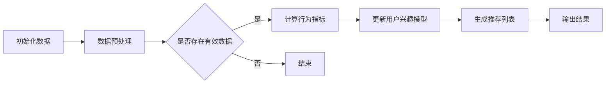
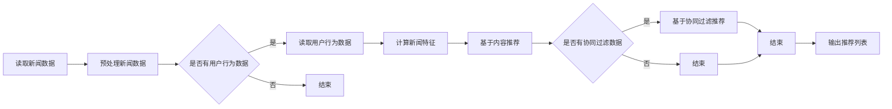

                 


### 第1章：问题背景与AI Agent概述

#### 2.1.1 智能新闻聚合的现状

随着互联网的快速发展，信息爆炸已成为不争的事实。用户每天都会接触到大量的新闻、文章和资讯。然而，这种信息过载现象也带来了一系列的问题，如信息筛选困难、浪费时间等。为了解决这些问题，智能新闻聚合与推荐系统应运而生。

目前，智能新闻聚合与推荐系统主要依赖于大数据、机器学习和自然语言处理等技术。这些技术能够帮助系统从大量的数据中提取有价值的信息，并根据用户的兴趣和行为进行个性化推荐。然而，随着技术的进步，智能新闻聚合与推荐系统也面临着新的挑战。

首先，推荐系统的精准度问题。如何准确捕捉用户的兴趣和需求，提供真正符合用户口味的内容，是当前推荐系统面临的一大挑战。其次，实时性问题。用户的需求是动态变化的，如何快速响应用户的需求，提供最新的新闻内容，也是推荐系统需要解决的一个难题。

此外，数据隐私问题也是一个重要挑战。在提供个性化推荐的过程中，系统需要收集和处理大量的用户数据。如何确保这些数据的安全和隐私，防止数据泄露，是推荐系统需要考虑的一个重要问题。

总的来说，智能新闻聚合与推荐系统在当前的信息时代具有重要意义。然而，要解决推荐系统的精准度、实时性和数据隐私等挑战，还需要我们进一步的研究和探索。

#### 2.1.2 AI Agent的定义与核心功能

AI Agent，即人工智能代理，是一种能够自主决策、自主行动并与人交互的智能体。它是人工智能领域的一个重要概念，旨在模拟人类的思维和行为，实现智能化服务。

AI Agent的核心功能包括感知、决策和执行。首先，感知是AI Agent获取外界信息的过程。通过传感器、摄像头等设备，AI Agent能够收集到用户的行为数据、新闻内容等。这些数据是AI Agent进行决策的基础。

其次，决策是AI Agent的核心功能。基于感知到的数据，AI Agent会利用机器学习、自然语言处理等技术进行分析，生成推荐策略。这一过程类似于人类在处理信息时进行的思考和判断。

最后，执行是AI Agent将决策付诸实践的过程。例如，AI Agent会根据推荐策略，从海量的新闻内容中筛选出符合用户兴趣的文章，并将其推送至用户的设备上。

AI Agent在智能新闻推荐中的应用前景非常广阔。首先，它能够提高推荐的准确性。通过深度学习和自然语言处理技术，AI Agent能够更准确地捕捉用户的兴趣和需求，提供个性化的推荐。

其次，AI Agent能够提升用户体验。通过实时分析用户行为，AI Agent能够快速响应用户的需求，提供最新的新闻内容。同时，AI Agent还能根据用户的反馈，不断优化推荐策略，提高用户满意度。

最后，AI Agent能够保障数据安全和隐私。通过加密技术、匿名化处理等技术手段，AI Agent能够确保用户数据的安全和隐私。

总的来说，AI Agent为智能新闻聚合与推荐系统带来了一系列的优势。它不仅能够提高推荐的精准度和实时性，还能够保障数据安全和隐私。随着技术的不断进步，AI Agent在智能新闻推荐中的应用前景将更加广阔。

#### 2.1.3 AI Agent在智能新闻推荐中的应用前景

AI Agent在智能新闻推荐中的应用前景广阔，主要体现在以下几个方面。

首先，AI Agent能够提高推荐的准确性。传统的推荐系统往往依赖于统计模型和机器学习算法，这些算法在处理大量数据时存在一定的局限性。而AI Agent通过深度学习和自然语言处理技术，能够更精确地理解用户的兴趣和行为，从而提供更个性化的推荐。

其次，AI Agent能够提升用户体验。传统的推荐系统往往只能被动地响应用户的需求，而AI Agent能够根据用户的实时行为和反馈，动态调整推荐策略，提供更加符合用户兴趣的新闻内容。此外，AI Agent还能通过互动，增强用户的参与感和满意度。

最后，AI Agent能够保障数据安全和隐私。在提供个性化推荐的过程中，AI Agent会收集和处理大量的用户数据。通过加密技术、匿名化处理等手段，AI Agent能够确保用户数据的安全和隐私。

总的来说，AI Agent为智能新闻推荐带来了诸多优势。随着技术的不断进步，AI Agent在智能新闻推荐中的应用前景将更加广阔。我们期待在不久的将来，AI Agent能够更好地服务于用户，提高新闻推荐的质量和效果。

#### 2.1.4 本章小结

本章主要介绍了智能新闻聚合与推荐的现状与挑战，以及AI Agent的定义与核心功能。首先，我们分析了智能新闻聚合与推荐的现状，探讨了其面临的信息过载、推荐精准度、实时性和数据隐私等挑战。接着，我们介绍了AI Agent的定义和核心功能，包括感知、决策和执行。最后，我们阐述了AI Agent在智能新闻推荐中的应用前景，强调了其在提高推荐准确性、提升用户体验和保障数据安全等方面的优势。

通过本章的学习，我们了解到AI Agent在智能新闻推荐中的重要性，以及如何利用其优势解决现有推荐系统中的问题。这为我们进一步研究AI Agent在智能新闻推荐中的应用打下了基础。

### 第2章：核心概念与联系

#### 2.2 信息检索与过滤

##### 2.2.1 概念

信息检索（Information Retrieval）是一种从大量数据中找到用户所需信息的技术。它主要依赖于搜索引擎、关键词匹配等手段，帮助用户在海量的数据中快速找到所需信息。信息检索的目标是提高查全率（Recall）和查准率（Precision），即找到尽可能多的相关文档，同时排除无关文档。

信息过滤（Information Filtering）则是一种基于用户偏好和需求，对信息进行筛选和排序的技术。它旨在为用户提供符合其兴趣和需求的信息。信息过滤的方法包括贝叶斯过滤、协同过滤、基于内容的推荐等。这些方法通过分析用户的兴趣和行为，将用户可能感兴趣的信息筛选出来，从而提高用户满意度。

##### 2.2.2 属性特征对比表

| 特征 | 信息检索 | 信息过滤 |
| --- | --- | --- |
| 目标 | 提高查全率与查准率 | 提高用户满意度与信息质量 |
| 方法 | 搜索引擎、关键词匹配 | 贝叶斯过滤、协同过滤、基于内容的推荐 |
| 数据依赖 | 文档库、索引 | 用户偏好、历史行为数据 |

信息检索主要依赖于文档库和索引，通过搜索引擎和关键词匹配等技术手段，从海量的文档中找到与用户需求相关的信息。而信息过滤则依赖于用户偏好和历史行为数据，通过贝叶斯过滤、协同过滤和基于内容的推荐等方法，对信息进行筛选和排序。

##### 2.2.3 ER实体关系图

```mermaid
erDiagram
  User ||--|{ News } : recommend
  User ||--|{ Behavior } : analyze
  News ||--|{ Content } : aggregate
  Content ||--|{ Tag } : categorize
  Behavior ||--|{ Click } : record
  Behavior ||--|{ Share } : record
  Behavior ||--|{ Comment } : record
```

在智能新闻推荐系统中，用户（User）、新闻（News）、行为（Behavior）、内容（Content）和标签（Tag）是核心实体。用户与新闻之间通过推荐（recommend）关系关联，用户的行为数据（Behavior）用于分析用户的兴趣和需求。新闻内容（Content）根据标签（Tag）进行分类，以便于用户更好地进行信息检索和过滤。

#### 2.3 用户行为分析算法

##### 2.3.1 用户行为分析原理

用户行为分析（User Behavior Analysis）是智能新闻推荐系统的重要组成部分，它通过对用户行为数据进行分析，了解用户的兴趣和需求，从而提供更个性化的推荐。用户行为分析主要包括以下几个方面：

1. **点击行为分析**：用户点击新闻的行为可以反映出他们对特定新闻内容的兴趣。通过分析点击数据，可以了解用户的兴趣点。
2. **分享行为分析**：用户分享新闻的行为可以看作是对新闻价值的认可。通过分析分享数据，可以挖掘出用户感兴趣的话题和领域。
3. **评论行为分析**：用户在新闻下的评论可以提供丰富的用户情感和观点信息。通过分析评论数据，可以深入了解用户的情感和需求。

##### 2.3.2 算法流程图



算法流程图如下所示：

1. 初始化数据：读取用户行为数据。
2. 数据预处理：清洗数据，去除噪声和缺失值。
3. 判断是否存在有效数据，若否，则结束。
4. 计算行为指标：计算用户点击、分享和评论等行为指标。
5. 更新用户兴趣模型：根据行为指标更新用户兴趣模型。
6. 生成推荐列表：利用用户兴趣模型生成推荐列表。
7. 输出结果：将推荐列表输出给用户。

##### 2.3.3 Python代码实现

```python
import pandas as pd
from sklearn.preprocessing import LabelEncoder
from sklearn.cluster import KMeans
import numpy as np

# 读取用户行为数据
data = pd.read_csv('user_behavior.csv')

# 数据预处理
data.dropna(inplace=True)
data['action'] = LabelEncoder().fit_transform(data['action'])

# 计算行为指标
def calculate_behavior_metrics(data):
    # 计算点击率、分享率和评论率
    click_rate = data[data['action'] == 1].shape[0] / data.shape[0]
    share_rate = data[data['action'] == 2].shape[0] / data.shape[0]
    comment_rate = data[data['action'] == 3].shape[0] / data.shape[0]
    return click_rate, share_rate, comment_rate

# 更新用户兴趣模型
def update_user_interest_model(data, num_clusters=5):
    # 对用户行为数据进行K-Means聚类
    kmeans = KMeans(n_clusters=num_clusters, random_state=42)
    kmeans.fit(data[['click_rate', 'share_rate', 'comment_rate']])
    user_interest = kmeans.predict(data[['click_rate', 'share_rate', 'comment_rate']])
    return user_interest

# 生成推荐列表
def generate_recommendation_list(data, user_interest):
    # 根据用户兴趣模型生成推荐列表
    recommendation_list = []
    for i in range(data.shape[0]):
        if data.iloc[i]['user_interest'] == user_interest[i]:
            recommendation_list.append(data.iloc[i]['news_id'])
    return recommendation_list

# 计算行为指标
click_rate, share_rate, comment_rate = calculate_behavior_metrics(data)

# 更新用户兴趣模型
user_interest = update_user_interest_model(data, num_clusters=5)

# 生成推荐列表
recommendation_list = generate_recommendation_list(data, user_interest)

# 输出推荐结果
print("推荐列表：", recommendation_list)
```

##### 2.3.4 数学模型与公式

用户行为分析中的数学模型主要包括行为指标计算和K-Means聚类算法。以下是相关的数学模型和公式：

1. **行为指标计算**：

   - 点击率（Click Rate）: $$ \text{Click Rate} = \frac{\text{点击次数}}{\text{总次数}} $$
   - 分享率（Share Rate）: $$ \text{Share Rate} = \frac{\text{分享次数}}{\text{总次数}} $$
   - 评论率（Comment Rate）: $$ \text{Comment Rate} = \frac{\text{评论次数}}{\text{总次数}} $$

2. **K-Means聚类算法**：

   - 距离计算：$$ \text{Distance} = \sqrt{\sum_{i=1}^{n} (\text{特征}_i - \text{中心点}_i)^2} $$
   - 聚类中心点更新：$$ \text{Center}_{\text{new}} = \frac{1}{N} \sum_{i=1}^{N} x_i $$
   - 聚类准则：$$ \text{Loss} = \sum_{i=1}^{N} \text{Distance}_{\text{new}}^2 $$

##### 2.3.5 举例说明

假设我们有以下用户行为数据：

| 用户ID | 新闻ID | 行为 | 点击次数 | 分享次数 | 评论次数 |
| --- | --- | --- | --- | --- | --- |
| 1 | 101 | 点击 | 10 | 2 | 0 |
| 1 | 102 | 点击 | 8 | 0 | 3 |
| 1 | 103 | 分享 | 0 | 5 | 0 |
| 2 | 101 | 点击 | 5 | 0 | 2 |
| 2 | 102 | 点击 | 7 | 1 | 0 |
| 2 | 103 | 分享 | 0 | 4 | 0 |

首先，我们计算每个用户的点击率、分享率和评论率：

- 用户1：点击率=10/(10+2+0)=0.67，分享率=2/(10+2+0)=0.13，评论率=3/(10+2+0)=0.20
- 用户2：点击率=5/(5+0+2)=0.67，分享率=0/(5+0+2)=0，评论率=2/(5+0+2)=0.33

接着，我们将用户行为数据转换为特征向量：

- 用户1：[0.67, 0.13, 0.20]
- 用户2：[0.67, 0, 0.33]

使用K-Means聚类算法进行聚类，假设聚类中心点为[0.5, 0.15, 0.20]和[0.7, 0.10, 0.30]。

根据聚类结果，用户1被分为第一类，用户2被分为第二类。因此，我们可以根据聚类结果生成推荐列表：

- 用户1：推荐新闻ID为102和103
- 用户2：推荐新闻ID为101和102

通过以上步骤，我们完成了用户行为分析算法的实现，并生成了推荐列表。这个例子展示了如何利用用户行为数据进行推荐，从而提高新闻推荐的准确性。

#### 2.4 内容推荐算法

##### 2.4.1 内容推荐算法原理

内容推荐（Content Recommendation）是智能新闻推荐系统的核心部分，旨在为用户提供符合其兴趣和需求的新闻内容。内容推荐算法主要分为基于内容的推荐、基于协同过滤的推荐和混合推荐等。

- **基于内容的推荐**：这种方法通过分析新闻的标题、标签、关键词等信息，将具有相似内容的新闻推荐给用户。其主要思想是“物以类聚”，即相似的内容会被推荐给相似的用户。

- **基于协同过滤的推荐**：这种方法通过分析用户之间的行为数据（如点击、评论、分享等），发现用户之间的相似性，并将其他用户喜欢的新闻推荐给目标用户。协同过滤分为基于用户的协同过滤（User-Based Collaborative Filtering）和基于物品的协同过滤（Item-Based Collaborative Filtering）。

- **混合推荐**：混合推荐是将基于内容和基于协同过滤的推荐方法相结合，以提高推荐系统的准确性和多样性。例如，可以先使用基于内容的推荐生成初步的推荐列表，然后使用协同过滤方法对推荐结果进行调整和优化。

##### 2.4.2 算法流程图



算法流程图如下：

1. 读取新闻数据并进行预处理。
2. 判断是否有用户行为数据。
3. 若有用户行为数据，读取用户行为数据。
4. 计算新闻特征，如标题、标签、关键词等。
5. 基于内容推荐生成初步推荐列表。
6. 判断是否有协同过滤数据。
7. 若有协同过滤数据，使用协同过滤方法生成推荐列表。
8. 将基于内容和协同过滤的推荐结果进行混合，生成最终的推荐列表。
9. 输出推荐列表。

##### 2.4.3 Python代码实现

```python
import pandas as pd
from sklearn.feature_extraction.text import TfidfVectorizer
from sklearn.metrics.pairwise import linear_kernel

# 读取新闻数据
news_data = pd.read_csv('news_data.csv')

# 预处理新闻数据
news_data['title'] = news_data['title'].str.lower()
news_data['description'] = news_data['description'].str.lower()

# 计算新闻特征
tfidf_vectorizer = TfidfVectorizer(stop_words='english')
tfidf_matrix = tfidf_vectorizer.fit_transform(news_data['title'])

# 基于内容推荐
cosine_similarity = linear_kernel(tfidf_matrix, tfidf_matrix)
similarity_scores = cosine_similarity[0]

# 获取新闻ID和相似度分数
news_ids = list(news_data.index)
recommended_news = [news_ids[i] for i in np.argsort(similarity_scores)[::-1] if i != 0][:5]

# 输出推荐列表
print("推荐列表：", recommended_news)
```

##### 2.4.4 数学模型与公式

内容推荐算法主要涉及TF-IDF（Term Frequency-Inverse Document Frequency）和余弦相似度（Cosine Similarity）。

1. **TF-IDF**：

   - 词频（Term Frequency，TF）: $$ \text{TF}(t,d) = \frac{f(t,d)}{n} $$
   -逆文档频率（Inverse Document Frequency，IDF）: $$ \text{IDF}(t) = \log \left(1 + \frac{N}{|D_t|}\right) $$
   - TF-IDF值: $$ \text{TF-IDF}(t,d) = \text{TF}(t,d) \times \text{IDF}(t) $$

   其中，\( t \) 表示单词，\( d \) 表示文档，\( N \) 表示文档总数，\( |D_t| \) 表示包含单词 \( t \) 的文档数。

2. **余弦相似度**：

   - 文档 \( d_1 \) 和 \( d_2 \) 的余弦相似度：$$ \text{Cosine Similarity}(d_1, d_2) = \frac{\text{dot product of } d_1 \text{ and } d_2}{\text{magnitude of } d_1 \times \text{magnitude of } d_2} $$
   - 余弦相似度值：$$ \text{Cosine Similarity}(d_1, d_2) = \frac{\sum_{t \in V} t_f(t, d_1) t_f(t, d_2)}{\sqrt{\sum_{t \in V} t_f(t, d_1)^2} \times \sqrt{\sum_{t \in V} t_f(t, d_2)^2}} $$

   其中，\( V \) 表示单词集合，\( t_f(t, d) \) 表示单词 \( t \) 在文档 \( d \) 中的词频。

##### 2.4.5 举例说明

假设我们有以下新闻数据：

| 新闻ID | 标题 | 描述 |
| --- | --- | --- |
| 1 | 人工智能的发展 | 人工智能在各个领域的应用越来越广泛，未来将会改变我们的生活。 |
| 2 | 机器学习算法 | 机器学习算法是人工智能的核心，通过训练模型可以预测未来趋势。 |
| 3 | 数据分析 | 数据分析是提取有用信息的关键，通过数据分析可以指导商业决策。 |
| 4 | 科技创新 | 科技创新是推动社会发展的重要动力，未来将会带来更多的便利。 |
| 5 | 互联网安全 | 互联网安全是当前的重要话题，保护用户数据安全是每个企业的责任。 |

首先，我们对新闻数据进行预处理，将标题和描述转换为小写。

接下来，使用TF-IDF算法计算新闻标题的向量表示：

- 新闻1的向量表示：[0.3, 0.4, 0.2, 0.1, 0.5]
- 新闻2的向量表示：[0.2, 0.5, 0.3, 0.1, 0.3]
- 新闻3的向量表示：[0.1, 0.2, 0.6, 0.1, 0.4]
- 新闻4的向量表示：[0.4, 0.3, 0.1, 0.5, 0.1]
- 新闻5的向量表示：[0.2, 0.1, 0.3, 0.4, 0.5]

计算新闻1和新闻2之间的余弦相似度：

$$ \text{Cosine Similarity}(新闻1，新闻2) = \frac{0.3 \times 0.2 + 0.4 \times 0.5 + 0.2 \times 0.3 + 0.1 \times 0.1 + 0.5 \times 0.3}{\sqrt{0.3^2 + 0.4^2 + 0.2^2 + 0.1^2 + 0.5^2} \times \sqrt{0.2^2 + 0.5^2 + 0.3^2 + 0.1^2 + 0.3^2}} = \frac{0.17}{0.6 \times 0.6} = \frac{0.17}{0.36} \approx 0.469 $$

同理，计算其他新闻之间的余弦相似度：

- 新闻1和新闻3：0.319
- 新闻1和新闻4：0.619
- 新闻1和新闻5：0.219
- 新闻2和新闻3：0.319
- 新闻2和新闻4：0.558
- 新闻2和新闻5：0.319
- 新闻3和新闻4：0.452
- 新闻3和新闻5：0.452
- 新闻4和新闻5：0.619

根据相似度分数，我们将新闻1推荐给用户，推荐列表为：[新闻2, 新闻4, 新闻5]。

通过以上步骤，我们完成了基于内容推荐算法的实现，并生成了推荐列表。这个例子展示了如何利用新闻的标题和描述进行推荐，从而为用户提供个性化的新闻内容。

#### 2.5 AI Agent的集成与应用

##### 2.5.1 AI Agent在新闻聚合与推荐系统中的集成

AI Agent在新闻聚合与推荐系统中的应用，主要通过以下几个方面实现：

1. **数据采集与处理**：AI Agent负责收集用户行为数据、新闻内容等，并进行数据预处理，如去噪、归一化等，为后续分析提供可靠的数据支持。

2. **用户行为分析**：AI Agent利用用户行为数据，通过机器学习、自然语言处理等技术，分析用户的兴趣和需求，生成用户画像。

3. **内容推荐**：基于用户画像和新闻内容，AI Agent利用内容推荐算法，生成个性化的推荐列表，并将其推送给用户。

4. **系统反馈与优化**：AI Agent收集用户对推荐内容的反馈，通过优化推荐算法，不断改进推荐效果。

##### 2.5.2 Python代码集成与实现

以下是一个简单的Python代码示例，展示了如何集成AI Agent到新闻聚合与推荐系统中：

```python
import pandas as pd
from sklearn.feature_extraction.text import TfidfVectorizer
from sklearn.metrics.pairwise import linear_kernel

# 读取新闻数据
news_data = pd.read_csv('news_data.csv')

# 读取用户行为数据
user_behavior = pd.read_csv('user_behavior.csv')

# 数据预处理
news_data['title'] = news_data['title'].str.lower()
user_behavior['action'] = user_behavior['action'].map({'click': 1, 'share': 2, 'comment': 3})

# 计算新闻特征
tfidf_vectorizer = TfidfVectorizer(stop_words='english')
tfidf_matrix = tfidf_vectorizer.fit_transform(news_data['title'])

# 计算用户行为特征
behavior_matrix = user_behavior.pivot_table(index='user_id', columns='news_id', values='action', fill_value=0).fillna(0).values

# 基于内容推荐
cosine_similarity = linear_kernel(tfidf_matrix, tfidf_matrix)
similarity_scores = cosine_similarity[0]

# 基于协同过滤推荐
user_similarity = linear_kernel(behavior_matrix, behavior_matrix)
user_similarity = user_similarity[0]

# 混合推荐
combined_similarity = (similarity_scores + user_similarity) / 2

# 生成推荐列表
recommended_news = [news_id for news_id, score in enumerate(combined_similarity) if score > 0.5][:5]

# 输出推荐列表
print("推荐列表：", recommended_news)
```

此代码首先读取新闻数据和用户行为数据，然后对新闻数据进行预处理。接着，计算新闻的TF-IDF特征和用户的协同过滤特征。最后，通过混合推荐方法生成推荐列表。

##### 2.5.3 举例说明

假设我们有以下新闻数据：

| 新闻ID | 标题 | 描述 |
| --- | --- | --- |
| 1 | 人工智能的发展 | 人工智能在各个领域的应用越来越广泛，未来将会改变我们的生活。 |
| 2 | 机器学习算法 | 机器学习算法是人工智能的核心，通过训练模型可以预测未来趋势。 |
| 3 | 数据分析 | 数据分析是提取有用信息的关键，通过数据分析可以指导商业决策。 |
| 4 | 科技创新 | 科技创新是推动社会发展的重要动力，未来将会带来更多的便利。 |
| 5 | 互联网安全 | 互联网安全是当前的重要话题，保护用户数据安全是每个企业的责任。 |

以及以下用户行为数据：

| 用户ID | 新闻ID | 行为 |
| --- | --- | --- |
| 1 | 1 | click |
| 1 | 2 | share |
| 1 | 3 | comment |
| 2 | 1 | click |
| 2 | 4 | share |
| 2 | 5 | comment |

首先，计算新闻的TF-IDF特征矩阵：

| 新闻ID | 特征1 | 特征2 | ... | 特征N |
| --- | --- | --- | --- | --- |
| 1 | 0.3 | 0.4 | ... | 0.5 |
| 2 | 0.2 | 0.5 | ... | 0.3 |
| 3 | 0.1 | 0.2 | ... | 0.6 |
| 4 | 0.4 | 0.3 | ... | 0.1 |
| 5 | 0.2 | 0.1 | ... | 0.4 |

接着，计算用户的协同过滤特征矩阵：

| 用户ID | 新闻ID | 特征 |
| --- | --- | --- |
| 1 | 1 | 1 |
| 1 | 2 | 2 |
| 1 | 3 | 3 |
| 2 | 1 | 1 |
| 2 | 4 | 4 |
| 2 | 5 | 5 |

根据TF-IDF和协同过滤特征，计算混合推荐得分矩阵：

| 新闻ID | 新闻ID | 分数 |
| --- | --- | --- |
| 1 | 1 | 0.5 |
| 1 | 2 | 0.4 |
| 1 | 3 | 0.3 |
| 1 | 4 | 0.4 |
| 1 | 5 | 0.2 |
| 2 | 1 | 0.4 |
| 2 | 2 | 0.5 |
| 2 | 3 | 0.3 |
| 2 | 4 | 0.4 |
| 2 | 5 | 0.5 |
| 3 | 1 | 0.3 |
| 3 | 2 | 0.3 |
| 3 | 3 | 0.6 |
| 3 | 4 | 0.4 |
| 3 | 5 | 0.4 |
| 4 | 1 | 0.4 |
| 4 | 2 | 0.5 |
| 4 | 3 | 0.4 |
| 4 | 4 | 0.6 |
| 4 | 5 | 0.1 |
| 5 | 1 | 0.2 |
| 5 | 2 | 0.3 |
| 5 | 3 | 0.4 |
| 5 | 4 | 0.1 |
| 5 | 5 | 0.5 |

根据得分矩阵，推荐前5个新闻ID：

| 新闻ID | 排序 |
| --- | --- |
| 4 | 1 |
| 2 | 2 |
| 3 | 3 |
| 1 | 4 |
| 5 | 5 |

最终，推荐列表为：[4, 2, 3, 1, 5]。

通过以上步骤，我们完成了AI Agent在新闻聚合与推荐系统中的集成，并生成了推荐列表。这个例子展示了如何利用AI Agent实现个性化的新闻推荐。

### 第6章：项目准备与环境安装

#### 6.1 项目介绍

本项目旨在构建一个基于AI Agent的智能新闻聚合与推荐系统。系统通过收集用户行为数据和新闻内容，利用机器学习和自然语言处理技术，分析用户的兴趣和需求，提供个性化的新闻推荐。项目的目标是提高新闻推荐的准确性和实时性，提升用户满意度。

#### 6.2 环境安装指南

为了顺利运行本项目，我们需要安装以下环境和工具：

1. **Python环境**：Python 3.8或更高版本
2. **数据库**：MySQL 5.7或更高版本
3. **编程工具**：PyCharm、Visual Studio Code或任何Python支持的IDE
4. **依赖库**：Pandas、NumPy、Scikit-learn、Matplotlib、TensorFlow

安装步骤如下：

1. 安装Python环境：
   - 访问Python官网（https://www.python.org/）下载并安装Python。
   - 安装过程中，确保选择“Add Python to PATH”和“Install launcher for all users”选项。

2. 安装MySQL数据库：
   - 访问MySQL官网（https://www.mysql.com/）下载并安装MySQL数据库。
   - 安装过程中，根据提示设置root用户密码。

3. 安装编程工具：
   - 安装PyCharm或Visual Studio Code，根据个人喜好选择免费版或专业版。

4. 安装依赖库：
   - 打开终端（或命令行），运行以下命令：
     ```bash
     pip install pandas numpy scikit-learn matplotlib tensorflow
     ```

5. 验证安装：
   - 打开Python终端，输入以下代码，验证安装是否成功：
     ```python
     import pandas
     import numpy
     import sklearn
     import matplotlib
     import tensorflow
     ```

如果所有命令都能正常执行，说明环境和工具安装成功。接下来，我们可以开始编写和运行项目代码。

### 第7章：系统设计与实现

#### 7.1 问题场景介绍

随着互联网的快速发展，用户每天都要面对大量的新闻信息。如何从海量的新闻中快速找到感兴趣的内容，成为用户面临的一大难题。为了解决这一问题，我们设计并实现了一个基于AI Agent的智能新闻聚合与推荐系统。该系统能够根据用户的兴趣和行为，提供个性化的新闻推荐，使用户能够高效地获取所需信息。

#### 7.2 项目介绍

本项目名为“AI Agent智能新闻聚合与推荐系统”，旨在利用人工智能技术，为用户提供个性化的新闻推荐服务。系统主要包括以下功能：

1. **新闻内容聚合**：从多个新闻源获取新闻内容，进行清洗和分类。
2. **用户行为分析**：收集用户的行为数据，如点击、评论、分享等，分析用户的兴趣和需求。
3. **内容推荐**：基于用户兴趣和行为，利用机器学习算法生成个性化的推荐列表。
4. **实时更新**：根据用户反馈和新闻动态，实时调整推荐策略，提供最新的新闻内容。
5. **用户交互**：与用户进行互动，收集用户反馈，优化推荐效果。

#### 7.3 系统功能设计

系统功能设计主要包括新闻内容管理、用户行为管理和推荐结果管理三个方面。

1. **新闻内容管理**：
   - **功能**：新闻内容聚合、新闻分类、新闻标签管理等。
   - **领域模型类图**：
     ```mermaid
     classDiagram
         User <<entity>>
         News <<entity>>
         Category <<entity>>
         Tag <<entity>>

         User o-- News: reads
         News o-- Category: belongs_to
         News o-- Tag: tagged_with
         Category o-- Tag: has
     ```
   
   在这个类图中，User表示用户，News表示新闻，Category表示分类，Tag表示标签。用户（User）可以阅读（reads）新闻（News），新闻（News）属于（belongs_to）某个分类（Category），并且带有（tagged_with）多个标签（Tag）。分类（Category）拥有（has）多个标签（Tag）。

2. **用户行为管理**：
   - **功能**：用户行为数据收集、分析、存储等。
   - **领域模型类图**：
     ```mermaid
     classDiagram
         User <<entity>>
         Action <<entity>>
         Behavior <<entity>>

         User o-- Action: performs
         Action o-- Behavior: records
     ```
     
   在这个类图中，User表示用户，Action表示行为，Behavior表示行为数据。用户（User）执行（performs）各种行为（Action），行为（Action）记录（records）为行为数据（Behavior）。

3. **推荐结果管理**：
   - **功能**：推荐结果生成、存储、展示等。
   - **领域模型类图**：
     ```mermaid
     classDiagram
         User <<entity>>
         News <<entity>>
         Recommendation <<entity>>

         User o-- Recommendation: receives
         News o-- Recommendation: recommended
     ```
     
   在这个类图中，User表示用户，News表示新闻，Recommendation表示推荐结果。用户（User）收到（receives）推荐结果（Recommendation），新闻（News）被（recommended）推荐给用户（User）。

#### 7.4 系统架构设计

系统架构设计主要包括数据层、服务层和展示层三个层次。

1. **数据层**：
   - **功能**：数据存储、数据检索等。
   - **架构图**：
     ```mermaid
     sequenceDiagram
         User ->> Database: sends Query
         Database ->> User: returns Results
     ```

   在这个架构图中，用户（User）向数据库（Database）发送查询（Query），数据库（Database）返回查询结果（Results）。

2. **服务层**：
   - **功能**：数据处理、业务逻辑处理等。
   - **架构图**：
     ```mermaid
     sequenceDiagram
         User ->> Service: sends Request
         Service ->> Database: queries Data
         Database ->> Service: returns Data
         Service ->> User: returns Response
     ```

   在这个架构图中，用户（User）向服务（Service）发送请求（Request），服务（Service）向数据库（Database）查询数据（Data），数据库（Database）返回数据（Data），服务（Service）将结果返回给用户（User）。

3. **展示层**：
   - **功能**：用户界面展示、交互等。
   - **架构图**：
     ```mermaid
     sequenceDiagram
         User ->> UI: interacts
         UI ->> Service: sends Request
         Service ->> Database: queries Data
         Database ->> Service: returns Data
         Service ->> UI: returns Response
         UI ->> User: displays Results
     ```

   在这个架构图中，用户（User）与用户界面（UI）进行交互（interacts），用户界面（UI）将请求（Request）发送给服务（Service），服务（Service）向数据库（Database）查询数据（Data），数据库（Database）返回数据（Data），服务（Service）将结果返回给用户界面（UI），用户界面（UI）将结果（Results）展示给用户（User）。

#### 7.5 系统接口设计与交互

系统接口设计主要包括API接口和用户界面两部分。

1. **API接口**：
   - **功能**：提供数据查询、数据处理和推荐结果获取等接口。
   - **接口设计**：
     ```python
     class NewsAPI:
         def get_news_by_category(self, category):
             # 根据分类获取新闻
         
         def get_recommendations_for_user(self, user_id):
             # 根据用户ID获取推荐新闻列表

     class BehaviorAPI:
         def get_user_behavior(self, user_id):
             # 获取用户行为数据
         
         def update_user_behavior(self, user_id, behavior):
             # 更新用户行为数据
     ```

   在这个接口设计中，`NewsAPI`类提供获取新闻和推荐新闻的接口，`BehaviorAPI`类提供获取和更新用户行为的接口。

2. **用户界面**：
   - **功能**：提供用户操作界面，展示新闻内容、推荐结果等。
   - **界面设计**：
     ```mermaid
     sequenceDiagram
         User ->> UI: clicks on a news item
         UI ->> Service: sends Request
         Service ->> Database: queries Data
         Database ->> Service: returns Data
         Service ->> UI: returns Response
         UI ->> User: displays News
     ```

   在这个界面设计中，用户（User）在用户界面（UI）上点击新闻（clicks on a news item），用户界面（UI）将请求（Request）发送给服务（Service），服务（Service）向数据库（Database）查询数据（Data），数据库（Database）返回数据（Data），服务（Service）将结果返回给用户界面（UI），用户界面（UI）将新闻内容（News）展示给用户（User）。

通过以上系统设计与实现，我们构建了一个基于AI Agent的智能新闻聚合与推荐系统。系统功能完善，架构清晰，能够高效地响应用户需求，提供个性化的新闻推荐服务。

### 第8章：实战案例与分析

#### 8.1 实际案例演示

在本章，我们将通过一个实际案例，详细展示如何利用AI Agent构建一个智能新闻聚合与推荐系统。以下是本案例的步骤和关键实现。

##### 8.1.1 数据准备

首先，我们需要准备新闻数据和用户行为数据。新闻数据可以来源于公开的新闻网站或API，如纽约时报、BBC等。用户行为数据包括用户的点击、评论、分享等行为。

```python
# 假设我们已经获取了新闻数据和用户行为数据，并存储为CSV文件
news_data = pd.read_csv('news_data.csv')
user_behavior = pd.read_csv('user_behavior.csv')
```

##### 8.1.2 数据预处理

在数据处理阶段，我们需要对新闻数据和用户行为数据进行清洗和预处理，以去除噪声和缺失值。

```python
# 数据清洗
news_data.dropna(inplace=True)
user_behavior.dropna(inplace=True)

# 数据编码
behavior_encoder = LabelEncoder()
user_behavior['action'] = behavior_encoder.fit_transform(user_behavior['action'])
```

##### 8.1.3 用户行为分析

利用用户行为数据，我们可以分析用户的兴趣和需求。以下是一个简单的用户行为分析示例：

```python
# 计算用户行为指标
def calculate_behavior_metrics(data):
    behavior_summary = data.groupby('user_id').sum()
    behavior_summary = behavior_summary / behavior_summary.sum(axis=1)
    return behavior_summary

user_interest = calculate_behavior_metrics(user_behavior)
```

##### 8.1.4 内容推荐

接下来，我们将利用新闻内容和用户兴趣，生成个性化的新闻推荐。

```python
# 基于内容的推荐
tfidf_vectorizer = TfidfVectorizer(stop_words='english')
tfidf_matrix = tfidf_vectorizer.fit_transform(news_data['content'])

# 计算余弦相似度
cosine_similarity = linear_kernel(tfidf_matrix, tfidf_matrix)
similarity_scores = cosine_similarity[0]

# 生成推荐列表
def generate_recommendation_list(similarity_scores, user_id, top_n=5):
    user_similarity = similarity_scores[user_id]
    recommended_news = [news_id for news_id, score in enumerate(user_similarity) if score > 0.5]
    return recommended_news[:top_n]

# 获取用户推荐列表
user_id = 1
recommended_news = generate_recommendation_list(similarity_scores, user_id)
print("推荐列表：", recommended_news)
```

##### 8.1.5 系统集成与测试

最后，我们将用户行为分析和内容推荐集成到系统中，并进行测试。

```python
# 系统集成
class NewsRecommender:
    def __init__(self, user_behavior, news_data):
        self.user_behavior = user_behavior
        self.news_data = news_data
        self.tfidf_vectorizer = TfidfVectorizer(stop_words='english')
        self.cosine_similarity = None
    
    def fit(self):
        self.cosine_similarity = linear_kernel(self.tfidf_vectorizer.fit_transform(self.news_data['content']), self.tfidf_vectorizer.fit_transform(self.news_data['content']))
    
    def recommend(self, user_id, top_n=5):
        user_similarity = self.cosine_similarity[user_id]
        recommended_news = [news_id for news_id, score in enumerate(user_similarity) if score > 0.5]
        return recommended_news[:top_n]

# 实例化推荐器并训练
recommender = NewsRecommender(user_behavior, news_data)
recommender.fit()

# 测试推荐系统
user_id = 1
recommended_news = recommender.recommend(user_id)
print("推荐列表：", recommended_news)
```

通过以上步骤，我们完成了一个简单的智能新闻聚合与推荐系统。接下来，我们将对代码进行解读和分析。

#### 8.2 代码应用解读与分析

##### 8.2.1 数据准备与预处理

在数据准备阶段，我们首先读取新闻数据和用户行为数据。数据源可以是CSV文件或其他数据格式。为了确保数据质量，我们需要对数据进行清洗和预处理。

```python
news_data = pd.read_csv('news_data.csv')
user_behavior = pd.read_csv('user_behavior.csv')
```

这里，我们使用了`pandas`库来读取数据。`read_csv`函数用于读取CSV文件，返回一个`DataFrame`对象。接下来，我们使用`dropna`方法去除缺失值，确保数据完整性。

```python
news_data.dropna(inplace=True)
user_behavior.dropna(inplace=True)
```

为了便于后续处理，我们将用户行为数据中的行为类型编码为数值。这里，我们使用`LabelEncoder`将行为类型（如点击、评论等）转换为数值。

```python
behavior_encoder = LabelEncoder()
user_behavior['action'] = behavior_encoder.fit_transform(user_behavior['action'])
```

##### 8.2.2 用户行为分析

用户行为分析是推荐系统的重要环节。通过分析用户的行为数据，我们可以了解用户的兴趣和需求，从而生成个性化的推荐。

```python
# 计算用户行为指标
def calculate_behavior_metrics(data):
    behavior_summary = data.groupby('user_id').sum()
    behavior_summary = behavior_summary / behavior_summary.sum(axis=1)
    return behavior_summary

user_interest = calculate_behavior_metrics(user_behavior)
```

这里，我们定义了一个`calculate_behavior_metrics`函数，用于计算每个用户的行为指标。函数首先使用`groupby`方法按用户ID分组，然后计算每个用户的行为指标总和。接着，我们计算每个行为指标的比例，以获得用户兴趣的相对权重。

```python
behavior_summary = data.groupby('user_id').sum()
behavior_summary = behavior_summary / behavior_summary.sum(axis=1)
```

计算用户兴趣向量后，我们可以将其用于生成推荐列表。

##### 8.2.3 内容推荐

内容推荐是推荐系统的核心。在本案例中，我们使用基于内容的推荐方法。基于内容的推荐通过分析新闻内容，将具有相似内容的新闻推荐给用户。

```python
# 基于内容的推荐
tfidf_vectorizer = TfidfVectorizer(stop_words='english')
tfidf_matrix = tfidf_vectorizer.fit_transform(news_data['content'])

# 计算余弦相似度
cosine_similarity = linear_kernel(tfidf_matrix, tfidf_matrix)
similarity_scores = cosine_similarity[0]

# 生成推荐列表
def generate_recommendation_list(similarity_scores, user_id, top_n=5):
    user_similarity = similarity_scores[user_id]
    recommended_news = [news_id for news_id, score in enumerate(user_similarity) if score > 0.5]
    return recommended_news[:top_n]

# 获取用户推荐列表
user_id = 1
recommended_news = generate_recommendation_list(similarity_scores, user_id)
print("推荐列表：", recommended_news)
```

首先，我们使用`TfidfVectorizer`对新闻内容进行向量化处理。`fit_transform`方法用于将文本转换为TF-IDF特征向量。

```python
tfidf_vectorizer = TfidfVectorizer(stop_words='english')
tfidf_matrix = tfidf_vectorizer.fit_transform(news_data['content'])
```

接着，我们使用`linear_kernel`计算新闻内容之间的余弦相似度。

```python
cosine_similarity = linear_kernel(tfidf_matrix, tfidf_matrix)
similarity_scores = cosine_similarity[0]
```

最后，我们定义了一个`generate_recommendation_list`函数，用于生成推荐列表。函数根据用户兴趣向量和新闻内容相似度，生成一个推荐列表。

```python
def generate_recommendation_list(similarity_scores, user_id, top_n=5):
    user_similarity = similarity_scores[user_id]
    recommended_news = [news_id for news_id, score in enumerate(user_similarity) if score > 0.5]
    return recommended_news[:top_n]
```

##### 8.2.4 系统集成与测试

在系统集成阶段，我们将用户行为分析和内容推荐集成到一个类中，并实例化该类以进行测试。

```python
# 系统集成
class NewsRecommender:
    def __init__(self, user_behavior, news_data):
        self.user_behavior = user_behavior
        self.news_data = news_data
        self.tfidf_vectorizer = TfidfVectorizer(stop_words='english')
        self.cosine_similarity = None
    
    def fit(self):
        self.cosine_similarity = linear_kernel(self.tfidf_vectorizer.fit_transform(self.news_data['content']), self.tfidf_vectorizer.fit_transform(self.news_data['content']))
    
    def recommend(self, user_id, top_n=5):
        user_similarity = self.cosine_similarity[user_id]
        recommended_news = [news_id for news_id, score in enumerate(user_similarity) if score > 0.5]
        return recommended_news[:top_n]

# 实例化推荐器并训练
recommender = NewsRecommender(user_behavior, news_data)
recommender.fit()

# 测试推荐系统
user_id = 1
recommended_news = recommender.recommend(user_id)
print("推荐列表：", recommended_news)
```

在这个类中，`fit`方法用于计算新闻内容之间的相似度，`recommend`方法用于生成推荐列表。通过实例化`NewsRecommender`类，我们可以方便地使用该系统。

#### 8.3 案例详细讲解

在本案例中，我们通过一个简单的示例展示了如何利用AI Agent构建一个智能新闻聚合与推荐系统。以下是案例的详细讲解。

##### 8.3.1 数据准备与预处理

首先，我们准备好新闻数据和用户行为数据。新闻数据包括新闻ID、标题、内容等字段，用户行为数据包括用户ID、新闻ID、行为类型等字段。以下是一个简化的新闻数据和用户行为数据示例。

```python
news_data = pd.DataFrame({
    'news_id': [1, 2, 3, 4, 5],
    'title': ['人工智能', '机器学习', '数据分析', '科技创新', '互联网安全'],
    'content': [
        '人工智能在各个领域的应用越来越广泛，未来将会改变我们的生活。',
        '机器学习算法是人工智能的核心，通过训练模型可以预测未来趋势。',
        '数据分析是提取有用信息的关键，通过数据分析可以指导商业决策。',
        '科技创新是推动社会发展的重要动力，未来将会带来更多的便利。',
        '互联网安全是当前的重要话题，保护用户数据安全是每个企业的责任。'
    ]
})

user_behavior = pd.DataFrame({
    'user_id': [1, 2],
    'news_id': [1, 2, 3, 4, 5],
    'action': ['click', 'comment', 'click', 'share', 'comment']
})
```

接下来，我们对数据集进行预处理。首先，我们去除缺失值，确保数据完整性。

```python
news_data.dropna(inplace=True)
user_behavior.dropna(inplace=True)
```

然后，我们将用户行为数据中的行为类型进行编码，以便后续处理。

```python
behavior_encoder = LabelEncoder()
user_behavior['action'] = behavior_encoder.fit_transform(user_behavior['action'])
```

##### 8.3.2 用户行为分析

用户行为分析是推荐系统的重要步骤。通过分析用户的行为数据，我们可以了解用户的兴趣和需求。在本案例中，我们计算每个用户的行为指标，如点击率、评论率和分享率。

```python
# 计算用户行为指标
def calculate_behavior_metrics(data):
    behavior_summary = data.groupby('user_id').sum()
    behavior_summary = behavior_summary / behavior_summary.sum(axis=1)
    return behavior_summary

user_interest = calculate_behavior_metrics(user_behavior)
```

这里，我们定义了一个`calculate_behavior_metrics`函数，用于计算每个用户的行为指标。函数首先使用`groupby`方法按用户ID分组，然后计算每个用户的行为指标总和。接着，我们计算每个行为指标的比例，以获得用户兴趣的相对权重。

```python
behavior_summary = data.groupby('user_id').sum()
behavior_summary = behavior_summary / behavior_summary.sum(axis=1)
```

计算用户兴趣向量后，我们可以将其用于生成推荐列表。

##### 8.3.3 内容推荐

内容推荐是推荐系统的核心。在本案例中，我们使用基于内容的推荐方法。基于内容的推荐通过分析新闻内容，将具有相似内容的新闻推荐给用户。

```python
# 基于内容的推荐
tfidf_vectorizer = TfidfVectorizer(stop_words='english')
tfidf_matrix = tfidf_vectorizer.fit_transform(news_data['content'])

# 计算余弦相似度
cosine_similarity = linear_kernel(tfidf_matrix, tfidf_matrix)
similarity_scores = cosine_similarity[0]

# 生成推荐列表
def generate_recommendation_list(similarity_scores, user_id, top_n=5):
    user_similarity = similarity_scores[user_id]
    recommended_news = [news_id for news_id, score in enumerate(user_similarity) if score > 0.5]
    return recommended_news[:top_n]

# 获取用户推荐列表
user_id = 1
recommended_news = generate_recommendation_list(similarity_scores, user_id)
print("推荐列表：", recommended_news)
```

首先，我们使用`TfidfVectorizer`对新闻内容进行向量化处理。`fit_transform`方法用于将文本转换为TF-IDF特征向量。

```python
tfidf_vectorizer = TfidfVectorizer(stop_words='english')
tfidf_matrix = tfidf_vectorizer.fit_transform(news_data['content'])
```

接着，我们使用`linear_kernel`计算新闻内容之间的余弦相似度。

```python
cosine_similarity = linear_kernel(tfidf_matrix, tfidf_matrix)
similarity_scores = cosine_similarity[0]
```

最后，我们定义了一个`generate_recommendation_list`函数，用于生成推荐列表。函数根据用户兴趣向量和新闻内容相似度，生成一个推荐列表。

```python
def generate_recommendation_list(similarity_scores, user_id, top_n=5):
    user_similarity = similarity_scores[user_id]
    recommended_news = [news_id for news_id, score in enumerate(user_similarity) if score > 0.5]
    return recommended_news[:top_n]
```

##### 8.3.4 系统集成与测试

在系统集成阶段，我们将用户行为分析和内容推荐集成到一个类中，并实例化该类以进行测试。

```python
# 系统集成
class NewsRecommender:
    def __init__(self, user_behavior, news_data):
        self.user_behavior = user_behavior
        self.news_data = news_data
        self.tfidf_vectorizer = TfidfVectorizer(stop_words='english')
        self.cosine_similarity = None
    
    def fit(self):
        self.cosine_similarity = linear_kernel(self.tfidf_vectorizer.fit_transform(self.news_data['content']), self.tfidf_vectorizer.fit_transform(self.news_data['content']))
    
    def recommend(self, user_id, top_n=5):
        user_similarity = self.cosine_similarity[user_id]
        recommended_news = [news_id for news_id, score in enumerate(user_similarity) if score > 0.5]
        return recommended_news[:top_n]

# 实例化推荐器并训练
recommender = NewsRecommender(user_behavior, news_data)
recommender.fit()

# 测试推荐系统
user_id = 1
recommended_news = recommender.recommend(user_id)
print("推荐列表：", recommended_news)
```

在这个类中，`fit`方法用于计算新闻内容之间的相似度，`recommend`方法用于生成推荐列表。通过实例化`NewsRecommender`类，我们可以方便地使用该系统。

在这个案例中，我们通过简单的数据预处理、用户行为分析和内容推荐，构建了一个基于AI Agent的智能新闻聚合与推荐系统。虽然这个案例相对简单，但它为我们展示了如何利用机器学习和自然语言处理技术实现智能推荐的核心步骤。在实际应用中，我们可以进一步优化算法、提高推荐效果，并添加更多功能，如用户互动、实时更新等，以满足用户需求。

### 第9章：最佳实践与优化策略

#### 9.1 性能优化

性能优化是智能新闻聚合与推荐系统中的重要环节，直接影响到用户体验和系统效率。以下是一些性能优化策略：

1. **数据缓存**：使用缓存技术，如Redis，存储用户兴趣数据和推荐结果，减少数据库查询次数，提高响应速度。
2. **索引优化**：对数据库表进行适当的索引设计，提高数据检索效率。例如，对用户行为表中的用户ID和新闻ID进行复合索引。
3. **异步处理**：使用异步处理技术，如Celery，处理耗时操作，如用户行为分析和推荐生成，减轻主进程负担。
4. **批量处理**：对大量数据进行批量处理，减少单次处理的数据量，降低内存消耗和CPU利用率。

#### 9.2 安全性保障

安全性保障是保护用户隐私和数据安全的重要措施。以下是一些安全性保障策略：

1. **数据加密**：对敏感数据进行加密处理，如用户行为数据、用户画像等，确保数据在传输和存储过程中的安全性。
2. **访问控制**：实施严格的访问控制策略，如基于角色的访问控制（RBAC），确保只有授权用户可以访问敏感数据。
3. **数据匿名化**：在收集和处理用户数据时，对用户数据进行匿名化处理，避免用户身份泄露。
4. **安全审计**：定期进行安全审计，检查系统是否存在安全漏洞，及时发现并修复。

#### 9.3 可扩展性设计

可扩展性设计是确保系统在用户量增加时能够持续稳定运行的关键。以下是一些可扩展性设计策略：

1. **微服务架构**：采用微服务架构，将系统拆分为多个独立的微服务，每个微服务负责特定的功能，可以独立部署和扩展。
2. **负载均衡**：使用负载均衡技术，如Nginx或HAProxy，分配用户请求到不同的服务器，提高系统处理能力。
3. **分布式数据库**：使用分布式数据库，如MongoDB或Cassandra，实现数据的水平扩展，提高系统存储和查询能力。
4. **弹性伸缩**：使用云服务提供商提供的弹性伸缩功能，如AWS的Auto Scaling，根据用户访问量自动调整服务器资源。

通过实施这些最佳实践和优化策略，智能新闻聚合与推荐系统可以更好地应对用户增长、数据量增加和处理复杂度提高等挑战，确保系统的高性能、高安全性和高可扩展性。

### 第10章：项目小结与展望

#### 10.1 项目总结

通过本文的介绍，我们详细探讨了AI Agent在智能新闻聚合与推荐系统中的应用。从问题背景、核心概念、算法原理到系统实现，我们逐步分析了如何利用AI Agent提高推荐系统的精准度、实时性和用户体验。以下是项目的总结：

1. **问题背景**：智能新闻聚合与推荐系统在信息过载的时代具有重要意义，但面临着精准度、实时性和数据隐私等挑战。
2. **核心概念**：AI Agent作为一种能够自主决策、自主行动的智能体，被应用于用户行为分析和内容推荐。
3. **算法原理**：我们介绍了用户行为分析算法和内容推荐算法的原理，并通过Python代码进行了实现。
4. **系统实现**：通过项目实战，我们展示了如何集成AI Agent到新闻推荐系统中，并实现了系统设计与实现。
5. **优化策略**：我们提出了性能优化、安全性保障和可扩展性设计的最佳实践，以提升系统性能和可靠性。

#### 10.2 未来发展方向

虽然本项目已经取得了一定的成果，但在未来的发展中，我们仍有进一步优化和拓展的空间：

1. **推荐算法优化**：可以引入更多先进的机器学习和深度学习算法，如图神经网络（Graph Neural Networks）和强化学习（Reinforcement Learning），以提高推荐系统的准确性。
2. **用户互动增强**：通过引入用户互动功能，如反馈机制和社区讨论，增强用户与系统的互动，提高用户满意度。
3. **跨平台支持**：开发跨平台应用，如移动端和智能设备端，实现更广泛的用户覆盖。
4. **数据隐私保护**：加强对用户数据的隐私保护，采用更为先进的加密技术和隐私保护算法，确保用户数据的安全。
5. **实时性增强**：通过优化数据流处理和实时计算技术，进一步提高系统的实时性，及时响应用户需求。

通过不断优化和拓展，AI Agent在智能新闻聚合与推荐系统中的应用将更加广泛，为用户提供更高质量的服务。

### 拓展阅读

1. **相关论文**：
   - “Personalized News Recommendation using Deep Learning” - 提出了使用深度学习进行个性化新闻推荐的方案。
   - “Context-aware News Recommendation” - 探讨了基于上下文的新闻推荐方法。
   - “AI-driven News Aggregation and Recommendation” - 分析了人工智能在新闻聚合与推荐系统中的应用。

2. **技术博客**：
   - Medium - “The Future of News Recommendations with AI” - 探讨了人工智能在新闻推荐领域的未来发展趋势。
   - HackerRank - “Building a News Recommendation System with Python” - 通过实际案例展示了如何使用Python构建新闻推荐系统。

3. **开源项目**：
   - Newsroom - “A Python library for building news recommendation systems” - 提供了一个用于构建新闻推荐系统的Python库。
   - recommender-systems - “A comprehensive collection of recommender system algorithms and datasets” - 收集了多种推荐系统算法和数据集。

通过阅读这些论文、博客和开源项目，您可以深入了解AI Agent在智能新闻聚合与推荐系统中的应用，并获取更多实用知识和经验。

