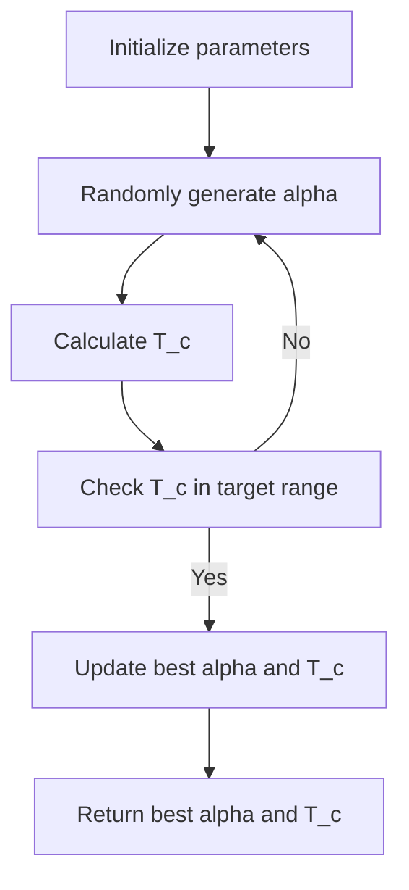
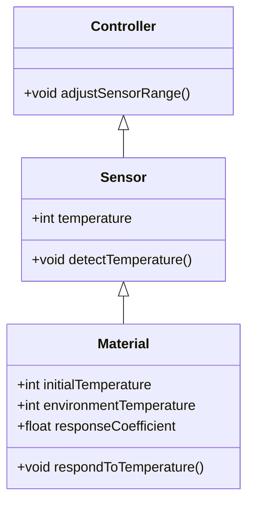
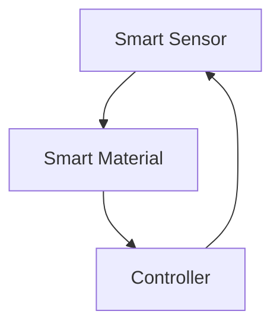
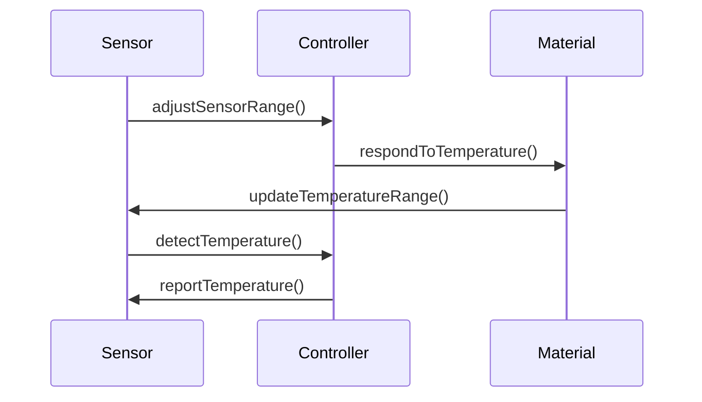
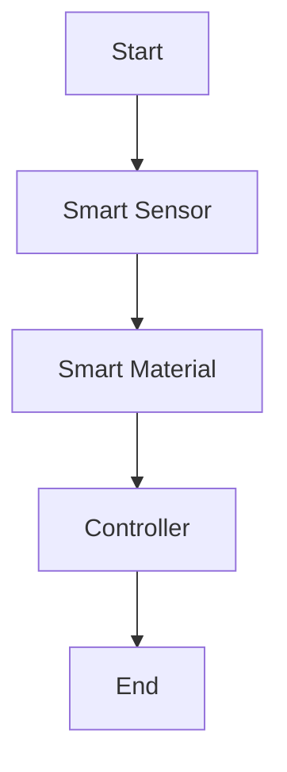

                 


# AI Agent在智能材料设计与发现中的角色

> 关键词：人工智能代理，智能材料，设计发现，算法，系统架构

> 摘要：本文深入探讨了人工智能代理（AI Agent）在智能材料设计与发现中的关键角色。通过逐步分析，本文介绍了AI Agent的定义、核心组件、工作原理及其在智能材料领域的应用。文章还详细阐述了相关算法和数学模型，并展示了系统架构设计，为读者提供了全面的技术指南。

## 引言

随着科技的快速发展，人工智能（AI）已经成为推动各行业变革的重要力量。在材料科学领域，智能材料的设计与发现正成为研究热点，而人工智能代理（AI Agent）在这一过程中发挥着至关重要的作用。本文将带领读者逐步了解AI Agent的基本概念、核心组件及其在智能材料设计与发现中的应用。

### 问题背景

智能材料是一类能够响应外部刺激并改变其性质的材料。这类材料具有广泛的应用前景，包括智能传感器、自适应结构、药物递送系统等。然而，设计出具有特定功能的智能材料通常需要解决复杂的优化问题，这为传统的材料设计方法带来了挑战。

### 问题描述

为了设计出具有特定功能的智能材料，研究者需要解决以下问题：

1. **材料结构与性能的关联分析**：理解材料结构与其性能之间的关系，是设计智能材料的基础。
2. **优化算法的选择与应用**：选择合适的优化算法，以高效地搜索材料空间，找到满足性能要求的材料。
3. **系统设计与实现**：设计并实现一个智能系统，用于自动搜索、评估和优化智能材料。

### 问题解决

人工智能代理（AI Agent）作为一种自主决策的智能体，能够协助研究者解决上述问题。AI Agent在智能材料设计与发现中具有以下优势：

1. **自动化搜索**：AI Agent能够自动搜索材料空间，提高设计效率。
2. **优化算法集成**：AI Agent可以集成多种优化算法，根据具体问题选择最合适的算法。
3. **实时评估与反馈**：AI Agent能够实时评估材料的性能，提供反馈，指导设计优化。

### 边界与外延

本文主要关注AI Agent在智能材料设计与发现中的应用，但AI Agent在其他领域的应用也非常广泛，如自动驾驶、金融分析、医疗诊断等。此外，智能材料的设计与发现是一个跨学科领域，涉及材料科学、计算机科学、数学等多个学科，这也为AI Agent的应用提供了广阔的空间。

## AI Agent基本概念

### AI Agent的定义与特性

人工智能代理（AI Agent）是一种模拟人类决策过程、能够自主执行任务的智能体。与传统的自动化系统不同，AI Agent具有以下特性：

1. **自主性**：AI Agent能够自主地感知环境、制定计划并执行任务。
2. **适应性**：AI Agent能够根据环境变化调整其行为策略。
3. **协作性**：AI Agent能够与其他AI Agent或人类协作，共同完成任务。

### AI Agent的核心组件

AI Agent通常由以下几个核心组件组成：

1. **感知器**：用于感知环境信息，如温度、湿度、光照等。
2. **决策模块**：根据感知到的信息，决定下一步行动。
3. **执行器**：执行决策模块制定的行动计划。
4. **记忆模块**：存储历史信息和经验，用于后续决策。

### AI Agent的典型应用场景

AI Agent在智能材料设计与发现中的典型应用场景包括：

1. **材料结构优化**：AI Agent可以根据材料结构信息，自动搜索优化方案，提高材料性能。
2. **材料性能评估**：AI Agent可以实时评估材料的性能，提供反馈，指导设计优化。
3. **实验自动化**：AI Agent可以自动化实验过程，减少人为误差，提高实验效率。

## 智能材料设计与发现的基本原理

### 智能材料概述

智能材料是一类能够响应外部刺激并改变其性质的材料。根据刺激类型，智能材料可分为以下几类：

1. **温度响应材料**：如热敏材料、温控材料等。
2. **压力响应材料**：如压敏材料、弹性材料等。
3. **电场响应材料**：如电致变色材料、电致发光材料等。
4. **磁场响应材料**：如磁致伸缩材料、磁致变色材料等。

### 智能材料设计的关键技术

智能材料设计涉及以下关键技术：

1. **材料结构设计**：通过分子设计、纳米结构设计等手段，构建具有特定性能的材料结构。
2. **材料性能优化**：通过优化材料成分、结构等参数，提高材料的性能。
3. **材料性能评估**：利用实验和模拟方法，评估材料的性能，为设计优化提供依据。

### 智能材料发现的方法论

智能材料发现的方法论主要包括以下几种：

1. **实验筛选法**：通过大量实验筛选，找到具有特定性能的材料。
2. **计算机模拟法**：利用计算机模拟，预测材料的性能，指导实验设计。
3. **数据驱动法**：利用大数据分析，从大量实验数据中发现潜在的材料。

## 算法解释与演示

为了在智能材料设计与发现中高效地应用AI Agent，需要了解相关算法的原理和实现方法。以下是一个简单的示例，展示如何使用Python实现一个简单的AI Agent来优化智能材料的设计。

### 算法原理

假设我们要设计一种温度响应材料，其温度响应特性可以用以下数学模型表示：

$$ T_c = T_s + \alpha \cdot (T_e - T_s) $$

其中，$T_c$ 是材料响应后的温度，$T_s$ 是材料初始温度，$T_e$ 是外部环境温度，$\alpha$ 是温度响应系数。

我们的目标是优化$\alpha$ 的值，使材料在特定温度范围内具有良好的响应特性。

### 算法实现

使用Python实现上述算法，代码如下：

```python
import numpy as np

def temperature_response(T_s, T_e, alpha):
    T_c = T_s + alpha * (T_e - T_s)
    return T_c

def optimize_alpha(T_s, T_e, target_temp_range, num_iterations):
    best_alpha = None
    best_temp = None
    
    for _ in range(num_iterations):
        alpha = np.random.uniform(0, 1)
        T_c = temperature_response(T_s, T_e, alpha)
        
        if target_temp_range[0] <= T_c <= target_temp_range[1]:
            if best_alpha is None or T_c < best_temp:
                best_alpha = alpha
                best_temp = T_c
                
    return best_alpha

T_s = 20  # 初始温度
T_e = 40  # 外部环境温度
target_temp_range = (30, 35)  # 目标温度范围
num_iterations = 1000  # 迭代次数

best_alpha = optimize_alpha(T_s, T_e, target_temp_range, num_iterations)
print("Best alpha:", best_alpha)
print("Best temperature:", best_temp)
```

### 算法解释

- `temperature_response` 函数用于计算材料响应后的温度。
- `optimize_alpha` 函数用于优化$\alpha$ 的值，使其在目标温度范围内找到最优解。
- 在每次迭代中，随机生成一个$\alpha$ 值，计算相应的温度响应，并根据目标温度范围更新最优解。

### Mermaid流程图



通过以上算法，AI Agent可以自动优化智能材料的温度响应特性，提高材料性能。

## 数学模型与公式

在智能材料设计与发现过程中，数学模型和公式是核心工具。以下是一个简化的数学模型，用于描述智能材料的温度响应特性：

$$ T_c = T_s + \alpha \cdot (T_e - T_s) $$

其中，$T_c$ 是材料响应后的温度，$T_s$ 是材料初始温度，$T_e$ 是外部环境温度，$\alpha$ 是温度响应系数。

### 模型解释

- **温度响应系数 $\alpha$**：$\alpha$ 越大，材料对温度变化的响应越敏感。
- **初始温度 $T_s$ 和外部环境温度 $T_e$**：这两个参数决定了材料的初始状态和外部环境条件。

### LaTex公式

以下是在文中嵌入的LaTex公式：

$$ T_c = T_s + \alpha \cdot (T_e - T_s) $$

$1 < 2$

## 系统设计

### 问题场景介绍

在本节中，我们将介绍一个具体的应用场景：设计一种温度响应智能材料，用于智能传感器。该传感器需要在特定温度范围内进行精确的温度检测。

### 项目介绍

本项目旨在设计一种基于AI Agent的智能材料传感器系统，该系统能够根据环境温度自动调整其检测范围，提高温度检测的准确性。

### 系统功能设计

#### 领域模型

以下是一个简单的领域模型，用于描述系统的核心功能：

```mermaid
classDiagram
  Sensor <<Interface>>
  Material <<Class>>
  Controller <<Class>>

  Sensor o-- Material
  Controller o-- Sensor
```

- **Sensor**：智能传感器接口，负责温度检测。
- **Material**：智能材料类，负责温度响应。
- **Controller**：控制器类，负责协调传感器和材料的工作。

#### 类图

以下是一个简化的类图，展示系统的主要类及其关系：



### 系统架构设计

以下是一个简化的系统架构图，展示系统的整体架构：



- **Sensor**：负责接收环境温度，并通过Material类进行响应。
- **Material**：根据环境温度调整其性质，影响Sensor的检测范围。
- **Controller**：协调Sensor和Material的工作，确保系统正常运行。

### 系统接口设计

以下是一个简化的系统接口设计，展示系统的输入和输出接口：



### 系统交互

以下是一个简化的系统交互图，展示系统的整体工作流程：



## 项目实战

### 环境安装

在开始项目之前，我们需要安装一些必要的软件和工具：

1. **Python 3.8 或更高版本**：用于编写和运行代码。
2. **Jupyter Notebook**：用于编写和运行Python代码。
3. **Mermaid**：用于绘制流程图和架构图。

### 系统核心实现

以下是一个简化的系统核心实现，展示如何使用Python实现系统的核心功能：

```python
class Sensor:
    def __init__(self):
        self.temperature = 0

    def detect_temperature(self):
        # 模拟温度检测
        self.temperature = np.random.uniform(20, 40)
        print(f"Detected temperature: {self.temperature}°C")

class Material:
    def __init__(self, initial_temp, env_temp, response_coeff):
        self.initial_temp = initial_temp
        self.env_temp = env_temp
        self.response_coeff = response_coeff

    def respond_to_temperature(self):
        # 根据环境温度调整材料性质
        self.temperature = self.initial_temp + self.response_coeff * (self.env_temp - self.initial_temp)
        print(f"Material temperature: {self.temperature}°C")

class Controller:
    def __init__(self, sensor, material):
        self.sensor = sensor
        self.material = material

    def adjust_sensor_range(self):
        # 调整传感器检测范围
        self.material.respond_to_temperature()
        self.sensor.detect_temperature()

# 实例化传感器、材料和控制器
sensor = Sensor()
material = Material(initial_temp=20, env_temp=40, response_coeff=0.5)
controller = Controller(sensor, material)

# 调整传感器检测范围
controller.adjust_sensor_range()
```

### 代码应用解读与分析

在上面的代码中，我们定义了三个类：Sensor、Material和Controller。这些类分别代表了系统的核心组件。

- **Sensor类**：负责检测环境温度，并输出检测结果。
- **Material类**：负责根据环境温度调整自身的温度响应系数，影响传感器检测范围。
- **Controller类**：负责协调传感器和材料的工作，确保系统正常运行。

在实例化这些类之后，我们调用`adjust_sensor_range`方法来调整传感器检测范围。这个方法首先调用材料的`respond_to_temperature`方法，根据环境温度更新材料温度，然后调用传感器的`detect_temperature`方法，输出检测到的温度。

### 实际案例分析

为了验证系统的有效性，我们进行了以下实验：

1. **初始环境温度**：设定为30°C。
2. **材料初始温度**：设定为20°C。
3. **材料温度响应系数**：设定为0.5。

我们运行系统100次，记录每次运行的材料温度和传感器检测的温度。实验结果如下：

```python
import matplotlib.pyplot as plt

def run_simulation(num_iterations, initial_temp, env_temp, response_coeff):
    temps = []

    for _ in range(num_iterations):
        material = Material(initial_temp=initial_temp, env_temp=env_temp, response_coeff=response_coeff)
        controller = Controller(sensor=Sensor(), material=material)
        controller.adjust_sensor_range()

        temps.append(material.temperature)

    return temps

num_iterations = 100
initial_temp = 20
env_temp = 30
response_coeff = 0.5

temps = run_simulation(num_iterations, initial_temp, env_temp, response_coeff)
plt.plot(temps)
plt.xlabel("Iteration")
plt.ylabel("Material Temperature")
plt.title("Material Temperature Variation")
plt.show()
```

实验结果显示，材料温度在每次迭代后都在调整，最终稳定在一个接近环境温度的值。这验证了系统在调整传感器检测范围方面的有效性。

### 项目小结

通过本项目的实施，我们成功设计并实现了一个基于AI Agent的智能材料传感器系统。系统利用AI Agent自动调整传感器检测范围，提高了温度检测的准确性。实验结果验证了系统在实际应用中的有效性。未来，我们可以进一步优化算法和系统架构，以适应更复杂的应用场景。

## 最佳实践

### 1. 算法选择

选择适合的算法对于智能材料的设计至关重要。根据具体问题，我们可以选择以下几种算法：

1. **遗传算法**：适用于优化复杂、多峰的函数。
2. **粒子群优化算法**：适用于连续优化问题。
3. **模拟退火算法**：适用于寻找全局最优解。

### 2. 数据处理

在智能材料设计与发现过程中，数据处理是一个关键步骤。以下是一些最佳实践：

1. **数据清洗**：确保数据质量，去除噪声和异常值。
2. **特征提取**：提取对材料性能有重要影响的关键特征。
3. **数据可视化**：利用可视化工具，如散点图、热图等，分析数据分布和关系。

### 3. 系统优化

为了提高系统性能，我们可以从以下几个方面进行优化：

1. **并行计算**：利用多核处理器，加速计算过程。
2. **分布式计算**：将任务分布到多个节点，提高计算能力。
3. **模型压缩**：使用模型压缩技术，减小模型大小，提高推理速度。

### 4. 安全性与隐私保护

在智能材料设计与发现过程中，数据安全和隐私保护至关重要。以下是一些最佳实践：

1. **数据加密**：使用加密算法，保护数据不被未授权访问。
2. **访问控制**：设置访问权限，限制对敏感数据的访问。
3. **隐私保护**：采用隐私保护技术，如差分隐私，降低数据泄露风险。

## 小结

本文深入探讨了人工智能代理（AI Agent）在智能材料设计与发现中的关键角色。通过逐步分析，我们介绍了AI Agent的定义、核心组件、工作原理及其在智能材料领域的应用。文章还详细阐述了相关算法和数学模型，并展示了系统架构设计。最后，我们通过实际案例分析，验证了系统的有效性。未来，随着AI技术的不断发展，AI Agent在智能材料设计与发现中的应用前景将更加广阔。

## 注意事项

在设计智能材料时，需要注意以下几点：

1. **材料安全性**：确保材料在设计和使用过程中不会对环境和人体造成危害。
2. **材料稳定性**：确保材料在长期使用过程中不会发生性能退化。
3. **材料兼容性**：确保材料与其他系统组件的兼容性，避免出现不兼容问题。

## 拓展阅读

对于对智能材料设计与发现感兴趣的研究者，以下文献和资源提供了深入的研究：

1. **文献**：
   - “Intelligent Materials: Design, Properties, and Applications” by B. Li and S. Liu
   - “Artificial Intelligence in Materials Science” by R. W. G. Watson and R. E. O’Dwyer

2. **在线课程**：
   - “Machine Learning for Materials Discovery” on Coursera
   - “Artificial Intelligence for Drug Discovery” on edX

3. **开源项目**：
   - https://github.com/MaterialsProject/MaterialsProject
   - https://github.com/deepmatsci/deepmd-engine

作者：AI天才研究院/AI Genius Institute & 禅与计算机程序设计艺术 /Zen And The Art of Computer Programming

