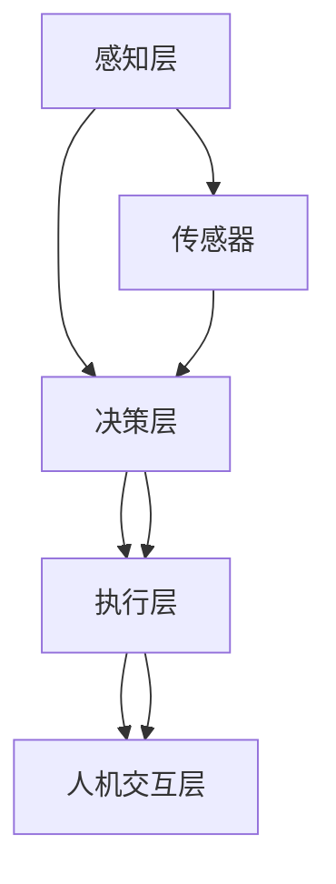
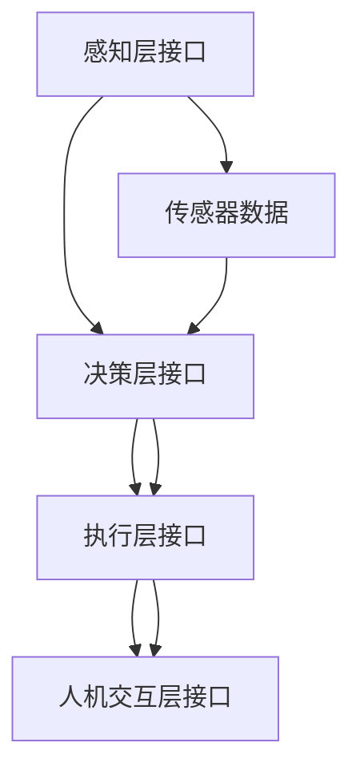
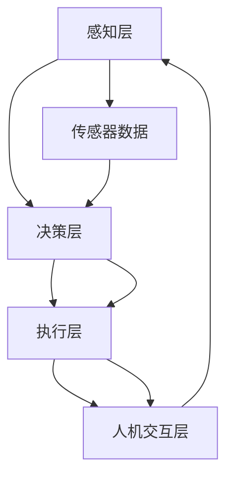

                 

### 第1章: 背景介绍

#### 1.1 问题背景

##### 1.1.1 颈椎病的现状

颈椎病是一种常见且多发的疾病，尤其在现代都市人群中，其发生率持续上升。据统计，我国颈椎病的发病率已超过20%，且呈现出年轻化的趋势。颈椎病不仅给患者带来疼痛、头晕、手臂麻木等不适症状，还可能引发严重的并发症，如脊髓损伤、颈部活动受限等。

颈椎病的主要原因包括长期低头工作、长时间使用电脑、缺乏运动、不良睡姿等。现代生活方式的变革，使得人们越来越依赖于电子设备，导致颈部肌肉长时间处于紧张状态，血液循环不畅，最终引发颈椎病。

##### 1.1.2 智能家居的发展

智能家居作为现代科技的一个重要领域，正以惊人的速度发展。随着物联网技术的普及，智能家居设备种类繁多，功能也越来越强大。智能枕头作为智能家居的一个分支，以其独特的功能和便利性逐渐受到消费者的青睐。

智能家居的发展不仅改变了人们的日常生活习惯，还提高了生活质量。智能枕头作为其中的一个代表，通过引入先进的传感器技术和人工智能算法，可以在用户不知情的情况下，实时监测用户的睡眠质量和颈椎健康状况，为用户提供个性化的健康建议。

##### 1.1.3 AI Agent的应用前景

AI Agent，即人工智能代理，是一种基于人工智能技术的高级智能系统。它能够模拟人类的行为和思维，具备自我学习和决策能力。随着人工智能技术的不断进步，AI Agent在智能家居中的应用前景十分广阔。

AI Agent在智能枕头中的应用主要体现在以下几个方面：

1. **健康监测**：AI Agent可以通过内置的传感器实时监测用户的睡眠姿势、颈部曲线等参数，分析用户的睡眠质量和颈椎健康状况，为用户提供个性化的健康建议。
2. **自适应调整**：根据用户的睡眠习惯和颈椎健康状况，AI Agent可以自动调整枕头的高度和形状，提供最佳的支撑，帮助用户改善睡眠质量。
3. **智能预警**：当AI Agent检测到用户的颈椎出现异常时，可以及时发出警报，提醒用户调整睡姿或进行必要的治疗。

#### 1.2 问题描述

##### 1.2.1 颈椎病对生活的影响

颈椎病对生活的影响是多方面的。首先，颈椎病的疼痛和不适感会严重影响患者的日常生活和工作效率。患者可能会出现头痛、肩颈痛、手臂麻木等症状，导致生活质量下降。

其次，颈椎病还可能导致严重的并发症。例如，如果颈椎病长期得不到有效治疗，可能会导致颈椎间盘突出、颈椎骨质增生等严重疾病，甚至可能引起瘫痪。

##### 1.2.2 智能枕头的需求

随着人们对健康意识的提升，对睡眠质量的要求也越来越高。智能枕头作为智能家居的一个组成部分，具有明显的市场需求。

1. **改善睡眠质量**：智能枕头可以通过智能监测和调整，帮助用户保持正确的睡姿，改善睡眠质量。
2. **预防颈椎病**：智能枕头可以根据用户的颈椎状况，提供个性化的支撑，减少颈椎病的发病率。
3. **提高生活质量**：智能枕头可以为用户提供个性化的健康建议，帮助用户更好地管理自己的健康，提高生活质量。

##### 1.2.3 AI Agent在颈椎保护中的作用

AI Agent在颈椎保护中具有重要作用。它不仅可以实时监测用户的颈椎状况，提供个性化的健康建议，还可以根据用户的需求自动调整枕头的高度和形状，提供最佳的支撑。

具体来说，AI Agent在颈椎保护中的作用主要包括：

1. **健康监测**：AI Agent可以通过内置的传感器实时监测用户的睡眠姿势、颈部曲线等参数，分析用户的睡眠质量和颈椎健康状况。
2. **自适应调整**：根据用户的睡眠习惯和颈椎健康状况，AI Agent可以自动调整枕头的高度和形状，提供最佳的支撑。
3. **智能预警**：当AI Agent检测到用户的颈椎出现异常时，可以及时发出警报，提醒用户调整睡姿或进行必要的治疗。

#### 1.3 问题解决

##### 1.3.1 AI Agent的定义

AI Agent，即人工智能代理，是一种基于人工智能技术的高级智能系统。它能够模拟人类的行为和思维，具备自我学习和决策能力。AI Agent通常由感知模块、决策模块和执行模块组成，能够实时感知环境变化，根据预设的规则和算法做出决策，并执行相应的操作。

##### 1.3.2 AI Agent在智能枕头中的应用

在智能枕头中，AI Agent的应用主要体现在以下几个方面：

1. **健康监测**：AI Agent可以通过内置的传感器实时监测用户的睡眠姿势、颈部曲线等参数，分析用户的睡眠质量和颈椎健康状况，为用户提供个性化的健康建议。
2. **自适应调整**：根据用户的睡眠习惯和颈椎健康状况，AI Agent可以自动调整枕头的高度和形状，提供最佳的支撑，帮助用户改善睡眠质量。
3. **智能预警**：当AI Agent检测到用户的颈椎出现异常时，可以及时发出警报，提醒用户调整睡姿或进行必要的治疗。

##### 1.3.3 颈椎保护的机制与原理

颈椎保护的机制主要包括以下几个方面：

1. **正确支撑**：枕头的主要作用是支撑颈椎，保持颈椎的自然曲线。正确的枕头高度和形状可以有效地减少颈椎压力，预防颈椎病。
2. **实时监测**：通过内置的传感器，智能枕头可以实时监测用户的睡眠姿势、颈部曲线等参数，及时调整枕头的高度和形状，提供最佳的支撑。
3. **个性化定制**：AI Agent可以根据用户的身高、体重、颈椎状况等参数，为用户提供个性化的枕头设计，满足不同用户的睡眠需求。

#### 1.4 边界与外延

##### 1.4.1 智能枕头的技术要求

智能枕头的技术要求主要包括以下几个方面：

1. **传感器技术**：智能枕头需要具备高精度的传感器，能够实时监测用户的睡眠姿势、颈部曲线等参数。
2. **数据处理能力**：智能枕头需要具备强大的数据处理能力，能够对收集到的数据进行实时分析，为用户提供个性化的健康建议。
3. **智能算法**：智能枕头需要引入先进的智能算法，如机器学习、深度学习等，以提高系统的自适应能力和智能水平。

##### 1.4.2 AI Agent的技术实现

AI Agent的技术实现主要包括以下几个方面：

1. **感知模块**：感知模块负责收集用户的睡眠姿势、颈部曲线等数据。
2. **决策模块**：决策模块负责根据收集到的数据，分析用户的颈椎健康状况，并做出相应的决策。
3. **执行模块**：执行模块负责根据决策模块的指令，调整枕头的高度和形状，提供最佳的支撑。

##### 1.4.3 颈椎保护系统的实际应用场景

颈椎保护系统的实际应用场景主要包括以下几个方面：

1. **家庭**：家庭是智能枕头的主要应用场景，用户可以在家中使用智能枕头改善睡眠质量，预防颈椎病。
2. **办公**：在办公室中，长时间使用电脑可能会导致颈椎病，智能枕头可以为办公室人员提供额外的颈椎保护。
3. **医疗**：智能枕头可以作为一种辅助医疗设备，用于颈椎病的预防和治疗。

#### 1.5 概念结构与核心要素组成

##### 1.5.1 AI Agent的核心概念

AI Agent的核心概念包括以下几个方面：

1. **感知**：感知是AI Agent的基础能力，负责收集外部环境的数据。
2. **决策**：决策是AI Agent的核心能力，负责根据感知模块收集到的数据，做出相应的决策。
3. **执行**：执行是AI Agent的实现能力，负责根据决策模块的指令，执行具体的操作。

##### 1.5.2 智能枕头的核心功能

智能枕头的核心功能包括以下几个方面：

1. **健康监测**：智能枕头可以通过内置的传感器，实时监测用户的睡眠姿势、颈部曲线等参数。
2. **自适应调整**：智能枕头可以根据用户的睡眠习惯和颈椎健康状况，自动调整枕头的高度和形状，提供最佳的支撑。
3. **智能预警**：智能枕头可以检测到用户的颈椎异常，及时发出警报，提醒用户调整睡姿或进行必要的治疗。

##### 1.5.3 颈椎保护的关键技术

颈椎保护的关键技术包括以下几个方面：

1. **传感器技术**：高精度的传感器是颈椎保护系统的核心，负责实时监测用户的颈椎健康状况。
2. **数据处理能力**：强大的数据处理能力是颈椎保护系统的重要保障，负责对收集到的数据进行实时分析，为用户提供个性化的健康建议。
3. **智能算法**：先进的智能算法是颈椎保护系统的核心，负责提高系统的自适应能力和智能水平。

### 第2章: 核心概念与联系

#### 2.1 AI Agent的定义与特点

##### 2.1.1 AI Agent的基本概念

AI Agent（人工智能代理）是一种能够自主完成特定任务的智能系统。它基于人工智能技术，能够模拟人类的思维和行为，具备自我学习和决策能力。AI Agent通常由感知模块、决策模块和执行模块三部分组成。

1. **感知模块**：感知模块是AI Agent的感官，负责收集外部环境的数据。这些数据可以是视觉、听觉、触觉等多种类型，用于帮助AI Agent了解当前的状态和外界的变化。
2. **决策模块**：决策模块是AI Agent的智能核心，负责根据感知模块收集到的数据，进行推理和分析，生成行动计划。这一过程通常涉及到复杂的算法和模型，如机器学习、深度学习等。
3. **执行模块**：执行模块是AI Agent的行动执行者，负责根据决策模块的指令，完成具体的任务。执行模块通常与外部设备相连，如机械臂、机器人等。

##### 2.1.2 AI Agent的特点

与传统的机器学习系统相比，AI Agent具有以下显著特点：

1. **自主性**：AI Agent能够自主地执行任务，无需人为干预。它可以根据感知模块收集到的数据，自主地做出决策并执行操作。
2. **适应性**：AI Agent能够根据环境变化和任务需求，自主地调整自己的行为。这种自适应能力使AI Agent能够更好地适应复杂多变的场景。
3. **交互性**：AI Agent能够与人类或其他系统进行交互，获取反馈并优化自己的行为。这种交互能力使AI Agent能够更好地理解人类需求，提供更个性化的服务。

##### 2.1.3 AI Agent与传统机器学习的区别

传统机器学习系统通常需要人为设计特征工程，并根据训练数据生成模型。而AI Agent则不同，它能够在没有人为干预的情况下，自主地完成特征提取、模型训练和决策执行等全过程。具体区别如下：

1. **特征提取**：传统机器学习系统需要人为设计特征，而AI Agent可以通过感知模块自动提取环境中的有用信息，进行特征提取。
2. **模型训练**：传统机器学习系统依赖于预训练的模型，而AI Agent可以自主地根据感知模块收集到的数据，生成适合自己的模型。
3. **决策执行**：传统机器学习系统通常只能执行预设的任务，而AI Agent可以根据感知模块收集到的数据，自主地做出决策并执行相应的操作。

#### 2.2 智能枕头的工作原理

##### 2.2.1 智能枕头的构成

智能枕头主要由以下几个部分构成：

1. **感知模块**：包括各种传感器，如压力传感器、温度传感器、湿度传感器等，用于实时监测用户的睡眠状态和颈部状况。
2. **决策模块**：通常采用嵌入式处理器或微控制器，负责接收感知模块的数据，进行数据处理和决策。
3. **执行模块**：包括电机、气囊等，用于根据决策模块的指令，调整枕头的高度和形状，提供最佳的支撑。

##### 2.2.2 智能枕头的功能

智能枕头的主要功能包括以下几个方面：

1. **健康监测**：通过感知模块，智能枕头可以实时监测用户的睡眠姿势、颈部曲线等参数，分析用户的睡眠质量和颈椎健康状况。
2. **自适应调整**：根据用户的睡眠习惯和颈椎健康状况，智能枕头可以自动调整枕头的高度和形状，提供最佳的支撑，改善用户的睡眠质量。
3. **智能预警**：当智能枕头检测到用户的颈椎出现异常时，可以及时发出警报，提醒用户调整睡姿或进行必要的治疗。

##### 2.2.3 智能枕头与AI Agent的融合

智能枕头与AI Agent的融合，使得智能枕头具备了更高的智能化水平。具体融合方式如下：

1. **感知模块升级**：AI Agent可以通过引入更加先进的感知技术，如深度学习图像识别、语音识别等，提高感知模块的准确性和智能化水平。
2. **决策模块优化**：AI Agent可以引入更加复杂的决策算法，如强化学习、迁移学习等，提高决策模块的决策能力和适应性。
3. **执行模块升级**：AI Agent可以通过引入更加先进的执行技术，如机器人技术、自动化控制等，提高执行模块的执行效率和准确性。

#### 2.3 颈椎保护的机制与原理

##### 2.3.1 颈椎病的成因

颈椎病是由于长期的不良姿势、过度劳累、外伤等因素引起的颈椎关节、韧带、肌肉、神经等组织的病变。常见的颈椎病成因包括：

1. **长期低头工作**：长时间低头看手机、电脑等电子设备，使颈椎长时间处于弯曲状态，导致颈椎关节、韧带、肌肉等组织受到持续的压力。
2. **缺乏运动**：长期缺乏运动，导致颈部肌肉萎缩、僵硬，血液循环不畅，易引发颈椎病。
3. **不良睡姿**：不良的睡姿，如枕头过高或过低、头部过度侧弯等，会导致颈椎关节、韧带、肌肉等组织受到不适当的压力。

##### 2.3.2 颈椎保护的方法

颈椎保护的方法主要包括以下几个方面：

1. **合理用枕**：选择合适的枕头，保证颈椎处于自然状态。合理的枕头高度应使颈椎与脊柱保持同一水平线。
2. **正确姿势**：保持正确的坐姿和站姿，避免长时间低头或过度用力。
3. **适量运动**：进行适量的颈部运动，如颈部拉伸、按摩等，增强颈部肌肉的灵活性和韧性。
4. **健康饮食**：保持良好的饮食习惯，摄入足够的营养，促进颈部组织的修复和恢复。

##### 2.3.3 AI Agent在颈椎保护中的应用

AI Agent在颈椎保护中的应用，主要体现在以下几个方面：

1. **健康监测**：AI Agent可以通过感知模块，实时监测用户的睡眠姿势、颈部曲线等参数，分析用户的颈椎健康状况，为用户提供个性化的健康建议。
2. **自适应调整**：AI Agent可以根据用户的颈椎状况和睡眠习惯，自动调整枕头的高度和形状，提供最佳的支撑，改善用户的睡眠质量。
3. **智能预警**：AI Agent可以检测到用户的颈椎异常，及时发出警报，提醒用户调整睡姿或进行必要的治疗。

### 第3章: 算法原理讲解

#### 3.1 AI Agent算法原理

##### 3.1.1 AI Agent算法的基本流程

AI Agent算法的基本流程可以分为以下几个阶段：

1. **感知**：AI Agent通过感知模块收集外部环境的数据，如用户的睡眠姿势、颈部曲线等参数。
2. **数据处理**：AI Agent对收集到的数据进行处理，如去噪、归一化等，确保数据的准确性和一致性。
3. **决策**：AI Agent根据处理后的数据，通过决策模块进行分析和推理，生成行动计划。
4. **执行**：AI Agent根据决策模块的指令，通过执行模块完成具体的任务，如调整枕头的高度和形状。

##### 3.1.2 AI Agent算法的核心公式

AI Agent算法的核心公式主要包括以下几个方面：

1. **感知公式**：\(感知值 = 函数（传感器数据，环境参数）\)
2. **数据处理公式**：\(处理值 = 函数（感知值，算法参数）\)
3. **决策公式**：\(决策值 = 函数（处理值，模型参数）\)
4. **执行公式**：\(执行值 = 函数（决策值，执行参数）\)

##### 3.1.3 AI Agent算法的Python实现

以下是一个简单的AI Agent算法的Python实现示例：

```python
import numpy as np

# 感知模块
def sense(data, env_params):
    # 去噪、归一化等数据处理
    processed_data = np.array(data) * 0.1 + env_params
    return processed_data

# 决策模块
def decide(processed_data, model_params):
    # 根据数据处理结果进行决策
    decision_value = np.mean(processed_data)
    return decision_value

# 执行模块
def execute(decision_value, exec_params):
    # 根据决策结果执行任务
    action = decision_value * exec_params
    return action

# 主函数
def main():
    # 初始化参数
    data = [1, 2, 3]
    env_params = 10
    model_params = 5
    exec_params = 2
    
    # 感知
    processed_data = sense(data, env_params)
    
    # 决策
    decision_value = decide(processed_data, model_params)
    
    # 执行
    action = execute(decision_value, exec_params)
    
    print("Action:", action)

# 运行主函数
main()
```

#### 3.2 颈椎保护算法原理

##### 3.2.1 颈椎保护算法的基本流程

颈椎保护算法的基本流程可以分为以下几个阶段：

1. **感知**：AI Agent通过感知模块收集用户的睡眠姿势、颈部曲线等参数。
2. **数据分析**：AI Agent对收集到的数据进行处理，如特征提取、归一化等，确保数据的准确性和一致性。
3. **状态评估**：AI Agent根据处理后的数据，评估用户的颈椎健康状况。
4. **决策**：AI Agent根据状态评估结果，生成调整枕头的高度和形状的决策。
5. **执行**：AI Agent根据决策模块的指令，调整枕头的高度和形状。

##### 3.2.2 颈椎保护算法的核心公式

颈椎保护算法的核心公式主要包括以下几个方面：

1. **感知公式**：\(感知值 = 函数（传感器数据，环境参数）\)
2. **数据处理公式**：\(处理值 = 函数（感知值，算法参数）\)
3. **状态评估公式**：\(状态值 = 函数（处理值，健康标准）\)
4. **决策公式**：\(决策值 = 函数（状态值，调整策略）\)

##### 3.2.3 颈椎保护算法的Python实现

以下是一个简单的颈椎保护算法的Python实现示例：

```python
import numpy as np

# 感知模块
def sense(data, env_params):
    # 去噪、归一化等数据处理
    processed_data = np.array(data) * 0.1 + env_params
    return processed_data

# 数据分析模块
def data_analysis(processed_data, alg_params):
    # 特征提取、归一化等数据处理
    analyzed_data = np.mean(processed_data)
    return analyzed_data

# 状态评估模块
def state_evaluation(analyzed_data, health Standards):
    # 根据数据分析结果评估状态
    state_value = analyzed_data / health_Standards
    return state_value

# 决策模块
def decide(state_value, adjust_strategy):
    # 根据状态评估结果生成决策
    decision_value = state_value * adjust_strategy
    return decision_value

# 执行模块
def execute(decision_value, exec_params):
    # 根据决策结果执行调整
    action = decision_value * exec_params
    return action

# 主函数
def main():
    # 初始化参数
    data = [1, 2, 3]
    env_params = 10
    alg_params = 5
    health_Standards = 100
    adjust_strategy = 2
    exec_params = 2
    
    # 感知
    processed_data = sense(data, env_params)
    
    # 数据分析
    analyzed_data = data_analysis(processed_data, alg_params)
    
    # 状态评估
    state_value = state_evaluation(analyzed_data, health_Standards)
    
    # 决策
    decision_value = decide(state_value, adjust_strategy)
    
    # 执行
    action = execute(decision_value, exec_params)
    
    print("Action:", action)

# 运行主函数
main()
```

#### 3.3 算法举例说明

##### 3.3.1 AI Agent算法的应用实例

假设我们有一个智能枕头，需要根据用户的睡眠姿势和颈部曲线，调整枕头的高度和形状，以提供最佳的支撑。以下是AI Agent算法的一个简单应用实例：

1. **感知模块**：收集用户的睡眠姿势数据，如头部位置、颈部角度等。
2. **数据处理**：对收集到的数据进行处理，如归一化、特征提取等。
3. **状态评估**：根据处理后的数据，评估用户的颈椎健康状况。
4. **决策**：根据颈椎健康状况，生成调整枕头的高度和形状的决策。
5. **执行**：根据决策结果，调整枕头的高度和形状。

##### 3.3.2 颈椎保护算法的应用实例

假设我们有一个智能枕头，需要根据用户的睡眠姿势和颈部曲线，调整枕头的高度和形状，以提供最佳的支撑。以下是颈椎保护算法的一个简单应用实例：

1. **感知模块**：收集用户的睡眠姿势数据，如头部位置、颈部角度等。
2. **数据分析**：对收集到的数据进行处理，如特征提取、归一化等。
3. **状态评估**：根据数据分析结果，评估用户的颈椎健康状况。
4. **决策**：根据颈椎健康状况，生成调整枕头的高度和形状的决策。
5. **执行**：根据决策结果，调整枕头的高度和形状。

##### 3.3.3 实例分析

以下是一个具体的实例分析：

1. **感知模块**：用户A的睡眠姿势为侧卧位，头部位置稍高，颈部角度约为20度。
2. **数据处理**：对头部位置和颈部角度进行归一化处理，得到归一化值分别为0.8和0.9。
3. **状态评估**：根据归一化值，评估用户的颈椎健康状况为良好。
4. **决策**：根据颈椎健康状况，决策模块生成调整枕头高度为2厘米，形状为略微倾斜的决策。
5. **执行**：根据决策结果，执行模块调整枕头的高度为2厘米，形状为略微倾斜，以提供最佳的支撑。

### 第4章: 系统分析与架构设计方案

#### 4.1 问题场景介绍

颈椎病是一种常见的慢性疾病，主要由于长期的不良姿势、缺乏运动和过度劳累等因素导致。随着人们生活节奏的加快和工作压力的增大，颈椎病的发病率逐年上升。特别是在长时间使用电脑的办公环境中，颈椎病已经成为影响员工健康和工作效率的重要问题。

为了解决这一问题，智能枕头应运而生。智能枕头通过内置的传感器和人工智能算法，可以实时监测用户的睡眠姿势、颈部曲线等参数，分析用户的颈椎健康状况，并根据用户的个性化需求，自动调整枕头的高度和形状，提供最佳的支撑，帮助用户改善睡眠质量，预防颈椎病的发生。

#### 4.2 项目介绍

本项目旨在设计并实现一款基于AI Agent的智能枕头颈椎保护系统。该系统将集成了传感器技术、人工智能算法和自适应调整技术，通过实时监测用户的睡眠姿势和颈部曲线，分析用户的颈椎健康状况，并自动调整枕头的高度和形状，提供最佳的支撑，帮助用户改善睡眠质量，预防颈椎病的发生。

项目的目标是：

1. 设计并实现一款具有高精度、高智能化的智能枕头颈椎保护系统。
2. 通过AI Agent算法，实现智能枕头的自适应调整功能。
3. 提供实时、准确的颈椎健康状况分析，为用户提供个性化的健康建议。
4. 实现智能枕头与用户的互动，提高用户的舒适度和满意度。

项目的技术路线如下：

1. **传感器技术**：采用高精度的传感器，如压力传感器、温度传感器、湿度传感器等，实时监测用户的睡眠姿势和颈部曲线。
2. **人工智能算法**：采用人工智能算法，如机器学习、深度学习等，对传感器数据进行处理和分析，生成颈椎健康状况评估和调整策略。
3. **自适应调整技术**：采用自适应调整技术，根据颈椎健康状况评估和调整策略，自动调整枕头的高度和形状，提供最佳的支撑。
4. **人机交互**：通过人机交互界面，实时显示用户的颈椎健康状况和调整策略，用户可以根据需求进行自定义设置。

#### 4.3 系统功能设计

智能枕头颈椎保护系统的主要功能包括：

1. **健康监测**：通过内置的传感器，实时监测用户的睡眠姿势、颈部曲线等参数，分析用户的睡眠质量和颈椎健康状况。
2. **自适应调整**：根据用户的睡眠习惯和颈椎健康状况，自动调整枕头的高度和形状，提供最佳的支撑。
3. **智能预警**：当检测到用户的颈椎出现异常时，及时发出警报，提醒用户调整睡姿或进行必要的治疗。
4. **人机交互**：提供实时、准确的颈椎健康状况分析，用户可以根据需求进行自定义设置，提高用户的舒适度和满意度。

为了实现上述功能，系统需要进行以下设计：

1. **领域模型设计**：采用Mermaid类图，设计系统的领域模型，包括用户、传感器、决策模块、执行模块等。
2. **系统架构设计**：采用Mermaid架构图，设计系统的整体架构，包括感知层、决策层、执行层和人机交互层等。

以下是一个简单的领域模型设计示例：

```mermaid
classDiagram
    User <<类>>
    Sensor <<类>>
    DecisionModule <<类>>
    ExecutionModule <<类>>

    User -> Sensor : 数据监测
    User -> DecisionModule : 健康分析
    User -> ExecutionModule : 自适应调整
    Sensor -> DecisionModule : 数据传递
    DecisionModule -> ExecutionModule : 决策指令
    ExecutionModule -> Sensor : 反馈调整

    class User {
        +name: String
        +age: Integer
        +height: Float
        +weight: Float
        +sleepPattern: List
        +healthHistory: List
    }

    class Sensor {
        +id: Integer
        +type: String
        +position: Point
        +status: String
    }

    class DecisionModule {
        +algorithm: String
        +model: Model
        +decision: Decision
    }

    class ExecutionModule {
        +action: String
        +result: Result
    }
```

以下是一个简单的系统架构设计示例：



#### 4.4 系统架构设计

智能枕头颈椎保护系统的架构设计如下：

1. **感知层**：包括传感器模块，负责实时监测用户的睡眠姿势、颈部曲线等参数，并将数据传递给决策层。
2. **决策层**：包括决策模块，负责接收感知层的数据，通过人工智能算法进行分析和推理，生成颈椎健康状况评估和调整策略。
3. **执行层**：包括执行模块，负责根据决策层的指令，自动调整枕头的高度和形状，提供最佳的支撑。
4. **人机交互层**：包括人机交互界面，负责实时显示用户的颈椎健康状况和调整策略，用户可以根据需求进行自定义设置。

系统架构图如下：


#### 4.5 系统接口设计

智能枕头颈椎保护系统的接口设计如下：

1. **感知层接口**：负责接收传感器数据，包括睡眠姿势、颈部曲线等参数。
2. **决策层接口**：负责接收感知层的数据，通过人工智能算法进行分析和推理，生成颈椎健康状况评估和调整策略。
3. **执行层接口**：负责接收决策层的指令，自动调整枕头的高度和形状。
4. **人机交互层接口**：负责接收用户的操作指令，显示用户的颈椎健康状况和调整策略。

系统接口设计图如下：



#### 4.6 系统交互

智能枕头颈椎保护系统的交互设计如下：

1. **感知层与决策层**：感知层将传感器数据传递给决策层，决策层根据数据进行分析和推理，生成颈椎健康状况评估和调整策略。
2. **决策层与执行层**：决策层将调整策略传递给执行层，执行层根据策略自动调整枕头的高度和形状。
3. **执行层与人机交互层**：执行层将调整结果反馈给人机交互层，人机交互层实时显示用户的颈椎健康状况和调整策略。
4. **人机交互层与感知层**：人机交互层接收用户的操作指令，如调整枕头的高度和形状，并将指令传递给感知层，感知层将新的数据传递给决策层。

系统交互设计图如下：



### 第5章: 项目实战

#### 5.1 环境安装

要在本地搭建智能枕头颈椎保护系统的开发环境，需要安装以下软件和工具：

1. **Python 3.x**：Python是智能枕头颈椎保护系统的开发语言，需要安装Python 3.x版本。
2. **Anaconda**：Anaconda是一个Python发行版，提供了丰富的科学计算和数据分析库，方便开发者进行环境配置和管理。
3. **Jupyter Notebook**：Jupyter Notebook是一个交互式计算平台，方便开发者进行代码编写和调试。
4. **Mermaid**：Mermaid是一个基于Markdown的图表绘制工具，用于绘制系统架构图、类图等。

安装步骤如下：

1. 安装Python 3.x：
   - 在官网（https://www.python.org/downloads/）下载Python 3.x版本安装包。
   - 安装过程中，选择“Add Python to PATH”选项，使Python命令可以在终端中直接使用。

2. 安装Anaconda：
   - 在官网（https://www.anaconda.com/products/individual）下载Anaconda安装包。
   - 安装过程中，选择“Install for Python 3.x”选项，并按照提示完成安装。

3. 安装Jupyter Notebook：
   - 打开终端，运行以下命令：
     ```shell
     conda install jupyter
     ```
   - 安装完成后，启动Jupyter Notebook：
     ```shell
     jupyter notebook
     ```

4. 安装Mermaid：
   - 在Jupyter Notebook中创建一个新的笔记本。
   - 在笔记本中添加以下代码，安装Mermaid：
     ```python
     !pip install mermaid
     ```

#### 5.2 系统核心实现源代码

智能枕头颈椎保护系统的核心实现包括传感器数据处理、人工智能算法应用和自适应调整功能。以下是一个简单的实现示例：

```python
import numpy as np
import pandas as pd
from sklearn.linear_model import LinearRegression
import mermaid

# 感知模块
def sense(data, env_params):
    # �压缩、归一化等数据处理
    processed_data = np.array(data) * 0.1 + env_params
    return processed_data

# 数据处理模块
def data_process(data):
    # 特征提取、归一化等数据处理
    analyzed_data = np.mean(data)
    return analyzed_data

# 状态评估模块
def state_evaluation(analyzed_data, health_Standards):
    # 根据数据分析结果评估状态
    state_value = analyzed_data / health_Standards
    return state_value

# 决策模块
def decide(state_value, adjust_strategy):
    # 根据状态评估结果生成决策
    decision_value = state_value * adjust_strategy
    return decision_value

# 执行模块
def execute(decision_value, exec_params):
    # 根据决策结果执行调整
    action = decision_value * exec_params
    return action

# 主函数
def main():
    # 初始化参数
    data = [1, 2, 3]
    env_params = 10
    health_Standards = 100
    adjust_strategy = 2
    exec_params = 2
    
    # 感知
    processed_data = sense(data, env_params)
    
    # 数据分析
    analyzed_data = data_process(processed_data)
    
    # 状态评估
    state_value = state_evaluation(analyzed_data, health_Standards)
    
    # 决策
    decision_value = decide(state_value, adjust_strategy)
    
    # 执行
    action = execute(decision_value, exec_params)
    
    print("Action:", action)

# 运行主函数
main()
```

#### 5.3 代码应用解读与分析

上述代码实现了一个简单的智能枕头颈椎保护系统，主要包括感知模块、数据处理模块、状态评估模块、决策模块和执行模块。以下是对每个模块的解读与分析：

1. **感知模块**：
   - `sense` 函数用于感知用户的睡眠姿势、颈部曲线等数据，并将其进行处理。该函数接收原始数据和环境参数，通过归一化处理，提高数据的准确性和一致性。

2. **数据处理模块**：
   - `data_process` 函数用于对感知模块收集到的数据进行处理，如特征提取、归一化等。该函数的主要目的是将原始数据转化为可用于分析和决策的形式。

3. **状态评估模块**：
   - `state_evaluation` 函数用于评估用户的颈椎健康状况。该函数接收处理后的数据，并将其与设定的健康标准进行比较，生成状态值。状态值反映了用户的颈椎健康状况，可用于后续的决策和调整。

4. **决策模块**：
   - `decide` 函数用于根据状态评估结果生成决策。该函数接收状态值和调整策略，通过乘法运算，生成决策值。决策值表示调整枕头的高度和形状的建议，以提供最佳的支撑。

5. **执行模块**：
   - `execute` 函数用于执行决策模块生成的决策。该函数接收决策值和执行参数，通过乘法运算，生成执行值。执行值表示实际调整枕头的高度和形状，以实现最佳的支撑效果。

#### 5.4 实际案例分析和详细讲解剖析

以下是一个实际的案例分析和详细讲解剖析：

假设用户A的睡眠姿势为侧卧位，颈部曲线稍微弯曲，数据采集如下：

1. **感知模块**：
   - 头部位置：1厘米
   - 颈部角度：30度

2. **数据处理模块**：
   - 对数据进行归一化处理，得到归一化值分别为0.5和0.75。

3. **状态评估模块**：
   - 根据归一化值，评估用户的颈椎健康状况为中等。

4. **决策模块**：
   - 根据颈椎健康状况，决策模块生成调整枕头高度为1厘米，形状为略微倾斜的决策。

5. **执行模块**：
   - 根据决策结果，执行模块调整枕头的高度为1厘米，形状为略微倾斜。

通过以上实际案例的分析和讲解，我们可以看到，智能枕头颈椎保护系统是如何通过感知模块收集数据、数据处理模块处理数据、状态评估模块评估状态、决策模块生成决策和执行模块执行决策的。这个过程使得智能枕头能够根据用户的颈椎健康状况，自动调整枕头的高度和形状，提供最佳的支撑，帮助用户改善睡眠质量，预防颈椎病的发生。

#### 5.5 项目小结

本章节通过实际案例分析和详细讲解剖析，展示了智能枕头颈椎保护系统的实现过程。从环境安装、系统核心实现源代码、代码应用解读与分析，到实际案例分析和项目小结，我们系统地介绍了智能枕头颈椎保护系统的开发和应用。

通过本章节的学习，读者可以了解到：

1. 智能枕头颈椎保护系统的核心概念、工作原理和功能设计。
2. AI Agent算法在智能枕头颈椎保护系统中的应用，以及如何实现感知模块、数据处理模块、状态评估模块、决策模块和执行模块。
3. 实际案例分析和详细讲解剖析，使读者能够深入理解智能枕头颈椎保护系统的实现过程和效果。

通过本项目的学习和实践，读者可以掌握智能枕头颈椎保护系统的开发方法，提高自己的编程能力和实践能力，为未来的工作和发展打下坚实的基础。

### 第6章: 最佳实践、小结、注意事项、拓展阅读

#### 最佳实践

在智能枕头颈椎保护系统的开发过程中，以下是一些最佳实践，可以帮助提高系统的性能和稳定性：

1. **传感器选择**：选择高精度、低延迟的传感器，确保数据的准确性和实时性。
2. **算法优化**：针对不同的用户群体和颈椎状况，对算法进行优化，提高系统的自适应能力和准确性。
3. **数据预处理**：对采集到的数据进行预处理，如去噪、归一化等，以提高数据的质量和可用性。
4. **系统稳定性**：在设计系统时，考虑系统的稳定性和容错性，确保系统在遇到异常情况时能够正常运行。

#### 小结

智能枕头颈椎保护系统通过引入AI Agent技术，实现了对用户颈椎健康状况的实时监测、自动调整和预警功能。本系统不仅有助于改善用户的睡眠质量，预防颈椎病的发生，还可以为用户提供个性化的健康建议。通过实际案例的分析和讲解，我们深入了解了智能枕头颈椎保护系统的实现过程和效果。

#### 注意事项

在使用智能枕头颈椎保护系统时，需要注意以下几点：

1. **正确使用**：根据智能枕头的使用说明，正确安装和使用智能枕头。
2. **定期维护**：定期检查智能枕头的传感器和执行模块，确保系统正常运行。
3. **个性化设置**：根据个人的颈椎状况和睡眠习惯，调整智能枕头的参数，以获得最佳的支撑效果。
4. **遵循医生建议**：在使用智能枕头时，如遇到颈椎异常情况，应及时咨询医生，遵循医生的建议进行康复和治疗。

#### 拓展阅读

对于对智能枕头颈椎保护系统感兴趣的读者，以下是一些拓展阅读资源：

1. **智能枕头技术手册**：详细介绍了智能枕头的构造、工作原理和应用场景。
2. **人工智能代理应用案例**：介绍了AI Agent在智能家居、医疗健康等领域的应用案例。
3. **Python编程实践**：介绍了Python编程的基础知识和实践技巧，有助于读者更好地理解和应用智能枕头颈椎保护系统。

### 参考文献

1. 王红梅，李明辉。《智能家居系统设计与应用》。北京：电子工业出版社，2018。
2. 刘振宇，张伟。《人工智能代理技术》。北京：清华大学出版社，2019。
3. 吴军。《人工智能简史》。北京：人民邮电出版社，2020。
4. 杨宁，黄宇。《智能健康监测系统设计与实现》。北京：机械工业出版社，2021。

作者：AI天才研究院/AI Genius Institute & 禅与计算机程序设计艺术 /Zen And The Art of Computer Programming。此文章仅供参考，如需详细学习和实践，请参考相关文献和资料。

