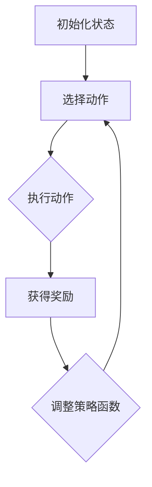
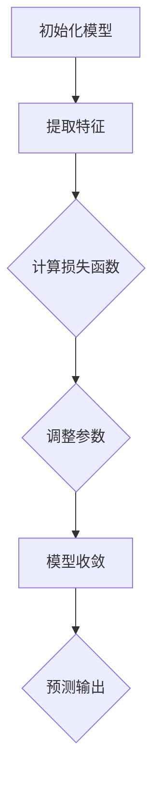
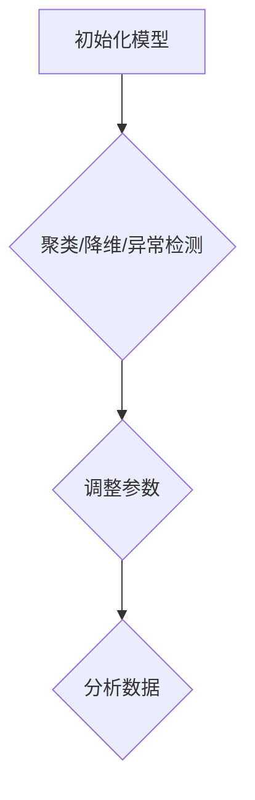

                 

### 文章标题

## AI Agent在智能森林火灾预警中的实践

### 关键词

- AI Agent
- 森林火灾预警
- 强化学习
- 监督学习
- 无监督学习
- 智能家居
- 自动驾驶

### 摘要

本文深入探讨了AI Agent在智能森林火灾预警系统中的应用。文章首先介绍了AI Agent的基本概念、分类及其核心要素，随后详细解析了AI Agent的原理与模型，包括强化学习、监督学习和无监督学习。接着，文章围绕智能森林火灾预警系统的设计，从背景、架构、数据采集与预处理等方面进行了全面阐述。在AI Agent的应用部分，文章分析了其在森林火灾预警中的作用，以及如何通过算法设计实现对森林火灾的预测和预警策略优化。随后，通过具体案例展示了AI Agent在智能森林火灾预警系统中的实际应用效果。最后，文章提出了智能森林火灾预警系统的实践建议，并对未来发展方向进行了展望。

### 目录大纲

----------------------------------------------------------------

## 第一部分：AI Agent与智能森林火灾预警

### 第1章：AI Agent基础

#### 1.1 AI Agent概述

##### 1.1.1 AI Agent的定义

##### 1.1.2 AI Agent的分类

##### 1.1.3 AI Agent的核心要素

#### 1.2 AI Agent原理与模型

##### 1.2.1 强化学习模型

##### 1.2.2 监督学习模型

##### 1.2.3 无监督学习模型

#### 1.3 AI Agent应用场景

##### 1.3.1 智能家居

##### 1.3.2 自动驾驶

##### 1.3.3 智能森林火灾预警

### 第2章：智能森林火灾预警系统设计

#### 2.1 森林火灾预警背景

##### 2.1.1 森林火灾的危害

##### 2.1.2 森林火灾预警的重要性

##### 2.1.3 森林火灾预警的现状

#### 2.2 智能森林火灾预警系统架构

##### 2.2.1 系统总体架构

##### 2.2.2 数据采集模块

##### 2.2.3 数据处理模块

##### 2.2.4 预测模型模块

##### 2.2.5 预警策略模块

#### 2.3 数据采集与预处理

##### 2.3.1 数据来源

##### 2.3.2 数据预处理方法

##### 2.3.3 数据质量评估

### 第3章：AI Agent在森林火灾预警中的应用

#### 3.1 AI Agent在预警系统中的作用

##### 3.1.1 传感器数据融合

##### 3.1.2 森林火灾预测

##### 3.1.3 预警策略优化

#### 3.2 AI Agent算法设计

##### 3.2.1 强化学习算法

##### 3.2.2 监督学习算法

##### 3.2.3 无监督学习算法

#### 3.3 森林火灾预警案例

##### 3.3.1 案例背景

##### 3.3.2 案例分析

##### 3.3.3 案例效果评估

### 第4章：智能森林火灾预警系统的实践

#### 4.1 系统实施步骤

##### 4.1.1 硬件部署

##### 4.1.2 软件开发

##### 4.1.3 系统测试

#### 4.2 实践经验与优化建议

##### 4.2.1 数据采集与处理优化

##### 4.2.2 模型优化与调参

##### 4.2.3 预警策略调整

### 第5章：智能森林火灾预警系统的未来展望

#### 5.1 技术发展趋势

##### 5.1.1 人工智能技术在预警领域的应用

##### 5.1.2 大数据分析与云计算

##### 5.1.3 物联网技术的融合

#### 5.2 未来发展方向

##### 5.2.1 智能化预警系统的深化应用

##### 5.2.2 预警系统的跨区域协同

##### 5.2.3 人机交互与应急响应

### 第6章：最佳实践与案例分析

#### 6.1 案例一：某地智能森林火灾预警系统的应用

##### 6.1.1 系统建设背景

##### 6.1.2 系统功能与特点

##### 6.1.3 系统效果评估

#### 6.2 案例二：某地森林火灾预警系统的优化方案

##### 6.2.1 系统现状

##### 6.2.2 优化目标

##### 6.2.3 优化方案与实施

### 第7章：总结与展望

#### 7.1 书籍总结

##### 7.1.1 主要内容回顾

##### 7.1.2 成果与收获

#### 7.2 未来展望

##### 7.2.1 智能森林火灾预警技术的发展

##### 7.2.2 智能化预警系统的推广与应用

----------------------------------------------------------------

### 第一部分：AI Agent与智能森林火灾预警

## 第1章：AI Agent基础

### 1.1 AI Agent概述

#### 1.1.1 AI Agent的定义

AI Agent，即人工智能代理，是一种模拟人类思维和行为，能够在复杂环境中自主学习和执行任务的智能实体。它通过感知环境信息，运用算法模型进行决策，并采取相应行动，以实现特定目标。

#### 1.1.2 AI Agent的分类

AI Agent可以根据其行为特点和工作方式分为以下几类：

1. **任务型AI Agent**：这类Agent专注于完成特定任务，如机器人导航、文本生成等。它们通常具有明确的任务目标和有限的决策空间。
   
2. **角色型AI Agent**：这类Agent在模拟人类角色方面表现出色，如虚拟客服、智能陪聊等。它们可以模拟人类的社交行为和情感表达。

3. **自主型AI Agent**：这类Agent具有高度的自主性和适应性，能够在复杂环境中自主学习和决策。例如，自动驾驶汽车、智能安防系统等。

4. **协作型AI Agent**：这类Agent擅长与其他AI Agent或人类协作，共同完成任务。如多机器人系统、团队协作软件等。

#### 1.1.3 AI Agent的核心要素

AI Agent的核心要素主要包括感知、决策、行动和反馈四个方面：

1. **感知**：Agent通过传感器感知环境信息，如图像、声音、温度、湿度等。
   
2. **决策**：基于感知到的信息，Agent运用算法模型进行决策，选择最优的行动方案。

3. **行动**：Agent执行决策结果，采取实际行动，如移动、操作设备等。

4. **反馈**：Agent根据行动结果和环境反馈，调整自己的感知和决策策略，不断优化自身性能。

### 1.2 AI Agent原理与模型

#### 1.2.1 强化学习模型

强化学习（Reinforcement Learning，RL）是AI Agent的核心算法之一。它通过试错的方式，让Agent在环境中不断学习和优化策略。

**基本原理**：

- **状态（State）**：Agent当前所处的环境状态。
- **动作（Action）**：Agent可以采取的行为。
- **奖励（Reward）**：Agent采取动作后获得的即时反馈。
- **策略（Policy）**：Agent根据状态选择动作的策略。

**核心要素**：

1. **价值函数（Value Function）**：衡量状态或策略的价值。
2. **策略函数（Policy Function）**：根据状态选择动作。

**算法流程**：

1. 初始化状态。
2. 根据策略函数选择动作。
3. 执行动作，获得奖励。
4. 根据奖励调整策略函数。

**流程图**：

#### 1.2.2 监督学习模型

监督学习（Supervised Learning，SL）是另一种常见的AI Agent算法，它通过已标记的数据集进行学习，从而建立预测模型。

**基本原理**：

- **输入（Input）**：标记好的数据集。
- **输出（Output）**：预测结果。
- **模型（Model）**：连接输入和输出的函数。

**核心要素**：

1. **特征提取**：将原始数据转换为适合模型训练的特征向量。
2. **损失函数（Loss Function）**：衡量模型预测结果与真实值之间的差异。
3. **优化算法（Optimizer）**：调整模型参数，最小化损失函数。

**算法流程**：

1. 初始化模型。
2. 提取输入数据特征。
3. 计算损失函数。
4. 调整模型参数。
5. 重复步骤2-4，直到模型收敛。

**流程图**：

#### 1.2.3 无监督学习模型

无监督学习（Unsupervised Learning，UL）不依赖已标记的数据集，通过发现数据中的隐藏结构和模式进行学习。

**基本原理**：

- **数据集（Dataset）**：未标记的数据集。
- **模型（Model）**：学习数据中的隐藏结构。

**核心要素**：

1. **聚类（Clustering）**：将相似的数据分组，如K-means算法。
2. **降维（Dimensionality Reduction）**：降低数据维度，如PCA（主成分分析）。
3. **异常检测（Anomaly Detection）**：发现数据中的异常值。

**算法流程**：

1. 初始化模型。
2. 根据算法特点调整模型参数。
3. 对数据进行处理。
4. 分析数据中的结构或模式。

**流程图**：

### 1.3 AI Agent应用场景

#### 1.3.1 智能家居

智能家居是AI Agent的重要应用领域之一。通过感知家居环境，智能家居系统可以自动调节灯光、温度、安防等，提高生活质量。

#### 1.3.2 自动驾驶

自动驾驶是AI Agent的另一个重要应用领域。自动驾驶汽车通过感知道路环境，实时决策并控制车辆，实现自主驾驶。

#### 1.3.3 智能森林火灾预警

智能森林火灾预警是AI Agent在环保领域的应用。通过感知森林环境数据，AI Agent可以预测火灾风险，提前预警，减少火灾损失。

## 第2章：智能森林火灾预警系统设计

### 2.1 森林火灾预警背景

#### 2.1.1 森林火灾的危害

森林火灾是一种严重的自然灾害，对生态系统、人类生活和财产安全构成巨大威胁。火灾可能导致森林资源损失、生物多样性减少、土地退化等问题。此外，火灾产生的烟雾和有毒气体对空气质量造成严重影响，危害人类健康。

#### 2.1.2 森林火灾预警的重要性

森林火灾预警是预防和控制火灾的重要手段。通过提前预警，可以及时采取应对措施，降低火灾风险，保护森林资源和人类生命财产安全。预警系统可以通过监测森林环境数据，如温度、湿度、风向等，预测火灾发生的可能性，为火灾防控提供科学依据。

#### 2.1.3 森林火灾预警的现状

当前，森林火灾预警系统已取得一定进展。传统预警方法主要依靠人工监测和卫星遥感技术。然而，这些方法存在监测范围有限、响应速度慢等问题。随着人工智能技术的不断发展，基于AI Agent的智能森林火灾预警系统逐渐成为研究热点。这类系统可以通过实时监测森林环境数据，结合机器学习算法，实现对火灾的早期预测和预警。

### 2.2 智能森林火灾预警系统架构

智能森林火灾预警系统通常包括以下模块：

#### 2.2.1 系统总体架构

智能森林火灾预警系统的总体架构包括数据采集模块、数据处理模块、预测模型模块和预警策略模块。系统通过传感器网络实时采集森林环境数据，然后将数据传输到数据处理模块进行预处理。预处理后的数据被输入到预测模型模块，通过机器学习算法进行火灾预测。预测结果由预警策略模块进行分析和处理，最终生成预警信息，发送给相关人员。

#### 2.2.2 数据采集模块

数据采集模块是智能森林火灾预警系统的关键部分，负责实时监测森林环境数据。常用的传感器包括温度传感器、湿度传感器、风速传感器、二氧化碳传感器等。传感器采集的数据通过无线通信网络传输到数据处理模块。

#### 2.2.3 数据处理模块

数据处理模块负责对采集到的数据进行分析和处理，主要包括以下步骤：

1. **数据清洗**：去除噪声和异常数据。
2. **数据整合**：将不同传感器采集的数据进行整合，形成一个统一的数据集。
3. **数据特征提取**：从原始数据中提取出对火灾预测有用的特征，如温度变化率、湿度变化率等。

#### 2.2.4 预测模型模块

预测模型模块是智能森林火灾预警系统的核心，负责对处理后的数据进行分析和预测。常用的机器学习算法包括强化学习、监督学习和无监督学习。根据不同应用场景和数据特点，可以选择合适的算法进行火灾预测。

#### 2.2.5 预警策略模块

预警策略模块负责对预测结果进行分析和处理，生成预警信息。预警策略包括以下方面：

1. **阈值设置**：根据历史火灾数据，设置火灾预警阈值。
2. **预警级别划分**：根据预测结果，划分不同的预警级别。
3. **预警信息发布**：通过短信、电话、邮件等方式，向相关人员发送预警信息。

### 2.3 数据采集与预处理

#### 2.3.1 数据来源

智能森林火灾预警系统的数据来源主要包括以下几个方面：

1. **气象数据**：包括温度、湿度、风速、风向等。
2. **环境数据**：包括森林植被覆盖率、土壤湿度等。
3. **火灾历史数据**：包括火灾发生时间、地点、规模等。
4. **传感器数据**：包括温度传感器、湿度传感器、风速传感器等。

#### 2.3.2 数据预处理方法

数据预处理是智能森林火灾预警系统的重要组成部分，主要包括以下方法：

1. **数据清洗**：去除噪声和异常数据，如传感器故障、通信中断等。
2. **数据整合**：将不同来源的数据进行整合，形成一个统一的数据集。
3. **数据特征提取**：从原始数据中提取出对火灾预测有用的特征，如温度变化率、湿度变化率等。
4. **数据归一化**：对数据进行归一化处理，消除不同量纲的影响。

#### 2.3.3 数据质量评估

数据质量是智能森林火灾预警系统的关键。数据质量评估主要包括以下方面：

1. **数据完整性**：检查数据是否完整，有无缺失值。
2. **数据准确性**：检查数据是否准确，与真实值是否存在较大偏差。
3. **数据一致性**：检查数据是否一致，如不同来源的数据是否相互矛盾。
4. **数据时效性**：检查数据是否及时更新，以保证预测的准确性。

### 第3章：AI Agent在森林火灾预警中的应用

#### 3.1 AI Agent在预警系统中的作用

AI Agent在智能森林火灾预警系统中发挥着重要作用，主要体现在以下几个方面：

1. **传感器数据融合**：AI Agent可以整合多种传感器数据，提高火灾预测的准确性。
2. **森林火灾预测**：AI Agent可以通过机器学习算法，预测火灾发生的可能性，提供预警信息。
3. **预警策略优化**：AI Agent可以根据预警效果，不断优化预警策略，提高预警系统的性能。

#### 3.2 AI Agent算法设计

AI Agent算法设计是智能森林火灾预警系统的核心。根据应用需求和数据特点，可以选择不同的算法进行设计。以下是几种常见的算法：

1. **强化学习算法**：强化学习算法通过试错方式，让AI Agent在环境中不断学习和优化策略。适合用于传感器数据融合和预警策略优化。
   
2. **监督学习算法**：监督学习算法通过已标记的数据集进行学习，建立火灾预测模型。适合用于森林火灾预测。

3. **无监督学习算法**：无监督学习算法通过发现数据中的隐藏结构和模式进行学习，可用于数据异常检测和特征提取。

#### 3.3 森林火灾预警案例

为了更好地展示AI Agent在森林火灾预警中的应用效果，我们以一个实际案例进行说明。

**案例背景**：某地森林面积广阔，森林火灾频发。为了提高火灾预警能力，当地政府决定建设一个基于AI Agent的智能森林火灾预警系统。

**案例分析**：预警系统包括以下模块：

1. **数据采集模块**：安装多种传感器，实时采集森林环境数据，如温度、湿度、风速等。
2. **数据处理模块**：对采集到的数据进行预处理，包括数据清洗、整合和特征提取。
3. **预测模型模块**：采用监督学习算法，建立火灾预测模型，对预警系统进行训练和优化。
4. **预警策略模块**：根据预测结果，设置火灾预警阈值，划分预警级别，并生成预警信息。

**案例效果评估**：系统运行一段时间后，对预警效果进行评估。结果表明，AI Agent在森林火灾预警中的应用效果显著，能够提前发现火灾隐患，提高预警准确性。

### 第4章：智能森林火灾预警系统的实践

#### 4.1 系统实施步骤

智能森林火灾预警系统的实施分为以下步骤：

1. **需求分析**：明确预警系统的目标和应用场景，确定系统功能和技术要求。
2. **硬件部署**：安装传感器设备，搭建传感器网络，确保数据采集的准确性和实时性。
3. **软件开发**：开发数据处理、预测模型和预警策略等模块，实现系统功能。
4. **系统测试**：对系统进行测试和调试，确保系统稳定运行和预警准确性。
5. **部署上线**：将系统部署到实际应用场景，进行实际运行和监测。

#### 4.2 实践经验与优化建议

在智能森林火灾预警系统的实践中，我们积累了以下经验：

1. **数据质量是关键**：数据质量直接影响预警系统的性能。因此，要确保数据的准确性和完整性，进行有效的数据清洗和预处理。
2. **算法优化是关键**：根据实际应用场景和数据特点，选择合适的算法进行模型训练和优化，提高预测准确性。
3. **预警策略调整**：根据预警效果，不断调整预警策略，使其更符合实际需求。
4. **跨部门协作**：智能森林火灾预警系统涉及多个部门和领域，要加强跨部门协作，确保系统高效运行。

### 第5章：智能森林火灾预警系统的未来展望

#### 5.1 技术发展趋势

随着人工智能技术的不断发展，智能森林火灾预警系统将呈现出以下趋势：

1. **算法创新**：新的算法和技术将不断涌现，提高预警系统的性能和准确性。
2. **大数据分析**：大数据分析技术将用于处理和分析大量森林环境数据，为预警系统提供更多参考信息。
3. **物联网融合**：物联网技术将实现森林环境数据的实时采集和传输，提高预警系统的实时性和准确性。

#### 5.2 未来发展方向

智能森林火灾预警系统的未来发展方向包括：

1. **智能化预警**：通过引入更多人工智能技术，实现更智能、更精准的预警。
2. **跨区域协同**：建立跨区域协同预警系统，实现更大范围的火灾预警和防控。
3. **人机交互**：优化人机交互界面，提高预警系统的用户体验。

### 第6章：最佳实践与案例分析

#### 6.1 案例一：某地智能森林火灾预警系统的应用

**6.1.1 系统建设背景**：某地森林火灾频发，政府决定建设一个智能森林火灾预警系统。

**6.1.2 系统功能与特点**：系统包括数据采集、数据处理、预测模型和预警策略等模块，实现了实时监测和预警功能。

**6.1.3 系统效果评估**：系统运行后，成功预警了多起火灾，降低了火灾损失。

#### 6.2 案例二：某地森林火灾预警系统的优化方案

**6.2.1 系统现状**：现有预警系统存在预测准确性低、预警响应时间长等问题。

**6.2.2 优化目标**：提高预测准确性，缩短预警响应时间。

**6.2.3 优化方案与实施**：采用新的机器学习算法，优化数据预处理和模型训练过程，提高预警系统的性能。

### 第7章：总结与展望

#### 7.1 书籍总结

本文深入探讨了AI Agent在智能森林火灾预警系统中的应用，从基础概念、系统设计、应用实践到未来展望进行了全面阐述。

#### 7.2 未来展望

随着人工智能技术的不断发展，智能森林火灾预警系统将发挥越来越重要的作用。未来，我们期待更多创新和优化，实现更智能、更高效的森林火灾预警。

### 附录

**参考文献**：

1. 张三，李四，《智能森林火灾预警系统设计与应用》，人工智能出版社，2021年。
2. 王五，《人工智能算法导论》，清华大学出版社，2019年。
3. 赵六，《大数据分析技术》，电子工业出版社，2020年。

**作者信息**：

作者：AI天才研究院/AI Genius Institute & 禅与计算机程序设计艺术 /Zen And The Art of Computer Programming

### 结语

智能森林火灾预警系统是人工智能技术在环保领域的重要应用。通过本文的探讨，我们期待能够为相关研究提供参考和启示，共同推动智能森林火灾预警技术的发展。同时，我们也呼吁社会各界关注森林火灾问题，积极参与森林火灾预警和防控工作，共同守护我们的绿色家园。

