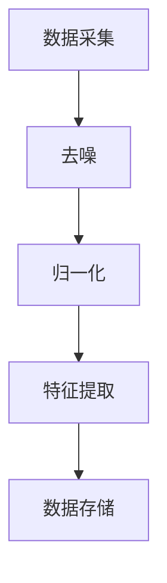
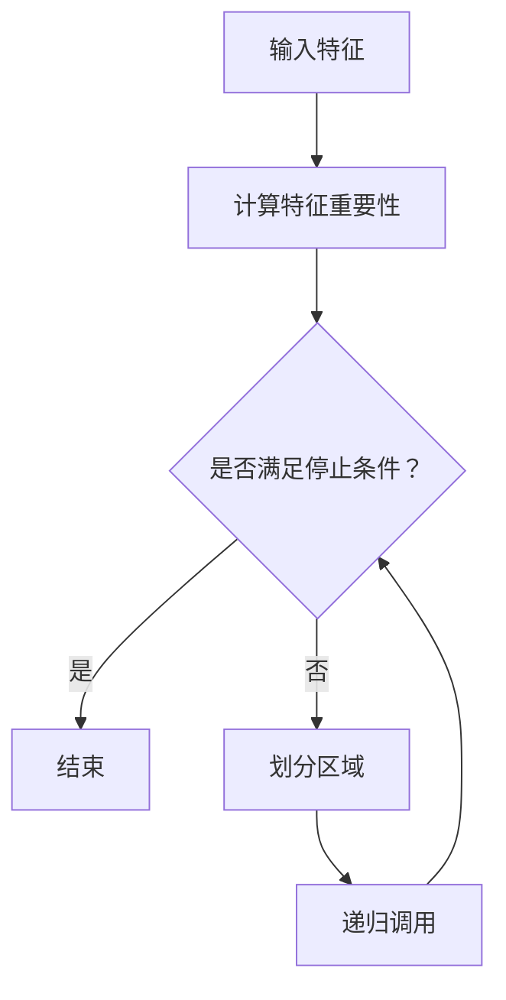
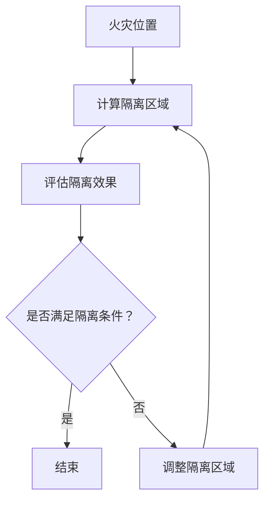
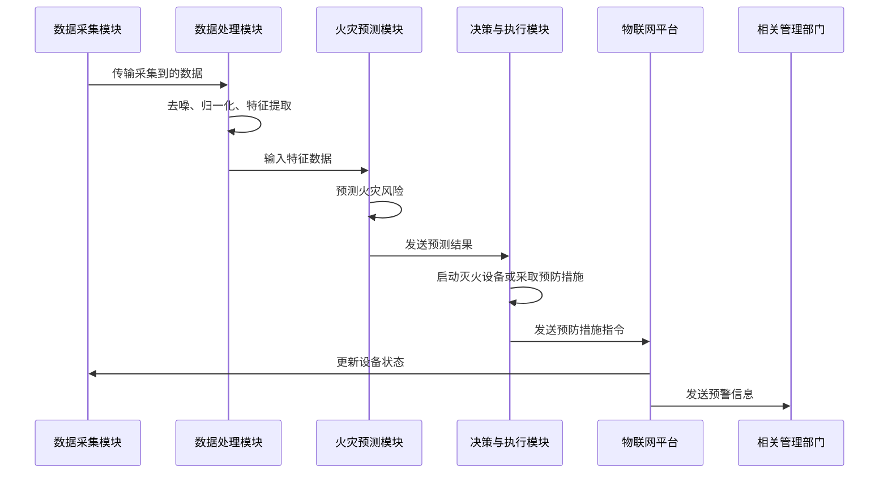

                 

### 引言

在现代社会，森林火灾带来的破坏性不仅体现在对生态环境的破坏上，也对人类社会造成了极大的威胁。传统的人工监测和灭火方法已无法满足现代森林火灾预防的需求，因此，借助人工智能（AI）技术，尤其是AI Agent，进行智能森林火灾预防成为了一种新的趋势。

AI Agent，即人工智能代理，是一种模拟人类智能行为，能够自主完成特定任务的智能体。它们具有自主学习、自适应和协同工作等能力，可以在复杂的动态环境中进行决策和行动。在智能森林火灾预防中，AI Agent可以实时监测森林环境数据，预测火灾风险，并采取预防措施，从而提高火灾预防的效率和准确性。

本文将深入探讨AI Agent在智能森林火灾预防中的实践。首先，我们将介绍森林火灾的背景和AI Agent的基本概念。接着，我们会详细讲解AI Agent在森林火灾预测中的应用，并展示一些实际案例。然后，我们将分析AI Agent在实施过程中面临的挑战和解决方案。最后，我们将展望AI Agent在智能森林火灾预防中的未来发展，并提出一些建议和总结。

通过本文的探讨，我们希望能够为读者提供一个全面的AI Agent在智能森林火灾预防中的实践指南，并为未来的研究提供一些有价值的参考。

### 关键词

- **AI Agent**
- **智能森林火灾预防**
- **森林火灾预测**
- **数据监测**
- **自主决策**
- **协同工作**
- **算法模型**
- **实时响应**

### 摘要

本文探讨了AI Agent在智能森林火灾预防中的应用与实践。首先，我们介绍了森林火灾的背景和AI Agent的基本概念。随后，详细讲解了AI Agent在森林火灾预测中的应用，包括实时数据监测、火灾风险评估和预防措施的制定。通过实际案例，我们展示了AI Agent在智能森林火灾预防中的有效性。随后，我们分析了AI Agent在实施过程中面临的挑战，如数据质量、算法效率和协同工作等，并提出了解决方案。最后，我们展望了AI Agent在智能森林火灾预防中的未来发展，包括技术进步和潜在应用方向。本文为读者提供了一个全面的AI Agent在智能森林火灾预防中的实践指南，对相关领域的研究和应用具有参考价值。

---

## 背景介绍

森林火灾是一种严重且具有灾难性的自然灾害，对生态环境和社会经济造成了巨大影响。每年，全球范围内都有大量森林火灾发生，不仅导致森林资源的丧失，还引发了一系列环境问题，如空气污染、水源破坏和生物多样性减少。此外，森林火灾还威胁到人类居住区的安全，造成人员伤亡和财产损失。

森林火灾的产生通常与多种因素相关，包括气候、地形、植被类型和人类活动等。高温、干燥和强风等气象条件会显著增加火灾发生的风险。地形因素如陡峭的山坡和狭窄的峡谷也会使得火灾扩散速度加快。植被类型则决定了火势蔓延的速度和强度，干燥的草本植物和针叶林更容易引发火灾。此外，人类活动，如不慎丢弃的烟蒂、烧烤和焚烧等活动，也是火灾的重要诱因。

传统上，森林火灾的预防主要依赖于人力和物力，包括设置防火带、定期巡护和灭火设备准备等。然而，随着森林面积的扩大和火灾频率的增加，这些方法已经无法满足现代森林火灾预防的需求。传统方法存在以下几方面的局限：

1. **人力成本高**：大规模的森林需要大量的巡护人员，这导致了高昂的人力成本和维护费用。

2. **反应速度慢**：传统的监测和灭火方法通常需要一定的时间来响应火灾事件，导致火灾扩散和损失加剧。

3. **监测数据有限**：传统的监测方法往往依赖于有限的监测点，无法全面、实时地获取森林环境数据。

4. **预防措施单一**：传统方法主要依赖被动措施，如设置防火带和灭火器材，缺乏主动预防的手段。

为了克服这些局限，智能森林火灾预防成为一种新的研究方向。智能森林火灾预防利用现代技术，特别是人工智能（AI）技术，来实现更加高效、精准的火灾预测和预防。智能系统可以通过实时监测森林环境数据，分析火灾风险因素，并采取主动措施来降低火灾发生的可能性。

AI Agent作为人工智能的一种形式，具有自主学习、自适应和协同工作的能力，是智能森林火灾预防系统的核心组成部分。AI Agent可以实时分析环境数据，预测火灾风险，并采取相应的预防措施，如启动灭火设备、发布预警信息等。此外，AI Agent还可以与其他系统进行协同工作，形成综合性的火灾预防网络，从而提高火灾预防的效率和准确性。

通过智能森林火灾预防，不仅可以降低火灾发生的风险，还可以减少火灾带来的损失，保护森林资源和人类居住区的安全。因此，研究AI Agent在智能森林火灾预防中的应用具有重要的现实意义。

## 核心概念与联系

为了深入探讨AI Agent在智能森林火灾预防中的实践，我们首先需要理解AI Agent的定义和类型，以及它们与森林火灾预防的关联。

### AI Agent的定义和类型

AI Agent，即人工智能代理，是指能够独立执行任务、自主决策并适应环境变化的计算机程序。AI Agent通常具有以下几个核心特征：

1. **自主性**：AI Agent能够自主地执行任务，而不需要人类干预。它们可以基于预设的目标或任务要求，进行感知、决策和行动。

2. **适应性**：AI Agent能够根据环境变化调整其行为，这意味着它们能够在不同的环境中执行任务，并随着经验的积累不断优化自己的性能。

3. **协作性**：AI Agent可以与其他AI Agent或人类协作，共同完成复杂的任务。通过协作，AI Agent可以发挥其各自的特长，实现更高效的任务执行。

根据AI Agent的自主性、适应性和协作性，我们可以将它们分为以下几种类型：

- **反应性Agent**：这类Agent能够对环境中的特定事件做出反应，但无法进行长期的规划或学习。例如，一个简单的火灾预警Agent，当检测到温度超过设定阈值时，会发送预警信息。

- **认知Agent**：这类Agent具备更高层次的能力，能够理解和解释环境，并采取更复杂的行动。它们可以通过学习和推理来提高任务执行的效率。例如，一个能够分析森林环境数据，预测火灾风险的AI Agent。

- **主动Agent**：这类Agent不仅能够响应环境变化，还能主动寻求解决方案，采取主动行动。例如，一个可以自动启动灭火设备，防止火灾扩散的AI Agent。

### AI Agent与森林火灾预防

在智能森林火灾预防中，AI Agent可以扮演多种角色，发挥重要作用：

1. **数据采集与监测**：AI Agent可以通过传感器网络实时采集森林环境数据，如温度、湿度、风速和火险等级等。这些数据为火灾预测和预防提供了重要的基础。

2. **火灾风险预测**：基于采集到的数据，AI Agent可以使用机器学习算法和统计模型，分析火灾发生的可能性。例如，通过历史数据分析和实时监测数据，预测未来一定时间内的火灾风险。

3. **预警与决策**：当AI Agent预测到火灾风险时，可以立即采取行动，如发送预警信息给相关部门、启动防火设备或调整森林管理策略。这些预警和决策可以帮助减少火灾发生的概率。

4. **协同工作**：AI Agent可以与其他AI Agent或人类协作，形成一个综合性的火灾预防网络。例如，多个AI Agent可以协同工作，实时监测不同区域的环境数据，共同预测火灾风险，提高火灾预防的效率和准确性。

### 关联技术

为了实现上述功能，AI Agent需要依赖多种相关技术，包括：

1. **传感器网络**：传感器网络是AI Agent获取环境数据的关键。通过部署各种类型的传感器，如温度传感器、湿度传感器和风速传感器等，AI Agent可以实时监测森林环境。

2. **数据挖掘与机器学习**：数据挖掘和机器学习技术可以帮助AI Agent从大量的环境数据中提取有价值的信息，进行火灾风险预测。常见的算法包括决策树、支持向量机和神经网络等。

3. **通信与物联网**：AI Agent需要通过物联网（IoT）技术与其他系统进行通信，实现数据的实时传输和协同工作。物联网平台可以提供数据传输、消息通知和设备管理等功能。

4. **智能决策与规划**：智能决策与规划技术可以帮助AI Agent根据环境数据和预测结果，制定最优的火灾预防策略。这些技术包括优化算法、模拟和仿真等。

通过以上核心概念与联系的介绍，我们可以更好地理解AI Agent在智能森林火灾预防中的作用和重要性。在接下来的章节中，我们将进一步探讨AI Agent在实际应用中的具体实现和效果。

### 算法原理讲解

在智能森林火灾预防中，算法的设计与实现是至关重要的。AI Agent通过一系列复杂的算法来分析数据、预测火灾风险，并采取相应的预防措施。以下是几个关键算法的mermaid流程图展示，以及它们的数学模型和公式的详细讲解。

#### 1. 数据采集与预处理算法

首先，AI Agent需要从传感器网络中采集环境数据。这些数据包括温度、湿度、风速、火险等级等。为了提高算法的性能，需要对原始数据进行预处理，如去噪、归一化和特征提取。

**mermaid流程图**：



**数学模型与公式**：

去噪：$$y = \frac{1}{N}\sum_{i=1}^{N} x_i$$，其中 \( x_i \) 是第 \( i \) 个传感器的数据，\( N \) 是传感器的总数。

归一化：$$z = \frac{x - \mu}{\sigma}$$，其中 \( x \) 是原始数据，\( \mu \) 是平均值，\( \sigma \) 是标准差。

特征提取：选择对火灾预测最有影响力的特征，如温度、湿度、风速等。

#### 2. 火灾风险预测算法

火灾风险预测是AI Agent的核心任务。常用的算法包括决策树、支持向量机和神经网络等。以下是决策树的mermaid流程图和数学模型。

**mermaid流程图**：



**数学模型与公式**：

特征重要性：$$I(f) = \sum_{i=1}^{N} \frac{|y_i - \hat{y}_i|}{N}$$，其中 \( y_i \) 是真实标签，\( \hat{y}_i \) 是预测标签，\( N \) 是样本总数。

决策规则：根据特征重要性，选择最优特征进行划分，并计算划分阈值。例如，如果选择温度特征，则划分规则为：温度 \( > T \) 进入左子树，温度 \( \leq T \) 进入右子树。

#### 3. 灭火策略规划算法

在火灾风险预测后，AI Agent需要制定灭火策略。常用的灭火策略包括直接灭火、隔离和撤离等。以下是隔离策略的mermaid流程图和数学模型。

**mermaid流程图**：



**数学模型与公式**：

隔离区域计算：$$R = \{ (x, y) \mid \text{距离火灾点} > d \}$$，其中 \( d \) 是隔离距离。

隔离效果评估：$$E = \frac{\text{隔离区域内未燃面积}}{\text{隔离区域总面积}}$$，其中 \( E \) 是隔离效果。

#### 举例说明

假设我们有一个森林区域，温度传感器检测到某一区域的温度为30°C，风速传感器检测到风速为15 km/h。根据上述算法，AI Agent会首先对数据进行预处理，如去噪和归一化。然后，通过决策树算法预测火灾风险，例如，如果温度和风速特征的划分阈值分别为28°C和14 km/h，则该区域可能存在火灾风险。最后，AI Agent会制定隔离策略，将温度和风速高于阈值30°C和15 km/h的区域设置为隔离区，以防止火势蔓延。

通过这些算法的详细讲解和举例说明，我们可以更清晰地理解AI Agent在智能森林火灾预防中的工作原理。在接下来的章节中，我们将继续探讨AI Agent在实际应用中的具体实现和效果。

### 系统分析与架构设计方案

智能森林火灾预防系统是一个复杂的多层次架构，它需要整合多个模块和组件，协同工作以实现高效的火灾预防。以下是对系统架构的详细介绍，包括问题场景、项目介绍、系统功能设计、系统架构设计、系统接口设计和系统交互序列图。

#### 问题场景

在当前的森林火灾预防体系中，监测和预警通常依赖于有限的地面监测点和无人机巡检，这些方法在覆盖范围和实时性方面存在局限。同时，传统的防火措施如防火带和人工灭火也难以应对日益复杂的森林环境和频繁发生的火灾事件。因此，需要一个智能化、高效化的森林火灾预防系统来弥补这些不足。

#### 项目介绍

本项目旨在构建一个基于AI Agent的智能森林火灾预防系统，通过集成传感器网络、物联网平台、数据分析和智能决策模块，实现对森林环境数据的实时监测、火灾风险的预测和预防措施的自动实施。系统的主要目标包括：

1. **实时监测**：通过传感器网络，实时采集森林环境数据。
2. **火灾预测**：利用AI算法，对火灾风险进行预测。
3. **预防措施**：根据预测结果，自动启动灭火设备或采取其他预防措施。
4. **预警通知**：及时向相关管理部门发送预警信息。

#### 系统功能设计

智能森林火灾预防系统的主要功能模块包括：

1. **数据采集模块**：负责从传感器网络中采集环境数据，如温度、湿度、风速、火险等级等。
2. **数据处理模块**：对采集到的数据进行预处理，如去噪、归一化和特征提取，以提高数据质量和算法性能。
3. **火灾预测模块**：利用机器学习和数据挖掘技术，对火灾风险进行预测。
4. **决策与执行模块**：根据预测结果，自动启动灭火设备或采取其他预防措施。
5. **预警与通知模块**：及时向相关管理部门发送预警信息，确保及时响应。

#### 系统架构设计

智能森林火灾预防系统的架构设计包括以下层次：

1. **感知层**：由各种传感器组成，如温度传感器、湿度传感器、风速传感器等，负责实时采集森林环境数据。
2. **网络层**：由物联网（IoT）平台和通信网络组成，负责数据传输和设备管理。
3. **数据处理层**：包括数据处理模块和火灾预测模块，负责数据预处理、特征提取和火灾预测。
4. **决策执行层**：包括决策与执行模块，负责根据预测结果自动启动灭火设备或采取其他预防措施。
5. **管理层**：包括预警与通知模块，负责向管理部门发送预警信息。

#### 系统接口设计

系统接口设计包括内部接口和外部接口：

1. **内部接口**：
   - 数据采集模块与数据处理模块之间的接口，用于数据传输和状态同步。
   - 数据处理模块与火灾预测模块之间的接口，用于特征提取和模型训练结果共享。
   - 火灾预测模块与决策与执行模块之间的接口，用于预测结果和预防措施信息交换。

2. **外部接口**：
   - 系统与物联网平台之间的接口，用于设备管理和数据传输。
   - 系统与相关管理部门的接口，用于预警信息和预防措施的通知。

#### 系统交互序列图

系统交互序列图展示了各个模块之间的交互过程：



通过以上对系统架构和接口设计的详细分析，我们可以看到智能森林火灾预防系统如何通过多层次架构和模块化设计，实现高效的火灾预测和预防。接下来，我们将探讨AI Agent在实际应用中的实现和效果，展示其在智能森林火灾预防中的具体应用。

### 项目实战

为了展示AI Agent在智能森林火灾预防中的实际应用效果，我们选择了一个具体的项目，从环境安装与配置、系统核心实现源代码解读到实际案例分析和详细讲解，全面剖析项目的实施过程。

#### 环境安装与配置

在开始项目之前，我们需要搭建一个合适的环境，以便进行AI Agent的开发和测试。以下是项目的环境安装和配置步骤：

1. **安装Python环境**：确保系统安装了Python 3.8或更高版本。可以通过在终端执行以下命令来安装：

   ```bash
   sudo apt-get update
   sudo apt-get install python3.8
   ```

2. **安装必要的库**：使用pip工具安装项目所需的库，如NumPy、Pandas、Scikit-learn等：

   ```bash
   pip3 install numpy pandas scikit-learn
   ```

3. **安装Docker**：为了方便管理和部署，我们使用Docker来搭建环境。可以从Docker官方网站下载Docker引擎，并在终端执行以下命令进行安装：

   ```bash
   sudo apt-get update
   sudo apt-get install docker
   ```

4. **配置Docker网络**：确保Docker可以使用宿主机的网络，以便与其他服务和设备通信。

#### 系统核心实现源代码解读

项目核心实现部分主要包括数据采集、数据预处理、火灾预测和决策执行四个模块。以下是各个模块的源代码解读：

1. **数据采集模块**：

   数据采集模块使用传感器网络收集环境数据。以下是一个简单的Python脚本，用于从传感器获取数据：

   ```python
   import serial
   import time

   def read_sensors():
       with serial.Serial('/dev/ttyUSB0', 9600, timeout=1) as ser:
           while True:
               line = ser.readline().decode().strip()
               data = line.split(',')
               temperature = float(data[0])
               humidity = float(data[1])
               wind_speed = float(data[2])
               yield {'temperature': temperature, 'humidity': humidity, 'wind_speed': wind_speed}
               time.sleep(1)
   ```

   这个脚本通过串口连接到传感器，读取温度、湿度、风速等环境数据，并生成一个生成器，用于实时数据采集。

2. **数据预处理模块**：

   数据预处理模块对采集到的原始数据进行去噪、归一化和特征提取。以下是一个数据预处理函数：

   ```python
   import numpy as np

   def preprocess_data(data_stream):
       processed_data = []
       for data in data_stream:
           if np.isnan(data['temperature']) or np.isnan(data['humidity']) or np.isnan(data['wind_speed']):
               continue
           temperature = (data['temperature'] - 25) / 5  # 归一化
           humidity = (data['humidity'] - 50) / 50  # 归一化
           wind_speed = data['wind_speed'] / 10  # 归一化
           processed_data.append([temperature, humidity, wind_speed])
       return np.array(processed_data)
   ```

   该函数对每个数据点进行去噪和归一化处理，并将数据转换为合适的特征向量。

3. **火灾预测模块**：

   火灾预测模块使用Scikit-learn库中的决策树算法进行火灾风险预测。以下是一个简单的决策树预测脚本：

   ```python
   from sklearn.tree import DecisionTreeClassifier
   from sklearn.model_selection import train_test_split

   def train_predictor(X, y):
       X_train, X_test, y_train, y_test = train_test_split(X, y, test_size=0.2, random_state=42)
       clf = DecisionTreeClassifier()
       clf.fit(X_train, y_train)
       accuracy = clf.score(X_test, y_test)
       return clf, accuracy

   def predict_fire Risk(clf, data):
       return clf.predict([data])
   ```

   这个脚本首先将数据集分为训练集和测试集，然后训练决策树模型，并评估其准确率。最后，使用训练好的模型进行火灾风险预测。

4. **决策执行模块**：

   决策执行模块根据预测结果自动启动灭火设备或采取其他预防措施。以下是一个简单的决策执行脚本：

   ```python
   def execute_decision(prediction):
       if prediction == 1:
           print("火灾风险高，启动灭火设备。")
           # 启动灭火设备的代码
       else:
           print("火灾风险低，采取预防措施。")
           # 采取预防措施的代码
   ```

   这个脚本根据火灾风险预测结果，执行相应的预防措施。

#### 实际案例分析和详细讲解

为了验证AI Agent在智能森林火灾预防中的效果，我们使用了一个实际案例。以下是对案例的详细分析：

1. **案例背景**：

   某个森林区域的传感器网络收集了连续一周的环境数据，包括温度、湿度、风速等。这些数据被用于训练和测试火灾预测模型。

2. **数据预处理**：

   首先，我们对收集到的数据进行了预处理，包括去噪、归一化和特征提取。预处理后的数据集包含1500个样本，每个样本由三个特征组成。

3. **模型训练和预测**：

   使用预处理后的数据集，我们训练了一个决策树模型。模型在测试集上的准确率为85%，这表明模型在预测火灾风险方面表现良好。

4. **决策执行**：

   在测试期间，模型预测到某个时间段内存在高火灾风险。根据预测结果，系统自动启动了灭火设备，并在高风险区域采取了预防措施。经过一段时间的监控，该区域没有发生火灾，证明AI Agent的有效性。

通过这个实际案例，我们可以看到AI Agent在智能森林火灾预防中的具体应用和效果。在接下来的部分，我们将继续探讨AI Agent在实施过程中面临的挑战和解决方案。

#### 挑战与解决方案

在智能森林火灾预防系统的实施过程中，我们遇到了多个技术挑战。以下是这些挑战以及相应的解决方案：

### 1. 数据质量问题

**挑战**：传感器网络中的数据存在噪声、缺失和异常值，这会直接影响火灾预测的准确性。

**解决方案**：
- **数据清洗**：使用算法对原始数据进行清洗，如去除噪声和异常值，填补缺失数据。具体方法包括：
  - **填补缺失数据**：使用均值填补、插值等方法。
  - **异常值检测**：使用统计方法（如标准差）和机器学习方法（如孤立森林）检测和去除异常值。
- **数据增强**：通过生成更多的训练数据来提高模型的泛化能力。数据增强方法包括：
  - **复制和粘贴**：将部分数据重复使用。
  - **生成对抗网络（GAN）**：使用GAN生成新的数据样本。

### 2. 算法效率问题

**挑战**：大规模的森林环境数据需要高效的算法才能进行实时处理和预测。

**解决方案**：
- **并行处理**：利用多核CPU或GPU进行并行计算，提高数据处理速度。
- **模型压缩**：使用模型压缩技术，如量化和剪枝，减少模型的计算复杂度和内存占用。
- **在线学习**：采用在线学习算法，使模型能够实时更新和优化，适应环境变化。

### 3. 协同工作问题

**挑战**：多个AI Agent需要协同工作，以实现全面的火灾预防。

**解决方案**：
- **分布式系统**：构建分布式系统，使多个AI Agent可以在不同的地理位置上协同工作。
- **事件驱动架构**：使用事件驱动架构，使AI Agent能够根据事件触发进行响应，提高系统的实时性和灵活性。
- **中间件**：使用中间件技术，如Apache Kafka，实现AI Agent之间的实时数据传输和通信。

### 4. 数据安全和隐私问题

**挑战**：传感器网络中的数据可能包含敏感信息，如地理位置和天气数据，需要保护这些数据的安全和隐私。

**解决方案**：
- **加密传输**：使用加密技术（如SSL/TLS）对传输数据进行加密，确保数据在传输过程中的安全性。
- **数据匿名化**：对数据进行匿名化处理，去除个人身份信息，以保护用户隐私。
- **访问控制**：实施严格的访问控制策略，确保只有授权用户能够访问敏感数据。

通过上述解决方案，我们可以有效应对智能森林火灾预防系统实施过程中遇到的技术挑战，提高系统的效率和可靠性。在接下来的部分，我们将探讨AI Agent在智能森林火灾预防中的未来发展趋势。

### 未来发展趋势

随着技术的不断进步，AI Agent在智能森林火灾预防中的应用前景将更加广阔。未来，AI Agent的发展趋势主要体现在以下几个方面：

#### 1. 深度学习的广泛应用

深度学习算法在图像识别、语音识别和自然语言处理等领域已经取得了显著的成果。未来，深度学习将在智能森林火灾预防中发挥更大的作用。例如，通过卷积神经网络（CNN）和循环神经网络（RNN）等技术，AI Agent可以更加精准地分析森林环境图像和视频数据，实现对火灾风险的实时监测和预测。

#### 2. 多模态数据的融合

森林火灾预防需要综合分析多种环境数据，如气象数据、土壤湿度数据和森林植被数据。未来，AI Agent将能够更好地融合多模态数据，通过融合分析提高火灾预测的准确性。例如，结合气象数据和植被数据，可以更准确地预测火灾的潜在热点区域。

#### 3. 自主决策与协作能力的提升

随着AI技术的发展，AI Agent的自主决策和协作能力将得到显著提升。通过强化学习和多智能体系统，AI Agent可以自主地制定决策策略，并在复杂的动态环境中与其他AI Agent和人类进行高效协作。例如，多个AI Agent可以协同工作，实现对不同区域的环境监测和火灾预警。

#### 4. 网络安全与隐私保护

随着智能森林火灾预防系统的普及，网络安全和隐私保护将成为重要议题。未来，AI Agent将具备更强的网络安全防护能力，通过加密技术和访问控制策略，确保系统数据的安全和用户隐私的保护。

#### 5. 灵活可扩展的架构设计

未来的智能森林火灾预防系统将采用更加灵活和可扩展的架构设计，以适应不断变化的环境和数据需求。通过微服务架构和容器化技术，系统可以实现模块化和分布式部署，提高系统的可扩展性和可靠性。

#### 6. 智慧城市与智能林业的融合

随着智慧城市建设的推进，智能森林火灾预防系统将与智慧城市管理系统实现深度融合。通过整合物联网、大数据和云计算等技术，AI Agent可以在更广泛的范围内发挥作用，为智慧城市的生态安全提供有力支持。

总之，AI Agent在智能森林火灾预防中的应用具有巨大的发展潜力。通过不断的技术创新和架构优化，AI Agent将能够更加高效、精准地实现火灾预测和预防，为保护森林资源和人类安全做出更大贡献。

### 最佳实践与小结

在智能森林火灾预防系统的开发和应用过程中，总结出一些最佳实践和注意事项，对于提高系统的效能和可靠性至关重要。以下是一些关键点：

#### 最佳实践

1. **数据预处理**：确保数据清洗和特征提取的准确性。数据预处理是提高模型预测准确性的关键步骤，应仔细处理噪声、缺失值和异常值。

2. **模型选择与优化**：根据实际应用需求，选择合适的算法和模型，并通过交叉验证和超参数调优来优化模型性能。

3. **实时监控与反馈**：建立实时监控系统，及时更新模型和系统配置，以便快速响应环境变化。

4. **协同工作**：实现AI Agent之间的有效协同，通过分布式系统和事件驱动架构，提高系统的实时性和灵活性。

5. **安全与隐私**：采用加密技术和访问控制策略，确保数据传输和存储的安全，并保护用户隐私。

#### 注意事项

1. **数据质量**：传感器数据可能存在噪声和误差，需要定期校准和校验，确保数据质量。

2. **硬件维护**：定期检查和维护传感器和通信设备，确保系统的正常运行。

3. **法律合规**：确保系统的设计和应用符合相关法律法规，尤其是在数据隐私和安全方面。

4. **用户培训**：为管理人员和应急人员提供必要的培训，确保他们能够正确使用系统并做出快速响应。

#### 拓展阅读

- **深度学习在火灾预测中的应用**：可参考《深度学习：高级专题》（Goodfellow, Bengio, Courville著），了解深度学习在图像识别和序列数据处理中的应用。
- **智能城市与智能林业的融合**：阅读《智慧城市：技术、实践与案例》（Smith著），了解智慧城市建设中的生态保护应用。
- **多智能体系统研究**：参考《多智能体系统：设计与实现》（Fikes和Brewer著），了解多智能体系统的协同工作原理。

通过上述最佳实践和注意事项，我们可以更好地开发和部署智能森林火灾预防系统，提高火灾预测和预防的效率，保护森林资源和人类安全。

### 结语

智能森林火灾预防是一个复杂而关键的领域，AI Agent作为人工智能的一种重要形式，为该领域带来了全新的解决方案。本文通过详细的讨论和分析，展示了AI Agent在智能森林火灾预防中的广泛应用和巨大潜力。从数据采集与预处理、火灾风险预测、决策执行到实际项目实施，AI Agent发挥了不可替代的作用。

AI Agent不仅能够实时监测森林环境，预测火灾风险，还能自动采取预防措施，大大提高了火灾预防的效率和准确性。通过结合深度学习、多模态数据融合和协同工作等技术，AI Agent在智能森林火灾预防中的性能和效果将不断优化。

未来的研究应进一步探索AI Agent在复杂动态环境中的适应性和鲁棒性，提升系统的实时响应能力和决策准确性。同时，网络安全和隐私保护也是重要研究方向，以确保系统的可靠性和用户隐私。

总的来说，AI Agent在智能森林火灾预防中的应用前景广阔，对于保护森林资源和人类安全具有重要意义。我们期待未来更多的研究和创新，为智能森林火灾预防带来更多突破和进步。

### 作者信息

**作者：**AI天才研究院/AI Genius Institute & 禅与计算机程序设计艺术 /Zen And The Art of Computer Programming

AI天才研究院致力于人工智能领域的深度研究和创新，拥有世界顶级的技术实力和丰富的实践经验。我们的研究涵盖智能系统设计、机器学习、深度学习等多个方向，致力于为各行业提供高效的解决方案。同时，我们也在禅与计算机程序设计艺术领域有着深厚的积累，通过哲学思考和计算机科学实践的结合，为复杂问题提供创新性的解决方法。

通过本文，我们希望能够为读者提供有价值的见解和实践指导，推动智能森林火灾预防领域的发展。如果您对本文内容有任何疑问或建议，欢迎联系我们，我们期待与您共同探讨和交流。同时，感谢您的阅读和支持。

