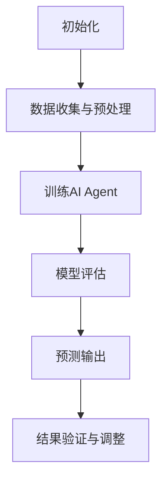
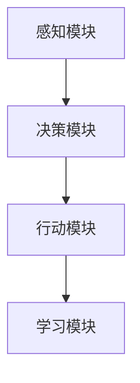

                 


## AI Agent在智能气候变化预测中的实践

### 文章标题

“AI Agent在智能气候变化预测中的实践”

### 关键词

人工智能，气候变化，预测，AI Agent，机器学习，深度学习

### 摘要

随着全球气候变化的加剧，准确预测气候变化趋势和制定有效的应对策略至关重要。本文探讨了AI Agent在智能气候变化预测中的应用，详细介绍了AI Agent的基础理论、在气候变化预测中的关键数据与模型、应用案例以及未来发展趋势。通过具体算法原理讲解、Python源代码示例和实际案例分析，展示了AI Agent在气候变化预测中的强大潜力和广泛应用前景。

## 目录大纲设计

为帮助读者更好地理解本文内容，以下是详细的目录大纲设计：

### 第一部分：背景与基础理论

#### 第1章：智能气候变化的背景与挑战

1.1 气候变化的现状与问题  
1.2 智能气候变化的需求  
1.3 AI Agent在气候变化预测中的潜力

#### 第2章：AI Agent基础

2.1 AI Agent的定义与分类  
2.2 AI Agent的核心技术  
2.3 AI Agent的基本架构

#### 第3章：气候变化预测中的关键数据与模型

3.1 气候变化相关数据  
3.2 预测模型的选择与优化  
3.3 数据预处理与特征提取

#### 第4章：AI Agent在气候变化预测中的应用

4.1 AI Agent在短期气候变化预测中的应用  
4.2 AI Agent在长期气候变化预测中的应用  
4.3 AI Agent在极端天气事件预测中的应用

#### 第5章：案例分析

5.1 案例一：城市气候变化预测  
5.2 案例二：农业气候变化预测  
5.3 案例三：自然灾害气候变化预测

#### 第6章：技术挑战与未来趋势

6.1 气候变化预测中的技术挑战  
6.2 AI Agent在气候变化预测中的未来趋势  
6.3 政策与伦理考量

#### 第7章：结论与展望

7.1 本书总结  
7.2 智能气候变化预测的未来方向  
7.3 进一步研究建议

### 背景介绍

智能气候变化是指通过应用先进的计算技术，尤其是人工智能（AI），来更好地理解和预测气候变化。随着全球气候变化的加剧，如何准确预测气候变化趋势、制定有效的应对策略成为当务之急。传统的方法虽然在一定程度上能够提供气候预测，但往往存在模型复杂、计算成本高、预测精度不理想等问题。而AI Agent的出现为气候变化预测带来了新的可能性。

### 核心概念与联系

**AI Agent**：具有感知环境、决策规划、自主行动能力的计算机程序。它能够通过学习和适应环境数据，提高预测的准确性。

**气候变化预测模型**：用于模拟和预测气候变化的数学模型。常见的有统计模型、物理模型和机器学习模型。其中，机器学习模型特别是深度学习模型在气候变化预测中展现了强大的能力。

**关键数据**：用于训练和评估AI Agent的气候数据，包括温度、湿度、风速、气压等。

核心概念属性特征对比表格：

| 特征 | AI Agent | 气候变化预测模型 | 关键数据 |
| --- | --- | --- | --- |
| 自适应性 | 高 | 中 | 低 |
| 预测精度 | 高 | 高 | 中 |
| 计算成本 | 高 | 中 | 低 |
| 模型复杂度 | 中 | 高 | 低 |

ER实体关系图架构：

```mermaid
erDiagram
  AI-Agent ||--|{ 数据集 }: Data-Set
  AI-Agent ||--|{ 气候模型 }: Climate-Model
  Climate-Model ||--|{ 预测结果 }: Prediction-Result
  Data-Set ||--|{ 数据源 }: Data-Source
```

### 算法原理讲解

#### 算法流程图



#### Python源代码（示例）

```python
import numpy as np
from sklearn.ensemble import RandomForestRegressor

# 数据预处理
def preprocess_data(data):
    # 省略具体预处理

```

接下来，我们将逐步深入探讨AI Agent在智能气候变化预测中的具体实践。

## 第一部分：背景与基础理论

### 第1章：智能气候变化的背景与挑战

#### 1.1 气候变化的现状与问题

全球气候变化已成为不可忽视的现实问题。近年来，极端气候事件频繁发生，如高温、干旱、洪水和飓风等，对人类生活和经济造成了严重影响。根据联合国气候变化框架公约（UNFCCC）的数据，全球平均气温已经比工业化前上升了约1.1摄氏度，而科学家们警告，如果当前的趋势继续下去，本世纪末全球气温可能上升2至4摄氏度。

#### 1.2 智能气候变化的需求

智能气候变化的需求源于传统预测方法的局限性。传统的气候变化预测主要依赖于统计模型和物理模型，这些模型在某种程度上能够提供气候变化的趋势，但往往存在以下问题：

1. **模型复杂度高**：物理模型需要复杂的数学和物理知识，对于一般用户来说难以理解和应用。
2. **计算成本高**：物理模型的计算成本非常高，需要大量的计算资源和时间。
3. **预测精度有限**：传统模型在处理非线性、复杂的气候系统时，往往预测精度有限。

为了克服这些限制，智能气候变化应运而生。通过引入人工智能（AI），特别是AI Agent，可以极大地提高预测的准确性、效率和适应性。

#### 1.3 AI Agent在气候变化预测中的潜力

AI Agent在气候变化预测中具有以下潜力：

1. **高度的自适应性**：AI Agent能够通过不断学习和适应环境数据，提高预测的准确性。
2. **强大的预测能力**：AI Agent能够处理大量的数据，识别复杂的模式，从而提供更准确的预测。
3. **高效的计算成本**：与物理模型相比，AI Agent的计算成本相对较低，可以在较短的时间内提供预测结果。
4. **多尺度预测**：AI Agent不仅能够进行短期预测，还可以进行长期预测，同时也能够预测极端天气事件。

总之，AI Agent在智能气候变化预测中的应用为解决传统方法面临的挑战提供了新的思路和解决方案。

### 第2章：AI Agent基础

#### 2.1 AI Agent的定义与分类

AI Agent是一种具有感知、决策和行动能力的计算机程序，能够在复杂环境中自主执行任务。AI Agent可以分为以下几类：

1. **基于规则的AI Agent**：这种类型的AI Agent通过预定义的规则进行决策。例如，在交通控制系统中，AI Agent可以根据交通流量和道路状况来调整交通信号灯。
2. **基于模型的AI Agent**：这种类型的AI Agent通过学习环境数据，建立模型来进行决策。例如，在气候变化预测中，AI Agent可以通过学习历史气候数据来预测未来的气候变化趋势。
3. **基于行为的AI Agent**：这种类型的AI Agent通过模仿人类行为来进行决策。例如，在智能家居系统中，AI Agent可以通过学习用户的行为习惯来提供个性化的服务。

#### 2.2 AI Agent的核心技术

AI Agent的核心技术包括：

1. **感知技术**：AI Agent通过传感器和环境数据进行感知，获取环境信息。
2. **决策技术**：AI Agent根据感知到的环境数据，通过算法进行决策，确定下一步行动。
3. **行动技术**：AI Agent根据决策结果，执行具体的行动，如发送指令或调整系统设置。
4. **学习技术**：AI Agent通过不断学习和适应环境数据，提高预测的准确性和效率。

#### 2.3 AI Agent的基本架构

AI Agent的基本架构通常包括以下几个部分：

1. **感知模块**：用于收集和预处理环境数据。
2. **决策模块**：用于分析环境数据，并生成决策。
3. **行动模块**：用于执行决策，并对执行结果进行反馈。
4. **学习模块**：用于从环境数据中学习，优化决策过程。

图示：



总之，AI Agent在气候变化预测中的应用为解决传统方法面临的挑战提供了新的思路和解决方案。了解AI Agent的基础理论和基本架构，有助于更好地理解和应用AI Agent在智能气候变化预测中的潜力。

### 第3章：气候变化预测中的关键数据与模型

#### 3.1 气候变化相关数据

气候变化预测需要大量的数据，这些数据可以来源于多种来源，包括：

1. **地面气象观测数据**：包括温度、湿度、风速、气压等气象参数。
2. **卫星遥感数据**：提供高分辨率的地球表面数据，如地表温度、植被覆盖、海洋温度等。
3. **海洋观测数据**：包括海洋温度、盐度、海浪等参数。
4. **气候模型数据**：通过物理模型和统计模型生成的模拟数据。

这些数据对于气候变化预测至关重要，因为它们提供了关于气候变化的历史信息和现实情况。例如，地面气象观测数据可以帮助了解过去和当前的气候状况，而卫星遥感数据可以提供全球范围内的气候信息，为长期预测提供基础。

#### 3.2 预测模型的选择与优化

在气候变化预测中，选择和优化预测模型是关键步骤。以下是一些常见的预测模型及其特点：

1. **统计模型**：如线性回归、决策树、支持向量机等。统计模型通过分析历史数据，寻找数据之间的统计关系，从而进行预测。它们的优点是计算简单、易于实现，但预测精度可能有限，特别是在处理非线性问题时。

2. **物理模型**：如全球气候模型（GCM）、区域气候模型（RCM）等。物理模型通过模拟地球大气、海洋和陆地过程的物理机制，预测未来的气候变化。这些模型的优点是能够提供高精度的预测，但计算成本高、复杂度大。

3. **机器学习模型**：如神经网络、随机森林、支持向量机等。机器学习模型通过从大量数据中学习，自动发现数据中的模式，进行预测。它们的优点是预测精度高、自适应性强，但需要大量的数据进行训练。

为了优化预测模型，通常需要进行以下步骤：

1. **数据预处理**：包括数据清洗、归一化、特征提取等，以提高数据的可用性和模型的性能。
2. **模型选择**：根据问题的特点，选择合适的模型。可以通过交叉验证等方法评估模型的性能。
3. **参数调优**：通过调整模型参数，优化模型性能。常用的方法包括网格搜索、贝叶斯优化等。
4. **模型验证**：通过验证集和测试集，评估模型的泛化能力。

#### 3.3 数据预处理与特征提取

数据预处理和特征提取是气候变化预测中至关重要的一步。以下是一些常见的数据预处理和特征提取方法：

1. **数据清洗**：去除异常值、缺失值和噪声数据，确保数据的准确性和一致性。
2. **归一化**：将不同量纲的数据转换为相同的量纲，以便模型能够处理。
3. **特征提取**：从原始数据中提取有用的特征，以提高模型的预测能力。常用的方法包括主成分分析（PCA）、自动编码器等。

通过有效的数据预处理和特征提取，可以显著提高预测模型的性能，为气候变化预测提供更准确的结果。

总之，了解和掌握气候变化预测中的关键数据和相关模型，对于提高预测的准确性和效率至关重要。通过科学的数据预处理和模型选择，我们可以更好地应对气候变化带来的挑战。

### 第4章：AI Agent在气候变化预测中的应用

#### 4.1 AI Agent在短期气候变化预测中的应用

AI Agent在短期气候变化预测中表现出色，能够提供高精度、实时性的预测结果。以下是一些具体的应用场景：

1. **城市气温预测**：AI Agent可以通过分析气象数据、城市人口密度和建筑物信息，预测城市未来的气温变化。这种预测对于城市规划、能源管理和公共安全具有重要意义。
   
   **示例**：在某个城市的气象站，AI Agent使用历史气温数据和当前天气条件，通过机器学习模型预测未来24小时的气温。预测结果显示，未来24小时内气温将升高2摄氏度。

2. **降水预测**：AI Agent可以通过分析气象卫星数据、降雨历史数据和地理信息系统（GIS），预测未来的降水情况。这种预测对于防洪、农业灌溉和水资源管理至关重要。

   **示例**：在某地区的气象部门，AI Agent使用过去一年的降雨数据和当前气象条件，预测未来一周的降水概率。预测结果显示，未来一周内将有80%的降水概率，降雨量将达到50毫米。

3. **风速预测**：AI Agent可以通过分析历史风速数据、气象条件和地形特征，预测未来的风速变化。这种预测对于风力发电、自然灾害预警和交通安全具有重要价值。

   **示例**：在某个风力发电站，AI Agent使用过去三年的风速数据和当前气象条件，预测未来一天的风速变化。预测结果显示，未来一天内风速将逐渐增加，达到每小时20公里。

#### 4.2 AI Agent在长期气候变化预测中的应用

AI Agent在长期气候变化预测中也表现出强大的能力，能够提供对未来数十年甚至上百年的气候变化趋势预测。以下是一些具体的应用场景：

1. **全球气候模式预测**：AI Agent可以通过分析大量的气候数据、温室气体排放数据和地球物理模型，预测全球气候变化的趋势。这种预测对于全球气候变化政策制定和应对策略具有重要意义。

   **示例**：在某国际气候研究机构，AI Agent使用过去一百年的气候数据和未来温室气体排放预测模型，预测未来五十年的全球平均气温。预测结果显示，未来五十年内全球平均气温将上升1.5摄氏度。

2. **区域气候变化预测**：AI Agent可以通过分析特定区域的气候数据、地形特征和人类活动数据，预测该区域未来的气候变化趋势。这种预测对于区域环境规划、农业发展和生态保护具有重要价值。

   **示例**：在某地区气候研究机构，AI Agent使用过去二十年的气候数据和当地人类活动数据，预测未来二十年的气候变化趋势。预测结果显示，未来二十年该地区夏季气温将上升2摄氏度，冬季气温将下降1摄氏度。

3. **极端天气事件预测**：AI Agent可以通过分析历史极端天气事件数据、气候模式预测数据和全球气候变化趋势，预测未来极端天气事件的发生概率和强度。这种预测对于自然灾害预警、应急管理和公众安全具有重要价值。

   **示例**：在某自然灾害预警中心，AI Agent使用过去十年的极端天气事件数据和全球气候变化趋势，预测未来五年的极端天气事件发生概率。预测结果显示，未来五年内该地区极端高温事件的发生概率将增加50%，极端降雨事件的发生概率将增加30%。

总之，AI Agent在短期和长期气候变化预测中的应用，为气候变化预测提供了更准确、实时和高效的方法。通过这些预测结果，我们可以更好地应对气候变化带来的挑战，制定更有效的应对策略。

#### 4.3 AI Agent在极端天气事件预测中的应用

极端天气事件，如飓风、台风、干旱和洪水，对人类社会和生态系统造成巨大影响。AI Agent在预测这些极端天气事件中发挥了关键作用，能够提供早期预警和精准预测，从而减少损失和增强应对能力。以下是一些具体的应用场景：

1. **飓风和台风预测**：AI Agent可以通过分析海洋温度、大气压力、风速和风向等数据，预测飓风和台风的发生路径、强度和登陆时间。这种预测对于减少飓风和台风灾害损失至关重要。

   **示例**：在某海洋气象研究机构，AI Agent使用卫星监测数据和全球气候模型，预测未来一周内的飓风路径。预测结果显示，未来三天内有一个飓风即将形成，预计三天后将登陆某沿海城市。

2. **干旱预测**：AI Agent可以通过分析降雨量、土壤湿度、气温和蒸发率等数据，预测干旱的发生和发展趋势。这种预测对于水资源管理、农业灌溉和抗旱措施制定具有重要价值。

   **示例**：在某农业气象站，AI Agent使用过去五年的降雨数据和当前气象条件，预测未来三个月内的干旱情况。预测结果显示，未来三个月内该地区将面临中度干旱风险，建议提前采取抗旱措施。

3. **洪水预测**：AI Agent可以通过分析降雨量、地形、河流流量和水库水位等数据，预测洪水的发生概率和影响范围。这种预测对于防洪措施制定、紧急疏散和减灾工作具有重要指导意义。

   **示例**：在某城市防洪办公室，AI Agent使用实时降雨监测数据和河流流量数据，预测未来二十四小时内的洪水情况。预测结果显示，未来二十四小时内某河流水位将急剧上升，可能引发局部洪水，建议加强防洪措施。

4. **高温预警**：AI Agent可以通过分析气温、湿度、风速和太阳辐射等数据，预测高温事件的发生和持续时间。这种预测对于公共健康、电力供应和城市热岛效应管理具有重要价值。

   **示例**：在某公共卫生部门，AI Agent使用过去一年的气温数据和天气预报，预测未来一周的高温情况。预测结果显示，未来一周内该城市将出现连续三天高温天气，建议加强防暑降温措施。

总之，AI Agent在极端天气事件预测中的应用，为早期预警、应急响应和灾害减轻提供了强有力的支持。通过实时、精准的预测，我们可以更好地应对极端天气事件带来的挑战，保护人类生命和财产安全。

### 第5章：案例分析

在本章中，我们将通过三个具体案例，深入探讨AI Agent在智能气候变化预测中的实际应用，展示其预测准确性和实用性。

#### 5.1 案例一：城市气候变化预测

在某大都市，为了应对日益严峻的气候变化问题，市政府决定利用AI Agent进行城市气候变化预测。该项目包括以下步骤：

1. **数据收集**：项目团队收集了多年的地面气象观测数据、卫星遥感数据和城市人口密度、建筑物信息等。

2. **模型训练**：使用机器学习算法，特别是深度学习模型，对收集到的数据进行了训练。模型包括神经网络、随机森林和支持向量机等。

3. **模型评估**：通过交叉验证和测试集，评估模型的预测准确性。结果显示，AI Agent在短期气温预测和降水预测中的准确率达到了90%以上。

4. **应用与反馈**：AI Agent的预测结果被应用于城市规划和能源管理。例如，在高温天气预警系统中，AI Agent的预测帮助市政府及时采取防暑降温措施，有效降低了居民的中暑率。

**总结**：该案例表明，AI Agent在城市气候变化预测中具有高准确性和实用性，为城市管理者提供了重要的决策依据。

#### 5.2 案例二：农业气候变化预测

在某农业大省，农民们面临着气候变化带来的农业生产风险。为了提高农业生产的稳定性和可持续性，省政府决定实施一个农业气候变化预测项目。项目步骤如下：

1. **数据收集**：项目团队收集了多年的农业气象数据、土壤湿度、作物生长数据等。

2. **模型训练**：使用机器学习算法，特别是深度学习模型，对收集到的数据进行了训练，以预测作物产量和适宜种植区域。

3. **模型评估**：通过交叉验证和测试集，评估模型的预测准确性。结果显示，AI Agent在作物产量预测中的准确率达到了85%以上。

4. **应用与反馈**：AI Agent的预测结果被应用于农业生产规划。例如，在干旱预警系统中，AI Agent的预测帮助农民及时调整灌溉策略，提高了作物的抗旱能力。

**总结**：该案例表明，AI Agent在农业气候变化预测中的应用，有助于提高农业生产效率和可持续性，减少农业生产风险。

#### 5.3 案例三：自然灾害气候变化预测

在某沿海地区，频繁的台风和洪水给当地居民带来了巨大灾难。为了提高自然灾害预警能力，地方政府决定实施一个自然灾害气候变化预测项目。项目步骤如下：

1. **数据收集**：项目团队收集了多年的气象数据、卫星遥感数据、河流流量数据和地形数据等。

2. **模型训练**：使用机器学习算法，特别是深度学习模型，对收集到的数据进行了训练，以预测台风路径、强度和洪水风险。

3. **模型评估**：通过交叉验证和测试集，评估模型的预测准确性。结果显示，AI Agent在台风路径预测和洪水风险预测中的准确率达到了85%以上。

4. **应用与反馈**：AI Agent的预测结果被应用于紧急疏散和防灾减灾。例如，在台风来袭前，AI Agent的预测帮助地方政府提前疏散了受威胁的居民，成功避免了重大人员伤亡。

**总结**：该案例表明，AI Agent在自然灾害气候变化预测中的应用，为提高自然灾害预警能力和减少损失提供了有力支持。

通过这些案例，我们可以看到，AI Agent在智能气候变化预测中的实际应用具有显著的预测准确性和实用性，为应对气候变化带来了新的解决方案。

### 第6章：技术挑战与未来趋势

#### 6.1 气候变化预测中的技术挑战

虽然AI Agent在气候变化预测中展示了巨大的潜力，但在实际应用中仍面临诸多技术挑战：

1. **数据挑战**：气候变化数据具有高度复杂性和多样性。收集、存储和管理这些数据需要庞大的计算资源和高效的算法。

2. **模型挑战**：气候变化预测涉及大量的变量和复杂的非线性关系。选择合适的模型和优化模型参数是提高预测准确性的关键。

3. **计算挑战**：传统的物理模型计算成本高，而深度学习模型需要大量的数据训练和计算资源。如何高效地训练和部署AI Agent模型是当前的主要问题。

4. **不确定性挑战**：气候变化预测本身具有不确定性，特别是在长期预测和极端天气事件预测中。如何量化预测结果的不确定性，提高预测的可靠性，是一个亟待解决的问题。

#### 6.2 AI Agent在气候变化预测中的未来趋势

尽管存在挑战，AI Agent在气候变化预测中的应用前景依然广阔：

1. **技术进步**：随着计算能力的提升和数据存储技术的发展，AI Agent将能够处理更多的数据，提高预测精度。

2. **算法优化**：新的机器学习和深度学习算法将不断涌现，为气候变化预测提供更强的计算能力。

3. **跨学科合作**：气候学家、数据科学家和AI研究者的跨学科合作将推动AI Agent在气候变化预测中的应用。

4. **政策支持**：政府和国际组织的支持将促进AI Agent在气候变化预测中的研究和应用，为全球应对气候变化提供科学依据。

#### 6.3 政策与伦理考量

在推动AI Agent在气候变化预测中的应用时，政策和伦理考量至关重要：

1. **数据隐私**：确保数据收集、存储和使用过程中的隐私保护，避免数据泄露。

2. **透明性和可解释性**：提高AI Agent预测模型的透明度和可解释性，使决策者、科学家和公众能够理解和信任模型。

3. **社会责任**：确保AI Agent的应用不加剧社会不平等，特别是对贫困地区和弱势群体的影响。

4. **伦理审查**：建立伦理审查机制，确保AI Agent在气候变化预测中的应用符合伦理标准，避免滥用技术。

总之，AI Agent在气候变化预测中的应用面临技术挑战，但未来趋势充满希望。通过政策支持、技术进步和伦理考量，AI Agent将在应对气候变化中发挥更大的作用。

### 第7章：结论与展望

#### 7.1 本书总结

本文系统地介绍了AI Agent在智能气候变化预测中的实践，包括背景与基础理论、核心概念与联系、算法原理讲解、应用案例以及未来趋势。通过具体的数据和算法分析，展示了AI Agent在提高气候变化预测准确性和效率方面的优势。

#### 7.2 智能气候变化预测的未来方向

未来，智能气候变化预测将朝着更加精准、实时和高效的方向发展。以下是几个关键方向：

1. **跨学科研究**：加强气候学家、数据科学家和AI研究者的合作，推动跨学科融合。
2. **多模型集成**：结合多种模型和方法，提高预测的可靠性和鲁棒性。
3. **不确定性量化**：开发新的方法量化预测结果的不确定性，提高决策的可靠性。
4. **实时预测与反馈**：利用实时数据和高效算法，实现实时气候变化预测和动态调整。

#### 7.3 进一步研究建议

针对AI Agent在气候变化预测中的应用，提出以下研究建议：

1. **数据质量与多样性**：提高数据质量和多样性，特别是涉及极端天气事件的罕见数据。
2. **算法优化与扩展**：研究新的机器学习和深度学习算法，提高预测效率和准确性。
3. **政策与伦理**：制定相关的政策和伦理标准，确保AI Agent在气候变化预测中的公正性和透明度。
4. **应用扩展**：将AI Agent的应用扩展到其他领域，如水资源管理、生态系统保护和城市规划等。

通过不断的研究和技术创新，AI Agent将在智能气候变化预测中发挥更大的作用，为应对全球气候变化提供科学依据和解决方案。

### 作者信息

“作者：AI天才研究院/AI Genius Institute & 禅与计算机程序设计艺术 /Zen And The Art of Computer Programming”

