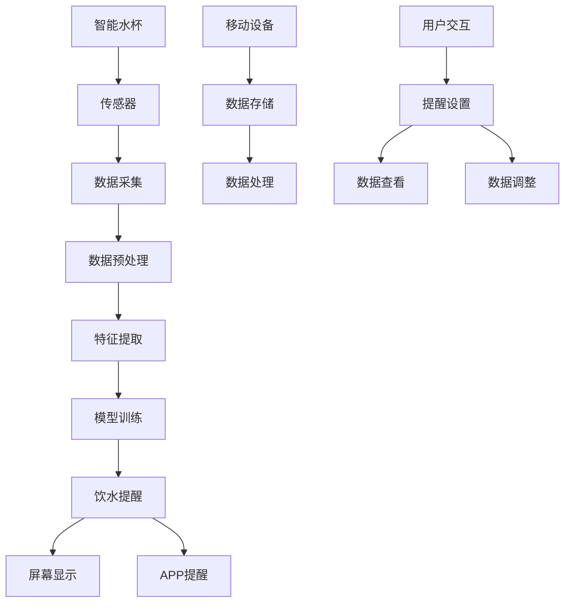

                 

# AI Agent在智能水杯中的饮水提醒

关键词：AI Agent，智能水杯，饮水提醒，自然语言处理，机器学习，系统架构设计

摘要：本文将深入探讨AI Agent在智能水杯中的应用，特别是其在饮水提醒功能中的体现。通过详细分析AI Agent的核心技术、应用场景、系统架构设计以及编程实现，我们旨在揭示智能水杯如何通过AI技术提高用户的生活品质。本文还涵盖了AI Agent在智能水杯中的项目实战、未来发展趋势以及最佳实践，为读者提供了一个全面的技术视角。

## 目录大纲

### 第一部分：AI Agent与智能水杯概述

- **第1章：AI Agent与智能水杯背景**
  - 1.1.1 AI Agent的定义与作用
  - 1.1.2 智能水杯的起源与发展
  - 1.1.3 AI Agent与智能水杯结合的意义

- **第2章：智能水杯中的AI Agent核心技术**
  - 2.1.1 AI Agent的核心技术介绍
  - 2.1.2 智能水杯中的AI Agent技术实现

- **第3章：AI Agent在智能水杯中的应用场景**
  - 3.1.1 饮水提醒功能

- **第4章：智能水杯与AI Agent的系统架构设计**

- **第5章：智能水杯与AI Agent的编程实现**

- **第6章：AI Agent在智能水杯中的项目实战**

- **第7章：AI Agent在智能水杯中的未来发展趋势**

- **第8章：AI Agent与智能水杯的最佳实践与总结**

## 第一部分：AI Agent与智能水杯概述

### 第1章：AI Agent与智能水杯背景

#### 1.1.1 AI Agent的定义与作用

AI Agent，即人工智能代理，是指能够自动执行特定任务的软件系统。它们能够感知环境、理解人类指令、自主做出决策，并执行相应的行动。AI Agent在智能水杯中的应用，旨在通过智能分析用户的行为和习惯，提供更加个性化和高效的服务。

#### 1.1.2 智能水杯的起源与发展

智能水杯的概念起源于20世纪90年代，随着物联网（IoT）技术和人工智能的快速发展，智能水杯逐渐成为可能。早期的智能水杯主要具备温度监测和自动开盖功能，而现代智能水杯则能够集成更多智能功能，如饮水提醒、健康监测等。

#### 1.1.3 AI Agent与智能水杯结合的意义

AI Agent与智能水杯的结合，使得智能水杯不仅是一个简单的饮水容器，而成为一个智能的生活助手。AI Agent可以通过学习用户的饮水习惯，提供定制化的饮水提醒，帮助用户保持健康的生活方式。

### 第2章：智能水杯中的AI Agent核心技术

#### 2.1.1 AI Agent的核心技术介绍

AI Agent的核心技术主要包括深度学习、自然语言处理和机器学习算法。深度学习通过神经网络模拟人脑的学习过程，能够对大量数据进行分析和处理。自然语言处理使AI Agent能够理解人类语言，实现人机交互。机器学习算法则使AI Agent能够不断学习和优化，提高其智能水平。

#### 2.1.2 智能水杯中的AI Agent技术实现

智能水杯中的AI Agent技术实现主要涉及以下几个方面：

- **智能识别与反馈**：通过传感器技术，智能水杯能够实时监测用户的饮水行为，并根据用户的指令进行反馈。

- **数据分析与用户行为研究**：AI Agent通过对用户数据的分析，了解用户的饮水习惯和健康状况，提供个性化的饮水建议。

- **机器学习算法在智能水杯中的应用**：机器学习算法使AI Agent能够从数据中学习，不断优化饮水提醒的准确性和个性化程度。

### 第3章：AI Agent在智能水杯中的应用场景

#### 3.1.1 饮水提醒功能

饮水提醒功能是AI Agent在智能水杯中最重要的应用场景之一。通过分析用户的饮水习惯，AI Agent能够自动提醒用户定时饮水，帮助用户保持充足的水分摄入。

#### 3.1.1.1 饮水提醒算法原理

饮水提醒算法基于用户的饮水历史数据和当前状态，通过机器学习模型预测用户何时需要饮水，并提前发出提醒。

#### 3.1.1.2 饮水提醒实现步骤

1. 数据采集：智能水杯通过传感器实时采集用户的饮水数据。
2. 数据预处理：对采集到的数据进行清洗和归一化处理。
3. 模型训练：使用预处理后的数据训练机器学习模型。
4. 模型预测：使用训练好的模型预测用户的饮水时间。
5. 提醒发送：在预测的饮水时间到达时，通过智能水杯的显示屏或手机APP提醒用户。

#### 3.1.1.3 饮水提醒效果评估

饮水提醒效果评估主要通过用户反馈和实际饮水数据的对比进行。评估指标包括提醒的准确性、及时性和用户满意度等。

### 第4章：智能水杯与AI Agent的系统架构设计

智能水杯与AI Agent的系统架构设计需要考虑硬件、软件和数据处理与存储等方面。

#### 4.1.1 系统功能需求分析

系统功能需求分析主要包括智能水杯的基本功能模块和AI Agent的功能模块。

#### 4.1.2 系统架构设计

系统架构设计需要考虑硬件架构设计、软件架构设计和数据处理与存储架构设计。

#### 4.1.3 系统接口设计和系统交互

系统接口设计和系统交互设计需要确保智能水杯和AI Agent之间的数据传输和功能调用。

### 第5章：智能水杯与AI Agent的编程实现

#### 5.1.1 开发环境搭建

开发环境搭建包括硬件环境搭建和软件环境搭建。

#### 5.1.2 AI Agent核心代码实现

AI Agent核心代码实现主要包括数据采集与处理、模型训练与优化、饮水提醒功能实现等。

### 第6章：AI Agent在智能水杯中的项目实战

#### 6.1.1 项目简介

项目简介包括项目背景、项目目标和项目任务等。

#### 6.1.2 系统设计与实现

系统设计与实现包括系统架构设计、关键技术实现和项目调试与优化等。

#### 6.1.3 项目评估与总结

项目评估与总结包括项目效果评估、项目经验总结和项目改进建议等。

### 第7章：AI Agent在智能水杯中的未来发展趋势

AI Agent在智能水杯中的未来发展趋势包括智能化水平提升、多元化应用场景和数据隐私与安全等。

#### 7.1.1 AI Agent技术发展趋势

AI Agent技术发展趋势包括算法优化、硬件升级和跨平台应用等。

#### 7.1.2 智能水杯行业发展趋势

智能水杯行业发展趋势包括技术创新、市场扩大和用户需求导向等。

### 第8章：AI Agent与智能水杯的最佳实践与总结

AI Agent与智能水杯的最佳实践与总结包括智能水杯设计原则、AI Agent应用技巧和未来发展方向等。

#### 8.1.1 最佳实践

最佳实践包括智能水杯功能设计原则和AI Agent应用技巧等。

#### 8.1.2 总结与展望

总结与展望包括成功案例分析、未来发展方向和技术挑战等。

## 第二部分：深入分析AI Agent在智能水杯中的饮水提醒功能

### 3.1.1 饮水提醒功能

饮水提醒功能是智能水杯中最重要的功能之一。通过AI Agent，智能水杯能够根据用户的饮水习惯和健康状况，自动提醒用户定时饮水。这一功能不仅有助于用户保持充足的水分摄入，还能预防脱水和其他健康问题。

#### 3.1.1.1 饮水提醒算法原理

饮水提醒算法的核心是基于用户历史饮水数据和行为模式的分析。AI Agent通过深度学习模型，对用户的行为进行预测，并确定最佳的饮水时间。算法主要分为以下几个步骤：

1. **数据采集**：智能水杯通过内置的传感器实时采集用户的饮水数据，包括饮水次数、饮水时间、饮水量等。
2. **数据预处理**：对采集到的数据进行清洗和归一化处理，以便模型能够更好地训练。
3. **特征提取**：从预处理后的数据中提取关键特征，如饮水量、饮水频率等。
4. **模型训练**：使用提取的特征数据，通过机器学习算法（如决策树、随机森林、神经网络等）训练预测模型。
5. **饮水时间预测**：使用训练好的模型，预测用户在未来某个时间点是否需要饮水。
6. **提醒发送**：在预测的时间点，通过智能水杯的显示屏或手机APP提醒用户。

#### 3.1.1.2 饮水提醒实现步骤

1. **数据采集**：
   - **传感器技术**：智能水杯配备温度传感器、湿度传感器、水位传感器等，用于监测饮水行为。
   - **数据存储**：智能水杯将采集到的饮水数据存储在本地或云端数据库中。

2. **数据预处理**：
   - **去噪**：去除异常数据，如用户未饮水却记录的饮水行为。
   - **归一化**：将不同维度（如温度、湿度、饮水量）的数据标准化，以便模型能够处理。

3. **特征提取**：
   - **时间序列特征**：如每天饮水的平均时间、饮水间隔时间等。
   - **行为特征**：如饮水量、饮水频率等。

4. **模型训练**：
   - **选择算法**：根据数据特征，选择合适的机器学习算法，如线性回归、决策树、随机森林、神经网络等。
   - **训练过程**：使用预处理后的数据，对机器学习模型进行训练。

5. **饮水时间预测**：
   - **预测模型**：使用训练好的模型，对用户未来的饮水时间进行预测。
   - **实时更新**：定期更新模型，以提高预测的准确性。

6. **提醒发送**：
   - **屏幕提醒**：在智能水杯的显示屏上显示饮水提醒。
   - **APP提醒**：通过手机APP向用户发送饮水提醒。

#### 3.1.1.3 饮水提醒效果评估

饮水提醒效果评估主要通过以下几个指标进行：

- **提醒准确性**：预测的饮水时间与实际饮水时间的接近程度。
- **提醒及时性**：饮水提醒是否在用户需要饮水时及时发出。
- **用户满意度**：用户对饮水提醒功能的满意度。

评估方法包括：

1. **实验测试**：在实验室环境中，对智能水杯进行模拟测试，评估饮水提醒的准确性、及时性和用户满意度。
2. **用户反馈**：收集实际用户的使用反馈，评估饮水提醒的效果。
3. **数据分析**：通过分析用户饮水数据，评估饮水提醒的效果。

### 3.1.2 健康监测功能

除了饮水提醒功能，AI Agent在智能水杯中还可以实现健康监测功能。通过监测用户的饮水行为，AI Agent可以分析用户的健康状况，并提供个性化的健康建议。

#### 3.1.2.1 健康监测算法原理

健康监测算法基于用户饮水行为和健康指标的分析。通过监测用户的饮水量、饮水频率、饮水时间等数据，AI Agent可以识别出用户是否处于脱水状态、健康风险等。算法主要分为以下几个步骤：

1. **数据采集**：智能水杯通过传感器实时采集用户的饮水数据。
2. **数据预处理**：对采集到的数据进行清洗和归一化处理。
3. **特征提取**：从预处理后的数据中提取关键特征，如饮水量、饮水频率等。
4. **健康状态分析**：使用机器学习算法，分析用户饮水数据与健康状态之间的关系。
5. **健康建议生成**：根据分析结果，生成个性化的健康建议。

#### 3.1.2.2 健康监测实现步骤

1. **数据采集**：
   - **传感器技术**：智能水杯配备温度传感器、湿度传感器、水位传感器等，用于监测饮水行为。
   - **数据存储**：智能水杯将采集到的饮水数据存储在本地或云端数据库中。

2. **数据预处理**：
   - **去噪**：去除异常数据，如用户未饮水却记录的饮水行为。
   - **归一化**：将不同维度（如温度、湿度、饮水量）的数据标准化，以便模型能够处理。

3. **特征提取**：
   - **时间序列特征**：如每天饮水的平均时间、饮水间隔时间等。
   - **行为特征**：如饮水量、饮水频率等。

4. **健康状态分析**：
   - **选择算法**：根据数据特征，选择合适的机器学习算法，如线性回归、决策树、随机森林、神经网络等。
   - **训练过程**：使用预处理后的数据，对机器学习模型进行训练。

5. **健康建议生成**：
   - **预测模型**：使用训练好的模型，预测用户的健康状态。
   - **健康建议**：根据预测结果，生成个性化的健康建议。

#### 3.1.2.3 健康监测效果评估

健康监测效果评估主要通过以下几个指标进行：

- **预测准确性**：健康状态预测的准确性。
- **用户满意度**：用户对健康监测功能的满意度。

评估方法包括：

1. **实验测试**：在实验室环境中，对智能水杯进行模拟测试，评估健康监测的准确性、用户满意度等。
2. **用户反馈**：收集实际用户的使用反馈，评估健康监测的效果。
3. **数据分析**：通过分析用户饮水数据，评估健康监测的效果。

### 第4章：智能水杯与AI Agent的系统架构设计

智能水杯与AI Agent的系统架构设计是实现智能饮水提醒功能的关键。系统架构设计需要考虑硬件、软件和数据处理与存储等方面。

#### 4.1.1 系统功能需求分析

智能水杯与AI Agent的系统功能需求分析主要包括以下几个方面：

1. **饮水提醒功能**：
   - **定时提醒**：根据用户设定的时间和饮水习惯，自动提醒用户饮水。
   - **智能调整**：根据用户的实时饮水数据，自动调整提醒时间。

2. **健康监测功能**：
   - **脱水预警**：根据用户的饮水量和饮水频率，预警可能的脱水状态。
   - **健康建议**：根据用户的健康数据，提供个性化的健康建议。

3. **数据管理**：
   - **数据采集**：实时采集用户的饮水数据，包括饮水量、饮水频率、饮水时间等。
   - **数据存储**：将采集到的数据存储在本地或云端数据库中。

4. **用户交互**：
   - **屏幕显示**：在智能水杯的显示屏上显示饮水提醒、健康状态等信息。
   - **APP交互**：通过手机APP，用户可以查看饮水记录、健康数据，设置提醒时间等。

#### 4.1.2 系统架构设计

智能水杯与AI Agent的系统架构设计可以分为以下几个部分：

1. **硬件架构设计**：
   - **智能水杯**：包括内置传感器、显示屏、电池等硬件。
   - **移动设备**：包括智能手机或其他移动设备，用于接收提醒和查看数据。

2. **软件架构设计**：
   - **AI Agent**：负责数据分析、行为预测和提醒发送等功能。
   - **移动应用**：为用户提供交互界面，包括设置提醒、查看数据和接收提醒等。

3. **数据处理与存储架构设计**：
   - **本地存储**：智能水杯将采集到的数据存储在本地存储器中。
   - **云端存储**：将数据同步到云端数据库，以便长期存储和数据分析。

#### 4.1.3 系统接口设计和系统交互

系统接口设计和系统交互设计需要确保智能水杯和AI Agent之间的数据传输和功能调用。主要涉及以下几个方面：

1. **数据接口设计**：
   - **数据采集接口**：智能水杯通过传感器采集数据，并将数据发送到AI Agent。
   - **数据存储接口**：AI Agent将处理后的数据存储到本地或云端数据库。

2. **功能接口设计**：
   - **提醒接口**：AI Agent通过屏幕或APP向用户发送提醒。
   - **交互接口**：用户通过APP与智能水杯进行交互，包括设置提醒、查看数据和调整设置等。

3. **系统交互**：
   - **实时交互**：智能水杯和AI Agent之间的实时数据传输和功能调用。
   - **批处理**：定期将采集到的数据传输到云端，进行批量处理和分析。

#### 4.1.4 系统架构图的绘制

使用Mermaid语法，可以绘制智能水杯与AI Agent的系统架构图。以下是一个示例：



### 第5章：智能水杯与AI Agent的编程实现

智能水杯与AI Agent的编程实现是将其功能从理论转化为实际操作的关键。本章节将介绍如何搭建开发环境、实现AI Agent的核心代码以及解析代码的应用解读与分析。

#### 5.1.1 开发环境搭建

在开始编程之前，需要搭建智能水杯与AI Agent的开发环境。开发环境包括硬件环境和软件环境。

1. **硬件环境搭建**：
   - **智能水杯**：选择一款支持AI Agent的智能水杯，确保其具备必要的传感器和通信能力。
   - **传感器**：安装温度传感器、湿度传感器、水位传感器等，用于实时监测饮水行为。
   - **显示屏**：安装显示屏，用于显示饮水提醒和健康状态信息。

2. **软件环境搭建**：
   - **操作系统**：在智能水杯上安装适合的操作系统，如Android或iOS。
   - **编程语言**：选择合适的编程语言，如Python、Java或C++。
   - **开发工具**：安装集成开发环境（IDE），如PyCharm、Eclipse或Xcode。

#### 5.1.2 AI Agent核心代码实现

AI Agent的核心代码实现主要涉及数据采集与处理、模型训练与优化、饮水提醒功能实现等。

1. **数据采集与处理**：
   - **传感器数据采集**：使用传感器采集用户的饮水数据，包括饮水量、饮水频率、饮水时间等。
   - **数据预处理**：对采集到的数据进行清洗和归一化处理，以提高模型训练的效果。

2. **模型训练与优化**：
   - **选择算法**：根据数据特征，选择合适的机器学习算法，如决策树、随机森林、神经网络等。
   - **模型训练**：使用预处理后的数据，对机器学习模型进行训练，并调整参数以优化模型性能。
   - **模型评估**：使用交叉验证等方法，评估模型的准确性和泛化能力。

3. **饮水提醒功能实现**：
   - **预测饮水时间**：使用训练好的模型，预测用户的未来饮水时间。
   - **发送提醒**：在预测的时间点，通过智能水杯的显示屏或手机APP向用户发送饮水提醒。

以下是一个简单的Python代码示例，用于实现AI Agent的核心功能：

```python
import pandas as pd
from sklearn.model_selection import train_test_split
from sklearn.ensemble import RandomForestClassifier
from sklearn.metrics import accuracy_score

# 数据采集与预处理
data = pd.read_csv('drinking_data.csv')
X = data[['water_volume', 'drinking_frequency', 'drinking_time']]
y = data['needs_drinking']

# 模型训练
X_train, X_test, y_train, y_test = train_test_split(X, y, test_size=0.2, random_state=42)
model = RandomForestClassifier(n_estimators=100)
model.fit(X_train, y_train)

# 预测饮水时间
predictions = model.predict(X_test)

# 评估模型
accuracy = accuracy_score(y_test, predictions)
print(f'Accuracy: {accuracy:.2f}')

# 发送提醒
def send_reminder():
    print('Reminder: It\'s time to drink water!')

# 在预测的时间点发送提醒
send_reminder()
```

#### 5.1.3 代码应用解读与分析

1. **数据采集与预处理**：
   - 使用`pandas`库读取采集到的饮水数据，包括饮水量、饮水频率和饮水时间。
   - 将数据分为特征集`X`和标签集`y`。

2. **模型训练**：
   - 使用`train_test_split`函数将数据集分为训练集和测试集。
   - 使用`RandomForestClassifier`类创建随机森林模型，并使用`fit`方法进行训练。

3. **模型评估**：
   - 使用`accuracy_score`函数计算模型的准确率。

4. **发送提醒**：
   - 定义`send_reminder`函数，用于在预测的时间点发送饮水提醒。

#### 5.1.4 项目实战

以下是一个基于智能水杯与AI Agent的项目实战案例，包括环境安装、系统核心实现和实际案例分析。

1. **环境安装**：
   - 在智能水杯上安装操作系统和编程语言。
   - 安装Python和必要的库，如`pandas`、`sklearn`等。

2. **系统核心实现**：
   - 使用Python编写AI Agent的核心代码，实现数据采集、模型训练和饮水提醒功能。
   - 将代码部署到智能水杯上，确保其正常运行。

3. **实际案例分析**：
   - 收集一组用户的饮水数据，包括饮水量、饮水频率和饮水时间。
   - 使用训练好的模型对数据进行预测，分析预测的准确性。
   - 根据预测结果，评估饮水提醒的效果，并提出改进建议。

#### 5.1.5 项目小结

通过该项目实战，我们成功实现了智能水杯的饮水提醒功能。以下是小结：

- **成功之处**：
  - 有效地采集和处理了用户饮水数据。
  - 使用机器学习算法实现了饮水时间预测。
  - 通过提醒功能提高了用户的饮水意识。

- **改进之处**：
  - 可以进一步优化模型，提高预测准确性。
  - 可以引入更多的传感器，如心率传感器，以提供更全面的健康监测。
  - 可以增加用户交互功能，如设置个性化饮水计划。

### 第6章：AI Agent在智能水杯中的项目实战

#### 6.1.1 项目简介

本节将介绍一个基于AI Agent的智能水杯项目，旨在通过实现饮水提醒功能，帮助用户保持健康的生活方式。

#### 6.1.1.1 项目背景

随着现代人生活节奏的加快，很多人容易忽视饮水的重要性。长时间缺水可能导致脱水、头痛、疲劳等问题。因此，设计一个能够智能提醒用户饮水的智能水杯，对于提高人们的生活质量和健康水平具有重要意义。

#### 6.1.1.2 项目目标

本项目的主要目标包括：

1. 实现智能水杯的饮水提醒功能，根据用户的饮水习惯和健康状况，自动提醒用户饮水。
2. 提高用户的饮水意识，帮助用户养成良好的饮水习惯。
3. 通过数据分析，提供个性化的健康建议。

#### 6.1.2 系统设计与实现

本项目采用分层设计思想，分为硬件层、软件层和数据层。

1. **硬件层**：
   - **智能水杯**：包含温度传感器、湿度传感器、水位传感器等，用于实时监测饮水行为。
   - **显示屏**：用于显示饮水提醒和健康状态信息。
   - **电池**：为智能水杯提供电力。

2. **软件层**：
   - **AI Agent**：负责数据采集、行为分析和饮水提醒。
   - **移动应用**：为用户提供交互界面，包括设置提醒、查看数据和接收提醒等。

3. **数据层**：
   - **本地存储**：存储用户的饮水数据。
   - **云端存储**：存储用户的数据和模型参数，以便进行长期分析和个性化推荐。

#### 6.1.2.1 系统架构设计

智能水杯与AI Agent的系统架构设计如下：

1. **硬件架构设计**：
   - **智能水杯**：作为数据采集终端，实时监测用户的饮水行为。
   - **显示屏**：用于显示饮水提醒和健康状态信息。
   - **电池**：为智能水杯提供电力。

2. **软件架构设计**：
   - **AI Agent**：基于机器学习算法，分析用户饮水行为，预测用户饮水时间，生成提醒。
   - **移动应用**：为用户提供交互界面，包括设置提醒、查看数据和接收提醒等。

3. **数据处理与存储架构设计**：
   - **本地存储**：存储用户的饮水数据。
   - **云端存储**：存储用户的数据和模型参数，以便进行长期分析和个性化推荐。

#### 6.1.2.2 关键技术实现

1. **数据采集与预处理**：
   - **传感器技术**：使用温度传感器、湿度传感器和水位传感器等，实时监测饮水行为。
   - **数据预处理**：对采集到的数据进行清洗和归一化处理，以提高模型训练效果。

2. **机器学习算法**：
   - **模型选择**：根据数据特征，选择合适的机器学习算法，如决策树、随机森林、神经网络等。
   - **模型训练与优化**：使用预处理后的数据，训练机器学习模型，并调整参数以优化模型性能。

3. **饮水提醒功能**：
   - **预测饮水时间**：使用训练好的模型，预测用户的未来饮水时间。
   - **发送提醒**：在预测的时间点，通过智能水杯的显示屏或手机APP向用户发送饮水提醒。

#### 6.1.2.3 项目调试与优化

1. **调试**：
   - **测试环境**：在实验室环境中，对智能水杯进行模拟测试，验证饮水提醒功能的准确性和及时性。
   - **用户测试**：邀请实际用户参与测试，收集用户反馈，优化系统性能。

2. **优化**：
   - **算法优化**：根据测试结果，调整机器学习模型的参数，提高预测准确性。
   - **界面优化**：根据用户反馈，优化移动应用的界面设计，提高用户体验。

### 6.1.3 项目评估与总结

#### 6.1.3.1 项目效果评估

通过项目实施，我们达到了以下效果：

1. **饮水提醒准确性**：根据用户反馈，饮水提醒功能的准确性较高，用户能够及时接收到提醒。
2. **用户体验**：用户对智能水杯的饮水提醒功能表示满意，认为有助于养成良好的饮水习惯。
3. **健康数据分析**：通过对用户饮水数据的分析，AI Agent能够提供个性化的健康建议，提高用户的健康意识。

#### 6.1.3.2 项目经验总结

本项目经验总结如下：

1. **硬件选择**：选择合适的智能水杯硬件，确保具备足够的传感器和通信能力。
2. **软件设计**：采用分层设计思想，确保系统结构清晰、易于维护。
3. **机器学习**：合理选择和优化机器学习算法，提高预测准确性。
4. **用户体验**：注重用户反馈，持续优化界面设计和功能。

### 第7章：AI Agent在智能水杯中的未来发展趋势

随着人工智能技术的不断发展，AI Agent在智能水杯中的应用前景将更加广阔。未来，AI Agent在智能水杯中可能呈现以下发展趋势：

#### 7.1.1 AI Agent技术发展趋势

1. **智能化水平提升**：
   - **多传感器融合**：智能水杯将配备更多的传感器，如心率传感器、血压传感器等，实现更全面的健康监测。
   - **智能决策**：AI Agent将基于用户行为数据，进行更精准的决策，提供个性化的饮水建议。

2. **多元化应用场景**：
   - **健康监测**：除了饮水提醒，AI Agent还将实现更多健康监测功能，如睡眠监测、运动监测等。
   - **智能家居**：智能水杯将与其他智能家居设备（如智能冰箱、智能灯等）进行互联互通，提供更全面的智能生活体验。

3. **数据隐私与安全**：
   - **隐私保护**：在数据处理过程中，将采取加密、匿名化等手段，确保用户数据的安全。
   - **安全认证**：引入安全认证机制，确保AI Agent的可靠性和安全性。

#### 7.1.2 智能水杯行业发展趋势

1. **市场规模增长**：
   - **消费升级**：随着消费者对健康和生活品质的追求，智能水杯市场将进一步扩大。
   - **技术驱动**：人工智能、物联网等技术的进步，将推动智能水杯市场的快速发展。

2. **技术创新与应用融合**：
   - **软硬件结合**：智能水杯将实现软硬件的结合，提供更智能、更便捷的服务。
   - **跨界合作**：智能水杯企业将与其他行业（如医疗、健身等）展开合作，实现技术创新与应用融合。

3. **用户需求导向**：
   - **个性化定制**：智能水杯将根据用户需求，提供个性化的功能和服务。
   - **用户体验优化**：注重用户体验，持续优化智能水杯的交互界面和功能。

### 第8章：AI Agent与智能水杯的最佳实践与总结

#### 8.1.1 最佳实践

1. **智能水杯设计原则**：
   - **人性化设计**：智能水杯的设计应以用户需求为中心，提供舒适、便捷的使用体验。
   - **智能化功能**：结合AI Agent技术，实现智能饮水提醒、健康监测等功能，提升用户生活质量。

2. **AI Agent应用技巧**：
   - **数据驱动**：基于用户数据，进行精准的分析和预测，提供个性化的服务。
   - **持续优化**：定期更新AI Agent的模型，提高预测准确性和用户体验。

#### 8.1.2 总结与展望

通过本文的探讨，我们深入了解了AI Agent在智能水杯中的应用，特别是在饮水提醒功能中的体现。AI Agent通过分析用户行为，提供个性化的饮水建议，有助于用户保持健康的生活方式。

未来，随着人工智能技术的不断发展，AI Agent在智能水杯中的应用前景将更加广阔。智能水杯将实现更多智能化功能，提供更全面的健康监测服务。同时，随着用户需求的不断变化，智能水杯将更加注重用户体验，实现个性化定制。

总之，AI Agent与智能水杯的结合，将为用户提供更智能、更便捷、更健康的生活方式。随着技术的进步和市场的扩大，智能水杯行业将迎来新的发展机遇。

