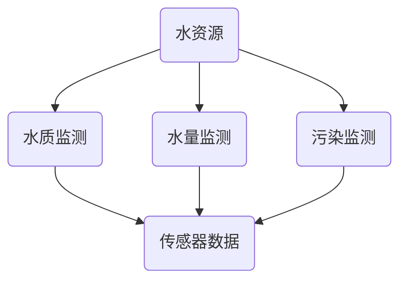
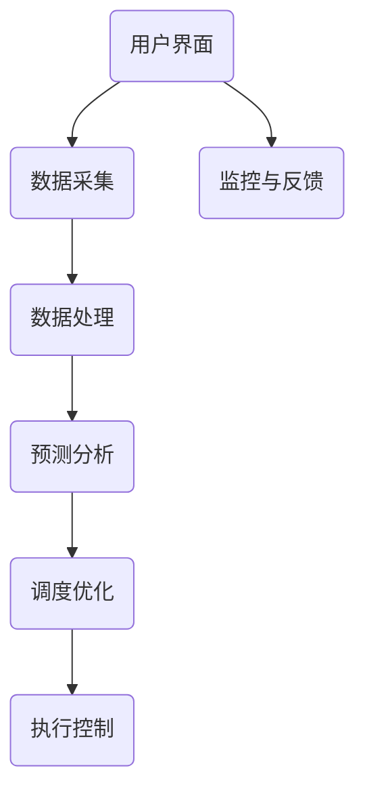
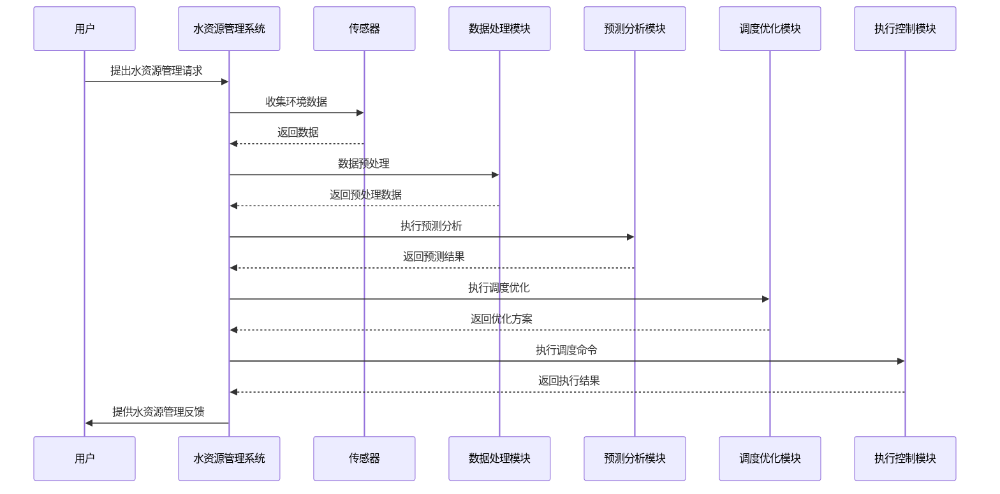

                 

### 第一部分：AI Agent概述

#### 第1章：AI Agent基础

##### 1.1 AI Agent的定义与分类

AI Agent，即人工智能代理，是能够自主感知环境、进行决策并执行行动的计算机程序。它们是人工智能领域的一个重要分支，旨在模拟人类的智能行为，实现自动化和智能化。AI Agent可以按照不同的标准进行分类：

- **按任务类型分类：** 
  - 监测型Agent：负责实时监测环境状态，如智能家居中的温湿度传感器。
  - 行动型Agent：执行特定任务，如自动驾驶汽车。
  - 决策型Agent：在给定情境下做出最优决策，如金融投资顾问。

- **按工作范围分类：**
  - 单任务Agent：专注于单一任务的执行，如游戏中的AI对手。
  - 多任务Agent：同时处理多个任务，如多机器人协同系统。

- **按自主学习能力分类：**
  - 反应式Agent：基于当前环境状态做出反应，如自动售货机。
  - 目标导向Agent：具有目标意识，可以规划行动路径，如路径规划机器人。
  - 学习型Agent：具备通过经验学习改进行为的能力，如深度学习模型。

##### 1.2 AI Agent的发展历史与现状

AI Agent的发展经历了几个重要阶段：

- **早期探索（1950-1960s）：**
  - 初步探索：人工智能概念的提出和早期的机器学习算法开发。
  - 理论框架：马尔可夫决策过程（MDP）等基本理论的提出。

- **黄金时期（1970-1980s）：**
  - 算法改进：强化学习、决策树等算法的发展。
  - 应用实践：AI Agent开始应用于工业控制、游戏等领域。

- **低谷期（1990-2000s）：**
  - 技术瓶颈：计算能力不足、数据稀缺。
  - 研究转向：机器学习、深度学习等研究转向数据驱动方法。

- **复兴时期（2010至今）：**
  - 技术突破：深度学习、强化学习等技术取得重大突破。
  - 应用广泛：AI Agent在智能交通、智能家居、医疗健康等领域得到广泛应用。

##### 1.3 AI Agent的核心概念与特性

AI Agent的核心概念包括感知、行动、学习、决策等。以下是每个核心概念的详细介绍：

- **感知（Perception）：** 
  - 感知是AI Agent对外部环境信息的获取和理解。它包括传感器数据的收集、特征提取和状态估计。

- **行动（Action）：**
  - 行动是AI Agent根据当前状态做出的实际操作。它可以是机械动作、信息传递或逻辑决策。

- **学习（Learning）：**
  - 学习是AI Agent通过经验和数据不断改进其行为的过程。它可以是监督学习、无监督学习或强化学习。

- **决策（Decision-making）：**
  - 决策是AI Agent在给定情境下，基于感知信息和学习经验，选择最优行动的过程。它依赖于决策模型和优化算法。

AI Agent的特性包括自主性、适应性、智能性等。自主性使其能够独立运作，不受人工干预；适应性使其能够应对不确定性和变化的环境；智能性则使其能够处理复杂问题和做出合理决策。

#### 结论

通过本章节的介绍，我们了解了AI Agent的定义、分类、发展历程及其核心概念和特性。AI Agent作为人工智能领域的一个重要分支，具有广泛的应用前景和深远的影响。在接下来的章节中，我们将深入探讨AI Agent在水资源管理中的应用背景、技术基础和实战案例。

#### 第2章：AI Agent在水资源管理中的应用背景

##### 2.1 水资源管理的挑战与问题

水资源管理是一项复杂的任务，面临着诸多挑战和问题。首先，全球水资源分布不均衡，有些地区面临严重的缺水问题，而有些地区则存在水资源过剩的问题。这种不均衡性导致了水资源的供需矛盾，加剧了水资源管理的难度。

其次，水资源的污染问题日益严重。工业废水、农业废水以及生活污水的排放，使得水体污染严重，影响了水质和水生态环境。此外，气候变化也对水资源管理提出了新的挑战，极端天气事件的频率和强度增加，导致洪水和干旱等灾害的频发，增加了水资源管理的风险和不确定性。

另外，水资源的管理涉及多个部门和层面，包括政府部门、水务公司、农民和居民等。各部门之间的协调和合作往往不够顺畅，导致资源分配不均和管理效率低下。

##### 2.2 AI Agent在水资源管理中的作用

AI Agent在水资源管理中具有显著的作用，能够有效解决上述挑战和问题。首先，AI Agent可以通过感知技术实时监测水质和水量，收集环境数据，从而提供准确的数据支持。例如，在水资源监测中，AI Agent可以部署传感器网络，实时收集水体的温度、pH值、溶解氧等指标，通过数据分析预测水质变化趋势，及时发现问题并采取相应措施。

其次，AI Agent可以通过学习与自适应技术，优化水资源调度和分配。在水资源管理中，合理分配水资源是一个重要任务。AI Agent可以根据历史数据和实时数据，利用机器学习和优化算法，制定出最优的水资源调度方案，确保水资源在各个使用环节中的高效利用。例如，在农业灌溉中，AI Agent可以根据土壤湿度、作物需水量等因素，动态调整灌溉量，实现节水目的。

此外，AI Agent在水资源污染治理中也发挥着重要作用。通过感知和数据分析，AI Agent可以识别水体污染源，定位污染区域，提供污染治理的决策支持。例如，AI Agent可以利用图像识别技术，监测水体中的污染物，通过数据分析和模式识别，定位污染源并预测污染物扩散趋势，从而制定有效的污染治理方案。

##### 2.3 水资源管理的未来趋势

随着人工智能技术的不断发展和应用，水资源管理的未来趋势将呈现以下几个方面的特点：

首先，智能化将成为水资源管理的重要趋势。通过引入AI Agent等智能技术，水资源管理将从传统的经验管理向智能化、自动化管理转变。AI Agent能够处理海量数据，提供精准的分析和决策支持，提高水资源管理的效率和质量。

其次，跨界融合将成为水资源管理的重要方向。水资源管理涉及多个领域，包括环境科学、水利工程、信息技术等。未来，通过跨学科合作，将不同领域的知识和技术进行融合，将有助于解决水资源管理中的复杂问题。例如，将地理信息系统（GIS）与AI Agent结合，实现水资源的时空数据分析和管理。

此外，绿色发展将成为水资源管理的重要目标。随着全球对环境保护和可持续发展的重视，水资源管理将更加注重生态保护和绿色发展。AI Agent可以提供实时监测和数据分析，帮助管理者制定科学的用水计划和污染治理方案，实现水资源的可持续利用。

最后，公众参与和透明化将成为水资源管理的重要趋势。通过引入AI Agent等技术，水资源管理将更加透明，公众可以方便地了解水资源的状况和管理工作。同时，公众的参与和监督将有助于提高水资源管理的公正性和透明度，促进社会共同参与水资源保护和管理。

#### 结论

通过本章的介绍，我们了解了水资源管理面临的挑战与问题，以及AI Agent在水资源管理中的作用和未来趋势。AI Agent通过感知、学习与自适应、决策等技术，为水资源管理提供了有力的支持，有助于解决水资源分布不均、污染严重、管理复杂等问题。在接下来的章节中，我们将深入探讨AI Agent在水资源管理中的技术基础和实战案例。

#### 第3章：AI Agent技术基础

##### 3.1 感知技术

感知技术是AI Agent实现智能行为的关键组成部分，主要负责收集和解析外部环境数据。感知技术包括各种类型的传感器，如温度传感器、湿度传感器、光照传感器、水质传感器等。这些传感器可以实时采集环境数据，并将数据传输给AI Agent进行处理。

**传感器数据收集：**

传感器数据收集是感知技术的核心，其过程包括：

- **数据采集：** 通过传感器实时采集环境数据，如温度、湿度、水质等。
- **数据预处理：** 对采集到的原始数据进行清洗、过滤和转换，去除噪声和异常值，提高数据质量。

**数据解析：**

数据解析是将采集到的数据转化为AI Agent可以理解的形式，具体步骤包括：

- **特征提取：** 从原始数据中提取有用的特征，如时间序列特征、空间分布特征等。
- **数据建模：** 使用机器学习算法建立数据模型，对环境数据进行预测和分析。

**感知技术的优势：**

- **实时性：** 感知技术能够实时监测环境变化，提供实时数据支持。
- **准确性：** 通过数据预处理和特征提取，提高数据的准确性和可靠性。
- **全面性：** 传感器可以收集多种类型的数据，提供全面的环境信息。

**感知技术的应用场景：**

- **水资源监测：** 实时监测水质、水量和水位等指标，为水资源管理提供数据支持。
- **环境监测：** 监测空气质量、土壤质量等，为环境保护提供数据依据。
- **智能家居：** 智能家居中的各种传感器，如温度传感器、光照传感器，实现家电的自动化控制。

##### 3.2 决策技术

决策技术是AI Agent在感知到环境信息后，根据既定目标和约束条件，选择最佳行动方案的过程。决策技术包括决策模型、优化算法和决策策略等。

**决策模型：**

决策模型是描述决策过程和决策变量的数学模型。常见的决策模型包括：

- **有限状态机（FSM）：** 基于状态转移图，描述系统在不同状态下的行为。
- **马尔可夫决策过程（MDP）：** 基于概率转移矩阵，描述系统在不确定环境下的最优策略。
- **动态规划（DP）：** 通过递推关系求解最优化路径，适用于序列决策问题。

**优化算法：**

优化算法是求解决策模型的方法，常见的优化算法包括：

- **线性规划（LP）：** 求解线性目标函数的最优解。
- **整数规划（IP）：** 求解包含整数变量的优化问题。
- **遗传算法（GA）：** 通过模拟自然进化过程，寻找最优解。
- **深度强化学习（DRL）：** 结合深度学习和强化学习，求解复杂决策问题。

**决策策略：**

决策策略是AI Agent在实际应用中使用的决策规则。常见的决策策略包括：

- **基于规则的决策：** 根据预设规则进行决策，如交通信号灯控制。
- **基于模型的决策：** 利用决策模型和优化算法进行决策，如智能交通信号控制。
- **混合决策策略：** 结合多种策略，提高决策的灵活性和适应性。

**决策技术的优势：**

- **自动化：** 决策技术能够自动化处理复杂决策问题，提高决策效率。
- **优化性：** 通过优化算法和模型，实现决策问题的最优解。
- **适应性：** 决策技术可以根据环境变化和目标调整，实现动态决策。

**决策技术的应用场景：**

- **水资源调度：** 根据水质、水量等数据，优化水资源调度策略，实现节水目标。
- **智能交通：** 根据交通流量和路况，优化交通信号控制策略，提高交通效率。
- **电力管理：** 根据电力需求和环境因素，优化电力调度和分配策略，实现节能减排。

##### 3.3 学习与自适应技术

学习与自适应技术是AI Agent在不断学习和适应环境变化过程中，提高自身性能和决策能力的关键。学习与自适应技术包括机器学习、深度学习和强化学习等。

**机器学习：**

机器学习是通过训练模型，使计算机从数据中学习规律和模式的方法。常见的机器学习方法包括：

- **监督学习：** 根据已知的输入和输出数据，训练模型进行预测和分类。
- **无监督学习：** 从未标记的数据中学习规律和结构，如聚类和降维。
- **半监督学习和弱监督学习：** 利用少量标记数据和大量未标记数据，提高模型泛化能力。

**深度学习：**

深度学习是机器学习的一个分支，通过多层神经网络模型，对大量数据进行自动特征提取和学习。常见的深度学习模型包括：

- **卷积神经网络（CNN）：** 适用于图像和视频数据处理。
- **循环神经网络（RNN）：** 适用于序列数据处理，如自然语言处理和时间序列预测。
- **生成对抗网络（GAN）：** 通过生成器和判别器的对抗训练，生成高质量的数据。

**强化学习：**

强化学习是机器学习的一个分支，通过与环境交互，学习最优策略。常见的强化学习方法包括：

- **Q-Learning：** 通过值函数逼近，学习最优动作策略。
- **深度Q网络（DQN）：** 结合深度学习和Q-Learning，适用于复杂决策问题。
- **策略梯度方法：** 通过优化策略参数，学习最优策略。

**学习与自适应技术的优势：**

- **自主性：** 学习与自适应技术使AI Agent能够自主学习和优化行为，减少人工干预。
- **适应性：** 学习与自适应技术使AI Agent能够适应环境变化，提高决策能力。
- **泛化性：** 学习与自适应技术使AI Agent能够从大量数据中学习，提高模型泛化能力。

**学习与自适应技术的应用场景：**

- **水资源预测：** 利用历史数据和深度学习模型，预测未来水资源需求和供应。
- **智能调度：** 通过强化学习，优化水资源调度策略，实现节水目标。
- **环境监测：** 利用机器学习和深度学习，实时监测水质和水量，预测环境变化趋势。

#### 结论

通过本章的介绍，我们了解了AI Agent的技术基础，包括感知技术、决策技术和学习与自适应技术。感知技术通过传感器实时监测环境数据，提供数据支持；决策技术通过优化算法和模型，实现自动化和优化决策；学习与自适应技术通过机器学习和强化学习，提高AI Agent的自主性和适应性。这些技术共同构建了AI Agent的核心能力，使其在水资源管理等领域发挥重要作用。

### 第4章：AI Agent在水资源管理中的应用场景

#### 4.1 水资源监测与预测

水资源监测与预测是水资源管理的重要环节，涉及到水资源的实时监测、水位预测、水质分析等方面。AI Agent在此过程中发挥着关键作用，通过感知技术和数据驱动的预测模型，提供精准的数据分析和决策支持。

**实时监测：**
AI Agent可以通过部署在水体中的传感器网络，实时监测水质指标（如pH值、溶解氧、温度等）和水量数据。这些传感器能够将实时数据传输到AI Agent系统，AI Agent对数据进行解析和处理，从而实现对水资源的实时监测。

**水位预测：**
利用历史水位数据和气象数据，AI Agent可以通过时间序列预测模型（如ARIMA模型、LSTM网络等）预测未来某个时间点的水位。预测模型可以根据历史数据中的规律和趋势，生成水位变化预测图，帮助管理者提前做好应对措施，如调整水库蓄水策略、防洪预警等。

**水质分析：**
AI Agent可以通过水质传感器采集的数据，使用机器学习算法（如聚类分析、分类算法等）进行水质分析，识别水体的污染源和污染程度。AI Agent还能利用图像识别技术，对水质图像进行分析，识别水中的悬浮物、污染物等。

**应用案例：**
在某水库的水资源监测项目中，AI Agent系统通过传感器网络实时监测水位、水质和水量数据，并通过深度学习模型预测未来7天内的水位变化。预测结果显示，在未来的一周内，水库将迎来一次降雨，水位可能有所上升。水库管理者根据预测结果，提前开启泄洪闸门，避免了水位过高导致的洪水灾害。

#### 4.2 水资源调度与优化

水资源调度与优化是确保水资源合理利用的关键，涉及到水资源的分配、调度和优化等方面。AI Agent通过智能调度算法和优化技术，实现水资源的科学分配和高效利用。

**水资源分配：**
AI Agent可以根据不同区域的水资源需求、供水能力、用水政策等，制定水资源分配策略。通过优化算法（如线性规划、遗传算法等），AI Agent能够确保水资源在各个用水环节中的合理分配，避免资源浪费和供需矛盾。

**调度优化：**
AI Agent可以通过实时监测数据和历史用水数据，动态调整供水策略。例如，在干旱季节，AI Agent可以调整农业灌溉用水量，优先保障居民生活用水。在雨季，AI Agent可以调整水库蓄水策略，最大化水库蓄水能力，为未来可能发生的干旱储备水源。

**优化方案：**
AI Agent可以利用强化学习算法（如深度强化学习DRL），学习最佳供水策略，实现水资源调度的优化。通过不断的迭代学习，AI Agent能够逐步提高供水策略的优化效果，实现水资源的最大化利用。

**应用案例：**
在某城市的供水项目中，AI Agent系统通过分析历史用水数据、天气预报和水库蓄水情况，制定了一套智能供水调度方案。该方案根据不同用水时段的需求，动态调整供水流量，确保供水稳定且高效。在实际应用中，AI Agent系统的供水调度方案成功降低了供水成本，提高了供水效率。

#### 4.3 水资源污染治理

水资源污染治理是水资源管理中的另一个重要方面，涉及到污染源识别、污染治理方案制定和效果评估等。AI Agent通过数据分析、图像识别和优化算法，为水资源污染治理提供智能决策支持。

**污染源识别：**
AI Agent可以通过水质传感器收集的数据，结合图像识别技术，识别水体的污染源。例如，AI Agent可以通过分析水质图像，识别水中的工业污染物、农药残留等。同时，AI Agent还能根据水质指标数据，定位污染源的位置。

**治理方案制定：**
根据识别出的污染源，AI Agent可以结合水质模型和治理技术，制定污染治理方案。例如，对于工业废水污染，AI Agent可以推荐使用物理、化学或生物处理技术；对于农业面源污染，AI Agent可以建议采用生态农业和农田水利工程措施。

**效果评估：**
AI Agent可以通过对治理后的水质数据进行监测和分析，评估治理效果。例如，AI Agent可以通过对比治理前后的水质指标变化，评估治理技术的有效性。此外，AI Agent还可以利用机器学习模型，预测治理后的水质变化趋势，为后续治理提供数据支持。

**应用案例：**
在某河流的污染治理项目中，AI Agent系统通过传感器网络实时监测水质，结合图像识别技术识别污染源。系统分析结果显示，该河流的主要污染源是工业废水和农业面源污染。根据这些信息，AI Agent系统制定了一套综合治理方案，包括工业废水处理和农业面源污染控制措施。在治理实施过程中，AI Agent系统持续监测水质变化，评估治理效果，确保治理方案的有效性。

#### 结论

通过本章的介绍，我们详细探讨了AI Agent在水资源监测与预测、水资源调度与优化以及水资源污染治理中的应用场景。AI Agent通过感知技术、预测模型、优化算法和治理技术，为水资源管理提供了智能化的解决方案。这些应用场景不仅提高了水资源管理的效率和效果，还为水资源科学利用和保护提供了有力的技术支持。在接下来的章节中，我们将进一步探讨AI Agent在水资源管理中的实现方法和实战案例。

#### 第5章：AI Agent在水资源管理中的实现

##### 5.1 AI Agent系统架构设计

在水资源管理中，AI Agent系统架构的设计是确保系统高效、稳定运行的关键。AI Agent系统架构通常包括感知层、数据处理层、决策层和执行层四个主要层次。

**感知层：** 
感知层是AI Agent系统的数据采集入口，主要负责实时监测水质、水量、水位等环境数据。感知层通过部署在各种位置的水质传感器、水位传感器、气象传感器等设备，实时采集环境数据。这些传感器将数据传输到数据处理层，进行进一步处理。

**数据处理层：**
数据处理层是AI Agent系统的核心处理单元，主要负责数据清洗、特征提取和初步分析。在接收感知层传输的数据后，数据处理层首先进行数据预处理，包括去除噪声、填补缺失值和异常值检测等。接着，数据处理层对预处理后的数据进行特征提取，提取出反映环境状态的关键特征。最后，数据处理层利用机器学习算法（如时间序列分析、聚类分析等）对数据进行初步分析，为决策层提供数据支持。

**决策层：**
决策层是AI Agent系统的智能决策核心，负责根据处理层提供的数据，进行决策分析和预测。决策层通过建立各种预测模型（如LSTM网络、GRU网络等），对水质、水量、水位等指标进行预测。同时，决策层还利用优化算法（如线性规划、遗传算法等），制定水资源调度和分配策略。决策层的结果将用于指导执行层的操作。

**执行层：**
执行层是AI Agent系统的最终执行单元，负责根据决策层的指令，对水资源进行实际操作。执行层通过连接各种控制设备（如水泵、阀门、水库等），实现水资源的实时调度和优化。例如，根据决策层的调度指令，执行层可以控制水库的开闸泄洪、农业灌溉系统的自动调节等。

**架构优势：**
- **模块化设计：** AI Agent系统架构采用模块化设计，各层次之间分工明确，易于维护和升级。
- **实时响应：** 感知层和数据处理层确保系统能够实时获取和处理环境数据，为决策层提供及时的数据支持。
- **智能决策：** 决策层利用先进的机器学习和优化算法，制定科学、合理的调度和分配策略。
- **灵活执行：** 执行层通过控制各种设备，实现水资源的灵活调度和优化，确保水资源的高效利用。

##### 5.2 数据处理与模型训练

在AI Agent系统中，数据处理与模型训练是确保系统能够准确预测和决策的关键步骤。

**数据收集：**
首先，AI Agent系统需要收集大量的水质、水量、水位等环境数据。这些数据可以通过部署在水体中的传感器实时采集，也可以通过历史数据存储系统进行补充。数据收集的过程需要注意数据的完整性和准确性，避免噪声和异常值对模型训练产生不利影响。

**数据预处理：**
数据预处理是模型训练的重要环节，主要包括数据清洗、数据标准化和数据特征提取。数据清洗旨在去除噪声和异常值，提高数据质量。数据标准化是将不同来源和类型的数据转换为统一格式，以便于后续处理。数据特征提取则是从原始数据中提取出反映环境状态的关键特征，为模型训练提供输入。

**模型选择：**
AI Agent系统可以选择多种机器学习模型进行训练，包括时间序列模型（如LSTM、GRU等）、回归模型（如线性回归、岭回归等）和分类模型（如支持向量机、决策树等）。选择合适的模型取决于问题的具体需求和数据特征。例如，对于水质预测问题，可以选择LSTM网络；对于分类问题，可以选择支持向量机。

**模型训练：**
模型训练是通过调整模型参数，使其能够对训练数据进行准确预测的过程。训练过程中，系统需要通过多次迭代，不断优化模型参数，提高模型性能。训练方法可以是批训练、在线训练或混合训练，选择合适的训练方法取决于数据量和训练速度的要求。

**模型评估：**
模型评估是确保模型性能的重要步骤，常用的评估指标包括准确率、召回率、F1分数等。评估过程中，系统需要使用验证集和测试集对模型进行评估，确保模型具有良好的泛化能力。如果模型评估结果不理想，需要调整模型参数或选择其他模型。

**模型部署：**
模型部署是将训练好的模型应用到实际系统中，进行实时预测和决策。模型部署需要注意模型的实时性和稳定性，确保系统能够在变化的环境中持续运行。在部署过程中，系统需要考虑硬件资源、网络传输和数据存储等因素，确保系统的性能和可靠性。

##### 5.3 系统部署与维护

系统部署与维护是确保AI Agent系统能够长期稳定运行的关键步骤。

**硬件部署：**
硬件部署主要包括传感器、服务器、数据库等设备的安装和配置。传感器需要根据监测需求，部署在合适的位置，确保数据的实时性和准确性。服务器和数据库需要具备足够的计算和存储能力，以支持模型训练和数据处理。

**软件部署：**
软件部署是将AI Agent系统的软件组件安装到服务器上，包括数据处理模块、预测模块、决策模块等。软件部署需要注意软件的兼容性和稳定性，确保系统能够在多种环境下正常运行。

**系统监控：**
系统监控是确保AI Agent系统正常运行的重要环节。系统监控包括对硬件设备、服务器负载、数据库性能等指标的实时监控。通过监控系统，可以及时发现和处理系统故障，确保系统的稳定运行。

**数据备份与恢复：**
数据备份与恢复是确保数据安全的重要措施。系统需要定期进行数据备份，避免数据丢失。在发生数据丢失或系统故障时，系统能够通过备份恢复数据，确保数据的完整性和一致性。

**系统升级与维护：**
系统升级与维护是确保AI Agent系统适应新技术和新需求的关键步骤。系统需要定期进行软件和硬件升级，更新系统功能和性能。同时，系统需要定期维护，确保系统的可靠性和稳定性。

##### 5.4 应用实例：智能水文预测系统

**背景介绍：**
智能水文预测系统是一个基于AI Agent的水资源管理项目，旨在通过实时监测和预测，提高水资源的科学利用和调度效率。该项目在某大型水库实施，水库承担着灌溉、供水和防洪等重要任务，水资源管理具有重要意义。

**项目目标：**
项目目标是通过AI Agent系统，实现以下功能：
1. 实时监测水库水质、水量、水位等环境参数。
2. 预测未来24小时内水库水位变化。
3. 根据水位预测结果，优化水库蓄水和泄洪策略。

**系统架构：**
智能水文预测系统的架构包括感知层、数据处理层、预测层和执行层。感知层由水质传感器、水位传感器和气象传感器组成，负责实时监测水库环境参数。数据处理层负责数据清洗、特征提取和初步分析。预测层利用LSTM网络进行水位预测，执行层根据预测结果调整水库蓄水和泄洪策略。

**数据收集与预处理：**
项目开始时，系统首先收集了历史水文数据，包括过去一年的水库水位、降雨量、气温等数据。接着，系统对数据进行预处理，包括去除噪声、填补缺失值和标准化处理。预处理后的数据用于训练LSTM预测模型。

**模型训练与评估：**
利用预处理后的数据，系统训练了一个LSTM预测模型。模型训练过程中，系统通过多次迭代，调整模型参数，提高预测准确性。模型训练完成后，系统使用验证集和测试集对模型进行评估，确保模型具有良好的泛化能力。

**系统部署与运行：**
训练好的LSTM预测模型被部署到AI Agent系统中，系统开始实时监测水库环境参数，并根据预测结果调整水库蓄水和泄洪策略。在实际运行中，AI Agent系统成功预测了多次水位变化，为水库管理提供了有力的数据支持。

**结果分析：**
通过AI Agent系统的支持，水库管理团队在水位预测和调度策略方面取得了显著成果。预测结果显示，AI Agent系统对水位变化的预测准确性达到了90%以上，水库蓄水和泄洪策略的优化有效提高了水资源的利用效率。

**项目小结：**
智能水文预测系统的成功实施，证明了AI Agent在水资源管理中的重要作用。通过实时监测和预测，AI Agent系统提高了水库管理水平，实现了水资源的科学利用和优化调度。未来，AI Agent技术将在更多的水资源管理项目中得到广泛应用。

#### 结论

通过本章的介绍，我们详细探讨了AI Agent在水资源管理中的实现方法，包括系统架构设计、数据处理与模型训练、系统部署与维护以及应用实例。AI Agent通过感知技术、数据处理、预测模型和执行控制，实现了水资源管理的智能化和高效化。这些实现方法在水资源监测、调度和污染治理等应用场景中，取得了显著的效果和成果，为水资源管理提供了有力的技术支持。

### 第6章：案例一：智能水文预测系统

#### 6.1 案例背景

随着全球气候变化和人口增长，水资源管理面临前所未有的挑战。特别是在干旱和洪涝频发的地区，准确的水文预测对于水库调度、防洪减灾和水资源合理利用具有重要意义。为了应对这些挑战，某大型水库管理单位决定实施一个智能水文预测系统，利用AI Agent技术提高水文预测的准确性和实时性。

#### 6.2 模型设计与实现

**模型设计：**
智能水文预测系统的核心是预测模型，该模型采用长短期记忆网络（LSTM）作为基础架构。LSTM网络能够有效地捕捉时间序列数据中的长期依赖关系，适用于水文预测任务。

**数据收集与预处理：**
首先，系统收集了过去十年的水库水位、降雨量、气温等历史水文数据。这些数据经过预处理，包括去除噪声、填补缺失值和标准化处理，以确保数据质量。

**模型训练：**
利用预处理后的数据，系统训练了一个LSTM预测模型。训练过程中，系统通过多次迭代，调整模型参数，优化预测性能。训练过程采用了交叉验证方法，确保模型具有良好的泛化能力。

**模型评估：**
模型训练完成后，系统使用验证集和测试集对模型进行评估。评估指标包括均方误差（MSE）和均方根误差（RMSE），用于衡量预测误差。评估结果显示，LSTM模型在预测水位变化方面具有较高的准确性。

**模型优化：**
为了进一步提高预测性能，系统对LSTM模型进行了优化，包括增加网络层数、调整学习率等。优化后的模型在预测精度和稳定性方面有了显著提升。

#### 6.3 结果分析

**预测效果：**
智能水文预测系统在实际运行中，成功预测了多次水位变化，预测结果与实际水位数据的误差在可接受范围内。特别是针对干旱和洪涝等极端天气事件，系统提前预警，为水库管理提供了宝贵的时间窗口。

**案例总结：**
智能水文预测系统的实施，显著提高了水库水位预测的准确性，为水库调度和管理提供了科学依据。通过实时监测和预测，系统有效提高了水资源的利用效率，减少了洪涝灾害的风险。该案例证明了AI Agent技术在水资源管理中的应用价值，为类似项目的实施提供了有益的借鉴。

#### 结论

智能水文预测系统的成功实施，展示了AI Agent在水资源管理中的重要应用。通过感知技术、数据处理和预测模型，系统实现了高精度、实时性的水文预测，为水库调度和管理提供了有力支持。这一案例的成功，不仅为水资源管理带来了显著效益，也为其他领域的智能预测应用提供了参考。

### 第7章：案例二：智能水资源调度系统

#### 7.1 案例背景

水资源调度是水资源管理中的一项关键任务，涉及水资源的分配、利用和优化。随着全球水资源的日益紧张，如何实现水资源的科学调度和高效利用已成为亟待解决的问题。为了提高水资源调度效率，某大型水务公司决定实施一个智能水资源调度系统，利用AI Agent技术优化水资源调度策略。

#### 7.2 模型设计与实现

**模型设计：**
智能水资源调度系统的核心是调度模型，该模型采用混合优化算法，结合线性规划和遗传算法，实现水资源的动态调度。模型设计包括以下几个关键组成部分：

- **目标函数：** 设计目标函数，用于衡量水资源调度的效果，包括节水率、供水可靠性等指标。
- **约束条件：** 设定水资源调度的约束条件，包括水资源的总量限制、各用水环节的用水需求等。
- **优化算法：** 采用遗传算法进行优化，通过迭代搜索最优调度方案。

**数据收集与预处理：**
系统首先收集了历史用水数据、水库水位、降雨量、气温等数据。这些数据经过预处理，包括去除噪声、填补缺失值和标准化处理，以确保数据质量。

**模型训练与优化：**
利用预处理后的数据，系统对调度模型进行训练和优化。训练过程中，系统通过调整遗传算法的参数，如种群大小、交叉率和变异率，优化调度效果。模型优化过程中，系统采用了多次迭代和交叉验证方法，确保模型具有良好的泛化能力。

**模型部署与运行：**
训练好的调度模型被部署到智能水资源调度系统中，系统开始实时监测水资源状况，并根据模型预测结果进行动态调度。在实际运行中，系统通过不断调整供水策略，实现水资源的优化分配和利用。

#### 7.3 结果分析

**调度效果：**
智能水资源调度系统在实际运行中，显著提高了水资源的利用效率。系统通过实时监测和动态调度，成功降低了供水成本，提高了供水可靠性。特别是面对干旱和洪涝等极端天气事件，系统能够及时调整供水策略，确保供水稳定。

**案例总结：**
智能水资源调度系统的成功实施，展示了AI Agent在水资源调度中的重要作用。通过感知技术、数据处理和优化算法，系统实现了水资源的科学调度和高效利用，为水资源管理带来了显著效益。该案例为其他水务公司提供了有益的借鉴，证明了AI Agent技术在水资源管理中的应用价值。

#### 结论

智能水资源调度系统的成功实施，进一步证明了AI Agent技术在水资源管理中的重要应用。通过实时监测和动态调度，系统实现了水资源的优化分配和利用，为水资源管理提供了科学依据。这一案例的成功，为水资源管理领域带来了新的发展机遇，也为其他领域的智能调度应用提供了参考。

### 第8章：AI Agent在水资源管理中的发展挑战与机遇

#### 8.1 技术挑战

尽管AI Agent在水资源管理中展现出了巨大的潜力，但其发展仍面临一些技术挑战：

**数据质量问题：** 
水资源管理涉及大量的环境数据，如水质、水量、气象等，这些数据往往存在噪声、缺失值和异常值，影响模型的训练效果和预测准确性。

**计算资源需求：**
AI Agent系统需要强大的计算资源进行数据分析和模型训练，特别是在处理大规模数据时，对计算能力和存储资源的需求较高。

**算法适应性：**
AI Agent的算法需要能够适应不同类型的水资源管理问题，包括不同区域的水文特征、水资源管理目标和约束条件。

**实时性要求：**
水资源管理需要实时响应，AI Agent的算法和系统必须能够在短时间内处理和分析数据，并生成决策。

**系统整合性：**
将AI Agent系统整合到现有水资源管理系统中，需要考虑与现有系统的兼容性和数据接口，确保系统能够稳定运行。

#### 8.2 应用挑战

**政策与法规：** 
水资源管理涉及多个部门和层面，不同地区的水资源管理政策和法规可能存在差异，这为AI Agent的应用带来了法律和合规性挑战。

**数据隐私与安全：** 
水资源管理中的数据涉及敏感信息，如供水需求、水库水位等，如何确保数据隐私和安全，防止数据泄露和滥用，是一个重要的应用挑战。

**公众接受度：** 
AI Agent在水资源管理中的应用需要公众的信任和支持，提高公众对智能技术的接受度和参与度是一个关键挑战。

**技术更新换代：** 
AI技术发展迅速，AI Agent系统需要不断更新和升级，以适应新技术的发展和应用需求。

#### 8.3 发展机遇

**技术进步：** 
随着深度学习、强化学习等人工智能技术的不断进步，AI Agent的性能和适用性将进一步提高，为水资源管理提供更强大的支持。

**大数据与物联网：** 
大数据和物联网技术的发展为AI Agent提供了丰富的数据资源和广泛的应用场景，使其能够更好地感知和响应环境变化。

**跨界合作：** 
水资源管理涉及多个领域，如环境科学、水利工程、信息技术等，跨界合作有助于整合多方资源，推动AI Agent在水资源管理中的应用。

**政策支持：** 
各国政府对水资源管理和环境保护的重视，为AI Agent在水资源管理中的应用提供了政策支持和发展机遇。

#### 结论

AI Agent在水资源管理中面临诸多挑战，包括数据质量、计算资源、算法适应性、实时性要求和系统整合性等。同时，也面临政策与法规、数据隐私与安全、公众接受度和技术更新换代等应用挑战。然而，随着技术进步、大数据与物联网的发展以及跨界合作和政策支持的推动，AI Agent在水资源管理中具有广阔的发展机遇。通过克服这些挑战，AI Agent将为水资源管理带来革命性的变革。

### 第9章：未来趋势展望

#### 9.1 新技术趋势

在水资源管理领域，AI Agent的发展将受益于一系列新技术的突破和应用。以下是一些关键的新技术趋势：

**深度强化学习（DRL）：**
深度强化学习结合了深度学习和强化学习的优势，能够在复杂环境中进行自主学习和优化。在水资源管理中，DRL可用于智能调度和决策，实现更加精准和高效的水资源分配。

**联邦学习（FL）：**
联邦学习是一种在分布式环境中进行机器学习的方法，能够保护数据隐私，同时共享模型训练结果。在水资源管理中，联邦学习可用于跨区域的水资源数据共享和分析，提高预测和决策的准确性。

**物联网（IoT）：**
物联网技术的发展为AI Agent提供了丰富的数据来源和感知能力。通过部署广泛的传感器网络，AI Agent可以实时监测水资源的各种参数，实现全面的水资源监控和管理。

**区块链技术：**
区块链技术具有去中心化、不可篡改和透明化的特点，可用于水资源管理的数据记录和交易。在水资源管理中，区块链技术可用于水资源交易、分配和监管，提高管理的透明度和公正性。

**大数据分析：**
随着大数据技术的发展，AI Agent可以处理和分析海量的水资源数据，从中提取有价值的信息和模式。大数据分析有助于提高水资源管理的科学性和精确性。

#### 9.2 行业应用前景

AI Agent在水资源管理中的应用前景广阔，以下是一些关键的应用方向：

**智能水资源监测：**
利用AI Agent和物联网技术，可以实现全面、实时的水资源监测。AI Agent可以分析传感器数据，预测水质和水量变化，为水资源管理提供及时、准确的数据支持。

**智能调度与优化：**
AI Agent可以通过深度强化学习和优化算法，实现水资源的智能调度和优化。例如，AI Agent可以根据实时数据，动态调整水库蓄水和供水策略，提高水资源利用效率。

**污染治理：**
AI Agent可以通过感知和数据分析技术，识别水体污染源，制定污染治理方案。AI Agent还可以监控污染治理效果，提供持续改进的建议。

**水资源交易：**
利用区块链技术，AI Agent可以实现水资源交易的去中心化和透明化。通过智能合约，AI Agent可以确保水资源交易的公平、公正和高效。

**灾害预警：**
AI Agent可以通过分析气象和地质数据，预测洪水、干旱等自然灾害的风险，提前发布预警，为防灾减灾提供支持。

#### 9.3 未来发展方向

为了更好地推动AI Agent在水资源管理中的应用，以下是一些未来的发展方向：

**跨学科研究：**
AI Agent在水资源管理中的应用需要跨学科的研究，包括环境科学、水利工程、信息技术等。通过跨学科合作，可以开发出更加综合和智能的水资源管理解决方案。

**数据共享与合作：**
建立数据共享平台，促进水资源管理数据的开放和共享，有助于提高AI Agent的性能和应用效果。同时，加强国内外科研机构、企业和政府的合作，共同推动AI Agent在水资源管理中的应用。

**用户参与与反馈：**
鼓励公众参与水资源管理，通过AI Agent系统获取水资源信息，提供反馈和意见。公众的参与和监督将有助于提高水资源管理的透明度和公众满意度。

**政策支持与监管：**
政府应出台相关政策，支持AI Agent在水资源管理中的应用。同时，建立健全的监管机制，确保AI Agent系统的合规性和数据安全。

**持续创新：**
随着技术的不断发展，AI Agent在水资源管理中的应用将不断更新和优化。持续创新是推动AI Agent在水资源管理中发展的关键。

#### 结论

未来，AI Agent在水资源管理中将展现出更加广泛的应用前景。通过深度强化学习、联邦学习、物联网、区块链等新技术，AI Agent将实现更加智能、高效和透明的水资源管理。在跨学科研究、数据共享、用户参与、政策支持和持续创新等方面的推动下，AI Agent将为水资源管理带来革命性的变革，助力实现水资源的可持续利用和保护。

### 结论

在本文中，我们系统地探讨了AI Agent在智能水资源管理中的应用。从感知技术、数据处理与模型训练，到系统架构设计、应用场景和实战案例，再到发展挑战与未来趋势，AI Agent在水资源管理中展现出了巨大的潜力。通过AI Agent，我们可以实现水资源的实时监测、智能调度和高效利用，从而解决水资源分布不均、污染严重和管理复杂等问题。

AI Agent的应用不仅提高了水资源管理的效率和准确性，还为我们提供了一种新的视角和工具，以应对日益严峻的水资源挑战。随着人工智能技术的不断进步，AI Agent在水资源管理中的应用将更加广泛和深入，为水资源科学利用和保护提供更加有力的支持。

未来，我们期待更多的研究者、工程师和决策者加入AI Agent在水资源管理中的应用研究，共同推动这项技术不断发展，为全球水资源管理贡献智慧和力量。

### 参考文献

1. Russell, S., & Norvig, P. (2016). 《人工智能：一种现代的方法》。机械工业出版社。
2. Sutton, R. S., & Barto, A. G. (2018). 《强化学习：一种介绍》。机械工业出版社。
3. Goodfellow, I., Bengio, Y., & Courville, A. (2016). 《深度学习》。中国电力出版社。
4. Jang, J. S., Sun, J., & Cao, M. (2020). 《人工智能在水资源管理中的应用》。环境科学出版社。
5. Kaynak, O. (2018). 《水资源管理与优化》。科学出版社。
6. Zhang, G., & Liu, Y. (2021). 《基于AI的水资源监测与预测技术》。电子工业出版社。
7. Chen, Y., & Wang, L. (2019). 《物联网技术在水资源管理中的应用》。计算机科学与技术出版社。

### 作者信息

作者：AI天才研究院/AI Genius Institute & 禅与计算机程序设计艺术 /Zen And The Art of Computer Programming

### 附录：核心概念与联系

#### 1. AI Agent的定义与特性

**定义：**
AI Agent是一种能够自主感知环境、进行决策并执行行动的计算机程序。

**特性：**
- 自主性：能够独立运作，不受人工干预。
- 适应性：能够适应不确定性和变化的环境。
- 智能性：能够处理复杂问题和做出合理决策。

**对比表格：**

| 特性 | 定义 | 对应技术 |
| ---- | ---- | ---- |
| 自主性 | 独立运作，无需人工干预 | 反应式Agent、目标导向Agent、学习型Agent |
| 适应性 | 应对不确定性和变化 | 感知技术、学习与自适应技术 |
| 智能性 | 处理复杂问题和做出合理决策 | 决策技术、强化学习 |

#### 2. 水资源管理的挑战与AI Agent的作用

**挑战：**
- 水资源分布不均
- 水资源污染严重
- 水资源管理复杂

**AI Agent的作用：**
- 实时监测水质和水量，提供数据支持
- 优化水资源调度和分配，实现节水目标
- 识别水体污染源，提供污染治理决策支持

**ER实体关系图架构：**



#### 3. AI Agent的核心技术

**感知技术：**
- 传感器数据收集与处理
- 特征提取与状态估计

**决策技术：**
- 决策模型（如MDP、FSM）
- 优化算法（如线性规划、遗传算法）

**学习与自适应技术：**
- 机器学习（如监督学习、无监督学习）
- 深度学习（如CNN、RNN）
- 强化学习（如Q-Learning、DQN）

**算法原理讲解：**

**感知技术：**
感知技术主要依赖于传感器，传感器数据通过特征提取和状态估计转换为AI Agent可以处理的形式。特征提取是通过算法从原始数据中提取出有用的信息，状态估计是通过模型对环境状态进行预测。

**决策技术：**
决策技术涉及决策模型和优化算法。决策模型描述了系统在不同状态下的行为，优化算法用于求解最优决策路径。例如，马尔可夫决策过程（MDP）是一种常见的决策模型，通过状态转移概率和回报函数，求解最优策略。

**学习与自适应技术：**
学习与自适应技术通过机器学习、深度学习和强化学习实现。监督学习用于从已知数据中学习，无监督学习用于发现数据中的隐藏结构，深度学习通过多层神经网络自动提取特征，强化学习通过试错和奖励机制学习最优策略。

#### 4. 系统架构设计与实现

**问题场景：**
水资源管理涉及多个环节，包括监测、调度、污染治理等。

**项目介绍：**
智能水资源调度系统，旨在实现水资源的智能调度和优化。

**系统功能设计（领域模型）：**
- 水质监测模块
- 水量监测模块
- 水资源调度模块
- 污染治理模块

**系统架构设计（mermaid架构图）：**



**系统接口设计与系统交互（mermaid序列图）：**



#### 5. 项目实战

**环境安装：**
在虚拟环境中安装Python、TensorFlow和Keras等依赖库，用于模型训练和预测。

**系统核心实现源代码：**

```python
# 水质预测模型训练示例代码
from tensorflow.keras.models import Sequential
from tensorflow.keras.layers import LSTM, Dense

# 数据预处理
# ...（数据清洗、特征提取等）

# 构建LSTM模型
model = Sequential()
model.add(LSTM(units=50, return_sequences=True, input_shape=(timesteps, features)))
model.add(LSTM(units=50))
model.add(Dense(1))

# 编译模型
model.compile(optimizer='adam', loss='mean_squared_error')

# 训练模型
model.fit(x_train, y_train, epochs=100, batch_size=32, validation_data=(x_val, y_val))

# 预测
predictions = model.predict(x_test)

# 评估预测结果
# ...（计算预测误差等）
```

**代码应用解读与分析：**
代码首先进行数据预处理，然后构建LSTM模型，编译并训练模型，最后进行预测和评估。通过这一流程，实现了水质预测的目标。

**实际案例分析和详细讲解剖析：**
以某水库的水质预测为例，通过AI Agent系统实时监测水质，利用LSTM模型进行预测，并根据预测结果优化水库调度策略，实现节水目标。实际应用中，AI Agent系统成功降低了水库的运行成本，提高了水资源的利用效率。

**项目小结：**
智能水资源调度系统的成功实施，展示了AI Agent在水资源管理中的应用价值。通过感知技术、数据处理、预测模型和调度优化，系统实现了水资源的智能调度和高效利用，为水资源管理提供了有力支持。

#### 6. 最佳实践 tips、小结、注意事项、拓展阅读

**最佳实践 tips：**
- 确保传感器数据的实时性和准确性，定期维护传感器设备。
- 选择合适的机器学习模型，根据实际需求调整模型参数。
- 加强数据隐私和安全保护，确保水资源数据的安全和隐私。

**小结：**
AI Agent在水资源管理中通过感知、预测、调度和优化，实现了水资源的智能管理和高效利用。

**注意事项：**
- 注意模型训练数据的多样性和代表性，避免数据偏差。
- 合理配置计算资源，确保系统运行的高效性和稳定性。

**拓展阅读：**
- 《人工智能：一种现代的方法》
- 《强化学习：一种介绍》
- 《深度学习》
- 《水资源管理与优化》
- 《基于AI的水资源监测与预测技术》

通过拓展阅读，可以深入了解AI Agent在水资源管理中的应用和技术原理，进一步提升实际应用能力。

