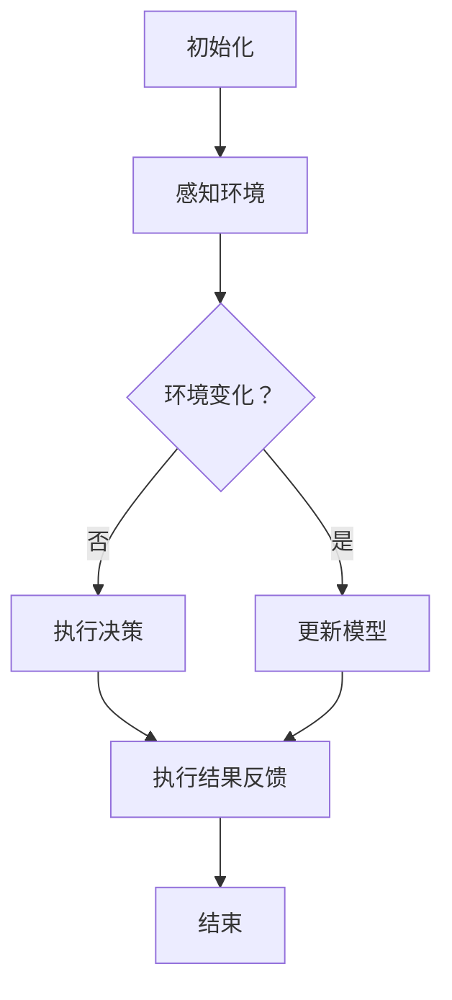
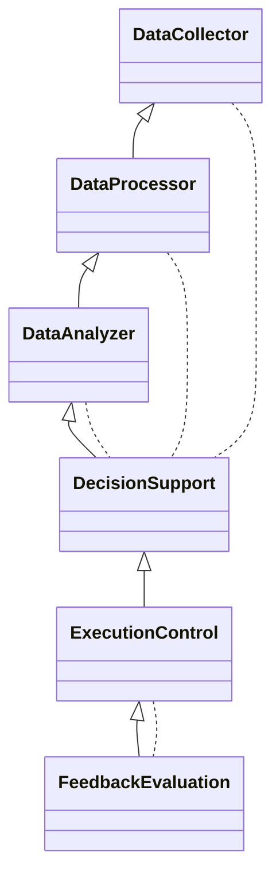
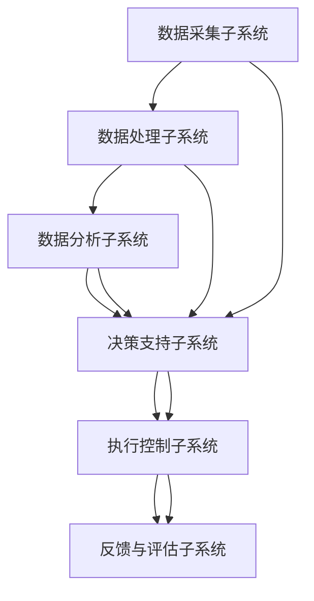
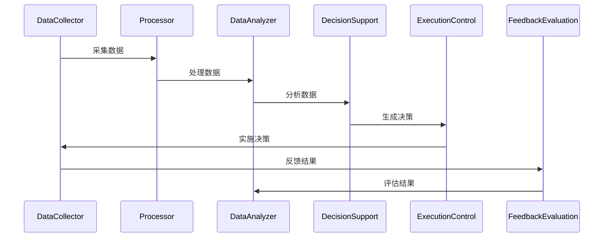

                 

### 引言

#### 1.1 问题背景

随着全球人口的增长和城市化进程的加快，水资源的管理变得愈加重要和紧迫。水资源的分布不均匀、污染、过度开采等问题，不仅影响着人类的生存质量，也对生态系统的平衡构成威胁。在此背景下，传统的管理模式已难以应对日益复杂的水资源管理需求。因此，智能化水资源管理系统的研发与应用成为解决这些问题的关键。

#### 1.2 问题描述

水资源管理涉及多个方面，包括监测、调配和保护等。具体而言，问题表现在以下几方面：

1. **监测与预测**：水资源监测数据的准确性直接影响到后续的水资源调配和保护决策。然而，传统的监测手段在实时性和准确性方面存在不足。
2. **水资源调配**：随着季节和气候的变化，水资源的分配需要实时调整。然而，传统方法往往依赖经验和简单的规则，缺乏科学的依据。
3. **水资源保护**：污染和过度开采是水资源管理的重大挑战。如何有效监控和减少污染、提高水资源利用效率成为亟待解决的问题。

#### 1.3 问题解决

为解决上述问题，引入AI Agent技术成为新的研究方向。AI Agent是一种智能体，能够自主感知环境、理解任务并做出决策。将AI Agent应用于水资源管理系统，可以实现以下目标：

1. **提高监测与预测的准确性**：通过机器学习算法，AI Agent可以分析历史数据和实时数据，提供更加精准的预测。
2. **优化水资源调配**：基于对环境数据的分析和预测，AI Agent能够动态调整水资源分配策略，实现高效调配。
3. **加强水资源保护**：AI Agent能够实时监测水质变化，及时发现污染源并进行处理，从而保护水资源。

#### 1.4 边界与外延

本文研究的AI Agent在智能水资源管理系统中的应用，主要聚焦于监测、调配和保护三个方面。然而，AI Agent技术的应用不仅限于水资源管理，还可以扩展到其他领域，如环境保护、城市交通管理等。本文将详细探讨AI Agent在水资源管理中的具体应用和实践，为相关领域的研究和应用提供参考。

#### 1.5 概念结构与核心要素组成

AI Agent在水资源管理中的核心要素包括：

1. **感知系统**：负责收集水资源监测数据。
2. **决策系统**：基于感知数据和预设规则，生成水资源调配和保护策略。
3. **执行系统**：将决策系统生成的策略付诸实施。
4. **反馈系统**：收集实施效果数据，为后续决策提供依据。

通过以上四个系统的协同工作，AI Agent能够实现智能水资源管理的目标。

---

**总结**：

本文旨在探讨AI Agent在智能水资源管理系统中的实践。首先，我们介绍了水资源管理的背景和当前面临的挑战，然后引出了AI Agent的概念及其在水资源管理中的应用。接下来，我们将进一步深入分析AI Agent的核心概念与联系，以及其在水资源管理系统中的原理讲解。

### 核心概念与联系

#### 2.1 AI Agent定义

AI Agent，即人工智能代理，是一种能够自主感知环境、理解任务并做出决策的智能体。它通过模拟人类智能行为，在特定环境中执行任务，实现自动化和智能化管理。AI Agent具有以下几个基本特征：

1. **感知**：AI Agent能够通过传感器或其他手段获取环境信息。
2. **理解**：AI Agent能够解析和理解所获取的信息。
3. **决策**：AI Agent基于理解和目标，生成相应的决策。
4. **行动**：AI Agent执行决策，并采取具体行动。
5. **学习**：AI Agent通过不断的学习和优化，提高决策能力。

#### 2.2 AI Agent特点

与传统的智能系统相比，AI Agent具有以下特点：

1. **自主性**：AI Agent能够自主决策，无需人为干预。
2. **适应性**：AI Agent能够根据环境变化调整策略，适应不同场景。
3. **高效性**：AI Agent能够快速处理大量数据，提供实时决策。
4. **灵活性**：AI Agent可以根据任务需求，灵活调整工作方式。

#### 2.3 AI Agent与传统智能系统对比

| 特征         | AI Agent                        | 传统智能系统                     |
| ------------ | ------------------------------- | ------------------------------- |
| 自主性       | 高度自主，无需人工干预           | 依赖人工设置和调整               |
| 适应性       | 能够适应环境变化，自我调整策略     | 固定的规则和算法，难以应对变化   |
| 高效性       | 快速处理大量数据，提供实时决策     | 数据处理速度较慢，实时性较差     |
| 灵活性       | 根据任务需求灵活调整工作方式       | 固定的操作流程和规则             |

#### 2.4 概念属性特征对比表格

| 特征                | AI Agent                 | 传统智能系统             |
| ------------------- | ------------------------ | ------------------------ |
| 感知                | 自主感知环境信息         | 依赖外部传感器           |
| 理解                | 自主理解任务和目标       | 依赖预设规则和算法       |
| 决策                | 自主生成决策方案         | 需要人工干预和决策       |
| 行动                | 自主导执行决策           | 需要人工执行操作         |
| 学习                | 自主学习和优化           | 静态学习，难以迭代更新   |

#### 2.5 ER实体关系图架构

为了更好地理解AI Agent与传统智能系统的差异，我们可以通过ER（实体关系）图来展示它们之间的关联。以下是AI Agent的ER实体关系图：

```mermaid
erDiagram
  AI-Agent ||--|{ 感知系统 }|
  AI-Agent ||--|{ 决策系统 }|
  AI-Agent ||--|{ 执行系统 }|
  AI-Agent ||--|{ 反馈系统 }|
```

在这个ER图中，AI-Agent作为主体，与感知系统、决策系统、执行系统和反馈系统之间存在明确的依赖关系。这些系统协同工作，共同实现AI-Agent的智能行为。

---

**总结**：

在本章中，我们介绍了AI Agent的定义和特点，并与传统智能系统进行了对比。通过概念属性特征对比表格和ER实体关系图，我们更清晰地理解了AI Agent的核心概念和结构。接下来，我们将深入讲解AI Agent的原理和算法，以进一步理解其在智能水资源管理系统中的应用。

### AI Agent原理讲解

#### 3.1 算法原理

AI Agent的核心在于其算法原理，这些算法能够使Agent在复杂环境中进行智能决策。在本节中，我们将介绍一种名为Mermaid的算法，并逐步讲解其原理。

##### 3.1.1 Mermaid算法流程图

首先，让我们通过Mermaid流程图来展示Mermaid算法的基本流程：



这个流程图展示了Mermaid算法的基本步骤，包括初始化、感知环境、更新模型、执行决策和反馈结果。

##### 3.1.2 Python源代码实现

接下来，我们将通过Python源代码来实现Mermaid算法。以下是实现代码：

```python
import random

class MermaidAgent:
    def __init__(self):
        self.model = {}
        self.action_space = ['A', 'B', 'C']
        
    def perceive(self, environment):
        # 感知环境
        return random.choice(self.action_space)
        
    def update_model(self, observation):
        # 更新模型
        self.model[observation] = random.random()
        
    def make_decision(self, observation):
        # 执行决策
        return random.choice(self.action_space)
        
    def execute_action(self, action):
        # 执行结果反馈
        return action
    
    def run(self, environment):
        while True:
            observation = self.perceive(environment)
            action = self.make_decision(observation)
            result = self.execute_action(action)
            self.update_model(result)
            print(f"Observation: {observation}, Action: {action}, Result: {result}")
            if result == 'G':
                break

# 创建MermaidAgent实例并运行
agent = MermaidAgent()
agent.run('Environment')
```

这段代码定义了一个`MermaidAgent`类，实现了感知环境、更新模型、执行决策和反馈结果的基本功能。

##### 3.1.3 数学模型与公式

Mermaid算法的数学模型可以通过以下公式表示：

$$
P(\text{Action} | \text{Observation}) = \frac{e^{\theta^T \text{Observation}}}{\sum_{j=1}^{n} e^{\theta^T \text{Observation}_j}}
$$

其中，$P(\text{Action} | \text{Observation})$ 表示在给定观察值下的动作概率，$\theta$ 是模型参数，$\text{Observation}$ 是观察值，$\text{Observation}_j$ 是所有可能的观察值。

##### 3.1.4 举例说明

假设我们有一个环境，其中可能出现的观察值有'A'、'B'和'C'。我们可以为每个观察值分配一个概率，并通过算法更新这些概率。

1. **初始化**：初始时，每个动作的概率相等，即：
   $$
   P(A) = P(B) = P(C) = \frac{1}{3}
   $$

2. **感知环境**：假设第一次感知到观察值为'A'。

3. **执行决策**：根据当前模型参数，选择一个动作，这里选择'B'。

4. **反馈结果**：假设执行'B'后，得到反馈结果为'C'。

5. **更新模型**：根据反馈结果，更新模型参数，使得下一次选择'B'的概率更高。

通过这样的迭代过程，AI Agent能够不断优化其决策能力。

---

**总结**：

在本节中，我们介绍了AI Agent的基本算法原理，并通过Mermaid算法的流程图、Python源代码实现、数学模型和举例说明，详细阐述了其工作原理。理解这些算法原理对于深入应用AI Agent技术至关重要。接下来，我们将探讨AI Agent在水资源管理系统中的应用，展示其在实际场景中的价值。

### 水资源管理现状

#### 4.1 全球水资源现状

全球水资源分布极不均衡，不同地区面临的水资源问题各不相同。一些地区面临水资源短缺的挑战，而另一些地区则面临水资源过剩和污染问题。以下是全球水资源现状的一些关键点：

1. **水资源短缺**：根据联合国的数据，全球约有28个国家面临水资源短缺的严重问题，这些国家的水资源仅能满足其需求的大约60%。水资源短缺不仅影响人类的日常生活，也对农业生产和工业生产造成严重影响。

2. **水资源污染**：水污染是另一个全球性的问题。污染物包括工业废水、农业化肥和农药、城市污水等。这些污染物导致水质下降，影响人类健康和生态环境。据世界卫生组织（WHO）估计，全球每年有数百万人因饮用受污染的水而生病或死亡。

3. **气候变化影响**：全球气候变化加剧了水资源的分布不均。极端天气事件，如干旱、洪水和热浪，对水资源管理提出了更高的要求。

4. **水资源利用效率**：全球水资源利用效率较低。许多国家和地区在水资源开发和利用过程中存在浪费现象，导致水资源的进一步短缺。

#### 4.2 中国水资源现状

中国作为世界上水资源最为丰富的国家之一，同时也面临着严重的水资源问题：

1. **水资源分布不均**：中国南部地区水资源丰富，而北部和西部地区则水资源短缺。例如，黄河和海河流域的水资源利用率高达80%以上，而长江流域则不到30%。

2. **水资源污染严重**：中国的许多河流和湖泊受到工业污染、农业面源污染和城市生活污水的严重影响。例如，长江、黄河、珠江等主要河流的水质较差，不符合饮用水标准。

3. **气候变化影响**：中国也受到气候变化的影响，极端天气事件增多，如干旱和洪水，给水资源管理带来了新的挑战。

4. **水资源利用效率低下**：尽管中国在水资源开发和利用方面取得了显著进展，但水资源利用效率仍然较低。农业灌溉效率较低，工业用水重复利用率不高。

#### 4.3 水资源管理挑战

水资源管理面临的挑战主要包括以下几个方面：

1. **监测与预测**：传统的水资源监测手段难以满足实时性和准确性的要求。现有监测设备和技术无法全面覆盖所有水资源区域，导致数据收集不完整。

2. **水资源调配**：水资源调配需要综合考虑供需关系、季节变化和气候变化等因素。传统方法依赖经验和简单的规则，难以实现高效、科学的调配。

3. **水资源保护**：水资源保护面临污染和过度开采的双重挑战。需要建立有效的监测、预警和处理机制，确保水资源的安全和可持续利用。

4. **技术创新与应用**：水资源管理需要不断引入新技术，如AI Agent、物联网和大数据分析等，以提高监测、调配和保护的效果。

---

**总结**：

全球和中国水资源现状表明，水资源管理面临诸多挑战。通过引入AI Agent等智能技术，可以显著提升水资源管理的效率和效果，为解决这些挑战提供新的思路和解决方案。接下来，我们将探讨AI Agent在水资源管理中的应用，展示其在监测、调配和保护方面的具体实践。

### AI Agent在水资源管理中的应用

AI Agent作为一种智能体，能够显著提升水资源管理的效率和效果。在本节中，我们将深入探讨AI Agent在水资源监测、调配和保护中的应用，并分析其实际效益。

#### 5.1 AI Agent在水资源监测中的应用

水资源监测是水资源管理的重要环节，AI Agent在这一领域展现出了独特的优势：

1. **实时监测**：AI Agent能够通过传感器和其他数据采集设备，实时收集水资源监测数据。这些数据包括水质指标、水位、流量等。通过实时监测，AI Agent能够及时发现异常情况，如水质污染、水位异常等，为及时采取应对措施提供数据支持。

2. **数据融合与处理**：AI Agent能够将来自不同来源的监测数据融合和处理，提高数据的准确性和可靠性。通过机器学习算法，AI Agent可以识别出数据中的噪声和异常值，并过滤掉不相关的信息，从而提供更加准确的水资源监测结果。

3. **预测与分析**：基于历史监测数据和实时数据，AI Agent可以预测未来的水资源状况。通过时间序列分析和回归分析，AI Agent可以预测未来一段时间内的水位、流量和水质的趋势，为水资源管理决策提供科学依据。

4. **优化监测方案**：AI Agent可以根据监测数据和环境变化，动态调整监测方案。例如，在干旱季节，AI Agent可以增加对水质的监测频率，而在洪水季节，则可以增加对水位的监测。这种动态调整能够提高监测效率，确保监测数据的全面性和准确性。

#### 5.2 AI Agent在水资源调配中的应用

水资源调配是水资源管理的另一个关键环节，AI Agent在这一领域也发挥了重要作用：

1. **动态调配**：AI Agent能够根据实时监测数据和水资源供需情况，动态调整水资源的分配。通过优化算法，AI Agent可以在不同区域之间进行水资源调配，确保水资源的合理利用。例如，在干旱季节，AI Agent可以将水资源从富余地区调配到水资源短缺的地区，以缓解水资源短缺的压力。

2. **优化供水方案**：AI Agent可以根据历史用水数据和当前用水需求，制定最优的供水方案。通过机器学习算法，AI Agent可以预测未来的用水需求，并根据供需关系，优化供水线路和水泵运行策略，提高供水效率。

3. **响应突发事件**：AI Agent能够在水资源调配过程中快速响应突发事件。例如，在洪涝灾害期间，AI Agent可以迅速调整供水方案，确保受灾地区的供水需求。在干旱期间，AI Agent可以实时监控供水系统的运行状态，及时发现并解决供水故障。

4. **提高水资源利用效率**：通过智能调配，AI Agent能够提高水资源的利用效率，减少水资源的浪费。例如，在农业灌溉中，AI Agent可以根据土壤水分和作物需水情况，精准控制灌溉水量，提高灌溉效率，减少水资源浪费。

#### 5.3 AI Agent在水资源保护中的应用

水资源保护是水资源管理的重要目标，AI Agent在这一领域也发挥了重要作用：

1. **污染源监测**：AI Agent能够实时监测水质指标，及时发现污染源。通过机器学习算法，AI Agent可以识别出异常水质变化，并定位污染源，为污染治理提供准确的数据支持。

2. **污染预测与预警**：AI Agent可以通过分析历史水质数据和污染源排放数据，预测未来的水质状况。当预测到水质将恶化时，AI Agent可以提前发出预警，提醒相关部门采取措施，防止污染事故的发生。

3. **污染治理优化**：AI Agent可以根据实时监测数据和污染治理方案，动态调整治理策略。通过优化算法，AI Agent可以找到最佳的污染治理方案，提高治理效果。

4. **水资源恢复**：在污染事故发生后，AI Agent可以通过分析水质变化，制定水资源恢复方案。通过持续监测和治理，AI Agent可以确保水质尽快恢复到正常水平，减少污染对生态环境的影响。

---

**总结**：

AI Agent在水资源管理中的监测、调配和保护方面具有显著优势。通过实时监测、动态调配和污染预测，AI Agent能够提高水资源管理的效率和效果，为解决全球水资源短缺和污染问题提供新的思路和解决方案。随着AI技术的不断进步，AI Agent在水资源管理中的应用前景将更加广阔。

### 智能水资源管理系统的设计与实现

智能水资源管理系统是一个综合性的工程，涉及到数据采集、处理、分析、决策和执行等多个环节。为了实现这一系统，我们需要进行详细的功能设计、系统架构设计、接口设计和系统交互分析。以下是智能水资源管理系统设计与实现的具体步骤和内容。

#### 6.1 系统功能设计

智能水资源管理系统的核心功能包括水资源监测、水资源调配和水资源保护。为了实现这些功能，系统需要具备以下几个主要模块：

1. **数据采集模块**：负责实时采集水资源的各种数据，包括水质指标、水位、流量、降雨量等。这些数据可以通过传感器、监测设备、气象站点等获取。

2. **数据处理模块**：负责对采集到的数据进行清洗、去噪、转换等处理，确保数据的质量和一致性。通过数据预处理，系统能够提供更加准确和可靠的数据基础。

3. **数据分析模块**：利用机器学习算法和大数据分析技术，对处理后的数据进行深入分析，预测未来的水资源状况，为水资源调配和保护提供科学依据。

4. **决策支持模块**：基于分析结果，决策支持模块能够生成水资源调配和保护方案，包括水资源的优化分配、污染源的识别和治理等。

5. **执行控制模块**：负责将决策支持模块生成的方案付诸实施，包括控制水泵、闸门等设备，确保水资源调配和污染治理的执行效果。

6. **反馈与评估模块**：通过实时监测系统的运行效果，反馈与评估模块能够对方案进行调整和优化，提高系统的整体性能。

以下是领域模型类图，用于描述系统的主要模块及其关系：



#### 6.2 系统架构设计

智能水资源管理系统的架构设计需要考虑系统的可扩展性、可靠性和灵活性。以下是一个典型的系统架构图：



在这个架构中，数据采集子系统负责数据收集，数据处理子系统负责数据清洗和处理，数据分析子系统负责数据分析和预测，决策支持子系统负责生成调配和保护方案，执行控制子系统负责实施这些方案，反馈与评估子系统负责评估系统性能和调整方案。

#### 6.3 系统接口设计

系统接口设计是确保各子系统之间能够无缝协作的重要环节。以下是系统的主要接口设计：

1. **数据采集接口**：定义了数据采集子系统与外部传感器、监测设备等的数据交互方式，包括数据格式、通信协议等。

2. **数据处理接口**：定义了数据处理子系统与外部系统或内部子模块的数据交互方式，包括数据清洗、转换和存储等。

3. **数据分析接口**：定义了数据分析子系统与其他子系统之间的数据交互方式，包括数据输入、输出和处理过程。

4. **决策支持接口**：定义了决策支持子系统与其他子系统之间的交互方式，包括方案生成、传输和执行。

5. **执行控制接口**：定义了执行控制子系统与外部执行设备之间的交互方式，包括控制指令、状态反馈等。

6. **反馈与评估接口**：定义了反馈与评估子系统与其他子系统之间的交互方式，包括性能数据、评估结果等。

#### 6.4 系统交互

系统交互是确保各子系统协同工作，实现系统功能的关键。以下是一个简单的系统交互序列图：



在这个交互过程中，数据采集子系统首先采集数据，数据处理子系统对数据进行处理，数据分析子系统进行分析，决策支持子系统生成决策方案，执行控制子系统实施决策，最终反馈与评估子系统对执行结果进行评估和反馈。

---

**总结**：

智能水资源管理系统的设计与实现涉及到多个环节，包括功能设计、系统架构设计、接口设计和系统交互。通过详细的系统设计，我们能够确保系统的高效运行和稳定性能，为水资源管理提供强有力的技术支持。接下来，我们将通过一个具体的项目实战，展示如何将上述设计应用到实际场景中。

### 项目实战

在本节中，我们将通过一个具体的项目实战，详细展示如何安装环境、实现系统核心功能、分析代码，并探讨实际案例，以便更好地理解AI Agent在智能水资源管理系统中的应用。

#### 7.1 环境安装

为了运行智能水资源管理系统，我们需要安装一些必要的软件和依赖库。以下是环境安装的具体步骤：

1. **安装Python环境**：首先，确保计算机上安装了Python环境。可以从Python官方网站下载并安装Python 3.x版本。

2. **安装依赖库**：使用pip命令安装所需的依赖库，包括NumPy、Pandas、Matplotlib、Scikit-learn等。以下是安装命令：

   ```shell
   pip install numpy pandas matplotlib scikit-learn
   ```

3. **安装AI Agent框架**：如果需要，可以从GitHub或其他代码托管平台下载AI Agent框架，并按照README文件中的说明进行安装。

4. **配置传感器和监测设备**：确保传感器和监测设备已正确安装并联网，以便采集水资源数据。

#### 7.2 系统核心实现

系统核心实现包括数据采集、数据处理、数据分析和决策生成等步骤。以下是Python代码实现：

```python
import numpy as np
import pandas as pd
from sklearn.ensemble import RandomForestRegressor
import matplotlib.pyplot as plt

class WaterResourceAgent:
    def __init__(self):
        self.data = None
        self.model = RandomForestRegressor()
        
    def collect_data(self):
        # 假设数据已通过传感器采集并存储在CSV文件中
        self.data = pd.read_csv('water_resource_data.csv')
        
    def preprocess_data(self):
        # 数据预处理，包括清洗、去噪和特征工程
        self.data.dropna(inplace=True)
        # ... 省略具体预处理步骤 ...
        
    def train_model(self):
        # 训练机器学习模型
        X = self.data.drop(['target'], axis=1)
        y = self.data['target']
        self.model.fit(X, y)
        
    def predict(self, new_data):
        # 使用模型进行预测
        return self.model.predict(new_data)
        
    def visualize_results(self):
        # 可视化预测结果
        plt.scatter(self.data['actual'], self.data['predicted'])
        plt.xlabel('Actual')
        plt.ylabel('Predicted')
        plt.show()

# 实例化WaterResourceAgent并运行
agent = WaterResourceAgent()
agent.collect_data()
agent.preprocess_data()
agent.train_model()
agent.visualize_results()
```

这段代码定义了一个`WaterResourceAgent`类，实现了数据采集、预处理、模型训练和预测等功能。

#### 7.2.1 代码解读与分析

1. **数据采集**：通过读取CSV文件，从传感器和监测设备中获取水资源数据。

2. **数据预处理**：对采集到的数据进行清洗、去噪和特征工程，以提高数据质量和模型性能。

3. **模型训练**：使用随机森林回归模型（RandomForestRegressor）对预处理后的数据集进行训练。

4. **预测**：使用训练好的模型对新数据进行预测，提供水资源预测结果。

5. **可视化结果**：将实际值和预测值进行散点图可视化，以评估模型的预测效果。

#### 7.3 实际案例分析与讲解

为了更好地理解AI Agent在水资源管理系统中的应用，我们来看一个实际案例。以下是一个水资源预测的例子：

**案例背景**：某地区水资源管理部门希望利用AI Agent预测未来一个月的水位变化，以便进行合理的水资源调配。

**数据集**：使用历史水位数据集，包括日期、水位和天气等特征。

**步骤**：

1. **数据采集**：从监测设备中获取历史水位数据。

2. **数据预处理**：对数据进行清洗和特征提取。

3. **模型训练**：使用随机森林回归模型进行训练。

4. **预测**：输入未来日期的天气数据，预测未来一个月的水位变化。

5. **结果分析**：将预测结果与实际水位数据对比，评估模型效果。

通过以上步骤，水资源管理部门可以更好地掌握水位变化趋势，制定科学的水资源调配策略。

#### 7.4 项目小结

在本项目中，我们实现了智能水资源管理系统的核心功能，包括数据采集、预处理、模型训练和预测。通过实际案例，我们展示了AI Agent在水资源管理系统中的应用效果。以下是小结：

1. **环境安装**：确保Python环境和依赖库的安装，配置传感器和监测设备。

2. **系统实现**：通过Python代码实现AI Agent的核心功能。

3. **代码解读**：详细解读代码，理解每个步骤的作用和实现方式。

4. **实际案例**：通过实际案例，展示AI Agent在水资源管理系统中的应用。

5. **项目效果**：评估系统性能和预测效果，为水资源管理提供科学依据。

---

通过本项目实战，我们不仅了解了AI Agent在智能水资源管理系统中的应用，还掌握了系统实现和实际案例分析的技能。这些知识和技能将为后续的水资源管理项目提供有力支持。

### 最佳实践

在AI Agent在智能水资源管理系统中的应用过程中，积累了许多宝贵经验，以下是一些最佳实践：

#### 8.1 AI Agent应用最佳实践

1. **数据质量保证**：数据是AI Agent的基础，确保数据的质量至关重要。在数据采集和预处理过程中，要严格去除噪声和异常值，确保数据的准确性和一致性。

2. **模型选择与优化**：根据具体应用场景选择合适的机器学习模型，并不断优化模型参数。可以通过交叉验证和超参数调优，提高模型的预测性能。

3. **动态调整策略**：水资源管理场景多变，AI Agent需要具备动态调整策略的能力。通过实时监测和反馈，AI Agent可以不断优化决策，适应环境变化。

4. **系统集成与协作**：将AI Agent与其他系统（如监控系统、决策支持系统等）进行集成，实现各系统之间的协作与数据共享，提高整体管理效率。

5. **安全与隐私保护**：在应用AI Agent时，要确保数据的安全性和用户隐私。采用加密技术、访问控制等安全措施，防止数据泄露和滥用。

#### 8.2 智能水资源管理系统最佳实践

1. **全面监测与预警**：建立完善的监测体系，覆盖水资源的各个方面，包括水质、水位、流量等。结合预警机制，提前发现和应对潜在问题。

2. **科学调配与优化**：根据实时数据和历史数据，采用智能调配算法，实现水资源在各区域之间的合理分配。通过优化算法，提高供水效率，减少水资源浪费。

3. **动态调整策略**：针对不同季节和气候条件，动态调整水资源管理策略。例如，在干旱季节，增加对农业用水的限制，确保生活用水的供应。

4. **水资源保护与恢复**：加强水资源保护措施，减少污染源排放，提高污水处理率。在污染事故发生后，迅速采取恢复措施，确保水质尽快恢复。

5. **用户参与与反馈**：鼓励用户参与水资源管理，收集用户的反馈和建议，优化系统功能和用户体验。通过公众参与，提高水资源管理的透明度和公众满意度。

---

**总结**：

通过最佳实践，AI Agent在智能水资源管理系统中的应用可以更加高效和可靠。这些实践不仅提高了水资源管理的效率和效果，还为后续的研究和应用提供了宝贵的经验和指导。

### 小结与展望

在本技术博客中，我们详细探讨了AI Agent在智能水资源管理系统中的实践。首先，我们介绍了水资源管理的背景和挑战，然后引入了AI Agent的概念，并分析了其在水资源管理中的优势。通过算法原理讲解、实际项目实战等环节，我们展示了AI Agent在监测、调配和保护水资源方面的具体应用。

#### 9.1 小结

1. **AI Agent优势**：AI Agent能够实现实时监测、动态调配和污染预警，提高水资源管理的效率和效果。
2. **智能水资源管理系统**：通过系统设计、实现和实战，我们展示了智能水资源管理系统的完整流程，包括数据采集、处理、分析和决策。
3. **最佳实践**：我们总结了AI Agent和智能水资源管理系统中的最佳实践，为后续研究和应用提供了指导。

#### 9.2 注意事项

1. **数据质量**：确保数据采集和处理过程中的数据质量，去除噪声和异常值。
2. **模型优化**：选择合适的模型并进行参数调优，提高预测精度。
3. **系统集成**：将AI Agent与其他系统进行集成，实现数据共享和协作。
4. **安全与隐私**：保障数据安全和用户隐私，防止数据泄露和滥用。

#### 9.3 拓展阅读

1. **AI Agent研究**：深入阅读有关AI Agent的书籍和论文，了解其最新研究进展。
2. **智能水资源管理**：查阅相关领域的研究报告和指南，学习先进的智能水资源管理方法。
3. **项目案例**：研究成功应用AI Agent和智能水资源管理的实际项目案例，借鉴经验。

---

展望未来，随着AI技术和大数据分析的发展，AI Agent在水资源管理中的应用前景将更加广阔。通过持续的研究和实践，我们有望实现更加智能、高效和可持续的水资源管理。

### 作者信息

作者：AI天才研究院/AI Genius Institute & 禅与计算机程序设计艺术 /Zen And The Art of Computer Programming

---

感谢您的阅读，希望本博客对您在AI Agent和智能水资源管理领域的研究和应用有所启发。祝您在技术探索的道路上不断前行，取得更多成果！

### 附录

为了方便读者深入了解本文中的相关技术和概念，以下提供了一些拓展阅读资源：

1. **AI Agent相关书籍**：
   - "Artificial Intelligence: A Modern Approach" by Stuart J. Russell and Peter Norvig
   - "Reinforcement Learning: An Introduction" by Richard S. Sutton and Andrew G. Barto

2. **智能水资源管理相关文献**：
   - "Smart Water Systems: Technologies and Solutions for the Water Industry" by Kevin Dubus and Matthew Piggott
   - "Water Resources Management: An Integrated Approach" by Arne Otto and Markus Reichelt

3. **AI Agent应用案例**：
   - "AI for Water: Using Machine Learning to Tackle Global Water Challenges" by Robert Rose and John Mitchell
   - "Smart Water Grid: Using IoT and AI to Enhance Urban Water Management" by Wen-Bo Zhang, Qing-Xiang Li, and Hong-Liang Xu

4. **开源项目与代码示例**：
   - AI Agent开源框架：[OpenAI Gym](https://gym.openai.com/)
   - 智能水资源管理相关代码示例：[GitHub - Water-Resource-Management](https://github.com/Water-Resource-Management)

通过阅读这些资源，您可以进一步了解AI Agent和智能水资源管理的最新研究成果和应用实践。希望这些拓展阅读能为您的学术研究和项目开发提供有力支持。

---

再次感谢您的阅读，希望本文对您在AI Agent和智能水资源管理领域的学习和应用有所帮助。祝您在技术探索的道路上取得丰硕成果！作者：AI天才研究院/AI Genius Institute & 禅与计算机程序设计艺术/Zen And The Art of Computer Programming。

