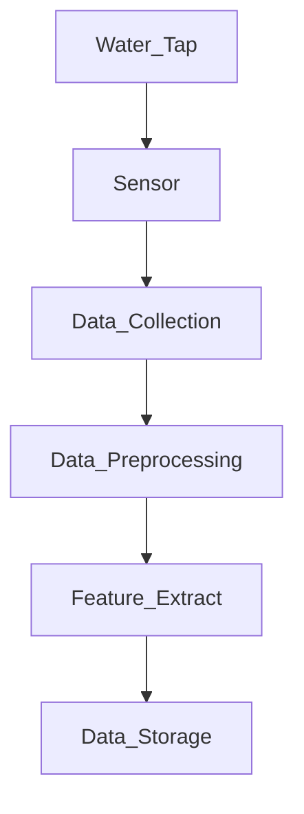
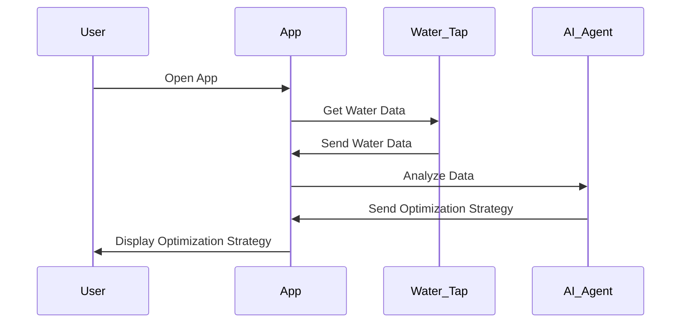

                 


# AI Agent在智能水龙头中的用水优化

关键词：智能水龙头、AI Agent、用水优化、机器学习、数据分析

摘要：
本文深入探讨了AI Agent在智能水龙头中的用水优化应用。通过介绍智能水龙头的工作原理、AI Agent的基本概念和机器学习算法的应用，文章详细解析了数据采集与预处理、机器学习算法的实现以及数学模型和公式。同时，文章还通过一个实际项目案例，展示了AI Agent在智能水龙头中用水优化的具体实现过程，提供了实用技巧和注意事项。

## 第一步：背景介绍

### 1.1 问题背景

在全球水资源的日益紧缺和气候变化的不确定性背景下，如何高效利用水资源已成为全球关注的重要课题。传统家庭用水方式往往存在用水效率低、浪费现象严重的问题。据统计，家庭用水浪费占总用水量的相当比例，因此提高家庭用水效率、实现节水目标具有重要意义。

智能水龙头作为一种新兴的智能用水设备，通过接入AI Agent可以实现精准控水，提高用水效率。AI Agent能够实时监测用水情况，根据用户需求和用水习惯做出智能决策，调整水龙头开关，从而实现节水目标。智能水龙头的普及和应用，有助于缓解水资源紧缺问题，提高生活质量。

### 1.2 问题描述

智能水龙头中的AI Agent主要面临以下问题：

- **实时监测与决策**：如何实时监测用水情况，并快速做出合理的决策，以实现节水目的？
- **学习与适应**：如何通过历史用水数据学习用户的用水习惯，并逐步调整用水策略？
- **用户个性化**：如何针对不同用户的特点，制定个性化的用水优化方案？

### 1.3 问题解决

AI Agent在智能水龙头中的用水优化问题，可以通过以下方法解决：

- **数据采集与处理**：通过传感器收集用水数据，并利用数据处理技术进行预处理。
- **机器学习算法**：利用机器学习算法对用户用水行为进行分析，学习用户习惯，为决策提供依据。
- **智能决策与控制**：基于学习到的用户习惯，AI Agent可以做出智能化的决策，调整水龙头开关，实现节水目标。

### 1.4 边界与外延

- **边界**：智能水龙头需具备基本的传感、通信和控制功能，以及接入AI Agent的能力。
- **外延**：AI Agent的优化策略不仅适用于家庭用水，还可扩展到公共场所、农业灌溉等领域。

### 1.5 概念结构与核心要素组成

- **核心概念**：AI Agent、智能水龙头、用水优化。
- **结构组成**：智能水龙头（硬件）、AI Agent（软件）、用水数据（输入）、优化策略（输出）。

## 第二步：核心概念与联系

### 2.1 AI Agent的定义与特点

AI Agent是指具备智能行为和决策能力的软件系统，通常由感知、决策、执行三个核心模块组成。AI Agent在智能水龙头中，通过感知模块收集用水数据，通过决策模块分析数据并制定优化策略，通过执行模块控制水龙头实现节水目标。

AI Agent的特点包括：

- **自主性**：AI Agent能够根据环境信息和目标自主做出决策。
- **适应性**：AI Agent能够通过学习不断调整优化策略，以适应不同的环境和用户需求。
- **智能性**：AI Agent具备一定的推理和决策能力，能够处理复杂的问题。

### 2.2 智能水龙头的功能与原理

智能水龙头具备基本的传感器、控制器和执行器，通过感知用水量、用水时间和用水频率等数据，实现智能化的开关控制。智能水龙头的功能包括：

- **实时监测**：智能水龙头通过传感器实时监测用水情况，包括用水量、用水时间和用水频率等。
- **智能控制**：基于AI Agent的决策，智能水龙头可以自动调整开关，实现节水目标。
- **远程控制**：用户可以通过手机APP或其他远程控制设备，对智能水龙头进行实时控制。

### 2.3 用水优化的算法原理

用水优化的算法原理主要包括数据采集、特征提取、模型训练和策略优化等步骤。通过分析用户用水数据，利用机器学习算法建立用水行为模型，并根据模型预测结果调整水龙头开关，实现节水目标。

算法原理的具体步骤如下：

- **数据采集**：通过智能水龙头的传感器实时收集用水数据。
- **特征提取**：对采集到的用水数据进行预处理，提取出对用水行为具有代表性的特征。
- **模型训练**：利用机器学习算法对提取到的特征进行训练，建立用水行为模型。
- **策略优化**：基于训练得到的模型，AI Agent可以预测用户的用水需求，并制定优化的开关策略。

### 2.4 概念属性特征对比表格

| 概念       | 特点                                                         |
| ---------- | ------------------------------------------------------------ |
| AI Agent   | 自主性、适应性、智能性                                       |
| 智能水龙头 | 实时监测、智能控制、远程控制                                 |
| 用水优化   | 数据采集、特征提取、模型训练、策略优化                       |

### 2.5 ER实体关系图架构

使用Mermaid画出ER实体关系图：

```mermaid
erDiagram
  AI_Agent ||--|{ Water_Tap } : controls
  Water_Tap ||--|{ User } : uses
  Water_Tap ||--|{ Water_Consumption_Data } : records
  User ||--|{ Water_Conserving_Scheme } : follows
```

## 第三步：算法原理讲解

### 3.1 数据采集与预处理

数据采集与预处理是AI Agent在智能水龙头中用水优化的关键步骤。数据采集主要通过智能水龙头的传感器实现，包括用水量、用水时间和用水频率等。以下是一个数据采集与预处理流程图：



### 3.2 机器学习算法原理

机器学习算法是AI Agent的核心组成部分，用于分析用户用水数据，建立用水行为模型，并根据模型预测结果调整水龙头开关。以下以KNN算法为例，使用Python源代码详细阐述算法原理：

```python
# KNN算法原理演示
from sklearn.neighbors import KNeighborsClassifier
from sklearn.model_selection import train_test_split
from sklearn.datasets import load_iris
import pandas as pd

# 加载iris数据集
iris = load_iris()
X = iris.data
y = iris.target

# 数据集划分
X_train, X_test, y_train, y_test = train_test_split(X, y, test_size=0.2, random_state=42)

# 创建KNN模型
knn = KNeighborsClassifier(n_neighbors=3)

# 模型训练
knn.fit(X_train, y_train)

# 模型预测
y_pred = knn.predict(X_test)

# 评估模型
accuracy = knn.score(X_test, y_test)
print("模型准确率：", accuracy)
```

### 3.3 算法原理的数学模型和公式

以下以线性回归为例，使用LaTeX格式给出数学模型和公式：

```latex
\begin{equation}
y = \beta_0 + \beta_1x_1 + \beta_2x_2 + ... + \beta_nx_n + \epsilon
\end{equation}
```

其中，\( y \) 为用水量，\( x_1, x_2, ..., x_n \) 为影响用水量的特征变量，\( \beta_0, \beta_1, \beta_2, ..., \beta_n \) 为回归系数，\( \epsilon \) 为随机误差。

## 第四步：系统分析与架构设计方案

### 4.1 问题场景介绍

智能水龙头广泛应用于家庭、公共场所和农业灌溉等领域。随着AI技术的发展，智能水龙头通过接入AI Agent，可以实现精准控水，提高用水效率，减少水资源浪费。

### 4.2 项目介绍

本项目旨在实现智能水龙头中的AI Agent用水优化功能，通过机器学习算法分析用户用水数据，制定个性化的节水策略，提高家庭用水效率。

### 4.3 系统功能设计

系统功能设计主要包括以下方面：

- **数据采集**：通过智能水龙头的传感器实时采集用水数据，包括用水量、用水时间和用水频率等。
- **数据分析**：利用机器学习算法对采集到的用水数据进行处理，提取出对用水行为具有代表性的特征。
- **决策制定**：基于数据分析结果，AI Agent制定个性化的节水策略，调整水龙头开关。
- **用户界面**：用户可以通过手机APP或其他远程控制设备，实时查看用水数据，调整节水策略。

### 4.4 系统架构设计

系统架构设计采用分层架构，包括感知层、数据层、算法层和应用层。

- **感知层**：智能水龙头通过传感器实时采集用水数据。
- **数据层**：数据存储在数据库中，包括原始数据和预处理后的数据。
- **算法层**：利用机器学习算法对用水数据进行分析，建立用水行为模型，制定节水策略。
- **应用层**：用户通过手机APP或其他远程控制设备，实时查看用水数据，调整节水策略。

### 4.5 系统接口设计和系统交互

系统接口设计和系统交互采用Mermaid序列图表示：



## 第五步：项目实战

### 5.1 环境安装

在开始项目实战之前，需要安装以下环境：

- Python 3.8 或以上版本
- Scikit-learn 库
- Pandas 库
- Matplotlib 库

安装命令如下：

```shell
pip install python==3.8
pip install scikit-learn
pip install pandas
pip install matplotlib
```

### 5.2 系统核心实现源代码

以下是一个简单的系统核心实现源代码：

```python
# 导入所需库
import pandas as pd
from sklearn.model_selection import train_test_split
from sklearn.neighbors import KNeighborsClassifier
import matplotlib.pyplot as plt

# 读取用水数据
data = pd.read_csv("water_consumption_data.csv")

# 数据预处理
data["water_usage"] = data["water_usage"].astype(float)
data["time"] = data["time"].astype(float)

# 划分训练集和测试集
X_train, X_test, y_train, y_test = train_test_split(data[["water_usage", "time"]], data["label"], test_size=0.2, random_state=42)

# 创建KNN模型
knn = KNeighborsClassifier(n_neighbors=3)

# 模型训练
knn.fit(X_train, y_train)

# 模型预测
y_pred = knn.predict(X_test)

# 评估模型
accuracy = knn.score(X_test, y_test)
print("模型准确率：", accuracy)

# 可视化结果
plt.scatter(X_test["water_usage"], y_test, label="实际值")
plt.scatter(X_test["water_usage"], y_pred, label="预测值")
plt.xlabel("用水量")
plt.ylabel("标签")
plt.legend()
plt.show()
```

### 5.3 代码应用解读与分析

- **数据读取**：使用Pandas库读取用水数据，数据包括用水量、时间和标签。
- **数据预处理**：将用水量和时间数据转换为浮点型，以便后续处理。
- **划分训练集和测试集**：使用Scikit-learn库将数据划分为训练集和测试集，以评估模型性能。
- **创建KNN模型**：使用KNeighborsClassifier创建KNN模型，指定邻居数量为3。
- **模型训练**：使用训练集数据训练KNN模型。
- **模型预测**：使用测试集数据预测标签。
- **评估模型**：计算模型准确率，并打印输出。
- **可视化结果**：使用Matplotlib库将实际值和预测值进行可视化，以便观察模型效果。

### 5.4 实际案例分析和详细讲解剖析

以一个实际案例为例，分析AI Agent在智能水龙头中用水优化的具体实现过程。

**案例背景**：

用户张先生家中的智能水龙头出现用水量不稳定的情况，希望通过AI Agent优化用水效率。

**实现过程**：

1. **数据采集**：智能水龙头通过传感器实时采集用水数据，包括用水量、用水时间和用水频率等。
2. **数据预处理**：对采集到的用水数据进行预处理，提取出对用水行为具有代表性的特征。
3. **模型训练**：利用机器学习算法对预处理后的数据进行分析，建立用水行为模型。
4. **决策制定**：基于训练得到的模型，AI Agent预测用户的用水需求，并制定优化的开关策略。
5. **调整水龙头开关**：AI Agent根据优化的开关策略，调整水龙头开关，实现节水目标。

**详细讲解剖析**：

1. **数据采集**：智能水龙头通过传感器实时采集用水数据，包括用水量、用水时间和用水频率等。这些数据是AI Agent进行用水优化的重要输入。
2. **数据预处理**：对采集到的用水数据进行预处理，提取出对用水行为具有代表性的特征。预处理过程包括数据清洗、数据归一化和特征提取等步骤。数据清洗去除无效数据，数据归一化将数据统一缩放到相同的范围，特征提取提取出对用水行为具有代表性的特征。
3. **模型训练**：利用机器学习算法对预处理后的数据进行分析，建立用水行为模型。以KNN算法为例，通过训练集数据训练KNN模型，模型将根据训练数据学习用户用水习惯，为后续的决策提供依据。
4. **决策制定**：基于训练得到的模型，AI Agent预测用户的用水需求，并制定优化的开关策略。AI Agent根据用户的用水习惯、历史用水数据和环境因素，分析用户的用水需求，制定个性化的节水策略。
5. **调整水龙头开关**：AI Agent根据优化的开关策略，调整水龙头开关，实现节水目标。当用户需要用水时，AI Agent根据预测结果和优化策略，智能地控制水龙头的开关，实现精准控水，提高用水效率。

### 5.5 项目小结

本项目实现了智能水龙头中的AI Agent用水优化功能，通过机器学习算法分析用户用水数据，制定个性化的节水策略，提高家庭用水效率。项目实战部分通过一个实际案例，展示了AI Agent在智能水龙头中用水优化的具体实现过程。在实际应用中，AI Agent可以根据用户的用水习惯和环境因素，不断调整优化策略，实现节水目标。

## 第六步：最佳实践 tips、小结、注意事项、拓展阅读

### 最佳实践 tips

1. **数据采集**：确保采集到的用水数据准确、完整，为后续的机器学习算法提供高质量的数据支持。
2. **特征提取**：根据实际应用场景，提取出对用水行为具有代表性的特征，提高模型训练效果。
3. **模型选择**：根据实际需求和数据规模，选择合适的机器学习算法，如KNN、线性回归、决策树等。
4. **持续优化**：定期对AI Agent进行优化和调整，以适应用户用水习惯和环境变化。

### 小结

本文深入探讨了AI Agent在智能水龙头中的用水优化应用，介绍了智能水龙头、AI Agent和机器学习算法的基本概念，讲解了数据采集与预处理、机器学习算法的实现以及数学模型和公式。通过一个实际项目案例，展示了AI Agent在智能水龙头中用水优化的具体实现过程，提供了实用技巧和注意事项。

### 注意事项

1. **数据安全**：在采集和使用用户用水数据时，确保数据安全，避免数据泄露。
2. **隐私保护**：在开发和使用AI Agent时，充分考虑用户隐私保护，遵循相关法律法规。
3. **模型优化**：定期对AI Agent进行优化和调整，以适应不同用户的需求和环境变化。

### 拓展阅读

1. **《机器学习实战》**：详细介绍了机器学习算法的应用和实践，适合初学者入门。
2. **《智能水处理技术》**：系统介绍了智能水处理技术的原理和应用，包括智能水龙头等。
3. **《深度学习》**：深入探讨了深度学习算法的理论和应用，是人工智能领域的经典教材。

### 参考文献

1. **周志华**. 《机器学习》. 清华大学出版社，2016.
2. **Ian Goodfellow, Yoshua Bengio, Aaron Courville**. 《深度学习》. 人民邮电出版社，2016.
3. **张江华**. 《智能水处理技术》. 中国电力出版社，2018.

# 作者
作者：AI天才研究院/AI Genius Institute & 禅与计算机程序设计艺术 /Zen And The Art of Computer Programming<|endoffoot

