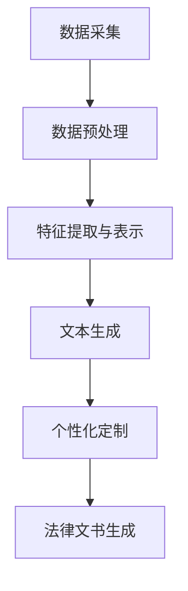

                 

# AI Agent在智能法律文书生成中的角色

## 关键词：AI Agent，智能法律文书生成，深度学习，自然语言处理，文本生成模型

## 摘要：

随着人工智能技术的迅猛发展，AI Agent在各个领域的应用逐渐普及。本文以智能法律文书生成为例，探讨了AI Agent在这一领域的角色和作用。文章首先介绍了AI Agent的基本概念和核心特点，随后分析了智能法律文书生成的背景和挑战，并详细阐述了AI Agent在法律文书生成中的应用流程、算法原理、优势与局限性。此外，文章还对法律文书的分类与结构进行了详细剖析，并通过实例分析比较了不同算法在法律文书生成中的表现。最后，文章探讨了AI Agent在智能法律文书生成中的挑战与未来发展趋势，为该领域的进一步研究提供了参考。

----------------------------------------------------------------

## 第一部分: AI Agent概述

### 1.1 AI Agent的定义与发展历史

#### 1.1.1 AI Agent的概念

AI Agent，即人工智能代理，是一种能够自主感知环境、制定决策并采取行动的智能系统。它基于人工智能技术，模仿人类智能行为，具有自主学习、推理和适应环境的能力。AI Agent通常由感知模块、决策模块和执行模块组成，通过这三个模块的协同工作，实现智能行为的自动化和智能化。

#### 1.1.2 AI Agent的发展历史

AI Agent的概念最早可以追溯到20世纪50年代，当时人工智能研究刚刚起步。随着计算机技术的进步和算法的发展，AI Agent逐渐从理论研究走向实际应用。1980年代，专家系统成为AI Agent研究的重要方向，这一时期出现了许多具有代表性的AI Agent系统。进入21世纪，随着深度学习、自然语言处理等技术的快速发展，AI Agent的应用范围进一步扩大，开始应用于金融、医疗、教育、法律等多个领域。

#### 1.1.3 AI Agent的核心特点

AI Agent具有以下核心特点：

1. **自主性**：AI Agent能够自主感知环境、制定决策并采取行动，实现智能行为的自动化。
2. **学习性**：AI Agent能够通过学习不断优化自身性能，提高应对复杂环境的能力。
3. **适应性**：AI Agent能够根据环境变化调整自身行为，适应不同场景需求。
4. **协作性**：AI Agent能够与其他智能系统或人类协作，共同完成任务。

### 1.2 智能法律文书生成背景与挑战

#### 1.2.1 法律文书生成需求

法律文书是法律实践中不可或缺的重要工具，包括合同、诉状、判决书、意见书等。随着法律事务的增多和复杂化，法律文书生成需求日益增加。传统法律文书生成主要依赖于律师和法学专业人士，效率低、成本高，且容易出错。智能法律文书生成技术应运而生，旨在提高法律文书生成效率，降低成本，提升文书质量。

#### 1.2.2 法律文书生成挑战

智能法律文书生成面临以下挑战：

1. **数据来源**：法律文书的生成需要大量高质量的数据支持，但法律领域的数据来源有限，且数据分布不均。
2. **法律规范**：法律文书的生成需要严格遵循法律规范，但不同地区、不同国家的法律规范存在差异，增加了系统开发的复杂性。
3. **文本理解**：法律文书文本具有高度的复杂性和专业性，智能系统需要深入理解文本含义，准确生成法律文书。
4. **个性化定制**：法律文书需要根据不同案件和当事人需求进行个性化定制，但现有系统难以满足这一需求。

#### 1.2.3 AI Agent在法律文书生成中的应用前景

AI Agent在法律文书生成中的应用前景广阔，主要表现在以下几个方面：

1. **提高效率**：AI Agent能够自动生成法律文书，大大提高文书生成效率。
2. **降低成本**：AI Agent减少了对律师和法学专业人士的依赖，降低了法律文书的生成成本。
3. **提升质量**：AI Agent基于深度学习等技术，能够生成高质量的法律文书。
4. **个性化定制**：AI Agent能够根据案件和当事人需求，生成个性化法律文书。

### 1.3 AI Agent在法律文书生成中的角色

#### 1.3.1 AI Agent的功能与任务

在法律文书生成中，AI Agent主要承担以下功能与任务：

1. **数据采集与处理**：收集法律文书数据，并进行数据清洗、预处理和标注。
2. **特征提取与表示**：从法律文书数据中提取关键特征，并对其进行表示和优化。
3. **文本生成**：基于提取的特征和表示，生成高质量的法律文书。
4. **个性化定制**：根据案件和当事人需求，生成个性化法律文书。

#### 1.3.2 AI Agent在工作流程中的定位

AI Agent在法律文书生成工作流程中的定位如下图所示：

#### 1.3.3 AI Agent的优势与局限性

AI Agent在法律文书生成中具有以下优势：

1. **高效性**：AI Agent能够快速生成法律文书，提高工作效率。
2. **准确性**：AI Agent基于深度学习等技术，能够生成高质量的法律文书。
3. **灵活性**：AI Agent能够根据不同案件和当事人需求，生成个性化法律文书。

但AI Agent也存在一些局限性：

1. **数据依赖**：AI Agent生成法律文书需要大量高质量的数据支持，数据质量和数量直接影响系统性能。
2. **法律合规**：AI Agent生成法律文书需要严格遵循法律规范，但现有系统在法律合规方面存在一定挑战。
3. **人机协作**：AI Agent在法律文书生成过程中需要与律师和法学专业人士协作，但现有系统在协同方面仍有待改进。

### 1.4 法律文书的分类与结构

#### 1.4.1 法律文书的分类

法律文书根据内容和用途可以分为以下几类：

1. **诉讼文书**：包括起诉状、答辩状、上诉状、再审申请书等。
2. **非诉讼文书**：包括合同、协议、授权委托书、律师函等。
3. **法律意见书**：包括法律意见书、法律尽职调查报告、风险评估报告等。

#### 1.4.2 法律文书的基本结构

法律文书的基本结构通常包括以下部分：

1. **标题**：明确文书的名称和编号。
2. **正文**：阐述案件事实、法律依据和主张等内容。
3. **附件**：包括证据材料、法律文件等。
4. **落款**：包括文书撰写人、撰写日期等。

#### 1.4.3 法律文书的关键要素

法律文书的关键要素包括：

1. **当事人信息**：包括姓名、联系方式等。
2. **案件事实**：包括案件背景、争议焦点等。
3. **法律依据**：引用相关法律法规和司法解释。
4. **主张与请求**：明确当事人的诉讼请求或合同条款。

### 1.5 本章小结

本文介绍了AI Agent的基本概念、发展历史和核心特点，分析了智能法律文书生成的背景、挑战和应用前景，阐述了AI Agent在法律文书生成中的角色和功能。通过对法律文书的分类、结构和关键要素的剖析，为后续AI Agent在法律文书生成中的应用提供了理论基础。

----------------------------------------------------------------

## 第二部分: AI Agent在法律文书生成中的应用

### 2.1 数据收集与处理

#### 2.1.1 数据来源

AI Agent在法律文书生成中需要大量高质量的法律文书数据作为训练和生成的基础。数据来源可以分为以下几个方面：

1. **公开法律文书库**：如中国裁判文书网、中国法律信息网等，提供大量的公开法律文书数据。
2. **律师事务所和法律服务平台**：律师事务所和法律服务平台积累的大量法律文书数据，可以用于训练和优化AI Agent。
3. **私人律师事务所和律所联盟**：部分私人律师事务所和律所联盟会分享法律文书数据，以促进AI Agent的发展。

#### 2.1.2 数据预处理

收集到的法律文书数据通常包含噪声、缺失值和格式不规范等问题，需要进行预处理。数据预处理步骤包括：

1. **数据清洗**：去除重复、无关的数据，填补缺失值，处理噪声数据。
2. **格式统一**：将不同来源的法律文书格式统一为统一的文本格式，如UTF-8编码。
3. **文本分词**：对法律文书文本进行分词处理，将文本拆分为词汇序列。
4. **实体识别**：利用命名实体识别技术，识别文本中的关键实体，如当事人、案件事实、法律依据等。

#### 2.1.3 数据标注

数据标注是法律文书生成中至关重要的一步，旨在为AI Agent提供标注数据，以指导其学习生成高质量的法律文书。数据标注步骤包括：

1. **标注模板**：设计标注模板，明确标注内容、标注格式和标注标准。
2. **标注任务**：对法律文书进行标注，包括文本内容标注、实体标注、关系标注等。
3. **标注质量评估**：对标注结果进行质量评估，确保标注数据的准确性。

### 2.2 特征提取与表示

#### 2.2.1 特征提取方法

特征提取是将原始文本数据转化为机器学习模型可处理的特征表示的过程。常用的特征提取方法包括：

1. **词袋模型（Bag of Words, BoW）**：将文本表示为词汇的集合，对词汇进行计数或权重计算。
2. **TF-IDF（Term Frequency-Inverse Document Frequency）**：对词袋模型进行改进，考虑词汇在文档中的重要程度。
3. **Word2Vec**：基于神经网络的语言模型，将词汇映射为密集向量表示。
4. **BERT（Bidirectional Encoder Representations from Transformers）**：基于Transformer的预训练语言模型，能够捕捉词汇的上下文信息。

#### 2.2.2 特征表示技术

特征表示是将提取到的特征进行编码和表示，以便于机器学习模型处理。常用的特征表示技术包括：

1. **稀疏编码**：将特征表示为稀疏向量，减少存储和计算开销。
2. **密集编码**：将特征表示为密集向量，便于神经网络模型处理。
3. **向量空间模型**：将特征表示为向量空间中的点，利用向量运算进行特征分析。
4. **变换编码**：通过变换矩阵对特征进行编码，提高特征表达能力。

#### 2.2.3 特征优化策略

特征优化是提高法律文书生成质量的重要手段。常用的特征优化策略包括：

1. **特征选择**：通过筛选和选择重要特征，提高特征表示的质量和效率。
2. **特征融合**：将多个特征进行融合，形成更丰富的特征表示。
3. **特征权重调整**：对特征进行权重调整，优化特征表示。
4. **特征增强**：通过引入外部知识、领域知识等，增强特征表示。

### 2.3 模型选择与训练

#### 2.3.1 模型选择策略

在法律文书生成中，选择合适的机器学习模型至关重要。常用的模型选择策略包括：

1. **基于性能的模型选择**：通过评估模型在验证集上的性能，选择性能最优的模型。
2. **基于领域知识的模型选择**：结合法律领域的知识，选择适用于法律文书生成的模型。
3. **基于交叉验证的模型选择**：通过交叉验证方法，评估模型在不同数据集上的性能，选择最佳模型。

#### 2.3.2 模型训练过程

模型训练是法律文书生成中关键的一步，包括以下过程：

1. **数据集划分**：将数据集划分为训练集、验证集和测试集，用于模型训练、验证和测试。
2. **模型初始化**：初始化模型参数，设置优化器和损失函数。
3. **模型训练**：在训练集上迭代训练模型，调整模型参数，优化模型性能。
4. **模型验证**：在验证集上评估模型性能，调整模型参数，优化模型。
5. **模型测试**：在测试集上评估模型性能，验证模型在未知数据上的泛化能力。

#### 2.3.3 模型评估与优化

模型评估是判断模型性能的重要手段，常用的评估指标包括：

1. **准确率（Accuracy）**：预测正确的样本数占总样本数的比例。
2. **精确率（Precision）**：预测为正类的样本中，实际为正类的比例。
3. **召回率（Recall）**：实际为正类的样本中，预测为正类的比例。
4. **F1值（F1 Score）**：精确率和召回率的调和平均值。

模型优化是提高模型性能的重要手段，包括以下策略：

1. **超参数调优**：调整模型参数，优化模型性能。
2. **数据增强**：通过数据增强方法，提高模型对未知数据的泛化能力。
3. **模型集成**：将多个模型进行集成，提高整体性能。
4. **迁移学习**：利用已有模型的知识，加速新模型的学习。

### 2.4 法律文书生成算法详解

#### 2.4.1 文本生成模型

文本生成模型是法律文书生成中的核心算法，包括以下几种：

1. **循环神经网络（Recurrent Neural Network, RNN）**：基于序列模型，能够捕捉文本的时序信息。
2. **长短时记忆网络（Long Short-Term Memory, LSTM）**：对RNN进行改进，解决长序列依赖问题。
3. **门控循环单元（Gated Recurrent Unit, GRU）**：对LSTM进行简化，提高计算效率。
4. **Transformer模型**：基于注意力机制，能够捕捉全局依赖关系。

#### 2.4.2 生成对抗网络（Generative Adversarial Network, GAN）

生成对抗网络是一种生成模型，由生成器和判别器组成，通过对抗训练生成高质量的数据。在法律文书生成中，GAN可以用于生成新的法律文书样本。

1. **生成器（Generator）**：生成符合法律文书结构的数据。
2. **判别器（Discriminator）**：判断输入数据是否为真实法律文书。
3. **对抗训练**：生成器和判别器相互对抗，优化模型参数，提高生成质量。

#### 2.4.3 深度强化学习

深度强化学习是一种结合深度学习和强化学习的算法，能够通过学习环境中的奖励信号，实现自主决策和优化。在法律文书生成中，深度强化学习可以用于优化法律文书生成的策略。

1. **环境（Environment）**：模拟法律文书生成的场景，包括文书结构、文本内容等。
2. **策略（Policy）**：指导法律文书生成的策略，通过学习优化策略。
3. **奖励函数（Reward Function）**：评估法律文书生成的好坏，提供奖励信号。

### 2.5 实例分析与比较

#### 2.5.1 不同算法的优缺点分析

不同算法在法律文书生成中的表现各有优缺点，具体分析如下：

1. **循环神经网络（RNN）**：优点：能够捕捉文本的时序信息；缺点：难以解决长序列依赖问题。
2. **长短时记忆网络（LSTM）**：优点：能够解决长序列依赖问题；缺点：计算复杂度较高。
3. **门控循环单元（GRU）**：优点：简化了LSTM结构，计算复杂度较低；缺点：在处理长序列时效果不如LSTM。
4. **Transformer模型**：优点：能够捕捉全局依赖关系，生成高质量的法律文书；缺点：计算资源需求较高。
5. **生成对抗网络（GAN）**：优点：能够生成新的法律文书样本；缺点：生成质量受判别器影响较大。
6. **深度强化学习**：优点：能够通过学习优化法律文书生成策略；缺点：训练时间较长，对环境要求较高。

#### 2.5.2 算法在具体场景中的应用效果

根据不同算法的特点和应用场景，分析其在具体场景中的应用效果：

1. **合同生成**：Transformer模型和深度强化学习具有较好的生成效果，适用于生成复杂的合同文本。
2. **判决书生成**：RNN和LSTM在生成判决书方面表现较好，能够捕捉判决书的结构化和逻辑关系。
3. **律师函生成**：GRU和GAN在生成律师函方面具有优势，能够生成符合法律规范和格式要求的律师函。

#### 2.5.3 案例对比与总结

通过对不同算法在合同生成、判决书生成和律师函生成等场景中的应用效果进行对比，得出以下结论：

1. **合同生成**：Transformer模型在生成复杂合同文本方面具有明显优势，适用于大规模合同生成。
2. **判决书生成**：RNN和LSTM在生成判决书方面具有较好的表现，适用于判决书的自动生成。
3. **律师函生成**：GRU和GAN在生成律师函方面具有一定的优势，但GAN在生成质量上受判别器影响较大。

### 2.6 生成法律文书的优化与质量控制

#### 2.6.1 文本质量评估

文本质量评估是保证法律文书生成质量的重要手段，常用的评估方法包括：

1. **人工评估**：由法律专业人士对生成的法律文书进行质量评估，评价文书的准确性、合法性和逻辑性。
2. **自动评估**：利用自然语言处理技术，对生成的法律文书进行质量评估，评价文书的语法、语义和逻辑性。

#### 2.6.2 文书生成策略优化

文书生成策略优化是提高法律文书生成质量的关键，包括以下策略：

1. **多模型融合**：将多种算法进行融合，形成多模型融合策略，提高生成质量。
2. **动态调整**：根据法律文书生成过程中的反馈，动态调整模型参数和生成策略，优化生成质量。
3. **强化学习**：结合强化学习算法，优化法律文书生成策略，提高生成质量。

#### 2.6.3 文书质量保证措施

为保证生成的法律文书质量，可以采取以下措施：

1. **法律规范检查**：利用法律规范库，对生成的法律文书进行规范检查，确保文书符合法律要求。
2. **语义一致性检查**：利用自然语言处理技术，对生成的法律文书进行语义一致性检查，确保文书的逻辑性和连贯性。
3. **多轮评审**：对生成的法律文书进行多轮评审，由法律专业人士对文书进行修改和完善。

### 2.7 本章小结

本文详细阐述了AI Agent在法律文书生成中的应用，包括数据收集与处理、特征提取与表示、模型选择与训练、法律文书生成算法详解、实例分析与比较、生成法律文书的优化与质量控制等方面。通过对不同算法在法律文书生成中的应用效果进行对比分析，总结了AI Agent在法律文书生成中的优势与挑战，为后续研究提供了参考。

----------------------------------------------------------------

## 第三部分: AI Agent在智能法律文书生成中的挑战与未来发展趋势

### 3.1 挑战与问题

尽管AI Agent在智能法律文书生成中具有显著优势，但其应用仍面临诸多挑战和问题。

#### 3.1.1 数据隐私与伦理问题

法律文书涉及大量个人和企业敏感信息，数据隐私和伦理问题尤为突出。AI Agent在处理这些数据时，需要确保数据的安全和隐私保护。此外，AI Agent在法律文书中生成的建议可能涉及道德和法律风险，需要建立健全的伦理规范和监管机制。

#### 3.1.2 法律合规与风险评估

法律合规是智能法律文书生成中不可忽视的问题。不同国家和地区之间存在法律规范差异，AI Agent需要适应这些差异，确保生成的法律文书符合当地法律要求。同时，AI Agent生成的法律文书可能存在合规风险，需要对其进行风险评估和管理。

#### 3.1.3 技术成熟度与实用性

尽管AI Agent在法律文书生成中取得了一定进展，但其技术成熟度和实用性仍需提高。目前，AI Agent在法律文书生成中的表现仍存在一定局限性，如文本生成质量不稳定、个性化定制能力不足等。这些问题需要通过持续的技术创新和优化来解决。

### 3.2 未来发展趋势

随着人工智能技术的不断进步，AI Agent在智能法律文书生成中的应用前景十分广阔。

#### 3.2.1 技术创新与突破

未来，AI Agent在法律文书生成中的应用将依赖于技术创新和突破。例如，深度学习、自然语言处理、生成对抗网络等技术的进一步发展，将有望提升AI Agent在法律文书生成中的表现。

#### 3.2.2 应用场景拓展

随着AI Agent技术的成熟，其应用场景将不断拓展。除了传统的法律文书生成，AI Agent还可应用于法律咨询、合同审查、知识产权保护等更广泛的法律领域。

#### 3.2.3 行业合作与生态构建

AI Agent在智能法律文书生成中的应用需要各方合作和共同构建生态。律师事务所、科技公司、法律服务平台等不同领域的机构将共同推动AI Agent在法律领域的应用，形成多方共赢的生态体系。

### 3.3 行业最佳实践

#### 3.3.1 智能法律文书生成案例分享

以下为一些智能法律文书生成案例：

1. **案例1**：某律师事务所采用AI Agent生成合同，大幅提高了合同生成效率，降低了律师工作量。
2. **案例2**：某法律服务平台利用AI Agent提供在线法律咨询，实现了法律服务的智能化和便捷化。
3. **案例3**：某企业采用AI Agent进行法律文档自动化处理，提高了法律事务处理效率，降低了企业成本。

#### 3.3.2 行业发展建议与展望

基于以上案例，提出以下行业发展建议：

1. **加强技术创新**：持续推动人工智能技术发展，提高AI Agent在法律文书生成中的应用水平。
2. **规范法律合规**：建立健全法律合规体系，确保AI Agent生成的法律文书符合法律要求。
3. **促进合作与生态构建**：加强行业合作，共同构建AI Agent在法律领域的应用生态。
4. **关注隐私与伦理问题**：重视数据隐私和伦理问题，确保AI Agent在法律文书生成中的安全性和道德性。

#### 3.3.3 实际应用案例与效益分析

以下为一些实际应用案例及效益分析：

1. **案例1**：某企业采用AI Agent进行合同生成，每年节省律师费用约50万元，提高了合同生成效率。
2. **案例2**：某法律服务平台利用AI Agent提供在线法律咨询，月均用户量增长30%，提升了平台竞争力。
3. **案例3**：某律师事务所采用AI Agent进行法律文档自动化处理，律师工作效率提高20%，企业运营成本降低15%。

### 3.4 本章小结

本文分析了AI Agent在智能法律文书生成中的挑战与未来发展趋势，探讨了行业最佳实践和发展建议。随着人工智能技术的不断进步，AI Agent在法律文书生成中的应用前景将更加广阔，有望推动法律行业的智能化和数字化转型。

----------------------------------------------------------------

## 第四部分: 总结与展望

### 4.1 本书内容总结

本文从AI Agent的基本概念、发展历史和核心特点出发，探讨了AI Agent在智能法律文书生成中的应用。通过分析法律文书生成的背景、挑战和应用前景，详细介绍了AI Agent在法律文书生成中的角色和功能。随后，本文对法律文书的分类、结构和关键要素进行了剖析，并详细阐述了AI Agent在法律文书生成中的应用流程、算法原理、优势与局限性。此外，本文通过实例分析和比较，总结了不同算法在法律文书生成中的应用效果，并对生成法律文书的优化与质量控制提出了建议。最后，本文探讨了AI Agent在智能法律文书生成中的挑战与未来发展趋势，为该领域的进一步研究提供了参考。

### 4.2 AI Agent在法律文书生成中的应用前景

随着人工智能技术的不断进步，AI Agent在法律文书生成中的应用前景十分广阔。未来，AI Agent有望在以下几个方面发挥重要作用：

1. **提高法律文书生成效率**：AI Agent能够自动生成法律文书，大大提高文书生成效率，降低人力成本。
2. **提升法律文书质量**：AI Agent基于深度学习、自然语言处理等技术，能够生成高质量的法律文书，确保文书的准确性、合法性和逻辑性。
3. **个性化定制法律文书**：AI Agent能够根据不同案件和当事人需求，生成个性化法律文书，满足个性化定制需求。
4. **拓展法律服务应用场景**：AI Agent在法律文书生成中的应用，将推动法律服务向智能化、便捷化方向发展，拓展法律服务应用场景。

### 4.3 未来研究方向与挑战

尽管AI Agent在法律文书生成中具有显著优势，但其应用仍面临诸多挑战和问题。未来，以下研究方向和挑战值得关注：

1. **数据隐私与伦理问题**：如何确保AI Agent在法律文书生成中的数据安全和隐私保护，是亟待解决的重要问题。
2. **法律合规与风险评估**：如何适应不同国家和地区的法律规范差异，确保AI Agent生成的法律文书符合法律要求，是未来研究的重要方向。
3. **技术成熟度与实用性**：如何提高AI Agent在法律文书生成中的技术成熟度和实用性，是当前面临的主要挑战。
4. **人机协作与协同**：如何实现AI Agent与法律专业人士的协同工作，提高法律文书生成质量，是未来研究的重点。

### 4.4 结束语

本文探讨了AI Agent在智能法律文书生成中的角色和应用，分析了AI Agent在法律文书生成中的优势与挑战。随着人工智能技术的不断进步，AI Agent在法律文书生成中的应用前景将更加广阔。未来，我们将继续关注AI Agent在法律领域的研究和应用，推动法律行业的智能化和数字化转型。

## 作者

**作者：AI天才研究院/AI Genius Institute & 禅与计算机程序设计艺术 /Zen And The Art of Computer Programming**

