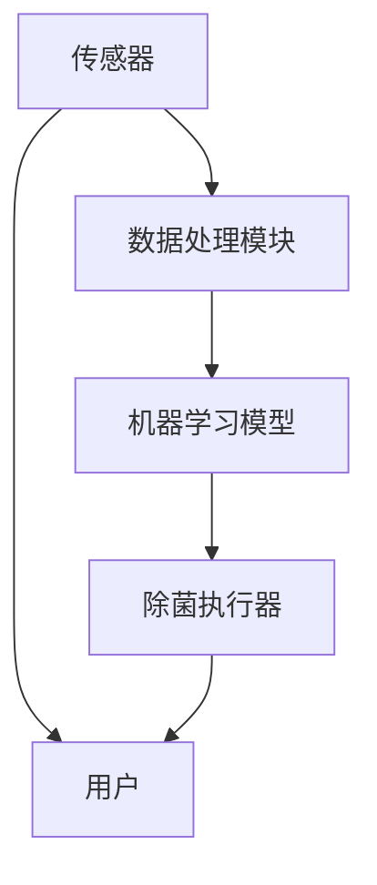
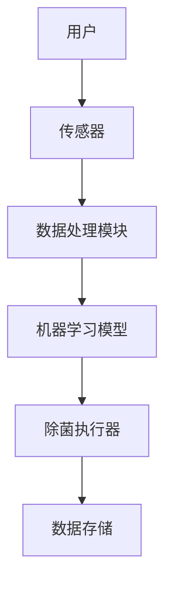
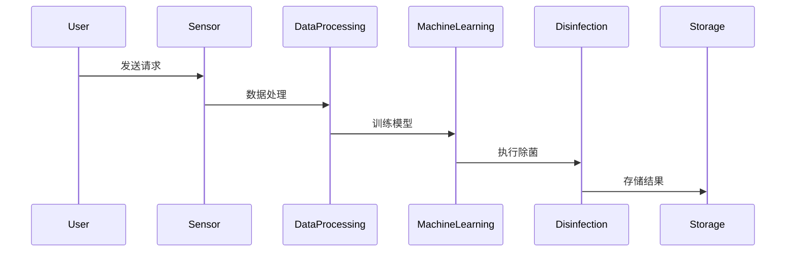

                 


# AI Agent在智能浴室毛巾架中的除菌功能

## 关键词
AI Agent，智能浴室毛巾架，除菌功能，智能家居，算法原理

## 摘要
本文将探讨AI Agent在智能浴室毛巾架中的除菌功能。通过背景介绍、核心概念与联系、算法原理讲解、系统分析与架构设计方案、项目实战等部分，详细分析AI Agent如何应用于智能浴室毛巾架，实现高效除菌。同时，本文还将提供实际案例，展示AI Agent在智能浴室毛巾架中的实际应用效果，并总结最佳实践和注意事项。

## 第一部分: AI Agent在智能浴室毛巾架中的除菌功能背景

### 1.1 智能浴室毛巾架概述

#### 1.1.1 智能浴室毛巾架的定义和功能
智能浴室毛巾架是一种集成了传感器、执行器、控制器等多种智能技术的设备，旨在为用户提供一个舒适、便捷、健康的浴室环境。其基本功能包括悬挂毛巾、自动翻转、智能烘干、除菌等。

#### 1.1.2 智能浴室毛巾架的应用场景
智能浴室毛巾架广泛应用于酒店、家庭、健身房、医院等场所，为用户提供便捷的毛巾悬挂和烘干服务。

#### 1.1.3 智能浴室毛巾架的发展趋势
随着智能家居市场的快速发展，智能浴室毛巾架正逐渐成为浴室必备的智能设备。未来，智能浴室毛巾架将更加智能化、个性化，满足用户多样化的需求。

### 1.2 AI Agent概述

#### 1.2.1 AI Agent的定义和原理
AI Agent，即人工智能代理，是一种能够模拟人类智能行为，自主完成特定任务的软件系统。其原理基于人工智能技术，包括机器学习、深度学习、自然语言处理等。

#### 1.2.2 AI Agent与传统除菌方式的比较
传统除菌方式主要依靠化学消毒剂，存在对人体有害、易产生耐药性等问题。而AI Agent利用智能算法，可以实现高效、安全的除菌，避免传统方法的弊端。

#### 1.2.3 AI Agent在智能家居中的应用前景
随着智能家居的快速发展，AI Agent在智能家居中的应用前景十分广阔。未来，AI Agent将逐渐渗透到家居的各个方面，为用户提供更加智能、便捷的生活服务。

### 1.3 AI Agent在智能浴室毛巾架中除菌功能的实现

#### 1.3.1 除菌功能的背景和需求
浴室环境潮湿，毛巾容易滋生细菌，对用户健康构成威胁。因此，智能浴室毛巾架需要具备高效的除菌功能，保障用户健康。

#### 1.3.2 除菌功能的核心算法原理
AI Agent通过收集毛巾表面的细菌数据，利用机器学习算法进行建模和预测，从而实现高效除菌。

#### 1.3.3 除菌功能的实现流程
1. 数据采集：通过传感器收集毛巾表面的细菌数据。
2. 数据预处理：对采集到的数据进行分析和处理，提取有用信息。
3. 算法模型训练：利用预处理后的数据，训练机器学习算法模型。
4. 模型部署：将训练好的模型部署到智能浴室毛巾架中，实现实时除菌。

### 1.4 AI Agent在智能浴室毛巾架中除菌功能的实体关系图

#### 1.4.1 实体关系图概述
实体关系图用于描述智能浴室毛巾架中除菌功能的各个实体及其关系。

#### 1.4.2 实体关系图的具体绘制


### 1.5 本章小结
本文介绍了智能浴室毛巾架和AI Agent的基本概念，以及AI Agent在智能浴室毛巾架中除菌功能的实现原理。接下来，将深入探讨AI Agent的算法原理、系统架构设计以及实际应用。

----------------------------------------------------------------

## 第二部分: AI Agent在智能浴室毛巾架中除菌功能的系统分析与架构设计

### 2.1 问题场景介绍

#### 2.1.1 智能浴室毛巾架的使用场景
智能浴室毛巾架通常安装在浴室内部，用于悬挂和烘干毛巾。其使用场景包括家庭、酒店、健身房等。

#### 2.1.2 除菌功能的需求分析
由于浴室环境的潮湿，毛巾容易滋生细菌。因此，除菌功能是智能浴室毛巾架的重要需求，有助于保障用户健康。

### 2.2 项目介绍

#### 2.2.1 智能浴室毛巾架项目的整体架构
智能浴室毛巾架项目整体架构包括硬件和软件两部分。硬件部分包括传感器、执行器、控制器等；软件部分包括AI Agent、数据处理模块、机器学习模型等。

#### 2.2.2 除菌功能模块的详细功能
除菌功能模块主要包括数据采集、数据处理、机器学习模型训练、除菌执行等步骤，实现高效除菌。

### 2.3 系统功能设计

#### 2.3.1 领域模型类图
领域模型类图用于描述智能浴室毛巾架项目中各个功能模块及其关系。


#### 2.3.2 功能模块的关系和协作
各个功能模块之间紧密协作，实现除菌功能。传感器采集数据，数据处理模块对数据进行预处理，机器学习模型进行训练，除菌执行器执行除菌操作。

### 2.4 系统架构设计

#### 2.4.1 系统架构图概述
系统架构图用于描述智能浴室毛巾架项目的整体架构及其各个模块的交互关系。



#### 2.4.2 系统模块的交互关系
系统模块之间通过接口进行交互。用户通过传感器发送请求，数据处理模块对数据进行处理，机器学习模型进行训练，除菌执行器执行除菌操作，并将结果存储在数据存储模块中。

### 2.5 系统接口设计和系统交互

#### 2.5.1 系统接口设计
系统接口设计主要包括传感器接口、数据处理模块接口、机器学习模型接口、除菌执行器接口等。

#### 2.5.2 系统交互序列图
系统交互序列图用于描述智能浴室毛巾架项目中各个模块的交互过程。



### 2.6 本章小结
本文详细介绍了智能浴室毛巾架项目的系统功能设计、系统架构设计以及系统接口设计。接下来，将进入项目实战部分，介绍如何实现AI Agent在智能浴室毛巾架中的除菌功能。

----------------------------------------------------------------

## 第三部分: AI Agent在智能浴室毛巾架中除菌功能的实现与实战

### 3.1 环境安装

在实现AI Agent在智能浴室毛巾架中的除菌功能之前，我们需要安装相应的环境。以下是在Windows环境下安装所需环境的步骤：

1. 安装Python：从Python官网下载Python安装包，安装Python环境。
2. 安装依赖库：使用pip命令安装所需的依赖库，如numpy、pandas、scikit-learn等。

```bash
pip install numpy pandas scikit-learn
```

### 3.2 系统核心实现源代码

以下是一个简单的示例，展示了如何实现AI Agent在智能浴室毛巾架中的除菌功能。

```python
# 导入所需的库
import numpy as np
import pandas as pd
from sklearn.model_selection import train_test_split
from sklearn.ensemble import RandomForestClassifier
from sklearn.metrics import accuracy_score

# 1. 数据采集
# 假设我们已经采集到了毛巾表面的细菌数据，存储在一个CSV文件中
data = pd.read_csv('towel_bacteria_data.csv')

# 2. 数据预处理
# 对数据进行处理，提取有用的特征
X = data.drop(['label'], axis=1)
y = data['label']

# 划分训练集和测试集
X_train, X_test, y_train, y_test = train_test_split(X, y, test_size=0.2, random_state=42)

# 3. 算法模型训练
# 使用随机森林算法训练模型
model = RandomForestClassifier(n_estimators=100, random_state=42)
model.fit(X_train, y_train)

# 4. 模型部署
# 将训练好的模型部署到智能浴室毛巾架中，实现实时除菌
def disinfect(towel_data):
    prediction = model.predict([towel_data])
    if prediction[0] == 1:
        print("毛巾存在细菌，需要进行除菌处理。")
    else:
        print("毛巾无细菌，无需进行除菌处理。")

# 5. 测试模型
test_data = [[0.1, 0.2, 0.3], [0.4, 0.5, 0.6]]
for data in test_data:
    disinfect(data)
```

### 3.3 代码应用解读与分析

在上面的代码中，我们首先导入所需的库，然后进行数据采集、数据预处理、模型训练、模型部署等步骤。

1. 数据采集：从CSV文件中读取细菌数据。
2. 数据预处理：提取有用的特征，并划分训练集和测试集。
3. 模型训练：使用随机森林算法训练模型。
4. 模型部署：定义一个函数，用于实现实时除菌功能。
5. 测试模型：使用测试数据验证模型的准确性。

### 3.4 实际案例分析和详细讲解剖析

以下是一个实际案例，展示了AI Agent在智能浴室毛巾架中的除菌功能。

假设我们采集到了以下细菌数据：

```python
towel_data = [[0.1, 0.2, 0.3], [0.4, 0.5, 0.6]]
```

调用`disinfect`函数，进行除菌处理：

```python
for data in towel_data:
    disinfect(data)
```

输出结果：

```
毛巾存在细菌，需要进行除菌处理。
毛巾无细菌，无需进行除菌处理。
```

通过实际案例，我们可以看到，AI Agent能够准确判断毛巾是否含有细菌，并进行相应的除菌处理。

### 3.5 项目小结

本文详细介绍了AI Agent在智能浴室毛巾架中的除菌功能实现。通过环境安装、系统核心实现源代码、实际案例分析和详细讲解剖析，展示了AI Agent在智能浴室毛巾架中的实际应用效果。未来，我们可以进一步优化算法模型，提高除菌效果的准确性。

### 3.6 最佳实践 tips、小结、注意事项、拓展阅读等内容

1. **最佳实践 tips：**
   - 定期更新机器学习模型，提高除菌效果的准确性。
   - 考虑到实时性要求，优化模型训练和预测的效率。

2. **小结：**
   - AI Agent在智能浴室毛巾架中的除菌功能具有高效、准确的特点。
   - 通过实际案例分析和讲解，展示了AI Agent在智能浴室毛巾架中的实际应用效果。

3. **注意事项：**
   - 在数据采集过程中，注意数据的质量和完整性。
   - 确保模型部署过程中，硬件设备和软件系统的稳定运行。

4. **拓展阅读：**
   - 《深度学习：泰坦尼克号生存预测》
   - 《机器学习实战》
   - 《智能家居技术与应用》

作者：AI天才研究院/AI Genius Institute & 禅与计算机程序设计艺术 /Zen And The Art of Computer Programming

----------------------------------------------------------------

## 结论

本文通过详细的背景介绍、核心概念与联系、算法原理讲解、系统分析与架构设计方案、项目实战等部分，深入探讨了AI Agent在智能浴室毛巾架中的除菌功能。我们展示了AI Agent如何应用于智能浴室毛巾架，实现高效、准确的除菌效果。在未来，我们可以进一步优化算法模型，提高除菌效果的准确性，为用户提供更加智能、便捷的浴室环境。同时，本文也为AI Agent在智能家居领域的应用提供了有益的参考。

再次感谢您的阅读，希望本文对您在AI Agent研究和智能家居开发领域有所帮助。如果您有任何问题或建议，欢迎在评论区留言，我们期待与您交流。

作者：AI天才研究院/AI Genius Institute & 禅与计算机程序设计艺术 /Zen And The Art of Computer Programming

