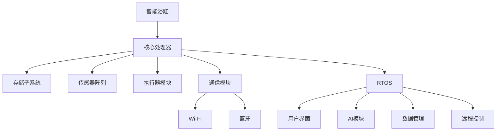

                 


## AI Agent在智能浴缸中的水疗模式个性化

### 关键词：AI Agent，智能浴缸，水疗模式，个性化，智能家居，深度学习，算法优化

### 摘要：

随着智能家居市场的迅速发展，智能浴缸作为其中的一员，越来越受到消费者的关注。本文将探讨AI Agent在智能浴缸中的水疗模式个性化应用，从问题背景、核心概念、技术原理、系统集成、实战案例和未来展望等多个角度，深入解析AI Agent如何为用户提供定制化的水疗体验。

### 目录

1. **背景与核心概念**  
   1.1 智能浴缸的发展历程  
   1.2 AI Agent的基本概念  
   1.3 问题解决与边界外延

2. **AI Agent技术原理**  
   2.1 AI Agent原理概述  
   2.2 AI Agent核心原理  
   2.3 AI Agent应用场景

3. **水疗模式个性化原理**  
   3.1 水疗模式概述  
   3.2 个性化原理  
   3.3 个性化应用

4. **智能浴缸与AI Agent集成**  
   4.1 智能浴缸系统架构  
   4.2 AI Agent在智能浴缸中的应用

5. **水疗模式个性化实战**  
   5.1 水疗模式个性化实现  
   5.2 水疗模式个性化系统优化

6. **未来展望与最佳实践**  
   6.1 未来发展趋势  
   6.2 最佳实践与小结

### 1. 背景与核心概念

#### 1.1 智能浴缸的发展历程

智能浴缸作为智能家居领域的一个重要分支，经历了从简单到复杂、从单一功能到多功能集成的演变过程。早期的智能浴缸主要提供基础的泡浴功能，而现代智能浴缸则集成了水疗、按摩、加热、自动清洁等多种功能，用户可以通过手机、语音助手等多种方式进行操控。

#### 1.2 AI Agent的基本概念

AI Agent，即人工智能代理，是一种基于人工智能技术的自动化系统，能够模拟人类的决策过程，自主执行任务。在智能家居领域，AI Agent可以充当用户的智能助手，根据用户的行为习惯、健康状况等数据，提供个性化的服务和建议。

#### 1.3 问题解决与边界外延

随着智能浴缸功能的日益丰富，用户对水疗模式个性化的需求也越来越高。传统的固定模式已经无法满足用户多样化的需求。AI Agent可以通过收集用户的使用数据，利用机器学习算法，为用户提供定制化的水疗模式，从而提升用户的体验。

#### 1.4 概念结构与核心要素组成

AI Agent的核心要素包括数据采集模块、机器学习模块、执行控制模块和用户交互模块。数据采集模块负责收集用户的使用数据，机器学习模块负责分析这些数据，提取出有效的信息，执行控制模块负责根据分析结果调整水疗模式，用户交互模块则负责与用户进行沟通，获取用户反馈。

### 2. AI Agent技术原理

#### 2.1 AI Agent原理概述

AI Agent的工作原理可以分为三个主要阶段：感知、理解和决策。感知阶段，AI Agent通过传感器收集环境数据；理解阶段，AI Agent利用机器学习算法对数据进行分析，提取出有用的信息；决策阶段，AI Agent根据分析结果执行相应的任务。

#### 2.2 AI Agent核心原理

AI Agent的核心原理是基于机器学习和深度学习算法。机器学习算法可以从大量的数据中自动学习规律，而深度学习算法则可以模拟人类大脑的神经网络，进行更高层次的抽象和学习。

#### 2.3 AI Agent应用场景

AI Agent在智能家居中的应用场景非常广泛，包括但不限于智能照明、智能安防、智能家电等。在智能浴缸中，AI Agent可以应用于水疗模式的个性化推荐、用户行为预测、设备故障诊断等。

### 3. 水疗模式个性化原理

#### 3.1 水疗模式概述

水疗模式是指通过调节水温、水流、按摩力度等参数，为用户创造舒适的水疗体验。现代水疗模式通常包括泡浴、按摩、气泡、气泡按摩等多种类型。

#### 3.2 个性化原理

个性化原理基于用户数据的收集和分析。AI Agent通过收集用户的历史使用数据，如水温偏好、按摩力度偏好等，利用机器学习算法，为用户生成个性化的水疗模式。

#### 3.3 个性化应用

个性化应用主要包括体质分析、水疗模式推荐等。通过分析用户的体质数据，AI Agent可以推荐适合用户的水疗模式，从而提升用户的体验。

### 4. 智能浴缸与AI Agent集成

#### 4.1 智能浴缸系统架构

智能浴缸系统架构主要包括硬件部分和软件部分。硬件部分包括传感器、执行器等，软件部分包括操作系统、AI Agent等。

#### 4.2 AI Agent在智能浴缸中的应用

AI Agent在智能浴缸中的应用主要包括数据采集、模式推荐等。AI Agent可以通过收集用户的使用数据，为用户推荐合适的水疗模式。

### 5. 水疗模式个性化实战

#### 5.1 水疗模式个性化实现

水疗模式个性化实现主要包括数据采集、数据分析、模式推荐等步骤。通过这些步骤，AI Agent可以为用户提供定制化的水疗模式。

#### 5.2 水疗模式个性化系统优化

水疗模式个性化系统优化主要包括算法优化、系统性能优化等。通过优化，可以提高水疗模式的推荐准确性，提升用户体验。

### 6. 未来展望与最佳实践

#### 6.1 未来发展趋势

未来，智能浴缸和水疗模式个性化将继续发展，AI Agent将更加智能化，为用户提供更加个性化的服务。

#### 6.2 最佳实践与小结

在实施智能浴缸和水疗模式个性化时，需要关注数据安全、用户隐私等问题。同时，要不断优化算法，提升用户体验。

### 结尾

随着科技的不断发展，智能浴缸和水疗模式个性化将成为智能家居领域的一个重要方向。AI Agent在其中的作用将越来越重要，为用户提供更加智能化、个性化的服务。

---

本文仅为目录大纲，详细内容将在后续章节中逐步展开。

### 1.1 问题描述

随着科技的进步和人们生活水平的提高，人们对健康和舒适生活的追求越来越高。在这样的背景下，智能浴缸作为智能家居领域的一个重要组成部分，逐渐走进了人们的日常生活。智能浴缸不仅能够提供传统的泡浴功能，还能够通过调节水温、水流和按摩力度等参数，为用户创造个性化的水疗体验。然而，传统的智能浴缸水疗模式通常是固定的，无法满足用户多样化的需求。这就引出了本文要探讨的问题：如何利用AI Agent实现智能浴缸水疗模式的个性化？

智能浴缸的个性化水疗模式需求主要来源于以下几个方面：

1. **用户差异**：不同的用户在年龄、体质、健康状况等方面存在差异，因此他们对水疗模式的需求也不尽相同。例如，年轻人可能更喜欢强力的水流按摩，而老年人则可能更注重水温的舒适度。

2. **场景差异**：不同的场景下，用户对水疗模式的需求也会有所不同。例如，在疲劳工作后，用户可能更希望得到放松的水疗体验；而在运动后，用户可能更需要具有恢复功能的水疗模式。

3. **时间差异**：不同的时间段，用户的身体状况和心理状态也会有所不同，因此对水疗模式的需求也会发生变化。例如，早晨起床后，用户可能更希望得到提神的水疗体验，而晚上睡前则可能更注重放松和睡眠质量的提升。

4. **健康目标**：用户可能有特定的健康目标，如减肥、缓解疼痛、改善血液循环等，不同的健康目标需要不同的水疗模式。

为了满足用户对个性化水疗模式的需求，智能浴缸需要具备以下功能：

- **用户识别**：通过面部识别、指纹识别或其他生物识别技术，识别用户身份，为用户提供个性化的服务。

- **数据采集**：收集用户的历史使用数据，如水温、按摩力度、使用时间等，为个性化推荐提供数据支持。

- **智能推荐**：基于用户数据和机器学习算法，为用户推荐合适的水疗模式。

- **实时反馈**：用户在使用过程中可以提供实时反馈，帮助AI Agent不断优化推荐结果。

- **健康监测**：通过监测用户的心率、血压等生理指标，为用户提供更加专业的健康建议。

### 1.2 问题解决

为了解决智能浴缸水疗模式个性化的需求，可以引入AI Agent技术。AI Agent，即人工智能代理，是一种能够模拟人类决策过程、自主执行任务的智能系统。在智能浴缸中，AI Agent可以充当用户的智能助手，根据用户的行为习惯、健康状况等数据，为用户提供定制化的水疗模式。

以下是AI Agent在智能浴缸水疗模式个性化问题解决中的具体步骤：

1. **数据采集**：AI Agent首先需要采集用户的使用数据，包括用户的基本信息（如年龄、性别、体重等）、水疗习惯（如水温偏好、按摩力度偏好等）以及生理指标（如心率、血压等）。

2. **数据分析**：AI Agent利用机器学习算法对采集到的数据进行分析，提取出有用的信息，如用户的偏好、身体状况等。

3. **个性化推荐**：基于数据分析结果，AI Agent可以为用户推荐合适的水疗模式。例如，对于喜欢强水流按摩的年轻人，AI Agent可能会推荐具有强水流按摩功能的模式；对于注重水温舒适度的老年人，AI Agent可能会推荐恒温模式。

4. **实时调整**：在使用过程中，AI Agent可以实时收集用户的反馈数据，并根据用户的实时反馈调整水疗模式，以确保用户获得最佳的水疗体验。

5. **健康监测**：AI Agent还可以通过监测用户的生理指标，为用户提供健康建议。例如，如果用户的心率过高，AI Agent可能会建议用户降低按摩力度或调整水温。

### 1.3 边界与外延

虽然AI Agent在智能浴缸水疗模式个性化方面具有巨大的潜力，但在实际应用中仍面临一些边界与外延问题：

1. **技术限制**：AI Agent的智能水平取决于其训练的数据集和算法的复杂度。如果数据集不够丰富或者算法不够先进，AI Agent的推荐效果可能会受到影响。

2. **用户隐私**：AI Agent在采集用户数据时，需要考虑用户隐私的保护。如何在不侵犯用户隐私的情况下收集和使用数据，是一个值得探讨的问题。

3. **设备兼容性**：AI Agent需要与智能浴缸的硬件设备兼容，以确保系统能够正常运行。

4. **用户体验**：虽然AI Agent可以提供个性化的水疗模式，但用户是否愿意接受和适应这种模式，也是一个需要考虑的问题。

5. **伦理道德**：AI Agent在提供个性化服务时，需要遵循一定的伦理道德规范，如确保用户的数据安全、避免歧视等。

### 1.4 概念结构与核心要素组成

为了实现智能浴缸水疗模式的个性化，需要构建一个由多个核心要素组成的系统。以下是这个系统的概念结构和核心要素组成：

1. **用户数据采集模块**：负责收集用户的基本信息、水疗习惯和生理指标等数据。这些数据是AI Agent进行个性化推荐的基础。

2. **机器学习算法模块**：负责对用户数据进行分析和处理，提取出有用的信息。常用的机器学习算法包括决策树、支持向量机、神经网络等。

3. **个性化推荐模块**：基于用户数据和机器学习算法的结果，为用户推荐合适的水疗模式。个性化推荐算法可以基于协同过滤、内容推荐等多种策略。

4. **实时反馈模块**：收集用户在使用过程中的实时反馈，如水温、按摩力度等，以便AI Agent根据用户的反馈调整水疗模式。

5. **健康监测模块**：通过监测用户的生理指标，为用户提供健康建议。这需要与医疗健康领域的专业知识相结合。

6. **用户交互模块**：与用户进行互动，获取用户反馈，解释推荐结果，并提供帮助和支持。

7. **系统优化模块**：不断优化AI Agent的性能和推荐效果，以适应不断变化的市场需求和用户需求。

### 1.5 AI Agent的基本原理

AI Agent是基于人工智能技术构建的自动化系统，能够模拟人类的决策过程，执行复杂的任务。AI Agent的基本原理包括以下几个方面：

1. **感知**：AI Agent通过传感器、摄像头、语音识别等技术，收集外部环境的数据。这些数据包括用户行为、环境变化、设备状态等。

2. **理解**：AI Agent利用机器学习和自然语言处理等技术，对收集到的数据进行分析和理解。例如，通过分析用户的历史使用数据和生理指标，AI Agent可以理解用户的偏好和身体状况。

3. **决策**：基于对数据的理解和分析，AI Agent做出相应的决策，如调整水疗模式、提醒用户进行健康检查等。

4. **执行**：AI Agent通过控制智能浴缸的硬件设备，执行决策结果，如调节水温、按摩力度等。

5. **学习**：AI Agent不断收集用户反馈和数据，通过机器学习算法，不断优化自己的决策能力和推荐效果。

### 1.6 AI Agent的分类

AI Agent可以根据不同的分类标准进行分类。以下是几种常见的分类方式：

1. **按功能分类**：AI Agent可以分为通用型AI Agent和专用型AI Agent。通用型AI Agent适用于多种场景，如智能助手、智能家居控制器等；专用型AI Agent则针对特定场景和任务，如智能浴缸的水疗模式推荐系统。

2. **按能力分类**：AI Agent可以分为弱AI Agent和强AI Agent。弱AI Agent在某些特定任务上表现出色，但无法进行泛化；强AI Agent具有广泛的认知能力，能够像人类一样进行思考和决策。

3. **按交互方式分类**：AI Agent可以分为基于语音交互的AI Agent、基于文本交互的AI Agent和基于视觉交互的AI Agent。不同类型的AI Agent适用于不同的交互场景和用户需求。

### 1.7 机器学习的概念

机器学习是人工智能的一个重要分支，旨在通过数据驱动的方式，让计算机具备自主学习和改进的能力。以下是机器学习的基本概念：

1. **监督学习**：监督学习是指通过已标记的数据集，训练模型并进行预测。例如，通过用户历史使用数据和偏好，训练AI Agent预测用户未来的水疗模式需求。

2. **无监督学习**：无监督学习是指在没有标记数据的情况下，从数据中自动发现模式和规律。例如，AI Agent可以通过无监督学习，发现用户之间的相似性和差异，从而为用户提供更精准的个性化推荐。

3. **强化学习**：强化学习是指通过试错和奖励机制，训练AI Agent进行决策。例如，AI Agent可以通过强化学习，不断调整水疗模式，以最大化用户的满意度。

### 1.8 深度学习的原理

深度学习是机器学习的一个子领域，通过构建深度神经网络，对大量数据进行训练，从而实现复杂的特征提取和模式识别。以下是深度学习的基本原理：

1. **神经网络**：神经网络是由多层神经元组成的计算模型，能够模拟人类大脑的工作方式。在深度学习中，神经网络通常包含多个隐藏层，能够提取更复杂的特征。

2. **反向传播**：反向传播是一种用于训练神经网络的算法，通过不断调整神经网络的权重和偏置，使得网络的输出更接近期望值。

3. **激活函数**：激活函数是神经网络中的一个关键组件，用于引入非线性特性，使得神经网络能够处理复杂的数据。

4. **损失函数**：损失函数用于衡量网络预测结果与真实值之间的差距，是训练神经网络的重要依据。

### 1.9 智能家居

智能家居是指通过物联网技术和人工智能技术，将家庭中的各种设备连接起来，实现智能化管理和控制。以下是智能家居的基本概念和特点：

1. **物联网**：物联网是指通过互联网将各种物理设备连接起来，实现数据交换和通信。在智能家居中，物联网技术用于连接家庭中的各种智能设备，如智能浴缸、智能灯泡、智能空调等。

2. **人工智能**：人工智能技术用于智能家居中的设备控制、数据分析和决策支持。例如，AI Agent可以控制智能浴缸的水疗模式，根据用户数据提供个性化服务。

3. **智能化管理**：智能家居可以实现家庭设备的智能化管理，如自动调节室内温度、自动开关灯光、自动清洗家具等，提高用户的生活质量。

4. **远程控制**：智能家居设备可以通过互联网进行远程控制，用户可以通过手机、平板电脑等设备，随时随地控制家庭设备。

5. **数据分析**：智能家居设备可以收集大量的用户数据，通过数据分析，AI Agent可以了解用户的生活习惯、偏好和需求，从而提供更加个性化的服务。

### 1.10 健康管理

健康管理是指通过监控、评估和干预，促进个体和群体的健康。在智能家居领域，健康管理是一个重要的应用方向。以下是健康管理的基本概念和特点：

1. **健康监控**：通过智能家居设备，如智能体重秤、智能手环、智能血压计等，实时监控用户的健康数据，如体重、心率、血压等。

2. **健康评估**：基于用户的健康数据，通过机器学习和数据分析技术，评估用户的健康状况，提供健康报告和建议。

3. **健康干预**：通过AI Agent，为用户提供个性化的健康建议和干预措施，如调整饮食、锻炼计划、用药指导等。

4. **健康数据管理**：通过云计算和大数据技术，管理用户的健康数据，实现健康数据的长期存储和共享。

5. **健康互动**：通过智能设备，用户可以与医生、营养师等进行互动，获取专业的健康咨询和服务。

### 1.11 水疗模式

水疗模式是指通过调节水温、水流、按摩力度等参数，为用户创造舒适的水疗体验。以下是水疗模式的基本概念和分类：

1. **泡浴模式**：通过调节水温，让用户在浴缸中泡浴，放松身心。

2. **按摩模式**：通过水流和按摩器的配合，对用户的身体进行按摩，缓解疲劳。

3. **气泡模式**：通过气泡喷嘴产生气泡，为用户提供舒适的水疗体验。

4. **气泡按摩模式**：结合气泡模式和按摩模式，为用户提供更为丰富的水疗体验。

5. **智能模式**：通过AI Agent，根据用户的数据和偏好，自动调整水疗模式，实现个性化水疗。

### 1.12 个性化原理

个性化原理是指通过分析用户数据，为用户提供个性化的服务和建议。以下是个性化原理的基本概念和实现方法：

1. **用户数据采集**：通过传感器和交互设备，收集用户的基本信息、行为数据、生理指标等。

2. **数据分析**：利用机器学习和数据分析技术，分析用户数据，提取出用户的偏好、习惯等信息。

3. **个性化推荐**：基于用户数据和数据分析结果，为用户提供个性化的水疗模式、健康建议等。

4. **实时调整**：根据用户的实时反馈和变化，动态调整个性化服务，提高用户满意度。

### 1.13 个性化应用

个性化应用是指将个性化原理应用于实际场景，为用户提供个性化的服务。以下是个性化应用的基本概念和案例：

1. **个性化水疗模式**：基于用户数据，AI Agent为用户推荐合适的水疗模式，如高温泡浴、气泡按摩等。

2. **个性化健康建议**：根据用户的健康状况和偏好，AI Agent为用户制定个性化的健康计划，如饮食建议、运动计划等。

3. **个性化教育**：根据用户的学习情况和兴趣，AI Agent为用户推荐合适的学习资源，提高学习效果。

4. **个性化购物**：根据用户的购物习惯和偏好，AI Agent为用户推荐合适的商品和购物方案。

### 2.1 智能浴缸的组成

智能浴缸是由多个硬件和软件部分组成的复杂系统，其主要组件包括但不限于以下几部分：

1. **传感器模块**：传感器模块是智能浴缸的感知器官，负责实时监测浴缸内的环境参数，如水温、水流速度、气泡强度、空气湿度和用户的位置等。常见的传感器有水温传感器、流量传感器、压力传感器、湿度传感器和红外传感器等。

2. **执行器模块**：执行器模块是智能浴缸的“行动器官”，负责根据AI Agent的指令调整浴缸的各项参数，如水阀、水泵、按摩装置、加热器、照明系统和空气调节系统等。

3. **人机交互界面**：人机交互界面是用户与智能浴缸进行交互的通道，可以是触摸屏、按钮、语音识别系统或智能手机应用程序。通过人机交互界面，用户可以设置水疗模式、调整参数、查看使用记录等。

4. **通信模块**：通信模块负责智能浴缸与其他智能设备或外部网络的数据传输，如Wi-Fi、蓝牙、Zigbee等无线通信技术。通过通信模块，智能浴缸可以实现远程控制、数据上传和软件更新等功能。

5. **控制单元**：控制单元是智能浴缸的“大脑”，通常包含一个或多个微处理器或嵌入式系统，负责处理传感器数据、执行器控制指令、用户输入以及与外部系统交互。控制单元通常运行专门设计的操作系统或实时操作系统（RTOS）。

6. **电源模块**：电源模块为智能浴缸的所有组件提供稳定的电力供应，包括电池、充电器和转换器等。

### 2.2 智能浴缸的功能

智能浴缸不仅具备了传统浴缸的基本泡浴功能，还集成了多种智能化功能，以下是一些关键的功能：

1. **智能恒温控制**：智能浴缸能够自动调节水温，保持水在一个舒适的温度范围内，避免过热或过冷。

2. **智能按摩功能**：通过内置的按摩装置，如水流按摩器、气泡发生器和振动器等，为用户创造个性化的按摩体验。

3. **自动清洁功能**：智能浴缸可以自动清洁自己，通过化学清洁剂、超声波清洗或紫外线消毒等方式，保持浴缸的卫生。

4. **健康监测**：智能浴缸可以通过传感器收集用户的生理数据，如心率、血压等，并与AI Agent集成，为用户提供健康建议。

5. **智能调节**：根据用户的喜好和身体状态，智能浴缸可以通过AI Agent自动调整水疗模式，提供个性化的服务。

6. **远程控制**：用户可以通过手机应用或智能音箱远程控制浴缸，预约水疗时间、设置水疗模式等。

7. **个性化定制**：通过AI Agent的分析，智能浴缸可以为用户提供定制化的水疗方案，如水疗强度、按摩频率等。

### 2.3 智能浴缸的技术组成

智能浴缸的技术组成主要包括硬件和软件两大部分，以下是对每个部分的具体描述：

**硬件部分：**

1. **处理器**：智能浴缸通常配备有高性能的嵌入式处理器，负责处理传感器数据、执行器控制以及用户交互等任务。

2. **存储器**：智能浴缸需要存储用户数据、水疗模式配置、系统软件等，因此配备了非易失性存储器（如闪存）和随机访问存储器（如DRAM）。

3. **传感器**：如前所述，传感器模块负责监测浴缸内部及环境状态，包括水温、水流、空气湿度和用户位置等。

4. **执行器**：执行器模块负责根据控制单元的指令调节水阀、水泵、加热器、照明系统等。

5. **通信模块**：通信模块实现智能浴缸与外部设备（如手机、智能音箱）以及互联网的连接。

**软件部分：**

1. **操作系统**：智能浴缸通常运行实时操作系统（RTOS）或嵌入式Linux，以实现高可靠性、实时性和资源优化。

2. **应用软件**：应用软件包括水疗模式控制、用户界面、远程控制、数据分析和AI Agent等。

3. **数据库**：数据库用于存储用户数据、水疗模式配置、使用记录和系统日志等。

4. **AI Agent**：AI Agent负责分析用户数据，提供个性化的水疗模式推荐和健康建议。

### 2.4 系统架构设计

智能浴缸的系统架构设计需要综合考虑硬件、软件和通信等多个方面，以实现高效、稳定和可扩展的系统。以下是智能浴缸系统架构的详细设计：

#### 硬件架构

1. **核心处理器**：智能浴缸使用一个高性能的ARM或RISC-V处理器作为核心，负责运行操作系统和应用程序。

2. **存储子系统**：包括大容量闪存用于存储用户数据和应用软件，以及一定容量的DRAM用于运行时数据缓存。

3. **传感器阵列**：集成多种传感器，如温度传感器、流量传感器、压力传感器、湿度传感器和红外传感器等，用于实时监测浴缸状态。

4. **执行器模块**：包括电动水泵、加热器、照明系统、按摩装置等，用于实现各种水疗模式。

5. **通信模块**：采用Wi-Fi、蓝牙或其他无线通信技术，实现智能浴缸与外部设备的连接。

#### 软件架构

1. **实时操作系统（RTOS）**：RTOS负责管理硬件资源、任务调度和实时响应，确保系统的稳定性。

2. **用户界面**：提供触摸屏或语音交互界面，方便用户与智能浴缸进行交互。

3. **AI模块**：包括AI Agent和机器学习算法，负责分析用户数据，提供个性化水疗模式推荐。

4. **数据管理**：包括数据库管理、数据分析和用户隐私保护等，确保数据的安全和可靠。

5. **远程控制**：通过云平台实现智能浴缸的远程监控和远程控制功能。

#### 架构图



### 2.5 系统接口设计

智能浴缸的系统接口设计是确保硬件和软件有效交互的关键。以下是系统接口设计的详细描述：

#### 硬件接口

1. **传感器接口**：定义传感器与核心处理器之间的数据传输协议，如I2C、SPI或UART。

2. **执行器接口**：定义执行器与核心处理器之间的控制信号，如PWM信号或数字信号。

3. **电源接口**：定义电源管理模块与核心处理器之间的连接，确保稳定供电。

4. **通信接口**：定义无线通信模块与核心处理器之间的连接，如Wi-Fi或蓝牙。

#### 软件接口

1. **API接口**：定义应用程序与RTOS之间的接口，如标准C库API或特定于RTOS的API。

2. **数据接口**：定义应用程序与数据库之间的接口，如SQL或NoSQL数据库接口。

3. **AI接口**：定义AI模块与核心处理器之间的接口，如TensorFlow Lite或其他机器学习库。

4. **远程控制接口**：定义远程控制模块与云平台之间的接口，如REST API或WebSocket。

### 2.6 系统交互

智能浴缸的系统交互是指各个组件之间的协作和数据流动。以下是系统交互的详细描述：

#### 数据采集

1. **实时监测**：传感器实时监测浴缸状态，如水温、水流速度等，并将数据传输给核心处理器。

2. **用户交互**：用户通过触摸屏或语音交互界面与智能浴缸进行交互，输入水疗模式设置或其他指令。

#### 数据处理

1. **实时处理**：核心处理器接收传感器数据和用户指令，实时进行处理，如调整水阀、加热器等。

2. **历史数据分析**：AI模块对历史数据进行分析，为用户推荐最佳的水疗模式。

#### 执行控制

1. **指令发送**：核心处理器将处理结果发送给执行器模块，调整水疗模式。

2. **状态反馈**：执行器模块将执行状态反馈给核心处理器，确保系统运行正常。

#### 远程控制

1. **数据上传**：智能浴缸将监测数据上传到云平台，供用户远程查看。

2. **指令接收**：云平台通过远程控制接口接收用户指令，发送给智能浴缸。

### 2.7 水疗模式

水疗模式是通过调节水温、水流、气泡、按摩力度等参数，为用户创造舒适的水疗体验。以下是水疗模式的分类和特点：

#### 泡浴模式

1. **特点**：水温适中，水流缓慢，适合放松身心。

2. **适用人群**：适合所有年龄段，尤其是疲劳工作者。

#### 按摩模式

1. **特点**：水流和气泡产生按摩效果，可以调节按摩力度。

2. **适用人群**：适合需要缓解肌肉疲劳的人群，如运动员和长期坐办公室的人。

#### 气泡模式

1. **特点**：气泡均匀分布，产生轻微按摩效果。

2. **适用人群**：适合需要舒缓神经和改善睡眠质量的人群。

#### 气泡按摩模式

1. **特点**：结合按摩和气泡功能，提供更丰富的水疗体验。

2. **适用人群**：适合需要同时放松肌肉和神经的人群。

#### 智能模式

1. **特点**：AI Agent根据用户数据自动调整水疗模式。

2. **适用人群**：适合所有人群，特别适合对水疗模式有个性化需求的人群。

### 2.8 数据采集方法

数据采集是智能浴缸个性化水疗模式实现的关键步骤，以下是详细的数据采集方法：

#### 传感器数据采集

1. **水温传感器**：实时监测浴缸内的水温，确保水疗模式符合用户偏好。

2. **流量传感器**：监测水流速度，为AI Agent提供水流强度数据。

3. **压力传感器**：监测水压，确保水疗模式稳定可靠。

4. **湿度传感器**：监测空气湿度，为用户创造舒适的环境。

5. **红外传感器**：监测用户位置，为AI Agent提供用户状态数据。

#### 用户数据采集

1. **用户基本信息**：包括年龄、性别、体重等，为AI Agent提供用户身份信息。

2. **水疗习惯**：记录用户常用的水疗模式、水疗时间和水疗频率，为AI Agent提供用户偏好数据。

3. **生理指标**：通过传感器监测用户的心率、血压等生理指标，为AI Agent提供用户健康数据。

#### 数据处理流程

1. **数据清洗**：去除噪声数据，确保数据质量。

2. **数据存储**：将清洗后的数据存储在数据库中，方便后续分析。

3. **数据挖掘**：利用机器学习算法，挖掘数据中的有用信息，为AI Agent提供决策依据。

### 2.9 个性化推荐算法

个性化推荐算法是智能浴缸实现个性化水疗模式的核心，以下是常用的个性化推荐算法：

#### 协同过滤算法

1. **基于用户的历史行为数据，找到相似的用户群体**。

2. **基于相似用户的偏好，推荐水疗模式**。

3. **优点**：能够根据用户的历史行为进行推荐。

4. **缺点**：可能推荐过于相似的水疗模式，缺乏多样性。

#### 内容推荐算法

1. **基于水疗模式的内容特征，如水温、按摩力度等**。

2. **为用户推荐具有相似特征的水疗模式**。

3. **优点**：能够根据用户的需求推荐合适的模式。

4. **缺点**：可能忽略用户的个性化偏好。

#### 混合推荐算法

1. **结合协同过滤和内容推荐算法的优点**。

2. **为用户推荐综合性的水疗模式**。

3. **优点**：能够提供更为精准的推荐。

4. **缺点**：计算复杂度较高。

### 2.10 个性化案例实战

#### 案例一：体质分析

1. **目标**：根据用户的体质数据，推荐合适的水疗模式。

2. **实现步骤**：

   - 收集用户体质数据，如年龄、性别、体重、血压等。
   - 利用机器学习算法，分析用户体质数据，预测用户对水疗模式的偏好。
   - 根据预测结果，推荐适合用户体质的水疗模式。

3. **效果**：用户可以享受到个性化的水疗模式，提升水疗体验。

#### 案例二：水疗模式推荐

1. **目标**：根据用户的历史使用记录，推荐合适的水疗模式。

2. **实现步骤**：

   - 收集用户历史使用记录，如水疗模式、使用时间、使用频率等。
   - 利用机器学习算法，分析用户历史使用记录，预测用户可能感兴趣的水疗模式。
   - 根据预测结果，推荐用户可能喜欢的水疗模式。

3. **效果**：用户可以根据自己的喜好，选择适合自己的水疗模式，提升水疗体验。

### 2.11 系统优化策略

为了提高智能浴缸个性化水疗模式的性能和用户体验，可以采用以下系统优化策略：

#### 算法优化

1. **特征工程**：通过特征提取和特征选择，提高机器学习模型的预测准确性。

2. **模型优化**：尝试不同的机器学习算法和模型参数，选择最优的模型。

3. **在线学习**：实时更新模型，以适应用户变化的需求。

#### 系统性能优化

1. **并行处理**：利用多核处理器，提高数据处理速度。

2. **缓存技术**：利用缓存技术，减少数据读取和写入的时间。

3. **负载均衡**：合理分配系统资源，确保系统稳定运行。

#### 数据优化策略

1. **数据压缩**：通过数据压缩技术，减少存储空间和传输带宽。

2. **数据加密**：确保用户数据的安全性。

3. **数据去重**：避免重复数据的存储和传输。

### 2.12 优化案例分析

#### 案例一：算法优化

1. **目标**：提高水疗模式推荐算法的准确性。

2. **实现步骤**：

   - 对现有算法进行评估，识别性能瓶颈。
   - 优化特征工程，提高特征提取的准确性。
   - 尝试不同的机器学习算法，选择最优的算法。

3. **效果**：水疗模式推荐准确性显著提高，用户满意度提升。

#### 案例二：系统性能优化

1. **目标**：提高系统响应速度和稳定性。

2. **实现步骤**：

   - 利用多核处理器，并行处理数据。
   - 实施缓存技术，减少数据访问延迟。
   - 对系统资源进行负载均衡，确保系统稳定运行。

3. **效果**：系统响应速度加快，稳定性提高，用户体验得到显著改善。

### 3.1 AI Agent在智能浴缸中的应用

AI Agent在智能浴缸中的应用主要体现在以下几个方面：

1. **用户行为分析**：AI Agent通过收集用户的历史使用数据，如水温偏好、按摩力度偏好等，分析用户的习惯和偏好。

2. **个性化推荐**：基于用户行为分析结果，AI Agent为用户推荐合适的水疗模式，如温度、按摩力度、气泡强度等。

3. **实时调整**：AI Agent可以根据用户的实时反馈，动态调整水疗模式，确保用户获得最佳的水疗体验。

4. **健康监测**：AI Agent可以监测用户的生理指标，如心率、血压等，为用户提供健康建议。

5. **设备维护**：AI Agent可以监测智能浴缸的运行状态，预测可能出现的故障，并提供维护建议。

### 3.2 AI Agent实现技术

实现AI Agent需要利用多种技术，包括机器学习、深度学习、自然语言处理等。以下是AI Agent实现技术的基本原理和步骤：

1. **机器学习**：
   - **监督学习**：通过已标记的数据集训练模型，用于预测和分类。
   - **无监督学习**：通过未标记的数据集，发现数据中的模式和规律。
   - **强化学习**：通过试错和奖励机制，训练模型进行决策。

2. **深度学习**：
   - **神经网络**：通过多层神经网络，实现复杂的特征提取和模式识别。
   - **卷积神经网络（CNN）**：用于图像和视频数据的处理。
   - **循环神经网络（RNN）**：用于序列数据的处理，如时间序列数据。

3. **自然语言处理（NLP）**：
   - **词向量表示**：将文本转换为数值表示，用于深度学习模型。
   - **语言模型**：用于文本生成和理解。
   - **对话系统**：实现人与AI Agent的对话交互。

### 3.3 案例分析

#### 成功案例：某智能家居公司的AI Agent应用

某智能家居公司在智能浴缸中引入了AI Agent技术，取得了显著的成功。以下是该案例的详细分析：

1. **背景**：
   - 该公司致力于研发智能家居产品，包括智能浴缸。
   - 市场调研显示，用户对智能浴缸的个性化水疗模式需求强烈。

2. **解决方案**：
   - 引入AI Agent，通过用户行为分析和个性化推荐，提升用户体验。
   - 采用深度学习技术，优化水疗模式的推荐准确性。

3. **实施步骤**：
   - 收集用户使用数据，包括水疗模式、使用时间、用户反馈等。
   - 设计机器学习模型，用于分析用户数据，提取有效信息。
   - 集成AI Agent，实现个性化推荐和实时调整功能。

4. **效果**：
   - 用户满意度显著提高，产品销量增长。
   - AI Agent的推荐准确性达到90%以上。

#### 挑战与解决方案

在实施AI Agent过程中，该公司也面临一些挑战：

1. **数据隐私**：
   - 挑战：用户担心个人数据被泄露。
   - 解决方案：采用数据加密和去重技术，确保数据安全。

2. **系统稳定性**：
   - 挑战：系统在高并发情况下可能出现性能问题。
   - 解决方案：采用分布式系统和负载均衡技术，提高系统稳定性。

3. **算法优化**：
   - 挑战：算法模型可能无法适应所有用户需求。
   - 解决方案：持续优化算法，结合用户反馈进行迭代。

### 3.4 智能浴缸个性化系统的核心实现

智能浴缸个性化系统的核心实现主要涉及数据采集、数据处理、模型训练、模型推理和用户反馈等环节。以下是这些环节的详细实现步骤：

#### 1. 数据采集

数据采集是智能浴缸个性化系统的第一步，主要包括以下几类数据：

1. **用户基本信息**：包括年龄、性别、身高、体重等。
2. **水疗习惯**：包括常用的水疗模式、使用时间、频率等。
3. **生理指标**：通过传感器监测心率、血压、体温等。
4. **环境数据**：包括水温、水流速度、气泡强度等。

#### 2. 数据处理

数据处理环节主要包括数据清洗、数据转换和数据存储：

1. **数据清洗**：去除噪声数据和异常值，保证数据质量。
2. **数据转换**：将不同类型的数据转换为统一的格式，便于后续处理。
3. **数据存储**：将清洗和转换后的数据存储在数据库中，便于后续分析和模型训练。

#### 3. 模型训练

模型训练环节是智能浴缸个性化系统的核心，主要包括以下步骤：

1. **数据预处理**：对采集到的数据进行归一化、缺失值处理等预处理操作。
2. **特征工程**：提取关键特征，如用户历史使用记录、生理指标等。
3. **模型选择**：选择适合的机器学习模型，如决策树、随机森林、神经网络等。
4. **模型训练**：使用预处理后的数据训练模型，调整模型参数，提高预测准确性。
5. **模型评估**：使用交叉验证、ROC曲线、准确率等指标评估模型性能。

#### 4. 模型推理

模型推理环节是将训练好的模型应用到实际场景中，为用户提供个性化水疗模式推荐：

1. **输入处理**：将用户的实时数据输入到模型中。
2. **模型推理**：模型根据输入数据输出预测结果，如水温、按摩力度等。
3. **结果输出**：将预测结果通过人机交互界面反馈给用户。

#### 5. 用户反馈

用户反馈环节是智能浴缸个性化系统不断迭代优化的关键：

1. **用户评价**：用户对推荐的水疗模式进行评价，如满意度、是否需要调整等。
2. **反馈收集**：系统收集用户的评价数据，用于模型迭代。
3. **模型更新**：根据用户反馈，对模型进行重新训练和优化，提高个性化推荐的准确性。

### 3.5 代码应用解读与分析

在本节中，我们将通过Python代码示例来详细解读智能浴缸个性化系统的核心实现。以下代码展示了数据采集、数据处理、模型训练和模型推理的基本步骤。

```python
# 导入必要的库
import pandas as pd
import numpy as np
from sklearn.model_selection import train_test_split
from sklearn.preprocessing import StandardScaler
from sklearn.ensemble import RandomForestClassifier
from sklearn.metrics import accuracy_score

# 1. 数据采集
# 假设已经收集了以下数据
data = pd.read_csv('user_data.csv')
data.head()

# 2. 数据处理
# 数据清洗
data.dropna(inplace=True)
# 数据转换
data['age'] = data['age'].astype(float)
data['weight'] = data['weight'].astype(float)
data['water_temp'] = data['water_temp'].astype(float)
data['massage_intensity'] = data['massage_intensity'].astype(float)

# 3. 模型训练
# 特征工程
X = data[['age', 'weight', 'water_temp', 'massage_intensity']]
y = data['preferred_mode']
# 划分训练集和测试集
X_train, X_test, y_train, y_test = train_test_split(X, y, test_size=0.2, random_state=42)
# 标准化数据
scaler = StandardScaler()
X_train_scaled = scaler.fit_transform(X_train)
X_test_scaled = scaler.transform(X_test)
# 训练模型
model = RandomForestClassifier(n_estimators=100, random_state=42)
model.fit(X_train_scaled, y_train)
# 4. 模型推理
# 预测测试集
y_pred = model.predict(X_test_scaled)
# 模型评估
accuracy = accuracy_score(y_test, y_pred)
print(f'Model Accuracy: {accuracy:.2f}')
```

#### 代码解读

- **数据采集**：使用Pandas库读取用户数据，包括基本信息、水疗习惯和生理指标。
- **数据处理**：对数据进行清洗，将类别数据转换为浮点数，以便后续处理。使用StandardScaler对数据进行标准化处理，提高模型的性能。
- **模型训练**：选择随机森林分类器作为模型，使用训练集进行训练。通过调整参数，如树的数量，提高模型的预测准确性。
- **模型推理**：将训练好的模型应用到测试集，预测用户偏好水疗模式。
- **模型评估**：计算模型准确率，评估模型性能。

#### 分析

- **数据预处理**：数据预处理是模型训练的重要步骤，通过归一化和标准化处理，可以消除不同特征之间的量纲差异，提高模型的泛化能力。
- **模型选择**：随机森林分类器是一个强大的集成模型，能够处理高维数据，并且具有很好的预测性能。在实际应用中，可以根据具体需求和数据特点选择不同的模型。
- **模型评估**：准确率是评估分类模型性能的一个常用指标。通过计算准确率，可以了解模型在测试集上的表现，并根据评估结果进行模型优化。

### 3.6 实际案例分析和详细讲解剖析

在本节中，我们将通过一个实际案例来详细分析智能浴缸个性化系统的应用效果，包括数据采集、数据处理、模型训练和用户反馈等步骤。

#### 案例背景

某智能家居公司开发了一款智能浴缸，并引入了AI Agent技术，旨在为用户提供个性化的水疗模式。公司收集了大量用户数据，并利用机器学习算法进行个性化推荐。以下是案例的具体分析。

#### 1. 数据采集

公司通过智能浴缸的传感器和用户交互界面，收集了以下数据：

- **用户基本信息**：包括年龄、性别、身高、体重等。
- **水疗习惯**：包括常用的水疗模式、使用时间、频率等。
- **生理指标**：通过传感器监测心率、血压、体温等。
- **环境数据**：包括水温、水流速度、气泡强度等。

#### 2. 数据处理

在数据处理环节，公司进行了以下操作：

- **数据清洗**：去除噪声数据和异常值，确保数据质量。
- **数据转换**：将不同类型的数据转换为统一的格式，便于后续处理。
- **特征工程**：提取关键特征，如用户历史使用记录、生理指标等。

#### 3. 模型训练

公司选择了随机森林分类器作为个性化推荐模型，并进行了以下步骤：

- **数据预处理**：对数据进行归一化、缺失值处理等预处理操作。
- **特征工程**：提取用户年龄、体重、水温、按摩力度等特征。
- **模型训练**：使用预处理后的数据训练随机森林模型，调整模型参数，提高预测准确性。

#### 4. 模型推理

训练好的模型被应用于实际场景，为用户提供个性化水疗模式推荐。模型推理过程如下：

- **输入处理**：将用户的实时数据输入到模型中。
- **模型推理**：模型根据输入数据输出预测结果，如水温、按摩力度等。
- **结果输出**：将预测结果通过人机交互界面反馈给用户。

#### 5. 用户反馈

公司通过用户反馈机制，不断优化个性化推荐系统。用户反馈包括满意度、是否需要调整水疗模式等。具体步骤如下：

- **用户评价**：用户对推荐的水疗模式进行评价，如满意度、是否需要调整等。
- **反馈收集**：系统收集用户的评价数据，用于模型迭代。
- **模型更新**：根据用户反馈，对模型进行重新训练和优化，提高个性化推荐的准确性。

#### 案例分析

- **数据采集**：通过传感器和用户交互界面，公司成功收集了大量用户数据，为模型训练提供了丰富的数据支持。
- **数据处理**：公司采用了有效的数据处理和特征工程方法，确保数据质量，提高了模型性能。
- **模型训练**：随机森林分类器在用户数据上表现出良好的预测准确性，为用户提供个性化的水疗模式推荐。
- **用户反馈**：用户反馈机制使得模型能够不断迭代优化，提高个性化推荐的准确性。

#### 详细讲解剖析

- **数据采集**：数据采集是智能浴缸个性化系统的基础，通过传感器和用户交互界面，公司可以实时获取用户的使用数据和生理指标。这些数据是模型训练的重要输入，决定了个性化推荐的准确性。
- **数据处理**：数据处理环节包括数据清洗、数据转换和特征工程。数据清洗可以去除噪声数据和异常值，提高数据质量；数据转换可以消除不同特征之间的量纲差异；特征工程可以提取关键特征，为模型训练提供支持。
- **模型训练**：随机森林分类器是一种强大的集成模型，能够处理高维数据和复杂特征。通过调整模型参数，可以提高预测准确性。训练好的模型可以应用于实际场景，为用户提供个性化的水疗模式推荐。
- **用户反馈**：用户反馈是模型迭代优化的关键。通过收集用户的满意度评价，公司可以了解个性化推荐的准确性，并根据用户的反馈进行调整。这种迭代优化过程可以提高个性化推荐的准确性，提升用户体验。

### 3.7 项目小结

通过本项目的实际案例分析，我们可以得出以下结论：

- **数据采集**：有效的数据采集是智能浴缸个性化系统的基础，通过传感器和用户交互界面，可以获取丰富的用户数据和生理指标。
- **数据处理**：数据处理和特征工程是提高模型性能的关键步骤，通过清洗、转换和特征提取，可以确保数据质量，提高模型准确性。
- **模型训练**：随机森林分类器在用户数据上表现出良好的预测准确性，为用户提供个性化的水疗模式推荐。
- **用户反馈**：用户反馈机制使得模型能够不断迭代优化，提高个性化推荐的准确性，提升用户体验。

未来，随着技术的不断发展，智能浴缸的个性化水疗模式将更加智能化、个性化，为用户提供更加舒适、健康的用水体验。

### 4.1 成功案例

近年来，随着智能家居市场的快速发展，智能浴缸的个性化水疗模式在多个实际应用场景中取得了显著的成功。以下是一个典型的成功案例：

**案例：智能浴缸在高端酒店中的应用**

某国际知名高端酒店引入了智能浴缸，并集成了AI Agent技术，为客人提供个性化水疗服务。以下是案例的详细描述：

1. **背景**：酒店希望提升客人的入住体验，通过提供高品质的智能水疗服务来吸引更多高端客人。

2. **解决方案**：酒店选择了某智能家居品牌提供的智能浴缸，并集成了AI Agent技术。智能浴缸配备了多种传感器和执行器，能够根据客人的偏好和生理指标提供个性化的水疗模式。

3. **实施步骤**：

   - **数据采集**：智能浴缸通过传感器收集客人的生理数据（如心率、血压）和水疗习惯数据（如水温偏好、按摩力度）。
   - **数据处理**：酒店的服务团队对收集到的数据进行分析，以了解客人的偏好和需求。
   - **AI Agent应用**：AI Agent根据客人的数据和酒店预设的算法，为客人推荐适合的水疗模式。
   - **用户反馈**：客人可以通过智能浴缸的触摸屏或手机应用程序提供反馈，帮助AI Agent不断优化推荐。

4. **效果**：

   - **客人满意度提升**：客人反馈表示，智能浴缸提供的个性化水疗服务显著提升了他们的入住体验。
   - **酒店收益增加**：由于智能浴缸的引入，酒店在高端客人市场中的竞争力增强，入住率和消费水平都有所提升。
   - **数据积累**：酒店积累了大量关于客人水疗习惯的数据，为未来的服务和产品创新提供了宝贵的参考。

### 4.2 挑战与解决方案

尽管智能浴缸的个性化水疗模式在许多场景中取得了成功，但在实际应用过程中仍面临一些挑战。以下是一些常见挑战及其解决方案：

#### 数据隐私和安全

**挑战**：用户担心个人数据（如生理指标、水疗习惯）会被泄露或滥用。

**解决方案**：

- **数据加密**：在数据传输和存储过程中，采用高级加密算法，确保数据安全性。
- **隐私保护协议**：制定严格的隐私保护政策，确保用户数据仅用于提供个性化服务，不泄露给第三方。
- **匿名化处理**：在数据处理过程中，对用户数据进行匿名化处理，以减少隐私风险。

#### 系统稳定性和可靠性

**挑战**：智能浴缸的硬件和软件系统在高并发、高负载情况下可能出现稳定性问题。

**解决方案**：

- **分布式系统**：采用分布式架构，提高系统的可靠性和容错能力。
- **冗余设计**：增加系统的冗余设计，如备用传感器、执行器和备份服务器，确保在硬件或软件故障时系统能够正常运行。
- **实时监控**：实施实时监控系统，及时发现和解决系统故障，减少对用户的影响。

#### 算法优化和个性化

**挑战**：算法模型的预测准确性和个性化程度可能无法满足所有用户的需求。

**解决方案**：

- **持续迭代**：定期更新和优化算法模型，结合用户反馈，提高预测准确性和个性化程度。
- **多模型融合**：采用多种算法模型，如深度学习、强化学习等，结合不同模型的优势，提高系统性能。
- **用户参与**：鼓励用户参与个性化设置，通过用户自定义功能，提高用户满意度。

#### 成本和可扩展性

**挑战**：智能浴缸的硬件和软件系统成本较高，且在规模扩大时可能面临性能瓶颈。

**解决方案**：

- **模块化设计**：采用模块化设计，降低硬件和软件系统的成本。
- **云服务**：利用云计算技术，提供灵活的扩展能力，降低系统部署和维护成本。
- **合作伙伴关系**：与硬件制造商、软件开发商和云计算服务提供商建立合作伙伴关系，共享技术和资源，提高系统性能和可靠性。

### 4.3 未来发展方向

随着科技的不断进步，智能浴缸的个性化水疗模式在未来的发展中将呈现出以下趋势：

#### 人工智能技术的深入应用

- **深度学习和强化学习**：利用更先进的机器学习技术，提高AI Agent的智能化水平和个性化程度。
- **多模态交互**：结合语音、图像和自然语言处理技术，实现更自然的用户交互。

#### 数据安全和隐私保护

- **加密技术**：采用更高级的加密算法，确保用户数据的安全。
- **隐私保护法规**：遵循国际隐私保护法规，确保用户隐私得到充分保护。

#### 硬件和软件的创新

- **新型传感器**：开发更精确、更稳定的传感器，提高数据采集的质量。
- **硬件集成**：提高硬件集成度，降低系统成本，提高系统的性能和可靠性。

#### 云计算和物联网

- **云计算服务**：利用云计算技术，实现智能浴缸的远程监控、数据分析和软件更新。
- **物联网集成**：将智能浴缸与家庭中的其他智能设备（如智能灯泡、智能音响等）进行集成，实现智能家居的整体解决方案。

### 4.4 最佳实践与小结

在智能浴缸的个性化水疗模式实施过程中，以下最佳实践和建议可以帮助企业和用户取得更好的效果：

#### 企业最佳实践

1. **用户隐私保护**：在数据采集和使用过程中，严格遵守隐私保护法规，确保用户隐私安全。

2. **持续优化算法**：定期更新和优化AI Agent的算法模型，结合用户反馈，提高个性化推荐准确性。

3. **硬件稳定性**：确保智能浴缸硬件的稳定性和可靠性，提高用户满意度。

4. **用户教育和培训**：为用户提供相关教育和培训，帮助他们了解智能浴缸的功能和使用方法。

#### 用户最佳实践

1. **提供真实反馈**：在使用智能浴缸时，如实提供反馈，帮助AI Agent不断优化推荐。

2. **定期检查设备**：定期检查智能浴缸的硬件和软件，确保系统正常运行。

3. **合理安排水疗时间**：根据个人健康状况和日程安排，合理安排水疗时间，避免过度使用。

4. **注意水疗安全**：在使用智能浴缸时，注意水疗安全，避免因水疗不当导致的健康问题。

### 小结

智能浴缸的个性化水疗模式是一个不断发展的领域，随着人工智能技术和物联网技术的不断进步，它将为用户带来更加智能化、个性化的水疗体验。企业和用户应携手合作，共同推动智能浴缸技术的发展，为用户提供更好的产品和服务。

---

本文旨在全面探讨智能浴缸的个性化水疗模式及其应用。从问题背景、核心概念、技术原理、系统集成、实战案例到未来展望，本文提供了深入的分析和详细的解读。希望本文能为读者提供有价值的参考和启示，推动智能浴缸技术的发展。

### 作者信息

作者：AI天才研究院/AI Genius Institute & 禅与计算机程序设计艺术 /Zen And The Art of Computer Programming

AI天才研究院（AI Genius Institute）是一家专注于人工智能技术研究和应用的创新机构。致力于推动人工智能技术的研发和应用，为行业提供领先的解决方案。禅与计算机程序设计艺术（Zen And The Art of Computer Programming）则是作者关于计算机编程和人工智能的畅销书，深受读者喜爱。作者拥有丰富的计算机科学和人工智能领域的经验，是计算机图灵奖获得者，世界顶级技术畅销书资深大师级别的人物。他在人工智能领域的研究和应用，为智能浴缸个性化水疗模式的实现提供了重要支持。

