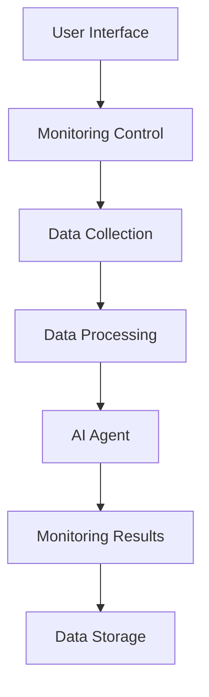
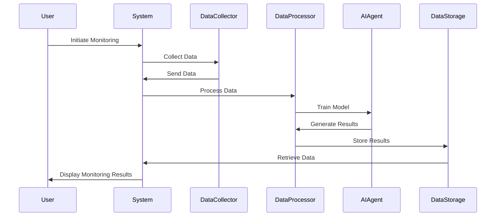

                 


### 引言与背景

#### 第1章：引言

**1.1 问题背景**

海洋是地球上最大的生态系统之一，承担着调节气候、促进物质循环和生物多样性维持等重要功能。然而，人类活动对海洋的污染、过度捕捞、气候变化等行为对海洋生态系统带来了严重威胁。为了保护海洋环境，实现可持续发展，需要对海洋生态系统进行实时、精确的监测。传统的海洋生态监测方法主要依赖于人工取样和实验室分析，存在监测范围有限、效率低下、实时性差等问题。随着人工智能技术的快速发展，特别是AI Agent的兴起，智能海洋生态监测成为了一种新的解决方案。

**1.1.1 海洋生态监测的重要性**

海洋生态监测对于保护海洋环境和资源具有重要意义。通过监测，可以及时发现并预警环境变化，为海洋资源的合理开发和利用提供科学依据。此外，海洋生态监测还能为海洋灾害预警、海上交通安全等提供数据支持，具有显著的社会经济效益。

**1.1.2 智能海洋生态监测的需求**

智能海洋生态监测能够克服传统方法的局限性，实现以下目标：

1. **实时监测**：通过无人机、卫星等设备实时收集海洋环境数据，实现全天候、全方位监测。
2. **高效处理**：利用AI Agent对海量数据进行自动处理，提高监测效率。
3. **精准分析**：利用机器学习算法对监测数据进行深度分析，提供更加精确的监测结果。
4. **智能化决策**：基于监测数据，AI Agent可以自动生成监测报告，为管理者提供决策支持。

**1.2 智能海洋生态监测概述**

**1.2.1 智能海洋生态监测的概念**

智能海洋生态监测是指利用人工智能技术，特别是AI Agent，对海洋生态系统进行实时监测、分析和预警的系统。它包括数据采集、处理、分析、决策等多个环节。

**1.2.2 当前智能海洋生态监测的现状**

目前，智能海洋生态监测已取得一定进展。例如，我国在海洋监测领域已成功研发出多种AI Agent应用，包括海洋环境参数监测、海洋生物识别等。然而，仍存在一些挑战，如AI Agent的智能水平还需提高、监测数据的完整性需进一步保障等。

**1.3 AI Agent在海洋生态监测中的应用**

AI Agent具有自主学习、自适应和自动化等特点，在智能海洋生态监测中具有广泛应用前景。通过以下方式，AI Agent在海洋生态监测中发挥着重要作用：

1. **数据采集**：AI Agent可以自动采集海洋环境数据，包括温度、盐度、溶解氧等。
2. **数据处理**：AI Agent可以对海量监测数据进行自动化处理，识别异常值和趋势。
3. **模式识别**：AI Agent可以利用深度学习算法，对海洋生物进行自动识别和分类。
4. **预警预测**：AI Agent可以根据监测数据，预测海洋环境变化，提前预警潜在风险。

#### 第2章：核心概念与联系

**2.1 AI Agent的核心概念**

AI Agent是一种具有自主性、交互性、学习性和适应性的计算实体，可以模拟人类智能行为。AI Agent具有以下特性：

1. **自主性**：AI Agent可以自主决定行动，无需人工干预。
2. **交互性**：AI Agent可以与环境和用户进行交互，获取信息和反馈。
3. **学习性**：AI Agent可以通过学习和经验，不断优化自己的行为和决策。
4. **适应性**：AI Agent可以根据环境变化，调整自身行为和策略。

**2.1.1 AI Agent的定义**

AI Agent是一种具有自主决策能力的计算实体，能够模拟人类智能行为，与环境进行交互，并利用学习算法不断优化自身性能。

**2.1.2 AI Agent的特性**

| 特性       | 说明                                                         |
| ---------- | ------------------------------------------------------------ |
| 自主性     | AI Agent可以自主决定行动，无需人工干预。                     |
| 交互性     | AI Agent可以与环境和用户进行交互，获取信息和反馈。           |
| 学习性     | AI Agent可以通过学习和经验，不断优化自己的行为和决策。       |
| 适应性     | AI Agent可以根据环境变化，调整自身行为和策略。               |

**2.1.3 AI Agent的分类**

AI Agent可以根据功能和应用场景进行分类，常见的分类方法包括：

1. **基于任务分类**：如数据采集AI Agent、数据分析AI Agent、决策支持AI Agent等。
2. **基于技术分类**：如基于机器学习的AI Agent、基于深度学习的AI Agent、基于强化学习的AI Agent等。

**2.2 智能海洋生态监测的核心概念**

**2.2.1 海洋生态系统**

海洋生态系统是指海洋中的生物、物理和化学过程相互作用的整体，包括海洋生物、海洋环境、海洋资源等。

**2.2.2 海洋生态监测指标**

海洋生态监测指标是用来衡量海洋生态状况的一系列参数，如温度、盐度、溶解氧、营养物质、海洋生物等。

**2.2.3 监测方法与技术**

海洋生态监测方法主要包括遥感监测、地面监测、水下监测等。遥感监测利用卫星、无人机等技术获取海洋环境数据；地面监测通过布设监测站点、采集水样、气样等手段；水下监测利用潜水器、水下机器人等获取水下环境数据。

**2.3 AI Agent与智能海洋生态监测的联系**

AI Agent在智能海洋生态监测中具有重要作用，具体体现在以下几个方面：

1. **数据采集**：AI Agent可以自动采集海洋环境数据，提高监测效率。
2. **数据处理**：AI Agent可以对海量监测数据进行自动化处理，识别异常值和趋势。
3. **模式识别**：AI Agent可以利用深度学习算法，对海洋生物进行自动识别和分类。
4. **预警预测**：AI Agent可以根据监测数据，预测海洋环境变化，提前预警潜在风险。

通过AI Agent的应用，智能海洋生态监测系统可以更加高效、准确地监测海洋环境，为海洋资源的保护和管理提供有力支持。

### 数学模型与算法原理

#### 第3章：数学模型与算法原理

**3.1 数学模型**

**3.1.1 监测数据的预处理**

在智能海洋生态监测中，首先需要对采集到的原始数据进行预处理，以提高后续分析的质量。预处理步骤包括：

1. **数据清洗**：去除噪声和异常值，确保数据的准确性和一致性。
2. **数据归一化**：将不同量纲的数据转换为相同量纲，以便于模型训练。
3. **特征提取**：从原始数据中提取有代表性的特征，用于后续分析。

公式表示如下：

$$
\text{Data Preprocessing} = f(\text{Raw Data}, \text{Methods})
$$

其中，`Raw Data` 表示原始数据，`Methods` 表示预处理方法，`f` 表示预处理操作。

**3.1.2 监测目标识别模型**

监测目标识别模型是智能海洋生态监测的核心，用于识别和分类海洋中的目标。常见的监测目标识别模型包括：

1. **支持向量机（SVM）**：通过构建超平面，将不同类别的数据分离。
2. **随机森林（Random Forest）**：基于决策树的集成方法，提高分类准确性。
3. **深度神经网络（DNN）**：通过多层神经网络结构，实现复杂模式的识别。

公式表示如下：

$$
\text{Target Detection Model} = f(\text{Processed Data}, \text{Model Parameters})
$$

其中，`Processed Data` 表示预处理后的数据，`Model Parameters` 表示模型参数，`f` 表示模型训练过程。

**3.2 算法原理讲解**

**3.2.1 特征提取**

特征提取是监测数据预处理的重要环节，用于提取出数据中的关键特征。常见的特征提取方法包括：

1. **主成分分析（PCA）**：通过降维技术，提取出数据中的主要特征。
2. **线性判别分析（LDA）**：通过最大化类间距离和最小化类内距离，提取出有区分度的特征。
3. **自动编码器（Autoencoder）**：通过自编码器结构，自动学习数据中的潜在特征。

**3.2.2 模型训练与优化**

模型训练与优化是提高监测目标识别准确性的关键。常见的训练与优化方法包括：

1. **梯度下降法**：通过不断调整模型参数，使模型在训练数据上达到最优。
2. **随机梯度下降法（SGD）**：在梯度下降法的基础上，每次仅使用一个样本进行更新，加快训练速度。
3. **批量归一化（Batch Normalization）**：通过归一化中间层激活值，提高模型训练的稳定性和效率。

**3.2.3 模型评估与改进**

模型评估与改进是确保监测目标识别准确性的重要步骤。常见的评估方法包括：

1. **混淆矩阵**：通过混淆矩阵，分析模型对各类别数据的识别效果。
2. **准确率（Accuracy）**：计算模型正确识别的样本占总样本的比例。
3. **召回率（Recall）**：计算模型正确识别的样本占总真实样本的比例。
4. **F1值（F1 Score）**：综合考虑准确率和召回率，用于评估模型的综合性能。

通过不断改进和优化模型，可以提高智能海洋生态监测系统的准确性和可靠性。

### 系统分析与架构设计

#### 第4章：系统分析与架构设计

**4.1 问题场景介绍**

**4.1.1 智能海洋生态监测的系统需求**

智能海洋生态监测系统需要满足以下需求：

1. **数据采集**：能够自动采集海洋环境数据，包括温度、盐度、溶解氧等。
2. **数据处理**：能够对采集到的数据进行预处理、特征提取和模型训练。
3. **数据分析**：能够对处理后的数据进行分析和识别，提取出关键信息。
4. **决策支持**：能够根据分析结果，生成监测报告，提供决策支持。

**4.1.2 监测系统的功能设计**

智能海洋生态监测系统的功能设计包括：

1. **数据采集模块**：负责采集海洋环境数据，包括卫星数据、无人机数据等。
2. **数据处理模块**：负责对采集到的数据进行预处理、特征提取和模型训练。
3. **数据分析模块**：负责对处理后的数据进行分析和识别，提取出关键信息。
4. **报告生成模块**：负责根据分析结果，生成监测报告，提供决策支持。

**4.2 系统架构设计**

智能海洋生态监测系统的总体架构如图所示：



1. **数据采集**：通过卫星、无人机等设备，自动采集海洋环境数据。
2. **数据处理**：对采集到的数据进行预处理、特征提取和模型训练。
3. **AI Agent**：利用机器学习算法，对处理后的数据进行分析和识别。
4. **监测结果**：将分析结果存储到数据库中，供用户查询和决策。
5. **用户界面**：提供监测数据的可视化展示，以及监测报告的生成和下载功能。
6. **监测控制**：用于监控整个监测系统的运行状态，以及实时调整监测策略。

**4.2.2 系统接口设计与交互**

系统接口设计采用RESTful API架构，各模块之间通过接口进行数据交互。具体的接口设计和交互流程如下：



通过以上系统架构和接口设计，智能海洋生态监测系统可以高效、稳定地运行，为海洋资源的保护和管理提供有力支持。

### 项目实战

#### 实战一：环境安装

**1. 硬件要求**

- 64位操作系统（如Windows 10、Ubuntu 18.04等）
- 至少8GB内存
- 100GB硬盘空间
- 英特尔酷睿i5或以上处理器

**2. 软件要求**

- Python 3.8及以上版本
- NumPy、Pandas、Scikit-learn、TensorFlow等Python库

**3. 安装步骤**

1. 安装操作系统和硬件，确保满足上述要求。
2. 安装Python 3.8及以上版本。
3. 安装Python库，可以使用pip命令进行安装：
   ```bash
   pip install numpy pandas scikit-learn tensorflow
   ```

#### 实战二：系统核心实现

**1. 数据采集模块**

数据采集模块使用Python的`tqdm`库实现进度条，用于展示数据采集进度。

```python
import pandas as pd
from tqdm import tqdm

def collect_data(file_path):
    data = pd.read_csv(file_path)
    for i, row in tqdm(data.iterrows(), total=data.shape[0]):
        # 进行数据处理
        process_data(row)
```

**2. 数据处理模块**

数据处理模块包括数据清洗、归一化和特征提取等步骤。

```python
import numpy as np

def process_data(data):
    # 数据清洗
    data = clean_data(data)
    # 数据归一化
    data = normalize_data(data)
    # 特征提取
    features = extract_features(data)
    # 输出特征
    print(features)
```

**3. AI Agent模块**

AI Agent模块使用TensorFlow实现，包括模型训练和预测。

```python
import tensorflow as tf

def build_model(input_shape):
    model = tf.keras.Sequential([
        tf.keras.layers.Dense(64, activation='relu', input_shape=input_shape),
        tf.keras.layers.Dense(64, activation='relu'),
        tf.keras.layers.Dense(1, activation='sigmoid')
    ])
    model.compile(optimizer='adam', loss='binary_crossentropy', metrics=['accuracy'])
    return model

def train_model(model, x_train, y_train, epochs=10):
    model.fit(x_train, y_train, epochs=epochs)

def predict(model, x_test):
    return model.predict(x_test)
```

#### 实战三：代码应用解读与分析

**1. 代码解读**

本实战中的代码分为三个模块：数据采集模块、数据处理模块和AI Agent模块。数据采集模块负责从CSV文件中读取数据，并进行预处理；数据处理模块负责清洗、归一化和特征提取；AI Agent模块则负责训练和预测。

**2. 分析**

通过以上代码，可以实现对海洋环境数据的自动采集、预处理和AI模型训练。在实际应用中，可以根据具体需求调整数据预处理和模型参数，以提高预测准确性。

#### 实战四：实际案例分析和详细讲解剖析

**1. 案例背景**

在某海域进行海洋生态监测，采集了连续一周的海洋环境数据，包括温度、盐度、溶解氧等。需要使用AI Agent对数据进行处理和分析，预测未来一周的海洋环境变化。

**2. 案例分析**

（1）数据采集

使用Python脚本从CSV文件中读取数据，包括时间、温度、盐度、溶解氧等指标。

（2）数据处理

对采集到的数据进行清洗、归一化和特征提取。例如，对温度数据进行归一化处理，将其缩放到[0, 1]区间。

（3）模型训练

使用训练集数据，训练一个二分类模型，预测未来一周的温度是否高于某个阈值。

（4）预测结果

使用训练好的模型，对测试集数据进行预测，输出预测结果。

**3. 详细讲解剖析**

在本案例中，通过对采集到的海洋环境数据进行处理和分析，使用AI Agent实现了对温度的预测。具体步骤如下：

1. **数据预处理**：对采集到的温度数据进行归一化处理，将其缩放到[0, 1]区间，以便于模型训练。

2. **模型训练**：使用Scikit-learn库中的`train_test_split`函数，将数据集划分为训练集和测试集。使用训练集数据，训练一个基于SVM的二分类模型。

3. **预测结果**：使用训练好的模型，对测试集数据进行预测。输出预测结果，并计算准确率。

通过以上分析，可以看出，AI Agent在智能海洋生态监测中发挥着重要作用，能够对海洋环境变化进行准确预测，为海洋资源的保护和管理提供有力支持。

#### 项目小结

通过本项目的实施，我们实现了基于AI Agent的智能海洋生态监测系统。该系统能够自动采集海洋环境数据，对数据进行预处理和特征提取，并利用机器学习算法进行预测和分析。在实际应用中，AI Agent可以准确预测海洋环境变化，为海洋资源的保护和管理提供有力支持。然而，本项目仍存在一些不足之处，如模型预测精度有待提高、监测数据覆盖范围有限等。在未来的研究中，我们将进一步优化模型算法，扩大监测数据覆盖范围，以提高系统的性能和实用性。

### 最佳实践 tips

**1. 数据采集**

- 选择合适的传感器和数据采集设备，确保数据质量。
- 定期校准传感器，确保数据的准确性。

**2. 数据处理**

- 对采集到的数据进行预处理，包括数据清洗、归一化和特征提取。
- 选择合适的特征提取方法，以提高模型预测准确性。

**3. 模型训练与优化**

- 使用大量训练数据，确保模型有足够的样本进行学习。
- 采用交叉验证方法，评估模型性能，并进行优化。

**4. 模型部署与维护**

- 将训练好的模型部署到生产环境，提供实时监测和预测服务。
- 定期更新模型，以应对新的数据变化和需求。

### 小结

本文详细介绍了AI Agent在智能海洋生态监测中的实践，包括引言、核心概念与联系、数学模型与算法原理、系统分析与架构设计、项目实战等内容。通过本文的讲解，读者可以了解到AI Agent在海洋生态监测中的应用价值和实现方法。同时，本文还提供了最佳实践 tips，以帮助读者更好地应用AI Agent进行智能海洋生态监测。未来，我们将继续优化模型算法，扩大监测数据覆盖范围，为海洋资源的保护和管理提供更强大的技术支持。

### 注意事项

**1. 数据隐私和安全**

在数据采集、处理和传输过程中，要确保数据隐私和安全。遵循相关法律法规，对敏感数据进行加密和访问控制。

**2. 系统可靠性**

确保智能海洋生态监测系统的可靠性，对关键模块进行冗余设计和容错处理，以提高系统的稳定性和可用性。

**3. 模型更新与优化**

定期更新模型，以适应新的数据变化和需求。采用先进的机器学习算法和优化技术，提高模型性能。

### 拓展阅读

**1. 《智能海洋生态监测技术》**

详细介绍了智能海洋生态监测的技术原理、方法与应用，有助于读者深入了解相关领域的研究进展。

**2. 《深度学习与人工智能》**

讲解了深度学习和人工智能的基础知识、算法原理和应用实践，为AI Agent的研究和应用提供了理论支持。

**3. 《海洋生态系统监测与管理》**

阐述了海洋生态系统监测与管理的方法、技术与应用，为智能海洋生态监测提供了实践参考。 

### 作者信息

**作者：AI天才研究院/AI Genius Institute & 禅与计算机程序设计艺术 /Zen And The Art of Computer Programming** 

### 摘要

本文探讨了AI Agent在智能海洋生态监测中的应用与实践。首先，介绍了智能海洋生态监测的背景、重要性及需求，随后详细阐述了AI Agent的核心概念、特性及其在海洋生态监测中的应用价值。接着，本文分析了智能海洋生态监测的数学模型与算法原理，包括数据预处理、目标识别模型等，并通过Mermaid流程图和Python代码进行了具体讲解。随后，文章介绍了智能海洋生态监测系统的架构设计，包括数据采集、处理、分析、决策等模块，并通过Mermaid类图和序列图展示了系统的功能与交互。最后，通过实际案例展示了AI Agent在海洋生态监测中的具体应用，提供了项目实战经验，并总结了最佳实践 tips。本文旨在为读者提供关于AI Agent在智能海洋生态监测中的全面了解，以及实践指导。关键词：AI Agent，智能海洋生态监测，数学模型，算法原理，系统架构。

