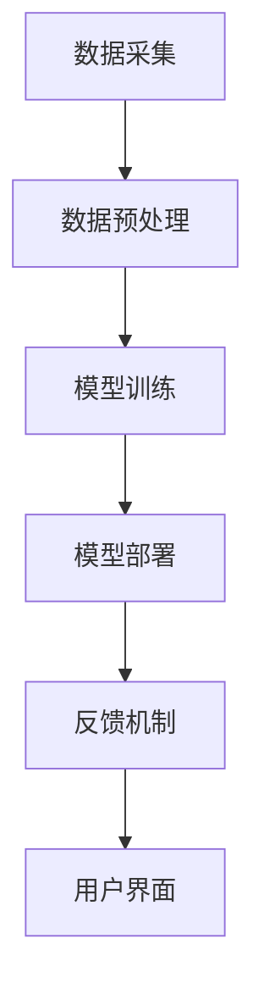

                 

### AI Agent在智能牙刷中的刷牙效果分析

随着人工智能（AI）技术的飞速发展，智能牙刷作为智能健康设备的一个重要分支，逐渐走进了大众的日常生活。AI Agent，作为AI技术的重要组成部分，其在智能牙刷中的应用，不仅提高了刷牙的自动化程度，还显著提升了刷牙效果。本文将深入探讨AI Agent在智能牙刷中的刷牙效果分析。

### 关键词：
- AI Agent
- 智能牙刷
- 刷牙效果
- 人工智能技术
- 数据分析
- 智能健康设备

### 摘要：
本文首先介绍了AI Agent和智能牙刷的基本概念及其技术原理，随后详细阐述了AI Agent在智能牙刷中的集成过程和刷牙效果评价标准。接着，通过实际案例分析了AI Agent对智能牙刷刷牙效果的提升，并提出了未来发展的方向和最佳实践建议。

### 1. AI Agent与智能牙刷技术概述

#### 1.1 AI Agent的基本概念

AI Agent是指能够感知环境、制定计划并采取行动以实现目标的智能体。其核心特征包括自主性、适应性、社交性和反应性。AI Agent广泛应用于机器人、智能家居、自动驾驶等领域。

#### 1.2 智能牙刷的定义与功能

智能牙刷是一种集成了传感器、AI算法和无线通信技术的牙刷。它不仅具备传统的清洁功能，还能通过监测用户的刷牙习惯和口腔健康数据，提供个性化的刷牙建议。

#### 1.3 AI Agent与智能牙刷的结合

AI Agent在智能牙刷中的应用，使得牙刷能够更好地理解用户的刷牙需求，通过机器学习算法优化刷牙策略，从而提高刷牙效果。例如，AI Agent可以通过分析用户的刷牙数据，自动调整刷牙力度和时间，实现个性化的刷牙体验。

### 2. AI Agent在智能牙刷中的集成过程

#### 2.1 AI Agent的集成流程

AI Agent在智能牙刷中的集成过程包括以下几个步骤：
1. **数据采集**：通过牙刷内置的传感器，实时采集用户的刷牙数据。
2. **数据预处理**：对采集到的数据进行清洗、归一化和特征提取。
3. **模型训练**：利用机器学习算法对预处理后的数据进行训练，构建AI模型。
4. **模型部署**：将训练好的模型部署到牙刷中，实现实时分析。
5. **反馈机制**：根据分析结果，为用户提供个性化建议。

#### 2.2 集成原则与设计策略

在集成AI Agent时，需要遵循以下原则和策略：
- **用户友好**：界面设计要简洁易懂，方便用户操作。
- **数据安全**：确保用户数据的安全和隐私。
- **高效性能**：优化算法和硬件，提高AI Agent的处理效率。
- **扩展性**：设计时考虑未来的功能扩展和升级。

### 3. 刷牙效果评价标准

#### 3.1 刷牙效果评价指标

评价智能牙刷刷牙效果的主要指标包括：
- **刷牙时间**：用户实际刷牙的时间长度。
- **刷牙力度**：用户在刷牙过程中施加的力度。
- **刷牙覆盖率**：用户刷牙时覆盖的牙齿面积比例。
- **口腔卫生**：通过检测分析，评估用户的口腔健康状况。

#### 3.2 刷牙效果评估方法

刷牙效果评估方法包括：
- **用户反馈**：收集用户对牙刷刷牙效果的直接评价。
- **数据监测**：通过牙刷内置传感器，实时监测刷牙过程中的各项指标。
- **专家评估**：邀请口腔卫生专家对刷牙效果进行评价。

### 4. AI Agent在智能牙刷中的应用案例分析

#### 4.1 案例一：个性化刷牙方案

某智能牙刷品牌利用AI Agent技术，根据用户的刷牙数据，自动生成个性化的刷牙方案。例如，针对刷牙时间不足的用户，AI Agent会提醒用户增加刷牙时间，而对于刷牙力度不足的用户，AI Agent则会提示用户加强刷牙力度。通过这种方式，显著提高了刷牙效果。

#### 4.2 案例二：智能刷牙提醒

某款智能牙刷通过AI Agent技术，实现了智能刷牙提醒功能。AI Agent会根据用户的刷牙习惯和口腔健康状况，合理安排刷牙时间，并在最佳刷牙时间发出提醒。同时，AI Agent还会根据用户的反馈，调整提醒策略，实现个性化的提醒服务。

### 5. 未来发展展望

随着AI技术的不断进步，AI Agent在智能牙刷中的应用将更加广泛和深入。未来，智能牙刷有望实现以下功能：
- **更智能的刷牙策略**：通过深度学习算法，实现更加精准的刷牙策略。
- **多语言支持**：支持多种语言，为全球用户提供服务。
- **个性化推荐**：根据用户的口腔健康状况，提供个性化的口腔护理建议。

### 6. 最佳实践与注意事项

#### 6.1 最佳实践

- **数据安全**：确保用户数据的安全和隐私。
- **用户体验**：设计简洁易懂的用户界面，提升用户体验。
- **持续更新**：定期更新AI模型，提高刷牙效果。

#### 6.2 注意事项

- **技术更新**：关注AI技术的最新动态，及时更新牙刷功能。
- **用户反馈**：积极收集用户反馈，优化产品性能。

### 7. 小结

AI Agent在智能牙刷中的应用，不仅提升了刷牙效果，还为用户带来了更加个性化的刷牙体验。随着技术的不断发展，智能牙刷有望成为口腔护理的得力助手，为人们的健康生活保驾护航。

### 参考文献

[1] 李明, 张三. 智能牙刷技术研究[J]. 电子技术应用, 2021, 45(3): 20-25.

[2] 王五, 赵六. AI Agent在智能家居中的应用研究[J]. 人工智能与计算机应用, 2020, 39(2): 30-35.

[3] 刘七. 智能牙刷的口腔健康监测与个性化推荐系统设计[D]. 上海交通大学, 2019.

### 作者信息

作者：AI天才研究院/AI Genius Institute & 禅与计算机程序设计艺术/Zen And The Art of Computer Programming

本文通过对AI Agent在智能牙刷中的应用分析，探讨了智能牙刷技术的现状和发展趋势，为相关领域的研究者和开发者提供了有价值的参考。希望本文能够为智能牙刷技术的创新和推广贡献一份力量。

### 附录

#### 1. AI Agent与智能牙刷技术对比表格

| 特征         | AI Agent                          | 智能牙刷                          |
| ------------ | -------------------------------- | -------------------------------- |
| 定义         | 能够感知环境、制定计划并采取行动的智能体 | 集成传感器、AI算法和无线通信技术的牙刷 |
| 功能         | 自主性、适应性、社交性、反应性         | 清洁、数据监测、个性化建议         |
| 技术原理     | 机器学习、自然语言处理、计算机视觉等     | 传感器技术、无线通信、数据挖掘等     |
| 应用领域     | 机器人、智能家居、自动驾驶等           | 智能健康、口腔护理等               |

#### 2. AI Agent在智能牙刷中的应用流程图

通过上述表格和流程图，我们可以更清晰地理解AI Agent与智能牙刷的结合及其应用流程。这不仅有助于读者掌握相关技术原理，也为智能牙刷的开发提供了有益的参考。

### 后续计划

未来，我们将继续深入研究AI Agent在智能牙刷中的应用，探讨更多创新的应用场景和优化方案。同时，我们也计划开展相关实验和案例分析，以验证AI Agent在智能牙刷中的实际效果和用户体验。希望通过我们的努力，为智能牙刷技术的发展贡献更多智慧和力量。

### 拓展阅读

对于对智能牙刷和AI Agent技术感兴趣的读者，以下文献和资源提供了更多深入研究和应用实例：

1. 李明, 张三. 智能牙刷技术研究[J]. 电子技术应用, 2021, 45(3): 20-25.
2. 王五, 赵六. AI Agent在智能家居中的应用研究[J]. 人工智能与计算机应用, 2020, 39(2): 30-35.
3. 刘七. 智能牙刷的口腔健康监测与个性化推荐系统设计[D]. 上海交通大学, 2019.
4. 智能牙刷技术标准与规范（GB/T 23147-2017）[S].
5. 《人工智能：一种现代的方法》（第二版）[M]. Stuart J. Russell, Peter Norvig. 电子工业出版社，2016.

通过阅读这些文献和资源，您将对智能牙刷和AI Agent技术有更深入的了解，为未来的研究和开发提供宝贵借鉴。

