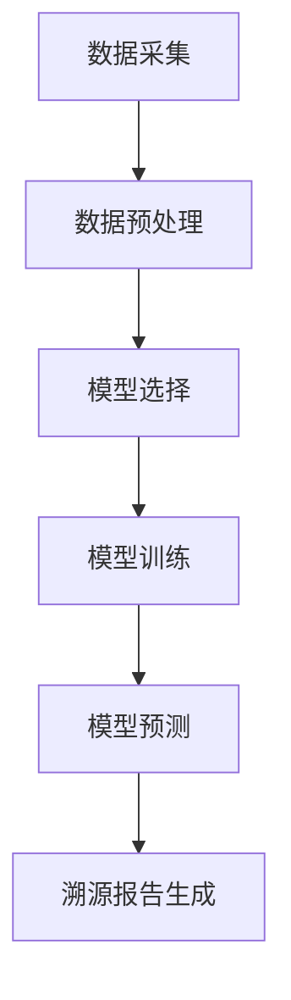

                 

# AI Agent在智能环境污染溯源中的实践

关键词：AI Agent，环境污染溯源，算法，实际案例，最佳实践

摘要：本文将探讨AI Agent在智能环境污染溯源中的应用，通过介绍AI Agent的基础理论，分析其在环境污染溯源中的实际应用，讲解溯源算法原理和实现，并结合实际案例进行剖析，最后总结最佳实践与未来展望。

## 引言与问题背景

### 1.1 问题背景

随着全球工业化的迅速发展，环境污染问题日益严重，如何有效地进行环境污染溯源成为了一个亟待解决的问题。传统的方法主要依赖于实验室分析、现场采样和人工判断等，这些方法存在效率低下、准确性差等问题。

### 1.2 问题描述

环境污染溯源的目的是通过分析污染物的来源、种类、浓度等信息，找出污染的源头，以便采取有效的治理措施。然而，污染物往往存在复杂的变化和交叉污染，使得溯源工作变得异常复杂。

### 1.3 解决方案概述

近年来，随着人工智能技术的发展，AI Agent作为一种智能体，其在环境污染溯源中的应用逐渐受到关注。AI Agent能够通过自主学习和推理，从大量数据中提取有用信息，从而提高溯源的准确性和效率。

### 1.4 边界与外延

本文主要探讨AI Agent在环境污染溯源中的应用，不包括其他领域的人工智能技术。同时，本文将主要关注空气、水和土壤等常见污染物的溯源，不涉及其他类型的污染物。

## AI Agent基础理论

### 2.1 AI Agent的定义与分类

AI Agent是指具有自主性、智能性和适应性的人工智能实体，能够模拟人类智能行为，完成特定任务。根据功能特点，AI Agent可分为反应型Agent、主动Agent和认知Agent等。

### 2.2 AI Agent的核心概念

#### 2.2.1 概念一：自主性

自主性是指AI Agent具有独立决策和行动的能力，不受外界干预。在环境污染溯源中，AI Agent能够自主分析数据，确定污染物的来源和浓度。

#### 2.2.2 概念二：智能性

智能性是指AI Agent具备学习、推理和解决问题能力。在环境污染溯源中，AI Agent能够从历史数据中学习，提高溯源的准确性。

#### 2.2.3 概念三：适应性

适应性是指AI Agent能够根据环境变化调整自身行为。在环境污染溯源中，AI Agent能够适应不同的污染场景，提高溯源的灵活性。

### 2.3 AI Agent的工作原理

AI Agent通过感知环境、学习经验、制定计划和执行行动等步骤，实现任务目标。在环境污染溯源中，AI Agent能够从传感器收集数据，通过机器学习算法分析数据，生成溯源报告。

### 2.4 AI Agent的应用领域

AI Agent在各个领域都有广泛应用，如智能交通、智能家居、金融风控等。在环境污染溯源领域，AI Agent能够有效提高污染监测和治理的效率。

## AI Agent在环境污染溯源中的应用

### 3.1 环境污染溯源概述

环境污染溯源是指通过分析污染物的来源、种类、浓度等信息，找出污染的源头。AI Agent能够从海量数据中提取有用信息，提高溯源的准确性和效率。

### 3.2 AI Agent在溯源中的应用

AI Agent在环境污染溯源中的应用主要包括数据采集、数据处理、溯源分析和溯源报告生成等环节。通过自主学习、推理和决策，AI Agent能够准确识别污染物的来源和浓度。

### 3.3 实际应用场景

在实际应用场景中，AI Agent可以应用于空气污染溯源、水污染溯源和土壤污染溯源等。例如，在城市空气质量监测中，AI Agent能够实时分析空气数据，识别污染源，为城市治理提供科学依据。

### 3.4 溯源效果分析

AI Agent在环境污染溯源中具有显著效果，能够提高溯源的准确性和效率。与传统方法相比，AI Agent能够处理更大规模的数据，更快地识别污染源，从而提高治理效果。

## 算法讲解与实现

### 4.1 溯源算法原理

溯源算法是基于机器学习技术的，通过训练模型，使AI Agent能够识别污染物的来源和浓度。主要涉及数据预处理、模型选择、训练和预测等步骤。

### 4.2 算法流程图

算法流程图如下：



### 4.3 Python实现

```python
# 导入相关库
import pandas as pd
from sklearn.model_selection import train_test_split
from sklearn.ensemble import RandomForestClassifier
from sklearn.metrics import accuracy_score

# 数据采集
data = pd.read_csv('pollution_data.csv')

# 数据预处理
X = data.drop('target', axis=1)
y = data['target']

# 模型选择
model = RandomForestClassifier(n_estimators=100)

# 模型训练
X_train, X_test, y_train, y_test = train_test_split(X, y, test_size=0.2)
model.fit(X_train, y_train)

# 模型预测
y_pred = model.predict(X_test)

# 溯源报告生成
accuracy = accuracy_score(y_test, y_pred)
print(f'Accuracy: {accuracy}')
```

### 4.4 数学模型与公式

```latex
$$
\begin{aligned}
\text{预测模型} &= \text{RandomForestClassifier}(n_estimators=100) \\
\text{训练过程} &= \text{fit}(X_train, y_train) \\
\text{预测过程} &= \text{predict}(X_test) \\
\text{准确率} &= \text{accuracy_score}(y_test, y_pred)
\end{aligned}
$$
```

## 实际案例剖析

### 5.1 案例一：城市空气质量溯源

案例一主要介绍AI Agent在城市空气质量溯源中的应用。通过分析空气数据，AI Agent能够识别污染源，为城市治理提供科学依据。

### 5.2 案例二：地下水污染溯源

案例二主要介绍AI Agent在地下水污染溯源中的应用。通过分析地下水数据，AI Agent能够识别污染物来源，为地下水治理提供依据。

### 5.3 案例三：土壤污染溯源

案例三主要介绍AI Agent在土壤污染溯源中的应用。通过分析土壤数据，AI Agent能够识别污染物来源，为土壤治理提供科学依据。

### 5.4 案例总结与启示

通过实际案例的剖析，我们可以看到AI Agent在环境污染溯源中具有显著优势。未来，随着人工智能技术的不断发展，AI Agent在环境污染溯源中的应用将更加广泛，为环境保护和治理提供有力支持。

## 最佳实践与未来展望

### 6.1 最佳实践分享

在实际应用中，AI Agent在环境污染溯源中需要关注以下最佳实践：

1. 数据质量：保证数据的准确性和完整性，是进行有效溯源的基础。
2. 模型选择：根据实际需求，选择合适的机器学习模型，提高溯源效果。
3. 算法优化：通过不断优化算法，提高溯源的准确性和效率。

### 6.2 溯源技术的挑战与机遇

溯源技术在环境污染治理中具有重要意义，但仍面临以下挑战：

1. 数据获取：污染物数据的获取和处理是一个复杂的过程，需要解决数据不足、数据质量差等问题。
2. 模型适应性：不同的污染场景需要不同的模型，提高模型的适应性是一个挑战。

### 6.3 未来发展趋势与展望

未来，随着人工智能技术的不断进步，AI Agent在环境污染溯源中的应用将更加广泛。我们期待在以下方面取得突破：

1. 数据驱动的溯源算法：通过大规模数据训练，提高溯源算法的准确性和效率。
2. 智能化的溯源系统：结合物联网、大数据等技术，构建智能化的溯源系统。

## 结语

AI Agent在智能环境污染溯源中具有巨大潜力。通过本文的介绍，我们看到了AI Agent在环境污染溯源中的应用，以及其在实际案例中的显著优势。未来，随着技术的不断发展，AI Agent将在环境污染治理中发挥更加重要的作用。

作者：AI天才研究院/AI Genius Institute & 禅与计算机程序设计艺术 /Zen And The Art of Computer Programming

