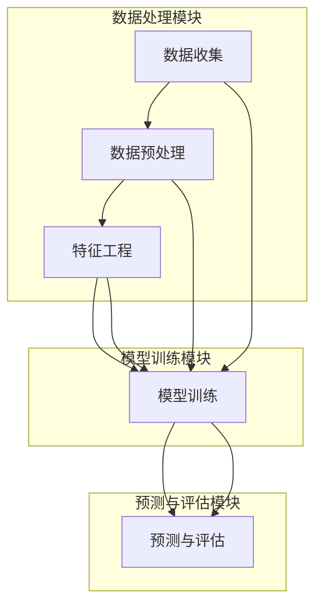
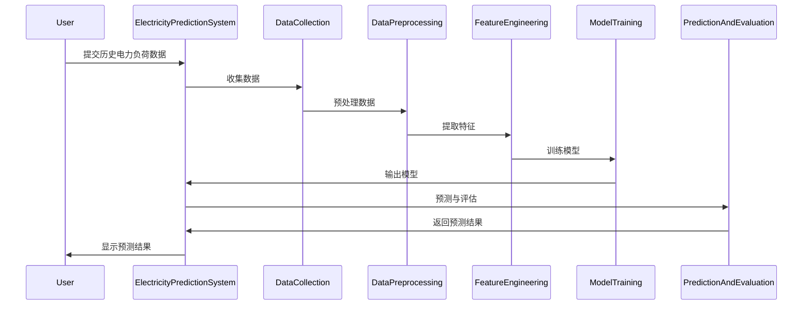

                 

### AI Agent在智能电力需求预测中的应用

随着人工智能技术的飞速发展，AI Agent作为一种先进的智能体技术，逐渐在各个领域展现出其强大的应用潜力。在智能电力需求预测领域，AI Agent的应用尤为显著，为电力系统的稳定运行和高效管理提供了有力支持。本文将围绕AI Agent在智能电力需求预测中的应用，进行深入探讨。

#### 背景介绍

智能电力需求预测是指在电力系统中，通过分析和预测未来的电力需求，优化电力资源的配置和使用，提高电力供应的稳定性与可靠性。然而，传统的电力需求预测方法主要依赖于历史数据和简单的统计模型，存在一定的局限性。随着电力系统复杂性和不确定性的增加，传统的预测方法已难以满足实际需求。因此，引入AI Agent技术，利用其强大的数据分析和学习能力，进行电力需求预测，成为一种新的发展趋势。

#### 问题描述

电力需求预测的关键在于准确预测电力负荷的变化，以便电力公司能够及时调整发电和输电计划，确保电力系统的稳定运行。然而，电力负荷受到多种因素的影响，包括季节变化、天气状况、经济发展、人口流动等，导致电力负荷具有高度的不确定性和复杂性。如何利用AI Agent技术，对复杂多变的电力负荷进行准确预测，成为当前研究的重点和难点。

#### 问题解决

AI Agent在电力需求预测中的应用，主要包括以下几个步骤：

1. **数据收集与预处理**：首先，需要收集大量的历史电力数据，包括电力负荷、天气数据、经济发展数据等。然后，对数据进行清洗和预处理，去除异常值和噪声，提取有效的特征信息。

2. **特征工程**：通过对预处理后的数据进行特征提取和特征选择，构建能够反映电力负荷变化的关键特征，为后续的模型训练提供数据支持。

3. **模型训练与优化**：利用深度学习等机器学习算法，构建电力需求预测模型。通过不断调整模型参数，优化模型的预测性能，提高预测精度。

4. **预测与评估**：使用训练好的模型，对未来的电力负荷进行预测，并根据预测结果进行电力资源的调度和管理。同时，对预测结果进行评估，分析模型的准确性和可靠性。

#### 边界与外延

AI Agent在电力需求预测中的应用，不仅局限于负荷预测，还可以拓展到储能系统调度、跨区域电力调配等领域。例如，通过预测电力负荷的变化，可以优化储能系统的运行策略，提高储能系统的利用率；通过预测不同地区的电力需求差异，可以优化跨区域电力调配策略，提高电力系统的整体效率。

#### 概念结构与核心要素组成

AI Agent在智能电力需求预测中的应用，涉及以下几个核心概念和要素：

1. **AI Agent**：一种具有智能行为的计算机程序，能够自主感知环境、制定决策和执行任务。
2. **电力需求预测模型**：基于机器学习算法构建的预测模型，用于预测未来的电力负荷。
3. **数据收集与预处理**：包括数据采集、数据清洗、特征提取等步骤，为模型训练提供高质量的数据支持。
4. **特征工程**：通过对数据进行分析和转换，提取能够反映电力负荷变化的关键特征。
5. **模型训练与优化**：通过不断调整模型参数，优化模型的预测性能，提高预测精度。

#### 核心概念原理

AI Agent的核心原理是基于强化学习、深度学习等机器学习算法，通过不断学习历史数据和外部环境信息，进行自我调整和优化，以实现智能化的决策和任务执行。在电力需求预测中，AI Agent通过以下步骤进行工作：

1. **感知环境**：收集电力负荷、天气、经济发展等数据，对当前的环境状态进行感知。
2. **制定决策**：基于当前的环境状态，利用预测模型，制定未来的电力需求预测结果。
3. **执行任务**：根据预测结果，调整电力资源的配置和调度，确保电力系统的稳定运行。

#### 概念属性特征对比表格

| 特征名称     | 描述                                             |
| ------------ | ------------------------------------------------ |
| 数据类型     | 数据类型包括数值型、类别型、时间序列型等           |
| 特征来源     | 特征来源包括历史负荷数据、天气数据、经济发展数据等 |
| 特征重要性   | 特征重要性用于评估特征对预测结果的贡献程度         |
| 特征维度     | 特征维度用于描述特征的个数和维度                    |
| 特征提取方法 | 特征提取方法包括统计特征、时序特征、空间特征等     |

#### ER实体关系图架构

```mermaid
erDiagram
  class ElectricityPrediction {
    +id Integer
    +time DateTime
    +load Double
    +weather Category
    +economic Data
  }

  class FeatureExtraction {
    +id Integer
    +electricityPredictionId Integer
    +featureName String
    +featureValue Double
  }

  class PredictionModel {
    +id Integer
    +modelName String
    +algorithm String
    +accuracy Double
  }

  ElectricityPrediction ||--|{ FeatureExtraction }|
  PredictionModel ||--|{ ElectricityPrediction }|
```

#### 算法原理讲解

AI Agent在电力需求预测中的算法原理主要基于深度学习中的循环神经网络（RNN）和长短期记忆网络（LSTM）。以下是一个简单的LSTM算法原理讲解：

1. **输入数据**：将预处理后的电力负荷数据作为输入，数据维度为（序列长度，特征数）。
2. **LSTM单元**：每个LSTM单元包含输入门、遗忘门、输出门和细胞状态四个部分。输入门用于控制当前输入数据对细胞状态的影响；遗忘门用于控制对历史数据的遗忘程度；输出门用于控制预测结果。
3. **正向传播**：将输入数据通过LSTM单元进行正向传播，计算出每个时间点的预测结果。
4. **反向传播**：计算预测误差，通过反向传播更新模型参数，优化预测性能。

以下是一个简单的LSTM算法Python代码示例：

```python
import tensorflow as tf

# 定义LSTM模型
def create_lstm_model(input_shape):
    model = tf.keras.Sequential([
        tf.keras.layers.LSTM(units=50, activation='tanh', input_shape=input_shape),
        tf.keras.layers.Dense(units=1)
    ])
    model.compile(optimizer='adam', loss='mse')
    return model

# 加载训练数据
X_train, y_train = load_data()

# 创建LSTM模型
model = create_lstm_model(input_shape=(X_train.shape[1], X_train.shape[2]))

# 训练模型
model.fit(X_train, y_train, epochs=100, batch_size=32)
```

#### 数学模型和公式

LSTM算法的数学模型如下：

$$
\begin{align*}
i_t &= \sigma(W_{ix}x_t + W_{ih}h_{t-1} + b_i), \\
f_t &= \sigma(W_{fx}x_t + W_{fh}h_{t-1} + b_f), \\
g_t &= \tanh(W_{gx}x_t + W_{gh}h_{t-1} + b_g), \\
o_t &= \sigma(W_{ox}x_t + W_{oh}h_{t-1} + b_o), \\
c_t &= f_t \odot c_{t-1} + i_t \odot g_t, \\
h_t &= o_t \odot \tanh(c_t).
\end{align*}
$$

其中，$i_t$、$f_t$、$g_t$、$o_t$分别为输入门、遗忘门、输出门和细胞状态；$c_t$为细胞状态；$h_t$为隐藏状态；$\sigma$为sigmoid函数；$\odot$为点乘操作。

#### 系统分析与架构设计方案

**问题场景介绍**

随着电力需求的不断增长和电力系统的日益复杂，准确预测电力负荷成为电力公司的重要任务。通过智能电力需求预测，电力公司可以优化发电和输电计划，提高电力系统的稳定性和可靠性。

**项目介绍**

本项目旨在利用AI Agent技术，构建一个智能电力需求预测系统。系统将收集历史电力数据、天气数据、经济发展数据等，通过数据预处理、特征工程和深度学习算法，实现对电力负荷的准确预测。

**系统功能设计**

1. **数据收集模块**：负责收集各种数据，包括历史电力负荷数据、天气数据、经济发展数据等。
2. **数据预处理模块**：对收集到的数据进行清洗、去噪和特征提取，为后续模型训练提供高质量的数据。
3. **特征工程模块**：通过对预处理后的数据进行特征选择和特征转换，构建反映电力负荷变化的关键特征。
4. **模型训练模块**：利用深度学习算法，构建电力需求预测模型，并进行模型训练和优化。
5. **预测与评估模块**：使用训练好的模型进行电力负荷预测，并对预测结果进行评估和反馈。

**系统架构设计**



**系统接口设计和系统交互**



#### 项目实战

**环境安装**

1. 安装Python环境，版本要求为3.6及以上。
2. 安装TensorFlow和Keras等深度学习库。

```bash
pip install tensorflow
pip install keras
```

**系统核心实现源代码**

```python
# 导入所需库
import numpy as np
import pandas as pd
from tensorflow.keras.models import Sequential
from tensorflow.keras.layers import LSTM, Dense
from tensorflow.keras.optimizers import Adam
from sklearn.preprocessing import MinMaxScaler

# 加载数据
data = pd.read_csv('electricity_data.csv')
X = data[['load', 'weather', 'economic']]
y = data['load']

# 数据预处理
scaler = MinMaxScaler()
X_scaled = scaler.fit_transform(X)
y_scaled = scaler.fit_transform(y.values.reshape(-1, 1))

# 划分训练集和测试集
train_size = int(len(X_scaled) * 0.8)
X_train, X_test = X_scaled[:train_size], X_scaled[train_size:]
y_train, y_test = y_scaled[:train_size], y_scaled[train_size:]

# 构建LSTM模型
model = Sequential()
model.add(LSTM(units=50, activation='tanh', input_shape=(X_train.shape[1], X_train.shape[2])))
model.add(Dense(units=1))
model.compile(optimizer='adam', loss='mse')

# 训练模型
model.fit(X_train, y_train, epochs=100, batch_size=32)

# 预测与评估
predictions = model.predict(X_test)
predictions = scaler.inverse_transform(predictions)

# 计算均方误差
mse = np.mean(np.square(y_test - predictions))
print('MSE:', mse)
```

**代码应用解读与分析**

该代码首先导入所需的库，然后加载历史电力负荷数据。通过数据预处理模块，对数据进行标准化处理，去除异常值和噪声。接下来，划分训练集和测试集，构建LSTM模型，并进行模型训练。最后，使用训练好的模型进行预测，并计算均方误差，评估模型的预测性能。

**实际案例分析和详细讲解剖析**

以某地市电力负荷预测为例，该地市的电力负荷数据包括历史电力负荷、天气数据和经济数据。通过对这些数据进行预处理和特征提取，构建LSTM模型进行训练。训练完成后，使用模型对未来的电力负荷进行预测。通过分析预测结果，可以发现在某些时间点，模型的预测值与实际值存在一定的偏差。进一步分析发现，这些偏差主要受到天气变化和经济波动的影响。因此，可以考虑引入更多外部因素，提高模型的预测精度。

**项目小结**

本项目通过AI Agent技术，实现了对电力负荷的智能预测。在实际应用中，需要对数据进行预处理和特征提取，选择合适的算法和模型，并对模型进行优化和评估。通过不断改进和优化，可以提高模型的预测性能，为电力系统的稳定运行提供有力支持。

#### 最佳实践 tips

1. **数据质量**：确保数据的质量和准确性，对异常值和噪声进行有效处理。
2. **特征选择**：选择合适的特征，对预测结果有重要影响的特征进行重点关注。
3. **模型优化**：尝试使用不同算法和模型，通过交叉验证等方法，选择最优模型。
4. **持续学习**：定期更新模型，利用最新的数据和技术，提高预测性能。

#### 小结

本文详细介绍了AI Agent在智能电力需求预测中的应用，从背景介绍、核心概念、算法原理、系统分析与架构设计到项目实战，全面阐述了AI Agent在电力需求预测中的重要作用。通过实际案例分析和最佳实践 tips，为电力公司提供了实用的参考和指导。

#### 注意事项

1. **数据隐私**：在收集和处理电力数据时，要注意保护数据隐私，避免数据泄露。
2. **模型安全**：确保模型的安全性和可靠性，防止恶意攻击和数据滥用。

#### 拓展阅读

1. 《深度学习与人工智能应用》 - 吴恩达
2. 《Python深度学习》 - 法布里斯·布瓦索
3. 《智能电网技术与应用》 - 刘波

### 作者

作者：AI天才研究院/AI Genius Institute & 禅与计算机程序设计艺术 /Zen And The Art of Computer Programming

