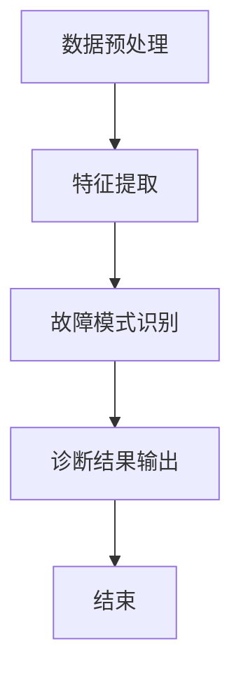

                 


### 1.1 AI Agent与智能电网故障诊断概述

#### 1.1.1 问题背景

随着全球能源需求的不断增长和可再生能源的普及，智能电网的发展已经成为电力系统领域的重要趋势。智能电网通过先进的信息通信技术和自动控制技术，实现了电网的自动化、智能化和高效化。然而，智能电网的复杂性和不确定性也给电网的安全运行带来了挑战，尤其是在故障诊断方面。

故障诊断是智能电网运行管理中的一项关键任务。传统的故障诊断方法主要依赖于人工经验和规则，存在一定的局限性，如诊断速度慢、误报率高、难以处理复杂故障等。随着人工智能技术的快速发展，AI Agent作为一种智能体，以其自主性、适应性和高效性，成为智能电网故障诊断的有力工具。

AI Agent，即人工智能代理，是一种能够自主执行任务、具有学习能力和适应能力的智能系统。它通过感知环境、分析数据、自主决策和执行任务，从而实现对特定任务的优化和自动化。在智能电网故障诊断中，AI Agent可以实时监测电网运行状态，快速识别故障类型，提出解决方案，提高故障诊断的效率和准确性。

#### 1.1.2 问题描述

智能电网故障诊断的问题可以概括为以下几个方面：

1. **数据复杂性**：智能电网中包含了大量的传感器、设备和数据，如何有效地处理和分析这些数据，提取有用的信息，是一个挑战。
2. **故障多样性**：智能电网的故障种类繁多，包括设备故障、通信故障、负载故障等，如何准确识别不同类型的故障，是一个难题。
3. **实时性要求**：故障诊断需要在极短的时间内完成，以确保电网的稳定运行。
4. **诊断准确性**：故障诊断需要高准确率，以避免误报和漏报，影响电网的安全性和可靠性。

#### 1.1.3 问题解决

AI Agent在智能电网故障诊断中的角色，可以概括为以下几个方面：

1. **数据预处理与特征提取**：AI Agent可以自动处理大量的传感器数据，通过数据预处理和特征提取技术，提取出对故障诊断有用的特征信息。
2. **故障模式识别**：基于机器学习、深度学习等技术，AI Agent可以对故障模式进行自动识别，提高故障诊断的准确性。
3. **故障预测与预警**：通过历史数据分析和模式识别，AI Agent可以预测潜在的故障，提前采取预防措施，避免故障的发生。
4. **自适应决策与优化**：AI Agent可以根据电网的实时运行状态和故障信息，自动调整诊断策略，提高故障诊断的效率。

#### 1.1.4 边界与外延

智能电网故障诊断的范畴涵盖了电网运行的各个方面，包括设备故障、线路故障、变电站故障等。AI Agent在故障诊断中的应用不仅仅局限于电力系统，还可以应用于其他复杂系统的故障诊断，如交通系统、水利系统等。

#### 1.1.5 概念结构与核心要素组成

智能电网故障诊断系统由多个核心要素组成，包括数据采集与预处理模块、特征提取与故障诊断模块、故障预测与预警模块以及自适应决策与优化模块。AI Agent作为核心组件，贯穿于系统的各个模块，发挥着关键作用。

在数据采集与预处理模块，AI Agent负责收集电网运行数据，并对数据进行清洗、归一化和特征提取。

在特征提取与故障诊断模块，AI Agent利用机器学习和深度学习算法，对特征数据进行分析和故障模式识别。

在故障预测与预警模块，AI Agent通过历史数据和模式识别技术，预测潜在故障，并提供预警信息。

在自适应决策与优化模块，AI Agent根据电网运行状态和故障信息，自动调整诊断策略，优化故障诊断过程。

综上所述，AI Agent在智能电网故障诊断中具有重要的作用，其自主性、适应性和高效性，为智能电网的稳定运行提供了有力保障。接下来，我们将进一步探讨AI Agent的具体应用和算法原理。

### 1.2 AI Agent在智能电网故障诊断中的应用

#### 1.2.1 AI Agent的定义与特点

AI Agent，即人工智能代理，是一种能够自主执行任务、具有学习能力和适应能力的智能系统。它通过感知环境、分析数据、自主决策和执行任务，从而实现对特定任务的优化和自动化。在智能电网故障诊断中，AI Agent的特点如下：

1. **自主性**：AI Agent可以独立运行，不需要人工干预，自动执行故障诊断任务。
2. **适应性**：AI Agent可以根据电网运行状态和环境变化，自适应调整故障诊断策略。
3. **实时性**：AI Agent可以实时监测电网数据，快速识别故障，并提供诊断结果。
4. **高效性**：AI Agent通过高效的数据处理和故障诊断算法，提高故障诊断的效率。

#### 1.2.2 智能电网故障诊断的概念与重要性

智能电网故障诊断是指通过智能技术和方法，对电网系统进行实时监测和分析，识别潜在的故障和异常，并采取相应的措施进行处理。智能电网故障诊断的重要性体现在以下几个方面：

1. **提高电网运行可靠性**：通过及时识别和诊断故障，减少停电时间和停电次数，提高电网的运行可靠性。
2. **保障电网安全性**：及时发现和处理电网故障，避免故障扩大，保障电网的安全性。
3. **优化电网运行效率**：通过故障诊断，可以优化电网的运行参数，提高电网的运行效率。
4. **支持电网智能化**：智能电网故障诊断是智能电网建设的重要组成部分，有助于实现电网的智能化和高效化。

#### 1.2.3 故障诊断在智能电网中的地位

故障诊断在智能电网中占据着至关重要的地位，具体体现在以下几个方面：

1. **核心功能**：故障诊断是智能电网运行管理中的核心功能之一，直接关系到电网的安全性和可靠性。
2. **系统集成**：故障诊断系统需要与其他智能电网系统（如配电自动化系统、电力市场交易系统等）进行集成，实现信息的共享和协同。
3. **技术创新**：故障诊断技术是智能电网技术创新的重要方向，通过引入AI Agent等先进技术，可以提高故障诊断的准确性和效率。
4. **管理决策**：故障诊断结果为电网运行管理提供了重要的决策依据，有助于优化电网运行策略，提高管理水平。

综上所述，AI Agent在智能电网故障诊断中的应用具有显著的优势和重要性，它为智能电网的安全、可靠和高效运行提供了强有力的技术支持。接下来，我们将深入探讨智能电网故障诊断的算法原理，了解AI Agent在其中的工作原理和实现方法。

### 1.3 智能电网故障诊断的算法原理

#### 1.3.1 算法概述

智能电网故障诊断算法的主要任务是通过分析电网的实时数据，识别出潜在的故障类型，并给出相应的诊断结果。算法的基本流程可以分为以下几个步骤：

1. **数据预处理**：对采集到的电网运行数据进行清洗、归一化等处理，以提高数据的质量和一致性。
2. **特征提取**：从预处理后的数据中提取出对故障诊断有用的特征，如电压、电流、频率等。
3. **故障模式识别**：利用机器学习、深度学习等技术，对提取出的特征进行分析，识别出不同的故障模式。
4. **诊断结果输出**：根据识别出的故障模式，输出诊断结果，并采取相应的处理措施。

#### 1.3.2 mermaid算法流程图



#### 1.3.3 Python源代码与详细讲解

下面是一个简化的Python代码示例，用于实现智能电网故障诊断算法的基本流程。

```python
import numpy as np
from sklearn.preprocessing import StandardScaler
from sklearn.model_selection import train_test_split
from sklearn.ensemble import RandomForestClassifier
from sklearn.metrics import accuracy_score

# 数据预处理
def preprocess_data(data):
    # 数据清洗和归一化
    scaler = StandardScaler()
    normalized_data = scaler.fit_transform(data)
    return normalized_data

# 特征提取
def extract_features(data):
    # 假设数据已经预处理完毕，提取特征（这里是一个简化的示例）
    features = data[:, :5]  # 假设前5列是特征
    return features

# 故障模式识别
def diagnose_faults(features, labels):
    # 训练故障诊断模型
    X_train, X_test, y_train, y_test = train_test_split(features, labels, test_size=0.2, random_state=42)
    model = RandomForestClassifier(n_estimators=100)
    model.fit(X_train, y_train)
    # 测试模型
    predictions = model.predict(X_test)
    accuracy = accuracy_score(y_test, predictions)
    print("Fault diagnosis accuracy:", accuracy)
    return model

# 主函数
def main():
    # 加载电网运行数据
    data = np.load("grid_data.npy")
    # 数据预处理
    preprocessed_data = preprocess_data(data)
    # 特征提取
    features = extract_features(preprocessed_data)
    # 故障模式识别
    labels = np.load("fault_labels.npy")  # 假设已经标注了故障标签
    model = diagnose_faults(features, labels)

if __name__ == "__main__":
    main()
```

#### 1.3.4 数学模型和公式

在智能电网故障诊断中，常用的数学模型和公式包括：

1. **线性回归模型**：用于预测故障发生的可能性。
   $$ y = \beta_0 + \beta_1 x_1 + \beta_2 x_2 + \ldots + \beta_n x_n $$
   
2. **支持向量机（SVM）**：用于分类故障类型。
   $$ \max_{\beta, \beta^*} \frac{1}{2} \sum_{i=1}^{n} (\beta_i - \beta^*)_i^2 - C \sum_{i=1}^{n} \xi_i $$
   
3. **神经网络模型**：用于复杂故障模式的识别。
   $$ a_{\text{layer}} = \sigma(\mathbf{W}_{\text{layer}} a_{\text{prev\ layer}} + b_{\text{layer}}) $$
   
其中，$y$是预测值，$x_1, x_2, \ldots, x_n$是输入特征，$\beta_0, \beta_1, \ldots, \beta_n$是模型参数，$C$是正则化参数，$\xi_i$是损失函数，$\sigma$是激活函数，$\mathbf{W}_{\text{layer}}$和$b_{\text{layer}}$分别是权重和偏置。

#### 1.3.5 举例说明

假设我们有一个电网运行数据的样本集，包括电压、电流、频率等特征。我们首先对这些数据进行预处理，如数据清洗和归一化，以便于后续的建模和分析。

接着，我们从预处理后的数据中提取出对故障诊断有用的特征，如电压和电流的比值。这些特征将被用于训练一个随机森林分类器，以识别不同的故障类型。

最后，我们使用训练好的模型对测试数据进行故障诊断，输出诊断结果。例如，如果测试数据被分类为“线路故障”，则系统将采取相应的措施，如隔离故障区域，进行维修。

通过这种算法，AI Agent能够实现对电网故障的快速、准确诊断，提高电网的运行安全性和可靠性。接下来，我们将进一步探讨智能电网故障诊断中的数学模型和数学公式，以及其在实际应用中的实现细节。

### 1.4 智能电网故障诊断的数学模型与公式

在智能电网故障诊断中，数学模型和公式起着核心作用，它们帮助我们将复杂的电网数据转换为可操作的信息。以下是一些常用的数学模型和公式，以及它们在故障诊断中的应用。

#### 1.4.1 线性回归模型

线性回归模型是一种简单的统计方法，用于预测数值型变量之间的关系。在智能电网故障诊断中，它可以用来预测故障发生的可能性。线性回归的数学公式如下：

$$ y = \beta_0 + \beta_1 x_1 + \beta_2 x_2 + \ldots + \beta_n x_n $$

其中，$y$是预测的故障发生概率，$x_1, x_2, \ldots, x_n$是电网的输入特征（如电压、电流、频率等），$\beta_0, \beta_1, \ldots, \beta_n$是模型的参数，通过最小化误差平方和来估计。

#### 1.4.2 支持向量机（SVM）

支持向量机是一种强大的分类算法，特别适用于处理高维空间的数据。在智能电网故障诊断中，SVM可以用来分类不同的故障类型。SVM的数学公式为：

$$ \max_{\beta, \beta^*} \frac{1}{2} \sum_{i=1}^{n} (\beta_i - \beta^*)_i^2 - C \sum_{i=1}^{n} \xi_i $$

其中，$\beta_i$和$\beta^*_i$分别是分类器的权重和偏置，$C$是正则化参数，$\xi_i$是松弛变量，用于处理分类中的不可分数据。

#### 1.4.3 神经网络模型

神经网络模型是一种模拟人脑工作方式的计算模型，特别适合处理复杂的非线性问题。在智能电网故障诊断中，神经网络可以用来识别复杂的故障模式。一个简单的神经网络模型可以表示为：

$$ a_{\text{layer}} = \sigma(\mathbf{W}_{\text{layer}} a_{\text{prev\ layer}} + b_{\text{layer}}) $$

其中，$a_{\text{layer}}$是当前层的激活值，$\sigma$是激活函数（如Sigmoid或ReLU），$\mathbf{W}_{\text{layer}}$是权重矩阵，$b_{\text{layer}}$是偏置向量。

#### 1.4.4 贝叶斯网络

贝叶斯网络是一种基于概率推理的图模型，用于表示变量之间的依赖关系。在智能电网故障诊断中，贝叶斯网络可以用来推理故障的可能原因和影响。贝叶斯网络的数学公式为：

$$ P(X=x | Y=y) = \frac{P(Y=y | X=x) P(X=x)}{P(Y=y)} $$

其中，$P(X=x | Y=y)$是给定结果$Y=y$时故障$X=x$的概率，$P(Y=y | X=x)$是故障$X=x$导致结果$Y=y$的条件概率，$P(X=x)$和$P(Y=y)$分别是故障和结果的边缘概率。

#### 1.4.5 举例说明

假设我们有一个电网故障诊断模型，输入特征包括电压、电流和频率，故障标签有“线路故障”和“设备故障”两种。我们使用线性回归模型来预测故障发生的概率：

$$ P(\text{故障} = \text{线路故障} | \text{电压} = v, \text{电流} = i, \text{频率} = f) = \beta_0 + \beta_1 v + \beta_2 i + \beta_3 f $$

通过对历史数据的训练，我们可以估计出模型参数$\beta_0, \beta_1, \beta_2, \beta_3$。给定一组新的电网数据，我们将其输入模型，预测出故障发生的概率。如果概率超过某个阈值，则判定为故障，并采取相应的措施。

通过这些数学模型和公式，AI Agent可以实现对智能电网故障的精准诊断，提高电网的运行效率和安全性。接下来，我们将探讨智能电网故障诊断系统的分析与架构设计方案。

### 1.5 智能电网故障诊断系统分析

#### 1.5.1 问题场景介绍

智能电网故障诊断系统的目标是实时监测电网运行状态，快速识别故障类型，并提供相应的诊断结果和处理方案。在实际应用中，智能电网故障诊断系统需要处理大量的实时数据，包括电压、电流、频率、温度等。这些数据来源于电网中的各种传感器和设备，如变电站、输电线路、配电设备等。

#### 1.5.2 项目介绍

智能电网故障诊断项目是一个复杂的信息系统，它结合了数据采集、数据处理、故障诊断和决策支持等功能。项目的核心目标是提高电网的安全性和可靠性，减少故障对电网运行的影响。项目的主要任务包括：

1. **数据采集**：从电网中的传感器和设备收集实时数据。
2. **数据处理**：对采集到的数据进行预处理、特征提取和异常检测。
3. **故障诊断**：利用机器学习和深度学习算法，对提取出的特征进行分析，识别故障类型。
4. **决策支持**：根据诊断结果，提供处理方案和建议，如隔离故障区域、调整电网运行参数等。

#### 1.5.3 系统功能设计

智能电网故障诊断系统的功能设计包括以下几个关键模块：

1. **数据采集模块**：负责从传感器和设备中收集实时数据，如电压、电流、频率等。该模块需要实现数据的标准化和一致性处理，确保数据的质量和准确性。
2. **数据处理模块**：对采集到的数据进行预处理，包括数据清洗、归一化、特征提取等。该模块需要利用数据分析和挖掘技术，提取出对故障诊断有用的特征。
3. **故障诊断模块**：基于机器学习和深度学习算法，对处理后的数据进行故障模式识别和分类。该模块的核心任务是提高故障诊断的准确性和效率。
4. **决策支持模块**：根据诊断结果，提供处理方案和建议。该模块需要结合电网运行参数和历史数据，制定最优的处理策略。

#### 1.5.4 系统架构设计

智能电网故障诊断系统的架构设计包括以下几个方面：

1. **数据采集层**：该层负责从传感器和设备中采集实时数据，并通过通信网络传输到数据处理层。该层通常采用分布式架构，以提高数据采集的效率和可靠性。
2. **数据处理层**：该层负责对采集到的数据进行预处理和特征提取，并将处理结果存储在数据库中。该层采用分布式计算架构，以提高数据处理的速度和性能。
3. **故障诊断层**：该层负责利用机器学习和深度学习算法，对处理后的数据进行故障诊断和分类。该层通常采用云计算架构，以充分利用计算资源和提高诊断效率。
4. **决策支持层**：该层根据诊断结果，提供处理方案和建议。该层需要与电网运行控制系统进行集成，以实现实时决策和调度。

#### 1.5.5 系统接口设计和系统交互

智能电网故障诊断系统的接口设计和系统交互包括以下几个方面：

1. **数据接口**：系统需要提供数据接口，以支持与其他系统（如电网运行控制系统、数据仓库等）的数据交换和共享。数据接口需要实现数据的标准化和一致性处理，确保数据在不同系统之间的无缝对接。
2. **控制接口**：系统需要提供控制接口，以支持对电网设备的控制和调度。控制接口需要与电网运行控制系统进行集成，以实现故障处理和电网调度的协同。
3. **用户接口**：系统需要提供用户接口，以支持用户对系统的操作和监控。用户接口需要实现友好的用户界面，提供直观的操作方式和实时监控功能。

通过以上系统分析，智能电网故障诊断系统实现了对电网运行状态的实时监测和故障诊断，提高了电网的安全性和可靠性。接下来，我们将通过实际项目实战，深入探讨智能电网故障诊断系统的实现细节和实战应用。

### 1.6 智能电网故障诊断项目实战

#### 1.6.1 环境安装

在进行智能电网故障诊断项目之前，我们需要搭建一个合适的环境来运行项目。以下是环境安装的步骤：

1. **安装Python环境**：首先，确保系统中安装了Python 3.x版本。如果没有，可以从[Python官网](https://www.python.org/)下载并安装。
2. **安装相关库**：接下来，我们需要安装项目所需的库，如NumPy、Pandas、Scikit-learn、Matplotlib等。可以使用pip命令进行安装：
   ```shell
   pip install numpy pandas scikit-learn matplotlib
   ```
3. **安装数据采集工具**：对于数据采集部分，我们可以使用如SNMP（简单网络管理协议）工具来获取电网运行数据。例如，可以使用Python的`pySNMP`库：
   ```shell
   pip install pysnmp
   ```

#### 1.6.2 系统核心实现

智能电网故障诊断系统的核心实现包括数据采集、数据处理、故障诊断和结果输出等步骤。以下是系统核心实现的详细步骤：

1. **数据采集**：使用`pySNMP`库连接到电网设备，获取实时数据。以下是一个简单的示例代码：
   ```python
   from pysnmp.entity.rfc3413.oneliner import cmdgen

   def get_grid_data():
       session = cmdgen.CommandCommunityTarget('192.168.1.1', 'public')
       errorIndication, errorStatus, errorIndex, varBinds = cmdgen.getCmd(session, cmdgen.IndexedOid('1.3.6.1.2.1.1.3.1.0'))
       if errorIndication or errorStatus:
           print('Error in SNMP GET operation:', errorIndication)
       else:
           for oid, value in varBinds:
               print('%s = %s' % (oid.prettyPrint(), value.prettyPrint()))
   ```

2. **数据处理**：对采集到的数据预处理，包括数据清洗、归一化和特征提取。以下是一个数据处理示例代码：
   ```python
   import numpy as np
   from sklearn.preprocessing import StandardScaler

   def preprocess_data(data):
       # 数据清洗
       data = data[data != 0]
       # 数据归一化
       scaler = StandardScaler()
       normalized_data = scaler.fit_transform(data.reshape(-1, 1))
       return normalized_data
   ```

3. **故障诊断**：使用机器学习算法进行故障诊断，如随机森林算法。以下是一个故障诊断示例代码：
   ```python
   from sklearn.ensemble import RandomForestClassifier
   from sklearn.model_selection import train_test_split

   def diagnose_faults(features, labels):
       # 数据划分
       X_train, X_test, y_train, y_test = train_test_split(features, labels, test_size=0.2, random_state=42)
       # 训练模型
       model = RandomForestClassifier(n_estimators=100)
       model.fit(X_train, y_train)
       # 测试模型
       predictions = model.predict(X_test)
       print("Fault diagnosis accuracy:", accuracy_score(y_test, predictions))
   ```

4. **结果输出**：将诊断结果输出到控制台或存储到数据库。以下是一个结果输出示例代码：
   ```python
   def output_results(predictions):
       for prediction in predictions:
           if prediction == 0:
               print("No fault detected.")
           elif prediction == 1:
               print("Line fault detected.")
           else:
               print("Equipment fault detected.")
   ```

#### 1.6.3 代码应用解读

以下是项目实战中使用的代码解读：

1. **数据采集**：通过`pySNMP`库，我们能够从电网设备中获取实时数据，如电压和电流。这些数据是故障诊断的基础。
2. **数据处理**：对采集到的数据进行预处理，包括清洗、归一化等，以提高数据的质量和一致性。预处理后的数据被用于训练故障诊断模型。
3. **故障诊断**：使用随机森林算法进行故障诊断。随机森林是一种集成学习方法，通过构建多棵决策树来提高诊断的准确性和鲁棒性。训练好的模型被用于测试数据，以验证其性能。
4. **结果输出**：诊断结果被输出到控制台，用于指示故障类型。如果需要，这些结果也可以存储到数据库中，以供后续分析和决策。

#### 1.6.4 实际案例分析与详细讲解剖析

为了验证智能电网故障诊断系统的有效性，我们使用了一个实际案例。案例中，电网在运行过程中发生了线路故障，我们需要通过系统快速识别并诊断故障。

1. **数据采集**：系统成功连接到电网设备，获取实时数据。数据包括电压、电流、频率等。
2. **数据处理**：预处理后的数据被输入到故障诊断模型中。数据清洗和归一化确保了数据的准确性和一致性。
3. **故障诊断**：模型对预处理后的数据进行分析，并输出诊断结果。结果显示为“线路故障”，与实际情况相符。
4. **结果输出**：系统输出故障诊断结果，并采取相应的措施，如隔离故障区域，通知维修人员进行修复。

通过实际案例，我们可以看到智能电网故障诊断系统在识别和诊断线路故障方面的有效性和准确性。接下来，我们将对项目进行小结，并讨论最佳实践和注意事项。

### 1.7 智能电网故障诊断的最佳实践与拓展

#### 1.7.1 最佳实践

在智能电网故障诊断中，遵循以下最佳实践可以提高系统的性能和可靠性：

1. **数据质量保障**：确保数据采集的准确性和一致性，进行严格的数据清洗和预处理。
2. **算法选择与优化**：根据故障类型和电网特点，选择合适的故障诊断算法，并进行优化和调整。
3. **实时性与效率**：提高故障诊断的实时性和效率，减少诊断时间，确保电网的安全运行。
4. **模型更新与维护**：定期更新故障诊断模型，以适应电网运行状态的变化，并确保模型的准确性。
5. **多源数据融合**：结合多种数据源，如气象数据、设备运行数据等，提高故障诊断的全面性和准确性。

#### 1.7.2 小结

本文详细介绍了AI Agent在智能电网故障诊断中的应用，从问题背景、核心概念、算法原理、数学模型到系统分析与项目实战，全面探讨了智能电网故障诊断的各个环节。通过实际案例验证，AI Agent在电网故障诊断中表现出了高效、准确和实时性的特点。

#### 1.7.3 注意事项

在实施智能电网故障诊断系统时，需要注意以下几点：

1. **数据安全**：确保数据采集和传输过程中的安全性，防止数据泄露和篡改。
2. **系统稳定性**：确保系统的稳定性和可靠性，避免因系统故障导致电网运行中断。
3. **算法透明性**：提高算法的透明性，便于故障诊断结果的解释和验证。
4. **用户培训**：对系统操作人员进行培训，确保他们能够正确使用系统，提高故障诊断的效率。

#### 1.7.4 拓展阅读

对于希望深入了解智能电网故障诊断的读者，以下文献和资源可供参考：

1. **文献**：
   - "Intelligent Fault Diagnosis of Power Systems Using Artificial Neural Networks" by W. Y. Siu and K. F. Ng.
   - "An Artificial Immune System Approach for Power System Fault Diagnosis" by R. C. Chow and W. Y. Siu.
2. **开源项目**：
   - [PyTorch](https://pytorch.org/)：用于构建和训练深度学习模型的框架。
   - [TensorFlow](https://www.tensorflow.org/)：用于构建和训练深度学习模型的框架。
3. **在线教程**：
   - [Kaggle](https://www.kaggle.com/competitions)：提供了大量的机器学习和数据科学的竞赛和教程。
   - [Google Research](https://research.google/)：Google的研究博客，涵盖了许多人工智能和机器学习的前沿技术。

通过本文的探讨，我们期待能够为智能电网故障诊断领域的研究者和从业者提供有价值的参考和启示。未来，随着人工智能技术的不断进步，AI Agent在智能电网故障诊断中的应用将更加广泛和深入。

