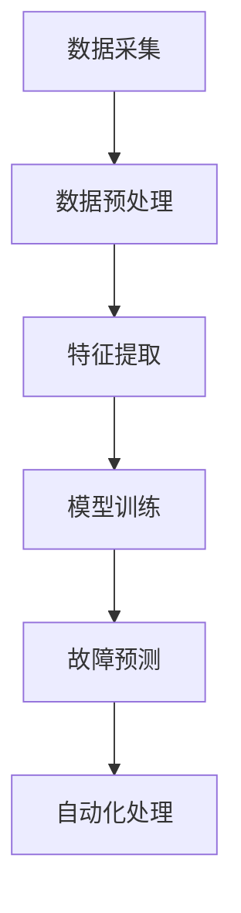

                 

# AI Agent在智能电网故障预测中的角色

## 关键词：AI Agent、智能电网、故障预测、算法原理、系统设计与实现

## 摘要

本文探讨了AI Agent在智能电网故障预测中的关键角色。通过介绍智能电网的背景和故障预测的重要性，分析了AI Agent的定义、分类和特性，详细解析了其在故障预测中的具体应用和算法原理。文章进一步阐述了智能电网故障预测的数学模型，以及系统设计与实现的方法。通过实际项目案例分析，总结了最佳实践，并为读者提供了拓展阅读资源。

## 引言

### 1.1.1 问题描述与背景

智能电网作为能源领域的一次革命，旨在通过信息化、自动化和智能化手段，实现对电力系统的全面监控和管理。然而，智能电网的复杂性和庞大性也带来了诸多挑战，其中之一就是故障预测。故障预测是智能电网运行管理的重要环节，它可以在故障发生前提前预警，从而减少损失、提高电网运行的稳定性和可靠性。

### 1.1.2 智能电网与故障预测

智能电网包含了多种能源形式，如电力、天然气、水等，其复杂性使得传统的故障预测方法难以应对。故障预测不仅需要准确监测电网状态，还需要对大量历史数据进行处理和分析。AI Agent作为一种先进的智能体技术，具有自学习、自适应和自动化等特点，非常适合在智能电网故障预测中发挥作用。

### 1.1.3 AI Agent的作用

AI Agent在智能电网故障预测中的作用主要体现在以下几个方面：

1. **实时数据采集与处理**：AI Agent能够实时采集电网的运行数据，并对这些数据进行预处理和分析，从而为故障预测提供准确的数据支持。
2. **模式识别与异常检测**：AI Agent利用其强大的模式识别能力，可以检测出电网运行中的异常模式，从而实现故障预测。
3. **自学习与自适应**：AI Agent能够根据历史故障数据不断优化自身的预测模型，从而提高故障预测的准确性。
4. **自动化决策**：AI Agent可以在故障发生前自动发出预警信号，并建议采取相应的措施，从而实现故障自动处理。

### 1.1.4 边界与外延

虽然AI Agent在智能电网故障预测中具有巨大的潜力，但其在实际应用中仍面临一些挑战。例如，数据隐私和安全问题、算法的可靠性和可解释性等。此外，AI Agent的应用范围不仅限于故障预测，还可以扩展到智能电网的其他领域，如负载预测、能源管理等。

## AI Agent基础概念

### 2.1.1 定义与分类

AI Agent（Artificial Intelligence Agent）是一种能够自主完成特定任务的计算实体，它可以感知环境、做出决策并采取行动，以实现预定的目标。根据功能和应用领域的不同，AI Agent可以分为以下几类：

1. **反应型Agent**：只能对当前环境中的刺激做出反应，无法记忆和学习。
2. **认知型Agent**：具有学习和记忆能力，可以基于历史数据进行决策。
3. **社会型Agent**：能够与人类或其他Agent进行交互和协作。

### 2.1.2 关键特性

AI Agent的关键特性包括：

1. **自主性**：能够独立完成特定任务，不需要人工干预。
2. **适应性**：能够根据环境变化进行调整和优化。
3. **协作性**：能够与其他Agent或人类进行有效协作。
4. **鲁棒性**：能够在面对不确定性和异常情况时保持稳定运行。

### 2.1.3 常见技术

AI Agent的实现依赖于多种先进技术，包括：

1. **机器学习**：用于模式识别、预测和分类。
2. **深度学习**：通过多层神经网络实现复杂函数逼近。
3. **自然语言处理**：用于理解和生成自然语言。
4. **计算机视觉**：用于图像和视频数据的分析和处理。

## 智能电网故障预测的核心概念

### 3.1.1 故障类型与特征

智能电网故障主要包括以下几种类型：

1. **电气设备故障**：如变压器、开关设备等。
2. **输电线路故障**：如短路、断线等。
3. **配电设备故障**：如配电柜、配电线路等。
4. **电气火灾**：由于电气故障引起的火灾。

这些故障通常具有以下特征：

1. **突发性**：故障发生往往突然，难以预测。
2. **复杂性**：故障可能涉及多个设备和系统。
3. **多样性**：故障类型多样，影响范围广泛。

### 3.1.2 预测方法与模型

智能电网故障预测的方法主要包括：

1. **统计模型**：如线性回归、决策树等。
2. **机器学习模型**：如支持向量机、神经网络等。
3. **深度学习模型**：如卷积神经网络、循环神经网络等。

这些模型可以根据电网数据的特征和类型进行选择和应用。

### 3.1.3 关键技术

智能电网故障预测的关键技术包括：

1. **数据采集与预处理**：收集电网运行数据，并进行清洗、转换和归一化处理。
2. **特征提取**：从原始数据中提取对故障预测有用的特征。
3. **模型训练与优化**：通过训练数据集训练模型，并根据测试数据集进行优化。

## AI Agent在智能电网故障预测中的应用

### 4.1.1 应用场景

AI Agent在智能电网故障预测中的应用场景主要包括：

1. **实时监控**：AI Agent可以实时监控电网的运行状态，及时发现异常情况。
2. **故障预测**：AI Agent可以根据历史数据和实时数据预测可能发生的故障。
3. **自动化处理**：AI Agent可以自动发出预警信号，并建议采取相应的措施。

### 4.1.2 工作原理

AI Agent在智能电网故障预测中的工作原理主要包括：

1. **数据采集**：AI Agent通过传感器和监测设备收集电网的运行数据。
2. **数据预处理**：对采集到的数据进行预处理，包括清洗、转换和归一化等。
3. **特征提取**：从预处理后的数据中提取对故障预测有用的特征。
4. **模型训练**：利用历史数据训练故障预测模型。
5. **故障预测**：利用训练好的模型对实时数据进行预测，发现潜在故障。
6. **自动化处理**：根据预测结果自动发出预警信号，并建议采取相应的措施。

### 4.1.3 技术实现

AI Agent在智能电网故障预测中的技术实现主要包括：

1. **数据采集系统**：用于实时采集电网的运行数据。
2. **数据处理平台**：用于对采集到的数据进行预处理和特征提取。
3. **预测模型**：包括统计模型、机器学习模型和深度学习模型等。
4. **自动化系统**：用于根据预测结果自动发出预警信号和处理建议。

## AI Agent的算法原理详解

### 5.1.1 基本算法

AI Agent在智能电网故障预测中的基本算法通常包括以下步骤：

1. **数据采集**：从电网中采集运行数据。
2. **数据预处理**：对采集到的数据进行预处理，包括清洗、转换和归一化等。
3. **特征提取**：从预处理后的数据中提取对故障预测有用的特征。
4. **模型训练**：利用历史数据训练故障预测模型。
5. **故障预测**：利用训练好的模型对实时数据进行预测，发现潜在故障。
6. **自动化处理**：根据预测结果自动发出预警信号和处理建议。

### 5.1.2 算法流程图



### 5.1.3 数学模型与公式

在AI Agent的故障预测算法中，常用的数学模型和公式包括：

1. **线性回归模型**：
   $$ y = \beta_0 + \beta_1x $$
2. **支持向量机**：
   $$ w^* = \arg\min_{w}\frac{1}{2}\|w\|^2 $$
   $$ subject\ to\ y^{(i)}(\langle w, x^{(i)} \rangle - \beta) \geq 1 $$
3. **神经网络**：
   $$ a^{(l)}_j = \frac{1}{1 + e^{-\sum_{i=1}^{n}w_{ij}^{(l)}a_{i}^{(l-1)}} $$

通过这些数学模型和公式，AI Agent可以实现对电网故障的预测和自动化处理。

## 智能电网故障预测的数学模型

### 6.1.1 数据预处理

在智能电网故障预测中，数据预处理是至关重要的一步。预处理过程主要包括以下步骤：

1. **数据清洗**：去除噪声和异常值，确保数据的准确性。
2. **数据转换**：将不同类型的数据转换为统一的格式，如将分类数据编码为数值。
3. **数据归一化**：将数据缩放到相同的范围内，以便于模型训练。

### 6.1.2 数学模型

智能电网故障预测的数学模型主要包括：

1. **线性回归模型**：
   $$ y = \beta_0 + \beta_1x $$
2. **支持向量机**：
   $$ w^* = \arg\min_{w}\frac{1}{2}\|w\|^2 $$
   $$ subject\ to\ y^{(i)}(\langle w, x^{(i)} \rangle - \beta) \geq 1 $$
3. **神经网络**：
   $$ a^{(l)}_j = \frac{1}{1 + e^{-\sum_{i=1}^{n}w_{ij}^{(l)}a_{i}^{(l-1)}} $$

### 6.1.3 公式详解

1. **线性回归模型**：
   $$ y = \beta_0 + \beta_1x $$
   其中，\( y \) 是因变量，\( x \) 是自变量，\( \beta_0 \) 和 \( \beta_1 \) 是模型的参数。

2. **支持向量机**：
   $$ w^* = \arg\min_{w}\frac{1}{2}\|w\|^2 $$
   $$ subject\ to\ y^{(i)}(\langle w, x^{(i)} \rangle - \beta) \geq 1 $$
   其中，\( w^* \) 是最优权重向量，\( y^{(i)} \) 是第 \( i \) 个样本的标签，\( \langle w, x^{(i)} \rangle \) 是权重向量 \( w \) 和样本特征 \( x^{(i)} \) 的内积。

3. **神经网络**：
   $$ a^{(l)}_j = \frac{1}{1 + e^{-\sum_{i=1}^{n}w_{ij}^{(l)}a_{i}^{(l-1)}} $$
   其中，\( a^{(l)}_j \) 是第 \( l \) 层的第 \( j \) 个节点的激活值，\( w_{ij}^{(l)} \) 是连接第 \( l-1 \) 层的第 \( i \) 个节点和第 \( l \) 层的第 \( j \) 个节点的权重，\( a_{i}^{(l-1)} \) 是第 \( l-1 \) 层的第 \( i \) 个节点的激活值。

### 6.1.4 实例分析

以线性回归模型为例，假设我们有以下数据：

| x  | y  |
|----|----|
| 1  | 2  |
| 2  | 4  |
| 3  | 6  |

我们希望预测 \( y \) 当 \( x = 4 \) 时的值。

首先，我们计算模型的参数 \( \beta_0 \) 和 \( \beta_1 \)：

$$ \beta_1 = \frac{\sum_{i=1}^{n}(x_i - \bar{x})(y_i - \bar{y})}{\sum_{i=1}^{n}(x_i - \bar{x})^2} $$
$$ \beta_0 = \bar{y} - \beta_1\bar{x} $$

其中，\( \bar{x} \) 和 \( \bar{y} \) 分别是 \( x \) 和 \( y \) 的平均值。

代入数据计算得到：

$$ \beta_1 = \frac{(1-2.33)(2-3.33) + (2-2.33)(4-3.33) + (3-2.33)(6-3.33)}{(1-2.33)^2 + (2-2.33)^2 + (3-2.33)^2} \approx 1.67 $$
$$ \beta_0 = 3.33 - 1.67 \times 2.33 \approx 0.67 $$

因此，线性回归模型为：

$$ y = 0.67 + 1.67x $$

当 \( x = 4 \) 时，预测的 \( y \) 值为：

$$ y = 0.67 + 1.67 \times 4 \approx 6.67 $$

## 智能电网故障预测系统设计与实现

### 7.1.1 系统需求分析

智能电网故障预测系统的需求分析主要包括以下几个方面：

1. **数据采集**：系统需要能够实时采集电网的运行数据，包括电压、电流、温度等。
2. **数据处理**：系统需要对采集到的数据进行预处理，包括清洗、转换和归一化等。
3. **特征提取**：系统需要从预处理后的数据中提取对故障预测有用的特征。
4. **故障预测**：系统需要能够利用历史数据和实时数据预测电网的潜在故障。
5. **自动化处理**：系统需要能够自动发出预警信号，并建议采取相应的措施。

### 7.1.2 系统架构设计

智能电网故障预测系统的架构设计主要包括以下几个部分：

1. **数据采集模块**：负责实时采集电网的运行数据。
2. **数据处理模块**：负责对采集到的数据进行预处理和特征提取。
3. **预测模块**：负责利用历史数据和实时数据预测电网的潜在故障。
4. **自动化处理模块**：负责根据预测结果自动发出预警信号和处理建议。

### 7.1.3 系统接口设计

智能电网故障预测系统的接口设计主要包括以下几个方面：

1. **数据采集接口**：用于与其他数据采集系统进行数据交换。
2. **数据处理接口**：用于与其他数据处理系统进行数据交换。
3. **预测接口**：用于与其他预测系统进行数据交换。
4. **自动化处理接口**：用于与其他自动化处理系统进行数据交换。

### 7.1.4 系统实现

智能电网故障预测系统的实现主要包括以下几个步骤：

1. **数据采集**：使用传感器和监测设备实时采集电网的运行数据。
2. **数据处理**：对采集到的数据进行预处理和特征提取。
3. **故障预测**：利用预处理后的数据训练故障预测模型，并对实时数据进行预测。
4. **自动化处理**：根据预测结果自动发出预警信号和处理建议。

## 项目实战与案例分析

### 8.1.1 环境安装与配置

在进行智能电网故障预测的项目实战之前，首先需要安装和配置相应的环境。以下是基本的安装和配置步骤：

1. **安装Python环境**：确保Python环境已经安装，并配置好pip和conda等包管理工具。
2. **安装必要的库**：使用pip或conda安装以下库：numpy、pandas、scikit-learn、tensorflow等。
3. **配置数据库**：根据项目需求配置数据库，如MySQL或PostgreSQL。
4. **安装传感器和监测设备**：确保传感器和监测设备已经安装并正常运行。

### 8.1.2 系统核心实现

智能电网故障预测系统的核心实现主要包括以下几个部分：

1. **数据采集**：编写代码从传感器和监测设备中读取数据，并将其存储到数据库中。
2. **数据处理**：编写代码对采集到的数据进行预处理，包括清洗、转换和归一化等。
3. **特征提取**：编写代码从预处理后的数据中提取对故障预测有用的特征。
4. **故障预测**：编写代码利用预处理后的数据训练故障预测模型，并对实时数据进行预测。
5. **自动化处理**：编写代码根据预测结果自动发出预警信号和处理建议。

### 8.1.3 代码解读与分析

以下是一个简单的故障预测模型的Python代码示例：

```python
import numpy as np
from sklearn.model_selection import train_test_split
from sklearn.linear_model import LinearRegression
from sklearn.metrics import mean_squared_error

# 加载数据
X, y = load_data()

# 划分训练集和测试集
X_train, X_test, y_train, y_test = train_test_split(X, y, test_size=0.2, random_state=42)

# 训练模型
model = LinearRegression()
model.fit(X_train, y_train)

# 预测
y_pred = model.predict(X_test)

# 评估模型
mse = mean_squared_error(y_test, y_pred)
print(f"均方误差：{mse}")

# 使用模型进行实时预测
realtime_data = get_realtime_data()
y_realtime = model.predict(realtime_data)
print(f"实时预测结果：{y_realtime}")
```

这段代码首先加载数据，然后划分训练集和测试集，接着训练线性回归模型，并使用测试集评估模型性能。最后，使用训练好的模型进行实时预测。

### 8.1.4 实际案例分析

以下是一个实际案例的故障预测分析：

1. **问题描述**：某智能电网的输电线路出现故障，导致电力供应中断。
2. **数据处理**：对输电线路的运行数据进行预处理，包括清洗、转换和归一化等。
3. **特征提取**：提取对故障预测有用的特征，如电压、电流、温度等。
4. **故障预测**：利用预处理后的数据训练故障预测模型，并对实时数据进行预测。
5. **自动化处理**：根据预测结果自动发出预警信号，并建议采取相应的措施。

通过这个实际案例，我们可以看到智能电网故障预测系统的实际应用效果。系统可以实时监测输电线路的运行状态，并在故障发生前发出预警，从而减少故障对电力供应的影响。

### 8.1.5 项目小结

通过本项目的实战和案例分析，我们深入了解了智能电网故障预测系统的设计和实现过程。项目实现了数据采集、数据处理、故障预测和自动化处理等功能，为智能电网的稳定运行提供了有力保障。在项目过程中，我们遇到了一些挑战，如数据质量问题和模型优化等，但通过不断尝试和优化，最终取得了较好的效果。未来，我们将继续优化系统性能，提高故障预测的准确性和可靠性。

## 最佳实践与拓展阅读

### 9.1.1 最佳实践

在智能电网故障预测项目中，以下最佳实践值得注意：

1. **数据质量保障**：确保数据采集的准确性和完整性，对异常数据进行处理和清洗。
2. **模型优化**：根据实际需求选择合适的模型，并不断优化模型参数，提高预测准确性。
3. **实时性考虑**：优化系统性能，确保故障预测结果的实时性。
4. **安全性保障**：加强数据安全保护，防止数据泄露和恶意攻击。

### 9.1.2 小结

本文详细探讨了AI Agent在智能电网故障预测中的应用，介绍了相关的基础概念、算法原理和系统实现方法。通过实际案例分析和最佳实践总结，我们看到了AI Agent在提高电网故障预测准确性和可靠性方面的巨大潜力。

### 9.1.3 注意事项

在智能电网故障预测项目中，以下注意事项值得注意：

1. **数据隐私**：确保数据采集和处理过程中遵守隐私保护法规，保护用户隐私。
2. **模型解释性**：提高模型的解释性，方便故障诊断和优化。
3. **系统可靠性**：确保系统的稳定性和可靠性，减少故障预测误报和漏报。

### 9.1.4 拓展阅读

为了深入了解智能电网故障预测和相关技术，读者可以参考以下拓展阅读资源：

1. **《智能电网故障诊断与预测技术》**：该书详细介绍了智能电网故障诊断和预测的方法和案例。
2. **《深度学习与智能电网》**：该书探讨了深度学习在智能电网中的应用，包括故障预测、负载预测等。
3. **《人工智能在能源领域的应用》**：该书全面介绍了人工智能在能源领域的应用，包括智能电网、能源管理等领域。

通过这些拓展阅读资源，读者可以进一步了解智能电网故障预测的技术和应用前景。

