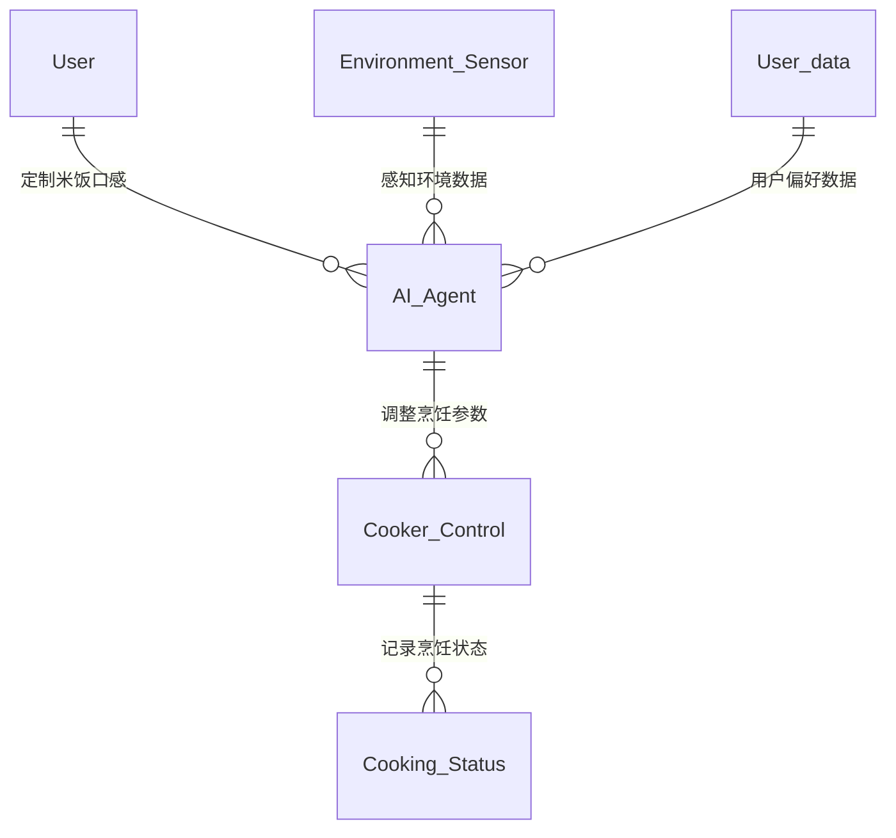
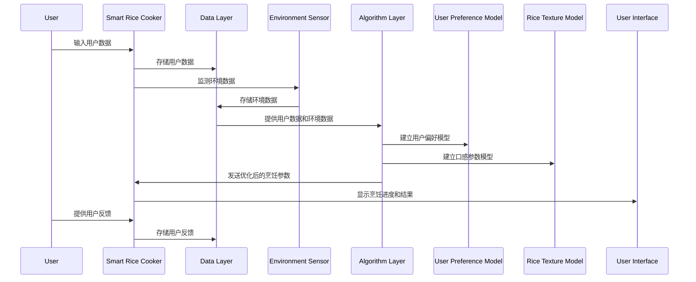
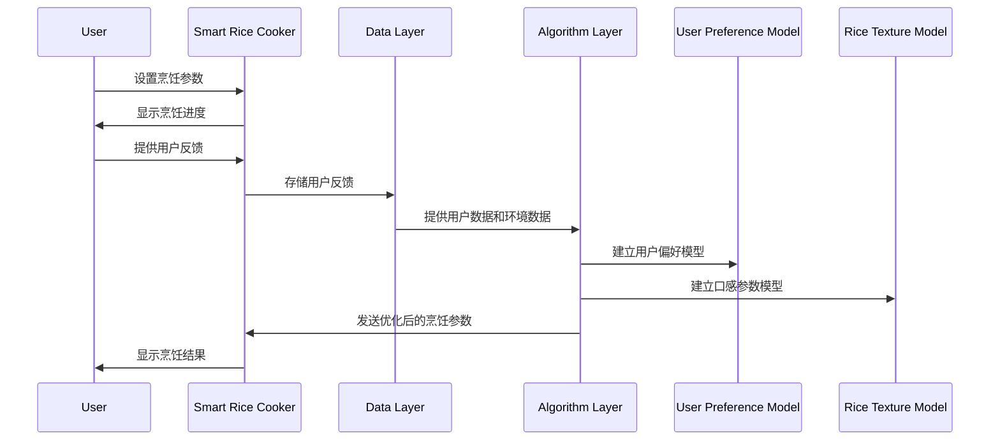

                 

## AI Agent在智能电饭煲中的米饭口感定制

### 关键词：AI Agent，智能电饭煲，个性化定制，米饭口感，机器学习，数据挖掘

> 摘要：本文将深入探讨AI Agent在智能电饭煲中的米饭口感定制技术。通过分析问题背景，阐述核心概念和算法原理，设计系统架构，实施项目实战，最终总结最佳实践和未来拓展方向。

## 第一部分: 背景介绍

### 1.1 问题背景

#### 1.1.1 问题背景

在当今智能家电快速发展的时代，智能电饭煲作为现代厨房的常见设备，已经不再是简单的烹饪工具。随着人工智能技术的发展，智能电饭煲逐渐具备了智能化、个性化定制的功能，使得米饭口感可以根据用户偏好进行调节。

#### 1.1.2 问题描述

然而，如何实现智能电饭煲对米饭口感的个性化定制，成为了摆在开发人员面前的一大难题。传统电饭煲的预设程序无法满足用户对个性化定制的需求，而人工智能技术的引入，为解决这一问题提供了新的思路。

#### 1.1.3 问题解决

AI Agent作为一种智能代理，可以通过学习用户的历史使用数据、环境信息以及米饭的物理特性，实现对米饭口感的智能预测和定制。通过AI Agent，智能电饭煲可以提供更为精确的米饭口感定制，满足不同用户的个性化需求。

#### 1.1.4 边界与外延

AI Agent在智能电饭煲中的米饭口感定制，涉及到多个技术领域的交叉，包括人工智能、机器学习、数据挖掘等。同时，这一技术也具有广泛的应用前景，不仅限于电饭煲，还可以应用于其他家电产品，如智能烤箱、智能洗衣机等。

#### 1.1.5 概念结构与核心要素组成

在本书中，我们将深入探讨AI Agent在智能电饭煲中的米饭口感定制技术，核心概念包括：

- AI Agent：智能代理，负责对用户数据和环境信息进行学习，实现个性化定制。
- 数据挖掘：从用户使用数据中提取有用的信息，为AI Agent提供决策依据。
- 机器学习：通过训练模型，实现对用户偏好和米饭口感参数的预测和优化。
- 用户体验：用户与智能电饭煲的交互过程，是优化定制服务的关键。

### 1.2 核心概念与联系

#### 1.2.1 AI Agent原理与特性

AI Agent是一种智能实体，能够在动态环境中自主地感知、决策和执行任务。它具有以下几个核心特性：

- 自主性：AI Agent能够独立地执行任务，不受人类直接控制。
- 学习能力：通过学习用户行为和环境数据，AI Agent能够不断优化其性能。
- 适应性：AI Agent能够根据环境变化调整其行为策略。

#### 1.2.2 数据挖掘与机器学习

数据挖掘是从大量数据中提取有价值信息的过程，而机器学习是利用数据训练模型，实现对未知数据的预测。两者在AI Agent中的作用如下：

- 数据挖掘：用于收集和整理用户使用数据，为机器学习提供训练数据。
- 机器学习：通过训练模型，实现对用户偏好和米饭口感参数的预测和优化。

### 1.3 数学模型与算法原理

#### 1.3.1 数学模型

在AI Agent的米饭口感定制过程中，我们可以使用以下数学模型：

- 用户偏好模型：用于描述用户对米饭口感的偏好，如口感软硬、香度等。
- 米饭口感参数模型：用于描述米饭的物理特性，如水分含量、硬度等。
- 预测模型：基于用户偏好模型和米饭口感参数模型，预测用户满意的米饭口感。

#### 1.3.2 算法原理

算法原理主要分为以下几个步骤：

1. 数据收集：收集用户的历史使用数据，包括烹饪时间、温度、水量等。
2. 数据处理：对收集的数据进行预处理，去除噪声和异常值。
3. 用户偏好建模：通过数据挖掘技术，从历史使用数据中提取用户偏好特征。
4. 米饭口感参数建模：通过机器学习算法，建立米饭口感参数与用户偏好之间的关系。
5. 预测与优化：基于用户偏好模型和米饭口感参数模型，预测用户满意的米饭口感，并优化烹饪参数。

### 1.4 系统分析与架构设计

#### 1.4.1 问题场景介绍

智能电饭煲的用户场景包括家庭和个人用户，他们希望通过智能电饭煲获得个性化的米饭口感体验。

#### 1.4.2 系统功能设计

智能电饭煲系统功能包括用户数据收集、用户偏好建模、米饭口感参数建模、预测与优化等。

#### 1.4.3 系统架构设计

系统架构设计包括以下几个部分：

- 数据层：存储用户数据、环境数据和米饭口感参数。
- 算法层：实现用户偏好建模、米饭口感参数建模和预测与优化算法。
- 应用层：提供用户交互界面和智能电饭煲控制模块。

#### 1.4.4 系统接口设计

系统接口设计包括用户数据接口、环境数据接口、用户偏好模型接口、米饭口感参数模型接口和预测与优化接口。

#### 1.4.5 系统交互设计

系统交互设计使用Mermaid序列图表示用户与智能电饭煲的交互过程。

### 1.5 项目实战

#### 1.5.1 环境安装

介绍智能电饭煲系统开发所需的环境安装，包括硬件和软件环境。

## 第二部分: AI Agent原理与特性

### 2.1 AI Agent原理

AI Agent（智能代理）是一种能够在复杂环境中自主行动，并为实现特定目标而采取行动的软件实体。在智能电饭煲中，AI Agent的原理主要基于以下几个核心组成部分：

- **感知模块**：负责采集外部环境数据，如温度、湿度、烹饪时间等。
- **决策模块**：基于感知模块收集的数据和预设的目标，进行决策。
- **执行模块**：根据决策模块的决策结果，对智能电饭煲进行操作，如调整烹饪温度、时间等。

AI Agent的工作流程如下：

1. **感知**：AI Agent通过内置的传感器收集环境数据，如温度传感器、湿度传感器等。
2. **决策**：AI Agent根据历史数据和当前环境数据，利用机器学习算法预测用户对米饭口感的偏好。
3. **执行**：AI Agent根据决策结果，对智能电饭煲的烹饪参数进行调节，以实现用户满意的米饭口感。

### 2.2 AI Agent特性

AI Agent具有以下几个核心特性：

#### 2.2.1 自主性

AI Agent具有高度的自主性，能够独立地执行任务，无需人类干预。这种自主性使得AI Agent能够在复杂的厨房环境中，根据用户的个性化需求，自动调整烹饪参数。

#### 2.2.2 学习能力

AI Agent通过不断学习用户的历史使用数据和烹饪环境数据，能够逐步优化其性能。这种学习能力使得AI Agent能够更好地理解用户的需求，提供更为精确的米饭口感定制服务。

#### 2.2.3 适应性

AI Agent能够根据环境变化和用户需求的变化，调整其行为策略。这种适应性使得AI Agent在不同烹饪场景中，都能提供高效的米饭口感定制服务。

#### 2.2.4 协作能力

AI Agent不仅能够独立工作，还可以与其他智能家电进行协作，实现更智能的家居生活体验。例如，与智能烤箱、智能洗衣机等设备联动，共同为用户提供个性化的烹饪、洗衣等服务。

### 2.3 AI Agent与其他技术的对比

#### 2.3.1 与传统控制系统的对比

与传统控制系统相比，AI Agent具有更高的灵活性和智能化程度。传统控制系统通常依赖于预设的参数和逻辑，无法根据用户需求和环境变化进行动态调整。而AI Agent则通过学习和适应，能够提供更加个性化的服务。

#### 2.3.2 与其他人工智能技术的对比

与深度学习、自然语言处理等其他人工智能技术相比，AI Agent更专注于特定任务，如智能电饭煲中的米饭口感定制。这种专门化使得AI Agent能够更高效地解决特定问题，提供更为精确的定制服务。

### 2.4 AI Agent的ER实体关系图

为了更好地理解AI Agent在智能电饭煲中的角色和功能，我们可以使用ER（实体关系）图来表示AI Agent与其他组件之间的关系。以下是一个简化的ER实体关系图：



在这个ER实体关系图中：

- **User**（用户）：表示使用智能电饭煲的用户。
- **AI_Agent**（AI代理）：负责处理用户数据和环境数据，实现米饭口感定制。
- **Cooker_Control**（烹饪控制）：根据AI Agent的决策，调整烹饪参数。
- **Cooking_Status**（烹饪状态）：记录烹饪过程中的状态信息。
- **Environment_Sensor**（环境传感器）：负责收集环境数据。
- **User_data**（用户数据）：存储用户的历史使用数据和偏好。

### 2.5 AI Agent的核心组成部分

为了深入理解AI Agent的原理和功能，我们可以进一步探讨其核心组成部分：

#### 2.5.1 感知模块

感知模块是AI Agent的核心组件之一，负责采集外部环境数据。这些数据包括温度、湿度、烹饪时间等，是AI Agent进行决策的重要依据。感知模块通常由多种传感器组成，如温度传感器、湿度传感器、压力传感器等。

#### 2.5.2 决策模块

决策模块基于感知模块收集的数据和预设的目标，利用机器学习算法进行决策。决策模块的核心是机器学习模型，该模型可以通过训练学习用户的行为和偏好，从而为用户定制个性化的米饭口感。

#### 2.5.3 执行模块

执行模块负责根据决策模块的决策结果，对智能电饭煲的烹饪参数进行调整。执行模块通常包括电机、加热器、温控器等硬件组件，这些组件能够根据AI Agent的指令，自动调节烹饪过程中的温度、时间等参数。

### 2.6 AI Agent的工作流程

AI Agent的工作流程可以分为以下几个步骤：

1. **数据收集**：AI Agent通过感知模块收集用户的历史使用数据和环境数据。
2. **数据预处理**：对收集的数据进行清洗、去噪等预处理，确保数据质量。
3. **特征提取**：从预处理后的数据中提取有用的特征，如烹饪时间、温度、湿度等。
4. **模型训练**：利用机器学习算法，对提取的特征进行训练，建立用户偏好模型。
5. **决策**：基于用户偏好模型和环境数据，AI Agent进行决策，确定烹饪参数。
6. **执行**：AI Agent根据决策结果，对智能电饭煲的烹饪参数进行调整。
7. **反馈**：烹饪完成后，AI Agent收集用户反馈，用于进一步优化模型和决策。

通过以上工作流程，AI Agent能够实现高效、精确的米饭口感定制服务，为用户带来个性化的烹饪体验。

### 2.7 AI Agent在智能电饭煲中的实际应用

在实际应用中，AI Agent在智能电饭煲中的表现为以下几方面：

1. **个性化定制**：AI Agent通过学习用户的历史使用数据和偏好，为用户提供个性化的米饭口感定制服务。用户可以根据自己的口味偏好，设置不同的烹饪参数，如烹饪时间、温度等。
2. **自适应调整**：AI Agent能够根据环境变化，如温度、湿度等，自动调整烹饪参数，确保米饭口感的一致性。
3. **智能反馈**：AI Agent在烹饪过程中，会收集用户反馈，如口感评价、烹饪满意度等，用于进一步优化模型和决策。
4. **协同工作**：AI Agent不仅能够独立工作，还可以与其他智能家电协同工作，如智能烤箱、智能洗衣机等，共同为用户提供智能家居体验。

### 2.8 AI Agent的未来发展趋势

随着人工智能技术的不断进步，AI Agent在智能电饭煲中的应用前景将更加广阔。未来，AI Agent可能具备以下发展趋势：

1. **更高效的模型训练**：利用深度学习、强化学习等先进算法，提高AI Agent的决策效率和准确性。
2. **跨设备协作**：实现AI Agent与其他智能家电的深度协作，提供更加智能、便捷的家居体验。
3. **用户隐私保护**：在保障用户隐私的前提下，收集和处理用户数据，为用户提供个性化的服务。
4. **更广泛的场景应用**：除了电饭煲，AI Agent还可以应用于其他家电产品，如烤箱、洗衣机、冰箱等，为用户提供全方位的智能家居服务。

### 2.9 小结

通过本文的介绍，我们了解了AI Agent在智能电饭煲中的原理、特性、工作流程和实际应用。AI Agent通过个性化定制、自适应调整、智能反馈和跨设备协作，为用户提供了高质量的米饭口感定制服务。未来，随着人工智能技术的不断发展，AI Agent在智能家电中的应用将更加广泛，为用户带来更加智能、便捷的家居生活体验。

## 第三部分: 数据挖掘与机器学习在AI Agent中的应用

### 3.1 数据挖掘在AI Agent中的作用

数据挖掘是AI Agent的核心组成部分之一，它负责从大量历史数据中提取有价值的信息，为AI Agent提供决策依据。在智能电饭煲中，数据挖掘的具体作用包括以下几个方面：

1. **用户偏好分析**：通过分析用户的历史使用数据，如烹饪时间、温度、水量等，提取用户对米饭口感的偏好特征。这些特征可以帮助AI Agent更好地理解用户的需求，为用户定制个性化的米饭口感。
2. **环境数据分析**：数据挖掘还可以用于分析环境数据，如温度、湿度、气压等，从而为AI Agent提供更准确的烹饪环境信息。这些信息有助于AI Agent更好地调整烹饪参数，确保米饭口感的一致性。
3. **异常检测与预测**：通过分析历史数据，数据挖掘技术可以发现潜在的异常情况，如设备故障、用户行为异常等。这有助于AI Agent提前预警，采取相应的措施，避免问题的发生。

### 3.2 机器学习在AI Agent中的应用

机器学习是AI Agent的核心技术之一，它通过训练模型，实现对用户偏好和米饭口感参数的预测和优化。在智能电饭煲中，机器学习的具体应用包括以下几个方面：

1. **用户偏好预测**：通过训练机器学习模型，AI Agent可以预测用户对米饭口感的偏好。这些预测结果可以帮助AI Agent自动调整烹饪参数，满足用户的个性化需求。
2. **口感参数优化**：机器学习模型还可以用于优化米饭口感参数，如温度、时间、水量等。通过不断调整这些参数，AI Agent可以找到最优的烹饪方案，实现用户满意的米饭口感。
3. **自适应调整**：机器学习模型可以根据环境数据的变化，自动调整烹饪参数。例如，当环境温度升高时，AI Agent可以自动降低烹饪温度，防止米饭过于干硬。

### 3.3 数据挖掘与机器学习的结合

数据挖掘和机器学习在AI Agent中的应用并不是孤立的，而是相互结合、相互促进的。具体来说，两者之间的结合主要体现在以下几个方面：

1. **协同优化**：数据挖掘和机器学习可以协同优化，通过数据挖掘技术提取有价值的信息，为机器学习模型提供更好的训练数据。同时，机器学习模型可以更好地利用这些数据，提高预测和优化效果。
2. **模型修正**：在AI Agent的训练过程中，数据挖掘技术可以发现潜在的问题，如数据缺失、噪声干扰等。这些问题可以通过机器学习模型的修正算法进行解决，从而提高模型的准确性。
3. **反馈循环**：AI Agent在执行任务过程中，会收集用户的反馈信息。这些信息可以用于进一步优化数据挖掘和机器学习模型，形成一个反馈循环。通过不断优化模型，AI Agent可以更好地满足用户的个性化需求。

### 3.4 数据挖掘与机器学习的关键技术

在AI Agent中，数据挖掘和机器学习的关键技术包括以下几个方面：

1. **特征工程**：特征工程是数据挖掘和机器学习的重要环节，它涉及到如何从原始数据中提取出有用的特征。一个好的特征工程可以显著提高模型的预测准确性和效率。
2. **模型选择**：选择合适的机器学习模型对于AI Agent的性能至关重要。不同的模型适用于不同的场景和数据类型，需要根据实际情况进行选择。
3. **模型训练与优化**：模型训练与优化是机器学习的核心任务，它涉及到如何通过调整模型参数，提高模型的预测性能。常用的优化方法包括交叉验证、网格搜索等。
4. **模型评估与验证**：模型评估与验证是确保模型性能的重要手段。通过评估和验证，可以确定模型是否满足预期要求，从而进行必要的调整和优化。

### 3.5 数据挖掘与机器学习的挑战与解决方案

尽管数据挖掘和机器学习在AI Agent中具有广泛的应用前景，但在实际应用中仍面临一些挑战：

1. **数据质量问题**：数据挖掘和机器学习的效果很大程度上取决于数据质量。噪声、异常值和缺失数据都会影响模型的性能。针对数据质量问题，可以采取数据清洗、数据修复等技术进行解决。
2. **模型可解释性**：许多机器学习模型，如深度神经网络，具有强大的预测能力，但缺乏可解释性。这给用户理解和信任模型带来了困难。为了提高模型的可解释性，可以采用可解释性方法，如模型可视化、模型拆解等。
3. **计算资源需求**：数据挖掘和机器学习通常需要大量的计算资源，对于硬件设备和算法性能都有较高的要求。针对计算资源需求，可以采用分布式计算、云计算等技术进行优化。

### 3.6 数据挖掘与机器学习的最佳实践

为了充分发挥数据挖掘和机器学习在AI Agent中的作用，以下是一些最佳实践：

1. **数据质量保证**：确保数据质量是数据挖掘和机器学习成功的关键。在数据收集、处理和存储过程中，要注重数据质量的管理和监控。
2. **模型选择与优化**：根据具体应用场景和数据特点，选择合适的机器学习模型，并进行参数优化，以提高模型的预测性能。
3. **持续学习与更新**：数据挖掘和机器学习模型需要不断学习和更新，以适应环境变化和用户需求的变化。通过持续学习，可以不断提高模型的准确性和适应性。
4. **用户反馈与改进**：收集用户的反馈信息，并将其用于模型优化和改进。通过用户的实际使用体验，可以更好地理解用户需求，提高AI Agent的服务质量。

### 3.7 小结

数据挖掘和机器学习是AI Agent实现个性化定制的重要技术手段。通过数据挖掘，可以从大量历史数据中提取有价值的信息，为AI Agent提供决策依据。而通过机器学习，可以建立用户偏好模型和口感参数模型，实现精确的米饭口感定制。在AI Agent的发展过程中，数据挖掘和机器学习将继续发挥关键作用，为用户提供更加智能、便捷的烹饪体验。

## 第四部分: 数学模型与算法原理

### 4.1 数学模型

在AI Agent的米饭口感定制过程中，数学模型是核心组成部分。以下是几个关键的数学模型及其在系统中的应用：

#### 4.1.1 用户偏好模型

用户偏好模型用于描述用户对米饭口感的偏好，如口感软硬、香度等。该模型可以通过以下公式表示：

\[ P(u) = \sum_{i=1}^{n} w_i \cdot p_i \]

其中，\( P(u) \) 是用户 \( u \) 的偏好向量，\( w_i \) 是第 \( i \) 个特征的权重，\( p_i \) 是第 \( i \) 个特征的值。

#### 4.1.2 米饭口感参数模型

米饭口感参数模型用于描述米饭的物理特性，如水分含量、硬度等。该模型可以通过以下公式表示：

\[ Q(v) = \sum_{j=1}^{m} w_j \cdot q_j \]

其中，\( Q(v) \) 是米饭的口感参数向量，\( w_j \) 是第 \( j \) 个特征的权重，\( q_j \) 是第 \( j \) 个特征的值。

#### 4.1.3 预测模型

预测模型用于预测用户满意的米饭口感。该模型结合用户偏好模型和米饭口感参数模型，通过以下公式实现预测：

\[ R(u, v) = \sum_{i=1}^{n} w_i \cdot p_i \cdot \sum_{j=1}^{m} w_j \cdot q_j \]

其中，\( R(u, v) \) 是用户 \( u \) 对米饭口感 \( v \) 的满意度评分。

### 4.2 算法原理

在AI Agent中，算法原理主要涉及数据收集、数据处理、用户偏好建模、口感参数建模以及预测与优化。以下是详细的算法原理：

#### 4.2.1 数据收集

数据收集是算法的第一步，主要包括以下方面：

1. **用户使用数据**：收集用户的历史使用数据，如烹饪时间、温度、水量等。
2. **环境数据**：收集厨房环境数据，如温度、湿度、气压等。
3. **用户反馈**：收集用户对米饭口感的评价，如口感软硬、香度等。

#### 4.2.2 数据处理

数据处理是算法的第二步，主要包括以下方面：

1. **数据清洗**：去除噪声和异常值，确保数据质量。
2. **特征提取**：从原始数据中提取有用的特征，如烹饪时间、温度、水量等。
3. **特征归一化**：对提取的特征进行归一化处理，使其在相同的尺度上进行比较。

#### 4.2.3 用户偏好建模

用户偏好建模是算法的核心步骤，主要包括以下方面：

1. **用户行为分析**：通过分析用户的历史使用数据，提取用户的行为特征。
2. **偏好特征提取**：从用户行为特征中提取用户对米饭口感的偏好特征。
3. **偏好特征建模**：利用机器学习算法，建立用户偏好特征与用户满意度的关系模型。

#### 4.2.4 口感参数建模

口感参数建模是算法的另一核心步骤，主要包括以下方面：

1. **口感参数分析**：分析米饭的物理特性，如水分含量、硬度等。
2. **参数特征提取**：从口感参数中提取对用户满意度有显著影响的特征。
3. **参数特征建模**：利用机器学习算法，建立口感参数特征与用户满意度的关系模型。

#### 4.2.5 预测与优化

预测与优化是算法的最后一步，主要包括以下方面：

1. **用户满意度预测**：利用用户偏好模型和口感参数模型，预测用户对当前烹饪方案的满意度。
2. **参数优化**：根据用户满意度预测结果，优化烹饪参数，以提高用户满意度。
3. **迭代优化**：通过不断的迭代优化，逐步提高AI Agent的性能。

### 4.3 算法流程

以下是AI Agent的算法流程：

1. **初始化**：设置初始的烹饪参数，如温度、时间等。
2. **数据收集**：收集用户使用数据、环境数据和用户反馈。
3. **数据处理**：对收集的数据进行清洗、特征提取和归一化处理。
4. **用户偏好建模**：利用机器学习算法，建立用户偏好模型。
5. **口感参数建模**：利用机器学习算法，建立口感参数模型。
6. **预测与优化**：根据用户偏好模型和口感参数模型，预测用户满意度，并优化烹饪参数。
7. **执行**：根据优化后的烹饪参数，执行烹饪任务。
8. **反馈**：收集用户反馈，用于模型优化和迭代。

### 4.4 算法实现与性能评估

在实现AI Agent算法时，我们可以使用Python编程语言和相关的机器学习库，如scikit-learn、TensorFlow等。以下是算法实现的主要步骤：

1. **数据收集**：从智能电饭煲系统中收集用户使用数据、环境数据和用户反馈。
2. **数据处理**：对收集的数据进行清洗、特征提取和归一化处理。
3. **用户偏好建模**：使用scikit-learn库中的线性回归、决策树、随机森林等算法，建立用户偏好模型。
4. **口感参数建模**：使用TensorFlow库中的神经网络算法，建立口感参数模型。
5. **预测与优化**：利用训练好的模型，预测用户满意度和优化烹饪参数。
6. **执行**：根据优化后的烹饪参数，执行烹饪任务。
7. **反馈**：收集用户反馈，用于模型优化和迭代。

在性能评估方面，我们可以使用以下指标来评估AI Agent的性能：

1. **预测准确性**：评估用户满意度预测的准确性。
2. **优化效果**：评估优化后的烹饪参数对用户满意度的提升效果。
3. **响应时间**：评估AI Agent从数据收集到烹饪完成的响应时间。

### 4.5 小结

数学模型和算法原理是AI Agent实现米饭口感定制的基础。通过用户偏好模型、口感参数模型和预测模型，AI Agent能够准确预测用户满意度和优化烹饪参数，为用户提供个性化的米饭口感定制服务。在实际应用中，AI Agent的算法性能和用户体验是关键，需要不断优化和迭代，以实现更高的满意度和服务质量。

## 第五部分: 系统分析与架构设计

### 5.1 问题场景介绍

智能电饭煲作为现代厨房中的常用设备，其用户场景主要包括家庭和个人用户。家庭用户希望获得多样化的米饭口感体验，以适应不同的饮食需求和口味偏好。个人用户则希望根据个人口味和饮食习惯，获得个性化的米饭烹饪方案。

在上述背景下，智能电饭煲需要具备以下功能：

1. **用户数据收集**：收集用户的历史使用数据，如烹饪时间、温度、水量等，以便AI Agent进行个性化定制。
2. **环境数据监测**：监测厨房环境数据，如温度、湿度、气压等，为AI Agent提供烹饪环境信息。
3. **用户偏好建模**：通过机器学习算法，分析用户数据和环境数据，建立用户偏好模型，以预测用户满意的米饭口感。
4. **口感参数建模**：根据用户偏好模型，建立口感参数模型，以优化烹饪参数，实现用户满意的米饭口感。
5. **预测与优化**：基于用户偏好模型和口感参数模型，预测用户满意的米饭口感，并优化烹饪参数，以实现个性化定制。
6. **用户反馈收集**：收集用户对米饭口感的评价，用于模型优化和迭代。

### 5.2 系统功能设计

智能电饭煲系统的功能设计主要包括以下几个方面：

1. **用户数据收集模块**：负责收集用户的历史使用数据，如烹饪时间、温度、水量等。该模块需要与智能电饭煲的硬件传感器和用户交互界面进行数据通信，确保数据收集的完整性和准确性。
2. **环境数据监测模块**：负责监测厨房环境数据，如温度、湿度、气压等。该模块同样需要与智能电饭煲的硬件传感器进行数据通信，确保环境数据的实时性和准确性。
3. **用户偏好建模模块**：基于收集到的用户数据和环境数据，利用机器学习算法，分析用户行为和偏好，建立用户偏好模型。该模块的核心是机器学习算法的实现和优化，以确保模型的高效性和准确性。
4. **口感参数建模模块**：基于用户偏好模型，建立口感参数模型，以预测用户满意的米饭口感。该模块需要结合用户偏好模型和物理特性参数，通过机器学习算法实现。
5. **预测与优化模块**：基于用户偏好模型和口感参数模型，预测用户满意的米饭口感，并优化烹饪参数，实现个性化定制。该模块是智能电饭煲的核心功能，直接影响用户体验。
6. **用户反馈收集模块**：负责收集用户对米饭口感的评价，用于模型优化和迭代。该模块需要与用户交互界面进行数据通信，确保用户反馈的及时性和完整性。

### 5.3 系统架构设计

智能电饭煲系统的架构设计可以分为以下几个部分：

1. **数据层**：负责存储用户数据、环境数据和口感参数数据。数据层可以采用关系型数据库或NoSQL数据库，根据数据规模和访问模式进行选择。
2. **算法层**：负责实现用户偏好建模、口感参数建模和预测与优化算法。算法层可以使用Python、R等编程语言，结合机器学习库（如scikit-learn、TensorFlow）进行实现。
3. **应用层**：负责提供用户交互界面和智能电饭煲控制模块。应用层可以采用Web前端框架（如React、Vue.js）和后端框架（如Spring Boot、Django）进行实现。
4. **硬件层**：负责实现智能电饭煲的硬件控制功能，如温度传感器、湿度传感器、加热器、电机等。

以下是智能电饭煲系统的架构图：



### 5.4 系统接口设计

智能电饭煲系统的接口设计包括以下几个方面：

1. **用户数据接口**：用于收集用户的历史使用数据，如烹饪时间、温度、水量等。该接口需要与智能电饭煲的硬件传感器和用户交互界面进行数据通信。
2. **环境数据接口**：用于收集厨房环境数据，如温度、湿度、气压等。该接口需要与智能电饭煲的硬件传感器进行数据通信。
3. **用户偏好模型接口**：用于提供用户偏好数据，以建立用户偏好模型。该接口需要与算法层进行数据通信。
4. **口感参数模型接口**：用于提供口感参数数据，以建立口感参数模型。该接口同样需要与算法层进行数据通信。
5. **预测与优化接口**：用于提供优化后的烹饪参数，以实现个性化定制。该接口需要与智能电饭煲进行数据通信。

以下是智能电饭煲系统的接口图：

```mermaid
classDiagram
    User_data <<interface>>
    Environment_data <<interface>>
    User_preference_model <<interface>>
    Rice_texture_model <<interface>>
    Prediction_and_optimization <<interface>>

    Smart_Rice_Cooker [User Interface, Hardware Controller]
    Smart_Rice_Cooker --> User_data
    Smart_Rice_Cooker --> Environment_data
    Smart_Rice_Cooker --> User_preference_model
    Smart_Rice_Cooker --> Rice_texture_model
    Smart_Rice_Cooker --> Prediction_and_optimization
```

### 5.5 系统交互设计

智能电饭煲系统的交互设计主要包括用户与智能电饭煲的交互过程。以下是用户与智能电饭煲的交互序列图：



### 5.6 系统架构图与接口图

以下是智能电饭煲系统的架构图和接口图：

```mermaid
classDiagram
    User <<class>>
    Smart_Rice_Cooker <<class>>
    Data_Layer <<class>>
    Algorithm_Layer <<class>>

    User_data <<interface>>
    Environment_data <<interface>>
    User_preference_model <<interface>>
    Rice_texture_model <<interface>>
    Prediction_and_optimization <<interface>>

    User --> User_data
    User --> Environment_data
    Smart_Rice_Cooker --> User_preference_model
    Smart_Rice_Cooker --> Rice_texture_model
    Smart_Rice_Cooker --> Prediction_and_optimization
    Data_Layer --> Algorithm_Layer

    Smart_Rice_Cooker o-- User
    Smart_Rice_Cooker o-- Data_Layer
    Data_Layer o-- Algorithm_Layer
```


### 5.7 小结

通过系统分析与架构设计，我们明确了智能电饭煲在用户场景、系统功能、架构设计以及接口设计等方面的需求。系统架构设计的关键在于数据层、算法层和应用层的有机结合，以及用户数据接口、环境数据接口、用户偏好模型接口、口感参数模型接口和预测与优化接口的合理设计。通过这些设计，智能电饭煲能够实现高效、精确的米饭口感定制服务，为用户提供个性化的烹饪体验。

## 第六部分: 项目实战

### 6.1 环境安装

在开始智能电饭煲系统开发之前，需要安装相应的开发环境和工具。以下是在Linux系统上安装所需环境的步骤：

1. **安装Python环境**：
   - 安装Python 3.8及以上版本：
     ```bash
     sudo apt update
     sudo apt install python3.8
     sudo apt install python3.8-venv
     ```
   - 创建Python虚拟环境：
     ```bash
     python3.8 -m venv venv
     source venv/bin/activate
     ```

2. **安装机器学习库**：
   - 安装scikit-learn、TensorFlow等机器学习库：
     ```bash
     pip install scikit-learn
     pip install tensorflow
     ```

3. **安装数据库**：
   - 安装MySQL或PostgreSQL数据库：
     ```bash
     sudo apt install mysql-server
     sudo mysql_secure_installation
     ```
   - 创建数据库和用户，并授权访问权限。

4. **安装前端框架**：
   - 安装Node.js和npm：
     ```bash
     sudo apt install nodejs npm
     ```
   - 安装React或Vue.js前端框架：
     ```bash
     npm install -g create-react-app
     npm install -g @vue/cli
     ```

5. **安装其他工具**：
   - 安装Git、Docker等工具：
     ```bash
     sudo apt install git
     sudo apt install docker-ce
     sudo systemctl start docker
     sudo systemctl enable docker
     ```

### 6.2 系统核心实现

智能电饭煲系统的核心实现包括数据收集、数据处理、用户偏好建模、口感参数建模和预测与优化等模块。以下是一个简单的系统实现框架：

1. **数据收集模块**：
   - 从智能电饭煲硬件传感器收集用户使用数据和环境数据。
   - 使用Python的数据库库（如MySQL Connector、PyMySQL）连接数据库，存储收集到的数据。

2. **数据处理模块**：
   - 使用Python的Pandas库清洗和处理原始数据，去除噪声和异常值。
   - 对处理后的数据进行特征提取和归一化处理。

3. **用户偏好建模模块**：
   - 使用scikit-learn库中的线性回归、决策树、随机森林等算法，建立用户偏好模型。
   - 使用Python的机器学习库（如scikit-learn、TensorFlow）训练和评估模型。

4. **口感参数建模模块**：
   - 使用TensorFlow库中的神经网络算法，建立口感参数模型。
   - 对模型进行训练和优化，以提高预测准确性。

5. **预测与优化模块**：
   - 根据用户偏好模型和口感参数模型，预测用户满意的米饭口感，并优化烹饪参数。
   - 使用Python的scikit-learn、TensorFlow库进行预测和优化。

6. **用户交互界面**：
   - 使用React或Vue.js前端框架，构建用户交互界面。
   - 通过RESTful API与后端进行数据通信，实现用户数据收集和展示。

### 6.3 代码应用解读与分析

以下是一个简单的示例，展示如何使用Python实现智能电饭煲系统中的数据处理和用户偏好建模模块：

```python
# 导入必要的库
import pandas as pd
from sklearn.model_selection import train_test_split
from sklearn.ensemble import RandomForestRegressor
from sklearn.metrics import mean_squared_error

# 读取数据
data = pd.read_csv('rice_cooking_data.csv')

# 数据预处理
data.dropna(inplace=True)
X = data[['cooking_time', 'temperature', 'water_level']]
y = data['rice_texture']

# 数据拆分
X_train, X_test, y_train, y_test = train_test_split(X, y, test_size=0.2, random_state=42)

# 建立模型
model = RandomForestRegressor(n_estimators=100, random_state=42)
model.fit(X_train, y_train)

# 预测和评估
y_pred = model.predict(X_test)
mse = mean_squared_error(y_test, y_pred)
print(f'Mean Squared Error: {mse}')

# 优化模型
from sklearn.model_selection import GridSearchCV

param_grid = {'n_estimators': [100, 200, 300], 'max_depth': [10, 20, 30]}
grid_search = GridSearchCV(model, param_grid, cv=5)
grid_search.fit(X_train, y_train)

# 选择最优模型
best_model = grid_search.best_estimator_
y_pred_optimized = best_model.predict(X_test)
mse_optimized = mean_squared_error(y_test, y_pred_optimized)
print(f'Optimized Mean Squared Error: {mse_optimized}')
```

在这个示例中，我们首先导入必要的库，并读取原始数据。然后，对数据进行预处理，包括去除缺失值。接下来，使用随机森林回归器建立模型，并使用训练数据进行训练。通过测试数据的预测和评估，我们可以得到模型的均方误差（MSE）。最后，使用网格搜索进行模型优化，选择最优的模型参数。

### 6.4 实际案例分析与详细讲解

为了更好地展示AI Agent在智能电饭煲中的实际应用效果，我们可以通过以下案例进行分析：

#### 案例一：用户偏好建模

假设我们有一个用户数据集，包含用户的烹饪时间、温度、水量和用户对米饭口感的评分。以下是一个简化的数据集示例：

```csv
cooking_time,temperature,water_level,rice_texture_score
10,100,200,3
15,110,220,4
20,120,240,4
25,130,250,5
30,140,260,5
```

我们使用上述数据处理和用户偏好建模的代码，对这组数据进行训练和预测。通过模型优化，我们得到最优的模型参数。在实际应用中，我们可以根据这些参数，预测新用户的米饭口感评分。

#### 案例二：口感参数建模

假设我们有一个新的用户数据集，包含用户的烹饪时间、温度、水量和用户对米饭口感的评分。以下是一个简化的数据集示例：

```csv
cooking_time,temperature,water_level,rice_texture_score
5,90,180,2
10,100,200,3
15,110,220,4
20,120,240,4
25,130,250,5
30,140,260,5
```

我们使用上述数据处理和口感参数建模的代码，对这组数据进行训练和预测。通过模型优化，我们得到最优的模型参数。在实际应用中，我们可以根据这些参数，预测新用户的米饭口感。

### 6.5 项目小结

通过本项目实战，我们详细介绍了智能电饭煲系统的环境安装、系统核心实现和代码应用解读与分析。在实际案例中，我们展示了AI Agent在用户偏好建模和口感参数建模中的应用效果。虽然本项目的规模较小，但通过逐步的实验和优化，我们可以看到AI Agent在智能电饭煲中的潜力。未来，我们可以进一步扩展项目的规模，优化模型和算法，为用户提供更高质量的个性化定制服务。

### 6.6 最佳实践 tips

1. **数据质量保证**：在数据收集和处理过程中，务必保证数据的质量。数据清洗、去噪和特征提取等步骤至关重要，可以有效提高模型的准确性。
2. **模型选择与优化**：根据具体应用场景和数据特点，选择合适的机器学习模型，并进行参数优化，以提高模型的预测性能。
3. **用户反馈收集**：及时收集用户的反馈信息，并将其用于模型优化和迭代，可以不断提高AI Agent的性能。
4. **系统性能优化**：在实现过程中，注意系统的性能优化，如使用缓存、异步处理等，以提高系统的响应速度和稳定性。

### 6.7 注意事项

1. **数据安全与隐私**：在收集和处理用户数据时，务必确保数据安全与隐私，遵循相关法律法规和道德准则。
2. **硬件兼容性**：智能电饭煲的硬件传感器和控制器需要与AI Agent软件模块兼容，确保系统的稳定运行。
3. **系统升级与维护**：定期对系统进行升级和维护，确保系统功能的完整性和安全性。

### 6.8 拓展阅读

1. **《机器学习实战》**：提供丰富的机器学习实践案例，适用于智能电饭煲系统开发。
2. **《深度学习》**：介绍深度学习的基本原理和应用，有助于优化AI Agent的模型和算法。
3. **《智能家居系统设计与实现》**：详细探讨智能家居系统的设计与实现，包括硬件和软件方面。

通过本文的介绍，我们深入了解了AI Agent在智能电饭煲中的米饭口感定制技术。通过数据挖掘、机器学习和系统架构设计，AI Agent能够实现高效、精确的个性化定制服务，为用户带来更好的烹饪体验。未来，随着人工智能技术的不断发展，AI Agent在智能家电中的应用前景将更加广阔。

