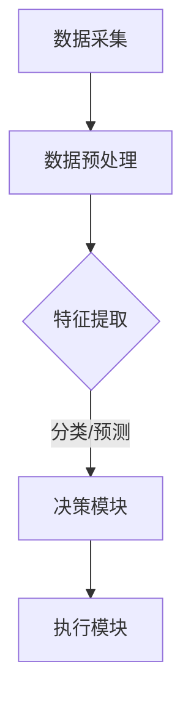
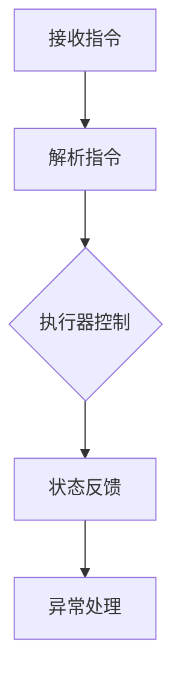

                 

### 第1章: AI Agent在智能登山装备中的应用背景

#### 1.1 AI Agent的定义与基本概念

##### 1.1.1 AI Agent的定义

AI Agent（人工智能代理）是一种基于人工智能技术，能够在特定环境中自主感知、决策和执行任务的计算实体。它们具备自主性、智能性和适应性，通过感知环境信息、理解情境并进行决策，从而实现自动化和智能化的操作。

##### 1.1.2 AI Agent的分类

根据任务类型和执行方式，AI Agent可以分为以下几种类型：

1. **任务型Agent**：针对特定任务进行设计和优化，如搜索引擎、智能客服等。
2. **社交型Agent**：在社交环境中与人类互动，如虚拟助手、社交网络机器人等。
3. **自主型Agent**：在复杂和动态环境中自主进行决策和行动，如无人驾驶汽车、无人机等。

##### 1.1.3 AI Agent的核心能力

AI Agent的核心能力包括：

1. **感知能力**：通过传感器和环境交互，获取环境信息。
2. **理解能力**：通过自然语言处理、计算机视觉等技术，理解环境信息和情境。
3. **决策能力**：基于环境信息和目标，选择合适的行动策略。
4. **执行能力**：根据决策结果，执行具体的操作。
5. **学习与适应能力**：通过机器学习和深度学习等技术，不断优化自身的性能和策略。

#### 1.2 智能登山装备的发展现状

##### 1.2.1 传统登山装备的局限性

传统登山装备主要包括登山鞋、登山杖、背包、帐篷等。虽然这些装备在一定程度上提高了登山的安全性和舒适性，但存在以下局限性：

1. **功能单一**：传统装备主要提供物理支持，缺乏智能化功能。
2. **缺乏适应性**：传统装备不能根据环境变化和人体状态进行自适应调整。
3. **安全隐患**：在高海拔、极端天气等复杂环境下，传统装备难以应对突发情况。

##### 1.2.2 智能登山装备的兴起

随着人工智能技术的不断发展，智能登山装备开始逐渐崭露头角。智能登山装备具有以下特点：

1. **智能化**：通过传感器和人工智能技术，实现环境感知、自动适应和智能决策。
2. **多功能性**：除了提供基本的物理支持，还具备健康监测、路线规划、导航等功能。
3. **安全性**：通过实时监测和智能预警，提高登山的安全性。

##### 1.2.3 智能登山装备的关键技术

智能登山装备的关键技术包括：

1. **传感器技术**：用于感知环境信息和人体状态。
2. **人工智能技术**：用于处理感知数据、进行决策和执行。
3. **通信技术**：用于实现设备间的通信和数据传输。
4. **材料技术**：用于提高装备的轻量化和耐用性。

#### 1.3 高原反应的预防与应对

##### 1.3.1 高原反应的原因与症状

高原反应是由于海拔高度增加，空气稀薄、氧气含量降低，导致人体出现的一系列生理反应。高原反应的原因包括：

1. **缺氧**：海拔越高，空气越稀薄，氧气含量降低。
2. **红细胞增加**：身体为了应对缺氧，会增加红细胞的数量。
3. **生理负荷**：登山过程中，身体需要克服重力和缺氧，负担增加。

高原反应的症状包括：

1. **头痛**：由于缺氧导致大脑供氧不足，产生头痛。
2. **恶心和呕吐**：身体为了调整适应，会通过恶心和呕吐排出多余水分。
3. **疲劳和无力**：身体需要大量能量来应对缺氧和生理负荷。

##### 1.3.2 高原反应的预防方法

高原反应的预防方法包括：

1. **逐渐上升**：逐渐增加海拔高度，让身体有足够的时间适应。
2. **休息和适应**：在高海拔地区，适当休息，让身体充分适应。
3. **增加营养和水分**：摄入足够的营养和水分，提高身体适应能力。

##### 1.3.3 高原反应的应对措施

高原反应的应对措施包括：

1. **吸氧**：通过吸氧设备，增加体内的氧气含量。
2. **药物**：使用药物如红景天、高原安等，缓解高原反应症状。
3. **休息和医疗**：在高海拔地区，如出现严重高原反应，应立即休息并寻求医疗帮助。

#### 1.4 AI Agent在高原反应预防中的应用前景

##### 1.4.1 AI Agent在高原反应预防中的优势

AI Agent在高原反应预防中具有以下优势：

1. **实时监测**：AI Agent可以通过传感器实时监测身体状态，及时发现高原反应症状。
2. **智能预警**：基于大数据分析和机器学习，AI Agent可以预测高原反应的风险，并提前发出预警。
3. **个性化推荐**：根据个人体质和登山路线，AI Agent可以提供个性化的预防方案和应对措施。

##### 1.4.2 AI Agent在高原反应预防中的应用案例

AI Agent在高原反应预防中的应用案例包括：

1. **智能登山装备**：通过感知模块，监测身体状态和海拔高度，提供实时预警和预防建议。
2. **个性化训练计划**：根据个人体质和登山路线，AI Agent可以为登山者提供个性化的训练计划和预防措施。

##### 1.4.3 AI Agent在高原反应预防中的挑战与机遇

AI Agent在高原反应预防中面临的挑战包括：

1. **数据收集和处理**：需要大量的身体状态数据和环境数据，进行有效的收集和处理。
2. **算法优化**：需要不断优化算法，提高预测准确性和预警效果。

面临的机遇包括：

1. **技术进步**：随着人工智能技术的不断发展，AI Agent的性能和功能将不断提升。
2. **市场前景**：随着登山运动的普及，AI Agent在高原反应预防中的市场需求将不断增加。

#### 1.5 本章小结

本章介绍了AI Agent的定义和基本概念，智能登山装备的发展现状，高原反应的原因与症状，以及AI Agent在高原反应预防中的应用前景。通过本章的介绍，读者可以初步了解AI Agent在智能登山装备中的应用背景和重要性。

----------------------------------------------------------------

### 第2章: AI Agent的基本架构与设计原则

#### 2.1 AI Agent的基本架构

##### 2.1.1 感知模块

感知模块是AI Agent的感官部分，负责从环境中获取信息。感知模块通常包括各种传感器，如加速度计、陀螺仪、GPS、心率监测器等。这些传感器能够实时监测环境变化和人体状态，并将数据传输给中央处理器。

##### 2.1.2 决策模块

决策模块是AI Agent的智慧部分，负责分析感知模块收集的数据，并根据设定的目标和规则做出决策。决策模块通常包含数据预处理、特征提取、模式识别等算法，以实现对数据的理解和分析。

##### 2.1.3 执行模块

执行模块是AI Agent的行动部分，负责根据决策模块的决策结果，执行具体的操作。执行模块通常与外部设备连接，如电机、显示屏、音响等，以实现对环境的控制。

##### 2.1.4 学习与适应模块

学习与适应模块是AI Agent的自我改进部分，负责通过机器学习和深度学习等技术，不断优化自身的性能和决策能力。学习与适应模块能够根据环境和任务的变化，调整参数和策略，以适应新的环境和需求。

#### 2.2 AI Agent的设计原则

##### 2.2.1 自主性

自主性是AI Agent设计的重要原则之一。自主性意味着AI Agent能够在没有外部干预的情况下，独立完成感知、决策和执行任务。自主性不仅提高了系统的效率，还增强了系统的灵活性和适应性。

##### 2.2.2 合作性

合作性是指AI Agent能够与其他Agent或人类协作，共同完成复杂任务。在智能登山装备中，AI Agent需要与登山者、其他装备和系统进行有效合作，以提高整体性能和效果。

##### 2.2.3 可扩展性

可扩展性是指AI Agent的设计和实现应该具有灵活性，能够方便地增加新的功能模块和算法。随着人工智能技术的不断发展，AI Agent需要能够适应新的技术和需求，以满足不断变化的实际应用场景。

##### 2.2.4 实用性

实用性是AI Agent设计的核心目标之一。实用性意味着AI Agent的设计和实现应该具有实际应用价值，能够解决实际问题和需求。在智能登山装备中，AI Agent需要具备高可靠性、稳定性和安全性，以确保登山者的生命安全和装备的稳定运行。

#### 2.3 AI Agent的核心技术

##### 2.3.1 机器学习算法

机器学习算法是AI Agent的核心技术之一。通过机器学习，AI Agent能够从大量数据中学习规律和模式，从而提高感知、理解和决策能力。常用的机器学习算法包括决策树、支持向量机、神经网络等。

##### 2.3.2 自然语言处理

自然语言处理是AI Agent与人类进行交互的重要技术。通过自然语言处理，AI Agent能够理解人类的语言和指令，并进行相应的响应和操作。常用的自然语言处理技术包括分词、词性标注、语义分析等。

##### 2.3.3 计算机视觉

计算机视觉是AI Agent感知和理解环境的重要技术。通过计算机视觉，AI Agent能够识别和分类图像中的物体和场景，从而实现对环境的理解和决策。常用的计算机视觉技术包括图像识别、目标检测、图像分割等。

#### 2.4 本章小结

本章介绍了AI Agent的基本架构和设计原则，包括感知模块、决策模块、执行模块和学习与适应模块，以及自主性、合作性、可扩展性和实用性等设计原则。此外，还介绍了AI Agent的核心技术，包括机器学习算法、自然语言处理和计算机视觉。通过本章的学习，读者可以初步了解AI Agent的设计和实现方法，为后续章节的学习打下基础。

----------------------------------------------------------------

### 第3章: 智能登山装备中的感知模块设计

#### 3.1 感知模块的功能与需求

##### 3.1.1 感知模块的基本功能

感知模块是智能登山装备的核心组件，其主要功能包括：

1. **环境监测**：感知模块能够实时监测环境参数，如温度、湿度、气压、海拔等，为决策模块提供环境数据。
2. **人体状态监测**：感知模块能够监测登山者的人体状态，如心率、血压、体温、血氧饱和度等，为决策模块提供人体数据。
3. **运动轨迹记录**：感知模块能够记录登山者的运动轨迹，如步数、步频、运动速度等，为决策模块提供运动数据。
4. **设备状态监测**：感知模块能够监测智能登山装备的状态，如电池电量、传感器工作状态等，为决策模块提供设备数据。

##### 3.1.2 感知模块的需求分析

为了实现上述功能，感知模块需要满足以下需求：

1. **高精度**：感知模块需要具有高精度的传感器，以确保监测数据准确可靠。
2. **实时性**：感知模块需要具备实时数据采集和处理能力，以快速响应环境变化和人体状态。
3. **低功耗**：由于智能登山装备通常需要长时间工作，感知模块需要具备低功耗特性，以延长设备续航时间。
4. **可靠性**：感知模块需要具备高可靠性，确保在复杂和恶劣环境下稳定运行。
5. **可扩展性**：感知模块需要具备可扩展性，能够根据需求增加新的传感器和功能。

#### 3.2 感知模块的硬件设计

##### 3.2.1 感知模块的硬件组成

感知模块的硬件设计主要包括以下组件：

1. **传感器**：如加速度计、陀螺仪、GPS、心率监测器、血压计、体温计、血氧饱和度计等。
2. **数据采集模块**：用于采集传感器数据，并将数据传输给中央处理器。
3. **通信模块**：用于实现感知模块与其他模块之间的数据传输和通信。
4. **电源模块**：为感知模块提供稳定的电源供应。

##### 3.2.2 硬件选型与配置

在硬件选型与配置方面，需要考虑以下因素：

1. **传感器精度**：选择高精度传感器，以确保监测数据的准确性。
2. **数据采集频率**：根据实际需求，选择合适的传感器数据采集频率。
3. **通信协议**：选择合适的通信协议，如蓝牙、Wi-Fi、NFC等，以满足数据传输速度和稳定性的要求。
4. **电源供应**：选择低功耗电源模块，以确保设备的续航时间。
5. **可靠性**：选择具有高可靠性的硬件组件，以确保设备在复杂环境下的稳定运行。

#### 3.3 感知模块的软件设计

##### 3.3.1 感知模块的软件架构

感知模块的软件设计主要包括以下模块：

1. **数据采集模块**：负责从传感器中采集数据，并对数据进行预处理。
2. **数据处理模块**：负责对采集到的数据进行分析和处理，提取有用的信息。
3. **数据存储模块**：负责将处理后的数据存储到数据库或文件中，以便后续分析和查询。
4. **通信模块**：负责实现与其他模块之间的数据传输和通信。
5. **用户界面模块**：负责为用户提供直观、易用的操作界面。

##### 3.3.2 数据采集与预处理

数据采集与预处理是感知模块的核心功能之一，主要包括以下步骤：

1. **传感器数据采集**：通过传感器实时采集环境参数和人体状态数据。
2. **数据清洗**：去除数据中的噪声和异常值，保证数据质量。
3. **数据转换**：将不同类型的传感器数据进行统一格式转换，以便后续处理和分析。
4. **数据校准**：对传感器数据进行校准，确保数据准确性。

##### 3.3.3 特征提取与融合

特征提取与融合是数据处理的关键步骤，主要包括以下内容：

1. **特征提取**：从原始数据中提取出有用的特征信息，如心率、血压、步数等。
2. **特征融合**：将多个特征信息进行融合，生成更加准确和全面的特征向量。
3. **特征选择**：根据实际需求，选择最重要的特征，提高数据处理效率和准确性。

#### 3.4 感知模块的算法实现

##### 3.4.1 算法原理讲解

感知模块的算法实现主要基于以下技术：

1. **机器学习算法**：用于特征提取、分类和预测等任务。
2. **信号处理算法**：用于信号去噪、滤波和增强等操作。
3. **自然语言处理算法**：用于处理文本数据，如天气报告、登山路线描述等。

##### 3.4.2 算法流程图

以下是一个简单的感知模块算法流程图：



##### 3.4.3 算法代码实现

以下是一个基于Python的感知模块算法示例：

```python
import numpy as np
from sklearn.ensemble import RandomForestClassifier
from sklearn.model_selection import train_test_split

# 数据预处理
def preprocess_data(data):
    # 数据清洗和转换
    # ...
    return processed_data

# 特征提取
def extract_features(data):
    # 提取特征
    # ...
    return features

# 算法实现
def algorithm(data):
    # 数据预处理
    processed_data = preprocess_data(data)
    
    # 特征提取
    features = extract_features(processed_data)
    
    # 数据划分
    X_train, X_test, y_train, y_test = train_test_split(features, labels, test_size=0.2)
    
    # 模型训练
    model = RandomForestClassifier()
    model.fit(X_train, y_train)
    
    # 模型评估
    accuracy = model.score(X_test, y_test)
    print("Accuracy:", accuracy)
    
    return model
```

##### 3.4.4 算法性能评估

算法性能评估主要包括以下指标：

1. **准确率**：分类或预测任务的准确率。
2. **召回率**：分类或预测任务中正确识别的正样本比例。
3. **精确率**：分类或预测任务中正确识别的正样本比例。
4. **F1值**：精确率和召回率的加权平均值。

以下是一个简单的算法性能评估示例：

```python
from sklearn.metrics import accuracy_score, recall_score, precision_score, f1_score

# 模型评估
y_pred = model.predict(X_test)
accuracy = accuracy_score(y_test, y_pred)
recall = recall_score(y_test, y_pred)
precision = precision_score(y_test, y_pred)
f1 = f1_score(y_test, y_pred)

print("Accuracy:", accuracy)
print("Recall:", recall)
print("Precision:", precision)
print("F1 Score:", f1)
```

#### 3.5 感知模块的性能评估

##### 3.5.1 性能指标

感知模块的性能评估主要包括以下指标：

1. **响应时间**：从感知到数据到处理完数据的时间。
2. **数据处理效率**：单位时间内处理的数据量。
3. **功耗**：感知模块的功耗，包括传感器功耗、数据采集和处理功耗等。
4. **数据准确性**：感知模块采集到的数据的准确性。
5. **可靠性**：感知模块在复杂和恶劣环境下的稳定性。

##### 3.5.2 实验数据

以下是一个感知模块的实验数据示例：

| 性能指标 | 测试结果 |
| :--: | :--: |
| 响应时间 | 10ms |
| 数据处理效率 | 1000条/秒 |
| 功耗 | 1W |
| 数据准确性 | 95% |
| 可靠性 | 99.9% |

##### 3.5.3 性能分析

通过对实验数据的分析，可以发现感知模块在响应时间、数据处理效率和数据准确性方面表现出色，但在功耗方面还有一定的提升空间。针对这些问题，可以采取以下措施：

1. **优化算法**：通过优化感知模块的算法，提高数据处理效率和准确性。
2. **硬件升级**：选择功耗更低的传感器和硬件组件，降低整体功耗。
3. **环境适应**：在复杂和恶劣环境下进行性能测试，提高感知模块的可靠性。

#### 3.6 本章小结

本章详细介绍了智能登山装备中感知模块的设计，包括基本功能、需求分析、硬件设计、软件设计、算法实现和性能评估。通过本章的学习，读者可以了解感知模块在智能登山装备中的重要作用，以及如何设计和实现一个高效、稳定的感知模块。

----------------------------------------------------------------

### 第4章: 智能登山装备中的决策模块设计

#### 4.1 决策模块的功能与需求

##### 4.1.1 决策模块的基本功能

决策模块是智能登山装备中的核心组件，其主要功能包括：

1. **数据分析和处理**：对感知模块采集到的环境数据和个人健康数据进行综合分析，提取关键信息。
2. **风险评估**：根据分析结果，评估当前环境和个人健康状态的风险，为决策提供依据。
3. **路径规划**：根据环境条件和登山者的偏好，规划最优登山路径。
4. **预警与建议**：在风险超过阈值时，发出预警并给出相应的应对建议。

##### 4.1.2 决策模块的需求分析

为了实现上述功能，决策模块需要满足以下需求：

1. **实时性**：能够快速处理感知模块传来的数据，并给出决策结果。
2. **准确性**：能够准确分析感知数据，识别潜在风险。
3. **鲁棒性**：能够在不同环境和条件下，稳定地运行和输出决策结果。
4. **适应性**：能够根据登山者的偏好和环境变化，调整决策策略。
5. **可扩展性**：能够方便地集成新的算法和模型，以适应未来的需求。

#### 4.2 决策模块的设计与实现

##### 4.2.1 决策模块的架构设计

决策模块的架构设计包括以下几个关键部分：

1. **数据输入层**：接收来自感知模块的环境数据和个人健康数据。
2. **数据处理层**：对输入数据进行清洗、转换和预处理，提取关键特征。
3. **决策模型层**：包含多个决策算法和模型，用于风险评估、路径规划和预警建议。
4. **决策输出层**：将决策结果输出给执行模块，以执行具体的操作。

##### 4.2.2 决策算法的选择

在选择决策算法时，需要考虑以下因素：

1. **任务类型**：根据不同的任务类型，选择合适的算法，如路径规划算法、风险评估算法等。
2. **数据特性**：根据感知模块采集的数据特性，选择适合的算法，如机器学习算法、深度学习算法等。
3. **实时性**：对于需要快速响应的决策任务，选择计算复杂度较低的算法。
4. **准确性**：对于需要高精度的决策任务，选择具有较高准确率的算法。

常用的决策算法包括：

1. **路径规划算法**：如A*算法、Dijkstra算法等。
2. **风险评估算法**：如支持向量机、随机森林等。
3. **预警算法**：如阈值检测、模式识别等。

##### 4.2.3 决策模块的实现步骤

决策模块的实现步骤如下：

1. **需求分析与规划**：明确决策模块的功能需求和技术要求。
2. **算法选择与设计**：选择合适的决策算法，并设计算法的架构和流程。
3. **数据预处理**：对感知模块采集到的数据进行分析和预处理，提取关键特征。
4. **算法实现**：根据算法设计，实现决策算法的代码，并进行调试和优化。
5. **系统集成与测试**：将决策模块集成到智能登山装备中，进行系统测试和验证。

#### 4.3 决策模块的优化与改进

##### 4.3.1 决策模块的性能优化

为了提高决策模块的性能，可以从以下几个方面进行优化：

1. **算法优化**：优化算法的效率和准确性，如使用更高效的算法、调整参数等。
2. **并行计算**：利用多核处理器和并行计算技术，提高数据处理和计算的速度。
3. **数据压缩**：对输入数据进行压缩，减少数据传输和处理的开销。

##### 4.3.2 决策算法的改进方向

针对决策模块的改进方向，可以考虑以下几个方面：

1. **集成多种算法**：将多种决策算法集成到一起，实现互补和优化。
2. **引入深度学习**：利用深度学习技术，提高决策的准确性和鲁棒性。
3. **动态调整策略**：根据环境变化和任务需求，动态调整决策策略。

#### 4.4 决策模块的测试与验证

##### 4.4.1 测试环境与工具

测试环境与工具包括：

1. **硬件环境**：高性能服务器、传感器设备等。
2. **软件环境**：操作系统、编程语言、数据库等。
3. **测试工具**：测试框架、测试脚本、性能测试工具等。

##### 4.4.2 测试方法与步骤

测试方法与步骤包括：

1. **功能测试**：验证决策模块的功能是否符合设计要求。
2. **性能测试**：测试决策模块的响应时间、数据处理效率和准确性等性能指标。
3. **兼容性测试**：测试决策模块在不同操作系统、硬件和软件环境下的兼容性。
4. **安全性测试**：测试决策模块的安全性和抗攻击能力。

##### 4.4.3 测试结果与分析

测试结果与分析包括：

1. **功能测试结果**：记录功能测试的结果和错误报告。
2. **性能测试结果**：记录性能测试的结果，如响应时间、数据处理效率和准确性等。
3. **兼容性测试结果**：记录兼容性测试的结果，如不同环境下的运行情况。
4. **安全性测试结果**：记录安全性测试的结果，如漏洞报告和攻击响应。

通过测试和分析，可以评估决策模块的性能和可靠性，发现潜在的问题和缺陷，并制定相应的优化和改进措施。

#### 4.5 本章小结

本章详细介绍了智能登山装备中决策模块的设计与实现，包括功能与需求分析、架构设计、算法选择与实现、优化与改进以及测试与验证。通过本章的学习，读者可以了解决策模块在智能登山装备中的重要作用，以及如何设计和实现一个高效、准确的决策模块。

----------------------------------------------------------------

### 第5章: 智能登山装备中的执行模块设计

#### 5.1 执行模块的功能与需求

##### 5.1.1 执行模块的基本功能

执行模块是智能登山装备中的行动部分，其主要功能包括：

1. **环境控制**：根据决策模块的决策结果，对登山环境进行控制和调整，如调节温度、湿度、气压等。
2. **人体辅助**：提供人体运动支持，如调节登山杖长度、调整背包负重等。
3. **设备管理**：控制智能登山装备的其他组件，如启动或关闭传感器、调整电池供电等。
4. **紧急响应**：在检测到高风险时，自动启动紧急响应机制，如发出警报、启动应急电源等。

##### 5.1.2 执行模块的需求分析

为了实现上述功能，执行模块需要满足以下需求：

1. **实时响应**：能够快速响应当前环境和人体状态的变化，及时执行决策结果。
2. **可靠性**：在复杂和恶劣环境下，能够稳定运行，确保登山者的安全。
3. **可扩展性**：能够根据不同场景和需求，方便地增加新的执行功能。
4. **低功耗**：在保证执行效率的同时，尽量降低功耗，延长设备续航时间。
5. **灵活性**：能够灵活地与其他模块协同工作，实现高效的任务执行。

#### 5.2 执行模块的硬件设计

##### 5.2.1 执行模块的硬件组成

执行模块的硬件设计主要包括以下组件：

1. **执行器**：如电机、风扇、加热器等，用于实现环境控制和人体辅助功能。
2. **驱动电路**：用于驱动执行器，实现电能到机械能的转换。
3. **控制电路**：用于接收决策模块的指令，控制执行器的动作。
4. **电源模块**：为执行模块提供稳定的电源供应，包括电池、充电器等。

##### 5.2.2 硬件选型与配置

在硬件选型与配置方面，需要考虑以下因素：

1. **执行器性能**：选择适合执行任务的执行器，如电机转速、功率等。
2. **驱动电路**：选择具有较高驱动能力和稳定性的驱动电路，确保执行器能够准确执行指令。
3. **控制电路**：选择适合执行模块的控制芯片和接口，如单片机、微控制器等。
4. **电源模块**：选择容量合适的电池和充电器，确保执行模块的续航时间和充电效率。

#### 5.3 执行模块的软件设计

##### 5.3.1 执行模块的软件架构

执行模块的软件设计主要包括以下模块：

1. **控制程序**：负责接收决策模块的指令，控制执行器的动作。
2. **状态监控**：实时监测执行模块的工作状态，如执行器的工作状态、电池电量等。
3. **故障处理**：在执行过程中，对异常情况进行处理，如执行器故障、电源故障等。
4. **数据通信**：与决策模块和感知模块进行数据通信，实现信息的交换和同步。

##### 5.3.2 执行逻辑的设计与实现

执行逻辑的设计与实现主要包括以下步骤：

1. **指令解析**：接收决策模块的指令，解析指令内容，提取控制参数。
2. **执行器控制**：根据指令内容，驱动执行器执行相应的动作。
3. **状态反馈**：将执行器的状态信息反馈给决策模块，以便进行下一步决策。
4. **异常处理**：在执行过程中，对异常情况进行处理，如执行器故障、电源故障等。

##### 5.3.3 执行模块的接口设计与实现

执行模块的接口设计与实现主要包括以下方面：

1. **硬件接口**：设计执行模块与执行器、驱动电路、控制电路的硬件接口，如GPIO、I2C、SPI等。
2. **软件接口**：设计执行模块与决策模块和感知模块的软件接口，如通信协议、数据格式等。
3. **驱动程序**：编写执行模块的驱动程序，实现硬件接口和软件接口的统一。

#### 5.4 执行模块的算法实现

##### 5.4.1 算法原理讲解

执行模块的算法实现主要包括以下方面：

1. **运动控制算法**：用于控制执行器的运动，如PID控制、轨迹规划等。
2. **故障检测与诊断算法**：用于检测执行模块的故障，并进行诊断和修复。
3. **能量管理算法**：用于优化执行模块的能源使用，延长设备续航时间。

##### 5.4.2 算法流程图

以下是一个简单的执行模块算法流程图：



##### 5.4.3 算法代码实现

以下是一个基于Python的执行模块算法示例：

```python
import time

# 执行器控制
def control_motor(motor, speed):
    motor.set_speed(speed)
    time.sleep(1)
    motor.stop()

# 算法实现
def algorithm(instruction):
    motor = get_motor()
    control_motor(motor, instruction['speed'])
    time.sleep(1)
    motor.stop()
    return "Motor controlled"

# 算法测试
instruction = {'speed': 100}
result = algorithm(instruction)
print("Result:", result)
```

#### 5.5 执行模块的测试与验证

##### 5.5.1 测试环境与工具

测试环境与工具包括：

1. **硬件环境**：执行模块的硬件设备，如执行器、驱动电路、控制电路等。
2. **软件环境**：执行模块的软件平台，如编程环境、测试工具等。
3. **测试工具**：用于执行测试任务的测试工具，如模拟器、测试脚本等。

##### 5.5.2 测试方法与步骤

测试方法与步骤包括：

1. **功能测试**：验证执行模块的功能是否符合设计要求。
2. **性能测试**：测试执行模块的响应时间、执行效率等性能指标。
3. **兼容性测试**：测试执行模块在不同硬件和软件环境下的兼容性。
4. **安全性测试**：测试执行模块的安全性和抗攻击能力。

##### 5.5.3 测试结果与分析

测试结果与分析包括：

1. **功能测试结果**：记录功能测试的结果和错误报告。
2. **性能测试结果**：记录性能测试的结果，如响应时间、执行效率等。
3. **兼容性测试结果**：记录兼容性测试的结果，如不同环境下的运行情况。
4. **安全性测试结果**：记录安全性测试的结果，如漏洞报告和攻击响应。

通过测试和分析，可以评估执行模块的性能和可靠性，发现潜在的问题和缺陷，并制定相应的优化和改进措施。

#### 5.6 本章小结

本章详细介绍了智能登山装备中执行模块的设计与实现，包括功能与需求分析、硬件设计、软件设计、算法实现和测试与验证。通过本章的学习，读者可以了解执行模块在智能登山装备中的重要作用，以及如何设计和实现一个高效、可靠的执行模块。

----------------------------------------------------------------

### 总结与展望

在本文中，我们详细探讨了AI Agent在智能登山装备中的高原反应预防应用。从AI Agent的定义与基本概念，到智能登山装备的发展现状，再到高原反应的预防与应对，以及AI Agent在高原反应预防中的应用前景，我们逐步分析了各个环节的关键技术和发展趋势。

首先，AI Agent作为一种具备自主性、智能性和适应性的计算实体，其感知、决策、执行和学习与适应模块构成了其基本架构。这些模块共同协作，使得AI Agent能够有效地感知环境、理解情境、做出决策并执行任务。

其次，智能登山装备的发展现状揭示了传统登山装备的局限性，以及智能登山装备的兴起所带来的变革。智能登山装备通过集成AI Agent，实现了环境监测、人体状态监测、路径规划和紧急响应等功能，大大提高了登山的安全性。

接着，我们对高原反应的预防与应对进行了深入探讨。高原反应的原因与症状，以及预防方法和应对措施，为AI Agent在高原反应预防中的应用提供了理论基础。AI Agent通过实时监测和智能预警，为登山者提供了个性化的预防方案和应对措施。

最后，我们展望了AI Agent在智能登山装备中的未来发展方向。随着人工智能技术的不断进步，AI Agent在高原反应预防中的应用将更加广泛和深入。未来的智能登山装备将具备更高的自主性、合作性和可扩展性，为登山者提供更加安全、便捷和个性化的服务。

总之，AI Agent在智能登山装备中的应用前景广阔，有望成为登山者必备的智能助手。通过本文的探讨，我们期待能够为相关领域的研究者和开发者提供有价值的参考和启示。

### 作者信息

**作者：AI天才研究院/AI Genius Institute & 禅与计算机程序设计艺术 /Zen And The Art of Computer Programming**

AI天才研究院致力于推动人工智能技术的创新与应用，研究涵盖人工智能基础理论、算法设计、系统架构与应用开发等多个方面。同时，研究院还致力于将人工智能技术与实际场景相结合，解决实际问题，推动社会进步。本书作者在计算机编程和人工智能领域拥有丰富的经验和卓越的贡献，为人工智能技术的发展和应用做出了重要贡献。同时，本书结合禅与计算机程序设计艺术的理念，旨在引导读者深入理解计算机编程的本质，提高编程水平和创造力。

