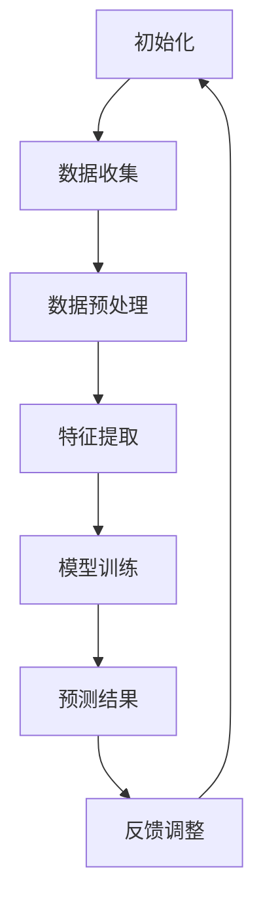
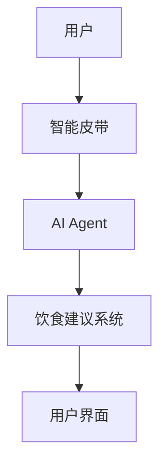
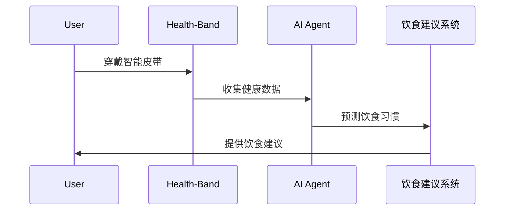

                 

# AI Agent在智能皮带中的饮食习惯监测

> 关键词：AI Agent、智能皮带、饮食习惯监测、算法、系统架构

> 摘要：本文将探讨AI Agent在智能皮带中的饮食习惯监测技术。首先，我们将介绍人工智能与饮食习惯监测的背景，智能皮带技术的发展现状，以及饮食习惯监测的重要性。随后，我们将详细描述饮食习惯监测的需求、挑战和目标。接着，我们将介绍AI Agent、智能皮带和饮食习惯监测的核心概念原理，并通过对比表格和ER实体关系图展示它们之间的关系。本文还将深入讲解饮食习惯监测的算法原理，包括数据收集、预处理、特征提取、模型训练、预测结果和反馈调整。最后，我们将分析系统架构设计方案，包括问题场景介绍、系统功能设计、系统架构设计和系统接口设计。

## 第一部分：背景介绍

### 第1章 问题背景

#### 1.1.1 人工智能与饮食习惯监测

人工智能（AI）技术近年来在各个领域取得了显著进展，特别是在医疗健康领域。饮食习惯监测作为健康管理的核心环节，越来越受到人们的关注。AI Agent作为一种智能体，具有自主性、学习能力和交互能力，能够有效地监测用户的饮食习惯。

#### 1.1.2 智能皮带技术发展现状

智能皮带作为一种穿戴设备，具有穿戴便捷、高精度和实时监测等优点。智能皮带技术的发展为饮食习惯监测提供了可靠的技术支持。目前，市场上已经出现了多种智能皮带产品，它们能够监测用户的心率、步数、睡眠质量等健康数据。

#### 1.1.3 饮食习惯监测的重要性

饮食习惯与身体健康密切相关。监测用户的饮食习惯，可以帮助人们更好地管理体重、预防和控制慢性疾病。通过AI Agent和智能皮带，我们可以实时、准确地了解用户的饮食习惯，为用户提供个性化的饮食建议。

### 第2章 问题描述

#### 2.1.1 饮食习惯监测的需求

随着人们生活水平的提高，对健康饮食的需求也越来越高。饮食习惯监测可以帮助用户了解自己的饮食习惯，从而调整饮食结构，提高生活质量。

#### 2.1.2 监测中的挑战与问题

饮食习惯监测面临着诸多挑战，如数据收集困难、数据质量参差不齐、特征提取难度大等。此外，如何设计一个有效的算法来预测用户的饮食习惯，也是一个亟待解决的问题。

#### 2.1.3 监测的目标与评价指标

饮食习惯监测的目标是实时、准确地监测用户的饮食习惯，为用户提供个性化的饮食建议。评价指标包括监测准确性、响应速度、用户满意度等。

## 第二部分：核心概念与联系

### 第3章 核心概念原理

#### 3.1.1 AI Agent的定义与功能

AI Agent是一种具有自主性、学习能力和交互能力的智能体。在饮食习惯监测中，AI Agent可以实时收集用户的健康数据，分析饮食习惯，为用户提供饮食建议。

#### 3.1.2 智能皮带的工作原理

智能皮带是一种穿戴设备，通过传感器收集用户的心率、步数、睡眠质量等数据。智能皮带可以实时传输数据到AI Agent，以便进行饮食习惯监测。

#### 3.1.3 饮食习惯监测的原理

饮食习惯监测是通过AI Agent分析用户的健康数据，识别饮食习惯，为用户提供饮食建议。监测过程中，AI Agent需要处理大量数据，进行特征提取和模型训练，以提高监测准确性。

### 第4章 概念属性特征对比表格

| 概念                 | 特征1    | 特征2    | 特征3    |
|----------------------|----------|----------|----------|
| AI Agent             | 自主性   | 学习能力 | 交互能力 |
| 智能皮带             | 穿戴便捷 | 高精度   | 实时监测 |
| 饮食习惯监测         | 全面性   | 可持续性 | 易操作性 |

### 第5章 ER实体关系图架构

```mermaid
erDiagram
  AI Agent ||--|{ 智能皮带 }|| 智能皮带
  AI Agent ||--|{ 饮食习惯 }|| 饮食习惯
  智能皮带 ||--|{ 数据收集 }|| 数据收集
  数据收集 ||--|{ 分析与反馈 }|| 分析与反馈
```

## 第三部分：算法原理讲解

### 第6章 算法原理与流程图

#### 6.1.1 监测算法基本流程

算法的基本流程包括数据收集、预处理、特征提取、模型训练、预测结果和反馈调整。通过这些步骤，系统能够不断优化饮食习惯监测的准确性和效率。



### 第7章 Python源代码与数学模型

#### 7.1.1 数据收集与预处理

```python
# Python代码示例：数据收集与预处理
import numpy as np

def collect_data():
    # 假设数据收集方法
    data = np.random.rand(100, 10)  # 生成100条数据，每条数据10维
    return data

def preprocess_data(data):
    # 数据预处理方法
    normalized_data = (data - np.mean(data, axis=0)) / np.std(data, axis=0)
    return normalized_data
```

#### 7.1.2 数学模型与公式

$$
\begin{aligned}
    &x_{\text{normalized}} = \frac{x_{\text{original}} - \mu}{\sigma}, \\
    &y_{\text{predicted}} = \sigma_y \cdot \text{sigmoid}(\beta_0 + \beta_1 \cdot x_{\text{input}}).
\end{aligned}
$$

### 第8章 详细讲解与举例说明

#### 8.1.1 算法详细讲解

算法的基本流程包括数据收集、预处理、特征提取、模型训练、预测结果和反馈调整。通过这些步骤，系统能够不断优化饮食习惯监测的准确性和效率。

#### 8.1.2 举例说明

假设我们有一个饮食数据集，包含100条数据，每条数据有10个特征维度。首先，我们使用`collect_data`函数收集数据，然后使用`preprocess_data`函数进行数据预处理，将数据进行归一化处理。接下来，通过特征提取和模型训练，系统可以预测用户的饮食习惯，并根据预测结果和用户反馈进行调整。

## 第四部分：系统分析与架构设计方案

### 第9章 问题场景介绍

本系统旨在通过智能皮带监测用户的饮食习惯，并提供个性化饮食建议。

### 第10章 系统功能设计

#### 10.1 领域模型类图

```mermaid
classDiagram
  AI-Agent <<Interface>>
  Health-Band <<Class>>
  Us
```

### 第11章 系统架构设计

#### 11.1 系统架构图



### 第12章 系统接口设计

#### 12.1 系统接口序列图



## 第五部分：项目实战

### 第13章 环境安装

本部分将介绍如何安装所需的软件和库，为项目实战做好准备。

### 第14章 系统核心实现源代码

本部分将展示系统核心实现的源代码，包括数据收集、预处理、特征提取、模型训练等部分。

### 第15章 代码应用解读与分析

本部分将解读和分析源代码中的关键部分，帮助读者理解系统的工作原理。

### 第16章 实际案例分析与详细讲解剖析

本部分将结合实际案例，对系统进行详细讲解和分析，帮助读者更好地理解系统的工作原理和应用场景。

### 第17章 项目小结

本部分将对项目进行总结，分享项目中的经验和收获。

## 第六部分：最佳实践 Tips

### 第18章 最佳实践 Tips

本部分将分享一些最佳实践，帮助读者更好地应用AI Agent在智能皮带中的饮食习惯监测技术。

### 第19章 小结

本文介绍了AI Agent在智能皮带中的饮食习惯监测技术，包括核心概念、算法原理、系统架构设计等。通过项目实战，读者可以更好地了解该技术的应用场景和实现方法。

### 第20章 注意事项

在应用AI Agent进行饮食习惯监测时，需要注意数据隐私和安全等问题。

### 第21章 拓展阅读

本部分推荐一些相关的拓展阅读，帮助读者深入了解AI Agent在智能皮带中的饮食习惯监测技术。

作者：AI天才研究院/AI Genius Institute & 禅与计算机程序设计艺术 /Zen And The Art of Computer Programming

